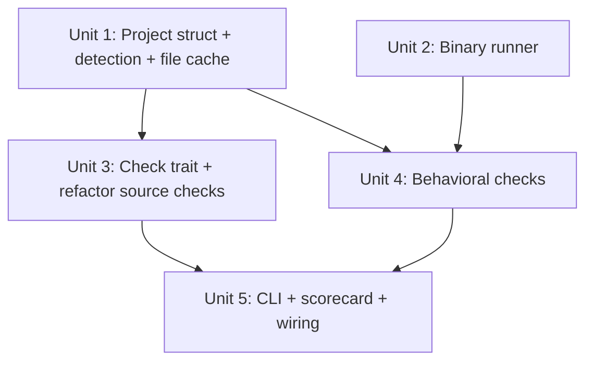

# feat: Implement Check trait, Project struct, and behavioral checks

## Overview

Transform agentnative from a spike demo into a real CLI linter. This implements the core abstractions (Check trait,
Project struct with lazy file cache), project auto-detection for 4 languages, 8 behavioral checks via a multi-threaded
BinaryRunner, and the clap CLI with JSON scorecard output. The 3 existing PoC source checks are refactored into a
language-partitioned module structure designed for fast-follow Python support.

## Problem Frame

The ast-grep spike validated that source-level pattern matching works (3 checks, 18 tests). But the project has no CLI,
no behavioral checks, no project detection, and no trait abstraction. The design doc specifies a two-layer check system
(behavioral + source) with a `Check` trait unifying them, auto-detection of project language and binary paths, and
structured JSON output. This plan covers design doc Next Steps #3 (scaffold core abstractions) and #4 (behavioral
checks).

## Requirements Trace

- R1. All checks implement `Check` trait with `fn run(&self, project: &Project) -> Result<CheckResult>`
- R2. `Project` struct supports auto-detection of language, binary paths, and manifest for Rust, Python, Go, and Node
- R3. 8 behavioral checks run against compiled binaries with 5s timeout and proper error handling
- R4. Existing 3 source checks refactored to implement the Check trait
- R5. clap CLI with `check` subcommand, `--binary`, `--source`, `--principle`, `--output json` flags
- R6. JSON scorecard output matches the schema in the design doc (via `CheckResultView` struct)
- R7. Text scorecard output grouped by principle
- R8. Exit codes: 0 = all pass, 1 = any warn, 2 = any fail/error (matches eng review spec)
- R9. agentnative itself is agent-native: `--output json`, `--quiet`, `NO_COLOR`, SIGPIPE, non-interactive
- R10. Shell completions subcommand via `clap_complete`

## Scope Boundaries

- Source checks beyond the 3 existing PoC are NOT in scope (those are Next Step #5)
- Project checks (AGENTS.md, dependencies) are NOT in scope
- `--fix` is deferred to v0.2
- `--init` is deferred to v0.3
- `--command <name>` (PATH lookup) is deferred
- Fixture test projects (`tests/fixtures/`) are deferred to the implementation phase of the remaining checks
- Python source checks are NOT in scope (but the module structure supports fast-follow)
- Cargo workspace handling is deferred to v0.2

## Auto-Detection Mode Matrix

| Scenario | Binary? | Source? | What runs |
|----------|:-------:|:-------:|-----------|
| `anc check ./project/` (Rust, built) | yes | yes | behavioral + source |
| `anc check ./project/` (Rust, not built) | no | yes | source only, warn "build for full coverage" |
| `anc check ./project/` (Python) | maybe | yes | behavioral (if binary found) + source (when checks exist) |
| `anc check ./project/` (unknown lang) | no | no | warn "no checks applicable" |
| `anc check /usr/bin/rg` (executable file) | yes | no | behavioral only |
| `anc check . --binary target/debug/foo` | yes | skip | behavioral only (forced) |
| `anc check . --source` | skip | yes | source only (forced) |

Behavioral checks are always language-agnostic. Source checks are language-specific. The orchestrator selects which
source check set based on `Project.language`.

## Context & Research

### Relevant Code and Patterns

- `src/types.rs` -- existing `CheckStatus`, `CheckResult`, `CheckGroup`, `CheckLayer`, `SourceLocation` types with serde
  derives. The Check trait and Project struct will extend this module or live in new dedicated modules.
- `src/source.rs` -- `find_pattern_matches()` and `scan_rust_files()` validated against ast-grep-core =0.42.0
- `src/checks/*.rs` -- 3 PoC checks following `pub fn check_<name>(source, file) -> CheckResult` signature
- `src/main.rs` -- spike demo, will be replaced with clap CLI

### Institutional Learnings

- **Subprocess transport layer** (`docs/solutions/architecture-patterns/xurl-subprocess-transport-layer.md`):
  `Command::new(path).args(args)` with `Stdio::piped()`, `NO_COLOR=1`, binary path validation (exists -> canonicalize ->
  is_file -> is_executable). Reader threads for stdout/stderr capture. (see origin: xurl-rs transport)
- **SIGPIPE fix** (`docs/solutions/architecture-patterns/shell-completions-main-dependency-gating.md`): Must add `unsafe
  { libc::signal(libc::SIGPIPE, libc::SIG_DFL); }` at top of `main()` before any I/O. (see origin: bird CLI)
- **Quiet flag pattern** (`docs/solutions/architecture-patterns/quiet-flag-diagnostic-suppression-pattern.md`):
  `FalseyValueParser` for env-backed booleans, classification rule for gatable vs fatal output. (see origin: bird CLI)
- **Error handling pattern** (`docs/solutions/security-issues/rust-cli-security-code-quality-audit.md`): Extract `run()`
  from `main()`, return `Result<(), AppError>`. Structured error enum with exit code mapping. (see origin: bird)
- **SRP checks** (`docs/solutions/best-practices/reliable-static-analysis-compliance-checkers-20260327.md`): One Check
  per independently-verifiable requirement, binary PASS/FAIL. No composite checks.
- **ast-grep is syntactic only** (`docs/solutions/tooling/go-to-rust-transpiler-architecture.md`): tree-sitter provides
  CSTs without semantic analysis. Source checks must target syntactic patterns only.

## Key Technical Decisions

- **Check trait returns `Result<CheckResult, anyhow::Error>`**: The trait distinguishes internal tool errors (`Err`)
  from target program issues (`Ok(CheckStatus::Error)`). During early development, this tells us whether a failure is
  our bug or the checked program's issue. The orchestrator converts `Err` to `CheckStatus::Error` for user-facing
  output, so other checks continue regardless.
- **Check trait has `applicable()` method**: `fn applicable(&self, project: &Project) -> bool` lets the orchestrator
  skip inapplicable checks (e.g., behavioral checks when no binary exists) without every check reimplementing that
  logic.
- **BinaryRunner uses reader threads with `Arc<Mutex<Child>>`**: `wait_with_output(self)` consumes Child, making timeout
  kill impossible. Instead: take stdout/stderr handles from Child, spawn reader threads, share Child via
  `Arc<Mutex<Child>>`, timeout thread calls `child.kill()` through the Mutex (safe, no PID recycling). Supports both
  full-capture (`run()`) and partial-capture (`run_partial()`) modes.
- **BinaryRunner caches `--help` output**: Multiple behavioral checks (Help, JsonOutput, Quiet, NoColor) parse `--help`.
  Runner caches results keyed by `(args, env)` to avoid redundant invocations.
- **BinaryRunner has `run_partial()` for SigpipeCheck**: `run_partial(args, read_bytes)` spawns the child, reads up to
  `read_bytes` from stdout, drops the stdout handle to trigger SIGPIPE, then waits for exit. This keeps all process
  management in one place.
- **Project has lazy parsed-file cache**: `Project` holds a `HashMap<PathBuf, ParsedFile>` lazily populated on first
  access. Source checks call `project.parsed_files()` instead of independently walking and parsing. Single walk, single
  AST parse per file, shared across all source checks.
- **Source checks exclude test code**: `scan_rust_files()` skips `tests/` and `target/` directories by default. ast-grep
  filters out nodes inside `#[cfg(test)]` modules. `--include-tests` flag available for full scanning.
- **Language-partitioned source checks**: Source checks organized as `src/checks/source/rust/`,
  `src/checks/source/python/` (empty initially). Adding Python means creating check files in `source/python/` and a
  registry function. All check files are Rust code using ast-grep with language-specific tree-sitter grammars.
- **`toml` crate for manifest parsing**: Proper TOML parsing instead of line-by-line string matching. Handles inline
  tables, comments, workspace inheritance. Already a transitive dep in the Cargo ecosystem.
- **`has_pattern()` DRY consolidation**: The duplicated `has_pattern()` in `no_color.rs` and `global_flags.rs` moves to
  `source.rs` as a public function alongside the existing `find_pattern_matches()`.
- **Exit codes match eng review**: 0 = all pass, 1 = any warn, 2 = any fail/error. Three-code scheme preserves the
  "warnings only, safe to proceed" vs "hard failures" distinction for shell-script consumers.
- **`CheckResultView` for JSON output**: A separate view struct in `scorecard.rs` serializes to the exact design doc
  JSON schema, decoupling internal `CheckStatus` serde representation from the public API contract.
- **Module structure**: New modules `src/project.rs` (Project struct, detection, file cache), `src/runner.rs` (binary
  execution, timeout, caching), `src/cli.rs` (clap definitions), `src/scorecard.rs` (output formatting, view structs),
  `src/check.rs` (trait definition). Source checks in `src/checks/source/rust/`. Behavioral checks in
  `src/checks/behavioral/`.

## Open Questions

### Resolved During Planning

- **Should behavioral checks share a BinaryRunner?**: Yes. Create once in the orchestrator, pass to all behavioral
  checks. Runner caches `--help` results to avoid redundant invocations.
- **How to handle multiple `[[bin]]` targets?**: `Project.binary_paths` is `Vec<PathBuf>` per the design doc. For v0.1,
  behavioral checks run against the first binary found. Multi-binary scoring is a later enhancement.
- **Where does `ConditionalCheck` fit?**: Not needed yet. The 3 source checks don't use it. Behavioral checks don't need
  it (they check if a flag exists before testing it). Defer `ConditionalCheck` until the MEDIUM source checks are
  implemented in Next Step #5.
- **How to handle the timeout kill safely?**: Use `Arc<Mutex<Child>>` so the timeout thread calls `child.kill()` through
  the Mutex handle. Never use raw PIDs -- avoids the PID recycling race condition.
- **How to handle SigpipeCheck?**: BinaryRunner provides `run_partial()` that reads N bytes then drops the pipe. Keeps
  all process management centralized.
- **Should source checks scan test code?**: No by default. Path-based exclusion (`tests/`, `target/`) + AST-level
  exclusion (`#[cfg(test)]` modules). `--include-tests` flag overrides.
- **Exit code scheme?**: Restored to 0/1/2 per the eng review test plan, matching the design doc.
- **Check trait return type?**: `Result<CheckResult, anyhow::Error>`. Distinguishes tool bugs (`Err`) from target
  program issues (`Ok(CheckStatus::Error)`). Orchestrator converts `Err` to `CheckStatus::Error` so other checks
  continue.

### Deferred to Implementation

- **Exact SIGPIPE test approach**: Testing that `agentnative check . | head -1` doesn't panic requires an integration
  test with assert_cmd that pipes output. The exact mechanism depends on what assert_cmd supports.
- **`--quiet` output contract**: What exactly does `--quiet` suppress for agentnative itself? Likely: suppress the
  principle group headers and only show FAIL/WARN lines + summary. Determine during implementation.
- **Behavioral check exact invocation strategies**: JsonOutputCheck subcommand discovery, QuietCheck comparison command,
  SigpipeCheck pipe buffer handling -- these have known design gaps. The implementer should start with the described
  approach and refine based on real-world behavior.

## High-Level Technical Design

> *This illustrates the intended approach and is directional guidance for review, not implementation specification. The
> implementing agent should treat it as context, not code to reproduce.*

```text
CLI Layer (src/cli.rs)
  agentnative check <path> [--binary|--source] [--principle N] [--output json] [--quiet]
  agentnative completions <shell>
  Note: check is default subcommand via Option<Commands> pattern (clap has no built-in default)
         |
         v
Project Detection (src/project.rs)
  path -> detect language (Rust/Python/Go/Node) -> find binary -> build Project struct
  Project holds lazy parsed-file cache for source checks
         |
         v
Check Orchestration (src/main.rs::run())
  Determine mode from flags + auto-detection matrix
  Create BinaryRunner once (if binary available)
  Select checks:
    behavioral::all()                          -- if binary available AND not --source
    source::rust::all() / source::python::all() -- if language detected AND not --binary
  Filter by --principle if specified
  Run checks: check.applicable(project) -> check.run(project) -> Result<CheckResult>
  Convert any Err to CheckStatus::Error
         |
         v
Scorecard Output (src/scorecard.rs)
  Vec<CheckResult> -> CheckResultView (design doc JSON schema) -> format as text or JSON
         |
         v
Exit Code
  all pass -> 0, any warn -> 1, any fail/error -> 2
```

**Binary Runner flow:**

```text
BinaryRunner::run(args, env)            -- full capture, cached by (args, env)
BinaryRunner::run_partial(args, bytes)  -- partial capture for SigpipeCheck

  -> Command::new(binary).args(args).env("NO_COLOR", "1").stdin(null).stdout(piped).stderr(piped)
  -> spawn child, wrap in Arc<Mutex<Child>>
  -> take stdout/stderr handles, spawn reader threads
  -> spawn timeout watcher: sleep(5s), lock mutex, child.kill()
  -> child.wait() on main thread
  -> classify: Ok(output) | Timeout | Crash(signal) | PermissionDenied | NotFound
```

**Source check module structure:**

```text
src/checks/
  mod.rs                    -- top-level, re-exports behavioral + source
  behavioral/
    mod.rs                  -- all_behavioral_checks()
    help.rs, version.rs, json_output.rs, bad_args.rs,
    quiet.rs, sigpipe.rs, non_interactive.rs, no_color.rs
  source/
    mod.rs                  -- dispatches to language module based on Project.language
    rust/
      mod.rs                -- all_rust_checks()
      unwrap.rs, global_flags.rs, no_color.rs
    python/                 -- fast follow, empty initially
      mod.rs                -- all_python_checks() -> vec![]
```

## Implementation Units



- [ ] **Unit 1: Project struct, auto-detection, and lazy file cache**

  **Goal:** Define the Project struct with language detection, binary discovery, and lazy parsed-file cache.

  **Requirements:** R2

  **Dependencies:** None

  **Files:**
- Create: `src/project.rs`
- Modify: `src/main.rs` (add `mod project;`)
- Modify: `Cargo.toml` (add `toml` crate dependency)
- Test: `src/project.rs` (inline `#[cfg(test)]` module)

  **Approach:**
- Define `Language` enum: `Rust`, `Python`, `Go`, `Node`
- Define `Project` struct: `path: PathBuf`, `language: Option<Language>`, `binary_paths: Vec<PathBuf>`, `manifest_path:
  Option<PathBuf>`, `parsed_files: LazyFileCache` (populated on first access)
- `LazyFileCache` wraps `RefCell<HashMap<PathBuf, ParsedFile>>` where `ParsedFile` contains `source: String` and the AST
  root. Lazily populated when source checks first request files. Excludes `tests/`, `target/` by default.
- `Project::discover(path: &Path) -> Result<Project>`:
- If path is an executable file: return Project with binary_paths = [path], no language
- If path is a directory: detect language from manifest, discover binary paths per language
- Language detection: `Cargo.toml` -> Rust, `pyproject.toml` -> Python, `go.mod` -> Go, `package.json` -> Node
- Binary discovery for Rust: parse `[[bin]]` names from Cargo.toml using `toml` crate, look in `target/release/` then
  `target/debug/`
- Binary discovery for Python/Go/Node: parse entry point names from manifest, `which <name>` lookup. Return empty
  binary_paths if not found (no error -- behavioral checks simply won't run).

  **Patterns to follow:**
- `source.rs` walkdir pattern for filesystem traversal (extended with path exclusions)
- Startup path validation from xurl-rs transport layer solution: exists -> canonicalize -> is_file

  **Test scenarios:**
- Happy path: Rust project directory with Cargo.toml -> detects Rust, finds binary in target/debug/
- Happy path: executable file path -> binary_paths = [path], language = None
- Happy path: Python project with pyproject.toml -> detects Python
- Happy path: Go project with go.mod -> detects Go
- Happy path: Node project with package.json -> detects Node
- Edge case: directory with no manifest -> language = None, empty binary_paths
- Edge case: Rust project with no target directory -> binary_paths empty, no error
- Edge case: Cargo.toml with multiple `[[bin]]` entries -> all binaries in binary_paths
- Edge case: Python project with no installed binary -> binary_paths empty, no error
- Edge case: lazy file cache excludes tests/ and target/ directories
- Error path: non-existent path -> appropriate error
- Error path: path is a non-executable regular file -> appropriate error

  **Verification:**
- `cargo test` passes with Project::discover correctly detecting language and binaries
- Can construct a Project from the agentnative repo itself (dogfood sanity)
- File cache populates lazily and excludes test code

- [ ] **Unit 2: Binary runner with timeout, caching, and partial-read mode**

  **Goal:** Create a binary execution wrapper with reader-thread timeout, result caching, and a partial-read mode for
  SIGPIPE testing.

  **Requirements:** R3

  **Dependencies:** None (can be built in parallel with Unit 1)

  **Files:**
- Create: `src/runner.rs`
- Modify: `src/main.rs` (add `mod runner;`)
- Test: `src/runner.rs` (inline `#[cfg(test)]` module)

  **Approach:**
- Define `RunResult` struct: `exit_code: Option<i32>`, `stdout: String`, `stderr: String`, `status: RunStatus`
- Define `RunStatus` enum: `Ok`, `Timeout`, `Crash { signal: i32 }`, `NotFound`, `PermissionDenied`, `Error(String)`
- Define `BinaryRunner` struct: `binary: PathBuf`, `timeout: Duration`, `cache: RefCell<HashMap<(Vec<String>,
  Vec<(String, String)>), RunResult>>`
- `BinaryRunner::new(binary, timeout)` -- validates binary exists and is executable
- `BinaryRunner::run(&self, args, env_overrides) -> RunResult` (cached):
- Check cache first, return clone if hit
- `Command::new(&self.binary).args(args).stdin(Stdio::null()).stdout(piped).stderr(piped)`
- Apply env overrides (always includes `NO_COLOR=1`)
- Spawn child, wrap in `Arc<Mutex<Child>>`
- Take stdout/stderr handles, spawn reader threads to capture output
- Spawn timeout watcher: `sleep(timeout)`, lock mutex, `child.kill()` (safe -- uses handle, not PID)
- Main thread: `child.wait()`, join reader threads, classify result
- Cache result before returning
- `BinaryRunner::run_partial(&self, args, read_bytes) -> RunResult`:
- Same spawn/setup as `run()` but reads only `read_bytes` from stdout then drops the handle
- Waits for child exit, classifies result (no caching -- partial reads aren't reusable)
- Validate binary path upfront: exists, is_file, is_executable (check file mode on unix)

  **Patterns to follow:**
- xurl-rs subprocess transport layer: `Command::new(path).args(args)` with `Stdio::piped()`, no shell interpretation
- Always set `NO_COLOR=1` to suppress ANSI in captured output
- `Arc<Mutex<Child>>` for safe timeout kill without PID recycling

  **Test scenarios:**
- Happy path: run `/bin/echo hello` -> RunStatus::Ok, stdout = "hello\n"
- Happy path: run with args that cause non-zero exit -> RunStatus::Ok with exit_code > 0
- Happy path: second call with same args returns cached result
- Edge case: binary that produces no output -> RunStatus::Ok, empty stdout/stderr
- Edge case: run_partial reads only first N bytes then drops pipe -> RunStatus::Ok
- Error path: non-existent binary path -> RunStatus::NotFound
- Error path: non-executable file -> RunStatus::PermissionDenied
- Integration: timeout on `sleep 10` with 1s timeout -> RunStatus::Timeout, completes in ~1s

  **Verification:**
- All RunStatus variants exercised in tests
- Timeout test completes in ~1s, not 10s (proves kill works)
- Cache hit returns same result without re-executing

- [ ] **Unit 3: Check trait, language-partitioned structure, and source check refactor**

  **Goal:** Define the Check trait with `applicable()` and `Result` return, refactor existing 3 source checks into the
  language-partitioned module structure, consolidate `has_pattern()`, tighten `global_flags` Subcommand pattern, and
  add test code exclusion.

  **Requirements:** R1, R4

  **Dependencies:** Unit 1 (needs Project struct)

  **Files:**
- Create: `src/check.rs` (trait definition)
- Modify: `src/source.rs` (add public `has_pattern()`, add test exclusion to scan_rust_files)
- Move: `src/checks/unwrap.rs` -> `src/checks/source/rust/unwrap.rs`
- Move: `src/checks/no_color.rs` -> `src/checks/source/rust/no_color.rs`
- Move: `src/checks/global_flags.rs` -> `src/checks/source/rust/global_flags.rs`
- Create: `src/checks/source/mod.rs` (dispatcher by language)
- Create: `src/checks/source/rust/mod.rs` (registry: `all_rust_checks()`)
- Create: `src/checks/source/python/mod.rs` (stub: `all_python_checks() -> vec![]`)
- Modify: `src/checks/mod.rs` (re-export source and behavioral modules)
- Test: existing tests in each check file remain, add trait-level tests in `src/check.rs`

  **Approach:**
- Define `Check` trait in `src/check.rs`:
- `fn id(&self) -> &str`
- `fn applicable(&self, project: &Project) -> bool`
- `fn run(&self, project: &Project) -> Result<CheckResult, anyhow::Error>`
- Each source check becomes a unit struct (e.g., `pub struct UnwrapCheck;`) implementing `Check`
- `applicable()` returns true if `project.language == Some(Rust)` for Rust source checks
- The trait `run()` impl reads Rust source files via `project.parsed_files()` (lazy cache), then delegates to the
  existing `check_<name>(source, file)` inner function
- Preserve existing `check_<name>(source, file)` functions as `pub(crate)` for unit testing with inline source strings
- Move `has_pattern()` from `no_color.rs` and `global_flags.rs` into `source.rs` as a public function
- Tighten `global_flags` Subcommand detection: match `#[derive($$$DERIVES)]` where DERIVES contains "Subcommand" instead
  of bare identifier match
- Add test code exclusion to `scan_rust_files()`: skip `tests/`, `target/` dirs, filter AST nodes inside `#[cfg(test)]`
  modules
- `source/mod.rs` dispatches: `all_source_checks(language) -> Vec<Box<dyn Check>>`
- `source/python/mod.rs` returns empty vec (placeholder for fast-follow)

  **Patterns to follow:**
- Existing check function signatures and evidence formatting
- Module documentation pattern (principle, mapping, difficulty)

  **Test scenarios:**
- Happy path: existing 18 tests continue passing (regression guard)
- Happy path: `UnwrapCheck.run(&project)` on Project with temp dir containing bad .rs file -> Ok(Fail)
- Happy path: `UnwrapCheck.run(&project)` on Project with temp dir containing clean .rs file -> Ok(Pass)
- Happy path: `applicable()` returns true for Rust project, false for Python project
- Edge case: Project with no Rust files -> Ok(Pass) (nothing to check)
- Edge case: source file with `.unwrap()` inside `#[cfg(test)]` module -> not flagged
- Edge case: source file with `.unwrap()` in `tests/` directory -> not scanned
- Edge case: `all_python_checks()` returns empty vec
- Edge case: `has_pattern()` consolidated -- tests that were in no_color and global_flags still pass
- Edge case: global_flags Subcommand pattern only matches derive, not bare identifier

  **Verification:**
- `cargo test` passes (all 18 existing tests + new trait-level tests)
- No duplicated `has_pattern()` code remains
- Test code excluded from source scans by default
- Language-partitioned module structure in place

- [ ] **Unit 4: Behavioral checks**

  **Goal:** Implement 8 behavioral checks that run a compiled binary and assess agent-readiness.

  **Requirements:** R3

  **Dependencies:** Unit 1 (Project struct), Unit 2 (BinaryRunner)

  **Files:**
- Create: `src/checks/behavioral/mod.rs`
- Create: `src/checks/behavioral/help.rs`
- Create: `src/checks/behavioral/version.rs`
- Create: `src/checks/behavioral/json_output.rs`
- Create: `src/checks/behavioral/bad_args.rs`
- Create: `src/checks/behavioral/quiet.rs`
- Create: `src/checks/behavioral/sigpipe.rs`
- Create: `src/checks/behavioral/non_interactive.rs`
- Create: `src/checks/behavioral/no_color.rs`
- Modify: `src/checks/mod.rs` (add `pub mod behavioral;`)
- Test: inline `#[cfg(test)]` in each behavioral check file

  **Approach:**
- Each behavioral check is a unit struct implementing `Check`. `applicable()` checks that `project.binary_paths` is
  non-empty. The `run()` method receives `&Project`, gets the shared `BinaryRunner` (created by orchestrator, stored in
  Project or passed via context), and calls runner methods.
- **HelpCheck** (`p3-help`): Run `binary --help`. Pass if exit 0 and output contains an examples section (heuristic:
  heading matching `/(EXAMPLES?|USAGE):/i` after the last `--` flag line). Warn if no examples. Fail if exit non-zero or
  no output.
- **VersionCheck** (`p3-version`): Run `binary --version`. Pass if exit 0 and stdout is non-empty. Fail otherwise.
- **JsonOutputCheck** (`p2-json-output`): Run `binary --help` (cached), check if `--output` flag exists. If yes, run
  `binary --output json [subcommand]` and validate stdout is parseable JSON. Skip if no `--output` flag. Exact
  subcommand discovery strategy deferred to implementation.
- **BadArgsCheck** (`p4-bad-args`): Run `binary --this-flag-does-not-exist-agentnative-probe`. Pass if exit code > 0.
  Fail if exit 0.
- **QuietCheck** (`p7-quiet`): Run `binary --help` (cached), check if `--quiet` flag exists. If yes, run a command with
  and without `--quiet`, compare output. Skip if no `--quiet` flag. Exact comparison strategy deferred to
  implementation.
- **SigpipeCheck** (`p6-sigpipe`): Use `runner.run_partial(["--help"], small_bytes)` to trigger SIGPIPE. Pass if no
  panic/crash. Exact byte count and pipe-closing strategy deferred to implementation.
- **NonInteractiveCheck** (`p1-non-interactive`): Run `binary` with no args, stdin null, 5s timeout. Pass if it exits
  within timeout. Warn if timeout (likely waiting for input).
- **NoColorBehavioralCheck** (`p6-no-color-behavioral`): Run `binary --help` (cached) with `NO_COLOR=1` env. Pass if
  stdout contains no ANSI escape sequences (`\x1b[`). Fail if ANSI codes present.
- `pub fn all_behavioral_checks() -> Vec<Box<dyn Check>>` registry function

  **Patterns to follow:**
- Evidence formatting adapted for behavioral: `binary_name -- description`
- Module documentation pattern from existing source checks

  **Test scenarios:**
- Happy path: HelpCheck against a binary with proper --help -> Ok(Pass)
- Happy path: VersionCheck against a binary with --version -> Ok(Pass)
- Happy path: BadArgsCheck against a binary that rejects unknown flags -> Ok(Pass)
- Happy path: NoColorBehavioralCheck against a binary respecting NO_COLOR -> Ok(Pass)
- Edge case: HelpCheck on binary with --help that has no examples section -> Ok(Warn)
- Edge case: JsonOutputCheck on binary with no --output flag -> Ok(Skip)
- Edge case: QuietCheck on binary with no --quiet flag -> Ok(Skip)
- Edge case: SigpipeCheck on binary that doesn't crash when pipe closes -> Ok(Pass)
- Edge case: applicable() returns false when project has no binary_paths
- Error path: HelpCheck on binary where --help exits non-zero -> Ok(Fail)
- Error path: NonInteractiveCheck on binary that hangs -> Ok(Warn) with timeout message
- Error path: runner I/O failure -> Err(anyhow) propagated to orchestrator
- Integration: run all 8 behavioral checks against agentnative's own binary (dogfood)

  **Verification:**
- All 8 behavioral checks compile and pass their unit tests
- Each check correctly returns Skip when not applicable
- Timeout behavior verified (test completes quickly, not after full timeout)

- [ ] **Unit 5: CLI, scorecard output, and wiring**

  **Goal:** Replace the spike main.rs with a real clap CLI, implement text and JSON scorecard formatters with
  `CheckResultView`, and wire everything together with the mode matrix.

  **Requirements:** R5, R6, R7, R8, R9, R10

  **Dependencies:** Unit 3, Unit 4

  **Files:**
- Create: `src/cli.rs` (clap derive structs)
- Create: `src/scorecard.rs` (output formatting, `CheckResultView`)
- Create: `src/error.rs` (AppError enum with thiserror)
- Rewrite: `src/main.rs` (real entry point)
- Modify: `src/types.rs` (add `Scorecard` struct if needed)
- Test: `src/scorecard.rs` (inline tests + insta snapshot for JSON schema), `tests/integration.rs` (CLI integration
  tests with assert_cmd)

  **Approach:**
- **`src/cli.rs`**: clap derive with `check` as default subcommand via `Option<Commands>` pattern (clap has no built-in
  default subcommand). Global flags: `--output` (text/json), `--quiet` (with `FalseyValueParser`, env =
  `AGENTNATIVE_QUIET`), `--no-color` (env = `NO_COLOR`), `--include-tests`. Check-specific: `--binary`, `--source`,
  `--principle`. Include `completions` subcommand for shell completions.
- **`src/error.rs`**: `AppError` enum with thiserror. Variants: `ProjectDetection`, `BinaryExecution`, `Io`. Map to exit
  code 2 for all error variants.
- **`src/main.rs`**: SIGPIPE fix at top. Parse CLI args. Call `run()` which returns `Result<i32, AppError>` (i32 = exit
  code). `main()` handles display and `process::exit()`.
- **`src/scorecard.rs`**: `CheckResultView` struct that maps internal `CheckResult` + `CheckStatus` to the exact design
  doc JSON schema (always includes `"evidence": null` for Pass). `Scorecard` struct with `format_text()` and
  `format_json()`. Insta snapshot test captures the JSON schema to guard against accidental changes.
- **Orchestration in `run()`**: Apply the auto-detection mode matrix. `Project::discover(path)` -> determine mode from
  flags + detection -> create `BinaryRunner` once (if binary available) -> select checks by mode and language -> filter
  by `--principle` -> run each: `check.applicable()` then `check.run()`, convert `Err` to `CheckStatus::Error` -> build
  scorecard -> format output -> compute exit code (0/1/2).
- Shell completions via `clap_complete` as a subcommand that exits before any heavy init.

  **Patterns to follow:**
- bird CLI `run()` extraction pattern: `main()` calls `run()`, handles errors and exit codes
- SIGPIPE fix: `unsafe { libc::signal(libc::SIGPIPE, libc::SIG_DFL); }`
- Quiet flag with `FalseyValueParser` from quiet-flag solution
- JSON scorecard schema from design doc

  **Test scenarios:**
- Happy path: `agentnative check .` on agentnative repo -> runs checks, produces text output, exits 0 or 1
- Happy path: `agentnative check . --output json` -> valid JSON matching scorecard schema (insta snapshot)
- Happy path: `agentnative --version` -> prints version, exits 0
- Happy path: `agentnative --help` -> prints help with examples section, exits 0
- Happy path: `agentnative completions bash` -> outputs bash completions, exits 0
- Edge case: `agentnative check /nonexistent` -> error message, exit 2
- Edge case: `agentnative check . --principle 3` -> only P3 checks run
- Edge case: `agentnative check . --quiet` -> reduced output, still shows failures
- Edge case: `agentnative check . --binary /path/to/bin` -> behavioral checks only
- Edge case: `agentnative check . --source` -> source checks only, skip behavioral
- Edge case: `agentnative check .` on Rust project with no binary -> source only, warning printed
- Error path: `agentnative --bogus-flag` -> non-zero exit, error message
- Integration: `NO_COLOR=1 agentnative check . --output json | jaq .summary` -> valid JSON, no ANSI
- Integration: `agentnative check . | head -1` -> no panic (SIGPIPE)

  **Verification:**
- `cargo test` passes all unit and integration tests
- `cargo run -- check .` produces a scorecard for the agentnative repo itself
- `cargo run -- check . --output json` produces valid JSON matching insta snapshot
- `cargo run -- --version` and `cargo run -- --help` work correctly
- Exit codes: 0 for all-pass, 1 for warnings, 2 for failures
- No `unwrap()` in production code (dogfood)

## System-Wide Impact

- **Interaction graph:** The Check trait is the central abstraction -- all future checks (source, project, behavioral)
  will implement it. The `applicable()` + `run()` pattern and `Result<CheckResult>` return type are the contract.
  Changes to the trait signature affect every check module. The `Project` struct with its lazy file cache flows through
  the entire check pipeline.
- **Error propagation:** `BinaryRunner` errors are classified into `RunStatus` variants. Check `run()` returns
  `Result<CheckResult>` -- `Err` = tool bug, `Ok(CheckStatus::Error)` = target program issue. The orchestrator converts
  `Err` to `CheckStatus::Error`. CLI errors become `AppError` variants that `main()` maps to exit codes.
- **State lifecycle risks:** `BinaryRunner` cache and `Project.parsed_files` are the shared mutable state. Both use
  interior mutability (`RefCell`). The timeout watcher thread shares `Arc<Mutex<Child>>`. All are scoped to a single
  check run -- no persistence across invocations.
- **API surface parity:** The JSON scorecard schema is a public contract for CI integrations. `CheckResultView`
  decouples internal types from the API. Insta snapshot test guards against accidental schema changes.
- **Unchanged invariants:** The 3 existing source checks and their 18 tests must continue passing. The internal
  `CheckStatus`, `CheckResult`, `CheckGroup`, `CheckLayer` serde representation must not change (the public JSON API
  uses `CheckResultView` instead).

## Risks & Dependencies

| Risk | Mitigation |
|------|------------|
| SIGPIPE test flakiness across platforms | Guard with `#[cfg(unix)]`, skip on Windows |
| Behavioral check tests need a real binary | Use agentnative's own binary (cargo build first) or /bin/echo for basic tests |
| `Arc<Mutex<Child>>` timeout contention | Lock is held only briefly for kill; reader threads don't need the lock |
| `RefCell` file cache not `Send` | Checks run sequentially in v0.1; if parallelized later, switch to `RwLock` |
| Binary discovery fails on cross-compilation | Only check native target directory; document limitation |
| Behavioral check design gaps (SigpipeCheck pipe buffer, QuietCheck comparison, JsonOutputCheck subcommand) | Start with described approach, refine based on real-world testing against bird/xurl-rs |

## Sources & References

- **Design doc:** `~/.gstack/projects/brettdavies-agentnative/brett-main-design-20260327-214808.md`
- **Eng review test plan:**
  `~/.gstack/projects/brettdavies-agentnative/brett-main-eng-review-test-plan-20260327-222940.md`
- Related solutions: `docs/solutions/architecture-patterns/xurl-subprocess-transport-layer.md`,
  `docs/solutions/architecture-patterns/shell-completions-main-dependency-gating.md`,
  `docs/solutions/architecture-patterns/quiet-flag-diagnostic-suppression-pattern.md`,
  `docs/solutions/security-issues/rust-cli-security-code-quality-audit.md`
