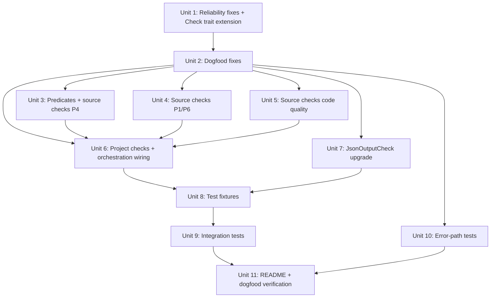

# feat: Complete v0.1 — reliability fixes, remaining checks, test fixtures, README

## Overview

Close every gap between the current codebase (11 checks, 67 tests) and a shippable public v0.1. This covers three
categories: (1) reliability and dogfood fixes from the 8 tracked TODOs, (2) the remaining check layers specified in the
design doc (Rust source checks, project checks, conditional checks), and (3) the test infrastructure and documentation
needed for a public release (integration tests, fixture projects, README).

## Problem Frame

The core infrastructure is solid — Check trait, Project struct, BinaryRunner, CLI, scorecard output all work. But only
11 of ~40 planned checks exist, the tool fails its own `code-unwrap` check, `--include-tests` is a no-op, stdout capture
is unbounded, directory walking has no limits, the JSON output check always returns Skip, there are no integration
tests, no test fixtures, and the README is a stub. The tool can't ship publicly in this state.

(see origin: `~/.gstack/projects/brettdavies-agentnative/brett-main-design-20260327-214808.md`)

## Requirements Trace

- R1. BinaryRunner caps stdout/stderr capture at 1MB (TODO 001)
- R2. Directory walk respects MAX_DEPTH=20 and MAX_FILES=10,000 (TODO 002)
- R3. `--include-tests` value passed through Project to `walk_source_files_inner()` (TODO 003; CLI flag already exists)
- R4. JsonOutputCheck validates actual JSON output, not just flag detection (TODO 004)
- R5. Integration tests cover CLI orchestration, flags, exit codes (TODO 005)
- R6. Behavioral check error paths tested — Crash, Timeout, NotFound (TODO 006)
- R7. No `.unwrap()` in production code; tool passes its own `code-unwrap` check (TODO 007)
- R8. `--quiet` discoverable in `--help`; QuietCheck passes on self (TODO 008)
- R9. All source checks from design doc check mapping table implemented (including dual-layer source halves)
- R10. 7 project checks implemented (AGENTS.md, non-interactive, completions, deps, error module, output module,
  dry-run)
- R11. Conditional checks use self-contained skip logic with inline detection; no shared predicates module needed
- R12. 4 test fixture projects for regression testing
- R13. README with installation, usage, scorecard screenshot, principle summary
- R14. Tool passes all its own checks (dogfood)
- R15. Check trait extended with `group()` and `layer()` methods; error fallback uses correct values

## Scope Boundaries

- Python source checks are NOT in scope (module structure stays empty)
- Go/Node source checks are NOT in scope
- `--fix` is deferred to v0.2
- `--init` is deferred to v0.3
- `--command <name>` PATH lookup is deferred
- Cargo workspace handling is deferred
- `--agent-caps` is deferred to v2
- GitHub Action wrapper is deferred to v0.2
- crates.io publishing is a separate task (use crates-io-distribution-readiness solution)
- Homebrew tap formula is a separate task

## Context & Research

### Relevant Code and Patterns

- **Check trait** (`src/check.rs`): `id()`, `applicable()`, `run()` — all new checks follow this pattern
- **Source check pattern** (`src/checks/source/rust/unwrap.rs`): unit struct, const PATTERN, inner `check_*(source,
  file)` function, outer `Check::run()` iterates `project.parsed_files()`
- **Behavioral check pattern** (`src/checks/behavioral/bad_args.rs`): unit struct, `applicable()` checks
  `project.runner.is_some()`, `run()` calls runner methods
- **Test helpers** (`src/checks/behavioral/mod.rs:26-102`): `test_project_with_runner()` and
  `test_project_with_sh_script()` for behavioral check testing
- **ast-grep helpers** (`src/source.rs`): `has_pattern()` and `find_pattern_matches()` — both build
  `Pattern::try_new(pattern_str, Rust)` per call
- **Evidence formatting**: `"file:line:col -- text"` for source locations
- **Conditional check design** (design doc): `ConditionalCheck { trigger, requirement, skip_reason }` — "if trigger
  matches, requirement must also match"
- **Project check layer**: `CheckLayer::Project` and `CheckGroup::ProjectStructure` defined in `types.rs` but unused; no
  `src/checks/project/` exists yet

### Institutional Learnings

- **Fork bomb guard** (`docs/solutions/logic-errors/cli-linter-fork-bomb-recursive-self-invocation-20260401.md`):
  `AGENTNATIVE_CHECK=1` env var scoped to NonInteractiveCheck only — already implemented
- **SRP compliance checkers**
  (`docs/solutions/best-practices/reliable-static-analysis-compliance-checkers-20260327.md`): One check per
  independently-verifiable requirement, binary PASS/FAIL
- **Subprocess patterns** (`docs/solutions/architecture-patterns/xurl-subprocess-transport-layer.md`):
  `Command::new(path).args(args)`, ETXTBSY retry, two-layer error classification
- **Integration test isolation** (`docs/solutions/architecture-patterns/live-integration-testing-cli-external-api.md`):
  TestEnv pattern for isolated CLI testing
- **Quiet flag pattern** (`docs/solutions/architecture-patterns/quiet-flag-diagnostic-suppression-pattern.md`):
  `FalseyValueParser`, `diag!` macro, classification rule for gatable vs fatal output
- **Crates.io readiness** (`docs/solutions/architecture-patterns/crates-io-distribution-readiness.md`): exclude list,
  binstall metadata, release profile — applies when shipping

### External References

- ast-grep API: pre-1.0 (`=0.42.0`), `Position.line()` / `Position.column(&node)`, pre-build `Pattern` objects
- Design doc check mapping table (lines 169-194 of design doc): authoritative source for all 24 checks and their layer
  assignments. The implementer must consult the design doc alongside this plan to verify R9 coverage — the full table is
  not reproduced here to avoid drift between documents

## Key Technical Decisions

- **Self-contained conditional checks, no ConditionalCheck wrapper**: The design doc specifies `ConditionalCheck {
  trigger, requirement }` but in practice every conditional check (HeadlessAuth, NoPager, TimeoutFlag, TtyDetection,
  OutputClamping, GlobalFlags, DryRun) already has built-in conditional logic: detect precondition → if absent, Skip; if
  present, evaluate requirement. No concrete cross-layer pairs were identified that need a generic wrapper — even DryRun
  handles its own detection inline. Decision: all conditional checks are self-contained. No `ConditionalCheck` struct or
  `conditional.rs` module. If a genuine cross-layer pair emerges during implementation, extract the wrapper then.
- **Inline detection logic, no shared predicates module**: Each conditional check (HeadlessAuth, NoPager, TimeoutFlag,
  TtyDetection, OutputClamping, DryRun) has exactly one consumer for its precondition detection. Inline the detection
  logic in each check's `run()` method rather than extracting to a `predicates.rs` module. If a second consumer appears
  later, extract then. This follows YAGNI and avoids a premature abstraction layer.
- **Project checks use Project struct directly, no binary needed**: Project checks inspect files and manifests via
  `project.path`, `project.manifest_path`, and `project.parsed_files()`. They never touch `project.runner`. Their
  `applicable()` returns true when `project.path.is_dir()`.
- **Project checks always collected when path is a directory**: The orchestration loop collects project checks whenever
  `project.path.is_dir()` is true, regardless of `has_binary` or `has_language`. The `--binary` flag suppresses project
  checks (pointed at a binary, not a project). The `--source` flag includes project checks (project-level analysis).
- **CodeQuality/ProjectStructure checks keep their existing groups**: `CheckGroup::CodeQuality` and
  `CheckGroup::ProjectStructure` already exist in `types.rs` — don't corrupt the taxonomy by forcing checks into
  principle groups they don't belong to. Fix `matches_principle()` in `main.rs` to always include CodeQuality and
  ProjectStructure checks regardless of `--principle N` filter (these checks are cross-cutting and should appear in
  every filtered view). This preserves the scorecard grouping, avoids a breaking JSON output change, and requires no new
  `--group` flag.
- **Fix error fallback in orchestration loop**: The current error fallback in `main.rs` hardcodes `group:
  CheckGroup::P1` and `layer: CheckLayer::Behavioral` when a check returns `Err`. Fix by adding `group()` and `layer()`
  methods to the Check trait (or have checks provide their metadata upfront) so the error fallback uses correct values.
- **`.unwrap()` elimination strategy**: Replace `runner.as_ref().unwrap()` in behavioral checks with
  `runner.as_ref().expect("runner must exist when applicable() returns true")`. For mutex locks in runner.rs, use
  `.expect("mutex poisoned")` — mutex poisoning is a legitimate panic. Update the `code-unwrap` source check pattern to
  match `.unwrap()` but not `.expect()` (it already does — the current pattern is `$RECV.unwrap()`).
- **Test fixture projects are minimal Cargo projects**: Each fixture is a tiny Rust project under `tests/fixtures/` with
  just enough code to exercise the checks. They are built by integration tests via `cargo build` in a setup step, not
  pre-built binaries checked into git.
- **Remaining source checks follow the existing pattern exactly**: New checks in `src/checks/source/rust/` use the same
  unit-struct + const PATTERN + inner function + outer Check::run() pattern as unwrap.rs.
- **Integration tests use `assert_cmd` against the built binary**: `assert_cmd::Command::cargo_bin("agentnative")` runs
  the real CLI. Tests cover flag combinations, exit codes, JSON schema, and warning messages.
- **stdout/stderr cap uses `.take()` on the handle**: Wrap the stdout/stderr handles with `Read::take(1_048_577)` (1MB +
  1 byte). If more than 1,048,576 bytes were read, the stream was truncated: truncate to 1MB and append `"\n[output
  truncated at 1MB]"`. This avoids the `Read::take()` API limitation — once the wrapper hits its limit it returns
  `Ok(0)` permanently, so you can't probe past it. Using `take(N+1)` and checking the read length is the correct idiom.
- **Directory walk limits are constants, not CLI flags**: `MAX_DEPTH` and `MAX_FILES` are internal constants. If hit, a
  warning is emitted via `eprintln!` and the walk stops. No CLI flag to override — monorepos should scope the path.

## Open Questions

### Resolved During Planning

- **Should conditional checks use a generic wrapper or be self-contained?**: Self-contained, no wrapper at all. Every
  conditional check already has built-in skip logic (detect precondition → Skip if absent → evaluate if present). No
  concrete cross-layer pairs were identified that need a generic `ConditionalCheck` wrapper. Detection logic is inlined
  in each check (YAGNI — each predicate has exactly one consumer). If a cross-layer pair emerges, extract then.
- **How to test fixture projects without pre-built binaries?**: Integration tests call `cargo build` in the fixture
  directory during test setup. This is slow but correct — it mirrors real usage. Use `#[ignore]` for the slowest fixture
  tests and run them explicitly in CI. Use shell script fixtures for behavioral-only tests (the
  `test_project_with_sh_script` helper already works well).
- **Should source checks for `try_parse` vs `parse` match all `.parse()` calls?**: No. The check should find
  `$RECV.parse()` calls that are NOT inside a `try_parse()` or `?` context. Since ast-grep is syntactic only, the
  practical check is: find `.parse().unwrap()` patterns (which combine the parse and unwrap anti-patterns).
- **How to detect "error types in dedicated module" for the project check?**: Look for a file matching `src/error.rs` or
  `src/errors.rs` or `src/*/error.rs`. If the project has error types scattered across non-error modules, that's what
  the check flags.
- **Where does CompletionsCheck belong?**: Project layer, not source. It inspects `Cargo.toml` for `clap_complete` in
  dependencies — that's manifest inspection, not source analysis. Moved to `src/checks/project/completions.rs` and
  merged into `DependenciesCheck` scope (check for recommended deps including `clap_complete`).
- **How should `--principle` interact with CodeQuality/ProjectStructure checks?**: Assign each to its nearest principle
  (see Key Technical Decisions). This avoids adding a `--group` flag and makes the filter work for all checks.
- **How should project checks integrate with `--binary`/`--source` mode flags?**: Project checks run whenever path is a
  directory. `--binary` suppresses them. `--source` includes them. No language detection required.
- **Does `check-p1-non-interactive` need a source check?**: Yes. The design doc specifies dual-layer: "Source: grep for
  prompt libs." Add `non_interactive_source.rs` to detect prompt library dependencies (dialoguer, inquire, rustyline,
  crossterm) in Cargo.toml.
- **How should the error fallback in the orchestration loop work?**: The current hardcoded `P1/Behavioral` is wrong for
  non-behavioral checks. Add `group()` and `layer()` methods to the Check trait so the error fallback uses correct
  values from the failed check.
- **Should CHANGELOG be manually edited?**: No. Per project convention, CHANGELOG.md is a generated artifact. Remove
  from Unit 12 scope.
- **How should stdout/stderr truncation be detected?**: Use a boolean flag from the reader thread, not byte count
  comparison. A stream can legitimately produce exactly 1MB without being truncated.

### Deferred to Implementation

- **Exact ast-grep patterns for each new source check**: The patterns depend on tree-sitter's Rust grammar CST
  structure. Each pattern needs to be validated against real Rust code during implementation.
- **Fixture project contents**: The exact minimal Rust code in each fixture project depends on which checks need to
  pass/fail. Define during implementation. The `perfect-rust` fixture should be defined last, after all checks are
  implemented, since it is the integration contract for the full check suite.
- **README screenshot generation**: How to capture a terminal screenshot for the README. May use a tool like `vhs` or a
  manual screenshot.
- **JSON schema alignment**: The design doc specifies a grouped `{ "groups": [{ "checks": [...] }] }` schema but the
  implementation uses a flat `{ "results": [...], "summary": {...} }` schema. Reconcile during implementation — either
  update the design doc or the implementation. Not a blocker for v0.1 since no external consumers exist yet.

## High-Level Technical Design

> *This illustrates the intended approach and is directional guidance for review, not implementation specification. The
> implementing agent should treat it as context, not code to reproduce.*

```text
Phase 1: Reliability & Dogfood Fixes (TODOs 001-003, 007-008)
  └── Fix BinaryRunner, Project, CLI flag wiring, unwrap elimination, Check trait extension
  └── These are prerequisites — later work depends on correct infrastructure

Phase 2: Remaining Source Checks (~13 new checks)
  └── Each check follows the unwrap.rs pattern exactly
  └── Conditional checks use inline detection logic (no shared predicates module)
  └── Add to all_rust_checks() registry

Phase 3: Project Checks (7 checks) + Orchestration Wiring
  └── New src/checks/project/ module (includes completions + non-interactive, moved from source)
  └── Orchestration loop expansion to collect project checks
  └── No ConditionalCheck wrapper — all conditional logic is self-contained

Phase 4: JsonOutputCheck Upgrade (TODO 004)
  └── Run binary with --output json, validate JSON

Phase 5: Test Fixtures & Integration Tests (TODOs 005-006)
  └── 4 fixture projects under tests/fixtures/
  └── tests/integration.rs with assert_cmd
  └── Error-path tests for behavioral checks

Phase 6: README & Documentation
  └── Installation, usage, principles, scorecard example
```

**Module structure after all units:**

```text
src/
  check.rs                  -- Check trait (add group(), layer() methods)
  checks/
    mod.rs                  -- re-exports behavioral + source + project
    behavioral/             -- existing 8 checks (no new ones)
    source/
      mod.rs                -- all_source_checks() dispatcher
      rust/
        mod.rs              -- all_rust_checks() (grows from 3 to ~18 checks)
        unwrap.rs           ✓ existing
        no_color.rs         ✓ existing
        global_flags.rs     ✓ existing
        headless_auth.rs    NEW — P1: --no-browser flag when auth code present
        structured_output.rs NEW — P2: OutputFormat enum exists
        error_types.rs      NEW — P4: structured error enum
        exit_codes.rs       NEW — P4: named exit code constants
        process_exit.rs     NEW — P4: no process::exit() outside main
        try_parse.rs        NEW — P4: try_parse() not parse().unwrap()
        no_pager.rs         NEW — P6: no pager invocation
        timeout_flag.rs     NEW — P6: --timeout flag for network CLIs
        tty_detection.rs    NEW — P6: IsTerminal usage
        output_clamping.rs  NEW — P7: .clamp() or similar on pagination
        env_flags.rs        NEW — P6: env = attributes on clap flags
        naked_println.rs    NEW — P7: no println! outside output module
      python/
        mod.rs              -- stays empty (v0.2)
    project/                NEW
      mod.rs                -- all_project_checks()
      agents_md.rs          NEW — P6: AGENTS.md exists
      non_interactive.rs    NEW — P1: no prompt library deps (manifest inspection, not source)
      completions.rs        NEW — P6: clap_complete in deps (manifest inspection, not source)
      dependencies.rs       NEW — P6: required deps in manifest
      error_module.rs       NEW — P4: error types in dedicated module
      output_module.rs      NEW — P2: output config in dedicated module
      dry_run.rs            NEW — P5: --dry-run flag in CLI definition
```

**Self-contained conditional check pattern (used by most checks):**

```text
// HeadlessAuthCheck, NoPagerCheck, TimeoutFlagCheck, TtyDetectionCheck,
// OutputClampingCheck, GlobalFlagsCheck all follow this pattern:

run(project):
  // inline detection — each check owns its precondition logic
  if !has_auth_code_in_source(project) -> return Skip("no auth code found")
  // precondition present — evaluate requirement
  if has_pattern(source, "--no-browser") -> return Pass
  else -> return Warn("auth code found but no --no-browser flag")
```

Detection logic is inlined in each check's `run()` method. Extract to a shared module only when
a second consumer appears.

## Implementation Units



- [ ] **Unit 1: Reliability fixes + Check trait extension (TODOs 001, 002, 003)**

**Goal:** Cap stdout/stderr capture at 1MB, add depth/file limits to directory walk, wire `--include-tests` flag, and
extend the Check trait with `group()` and `layer()` methods.

**Requirements:** R1, R2, R3, R15

**Dependencies:** None

**Files:**

- Modify: `src/runner.rs` (wrap reader handles with `.take()`, return `(String, bool)` from reader threads)
- Modify: `src/project.rs` (add MAX_DEPTH, MAX_FILES constants; add `include_tests` parameter to walk; update
  `parsed_files()` to pass `include_tests`)
- Modify: `src/main.rs` (extract `include_tests` from CLI args, pass to Project; fix error fallback to use
  `check.group()`/`check.layer()`)
- Modify: `src/check.rs` (add required `group()` and `layer()` methods to Check trait — no defaults, compile error if
  missing)
- Modify: all 11 existing check files (add `group()` and `layer()` implementations — 8 behavioral + 3 source)
- Modify: `src/checks/behavioral/mod.rs` (update `test_project_with_runner()` and `test_project_with_sh_script()`
  helpers to include `include_tests: false` default)
- Test: `src/runner.rs` (test truncation behavior with boolean flag)
- Test: `src/project.rs` (test depth/file limits, test include_tests behavior)

**Approach:**

- **stdout/stderr cap**: In `spawn_and_wait`, wrap `child.stdout.take()` and `child.stderr.take()` handles with
  `std::io::Read::take(1_048_577)` (1MB + 1 byte) before passing to reader threads. Reader threads return `(String,
  bool)` — if more than 1,048,576 bytes were read, the stream was truncated: set bool to true, truncate the string to
  1MB, and append `"\n[output truncated at 1MB]"`. This avoids the `Read::take()` API limitation (the wrapper returns
  `Ok(0)` after its limit, so you can't "read one more byte" after EOF).
- **Walk limits**: Add `const MAX_DEPTH: usize = 20;` and `const MAX_FILES: usize = 10_000;` to `project.rs`. Change
  `walk_source_files_inner` to accept a `depth` counter and `file_count: &mut usize`. Return early with a warning when
  either limit is hit. Warning text should be actionable: "hit 10,000-file limit; narrow the scan with `agentnative
  check src/`".
- **include_tests**: Add `include_tests: bool` field to `Project`. Set via `Project::discover()` or post-construction.
  Pass from `main.rs` after extracting from CLI args. In `walk_source_files_inner`, skip the `name == "tests"` exclusion
  when `include_tests` is true. The `target/` exclusion remains unconditional. Update `parsed_files()` to respect the
  field when populating the lazy cache. Update test helpers to include `include_tests: false`.
- **Check trait extension**: Add `fn group(&self) -> CheckGroup` and `fn layer(&self) -> CheckLayer` as **required**
  methods on the Check trait (no defaults). Missing implementations are compile errors, preventing the same silent
  fallback bug. Update the error fallback in `main.rs` to use `check.group()`/`check.layer()` instead of hardcoded
  `P1/Behavioral`. All 11 existing checks must add the two methods (mechanical, single-pass change).

**Patterns to follow:**

- Existing `walk_source_files_inner` recursive pattern in `project.rs`
- `BinaryRunner::spawn_and_wait` reader thread pattern in `runner.rs`

**Test scenarios:**

- Happy path: stdout capture of normal-length output works unchanged
- Happy path: walk on a small project returns all source files
- Happy path: `--include-tests` causes `tests/` directory files to be included
- Edge case: stdout exceeding 1MB is truncated with notice appended, bool flag is true
- Edge case: stdout exactly 1MB but not truncated — bool flag is false
- Edge case: stderr exceeding 1MB is truncated independently
- Edge case: walk hitting MAX_DEPTH stops recursing, emits actionable warning
- Edge case: walk hitting MAX_FILES stops collecting, emits actionable warning
- Edge case: default behavior (no `--include-tests`) still excludes `tests/`
- Edge case: `target/` excluded regardless of `--include-tests`

**Verification:**

- `cargo test` passes
- Running against a project with deeply nested dirs respects limits
- `agentnative check . --include-tests` scans test code
- Error fallback in orchestration uses correct group/layer values

---

- [ ] **Unit 2: Dogfood fixes (TODOs 007, 008)**

**Goal:** Eliminate `.unwrap()` from production code and make `--quiet` discoverable so the tool passes its own checks.

**Requirements:** R7, R8

**Dependencies:** Unit 1

**Files:**

- Modify: `src/runner.rs` (replace `.unwrap()` with `.expect()` on mutex locks)
- Modify: `src/checks/behavioral/help.rs` (replace `runner.as_ref().unwrap()`)
- Modify: `src/checks/behavioral/version.rs` (same)
- Modify: `src/checks/behavioral/json_output.rs` (same)
- Modify: `src/checks/behavioral/bad_args.rs` (same)
- Modify: `src/checks/behavioral/quiet.rs` (same)
- Modify: `src/checks/behavioral/sigpipe.rs` (same)
- Modify: `src/checks/behavioral/non_interactive.rs` (same)
- Modify: `src/checks/behavioral/no_color.rs` (same)
- Modify: `src/cli.rs` (add `short = 'q'` to `--quiet` flag)
- Test: verify `agentnative check .` code-unwrap and QuietCheck pass

**Approach:**

- **unwrap elimination**: Every behavioral check has `project.runner.as_ref().unwrap()` in `run()`. Consider extracting
  a `Project::runner_ref()` helper that returns `&BinaryRunner` with a single `.expect()` message, avoiding 8 repeated
  strings. In `runner.rs`, replace mutex `.lock().unwrap()` with `.lock().expect("mutex poisoned")`. The `code-unwrap`
  ast-grep pattern matches `$RECV.unwrap()` — `.expect()` calls won't match.
- **quiet flag**: Add `short = 'q'` to the `--quiet` arg attribute in `cli.rs`. The QuietCheck searches `--help` output
  for `--quiet` or `-q` — adding the short flag ensures detection.

**Patterns to follow:**

- Existing `.expect()` usage elsewhere in the codebase
- Quiet flag pattern from `docs/solutions/architecture-patterns/quiet-flag-diagnostic-suppression-pattern.md`

**Test scenarios:**

- Happy path: `agentnative check .` — code-unwrap check returns Pass (no unwrap in production)
- Happy path: `agentnative check .` — QuietCheck returns Pass (detects -q in help)
- Edge case: mutex lock `.expect()` message is descriptive
- Edge case: `-q` works as alias for `--quiet` in actual CLI usage

**Verification:**

- `cargo test` passes
- `cargo run -- check .` shows code-unwrap as Pass
- `cargo run -- check .` shows QuietCheck as Pass
- `cargo run -- check . -q` produces quiet output
- **Dogfood checkpoint (gate):** `cargo run -- check .` must not regress on any existing check before proceeding to Unit
  3+. This catches reliability issues from Unit 1-2 early instead of deferring all dogfood validation to Unit 11.

---

- [ ] **Unit 3: Shared predicates + source checks batch 1 — P4 principle**

**Goal:** Implement 4 Rust source checks for P4: error_types, exit_codes, process_exit, try_parse.

**Requirements:** R9

**Dependencies:** Unit 2

**Files:**

- Create: `src/checks/source/rust/error_types.rs`
- Create: `src/checks/source/rust/exit_codes.rs`
- Create: `src/checks/source/rust/process_exit.rs`
- Create: `src/checks/source/rust/try_parse.rs`
- Modify: `src/checks/source/rust/mod.rs` (register 4 new checks)
- Test: inline `#[cfg(test)]` in each new file

**Approach:**

- **ErrorTypesCheck** (`p4-error-types`): Pattern-match for `enum` containing `Error` in its name. Pass if a structured
  error enum exists in the project. Warn if none found. Positive check (looking for good practice).
- **ExitCodesCheck** (`p4-exit-codes`): Pattern-match for named constants used with `process::exit()` or `ExitCode`.
  Pass if exit codes are named constants. Warn if raw integer literals used with exit functions.
- **ProcessExitCheck** (`p4-process-exit`): Find `process::exit()` calls. Pass if none found outside `main.rs`. Fail
  with locations if `process::exit()` is called in library code.
- **TryParseCheck** (`p4-try-parse`): Find `.parse().unwrap()` or `.parse().expect()` patterns. Warn with locations.

**Patterns to follow:**

- `src/checks/source/rust/unwrap.rs` — violation-finding pattern with `find_pattern_matches()`
- `src/checks/source/rust/no_color.rs` — presence-detection pattern with `has_pattern()`
- Evidence format: `"file:line:col -- text"`

**Test scenarios:**

- Happy path: ErrorTypesCheck on source with `enum AppError { ... }` → Pass
- Happy path: ExitCodesCheck on source with `const EXIT_SUCCESS: i32 = 0;` → Pass
- Happy path: ProcessExitCheck on source with no `process::exit()` → Pass
- Happy path: TryParseCheck on source with `.parse()?` → Pass
- Edge case: ErrorTypesCheck on source with no error enum → Warn
- Edge case: ExitCodesCheck on source with `process::exit(1)` (raw literal) → Warn
- Edge case: ProcessExitCheck on source with `process::exit()` in non-main file → Fail
- Edge case: ProcessExitCheck on main.rs with `process::exit()` → Pass (allowed in main)
- Edge case: TryParseCheck on source with `.parse().unwrap()` → Warn with location
- Edge case: TryParseCheck on source with no `.parse()` at all → Pass
- Error path: invalid ast-grep pattern → Check returns Error status, not panic

**Verification:**

- `cargo test` passes all new and existing tests
- New checks appear in `agentnative check .` output under P4 group

---

- [ ] **Unit 4: Source checks batch 2 — P1/P6 principle (composable structure)**

**Goal:** Implement 5 Rust source checks: P1 headless_auth, P6 no_pager, timeout_flag, tty_detection, plus P2
structured_output.

**Requirements:** R9

**Dependencies:** Unit 2 (uses predicates from Unit 3 if available, but can define inline if Unit 3 not yet complete)

**Files:**

- Create: `src/checks/source/rust/headless_auth.rs`
- Create: `src/checks/source/rust/structured_output.rs`
- Create: `src/checks/source/rust/no_pager.rs`
- Create: `src/checks/source/rust/timeout_flag.rs`
- Create: `src/checks/source/rust/tty_detection.rs`
- Modify: `src/checks/source/rust/mod.rs` (register 5 new checks)
- Test: inline `#[cfg(test)]` in each new file

**Approach:**

- **HeadlessAuthCheck** (`p1-headless-auth`): Self-contained conditional check. Inline detection of auth-related code
  (OAuth, token, login patterns). If found, check for `--no-browser` or `--headless` flag in clap definitions. Skip if
  no auth code found. Warn if auth code exists without headless flag.
- **StructuredOutputCheck** (`p2-structured-output`): Check for `OutputFormat` enum or equivalent structured output
  type. Pass if found. Warn if no output format enum detected in a clap-based CLI.
- **NoPagerCheck** (`p6-no-pager`): Inline detection of pager invocations (`pager::Pager`, `Command::new("less")`). If
  pager code found, check for `--no-pager` flag. Pass if no pager code. Warn if pager code exists without `--no-pager`.
- **TimeoutFlagCheck** (`p6-timeout`): Inline detection of network code (reqwest, hyper, curl patterns). Skip if no
  network code. If found, check for `--timeout` flag. Warn if missing.
- **TtyDetectionCheck** (`p6-tty-detection`): Check for `IsTerminal` or `is_terminal()` usage. Pass if found. Inline
  detection of color/formatting code — Skip if no color/formatting code. Warn if color but no terminal detection.

**Patterns to follow:**

- `src/checks/source/rust/global_flags.rs` — conditional detection pattern (check precondition, then inspect)

**Test scenarios:**

- Happy path: HeadlessAuthCheck on source with auth code + `--no-browser` → Pass
- Happy path: StructuredOutputCheck on source with `enum OutputFormat` → Pass
- Happy path: NoPagerCheck on source with no pager code → Pass
- Happy path: TtyDetectionCheck on source with `IsTerminal` → Pass
- Edge case: HeadlessAuthCheck on source with no auth code → Skip
- Edge case: HeadlessAuthCheck on source with OAuth code but no `--no-browser` → Warn
- Edge case: StructuredOutputCheck on non-clap project → Skip
- Edge case: TimeoutFlagCheck on source with no network code → Skip
- Edge case: TimeoutFlagCheck on source with reqwest but no `--timeout` → Warn
- Edge case: NoPagerCheck on source with `Command::new("less")` → Warn with location
- Edge case: TtyDetectionCheck on source with no color/formatting → Skip

**Verification:**

- `cargo test` passes all new and existing tests
- New checks appear in `agentnative check .` output under appropriate principle groups
- Conditional skip logic works correctly for each check

---

- [ ] **Unit 5: Source checks batch 3 — code quality + P7**

**Goal:** Implement 3 Rust source checks: env_flags (P6), naked_println (P7), output_clamping (P7).

**Requirements:** R9

**Dependencies:** Unit 2

**Files:**

- Create: `src/checks/source/rust/env_flags.rs`
- Create: `src/checks/source/rust/naked_println.rs`
- Create: `src/checks/source/rust/output_clamping.rs`
- Modify: `src/checks/source/rust/mod.rs` (register 3 new checks)
- Test: inline `#[cfg(test)]` in each new file

**Approach:**

- **EnvFlagsCheck** (`p6-env-flags`): Find clap `#[arg(...)]` attributes. Check that flags which could reasonably be set
  via env var have `env = "..."` attribute. This is heuristic — look for flags like `--output`, `--quiet`, `--verbose`,
  `--timeout` and check for `env` attribute. Warn on flags missing env backing.
- **NakedPrintlnCheck** (`p7-naked-println`): Find `println!()` and `print!()` macro invocations. Pass if none found in
  src/ files outside of a dedicated output/display module. Warn with locations. `eprintln!` is exempt (diagnostics).
- **OutputClampingCheck** (`p7-output-clamping`): Inline detection of list/pagination patterns. Skip if none found. If
  found, check for `.take()`, `.clamp()`, `--limit`, or `--max` patterns nearby. Warn if unbounded list output detected.

**Patterns to follow:**

- `src/checks/source/rust/unwrap.rs` — find-all-violations pattern
- Evidence format: `"file:line:col -- text"`

**Test scenarios:**

- Happy path: EnvFlagsCheck on source with `#[arg(long, env = "FOO")]` on relevant flags → Pass
- Happy path: NakedPrintlnCheck on source with no `println!` → Pass
- Happy path: OutputClampingCheck on source with `.take(N)` on iterators → Pass
- Edge case: EnvFlagsCheck on `--output` flag without `env` → Warn
- Edge case: NakedPrintlnCheck on source with `println!` in `src/output.rs` → Pass (output module exempt)
- Edge case: NakedPrintlnCheck on source with `println!` in `src/commands/list.rs` → Warn
- Edge case: NakedPrintlnCheck with `eprintln!` → Pass (exempt)
- Edge case: OutputClampingCheck on source with no list patterns → Skip

**Verification:**

- `cargo test` passes all new and existing tests
- New checks appear in `agentnative check .` output under P6/P7 groups

---

- [ ] **Unit 6: Project checks + orchestration wiring**

**Goal:** Implement the project checks layer (7 checks including completions and non-interactive source), wire project
checks into the orchestration loop, and add `all_project_checks()` collection.

**Requirements:** R9, R10, R11

**Dependencies:** Units 3, 4, 5

**Files:**

- Create: `src/checks/project/mod.rs`
- Create: `src/checks/project/agents_md.rs`
- Create: `src/checks/project/completions.rs` (moved from source — manifest inspection, not source analysis)
- Create: `src/checks/project/non_interactive.rs` (moved from source — inspects Cargo.toml deps, same as completions)
- Create: `src/checks/project/dependencies.rs`
- Create: `src/checks/project/error_module.rs`
- Create: `src/checks/project/output_module.rs`
- Create: `src/checks/project/dry_run.rs`
- Modify: `src/checks/mod.rs` (add `pub mod project;`)
- Modify: `src/main.rs` (collect project checks in orchestration loop, wire all 3 layers)
- Test: inline `#[cfg(test)]` in each new file

**Approach:**

- **AgentsMdCheck** (`p6-agents-md`): Check if `AGENTS.md` exists in project root. Pass if present, Warn if absent.
- **NonInteractiveCheck** (`p1-non-interactive-source`): Check Cargo.toml for prompt library dependencies (dialoguer,
  inquire, rustyline, crossterm). Pass if none found. Warn with library names if present. This is the source half of the
  dual-layer `check-p1-non-interactive` from the design doc. Placed in project layer because it inspects Cargo.toml
  (same rationale as CompletionsCheck move).
- **CompletionsCheck** (`p6-completions`): Check Cargo.toml for `clap_complete` in dependencies. Pass if present. Skip
  if no clap dependency. Warn if clap present but no clap_complete. (Moved from source layer — this is manifest
  inspection, not source analysis.)
- **DependenciesCheck** (`p6-dependencies`): Language-specific. For Rust: check Cargo.toml for recommended deps
  (anyhow/thiserror for errors, clap for CLI, serde for serialization). Pass if present. Warn with specific missing
  recommendations. Skip if language not detected. Does NOT overlap with CompletionsCheck — this checks general deps,
  completions is specific to clap_complete.
- **ErrorModuleCheck** (`p4-error-module`): Check for `src/error.rs`, `src/errors.rs`, or `src/*/error.rs`. Pass if a
  dedicated error module exists. Warn if not found. Skip if no source code.
- **OutputModuleCheck** (`p2-output-module`): Check for `src/output.rs`, `src/format.rs`, `src/display.rs`. Pass if
  output formatting is centralized. Warn if not found. Skip if no source code.
- **DryRunCheck** (`p5-dry-run`): Inline detection of write/mutate commands. Skip if no write/mutate commands detected.
  If write commands exist, search for `--dry-run` flag. Warn if missing.
- `all_project_checks() -> Vec<Box<dyn Check>>` registry function.
- **Orchestration wiring in `main.rs`**: Project checks are always collected when `project.path.is_dir()` is true,
  regardless of `has_binary` or `has_language`. The `--binary` flag suppresses project checks (pointed at a binary, not
  a project). The `--source` flag includes project checks. Explicit logic: `if !binary_only && project.path.is_dir() {
  all_checks.extend(all_project_checks()); }`

**Patterns to follow:**

- `src/checks/behavioral/mod.rs` — registry function pattern
- `src/checks/source/rust/no_color.rs` — file inspection pattern

**Test scenarios:**

- Happy path: AgentsMdCheck on directory with AGENTS.md → Pass
- Happy path: NonInteractiveCheck on Cargo.toml with no prompt libs → Pass
- Happy path: CompletionsCheck on Cargo.toml with `clap_complete` → Pass
- Happy path: DependenciesCheck on Rust project with anyhow + clap → Pass
- Happy path: ErrorModuleCheck on project with src/error.rs → Pass
- Happy path: DryRunCheck on project with `--dry-run` flag → Pass
- Edge case: AgentsMdCheck on directory without AGENTS.md → Warn
- Edge case: NonInteractiveCheck on Cargo.toml with `dialoguer` dep → Warn
- Edge case: CompletionsCheck on non-clap project → Skip
- Edge case: CompletionsCheck on clap project without clap_complete → Warn
- Edge case: DependenciesCheck on non-Rust project → Skip
- Edge case: DependenciesCheck on Rust project missing thiserror → Warn with recommendation
- Edge case: ErrorModuleCheck on project with no error module → Warn
- Edge case: OutputModuleCheck on project with src/output.rs → Pass
- Edge case: DryRunCheck on read-only CLI (no write commands) → Skip
- Edge case: project checks collected even when no language detected (AGENTS.md still runs)
- Edge case: `--binary /bin/echo` suppresses project checks
- Edge case: `--source` mode includes project checks
- Error path: project path doesn't exist → applicable() returns false

**Verification:**

- `cargo test` passes
- `agentnative check .` shows project checks grouped by their assigned principle
- `agentnative check . --principle 6` includes AGENTS.md and completions checks
- `agentnative check . --binary /bin/echo` shows no project checks
- Exit codes still work correctly with the new check layer

---

- [ ] **Unit 7: JsonOutputCheck upgrade (TODO 004)**

**Goal:** Upgrade JsonOutputCheck from skip-only to actual JSON validation.

**Requirements:** R4

**Dependencies:** Unit 2

**Files:**

- Modify: `src/checks/behavioral/json_output.rs` (replace skip-only logic with real validation)
- Test: `src/checks/behavioral/json_output.rs` (inline tests)

**Approach:**

- If `--output` or `--format` flag detected in `--help` output:

1. Try running `binary --help --output json` (safe — `--help` always exits without side effects)
2. If that produces non-JSON (many CLIs ignore `--output` with `--help`), try `binary --version --output json`
3. Parse stdout with `serde_json::from_str::<serde_json::Value>()`. Pass if valid JSON. Fail if output is not valid
   JSON. Warn if the binary exits non-zero but produces valid JSON on stderr.
4. **Never run `binary --output json` without a safe subcommand** — bare invocation could execute destructive default
   commands on deploy tools, database tools, etc.

- If no `--output`/`--format` flag detected: still Skip
- If binary can't be run: propagate the runner error

**Patterns to follow:**

- Existing behavioral check pattern (runner.run(), match on RunStatus)
- Design doc behavioral check error handling spec

**Test scenarios:**

- Happy path: binary with `--output json` that produces valid JSON → Pass
- Happy path: binary with no `--output` flag → Skip
- Edge case: binary with `--output json` that produces invalid JSON → Fail
- Edge case: binary with `--output json` that exits non-zero but produces JSON → Warn
- Edge case: binary with `--format json` (alternative flag name) → detected and tested
- Error path: binary crashes when run with `--output json` → appropriate error status

**Verification:**

- `cargo test` passes
- `agentnative check .` JsonOutputCheck returns Pass (agentnative has `--output json`)
- Check provides useful evidence in Fail cases

---

- [ ] **Unit 8: Test fixture projects**

**Goal:** Create 4 minimal fixture projects for regression testing.

**Requirements:** R12

**Dependencies:** Units 6, 7

**Files:**

- Create: `tests/fixtures/perfect-rust/Cargo.toml`
- Create: `tests/fixtures/perfect-rust/src/main.rs`
- Create: `tests/fixtures/perfect-rust/src/error.rs`
- Create: `tests/fixtures/perfect-rust/AGENTS.md`
- Create: `tests/fixtures/broken-rust/Cargo.toml`
- Create: `tests/fixtures/broken-rust/src/main.rs`
- Create: `tests/fixtures/binary-only/` (shell script)
- Create: `tests/fixtures/source-only/Cargo.toml`
- Create: `tests/fixtures/source-only/src/main.rs`

**Approach:**

- **perfect-rust/**: A tiny clap CLI that passes ALL checks. Has `--help` with examples, `--version`, `--output json`,
  `--quiet`, `--no-color`, structured error types, named exit codes, `AGENTS.md`, `clap_complete` in deps, no
  `.unwrap()`, no naked `println!`. This is the positive-control fixture. Define contents last — after all checks are
  implemented — since it is the integration contract for the full check suite.
- **broken-rust/**: A clap CLI that fails as many checks as possible. Uses `.unwrap()` everywhere, no `--output` flag,
  no `--quiet`, no error types, raw `process::exit(1)`, `println!` everywhere, no `AGENTS.md`.
- **binary-only/**: A shell script with good `--help`, `--version`, and `--output json`. No source code. Tests
  behavioral-only mode. Uses shell script (not compiled binary) to avoid build dependency.
- **source-only/**: A Rust project with no compiled binary (no target/ directory). Tests source+project-only mode with
  graceful degradation warning.
- Fixture projects are minimal — just enough code to exercise the checks, not full applications.

**Patterns to follow:**

- Design doc testing strategy: `tests/fixtures/` directory with 4 synthetic projects
- Existing `test_project_with_sh_script()` helper pattern for shell-based fixtures

**Test scenarios:**

Test expectation: none — fixtures are tested via integration tests in Unit 9.

**Verification:**

- All 4 fixture directories exist with valid project structure
- `perfect-rust/` builds successfully with `cargo build`
- `broken-rust/` builds successfully (it's valid Rust, just bad practice)
- `binary-only/` shell script is executable and responds to `--help`

---

- [ ] **Unit 9: Integration tests (TODO 005)**

**Goal:** Add end-to-end CLI integration tests using `assert_cmd`.

**Requirements:** R5

**Dependencies:** Unit 8

**Files:**

- Create: `tests/integration.rs`
- Test: `tests/integration.rs`

**Approach:**

- Use `assert_cmd::Command::cargo_bin("agentnative")` to run the real CLI binary.
- Test against the agentnative repo itself (dogfood) and against fixture projects.
- Group tests by concern: output format, flag behavior, exit codes, warning messages, fixture validation.
- Slow fixture tests (requiring `cargo build` in fixture dirs) use `#[ignore]` and are run explicitly in CI.

**Patterns to follow:**

- `assert_cmd` patterns from dev-dependencies
- TestEnv isolation pattern from `docs/solutions/architecture-patterns/live-integration-testing-cli-external-api.md`

**Test scenarios:**

- Happy path: `agentnative check .` exits 0 or 1 with text output
- Happy path: `agentnative check . --output json` produces valid JSON matching scorecard schema
- Happy path: `agentnative --version` prints version string, exits 0
- Happy path: `agentnative --help` prints help with examples, exits 0
- Happy path: `agentnative completions bash` outputs completions, exits 0
- Edge case: `agentnative check /nonexistent` → exit 2, error message on stderr
- Edge case: `agentnative check . --principle 3` → only P3-assigned checks in output
- Edge case: `agentnative check . --quiet` → reduced output (no PASS/SKIP lines)
- Edge case: `agentnative check . -q` → same as `--quiet`
- Edge case: `agentnative check . --binary /bin/echo` → behavioral checks only, no project checks
- Edge case: `agentnative check . --source` → source + project checks only
- Edge case: `agentnative --bogus-flag` → exit 2, error message
- Integration: `NO_COLOR=1 agentnative check . --output json` → valid JSON, no ANSI codes
- Integration (#[ignore]): `agentnative check tests/fixtures/perfect-rust/` → all checks pass (exit 0)
- Integration (#[ignore]): `agentnative check tests/fixtures/broken-rust/` → failures detected (exit 2)
- Integration (#[ignore]): `agentnative check tests/fixtures/binary-only/` → behavioral only, no source errors
- Integration (#[ignore]): `agentnative check tests/fixtures/source-only/` → source+project only, warning about no
  binary

**Verification:**

- `cargo test` passes (non-ignored tests)
- `cargo test -- --ignored` passes (fixture tests, run in CI)
- Test output clearly shows which checks run for each mode

---

- [ ] **Unit 10: Behavioral check error-path tests (TODO 006)**

**Goal:** Add tests for Crash, Timeout, NotFound, and PermissionDenied paths in all 8 behavioral checks.

**Requirements:** R6

**Dependencies:** Unit 2

**Files:**

- Modify: `src/checks/behavioral/help.rs` (add error-path tests)
- Modify: `src/checks/behavioral/version.rs` (same)
- Modify: `src/checks/behavioral/json_output.rs` (same)
- Modify: `src/checks/behavioral/bad_args.rs` (same)
- Modify: `src/checks/behavioral/quiet.rs` (same)
- Modify: `src/checks/behavioral/sigpipe.rs` (same)
- Modify: `src/checks/behavioral/non_interactive.rs` (same)
- Modify: `src/checks/behavioral/no_color.rs` (same)

**Approach:**

- Use `test_project_with_sh_script()` helper to create scripts that simulate error conditions:
- **Crash**: `kill -11 $$` (SIGSEGV) → RunStatus::Crash
- **Timeout**: `sleep 60` → RunStatus::Timeout (with short timeout override)
- **NotFound**: construct runner with non-existent binary path
- Each behavioral check should handle these RunStatus variants gracefully (returning Warn or Fail with descriptive
  evidence, never panicking).
- At least one error-path test per behavioral check. Not every check needs every error variant — focus on the most
  likely failure mode for each.

**Patterns to follow:**

- Existing `test_project_with_sh_script()` helper in `src/checks/behavioral/mod.rs`
- Existing happy-path tests in each behavioral check file

**Test scenarios:**

- Error path: HelpCheck on crashing binary → Warn/Fail with crash evidence
- Error path: VersionCheck on crashing binary → Warn/Fail with crash evidence
- Error path: BadArgsCheck on binary that times out → Warn with timeout evidence
- Error path: NonInteractiveCheck on binary that crashes → Warn/Fail
- Error path: SigpipeCheck on crashing binary → appropriate status
- Error path: NoColorBehavioralCheck on timed-out binary → Warn
- Error path: QuietCheck on non-existent binary → applicable() returns false (no runner)
- Error path: JsonOutputCheck on crashing binary → appropriate error status

**Verification:**

- `cargo test` passes all new error-path tests
- No panics in any error path
- Evidence messages are descriptive and actionable

---

- [ ] **Unit 11: README and dogfood verification**

**Goal:** Write a proper README and verify the tool passes all its own checks.

**Requirements:** R13, R14

**Dependencies:** Units 9, 10

**Files:**

- Modify: `README.md` (replace stub with full content)

**Approach:**

- **README sections**: Project description, installation (`cargo install`, Homebrew tap placeholder), quick start
  (`agentnative check .`), the 7 principles with brief descriptions, example scorecard output (text), JSON output
  example, CLI reference (`--help` output), contributing, license.
- **Dogfood verification**: Run `cargo run -- check .` and verify all checks pass. Fix any remaining failures. The
  README should show the tool passing its own checks as the primary demo.
- Note: CHANGELOG.md is a generated artifact per project convention — do NOT manually edit it.

**Patterns to follow:**

- `docs/solutions/architecture-patterns/crates-io-distribution-readiness.md` for README content guidance
- `docs/solutions/best-practices/cli-tool-naming-methodology-20260327.md` for naming context

**Test scenarios:**

Test expectation: none — README is documentation, verified manually.

**Verification:**

- `cargo run -- check .` exits 0 (all checks pass)
- README has installation, usage, principles, and example output sections

## System-Wide Impact

- **Interaction graph:** The Check trait is the central abstraction with new `group()` and `layer()` methods. All new
  check categories (source, project) implement it. Source checks with conditional logic use shared predicates from
  `predicates.rs`. The orchestration loop in `main.rs::run()` collects checks from 3 sources: behavioral, source,
  project. The `Project` struct gains an `include_tests` field that flows through `parsed_files()`.
- **Error propagation:** New checks follow the established pattern — `Ok(CheckResult)` for all check outcomes,
  `Err(anyhow)` only for internal tool errors. The orchestrator converts `Err` to `CheckStatus::Error` using the check's
  own `group()` and `layer()` methods (fixing the hardcoded P1/Behavioral fallback). Project checks can't fail with
  runner errors since they don't use the runner.
- **State lifecycle risks:** The stdout/stderr cap changes the BinaryRunner's output contract — downstream checks that
  parse `--help` output may see truncated text on extremely verbose binaries (unlikely in practice, 1MB >> typical
  `--help`). The walk limits change file discovery — checks may miss files in deeply nested projects (intentional
  tradeoff, actionable warning emitted).
- **API surface parity:** The JSON scorecard gains new check IDs. All checks are now assigned to principle groups
  (P1-P7) so `--principle N` filtering works for the entire check suite. The schema structure is unchanged but the
  content grows. No breaking changes.
- **Integration coverage:** Integration tests (Unit 9) cover the full pipeline from CLI args to exit code. Fixture
  projects exercise all three check layers end-to-end.
- **Unchanged invariants:** The CheckResult/CheckStatus types and JSON scorecard schema structure do not change.
  Existing 11 checks continue working. Exit code semantics (0/1/2) are preserved. The Check trait adds methods but
  existing implementations need only add the new `group()`/`layer()` methods.

## Risks & Dependencies

| Risk | Mitigation |
|------|------------|
| ast-grep patterns for new source checks may not work as expected | Validate each pattern against real Rust code during implementation; test with both passing and failing inputs |
| Fixture projects add build time to tests | Use `#[ignore]` for fixture tests; shell scripts for behavioral-only fixtures |
| Shared predicates may have false positives on detection heuristics | Prefer conservative detection; false negatives (Skip) are safer than false positives (incorrect Fail) |
| Some source checks are inherently heuristic (env_flags, naked_println) | Document heuristic limitations; prefer Warn over Fail for ambiguous cases |
| stdout/stderr cap may truncate useful `--help` output | 1MB is generous; real `--help` output is typically <10KB |
| Project checks may produce false positives on unconventional project layouts | Use Skip for ambiguous cases; document expected project structure |
| Adding `group()`/`layer()` to Check trait requires updating all existing check implementations | Mechanical change across ~11 existing checks; can be done in a single pass |

## Sources & References

- **Design doc:** `~/.gstack/projects/brettdavies-agentnative/brett-main-design-20260327-214808.md`
- **Eng review test plan:**
  `~/.gstack/projects/brettdavies-agentnative/brett-main-eng-review-test-plan-20260327-222940.md`
- **Previous plan:** `docs/plans/2026-03-31-001-feat-check-trait-project-behavioral-plan.md`
- Related solutions:
- `docs/solutions/architecture-patterns/xurl-subprocess-transport-layer.md`
- `docs/solutions/architecture-patterns/live-integration-testing-cli-external-api.md`
- `docs/solutions/architecture-patterns/crates-io-distribution-readiness.md`
- `docs/solutions/best-practices/reliable-static-analysis-compliance-checkers-20260327.md`
- `docs/solutions/logic-errors/cli-linter-fork-bomb-recursive-self-invocation-20260401.md`
