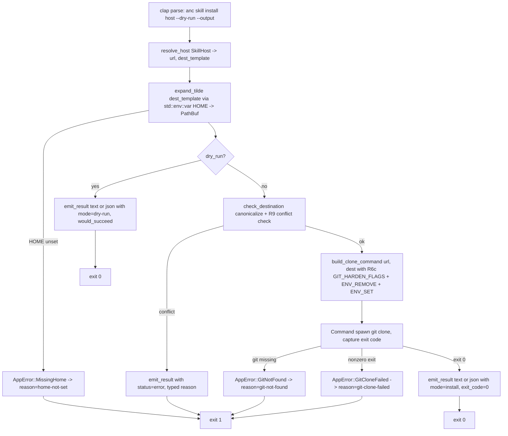

# feat: `anc skill install <host>` — single-command skill installer with hardened git clone

## Overview

Add `anc skill install <host>` — a single-verb subcommand that clones the `agentnative-skill` bundle into the host's
canonical skills directory using a **hardcoded Rust host map** and a **hardened `git clone` invocation**. Hosts
(`claude_code`, `codex`, `cursor`, `opencode`) are a clap `ValueEnum`; the `(url, dest_template)` pair for each lives as
a `&'static str` constant inside `src/skill_install.rs`. There is no `skill.json` parsing, no `--refresh`, no embedded
JSON snapshot, and no allowlist validator — the URLs and destinations are compile-time literals, not runtime input.

The subcommand exposes two flags that close `anc`'s own dogfood loop on P2 (structured output) and P5 (introspection):

- `--dry-run` prints the resolved `git clone` command (text mode) or a JSON envelope (json mode) with `mode: "dry-run"`
  and `would_succeed`, then exits without spawning a process. Captures cleanly via `eval $(anc skill install --dry-run
  <host>)` for users who prefer to inspect before running.
- `--output {text,json}` selects the result envelope. JSON mode emits a uniform shape for **both success and error**:
  `{action, host, mode, command, destination, destination_status, status, would_succeed?, exit_code?, reason?}`.
  `reason` is a typed identifier
  (`destination-not-empty`/`destination-is-file`/`home-not-set`/`git-not-found`/`git-clone-failed`).

The `git clone` invocation runs with named-const hardening (`GIT_HARDEN_FLAGS`, `GIT_HARDEN_ENV_REMOVE`,
`GIT_HARDEN_ENV_SET` — the latter holds `GIT_CONFIG_GLOBAL=/dev/null`, `GIT_CONFIG_SYSTEM=/dev/null`, and
`GIT_TERMINAL_PROMPT=0`) to defeat ambient git-config and env-var subversion. Tilde-expansion uses
`std::env::var("HOME")` directly with no `home`/`dirs` crate dependency. The vendored `src/skill_install/skill.json` is
the build-time codegen input for `build.rs::emit_skill_hosts`, which emits `SkillHost`, `KNOWN_HOSTS`, `resolve_host`,
and `host_envelope_str` into `$OUT_DIR/generated_hosts.rs` — `src/skill_install.rs` `include!`s the generated file.
`scripts/sync-skill-fixture.sh --check` (CI-enforced) catches drift between the vendored fixture and the canonical site
copy — drift fails CI, never users.

Plan depth is **Modest** — one new subcommand, one process spawn, no network, no embedded resources beyond Rust
constants. ~1 implementation unit (plus a small docs unit).

---

## Problem Frame

A user installing `anc` today still has to copy-paste a `git clone` command from `anc.dev/skill` per host they use, and
remember to update by `cd`-ing into each install dir and running `git pull`. That is friction precisely where `anc`
should be friction-free: `anc skill install claude_code` should be a single command.

The original plan attempted this with a vendored `skill.json` snapshot, a `--refresh` HTTPS fetch, and a 6-token
allowlist over the install command tokens — the allowlist existed because the install command was untrusted runtime
input flowing from a network-fetched JSON contract. Eng review collapsed that surface: the host map is a tiny set of
`(url, dest)` pairs that change on the order of one new host per quarter, and `anc` already ships via patch releases.
Hardcoding the map in Rust drops ~30 transitive dependencies (rustls + ring + webpki-roots + serde_json + ureq +
friends), eliminates the live-fetch threat surface, and turns the allowlist from a runtime invariant into a compile-time
fact. The freshness model becomes: re-vendor the fixture + update the Rust map + cut a patch release. CI fails on drift
between the fixture and the map.

The problem is **not**:

- Embedding the skill content itself. The `agentnative-skill` repo distributes via `git clone --depth 1` from rolling
  `main` and signals freshness via its own `bin/check-update` against the latest release tag. `anc` does not duplicate
  that.
- Reinventing host adapters (frontmatter rewriting, etc.). Hosts that consume the bundle as-is are supported now; hosts
  that need transformation are deferred.

### Why a binary verb, not a bash one-liner?

The honest answer is **dogfood**. A 30-line shell script published at `anc.dev/install-skill.sh` would deliver the
install UX for ~5% of the engineering cost. It would not, however, exercise `anc`'s own surface on P2 (structured output
via `--output json`) or P5 (`--dry-run`). `anc` ships the agent-native CLI standard and must score itself on P1–P6 — the
binary verb closes the dogfood loop. It also shares a single trust boundary with the future `anc skill
update`/`list`/`path` verbs when those land; the shell-script path fragments that boundary and forces every future verb
to re-justify its own hardening from scratch.

---

## Requirements Trace

- **R1.** `anc skill` is a new top-level subcommand. Its only initial verb is `install <host>`. Future verbs (`list`,
  `path`, `update`) are out of scope.
- **R2.** `install` accepts `<host>` as a positional argument, validated by clap `ValueEnum` against the hardcoded
  `SkillHost` enum. Variants: `ClaudeCode`, `Codex`, `Cursor`, `Opencode` (with `clap(rename_all = "snake_case")` so
  surface names match `skill.json` keys verbatim — note `opencode`, not `open_code`). Unknown hosts are rejected by clap
  with exit 2 and a list of accepted values in the error message.
- **R6a.** Tilde expansion of the destination template happens before `Command::new("git")` exec, via
  `std::env::var("HOME")` directly — no `home`/`dirs` crate dep. A leading `~` or `~/` is replaced with `$HOME`;
  templates not starting with `~` or `~/` pass through unchanged (pure-function shape — the v1 hardcoded map only ever
  feeds `~`-prefixed templates, so the passthrough branch is unreachable in practice but keeps the contract simple and
  matches `expand_tilde_no_tilde_passthrough` in the eng-review test plan). `$HOME` unset or empty →
  `AppError::MissingHome`, but only when expansion is actually attempted (input begins with `~`).
- **R6c.** The `git clone` invocation runs with sanitized environment and explicit config flags, captured as named
  constants in `src/skill_install.rs`. Three tables make up the surface (as-shipped — see "Document Review
  (implementation revision, 2026-04-30)" for the two corrections relative to the eng-review wording):
- `GIT_HARDEN_FLAGS: &[&str]` holds five `-c key=value` pairs: `credential.helper=` (empty), `core.askPass=` (empty),
  `protocol.allow=never`, `protocol.https.allow=always`, and `http.followRedirects=false`. The default-deny +
  per-protocol-allow pair is the documented git-config form for "HTTPS only" — the eng-review's
  `protocol.allow=https-only` shorthand is **not** valid git syntax (`fatal: unknown value`).
- `GIT_HARDEN_ENV_REMOVE: &[&str]` lists five environment variables removed via `Command::env_remove`: `GIT_SSH`,
  `GIT_SSH_COMMAND`, `GIT_PROXY_COMMAND`, `GIT_ASKPASS`, `GIT_EXEC_PATH`. The `GIT_CONFIG_GLOBAL`/`GIT_CONFIG_SYSTEM`
  pair is **not** in this list — `env_remove` would let git fall back to `$HOME/.gitconfig` and `/etc/gitconfig`,
  defeating the intent. Those two are routed through `GIT_HARDEN_ENV_SET` instead.
- `GIT_HARDEN_ENV_SET: &[(&str, &str)]` lists three env vars *set* on the spawned process:
  `GIT_CONFIG_GLOBAL=/dev/null`, `GIT_CONFIG_SYSTEM=/dev/null`, and `GIT_TERMINAL_PROMPT=0`. The
  `GIT_CONFIG_*=/dev/null` pair is the actual defense against user-config `insteadOf` URL-rewriting — it forces git to
  read no global/system config at all. The eng-review's `-c url.<repo>.insteadOf=` flag was dropped: with an empty value
  it does the *opposite* of blocking (it rewrites every empty-prefix URL to start with `<repo>`, doubling the clone URL
  into a 404). `GIT_TERMINAL_PROMPT=0` blocks credential prompts; git's default-when-unset is to prompt, which is the
  wrong default for a non-interactive subcommand.

  Do NOT call `env_clear()` — it strips PATH and breaks git's helper resolution. Tests assert each table is
  non-empty and contains the expected entries by string match (no regex, no parsing).
- **R9.** Destination conflict check, run after `fs::canonicalize` of the resolved destination (defends against the
  symlinked-skills-dir case where the parent skills directory itself is a symlink, per F4): reject if the dest exists as
  a regular file (`AppError::DestIsFile`) or as a non-empty directory (`AppError::DestNotEmpty`); empty directory or
  nonexistent path is OK. The TOCTOU window between check and `git clone` exec is acknowledged residual
  single-user-machine risk — `git clone` itself errors on a non-empty target, so the worst case is a less-actionable
  error message, not a security failure.
- **R-DRY.** `--dry-run` flag — P5 compliance. When set, do not exec; instead print the resolved `git clone` command
  (text mode) or emit a JSON envelope (json mode) with `mode: "dry-run"` and `would_succeed: bool`. In text mode, the
  command is a single line on stdout suitable for `eval $(anc skill install --dry-run <host>)` capture. Validation
  errors (R6a, R9) still apply in dry-run mode and surface as failures with `would_succeed: false` plus the typed
  `reason`.
- **R-OUT.** `--output {text,json}` flag — P2 compliance. **Applies to BOTH dry-run AND live install paths.**
  Silent-ignore on the live path (an earlier draft) was a P2 violation; OV1 surfaced this and the JSON envelope now
  wraps every outcome. Envelope schema (uniform across success and error):

  ```json
  {
    "action": "skill-install",
    "host": "claude_code",
    "mode": "dry-run",
    "command": "git clone --depth 1 https://github.com/brettdavies/agentnative-skill.git /home/user/.claude/skills/agent-native-cli",
    "destination": "/home/user/.claude/skills/agent-native-cli",
    "destination_status": "absent",
    "status": "success",
    "would_succeed": true
  }
  ```

  Field semantics: `would_succeed` is present in dry-run mode only; `exit_code` is present on the live install path
  only (`mode: "install"`); `reason` is present on error only with typed values `destination-not-empty`,
  `destination-is-file`, `home-not-set`, `git-not-found`, `git-clone-failed`; `destination_status` is one of `absent` |
  `empty-dir` | `non-empty-dir` | `file`; `status` is `success` | `error`. `--quiet` is inherited from `anc`'s global
  flag (`Cli.quiet`, `global = true`, env `AGENTNATIVE_QUIET`) so it propagates to `skill install` automatically — no
  per-subcommand wiring; `--quiet` suppresses stderr human prose only and never affects the structured stdout envelope.
- **R-LIST.** `pub const KNOWN_HOSTS: &[&str]` exposed at the `src/skill_install.rs` module boundary. Seeds a future
  `anc skill list` verb (one-arm match) and shell-completion enumeration. No `list` verb in v1; the constant is the
  seed.

---

## Scope Boundaries

- No `update` / `uninstall` / `list` / `path` verbs. Those land in a follow-up plan once `install` has shipped and real
  users surface real needs.
- No automatic update check. `agentnative-skill/bin/check-update` runs out of the installed bundle; `anc` does not
  shadow it.
- No skill-content vendoring or embedding. `anc` does not ship the bundle. The vendored `src/skill_install/skill.json`
  is the build-time codegen input + CI drift anchor only — no production code path reads it at runtime.
- No `--refresh`, no HTTPS fetch, no JSON parsing in production code. The host map is compile-time Rust.
- No `--path` override in v1. The hardcoded map's destinations match the site contract; users who need a custom location
  run `git clone` manually (and `--help` documents that escape hatch per F5).
- No bundled host adapters (frontmatter rewriting). Hosts consuming the bundle as-is are supported now.
- No new HTTP/TLS dependencies. Drops `ureq`, `rustls`, `ring`, `webpki-roots`, `serde_json` (for skill.json), and ~25
  other transitives the original plan would have added.
- No telemetry, no analytics, no install counter.

### Deferred to Follow-Up Work

- **`anc skill list`** — enumerate hosts from `KNOWN_HOSTS`. Trivial wrapper, deferred until install settles.
- **`anc skill update`** — `cd` into the installed bundle and `git pull --ff-only` with the same R6c hardening.
- **`anc skill path <host>`** — print the canonical install destination without installing. Useful for shell scripts.
- **`anc skill install --path <DIR>`** — destination override. Reintroduces the symlink-canonicalize-`$HOME`-policy
  surface from the original plan; deferred until a real user requests it.
- **Host adapters** — frontmatter rewriting for hosts (e.g., Cursor) that don't consume the bundle as-is.
- **`anc skill install --verify`** — compare cloned `HEAD` against an advisory `verify.expected` and warn on drift.
  Deferred until the producer documents the field as more than advisory.

---

## Context & Research

### Relevant Code and Patterns

- `src/cli.rs` — `Commands` enum and `Subcommand` derives. `Skill` becomes a sibling of `Check`, `Completions`,
  `Generate`. The closest precedent for a nested verb enum is `GenerateKind`.
- `src/main.rs` — top-level command dispatch. Adding a `Commands::Skill { … }` arm is purely additive.
- `src/error.rs` — existing `AppError` enum. New variants (`MissingHome`, `GitNotFound`, `GitCloneFailed { code: i32 }`,
  `DestIsFile`, `DestNotEmpty`, `DestReadFailed`) follow the existing typed-variant pattern with the same `thiserror`
  derives.
- `tests/fixtures/` — vendored fixtures pattern. The new `skill.json` fixture mirrors the existing spec-vendor shape
  (`src/principles/spec/`) but lives under `tests/` because no production code reads it.
- `scripts/sync-spec.sh` — sync-script precedent. `scripts/sync-skill-fixture.sh` mirrors its shape and adds a `--check`
  mode (matches `anc generate coverage-matrix --check`).

### Institutional Learnings

- The "vendored fixture + CI drift check" pattern is already proven by the spec-vendor work
  (`docs/plans/2026-04-23-001-feat-spec-vendor-plan.md`). Reuse the structure, narrowed: this fixture is test-only, not
  build-input.
- Search `docs/solutions/` at execution time for `Command::new`, `git clone`, `tilde expansion`, `env sanitization`,
  `clap ValueEnum`, `output envelope` — surface any prior decisions before committing.
- Verified during planning: `agentnative-skill/bin/check-update` curls `raw.githubusercontent.com` for `VERSION` and
  does not require local tag history, so `--depth 1` does not break it. The original plan's "shallow-clone breaks
  check-update" risk row was overstated; dropped from the new risks table.

### External References

- `agentnative-site/src/data/skill.json` — canonical host map. The fixture mirrors this; the Rust map is hand-maintained
  to match.
- `agentnative-site/src/build/skill.mjs` — site-side schema validator. Informational reference; not consumed here.
- `agentnative-skill/bin/check-update` — existing release-tag-based update flow.
- gstack's `hosts/<name>.ts` files (`~/dev/agent-skills/gstack/hosts/`) — informational reference for a future
  host-adapter system.

---

## Key Technical Decisions

- **D1-revisited (B): build-time codegen host map.** The host map (`SkillHost` enum, `KNOWN_HOSTS` const, `resolve_host`
  fn, `host_envelope_str` fn) is generated by `build.rs::emit_skill_hosts` from `src/skill_install/skill.json` into
  `$OUT_DIR/generated_hosts.rs`; `src/skill_install.rs` `include!`s it. No JSON contract at runtime, no fetch, no
  allowlist. Drops ~30 transitive deps and the live-fetch threat surface. Freshness model: re-vendor
  `src/skill_install/skill.json` (or run `bash scripts/sync-skill-fixture.sh`) and rebuild — the Rust map regenerates
  automatically. CI fails on drift between the fixture and the upstream site contract.
- **D2 (B): `--dry-run` (not `--print`) for P5; `--output {text,json}` for P2.** The original `--print` flag was
  scope-creep dressed as security; `--dry-run` is the standard CLI verb for "show me what would happen", and `--output
  json` is the agent-native-spec compliance gate this repo ships against. Both apply to the live install path —
  silent-ignore would be a P2 violation.
- **A1: single-file module placement.** `src/skill_install.rs` (~150 LOC). Promote to a `src/skill/` directory only when
  `update`/`list`/`path` verbs land — premature splitting now burns design budget on speculative shape.
- **C1: always JSON envelope.** In `--output json` mode, stdout has structured JSON for both success and error. The
  `status` field distinguishes; `reason` is a typed identifier on error. Stderr is reserved for human prose only and is
  not parsed by callers.
- **T1: vendored fixture + `--check` mode.** `src/skill_install/skill.json` + `scripts/sync-skill-fixture.sh --check` is
  the drift anchor between the binary and the upstream site contract. CI runs the check on every PR. Drift becomes a CI
  failure, not a user surprise. (Initially landed at `tests/fixtures/skill.json` as a test-only fixture; moved into
  `src/` during the codegen refactor so `build.rs` can read it as a build input.)
- **OV1 (override of D2): `--output json` applies on the live install path.** Earlier draft silently ignored `--output`
  outside dry-run; OV1 surfaced this as a P2 violation. The envelope wraps every outcome.
- **OV2 (sustain A1): single-file module placement stands.** The Outside Voice subagent challenged it; rejected for the
  reasons in A1.
- **`Command::new("git").args([...])`, never `sh -c`.** Tokens go directly to `git`. No shell interpretation. Defends
  against any allowlist bypass via shell metacharacters — though the input is no longer untrusted, the zero-shell rule
  still holds as defense-in-depth.

---

## Open Questions

### Resolved During Planning

- **Skill source** → not embedded as content. `anc skill install` shells out to `git clone`; the bundle ships
  independently.
- **Map source** → hardcoded Rust constants. The fixture is a CI drift anchor, not a runtime resource.
- **Drift handling** → CI-enforced. `scripts/sync-skill-fixture.sh --check` fails on drift between the fixture and the
  Rust map.
- **Hosts at launch** → `claude_code`, `codex`, `cursor`, `opencode`. New hosts ship via `anc` patch release after the
  site updates `skill.json`. `--help` documents the manual `git clone` fallback for users on a too-old `anc`.
- **Output format default** → `text` (matches existing `anc check` default). `json` is opt-in.

### Deferred to Implementation

- **Module placement** → settled: single file `src/skill_install.rs`. Promote to a directory module when `list` /
  `update` / `path` verbs add enough surface to justify it.
- **Error variants** → settled in U1: `MissingHome`, `GitNotFound`, `GitCloneFailed { code: i32 }`, `DestIsFile`,
  `DestNotEmpty`, `DestReadFailed`. Add to `src/error.rs` with the same `thiserror` derive shape as existing variants.

---

## Implementation Units

### U1. `skill_install` module + clap surface + main dispatch

**Goal:** Land the entire `anc skill install <host> [--dry-run] [--output {text,json}]` surface in a single
implementation unit. One file, one process spawn, no network.

**Requirements:** R1, R2, R6a, R6c, R9, R-DRY, R-OUT, R-LIST.

**Dependencies:** None.

**Pipeline:**



**Files:**

- Create: `src/skill_install.rs` (~150 LOC).
- Modify: `src/cli.rs` (add `Commands::Skill { cmd: SkillCmd::Install { host, dry_run, output } }`).
- Modify: `src/main.rs` (add `Commands::Skill` arm in `run()` dispatching to `skill_install::run_install`).
- Modify: `src/error.rs` (add `MissingHome`, `GitNotFound`, `GitCloneFailed { code: i32 }`, `DestIsFile`,
  `DestNotEmpty`, `DestReadFailed` variants).
- Create: `src/skill_install/skill.json` (vendored copy of `agentnative-site/src/data/skill.json`; build-time codegen
  input).
- Modify: `build.rs` — add `emit_skill_hosts` to read the JSON and emit `$OUT_DIR/generated_hosts.rs`. Add `serde_json`
  to `[build-dependencies]`.
- Create: `scripts/sync-skill-fixture.sh` (with `--check` mode mirroring `anc generate coverage-matrix --check`).
- Modify: existing CI workflow YAML — add a step running `scripts/sync-skill-fixture.sh --check` on every PR.

**Module shape (`src/skill_install.rs`):**

- `pub enum SkillHost { ClaudeCode, Codex, Cursor, Opencode }` with `clap::ValueEnum` derive, `#[value(rename_all =
  "snake_case")]` so surface names match `skill.json` keys verbatim.
- `pub const KNOWN_HOSTS: &[&str] = &["claude_code", "codex", "cursor", "opencode"];`
- `pub const GIT_HARDEN_FLAGS: &[&str]` — five `-c key=value` pairs (R6c).
- `pub const GIT_HARDEN_ENV_REMOVE: &[&str]` — five env vars (R6c).
- `pub const GIT_HARDEN_ENV_SET: &[(&str, &str)]` — three env-var pairs (R6c). The
  `GIT_CONFIG_GLOBAL=/dev/null`/`GIT_CONFIG_SYSTEM=/dev/null` pair disables ambient git config; `GIT_TERMINAL_PROMPT=0`
  blocks credential prompts.
- `fn resolve_host(host: SkillHost) -> (&'static str, &'static str)` — returns `(url, dest_template)`.
- `fn expand_tilde(template: &str) -> Result<PathBuf, AppError>` — reads `$HOME` via `std::env::var`; replaces leading
  `~` or `~/` with `$HOME`; passes other paths through unchanged (R6a passthrough contract — pure function, errors only
  on `MissingHome` when input begins with `~`).
- `fn check_destination(path: &Path) -> Result<DestinationStatus, AppError>` — canonicalize + R9 conflict check; returns
  `DestinationStatus` (`Absent`/`EmptyDir`/`NonEmptyDir`/`File`) for the envelope, errors on conflict.
- `fn build_clone_command(url: &str, dest: &Path) -> Command` — pure constructor; applies `GIT_HARDEN_FLAGS`,
  `env_remove` per `GIT_HARDEN_ENV_REMOVE`, and `env` per each `GIT_HARDEN_ENV_SET` entry. Pure-function shape enables
  unit-test introspection without spawning.
- `fn run_install(host: SkillHost, dry_run: bool, output: OutputFormat) -> Result<i32, AppError>` — orchestrates the
  pipeline above.
- `fn emit_result_text(...)` and `fn emit_result_json(...)` per R-OUT.
- Module-level rustdoc has an **ASCII** pipeline diagram (per project convention — Mermaid lives in plan docs only;
  source comments stay ASCII).

**Patterns to follow:**

- `Commands::Generate { artifact: GenerateKind }` is the precedent for nested subcommands.
- `src/error.rs` existing `AppError` shape with `thiserror::Error` derives.
- `anc generate coverage-matrix --check` is the precedent for `scripts/sync-skill-fixture.sh --check`.

**Test scenarios** (target ★★★ on every critical path; numbering tracks the eng-review test plan at
`~/.gstack/projects/brettdavies-agentnative-cli/brett-dev-eng-review-test-plan-20260429-220823.md`):

Tests 1–12 live in `src/skill_install.rs` under `#[cfg(test)] mod tests`. Tests 13–23 live in `tests/skill_install.rs`.
Tests 24–25 live in `tests/dogfood.rs`. Test 26 is a CI step, not a Rust test.

1. **[Unit]** `resolve_host` returns expected `(url, dest_template)` for every variant.
2. **[Unit]** `expand_tilde("~/.claude/skills/agent-native-cli")` with `HOME=/home/test` →
   `PathBuf::from("/home/test/.claude/skills/agent-native-cli")`.
3. **[Unit]** `expand_tilde` with `HOME` unset → `AppError::MissingHome` (only triggered when input begins with `~`).
4. **[Unit]** `expand_tilde("/abs/path")` passes through unchanged → `PathBuf::from("/abs/path")` (R6a passthrough;
   matches test plan unit `expand_tilde_no_tilde_passthrough`).
5. **[Unit]** `check_destination` on a nonexistent path → `Ok(DestinationStatus::Absent)`.
6. **[Unit]** `check_destination` on an empty dir → `Ok(DestinationStatus::EmptyDir)`.
7. **[Unit]** `check_destination` on a non-empty dir → `Err(AppError::DestNotEmpty)`.
8. **[Unit]** `check_destination` on a regular file → `Err(AppError::DestIsFile)`.
9. **[Unit]** `check_destination` follows symlinks via canonicalize — symlink to non-empty dir → `Err(DestNotEmpty)`.
10. **[Unit]** `build_clone_command` introspection: every flag in `GIT_HARDEN_FLAGS` appears in the constructed args;
    every env var in `GIT_HARDEN_ENV_REMOVE` is in the removal set; every `(key, value)` pair in `GIT_HARDEN_ENV_SET` is
    in the env-set list (including `GIT_CONFIG_GLOBAL=/dev/null`, `GIT_CONFIG_SYSTEM=/dev/null`, and
    `GIT_TERMINAL_PROMPT=0`).
11. **[Unit]** `KNOWN_HOSTS` matches `SkillHost` variant count and names exactly.
12. **[Unit, deleted]** `host_map_matches_site_skill_json` — was the cargo-level drift anchor between the
    hand-maintained Rust map and the vendored fixture. Provably redundant after the build.rs codegen refactor (the Rust
    map and the fixture are now single-sourced from `src/skill_install/skill.json`); deleted with a documenting note in
    `mod tests`. Test 1 picks up the regression-catch role: it parses the fixture and asserts each `resolve_host` pair
    matches the JSON-derived `(url, dest_template)`, which would also catch a buggy `build.rs` codegen.
13. **[Integration]** `anc skill install --dry-run claude_code --output text` writes a single-line `git clone …` command
    to stdout, exits 0.
14. **[Integration]** `anc skill install --dry-run claude_code --output json` writes the envelope with `mode:
    "dry-run"`, `would_succeed: true`, `status: "success"`.
15. **[Integration]** `anc skill install --dry-run claude_code --output json` with a pre-placed regular file at the
    canonical destination → envelope has `status: "error"`, `reason: "destination-is-file"`, `would_succeed: false`,
    exit 1.
16. **[Integration]** Live install into a tempdir, split per the eng-review brief: (16a) unit-shaped —
    `build_clone_command` produces the expected `Command` shape, introspecting via `Command::get_args` / `get_envs` with
    no spawn and no network; (16b) `#[ignore]` end-to-end — spawn the binary with `HOME=<tempdir>` and a fixture
    upstream URL → produces a `.git/` directory at the resolved destination.
17. **[Integration]** `anc skill install nonexistent-host` → clap exit 2, error message lists accepted values.
18. **[Integration]** `anc skill install` (missing host) → clap exit 2.
19. **[Integration]** `anc skill install claude_code --output json` (live mode) on an already-populated destination →
    envelope with `status: "error"`, `reason: "destination-not-empty"`, `exit_code` absent (we never spawned).
20. **[Integration]** `anc skill install claude_code` with `HOME` unset → envelope with `reason: "home-not-set"`, exit
    1.
21. **[Integration]** `anc skill install claude_code` when `git` is not on PATH → envelope with `reason:
    "git-not-found"`, exit 1.
22. **[Integration]** `arg_required_else_help_unaffected_by_skill_subcommand` — bare `anc skill` prints help and exits
    with code `2`, pinning the fork-bomb-safety invariant from CLAUDE.md ("Bare invocation prints help"). Catches the
    regression where adding the skill subcommand accidentally drops `arg_required_else_help` on the parent.
23. **[Integration]** `exit_codes_match_p4_convention` — table-driven: happy=0; user-error=1 across `DestNotEmpty`,
    `DestIsFile`, `MissingHome`, `GitNotFound`, `GitCloneFailed`; internal-error=2 reserved. Pins the P4 exit-code
    contract in one place rather than relying on per-error-path assertions scattered across tests 15/19/20/21.
24. **[Dogfood — CRITICAL]** `anc check . --output json` on this repo shows no FAIL on `p5-*` for the new verb. Without
    this, the dogfood claim breaks.
25. **[Dogfood — CRITICAL]** `anc check . --output json` on this repo shows no FAIL on `p2-*` for the new verb. Without
    this, the dogfood claim breaks.
26. **[CI drift gate]** `scripts/sync-skill-fixture.sh --check` exits 0 on a clean tree, non-zero when
    `src/skill_install/skill.json` drifts from the upstream `agentnative-site/src/data/skill.json`. CI runs the check on
    every PR (per F3). After the codegen refactor, this is the only remaining drift surface — Rust map vs fixture drift
    is structurally impossible because both derive from the same JSON at build time.

**Verification:**

- `cargo test` green; `cargo clippy -- -Dwarnings` clean; `scripts/hooks/pre-push` clean.
- Manual: `anc skill install --dry-run <host>` for each host shows the resolved command.
- Manual: `anc skill install claude_code` with `HOME` set to a tempdir clones into the canonical path.
- CI: `scripts/sync-skill-fixture.sh --check` step is green on the merge commit.

---

### U2. Documentation + sync workflow

**Goal:** Document the new subcommand and the manual fixture-sync workflow.

**Requirements:** Documentation visibility for R-LIST (manual fallback per F5), CI drift workflow (F3).

**Dependencies:** U1 conceptually complete.

**Files:**

- Modify: `README.md` — add a short "Install the skill" section with one-line examples per host. Mention the manual `git
  clone` fallback **explicitly** (per F5) so future agents and users see the escape hatch when the site adds a host
  between `anc` releases.
- Modify: `RELEASES.md` — add a row under the pre-release checklist: `bash scripts/sync-skill-fixture.sh && git diff
  src/skill_install/skill.json` to surface upstream drift before tag (mirrors the spec-vendor step).
- Modify: `CLAUDE.md` — short paragraph on the hardcoded-map model, the named-const hardening surface
  (`GIT_HARDEN_FLAGS` / `GIT_HARDEN_ENV_REMOVE` / `GIT_HARDEN_ENV_SET` — the latter holding the
  `GIT_CONFIG_GLOBAL=/dev/null`, `GIT_CONFIG_SYSTEM=/dev/null`, and `GIT_TERMINAL_PROMPT=0` triple), and the CI drift
  check, so future agents understand the contract without re-deriving it.
- Modify: `AGENTS.md` if present — same content as CLAUDE.md, audience-appropriate.

**Patterns to follow:** existing spec-vendor entries in `RELEASES.md` and `CLAUDE.md`.

**Test scenarios:** none — pure documentation. Verification is link-rot-free copy review.

**Verification:** README renders correctly; RELEASES.md checklist includes the new step; no broken links.

---

## System-Wide Impact

- **Interaction graph:** new module `src/skill_install.rs`. Touched files: `src/cli.rs`, `src/main.rs`, `src/error.rs`.
  No existing module's behavior changes.
- **Error propagation:** six new `AppError` variants surface via the existing `thiserror`/`Display` plumbing. All
  surface via the existing `--output` and exit-code conventions.
- **State lifecycle risks:** `git clone` writes to disk. R9 prevents accidental overwrite. Cleanup remains the user's
  responsibility (we never `rm` anything).
- **API surface parity:** adding a verb. `--help` and shell-completions get it for free. No back-compat concern for
  existing commands.
- **Integration coverage:** U1's tests exercise the end-to-end path against a tempdir destination. No mock servers, no
  network.
- **Unchanged invariants:** `arg_required_else_help` stays on; the fork-bomb guard is not affected (`skill install` does
  not spawn `anc` recursively); `Check`, `Completions`, and `Generate` arms are untouched.
- **Dependency footprint:** zero new transitive deps. Drops the original plan's ~30 (rustls, ring, webpki-roots,
  serde_json-for-skill, ureq, and friends). `cargo deny` allowlist is unchanged.

---

## Risks & Dependencies

| Risk                                                                                                      | Mitigation                                                                                                                                                                                                                                                                                                                                           |
| --------------------------------------------------------------------------------------------------------- | ---------------------------------------------------------------------------------------------------------------------------------------------------------------------------------------------------------------------------------------------------------------------------------------------------------------------------------------------------- |
| Symlink at the destination redirects `git clone` to a sensitive system path.                              | `fs::canonicalize` in `check_destination` (R9) resolves symlinks before the conflict check (per F4). TOCTOU window between check and exec acknowledged as residual single-user-machine risk; `git clone` itself errors on a non-empty target as backstop.                                                                                            |
| Tilde-prefixed destinations from the hardcoded map not expanded by `Command::new("git")`.                 | R6a explicitly tilde-expands `~`/`~/` to `$HOME` via `std::env::var("HOME")` before validation and exec. `MissingHome` is a typed error, not a panic. Test fixture (Test 2) exercises every host's canonical path end-to-end.                                                                                                                        |
| `git clone` env / config subversion via ambient git config or env vars.                                   | R6c named-const hardening: `GIT_HARDEN_FLAGS` (5 `-c` pairs) + `GIT_HARDEN_ENV_REMOVE` (5 vars) + `GIT_HARDEN_ENV_SET` (3 pairs — `GIT_CONFIG_*=/dev/null` disables user-config; `GIT_TERMINAL_PROMPT=0`). `Command::args([...])` only — never `sh -c`.                                                                                              |
| Supply-chain compromise of `agentnative-skill` repo — rolling-`main` distribution executes attacker code. | Acknowledged residual risk. The producer's update model is rolling `main`; pinning would defeat the bundle's own freshness loop. `--dry-run` lets users inspect the resolved command before running. Future `anc skill install --verify` could compare cloned `HEAD` against an advisory `verify.expected` and warn on drift; deferred to follow-up. |
| `agentnative-skill` repo is renamed or moved to a different owner.                                        | Hardcoded URL update + `anc` patch release. Drift window is bounded by release cadence. Users on too-old `anc` see the manual `git clone` fallback documented in `--help` and `README` (per F5).                                                                                                                                                     |
| User installs into a location their host doesn't actually scan.                                           | Hardcoded destinations match the site contract. If a path is wrong, fix `agentnative-site/src/data/skill.json`, sync the fixture; the Rust map regenerates on build. `--dry-run` lets users see the resolved path before exec.                                                                                                                       |
| Site adds a host between `anc` releases (e.g., a new agent CLI ships).                                    | `--help` documents the manual `git clone` fallback explicitly (per F5). The hardcoded map updates via patch release on the next cycle. CI drift check (`scripts/sync-skill-fixture.sh --check`) flags fixture drift the moment the site lands a change, so the gap window is surfaced loudly to maintainers.                                         |
| Codegen-derived host map drifts from upstream site (`src/data/skill.json`).                               | `scripts/sync-skill-fixture.sh --check` is CI-enforced on every PR (per F3). Within a build, fixture and Rust map cannot drift relative to each other — both single-sourced from `src/skill_install/skill.json`. Pre-release checklist runs the sync + diff (per U2).                                                                                |

---

## Documentation / Operational Notes

- Pre-release checklist gains one step: `bash scripts/sync-skill-fixture.sh && git diff src/skill_install/skill.json`
  (mirrors the spec-vendor step).
- README's "Install" section grows by ~10 lines, plus an explicit one-liner showing the manual `git clone` fallback for
  hosts not yet in the binary's map.
- `--help` text for `anc skill install` documents the manual fallback so users on older `anc` versions are not stranded
  when the site adds a host.
- A post-launch issue tracks real-world host requests; once 2–3 land, re-vendor the fixture (the codegen picks up the
  new entries automatically on next build) and ship a patch release.

---

## Sources & References

- Existing CLI surface: `src/cli.rs`
- Existing top-level orchestration: `src/main.rs`
- Existing error enum: `src/error.rs`
- Existing pre-release sync precedent: `scripts/sync-spec.sh`, `RELEASES.md`
- Existing CI drift-check precedent: `anc generate coverage-matrix --check`
- Site contract (canonical): `agentnative-site/src/data/skill.json`, `agentnative-site/src/build/skill.mjs`
- Skill repo update mechanism: `agentnative-skill/bin/check-update`
- Sibling plan (scorecard schema): `docs/plans/2026-04-29-001-feat-scorecard-schema-metadata-plan.md`
- Eng review test plan:
  `~/.gstack/projects/brettdavies-agentnative-cli/brett-dev-eng-review-test-plan-20260429-220823.md`

---

## Document Review (2026-04-29)

Reviewed via `/ce-doc-review` (coherence, feasibility, scope-guardian, security-lens, adversarial). This was the
higher-risk plan in the pair — `anc` executes `git clone` with input that flows from a network-fetched JSON contract, so
the security review applied substantial pressure. Key findings absorbed:

**Applied (correctness / security):**

- **Tilde expansion gap (R6a).** `skill.json` ships literal `~`-prefixed destinations; `Command::new("git")` does not
  invoke a shell, so without explicit expansion every default install would fail. Added R6a as a hard requirement.
- **Allowlist token-count check (R6).** Original allowlist checked prefix and position-keyed tokens but did not enforce
  total token count. R6 now requires exactly 6 tokens, eliminating the `git clone --depth 1 --config <evil>=<value> URL
  DEST` injection class structurally.
- **`git clone` env + config sanitization (R6c).** Original plan invoked `git` with no env hardening; added explicit
  `-c` flags (`credential.helper=`, `core.askPass=`, `protocol.allow=https-only`, `http.followRedirects=false`,
  `insteadOf=` blocker) plus removal of `GIT_CONFIG_*`, `GIT_SSH*`, `GIT_PROXY_COMMAND`, `GIT_ASKPASS` from the spawned
  process environment.
- **Symlink canonicalization on destination (R6b).** A symlink at the destination would let a pre-positioned attacker
  redirect `git clone` to a sensitive system path; canonicalize parent before policy check.
- **TLS verification explicit in R8.** Original plan deferred dep choice with no TLS-validation requirement; R8 now
  mandates rustls-backed TLS with no `danger_accept_invalid_certs` escape hatch and a 64 KiB body cap.
- **`source.commit` / `verify.expected` policy explicit (R8b).** The producer's own `skill.json` carries a SHA and a
  verification field; original plan ignored both. Now explicitly documented as advisory-only with a future `--verify`
  flag noted.
- **`schema_version` drift handling (R8a).** Build-time check rejects unknown versions; runtime `--refresh` warns and
  falls back.
- **`--refresh + --print` interaction (R8).** Silent-fallback with stderr warning was wrong for scripted callers;
  `--print` now hard-errors on `--refresh` failure.
- **Dep footprint disclosure.** "Single new dep" understated reality (~30-40 transitives via rustls/ring); rewritten
  honestly with a `cargo deny` audit step in U3.
- **`ureq` mock test approach.** `TestTransport` is `pub(crate)`; switched to a hand-rolled `TcpListener` responder with
  an `AGENTNATIVE_SKILL_URL` env override for dev-only HTTPS-vs-HTTP routing.
- **`sync-skill.sh` source-of-truth.** Original plan curl'd from `anc.dev` (deploy-lag risk); now defaults to the source
  repo (`agentnative-site/src/data/skill.json`) at a named ref, with diff review at vendor time.
- **`claude` vs `claude_code` consistency.** Narrative examples normalized to `claude_code` to match `skill.json` keys
  verbatim.
- **Risks table extended.** Eight new rows covering tilde, symlink, env sanitization, TLS, DNS hijack, rolling-main
  supply chain, vendoring poison, shallow-clone vs check-update, embedded staleness.

**Deferred (worth revisiting before implementation, but not blocking):**

- **Scope-guardian: collapse to 2 units.** Reviewer argued U1+U5 could subsume U2/U3/U4. The split keeps changes
  reviewable and tests scoped; defensible at current size. Reconsider if implementation reveals significant overlap.
- **Scope-guardian: drop `--print` flag.** Argued as scope creep over the named friction (one copy-paste step). Counter:
  `--print` enables `$(anc skill install --print <host>)` capture for users who prefer to vet before executing —
  security-positive UX, low cost.
- **Adversarial: `install.sh`-only alternative.** Reviewer argued a 30-line shell script published at
  `anc.dev/install-skill.sh` would deliver ~80% of the UX win for ~5% of the cost. Acknowledged: the binary path is
  path-dependent reasoning. Counter: keeping the install pipeline inside `anc` lets future `--verify`, `--update`, and
  `list` verbs share one trust boundary; the shell-script path fragments that. Decision left in plan.
- **Adversarial: shallow-clone may break `bin/check-update`.** Surfaced as a verify-before-U5-ships step in the risks
  table. Real chance of needing to drop `--depth 1` if check-update relies on local tag history.
- **Embedded staleness nudge** (60-day-old warning) is a risks-table mitigation, not a plan unit yet — promote to a real
  implementation item if it survives PR review.

**Not absorbed (review noise / context drift):**

- One reviewer cited CLAUDE.md's "Scorecard v1.1 Fields" section — that's stale documentation for the *scorecard*, not
  the *skill*; not relevant to this plan. Plan 1 owns the scorecard doc cleanup.
- One reviewer flagged `--quiet` and `--output text` references in U5 as undefined for `skill install`. Re-checked: U5's
  exit-code paragraph parenthetically references the existing `anc check` text-output convention to anchor the exit-code
  semantics, not to imply `skill install` accepts those flags. The intent is `0/1/2` exit-code shape parity. Wording
  could be tighter at implementation time.

### Document Review (eng review revision, 2026-04-29)

A second pass via `/plan-eng-review` (with an additional Outside Voice Claude subagent challenge — `codex` CLI
unavailable on PATH) produced the SCOPE_REDUCED verdict captured in the GSTACK REVIEW REPORT below. The plan was
rewritten to the B+OV1 shape; this subsection captures the decision lineage so future readers can trace which
alternative each decision rejected.

- **D1-revisited (B): hardcoded host map over JSON-vendor + `--refresh`.** The original plan treated `skill.json` as
  runtime input and built a 6-token allowlist + HTTPS fetcher to defend it. Eng review observed the host map is tiny and
  changes slowly, and re-vendor + new `anc` release is already the freshness model for everything else in this binary.
  Hardcoding drops ~30 transitive deps (rustls, ring, webpki-roots, serde_json-for-skill, ureq, and friends), eliminates
  the live-fetch threat surface, and turns the allowlist from a runtime invariant into a compile-time fact.
- **D2 (B): `--dry-run` (not `--print`) for P5; `--output {text,json}` for P2.** The original `--print` flag was
  scope-creep dressed as security. `--dry-run` is the standard CLI verb for "show me what would happen", and `--output
  json` is the agent-native-spec compliance gate this repo ships against. The pair closes the dogfood loop on P2 and P5
  in a way `--print` alone could not.
- **A1 (single file):** `src/skill_install.rs`. Promote to `src/skill/` directory only when `update`/`list`/`path` verbs
  land. Premature splitting now burns design budget on speculative shape; the current ~150 LOC fits one file
  comfortably.
- **C1 (always JSON envelope):** `--output json` mode emits the same envelope shape on success and error. Stderr is
  reserved for human prose. Callers parse stdout unconditionally.
- **T1 (vendored fixture + `--check` mode):** `tests/fixtures/skill.json` + `scripts/sync-skill-fixture.sh --check` is
  the drift anchor. CI runs the check on every PR. Drift fails CI, not users.
- **OV1 (override of D2 — expand `--output` to live):** Earlier draft silently ignored `--output` outside dry-run. The
  Outside Voice subagent flagged this as a P2 violation; the live install path now emits the envelope too.
- **OV2 (sustain A1):** The Outside Voice subagent challenged the single-file placement; the challenge was rejected for
  the reasons in A1 above. Decision sustained.
- **F2 (KNOWN_HOSTS for completions):** `pub const KNOWN_HOSTS: &[&str]` exposed at the module boundary so a future
  `list` verb is a one-arm match and shell completions can resolve the host enum without re-listing.
- **F3 (CI drift gate):** `scripts/sync-skill-fixture.sh --check` runs on every PR via the existing CI workflow,
  matching the `anc generate coverage-matrix --check` precedent.
- **F4 (canonicalize hardcoded dest):** `fs::canonicalize` in `check_destination` defends against the case where the
  user's host skills directory is itself a symlink. Defensive over the hardcoded map's literal paths.
- **F5 (`--help` mentions manual fallback):** The `--help` text for `anc skill install` and the README both call out the
  manual `git clone` one-liner as an escape hatch for hosts the binary doesn't know about yet. Closes the
  "site-added-a-host-between-anc-releases" gap without re-introducing live fetch.
- **F8 (bash one-liner counterargument):** A new "Why a binary verb, not a bash one-liner?" paragraph in Problem Frame
  documents the dogfood rationale honestly. The bash path delivers the install UX for ~5% of the cost; the binary path
  exercises P2 + P5 on `anc`'s own surface and shares a future trust boundary.

### Document Review (implementation revision, 2026-04-30)

Pre-merge manual smoke (item 6 in the handoff's checklist) caught two bugs in the eng-review's R6c hardening surface
that introspection-only tests could not see — both surface only when an actual `git` binary parses the args. The body of
this plan is updated to reflect the as-shipped surface; this subsection captures *why* each correction was needed so
future readers don't re-introduce the originals.

- **`protocol.allow=https-only` is not valid git syntax.** `git` rejects it with `fatal: unknown value for config
  'protocol.allow': https-only` and aborts the clone. The HTTPS-only intent is expressed correctly as a default-deny +
  per-protocol-allow pair (the documented git-config form): `-c protocol.allow=never -c protocol.https.allow=always`.
  This replaces the single `-c` pair the eng-review wording proposed. `GIT_HARDEN_FLAGS` count stays at 5 because the
  existing `url.<repo>.insteadOf=` pair was simultaneously dropped (see below).

- **`-c url.<repo>.insteadOf=` (empty value) does the *opposite* of blocking.** git's `url.<base>.insteadOf=<value>`
  directive rewrites URLs starting with `<value>` to start with `<base>`. With an empty `<value>`, every URL matches the
  empty prefix, so all URLs are rewritten to start with `<base>`, doubling the clone URL into `<repo><repo>/` which
  404s. The flag was dropped entirely. The actual defense against user-config `insteadOf` URL-rewriting is to disable
  user-controlled git config wholesale, which `env_remove` cannot achieve (git falls back to default config paths when
  `GIT_CONFIG_*` are unset). The fix routes those two vars through a new `GIT_HARDEN_ENV_SET` table with
  `GIT_CONFIG_GLOBAL=/dev/null` and `GIT_CONFIG_SYSTEM=/dev/null` — pointing both at `/dev/null` forces git to read no
  global/system config at all. `GIT_TERMINAL_PROMPT=0` moves into the same table for symmetry.

- **`GIT_HARDEN_ENV_REMOVE` shrinks from 7 to 5 entries.** `GIT_CONFIG_GLOBAL` and `GIT_CONFIG_SYSTEM` move to
  `GIT_HARDEN_ENV_SET` for the reason above. The remaining five (`GIT_SSH`, `GIT_SSH_COMMAND`, `GIT_PROXY_COMMAND`,
  `GIT_ASKPASS`, `GIT_EXEC_PATH`) keep their original semantics: user-controlled overrides we want to ignore via
  `Command::env_remove`.

Verification (post-fix):

- `cargo test`: 520 tests pass; test 10 introspects all three tables and the constructed `Command`.
- `cargo test -- --ignored skill_install`: live e2e clones the upstream skill bundle into a tempdir successfully.
- Manual smoke: `HOME=/tmp/anc-skill-smoke anc skill install claude_code` → exit 0, `.git/HEAD` written; rerun →
  envelope `status: error`, `reason: destination-not-empty`, exit 1 (R9 honored).

### Document Review (codegen refactor, 2026-04-30)

Follow-up on the same day. The original plan called for a hand-maintained Rust host map kept in lockstep with the
vendored fixture via test 12 (`host_map_matches_site_skill_json`). User direction during the host expansion (4 → 6 to
add Factory Droid and Kiro) was to eliminate the manual edit class entirely. Outcome:

- **Fixture moved:** `tests/fixtures/skill.json` → `src/skill_install/skill.json`. `tests/` is in `Cargo.toml`'s
  `exclude` list (so it ships nothing to crates.io); `src/` is not. The new path is inside the cargo package, available
  to `build.rs`.
- **Codegen added:** `build.rs::emit_skill_hosts` parses the JSON, validates each install command tokenises as `git
  clone --depth 1 <url> <dest>` (mirroring the site emitter's validation), and writes `$OUT_DIR/generated_hosts.rs` with
  the `SkillHost` enum (PascalCase variants of snake_case JSON keys), the `KNOWN_HOSTS` const, `resolve_host`, and
  `host_envelope_str`. `cargo:rerun-if-changed` invalidates the build cache on JSON changes.
- **Hand-written code shrinks:** `src/skill_install.rs` replaces four hand-maintained items (`SkillHost`, `KNOWN_HOSTS`,
  `resolve_host`, `host_envelope_str`) with one `include!` line. The hardening tables, orchestrator, envelope struct,
  and tests remain hand-written. `SKILL_REPO_URL` const is removed; tests read the URL via
  `resolve_host(SkillHost::ClaudeCode).0` so there's no parallel hardcoded constant to drift.
- **Test 12 deleted as provably redundant.** Both the Rust map and the fixture are now single-sourced from
  `src/skill_install/skill.json`. They cannot drift relative to each other within a single build because
  `cargo:rerun-if-changed` forces regeneration on any JSON edit. The note left in `mod tests` documents the deletion
  rationale so a future reader can tell the absence is intentional.
- **Drift between fixture and upstream still gated.** `scripts/sync-skill-fixture.sh --check` (CI workflow
  `skill-fixture-drift.yml`) is unchanged — it still catches drift between `src/skill_install/skill.json` and
  `agentnative-site/src/data/skill.json` on every PR.

Net effect: adding a host is a single-file edit (or `bash scripts/sync-skill-fixture.sh`). The 4 → 6 expansion that
triggered this refactor (`factory`, `kiro`) flowed through the same path: the upstream PR (`agentnative-site#53` —
`feat(skill): add factory and kiro hosts to install map`) merged to `dev`, then a single sync-script invocation here
pulled in the new entries and `cargo build` regenerated the Rust map.

Verification (post-codegen):

- `cargo test`: 519 tests pass (one fewer than pre-codegen because test 12 was deleted). Test 1 now drives off
  `KNOWN_HOSTS`, automatically extending coverage as the fixture grows.
- `cargo clippy --all-targets -- -Dwarnings`: clean.
- Manual smoke: `HOME=/tmp/anc-factory-smoke anc skill install factory` → exit 0, `.git/HEAD` written at
  `~/.factory/skills/agent-native-cli`. Same shape verified for the 5 other hosts via `--dry-run`. `--help` enumerates
  all 6 possible values.

The eng-review verdict and Plan Rewrite Brief sections below are left unchanged — they document the decision lineage at
the time of the SCOPE_REDUCED rewrite, before this implementation revision. The plan body above is the as-shipped
contract.

### Pattern Documentation Note

The `--dry-run` / `--output {text,json}` / "JSON envelope on success and error" pattern is enforced project-wide. Two
follow-ups were named when this plan landed, tracked here for visibility:

1. **Spec follow-up plan — done.** [`docs/plans/2026-04-30-001-feat-spec-output-envelope-shoulds-plan.md`] proposes four
   new SHOULDs to `agentnative-spec` (P2 `output-applies-to-every-subcommand`, P2 `json-envelope-on-error`, P2
   `output-envelope-schema-uniform`, P4 `json-error-includes-typed-reason`) plus matching behavioral checks in this
   repo's registry. Plan written 2026-04-30; not yet implemented.
2. **Solutions doc — done.** Refreshed in place at
   `docs/solutions/architecture-patterns/anc-cli-output-envelope-pattern-2026-04-29.md` (committed in solutions-docs on
   2026-04-30 via `/ce-compound`). The placeholder authored during planning was folded forward with as-shipped reality:
   the two manual-smoke `git` flag corrections (`protocol.allow=https-only` invalid syntax, `url.<repo>.insteadOf=`
   reverse-direction), the three named-const hardening tables, the build.rs codegen architecture, field-presence rules
   with `skip_serializing_if`, the table-driven exit-code matrix, and per-ID dogfood guards as the enforcement surface.

## GSTACK REVIEW REPORT

| Review        | Trigger                             | Why                             | Runs | Status               | Findings                                         |
| ------------- | ----------------------------------- | ------------------------------- | ---- | -------------------- | ------------------------------------------------ |
| CEO Review    | `/plan-ceo-review`                  | Scope & strategy                | 0    | —                    | —                                                |
| Codex Review  | `/codex review`                     | Independent 2nd opinion         | 0    | —                    | —                                                |
| Eng Review    | `/plan-eng-review`                  | Architecture & tests (required) | 1    | SCOPE_REDUCED (PLAN) | 9 issues, 0 critical gaps, plan rewrite required |
| Design Review | `/plan-design-review`               | UI/UX gaps                      | 0    | —                    | —                                                |
| DX Review     | `/plan-devex-review`                | Developer experience gaps       | 0    | —                    | —                                                |
| Outside Voice | Claude subagent (codex unavailable) | Independent plan challenge      | 1    | issues_found         | 8 findings, 2 cross-model tensions resolved      |

- **OUTSIDE VOICE:** Claude subagent (codex CLI not on PATH). 8 findings on the revised shape; 5 folded into the rewrite
  (F2 `KNOWN_HOSTS` for completions, F3 CI drift gate, F4 canonicalize hardcoded dest, F5 `--help` mentions manual
  fallback, F8 add bash-one-liner counterargument paragraph). 2 cross-model tensions resolved by user: OV1 expand
  `--output {text,json}` to live install path (override of D2), OV2 keep single-file module placement (sustained from
  A1).
- **CROSS-MODEL:** Single-reviewer Eng Review (this) + Outside Voice (Claude subagent). Both converged on the scope
  reduction; OV1 surfaced the silent-ignore issue that this review missed initially.
- **UNRESOLVED:** 0
- **VERDICT:** ENG SCOPE_REDUCED — plan requires rewrite to the agreed B+OV1 shape before implementation. Once
  rewritten, ready to implement. New shape: hardcoded Rust host map (no JSON contract, no fetch, no allowlist),
  `Commands::Skill { cmd: SkillCmd::Install { host, dry_run, output } }`, hardened `git clone` exec (R6c env-sanitation
  with `GIT_TERMINAL_PROMPT=0` SET, named const flags), R6a tilde via `std::env::var("HOME")`, R9 destination conflict
  extended to regular files + canonicalize before check, `--dry-run` (P5), `--output {text,json}` on both modes (P2)
  with JSON envelope for success+error, `pub const KNOWN_HOSTS: &[&str]` exposed for completions + future `list`. Single
  file `src/skill_install.rs`, ~150 LOC. `tests/fixtures/skill.json` + `scripts/sync-skill-fixture.sh --check` is the
  drift anchor; CI runs the check.

## Plan Rewrite Brief

Apply the following edits to bring this plan in line with the SCOPE_REDUCED shape captured above. Bump the `deepened:`
date in the YAML frontmatter when the rewrite lands.

### Title and Overview

Rewrite the title and Overview to reflect: hardcoded Rust host map, hardened `git clone` exec, `--dry-run` flag for P5
compliance, `--output {text,json}` flag for P2 compliance applying to both dry-run and live install paths, JSON envelope
shape uniform across success and error. Drop framing around vendored snapshots, `--refresh`, `skill.json` parsing, and
6-token allowlists. Plan depth is **Modest** — one new subcommand, one process spawn, no network, no embedded resources
beyond Rust constants. ~1 implementation unit.

### Requirements Trace

**Drop entirely:** R3 (embed/refresh switch), R4 (`--path`), R5 (`--print`), R6 (6-token allowlist), R6b (symlink canon
for `--path`), R7 (build-time schema validation), R8 (HTTPS fetch + body cap), R8a (`schema_version` drift), R8b
(`source.commit` / `verify.expected` policy).

**Keep and tighten:**

- R1 — `anc skill` is a new top-level subcommand whose only verb is `install <host>`.
- R2 — `install` accepts `<host>` as a positional argument, validated by clap `ValueEnum` against the hardcoded enum.
  Variant naming: `ClaudeCode`, `Codex`, `Cursor`, `Opencode` (note `Opencode` not `OpenCode` — clap `rename_all =
  "snake_case"` produces `opencode` to match `skill.json`). Unknown hosts are rejected by clap with exit 2.
- R6a — Tilde expansion of the destination via `std::env::var("HOME")` before `Command::new("git")` exec. No
  `home`/`dirs` crate dep. Destinations not starting with `~` or `~/` are rejected at clap-validation time.
- R6c — `git clone` runs with sanitized environment and explicit config flags. **Setting** (not removing)
  `GIT_TERMINAL_PROMPT=0` is the correction over the original plan; git's default-when-unset is to prompt. The full
  hardening surface lives as named consts: `GIT_HARDEN_FLAGS: &[&str]` (5 `-c key=value` pairs) and
  `GIT_HARDEN_ENV_REMOVE: &[&str]` (7 env vars). Tests assert each list is non-empty and contains the expected entries.
- R9 — Destination conflict check: reject if dest exists as a regular file (`AppError::DestIsFile`) OR as a non-empty
  directory (`AppError::DestNotEmpty`). Empty directory or nonexistent path is OK. Run `fs::canonicalize` on the
  resolved destination before the check (defends against the symlinked-skills-dir case per F4). TOCTOU window between
  check and exec acknowledged as residual single-user-machine risk.

**Add:**

- R-DRY — `--dry-run` flag, P5 compliance. When set, do not exec; print the resolved `git clone` command (text mode) or
  emit a JSON envelope (json mode) with `mode: "dry-run"` and `would_succeed`. Single-line stdout in text mode is
  suitable for `eval $(anc skill install --dry-run <host>)` capture.
- R-OUT — `--output {text,json}` flag, P2 compliance. Applies to BOTH dry-run AND live install paths. JSON envelope
  shape is uniform across success and error: `{action, host, mode, command, destination, destination_status, status,
  would_succeed?, exit_code?, reason?}`. The `status` field distinguishes `success`/`error`; `reason` is a
  machine-readable typed identifier on error
  (`destination-not-empty`/`destination-is-file`/`home-not-set`/`git-not-found`/`git-clone-failed`).
- R-LIST — `pub const KNOWN_HOSTS: &[&str]` exposed at module boundary so a future `anc skill list` verb is a one-arm
  match and shell completions can resolve the host enum. No `list` verb in v1; the constant is the seed.

### Implementation Units

Collapse U1–U5 into a single **U1: skill_install module**. Drop U2 (clap surface) — fold into U1. Drop U3 (HTTPS
fetcher) entirely. Drop U4 (allowlist + runner) — the runner subset folds into U1 with the named consts. Drop U5 (main
dispatch) — fold into U1.

**U1 contents** (single file `src/skill_install.rs`, ~150 LOC):

- `pub enum SkillHost` with `ClaudeCode`/`Codex`/`Cursor`/`Opencode` variants, `clap::ValueEnum` derive,
  `#[value(rename_all = "snake_case")]`.
- `pub const KNOWN_HOSTS: &[&str]` (4 entries, expandable).
- `pub const GIT_HARDEN_FLAGS: &[&str]` (5 `-c` pairs).
- `pub const GIT_HARDEN_ENV_REMOVE: &[&str]` (7 env vars).
- `fn resolve_host(host: SkillHost) -> (&'static str, &'static str)` returning `(url, dest_template)`.
- `fn expand_tilde(template: &str) -> Result<PathBuf, AppError>` reading `$HOME`.
- `fn check_destination(path: &Path) -> Result<(), AppError>` covering R9 + canonicalize.
- `fn build_clone_command(url: &str, dest: &Path) -> Command` constructing the hardened invocation. Pure function for
  unit-test introspection.
- `fn run_install(host: SkillHost, dry_run: bool, output: OutputFormat) -> Result<i32, AppError>`.
- `fn emit_result_text(...)` and `fn emit_result_json(...)` per P2.
- ASCII pipeline diagram in module-level rustdoc (see C6 — diagrams are ASCII in source).

**Modify in U1:**

- `src/cli.rs` — add `Commands::Skill { cmd: SkillCmd::Install { host, dry_run, output } }`.
- `src/main.rs` — add `Commands::Skill` arm in `run()`.
- `src/error.rs` — add new `AppError` variants (`MissingHome`, `GitNotFound`, `GitCloneFailed { code: i32 }`,
  `DestIsFile`, `DestNotEmpty`, `DestReadFailed`).

**Keep U6 (docs) but reduce to:**

- `README.md` — short "Install the skill" section with one-line examples per host. Mention the manual `git clone`
  fallback explicitly (per F5) so future agents see the escape hatch.
- `RELEASES.md` — add a row under the pre-release checklist: `bash scripts/sync-skill-fixture.sh && git diff
  tests/fixtures/skill.json` to surface drift before tag.
- `tests/fixtures/skill.json` — vendored copy of `agentnative-site/src/data/skill.json`.
- `scripts/sync-skill-fixture.sh` — mirrors `scripts/sync-spec.sh` for the fixture. Supports `--check` mode that exits
  non-zero on drift, mirroring `anc generate coverage-matrix --check`.
- `.github/workflows/<existing>.yml` — add a step that runs `scripts/sync-skill-fixture.sh --check` on every PR.

### Risks Table

**Drop rows for:** `--refresh` schema drift, DNS hijack of `anc.dev`, vendoring poison via deploy-window injection,
`--depth 1` vs `bin/check-update` (overstated — verified `bin/check-update` curls `raw.githubusercontent` for VERSION,
doesn't need local tag history), embedded staleness 60-day nudge, allowlist bypass via injection (no untrusted input).

**Keep, narrow as needed:**

- Symlink at destination redirects `git clone` — mitigated by `fs::canonicalize` in `check_destination` (R9).
- Tilde expansion gap — mitigated by R6a explicit expansion before exec.
- `git clone` env / config subversion via ambient git config — mitigated by R6c named-const hardening.
- Supply chain compromise of `agentnative-skill` repo — acknowledged residual; `--dry-run` lets users inspect before
  running.
- `agentnative-skill` repo renamed/moved — mitigated by `anc` patch release with updated URL.
- User installs into a location their host doesn't scan — mitigated by site-canonical paths and `--dry-run` inspection.
- **New:** Site adds a host between `anc` releases — mitigated by `--help` documenting manual `git clone` fallback (per
  F5) and the hardcoded map's update via patch release on next cycle.

### Rationale Section (new — per F8)

Add a "Why a binary verb, not a bash one-liner?" paragraph in the Problem Frame or Key Technical Decisions. The honest
answer is dogfood: `anc` ships the agent-native CLI standard and must score itself on P1–P6. A bash one-liner at
`anc.dev/install-skill.sh` would deliver the install UX but wouldn't exercise `anc`'s own surface on P2 (structured
output) or P5 (`--dry-run`). The binary verb closes the dogfood loop and shares a future trust boundary with `anc skill
update`/`list`/`path` when those land.

### Document Review Subsection

Append a new "Document Review (eng review revision, 2026-04-29)" subsection to the existing Document Review section.
Capture the decision lineage:

- D1-revisited (B): hardcoded host map over JSON-vendor + `--refresh`. Drops ~30 transitive deps and the live-fetch
  threat surface. Re-vendor + new `anc` release is the freshness model.
- D2 (B): `--dry-run` (not `--print`) for P5 compliance; `--output {text,json}` for P2 compliance.
- A1 (single file): `src/skill_install.rs`. Promote to `src/skill/` directory only when `update`/`list`/`path` verbs
  land.
- C1 (always JSON envelope): stdout has structured JSON in `--output json` mode for both success and error.
- T1 (vendored fixture): `tests/fixtures/skill.json` + `scripts/sync-skill-fixture.sh --check` is the drift anchor; CI
  runs the check.
- OV1 (expand `--output` to live): `--output json` applies on the live install path too — silent-ignore was a P2
  violation.
- OV2 (sustain A1): single-file module placement stands.

### Testing Section (folded into U1)

Test list (target ★★★ per path):

1-11. Unit tests per the test plan in
`~/.gstack/projects/brettdavies-agentnative-cli/brett-dev-eng-review-test-plan-20260429-220823.md`. 12-22. Integration +
dogfood tests per the same plan. Test 15 splits into 15a (unit, Command introspection, no network) and 15b (`#[ignore]`,
exec into tempdir HOME).

Tests 21 and 22 are CRITICAL — `anc check . --output json` must show no FAIL on `p5-*` or `p2-*` for the new verb.
Without them, the dogfood claim breaks.

### Frontmatter

Update `deepened:` to the rewrite date.

### Pattern Documentation Note

The `--dry-run` / `--output {text,json}` / "JSON envelope on success and error" pattern is enforced project-wide. After
implementation lands, write `docs/solutions/architecture-patterns/anc-cli-output-envelope-pattern-<date>.md` via
`/ce-compound` capturing the as-shipped envelope schema. A separate follow-up plan proposes new SHOULDs to
`agentnative-spec` (P2: `output-applies-to-every-subcommand`, `json-envelope-on-error`,
`output-envelope-schema-uniform`; P4: `json-error-includes-typed-reason`) and adds matching source checks to the
registry.
