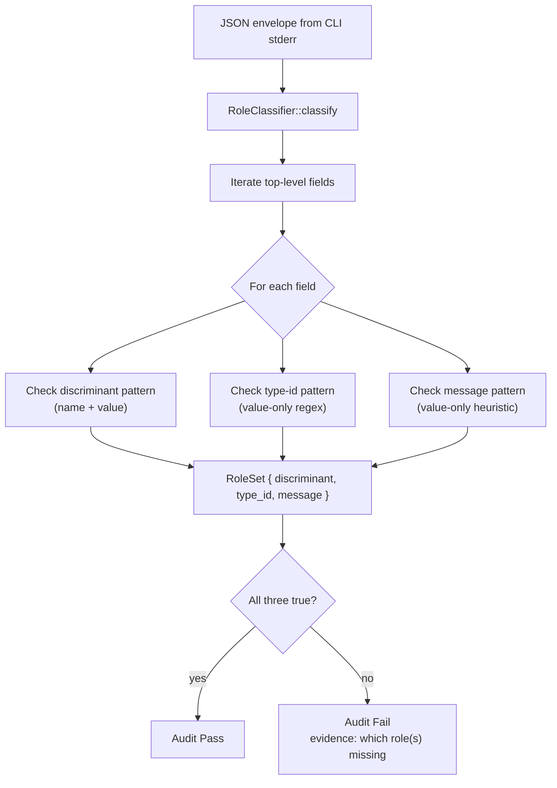
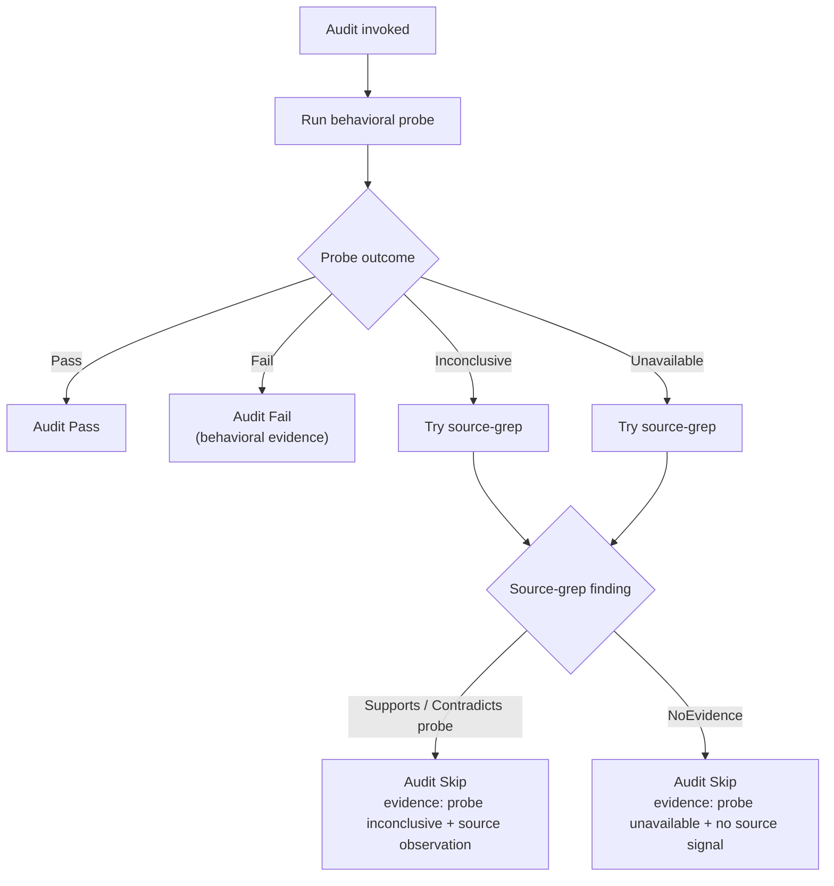

# refactor: Role-based audit validators — stop hardcoding field names and CLI dialects

## Summary

Several `anc` audits enforce a specific vocabulary (field names, attribute names, function names) when what they
actually care about is the **semantic role** that vocabulary plays for an agent. The most visible case is
`p2-must-json-errors`, which insists on the literal keys `error`/`kind`/`message` even when a CLI emits the
strictly-more-informative `status`/`reason`/`exit_code`/`message` shape that `anc` itself dogfoods (see
`src/skill_install.rs::InstallEnvelope`). Other audits in the same category: `p1-must-env-var`, `p6-must-global-flags`,
`p7-naked-println`, and `code-unwrap`.

The fix is not to flip these audits one-by-one. The fix is a small framework: a **role-based shape validator** for JSON
payloads, and a **behavioral-first probe with structural fallback** policy for the source-grep audits. Implementing the
framework is roughly 800–1200 lines; the per-audit migrations are mostly mechanical after that. The plan reframes 5
audits explicitly and lays out a path for the rest.

This work pays off in three ways:

1. **It unsticks compliant CLIs that picked different names.** xurl-rs, agentnative-cli itself, and bird all use richer
   envelopes than anc currently accepts. The current behavior tells well-designed CLIs they're noncompliant.
2. **It catches CLIs that game the names.** Today, `{"error":"ok","kind":"Auth failed: token
   expired.","message":"auth_required"}` passes — three correctly-named fields with the wrong shapes. A role-based check
   fails it.
3. **It documents the spec's actual contract.** The audits become readable as English assertions about agent experience,
   not regex against a particular library's API.

---

## Problem Frame

### The structural-vs-behavioral tension

`anc` ships three audit layers (`src/audits/{source,behavioral,project}/`). The split was always intended to be:
**behavioral checks measure outcomes; source checks are cheap fallbacks for what behavioral checks can't reach**. In
practice both layers have drifted toward hardcoded vocabulary.

The source layer is the easier target — every check there is a regex/ast-grep against a particular library's API
surface:

| File                                            | Audit                  | What it checks for in source                                                             |
| ----------------------------------------------- | ---------------------- | ---------------------------------------------------------------------------------------- |
| `src/audits/source/rust/unwrap.rs`              | `code-unwrap`          | Literal `.unwrap()` call expressions (recently fixed to skip `#[cfg(test)]`-gated items) |
| `src/audits/source/rust/sigterm.rs`             | `p6-must-sigterm`      | `tokio::signal::unix::SignalKind::terminate` or `signal_hook`-shaped imports             |
| `src/audits/source/rust/no_color.rs`            | tty/color flag         | `NO_COLOR` env var check                                                                 |
| `src/audits/source/rust/enumerate_valid_set.rs` | clap enum patterns     | derive macro inspection                                                                  |
| `src/audits/source/python/sys_exit.rs`          | python sys.exit        | call expressions                                                                         |
| `src/audits/source/python/bare_except.rs`       | python broad except    | except clauses                                                                           |
| `src/audits/source/python/sigterm.rs`           | python signal handling | imports                                                                                  |
| `src/audits/source/python/no_color.rs`          | python tty/color       | env reads                                                                                |

Source checks are cheap and deterministic, but they encode the spec author's mental model of *which* library does
*which* job. The moment a CLI uses an equivalent but differently-named pattern — `expect()` instead of `unwrap()`
(already an issue), `is_terminal()` instead of `atty`, a custom error enum instead of `thiserror`'s — the audit either
over-fires or under-fires.

The behavioral layer should be the antidote, but several behavioral checks reproduce the same dialect-bias inside the
probe. The audit in question, `src/audits/behavioral/json_errors.rs`, IS behavioral — it actually invokes the CLI and
parses stderr. But once it has the parsed JSON, it asserts on hardcoded keys.

### A concrete failure case

xurl-rs 1.3.0, post-U5 implementation. The CLI emits this envelope on `xr --bogus-flag --output json`:

```json
{
  "status": "error",
  "reason": "invalid-args",
  "exit_code": 2,
  "message": "error: unexpected argument '--bogus-flag' found\n\nUsage: xr ..."
}
```

This is the shape `anc` recommends in
`docs/solutions/architecture-patterns/anc-cli-output-envelope-pattern-2026-04-29.md` and that `anc skill install` itself
emits. It is unambiguously a well-formed error envelope.

`anc audit /home/brett/dev/xurl-rs --output json` reports:

```json
{
  "id": "p2-must-json-errors",
  "status": "fail",
  "evidence": "JSON error envelope on stderr is missing required keys: error, kind. Spec requires at least `error`, `kind`, and `message`."
}
```

The audit reads the envelope, sees it's missing `error` and `kind`, and fails. The envelope is *strictly more
informative* than the hardcoded shape (`status` doubles as discriminant and machine-parseable enum; `exit_code` carries
the int agents would otherwise have to scrape from the process exit; `reason` is the typed kebab-case identifier). The
check is enforcing a specific dialect, not a semantic contract.

### A second failure mode — passing envelopes that should fail

The current name-based check can be gamed trivially:

```json
{
  "error": "ok",
  "kind": "Server Error: Authentication failed.",
  "message": "auth_required"
}
```

Three correctly-named fields. The check passes. But:

- `error: "ok"` — wrong discriminant value (says "ok" in an error envelope).
- `kind` is a long human sentence, not a typed identifier.
- `message` is a kebab-case token, not prose.

An agent receiving this can't dispatch correctly. The audit shouldn't pass it. **A role-based check would catch it.**

### Why one-off fixes are insufficient

We could fix `p2-must-json-errors` alone by adding `status` / `reason` / `exit_code` to its accepted-keys list. That
kicks the can:

- The same drift will happen again when the spec evolves.
- It doesn't address the same pattern in `p1-must-env-var` (checks for `env = "..."` clap attribute when what matters is
  that the env var actually overrides the flag), `p6-must-global-flags` (checks `global = true` clap attribute when what
  matters is the flag works across subcommands), and `p7-naked-println` (checks for `println!` regex in source when what
  matters is that stderr is clean under `--output json`).
- It doesn't catch the gaming case above.

The right unit of change is the **validation framework**, not the audit list.

---

## Requirements

| ID  | Requirement                                                                                                                                                                                                                                                                             |
| --- | --------------------------------------------------------------------------------------------------------------------------------------------------------------------------------------------------------------------------------------------------------------------------------------- |
| R1  | `p2-must-json-errors` passes for any envelope that contains a discriminant value indicating error, at least one identifier-shaped field, and at least one prose-shaped field — regardless of the field names.                                                                           |
| R2  | `p2-must-json-errors` fails for envelopes that have the right keys but wrong value shapes (the gaming case above).                                                                                                                                                                      |
| R3  | `p1-must-env-var`, `p6-must-global-flags`, `p7-naked-println`, and `code-unwrap` migrate from source-grep-as-MUST to a tiered model: behavioral probe is the authoritative check; source heuristic is a fallback that emits `Skip` (not `Fail`) when the behavioral probe couldn't run. |
| R4  | A new `src/role_check.rs` module ships the role classifier used by R1–R2 and reusable by future audits.                                                                                                                                                                                 |
| R5  | A new `src/audits/probe_or_source.rs` helper wraps the tiered behavioral-first / source-fallback flow for R3-class audits.                                                                                                                                                              |
| R6  | Every reframed audit gains a fixture set covering: a clean-pass envelope, a gaming-passes-under-current-rules envelope (must fail under new rules), a clean-fail envelope, and an unambiguous source-only-detectable case for the fallback path.                                        |
| R7  | Regression coverage: the existing `anc check anc --output json` self-dogfood test continues to pass on every reframed audit. anc's own `InstallEnvelope` and CLI surface must remain compliant.                                                                                         |
| R8  | Backward compatibility: CLIs using the old `error`/`kind`/`message` shape continue to pass (their values still satisfy the role test). The change is purely additive — it accepts a superset of what passed before.                                                                     |
| R9  | The migration is reversible: any reframed audit can be reverted to its old structural form by reverting one commit. Each audit migration is its own commit.                                                                                                                             |
| R10 | The reframed audits are documented with English assertions in their module rustdoc, not in code comments. A reader who never grepped a source file should be able to read `src/audits/behavioral/json_errors.rs` and understand the contract.                                           |

---

## Scope Boundaries

**In scope:**

- The role classifier module (`src/role_check.rs`).
- The probe-or-source helper (`src/audits/probe_or_source.rs`).
- Reframing 5 audits: `p2-must-json-errors`, `p1-must-env-var`, `p6-must-global-flags`, `p7-naked-println`,
  `code-unwrap`.
- Fixture set per reframed audit.
- Documentation pass on each reframed audit's rustdoc.

**Deferred to follow-up work:**

- Reframing the remaining source-grep audits (`p6-must-sigterm`, `no_color`, `bare_except`, the python siblings). Same
  pattern applies; do one repo at a time so the framework's edges surface incrementally.
- A `consistent-envelope` audit reframe so that the cross-verb envelope-shape check also uses roles. Out of scope here
  because the current check works for the dialect anc enforces; once R1 lands, `consistent-envelope` becomes the natural
  follow-up.
- The structural side of `code-unwrap` — already correctly fixed in PR #77 (`#[cfg(test)]`-gated exemption). This plan
  tracks it through the reframe, not the cfg-test fix.
- The audit-profile mechanism (`--audit-profile human-tui` etc.) is unaffected. It composes orthogonally with role-based
  checks.

**Outside this product's identity:**

- Any change to the audit-ID taxonomy (`p1-must-…`, `p6-may-…`) — the IDs stay stable across the reframe so consumers'
  scoring tooling doesn't break.
- Any cross-cutting source-AST rewrite. The reframed audits still use ast-grep where source-fallback is invoked.

---

## Key Technical Decisions

### KTD1. Roles are detected from value shape, not field name

A JSON envelope has three roles to fill for agent dispatch:

| Role                | What it tells the agent                                 | Shape heuristic                                                                                                                                                   |
| ------------------- | ------------------------------------------------------- | ----------------------------------------------------------------------------------------------------------------------------------------------------------------- |
| **Discriminant**    | "This is an error envelope (not success, not dry-run)." | Value is one of a closed set: string `"error"`, `"failed"`, `"err"`, `"fail"`; boolean `false`; or any string matching the regex `^err(or)?$` case-insensitively. |
| **Type identifier** | "Specifically, the kind of error is X."                 | String matching `^[a-z][a-z0-9_-]*$` (kebab-case OR snake-case OR constant-case), length ≤ 64 chars, no whitespace, no period, no comma.                          |
| **Human message**   | "Here's what to surface to the user."                   | String containing at least one space and ending with a period or exclamation OR length ≥ 32 chars OR matches the regex `[a-z] [a-z]`.                             |

The classifier walks the top-level object, classifies each scalar value (recursing into nested objects ONE level, capped
to prevent unbounded scan), and emits a `RoleSet { discriminant: bool, type_id: bool, message: bool }`. The audit passes
if all three are `true`.

**Why these shapes:**

- The discriminant test is restrictive on purpose. A field whose value is the string `"OK"` shouldn't be classified as
  an error discriminant just because it's a string in the right slot.
- The type-id test is strict — no spaces, no period. This explicitly rejects "Auth failed: token expired." in a `kind`
  slot. Identifier values are short and machine-parseable.
- The message test is permissive — most prose qualifies. The risk is that a long type-id
  (`http-401-bearer-token-expired-please-reauthenticate`) might match, but the no-space rule on type-id and the
  has-space rule on message keep them disjoint.

**Worked examples:**

```json
// PASS — all three roles present, regardless of names
{"status": "error", "reason": "invalid-args", "exit_code": 2, "message": "unexpected argument '--bogus'"}
//      ^discriminant     ^type_id                              ^message

// PASS — old shape, still passes (R8 backward compat)
{"error": "auth required", "kind": "auth_required", "message": "Please run xr auth login."}
//                                  ^type_id                    ^message
// Note: "error" string value isn't itself the discriminant; "auth required" is prose.
// The discriminant comes from the FIELD existing with an error-shaped value;
// see KTD1.5 below for the field-presence vs value-shape resolution.

// FAIL — gaming case (R2)
{"error": "ok", "kind": "Server Error: Authentication failed.", "message": "auth_required"}
//        ^"ok" is success-shaped, not error
//                       ^contains spaces and period — fails type_id shape
//                                                              ^kebab — fails message shape (no space)

// FAIL — only message present
{"error": "Something went wrong."}
// Discriminant present (field "error" with prose); type_id missing; message present.

// FAIL — only type_id present
{"code": "auth-required"}
// Discriminant present (field name "code" hints error); type_id present; message missing.
```

### KTD1.5. Discriminant detection is two-pronged

Discriminant detection has both a **field-name-suggests-error** check and a **value-is-error-shaped** check. A field
passes the discriminant role if EITHER:

- The field name matches `^(error|status|state|outcome|result|kind|type|code|reason|severity|level)$` AND the value is
  error-shaped per the table above; OR
- The field value alone is one of the closed-set error strings (covers cases where the spec author used an unusual field
  name).

This makes the role test robust against both naming creativity and shape-only games.

### KTD2. Behavioral probes are authoritative; source-grep is a Skip-class fallback

For `p1-must-env-var`, `p6-must-global-flags`, `p7-naked-println`, and `code-unwrap`, the audit MUST attempt a
behavioral probe first. The source-grep falls back ONLY when the probe can't run — and when it falls back, the audit
emits `Skip` with structured evidence explaining the fallback reason, **not** `Fail` based purely on source heuristic.

**Why Skip-not-Fail when falling back:**

The source heuristic is brittle by definition (KTD1 problem). When the behavioral probe fails because of a missing
dependency, a non-executable artifact, or a CLI that doesn't ship binaries to PATH, the audit doesn't have enough
information to assert a MUST violation. `Skip` with evidence `"behavioral probe unavailable: …"` is honest; `Fail` based
on source-grep alone produces the false negatives the user flagged.

**When the source heuristic SHOULD still fail:**

If the behavioral probe ran but the source-grep finds a clear violation (e.g., `println!("{result}")` in a release-mode
function, not in a `cfg(test)` block, not behind a verbose-gate), the audit can still emit `Fail` — but only as a
**double-confirmation**, after the behavioral probe also failed. The source-grep alone is never sufficient.

**Mechanism — `src/audits/probe_or_source.rs`:**

```rust
pub struct ProbeOrSource<'a> {
    pub audit_id: &'a str,
    pub probe: Box<dyn Fn(&Project) -> ProbeOutcome + 'a>,
    pub source_fallback: Option<Box<dyn Fn(&Project) -> SourceOutcome + 'a>>,
}

pub enum ProbeOutcome {
    Pass { evidence: Option<String> },
    Fail { evidence: String },
    Inconclusive { reason: String },  // probe ran but couldn't form a verdict
    Unavailable { reason: String },   // probe couldn't run at all (no binary, etc.)
}

pub enum SourceOutcome {
    Supports,           // source agrees with probe's verdict
    Contradicts,        // source disagrees; probe is authoritative but log this
    NoEvidence,
}

impl<'a> ProbeOrSource<'a> {
    pub fn run(&self, project: &Project) -> AuditStatus {
        match (self.probe)(project) {
            ProbeOutcome::Pass { evidence } => AuditStatus::Pass(evidence.unwrap_or_default().into()),
            ProbeOutcome::Fail { evidence } => AuditStatus::Fail(evidence.into()),
            ProbeOutcome::Inconclusive { reason } => self.fallback_to_source(project, &reason),
            ProbeOutcome::Unavailable { reason } => self.skip_with_source_note(project, &reason),
        }
    }
    // ... fallback_to_source emits Warn or Skip with structured evidence;
    //     skip_with_source_note emits Skip with reason and any source observations.
}
```

The wrapper is small (~100 LOC + tests). Every reframed audit gains a `ProbeOrSource` constructor and the wrapper
handles the policy.

### KTD3. Worked reframing — `p1-must-env-var`

Today: source-greps for `env = "..."` on every `#[arg(...)]` attribute. Fires `Warn` if any agentic flag is missing it.

Reframed:

1. **Probe:** For each agentic flag (`--output`, `--quiet`, `--no-interactive`, `--timeout`), run the binary twice:

- Once with the flag: `tool subcmd --quiet`. Capture exit + output.
- Once with the env var: `TOOL_QUIET=1 tool subcmd`. Capture exit + output.
- The audit passes if both runs produce equivalent output (modulo timing). Equivalence is approximated by comparing exit
  codes and stripping volatile fields from the captured stderr (timestamps, request IDs).
- If the binary isn't on PATH or doesn't accept the subcommand, probe `Unavailable`.
- If the probe ran but both outputs differ in non-volatile ways, probe `Fail`.

1. **Source fallback:** Existing source-grep, but now demoted to `Skip` evidence per KTD2.

**Concrete pass case (xurl-rs):**

```bash
$ XURL_QUIET=1 xr search "test" --output json | head -1
{"status":"ok","posts":[]}
$ xr search "test" --output json --quiet | head -1
{"status":"ok","posts":[]}
# Equivalent → pass.
```

**Concrete fail case (a CLI that ignores its own env var):**

```bash
$ MY_QUIET=1 mytool ls --output json
{"status":"ok","files":[{...}]}
Processing 12 items...   # stderr noise that --quiet would suppress
$ mytool ls --output json --quiet
{"status":"ok","files":[{...}]}
# stderr is empty
# Stderr differs → fail.
```

### KTD4. Worked reframing — `p7-naked-println`

Today: ast-grep for `println!`/`eprintln!`/`print!`/`eprint!` outside designated output modules. Fires `Warn` (or `Fail`
when explicit) on any hit.

Reframed:

1. **Probe:** Run `tool <any-output-producing-subcommand> --output json --quiet`. Capture stdout and stderr separately.

- Stdout MUST parse as JSON or NDJSON. (If JSONL, every line parses.)
- Stderr MUST be empty (or contain only structured-content; see below).
- The audit fails if stderr contains text matching `^[A-Z]`/`^[a-z]` (i.e., naked human prose) — that's the leak.

1. **Stderr-tolerant case:** If `--verbose` is also set, stderr may contain diagnostic text; in that case the probe is
   skipped (because the user opted into verbose).
2. **Source fallback:** ast-grep finds `println!` outside output modules → `Warn` with file:line. Demoted from MUST.

**Concrete pass case (xurl-rs, post-U8 implementation):**

```bash
$ xr search "test" --output json --quiet 2>/tmp/stderr-capture
{"status":"ok","posts":[]}
$ wc -c /tmp/stderr-capture
0 /tmp/stderr-capture
# Empty stderr → pass.
```

**Concrete fail case:**

```bash
$ mytool ls --output json --quiet 2>/tmp/stderr-capture
{"status":"ok","files":[]}
$ cat /tmp/stderr-capture
Loaded 12 files from cache.
Done.
# Naked prose on stderr → fail. The agent now has to parse two streams.
```

### KTD5. Worked reframing — `p6-must-global-flags`

Today: source-greps for `global = true` on the agentic-four `#[arg]` attributes. Fires `Warn` if any flag is missing it.

Reframed:

1. **Probe:** Discover up to N (say, 5) subcommands via `tool --help`. For each, invoke `tool <subcommand> --quiet
   --help` and assert exit 0. If clap accepted `--quiet` at the subcommand level, the flag is global.

- Similarly for `--output json`, `--timeout 1`, `--no-interactive`.

1. **Source fallback:** existing source-grep, demoted.

This catches a class of bug source-grep can't catch: a CLI that *advertises* `global = true` but a subcommand intercepts
the flag and ignores it.

### KTD6. Worked reframing — `code-unwrap`

Today (post-PR #77, just-merged): ast-grep for `.unwrap()` outside `#[cfg(test)]`-gated items.

Reframed:

1. **Probe:** Fuzz the binary briefly. Invoke `tool <discovered-subcommand>` with deliberately malformed input (an empty
   body, a string that should be a number, a path that doesn't exist) and assert the binary exits with a structured
   error envelope, not a panic backtrace. A panic backtrace contains `panicked at` or `RUST_BACKTRACE`; a structured
   envelope doesn't.
2. **Source fallback:** the existing cfg-test-aware ast-grep, demoted.

The behavioral check catches what source-grep can't: an `expect()` that panics on bad input (source-grep on `.unwrap()`
misses it), a `.unwrap_or_else(|| panic!(...))` (source-grep also misses), and a `let Some(x) = y else { unreachable!()
}` (source-grep also misses).

### KTD7. Keep source checks as fixture validation tools

After the reframe, the source-grep functions stay in the codebase as `pub(crate)` helpers, callable from tests. Each
reframed audit's test suite uses them as one of its fixture-generation tools: "given this source pattern, the
source-grep should detect it; given that source pattern, it shouldn't." This keeps the source-grep code well-exercised
even when it's no longer the primary check.

---

## High-Level Technical Design

### The role-classifier flow



### The probe-or-source flow



### Where the new modules sit

```text
src/
├── role_check.rs           NEW. RoleClassifier + RoleSet + tests.
├── audits/
│   ├── mod.rs              MODIFIED. Wire probe_or_source into audit registry.
│   ├── probe_or_source.rs  NEW. ProbeOrSource + ProbeOutcome + SourceOutcome + tests.
│   ├── behavioral/
│   │   ├── json_errors.rs       MODIFIED. Use RoleClassifier.
│   │   ├── env_flags.rs         MODIFIED. Probe-first env-var check; source as fallback.
│   │   ├── global_flags.rs      MODIFIED. Probe-first subcommand fan-out; source as fallback.
│   │   ├── naked_println.rs     MODIFIED. Probe-first stderr-emptiness; source as fallback.
│   │   └── ...                  (other behavioral audits unchanged)
│   ├── source/
│   │   └── rust/
│   │       └── unwrap.rs        MODIFIED. Demoted to fallback. Probe lives in behavioral/.
│   │   └── (other source audits unchanged for now)
│   └── ...
└── tests/
    └── role_check_fixtures.rs   NEW. The clean-pass / gaming-pass / clean-fail / source-only-fail fixtures.
```

### The probe execution model

Probes share one execution helper: `Project::spawn(&[args])` which already exists. The new wrapper,
`Project::spawn_with_env(&[args], &[(env, val)])`, lets env-var probes set per-spawn env without polluting the parent
process. Both probes capture stdout, stderr, and exit code via `Output`.

Probes have a hard timeout (3 seconds default; configurable per audit). A timed-out probe emits `Inconclusive { reason:
"probe timeout (3s)" }`, which routes to the source fallback per KTD2.

---

## Implementation Units

### U1. `src/role_check.rs` — the role classifier

- **Goal.** Ship the `RoleClassifier` (KTD1) with full test coverage of pass/fail/edge cases. No audit changes yet —
  this is the foundation.
- **Requirements.** R1, R2, R10.
- **Dependencies.** None.
- **Files.**
- **New:** `src/role_check.rs`. Types: `RoleSet`, `RoleClassifier`. Functions: `classify(value: &serde_json::Value) ->
  RoleSet`, plus the three role predicates as `pub(crate)` helpers for testing.
- **New:** `tests/role_check_tests.rs`. 25+ table-driven cases covering pass, fail, gaming, edge cases (empty object,
  deeply nested, null values, numeric values, boolean values, scientific-notation strings).
- **Approach.**
- `RoleClassifier::classify(value)` walks `value.as_object()` top-level entries. For each `(name, val)`:
- If `is_discriminant_field(name, val)`: set `discriminant = true`.
- If `is_type_id_value(val)`: set `type_id = true`.
- If `is_message_value(val)`: set `message = true`.
- One-level recursion into nested objects (e.g., `{"error": {"code": "...", "detail": "..."}}`). Cap at depth 2 to bound
  the scan.
- The three predicates are independent — a single field can fill multiple roles (e.g., the `message` field in the old
  shape both names "message" and contains prose).
- Edge cases the test suite must cover:
- Empty object `{}` → all three false.
- Single field, prose value, no error name → message present, others absent.
- Boolean `false` in a field named `success` → discriminant via value-shape (`false` is in the closed set when paired
  with success-coded name).
- Numeric `exit_code: 2` → counts as type_id-equivalent? **No.** Type-id is strictly string-valued; integers aren't
  agent-dispatchable identifiers in the same way (they're often domain-meaningful but not closed-set).
- String values longer than the type-id cap (64 chars) → not a type-id even if they're kebab-case.
- **Patterns to follow.** anc's existing audit-status types (`AuditStatus::Pass`, `AuditStatus::Fail`); the existing
  evidence-string conventions. Tests follow the table-driven style of `src/audits/source/rust/unwrap.rs`'s
  recently-added test module.
- **Test scenarios.**
- Happy path: anc's own InstallEnvelope. Passes.
- Happy path: xurl-rs's `{status, reason, exit_code, message}` envelope. Passes.
- Happy path: legacy `{error, kind, message}` envelope (R8 backward compat). Passes.
- Gaming case: `{error:"ok", kind:"Server Error: ...", message:"auth_required"}`. Fails — message slot has a kebab-case
  value.
- Subtle fail: `{status:"error", message:"Bad request."}` — discriminant + message but no type_id. Fails.
- Subtle fail: `{error:"Auth failed", message:"Auth failed."}` — two prose fields, no type_id. Fails.
- Subtle fail: `{code:"auth-required"}` — type_id only. Fails.
- Edge: deeply nested object beyond depth 2 → classifier doesn't see inner fields. Document this as intentional.
- Edge: array-valued top-level `{"errors":["..."]}` → not yet supported. Document as limitation; revisit if real CLIs
  use this shape.
- Verification: `classify` of a canonical pass envelope returns `RoleSet { discriminant: true, type_id: true, message:
  true }`.
- **Verification.** `cargo test --test role_check_tests` — all 25+ tests green.

### U2. `src/audits/probe_or_source.rs` — the tiered audit wrapper

- **Goal.** Ship the `ProbeOrSource` wrapper (KTD2) with the tiered policy. No audit migrations yet — this is the second
  foundation piece.
- **Requirements.** R3, R5.
- **Dependencies.** None. (U1 and U2 can be implemented in parallel; they don't share types.)
- **Files.**
- **New:** `src/audits/probe_or_source.rs`. Types: `ProbeOrSource`, `ProbeOutcome`, `SourceOutcome`. The `run` method
  drives the policy.
- **Modified:** `src/audits/mod.rs`. Re-export `ProbeOrSource`.
- **New:** `tests/probe_or_source_tests.rs`. Test cases use mock closures to exercise every (probe outcome × source
  outcome) cell of the policy matrix.
- **Approach.**
- Policy matrix (probe outcome rows, source outcome columns):

| Probe \ Source | Supports                  | Contradicts                                   | NoEvidence         |
| -------------- | ------------------------- | --------------------------------------------- | ------------------ |
| Pass           | Pass                      | Pass                                          | Pass               |
| Fail           | Fail (double-confirmed)   | Fail (probe authoritative; log contradiction) | Fail (probe alone) |
| Inconclusive   | Warn (source agrees)      | Skip (conflict, no verdict possible)          | Skip               |
| Unavailable    | Warn (source-only signal) | Skip                                          | Skip               |

- The Inconclusive+Supports cell emits `Warn` because the source signal lends weight to a verdict but isn't enough
  alone. The Inconclusive+Contradicts cell emits `Skip` because the audit has no verdict.
- Every emitted status carries an `evidence` string that names which path was taken: `"behavioral probe failed:
  <reason>; source-grep also found: <files>"` etc.
- **Patterns to follow.** anc's existing audit-runner module structure. The closure-based probe API mirrors how
  `src/probe.rs` already accepts `fn(&Project) -> AuditStatus` for some audits — the new wrapper just adds the typed
  outcome layer.
- **Test scenarios.**
- Each cell of the matrix above gets a dedicated test using stub closures.
- Edge: probe panics → wrapper catches via `std::panic::catch_unwind`, treats as Unavailable with reason "probe
  panicked".
- Edge: source fallback panics → same handling.
- Edge: no source fallback supplied → Inconclusive/Unavailable both route to Skip.
- **Verification.** `cargo test --test probe_or_source_tests` — all matrix cells green.

### U3. Reframe `p2-must-json-errors`

- **Goal.** Replace the hardcoded-keys check in `src/audits/behavioral/json_errors.rs` with a call to
  `RoleClassifier::classify`. Preserve the behavioral probe (run `tool --bogus-flag --output json`); only the validation
  logic changes.
- **Requirements.** R1, R2, R6, R7, R8.
- **Dependencies.** U1.
- **Files.**
- **Modified:** `src/audits/behavioral/json_errors.rs`. Replace the existing keyset check (~30 LOC) with a
  `RoleClassifier::classify` call (~10 LOC) and route the resulting `RoleSet` into a pass/fail with role-by-role
  evidence.
- **Modified:** `tests/json_errors_tests.rs` (or extend the existing inline test module). Add fixtures from R6:
  clean-pass-with-new-shape, clean-pass-with-old-shape, gaming-passes-old-fails-new, clean-fail.
- **Approach.**
- The probe stays unchanged: spawn the CLI with deliberately-bad args + `--output json`, capture stderr.
- On JSON parse failure of stderr: emit `Fail` with evidence "stderr was not valid JSON".
- On JSON parse success: call `RoleClassifier::classify(&envelope)`. If all three roles present → Pass. Otherwise → Fail
  with evidence naming missing role(s): "JSON envelope missing role(s): type_id (no kebab-case identifier-shaped value
  found among top-level fields)".
- **Patterns to follow.** The current audit's probe-construction code stays. Only the validation block changes.
- **Test scenarios.**
- Clean pass — xurl-rs 1.3.0 envelope. Passes.
- Clean pass — anc's own InstallEnvelope. Passes.
- Clean pass — bird's error envelope (whatever shape it has). Test against a known good CLI; if it fails, document as a
  real bug to fix in bird, not in anc.
- Backward-compat pass — legacy `{error, kind, message}` shape. Passes (R8).
- Gaming fail — `{error:"ok", kind:"Server Error", message:"auth_required"}`. Fails.
- Clean fail — `{message:"Bad request."}` alone. Fails (missing type_id).
- Regression — self-dogfood: `anc check ./agentnative-cli/target/release/anc --output json` continues to pass on this
  audit.
- **Verification.** `cargo test --test json_errors_tests`. Then `cargo build --release && ./target/release/anc audit
  /home/brett/dev/xurl-rs --output json | jaq '.results[] | select(.id == "p2-must-json-errors") | .status'` returns
  `"pass"`.

### U4. Reframe `p1-must-env-var` as probe-or-source

- **Goal.** Migrate the env-var check to behavioral-first per KTD3, with the existing source-grep as Skip-class
  fallback.
- **Requirements.** R3, R5, R6.
- **Dependencies.** U2.
- **Files.**
- **Modified:** `src/audits/behavioral/env_flags.rs`. Replace the audit's direct source-grep call with a `ProbeOrSource`
  constructor whose probe sets the env var and compares output with/without it.
- **Modified:** `src/probe.rs` (or wherever `Project::spawn` lives). Add `spawn_with_env(args, env)` helper.
- **Modified:** `tests/env_flags_tests.rs`. Add probe-success, probe-fail (env var ignored), probe-unavailable (binary
  not on PATH) fixtures.
- **Approach.**
- Probe runs in two passes per agentic flag (`--output`, `--quiet`, `--no-interactive`, `--timeout`). Each pass: spawn
  `tool <discovered-subcommand> <flag>` vs `TOOL_<FLAG>=<value> tool <discovered-subcommand>`. Compare exit + stripped
  stderr.
- Equivalence-stripping rules: drop timestamps (`\d{4}-\d{2}-\d{2}T\d{2}:\d{2}:\d{2}`), request IDs
  (`req_[a-f0-9]{8,}`), and process PIDs.
- Source fallback: existing ast-grep for `env = "..."` attribute on agentic flags. Demoted to `Skip` per KTD2.
- **Patterns to follow.** anc's existing behavioral probe pattern (`src/audits/behavioral/json_errors.rs` for
  spawn-and-parse, `src/probe.rs` for the spawn helper).
- **Test scenarios.**
- Probe pass: a fixture CLI where `--quiet` and `TOOL_QUIET=1` produce identical output. Pass.
- Probe fail: a fixture CLI where the env var is recognized by clap but ignored at runtime (the verbose code path runs
  regardless). Fail.
- Probe unavailable: a target with no binary on PATH. Source fallback runs; emits Skip with evidence "behavioral probe
  unavailable: binary not on PATH; source-grep found `env = "..."` on all four agentic flags".
- Regression: xurl-rs 1.3.0 (post-U5+U6) passes via the behavioral path.
- **Verification.** xurl-rs 1.3.0 audit shows `p1-must-env-var: pass`.

### U5. Reframe `p6-must-global-flags` as probe-or-source

- **Goal.** Migrate the global-flag check per KTD5.
- **Requirements.** R3, R5, R6.
- **Dependencies.** U2.
- **Files.**
- **Modified:** `src/audits/behavioral/global_flags.rs`. Probe discovers subcommands from `tool --help` and invokes each
  with the agentic flags.
- **Approach.**
- Probe: parse `tool --help` for a list of subcommand names (clap's standard format). For up to 5 subcommands, invoke
  `tool <subcommand> --quiet --output json` and assert exit ≠ 2 (clap's "unrecognized flag" exit code).
- Source fallback: existing ast-grep for `global = true`. Demoted.
- **Test scenarios.**
- Probe pass: a fixture CLI where every subcommand accepts the four agentic flags. Pass.
- Probe fail: a fixture CLI where one subcommand rejects `--quiet` (clap exit 2). Fail with evidence "subcommand `mytool
  oddsubcmd` did not accept `--quiet` (exit 2)".
- Probe unavailable: same Skip path as U4.
- Regression: xurl-rs passes.

### U6. Reframe `p7-naked-println` as probe-or-source

- **Goal.** Migrate the naked-println check per KTD4.
- **Requirements.** R3, R5, R6.
- **Dependencies.** U2.
- **Files.**
- **Modified:** `src/audits/behavioral/naked_println.rs`. Probe: run a discovered output-producing subcommand with
  `--output json --quiet` and assert stderr is clean.
- **Modified (demoted):** `src/audits/source/rust/no_color.rs` — actually a different audit. The source-grep we're
  demoting is in `src/audits/source/rust/` — find the existing `println` source check (it may be inlined in
  `naked_println.rs` already since the audit registry calls source from behavioral here; confirm at implementation
  time).
- **Approach.**
- Probe: discover an output-producing subcommand. For xurl-rs that'd be `search`, `whoami`, or any read-only verb. Run
  with `--output json --quiet`. Assert:
- stdout parses as JSON or NDJSON.
- stderr is empty OR contains only `^\{` lines (an additional structured-stderr envelope, e.g., warnings).
- Source fallback: existing ast-grep. Demoted.
- **Test scenarios.**
- Probe pass: xurl-rs (post-U8) with stderr empty under JSON+quiet. Pass.
- Probe fail: a fixture CLI that prints "Loaded 12 items" to stderr in JSON mode. Fail.
- Probe pass with structured stderr: a CLI that emits `{"warning":"token-near-expiry"}` to stderr — allowed.

### U7. Reframe `code-unwrap` as probe-or-source

- **Goal.** Migrate the unwrap check per KTD6. The cfg-test exemption from PR #77 stays in place for the source
  fallback.
- **Requirements.** R3, R5, R6.
- **Dependencies.** U2.
- **Files.**
- **New:** `src/audits/behavioral/panic_resistance.rs` (the new behavioral home; the existing `code-unwrap` audit ID
  stays).
- **Modified:** `src/audits/source/rust/unwrap.rs`. The cfg-test-aware ast-grep stays here as the source fallback.
  Demoted from MUST.
- **Approach.**
- Probe: invoke `tool <subcommand>` with three classes of bad input:
- Empty / whitespace-only positional arg.
- Path that doesn't exist.
- Numeric arg that's negative or zero.
- For each invocation, assert the process exits with a structured error envelope OR a clear error message — NOT a panic
  backtrace. Detect panic by searching stderr for `panicked at`, `RUST_BACKTRACE`, or `thread 'main' panicked`.
- Source fallback: existing cfg-test-aware ast-grep from PR #77. Demoted to `Warn` evidence ("source-grep found N
  `.unwrap()` calls in non-test code; behavioral probe confirmed no panic on bad input" / "...didn't run").
- **Test scenarios.**
- Probe pass: xurl-rs survives all three bad-input classes without panic.
- Probe fail: a fixture CLI with `let x: u32 = input.parse().unwrap();` on stdin → panics on non-numeric input.
- Probe unavailable: same Skip path.

### U8. Documentation pass — rewrite reframed audits' module rustdoc as English assertions

- **Goal.** R10. Each reframed audit's `//!` block (module-level doc comment) becomes a plain-English description of
  what it asserts and why, with code links to the implementation.
- **Requirements.** R10.
- **Dependencies.** U3, U4, U5, U6, U7.
- **Files.**
- **Modified:** the five reframed audit files' top-of-file `//!` doc comments. ~20 lines each.
- **Approach.**
- Each doc block names: the agent-experience invariant ("an agent receiving an error envelope must be able to dispatch
  on a discriminant, a type identifier, and a human message"); the probe design ("we invoke the CLI with a
  deliberately-malformed argument and parse stderr"); the source fallback ("when the binary isn't available, we fall
  back to ast-grep for `env = ...` attributes, demoted to Skip"); the known failure modes ("a CLI that returns the right
  keys with wrong shapes is still caught").
- No "TODO" / "FIXME" comments. No reference to specific PR numbers (those rot). Reference durable docs only — corpus
  paths under `docs/solutions/`, the audit-ID + tier in the spec, the canonical envelope shape doc.
- **Test scenarios.** Doc-test: `cargo test --doc` continues to pass. Manually: a reader who's never seen the codebase
  reads each `//!` and can describe what the audit does.
- **Verification.** `cargo doc --no-deps --open` renders cleanly; reviewer reads the five audit pages.

---

## Verification Strategy

After every U-merge:

1. **Self-dogfood:** `cargo build --release && ./target/release/anc audit . --output json | jaq '.summary'`. Every
   previously-passing audit must continue to pass. `p2-must-json-errors` and the four reframed audits must pass on anc
   itself.
2. **xurl-rs check:** `./target/release/anc audit /home/brett/dev/xurl-rs --output json | jaq '.results[] |
   select(.status != "pass")'`. The five reframed audits should all pass on xurl-rs 1.3.0 after U3-U7 land.
3. **bird check:** same against the bird CLI. Document any divergences as either real bird bugs or anc over-fits.
4. **Cross-language coverage:** run the same against a Python CLI in the test fixtures (anc ships several). The
   role-based JSON check is language-agnostic; the others should be too.

End-state acceptance criteria:

- `anc check ./agentnative-cli/target/release/anc --output json` reports 100% pass on the reframed audits.
- `anc check /home/brett/dev/xurl-rs --output json` shows `p1-must-env-var`, `p2-must-json-errors`,
  `p6-must-global-flags`, `p7-naked-println`, `code-unwrap` all at `pass` without any xurl-rs change. (xurl-rs becomes
  the canonical "yes the framework works" test.)
- No previously-passing audit regresses.

---

## Risks & Dependencies

| Risk                                                                                                                              | Likelihood | Impact | Mitigation                                                                                                                                                                                                                                                                            |
| --------------------------------------------------------------------------------------------------------------------------------- | ---------- | ------ | ------------------------------------------------------------------------------------------------------------------------------------------------------------------------------------------------------------------------------------------------------------------------------------- |
| Role classifier false-positives — a CLI emits a valid envelope but the classifier flags it as missing a role                      | medium     | medium | The fixture set in U1 is the regression guard; add new fixtures whenever a real CLI surfaces a false positive. Document the heuristics' limits in the module rustdoc.                                                                                                                 |
| Role classifier false-negatives — the gaming case slips through                                                                   | low        | high   | The U1 test suite includes the explicit gaming fixture from KTD1's worked example. Add more as people invent new gaming shapes.                                                                                                                                                       |
| Behavioral probes flake — network calls during audit, timing-sensitive output                                                     | medium     | medium | Probes have a 3s timeout; on timeout they're Inconclusive (Skip), not Fail. No probe is allowed to invoke a network call — the bad-arg probes hit clap's parse layer, which fails before network.                                                                                     |
| Source fallback gets called too often, polluting the score with Skips                                                             | low        | medium | Per KTD7, the source-grep is exercised by the test suite even when no audit run hits it, so coverage stays high. Audit dashboards can group Skip-due-to-fallback separately from Skip-due-to-N/A.                                                                                     |
| Cross-language drift — the role-based JSON check is universal but the env-var / global-flag / unwrap probes are Rust-shaped today | medium     | low    | The probes are mostly language-agnostic (they just spawn binaries). The Python siblings (`src/audits/source/python/`) are out of scope here; revisit when reframing them in follow-up.                                                                                                |
| Backward compatibility — a CLI that's currently passing under the old check loses Pass under the new role-based check             | medium     | high   | R8 is the gate. Every "currently passes" envelope must be added to the U1 fixture set BEFORE merging U3. If any real CLI regresses, the merge is rejected until the fixture is incorporated or the heuristic is loosened.                                                             |
| User confusion — agents that hardcode the old keys break                                                                          | low        | medium | The new check doesn't change anc's own envelope (anc already uses the new shape per `InstallEnvelope`). xurl-rs and similar CLIs that emit new-shape envelopes were always emitting them; the check change just stops penalizing them. Pure CLIs with old-shape envelopes still pass. |

---

## Sources & Research

External findings that materially shaped this plan:

- `docs/solutions/architecture-patterns/anc-cli-output-envelope-pattern-2026-04-29.md` — the canonical envelope shape
  this plan validates. Drives KTD1 and U1.
- `docs/solutions/best-practices/behavioral-vs-structural-must-when-authoring-spec-requirements-20260420.md` — describes
  the observable-invariant principle. Drives the framing of every reframed audit's rustdoc (U8).
- `docs/solutions/best-practices/consistent-json-schema-across-success-and-error-paths-2026-04-20.md` — explains why
  context fields belong on every JSON path and why the discriminant matters. Supports the role distinctions in KTD1.
- `docs/solutions/best-practices/agent-native-semantic-json-fields-over-stderr-warnings-2026-04-20.md` — explains why
  stderr cleanliness matters for `p7-naked-println`'s reframe (KTD4).
- `docs/solutions/best-practices/cli-unified-log-module-with-no-color-support-2026-04-20.md` — the structural pattern
  xurl-rs uses; the reframed `p7-naked-println` validates the OUTCOME of this pattern (clean stderr) rather than the
  source structure.

Internal source-of-truth files referenced by the plan:

- `src/skill_install.rs::InstallEnvelope` — anc's own envelope, the canonical shape.
- `src/audits/behavioral/json_errors.rs` — the current implementation to be replaced.
- `src/audits/source/rust/unwrap.rs` — the just-landed cfg-test-aware fix (PR #77) that stays in place as fallback.
- `src/probe.rs` — the existing spawn helper that probes will extend.

Gaps in the corpus this plan accepts as fresh design judgment:

- No prior precedent for a probe-or-source tiered audit framework. KTD2 is fresh design built on the corpus's
  "behavioral-vs-structural MUST" principle.
- No prior precedent for the role-shape heuristics in KTD1. The discriminant / type-id / message split is a synthesis of
  how the corpus envelope doc, JSON-RPC error format, and OpenAPI Problem Details all carve up the same space.

---

## Execution Posture

Implementation is mechanical once the framework lands. Suggested sequence for a single-person engineer:

1. **Day 1:** U1 and U2 in parallel. They share no types. Each is 100-200 LOC + tests. Land both before any audit
   migration.
2. **Day 2:** U3 (the smallest reframe — one validation block swap). Use the resulting fixture set as a template for
   U4-U7.
3. **Day 3-4:** U4-U7 in parallel. Each reuses the U2 wrapper.
4. **Day 5:** U8 documentation pass + cross-CLI verification.

For a team handoff: each U is independently mergeable, so they can be split across reviewers. The U1+U2 pair is the
highest-leverage review — get those right and the rest follow.

A future plan (deferred per Scope Boundaries) should reframe the remaining source-grep audits (`p6-must-sigterm`, python
siblings, `no_color`, `bare_except`). Same pattern applies; doing them in a separate plan keeps each PR small and each
fixture set focused.
