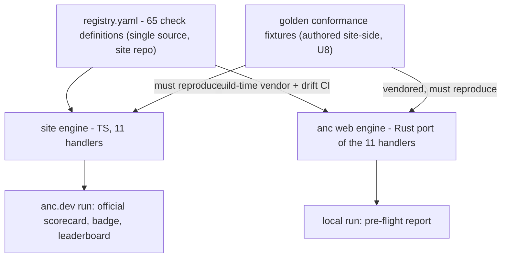
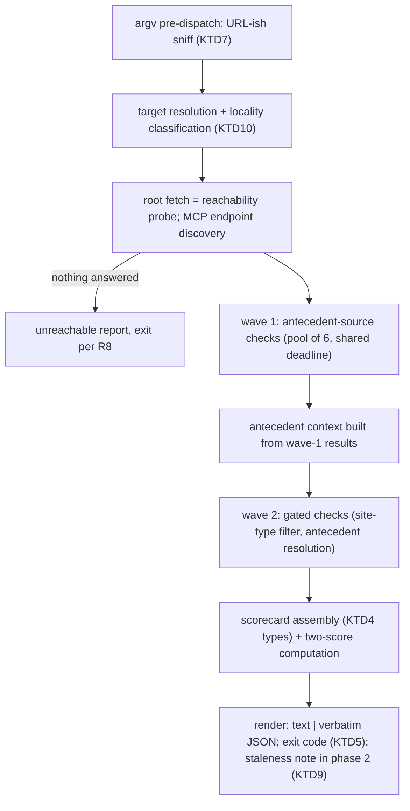
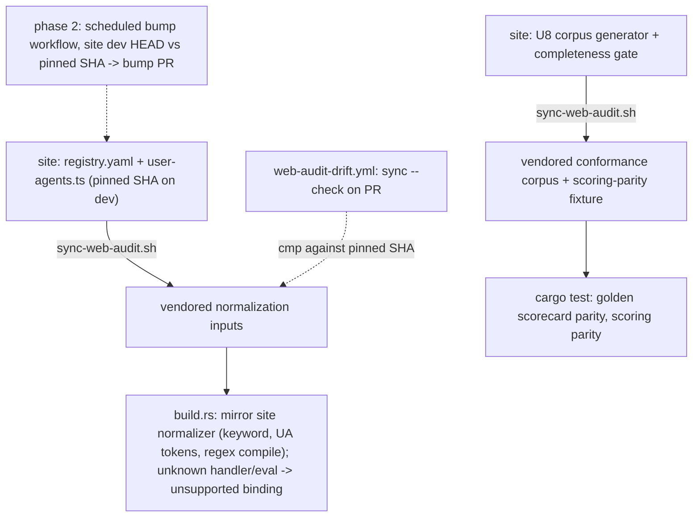

# Local Web Audit - Plan

## Goal Capsule

- **Objective:** A dev whose server anc.dev cannot reach — localhost, an internal host, a pre-deploy stack — gets the
  complete web audit locally, with results they can trust to match the public run, without exposing anything outside
  their network.
- **Means:** `anc web <target>` runs a Rust-native port of the site's registry-driven check engine on a ureq/rustls
  blocking stack (KTD1), with the check registry and conformance fixtures vendored from `agentnative-site` at build time
  (KTD3, KTD4).
- **Product authority:** This plan owns the CLI feature and the site-side companion units (U8, U9) — no separate plan
  exists in the site repo. `agentnative-site` remains canonical for check definitions, engine semantics, and the "Web
  audit" / "check" / "probe" vocabulary (`agentnative-site:CONCEPTS.md`).
- **Phases:** The phase line follows dependency, not convenience. Phase 1 ships everything that needs no anc.dev
  endpoint: U1–U8, U10, U11, U13, all eleven handler kinds, the conformance corpus and suite, the fix catalog and its
  readers, the docs, and the skill coverage diff. Phase 2 ships only what depends on U9's served signal: U9 and U12 (R6,
  KTD9, the scheduled registry-bump workflow).
- **Stop conditions:** Stop and surface to the user if U1's measured binary delta exceeds ~5MB (the size bet behind KD2
  fails), or if corpus generation in U8 reveals the TS engine is nondeterministic for fixed inputs (the parity mechanism
  fails).

---

## Product Contract

Preservation note — changed: R8 (exit codes adopt the site web-audit runner's convention, user-approved at synthesis),
R9 (fixtures are authored site-side then vendored — no corpus exists today), R10 (site hooks enumerated and pulled into
this plan's units), R6 (JSON-mode staleness note surfaces on stderr), AE6 (reworded to the deliverable DNS property).
Added: R12–R14, KD8, AE6–AE9. Dependencies updated (site-side work moved from external dependencies into U8/U9).
Outstanding Questions resolved into the Planning Contract.

### Summary

Bring the anc.dev web audit — 65 registry-defined checks across 6 categories — into the `anc` binary as `anc web
<target>`, batteries included, emitting the same JSON the site produces. Check definitions stay single-source in the
site repo and vendor in at build time; the 11 generic probe handlers are ported to Rust once and held to parity by
golden fixtures authored site-side. The site-side vendoring hooks (fixture generator, version signal) are units of this
plan.

### Problem Frame

The deployed anc.dev auditor rejects loopback, RFC1918, and internal hostnames by design
(`agentnative-site:src/worker/audit-web/ssrf.ts`; the operations runbook states localhost targets cannot be audited
through the public API). A dev auditing an internal site therefore had to publish it to an obfuscated public URL — a
security-unacceptable workaround, and one most devs in organizations lack the authority to perform at all.

The site's Bun runner (`agentnative-site:scripts/web-audit/audit.ts`) can audit arbitrary live targets, but it presumes
a bun runtime and a site checkout — neither can be assumed on a dev machine, and neither is an `anc` command. The
audience that most needs local auditing is exactly the audience that can't assemble that toolchain.

### Key Decisions

- KD1. **Local runs are dev-loop pre-flight only.** (session-settled: user-directed — chosen over first-class local
  scorecards and self-attested badge claims: local results are unverifiable.) Official scorecards, badges, and the
  leaderboard remain anc.dev-exclusive.
- KD2. **Rust-native engine port with vendored data.** (session-settled: user-approved — chosen over an embedded JS
  engine and a site-adopts-WASM inversion: smallest binary, site engine untouched, checks stay single-source data.)
  Handlers and scoring are ported once and fixture-enforced; hard parity is the aim, best-effort divergence the accepted
  floor when environments genuinely differ. Governs R5, R9.
- KD3. **`anc web` is canonical; bare URL-ish targets are sugar.** (session-settled: user-approved — chosen over a
  sugar-free subcommand and over overloading `anc audit`: explicit form for agents and CI, one-token invocation for
  humans.) Governs R1, R2.
- KD4. **All checks run, with honest labels.** (session-settled: user-approved — chosen over a curated local profile and
  over simulating the public view: the dev always sees the full parity picture.) Governs R4.
- KD5. **Staleness surfaces in web-audit reports only.** (session-settled: user-directed — chosen over
  `--help`/`--version` surfaces: those commands stay offline-pure, per anc's own audit principles.) Governs R6.
- KD6. **Output is the site's JSON shape verbatim.** (session-settled: user-approved — chosen over an anc metadata
  envelope or a new schema: a local run diffs directly against a public run.) Governs R7.
- KD7. **The agent-web-audit skill is a designed-for consumer.** (session-settled: user-directed — chosen over a
  note-only follow-up: convergence on one probe engine is verified at ship, not hoped for.) Governs R11.
- KD8. **External-DNS checks auto-gate on target locality, with an override.** (session-settled: user-directed — chosen
  over always-run-with-disclosure: the default must not leak internal hostnames off-network.) Governs R12.



### Requirements

**Command surface**

- R1. `anc web <target>` runs the full web audit against an HTTP(S) target — hostname, host:port, or URL; local,
  internal, or public.
- R2. A bare URL-ish first argument routes to the web audit; an existing path or discoverable binary of the same name
  wins the tie, and a token that fails the hostname grammar keeps today's fast offline audit-path error.
- R3. The audit needs nothing from the host system — no dig, curl, node, or bun; TLS trust roots ship in the binary.

**Audit behavior**

- R4. Every registry check appears in every report; a check that cannot run against the target reports n_a or skip with
  a stated reason, never a silent drop.
- R5. For the same target and registry version, local verdicts and scores match the site engine's, enforced in CI by the
  vendored conformance fixtures.
- R6 (phase 2). When the vendored registry is older than the live anc.dev registry, the report carries an upgrade note —
  inline in text mode, on stderr in JSON mode so the verbatim shape holds; when that version signal is skipped or
  unreachable, the note is omitted and the run is otherwise unaffected. In phase 1 the report names the vendored
  registry version and the pinned site SHA, and a run makes no anc.dev connection.
- R12. Checks that query external DNS resolvers do not fire for local or private targets (IPv4 and IPv6 alike); gated
  checks report n_a with a stated reason, and `--external-dns` forces them on.
- R13. A run against an unresponsive or tarpitting target completes within the engine's per-audit deadline, reporting
  partial results per R4 rather than hanging the shell or CI step.

**Output**

- R7. `--output json` emits the site's web-audit scorecard shape verbatim — field-for-field the JSON anc.dev produces,
  scores included.
- R8. Text output follows anc's existing text conventions; exit codes adopt the site web-audit runner's convention (pass
  = 0, any failing status = 1, n_a = 3), so CI gates agree with the site's own runner.
- R15. Every failing row carries actionable guidance at the point of failure: text mode prints the goal, the fix and its
  doc links under each failing check, and an offline reader serves the same catalog to agents. A run's time to first fix
  needs no second tool, no browser and no network.
- R16. A run that cannot produce a scorecard says what happened, why, and what to try next: JSON mode emits the repo's
  structured error envelope and text mode names the problem, the cause and the next action.
- R17. The binary has one exit-code contract across every verb, and a run's output names the code it is returning and
  what earned it.
- R14. Agents can discover the check vocabulary and the web-scorecard JSON shape offline, via `anc emit` variants for
  both.

**Vendoring**

- R9. Check definitions vendor verbatim from the site repo at CLI build time via the established sync-script + drift-CI
  - build-codegen pattern; conformance fixtures are authored in the site repo (U8) and vendor the same way; nothing is
    fetched at runtime.
- R10. The probe engine is never published as a depend-able package (npm, crates.io, JSR); site-repo changes stay
  limited to the vendoring hooks this plan defines (fixture generator, corpus-completeness gate, version signal) and the
  one registry content change U8 carries, the Vary-header pattern expressed without lookaround — no engine
  restructuring.

**Ecosystem consumer**

- R11. The agent-web-audit skill's report is constructible from `anc web --output json` and exit codes; the coverage gap
  between the skill's 32-check registry and the site's 65-check registry is diffed and either closed or documented as
  accepted gaps before ship.

### Key Flows

- F1. **Local pre-flight loop.**
  - **Trigger:** Dev runs `anc web localhost:8787` (or a bare URL-ish target).
  - **Steps:** Target resolves; vendored registry loads; probe waves run with antecedent gating; report renders
    verdicts, n_a reasons, scores, and any staleness note; exit code gates the shell or CI step.
  - **Outcome:** An actionable fix list with zero public exposure.
  - **Covers R1–R8, R12, R13.**
- F2. **Pre-flight to official.**
  - **Trigger:** Local report is clean and the site deploys publicly.
  - **Steps:** Dev (or anyone) runs the audit on anc.dev; the official scorecard and badge mint from the public run.
  - **Outcome:** The local promise holds — what passed locally passes publicly — and official artifacts stay
    anc.dev-only.
  - **Covers R5.**
- F3. **Skill as consumer.**
  - **Trigger:** An agent invokes the agent-web-audit skill against a target.
  - **Steps:** The skill shells out to `anc web <target> --output json` and builds its report from the result.
  - **Outcome:** One probe engine serves the site, the CLI, and the skill.
  - **Covers R11.**

### Acceptance Examples

- AE1. **Covers R2.** Given a file or directory named `anc.dev` in the working directory, when the dev runs `anc
  anc.dev`, then the CLI audit of that path runs; given no such path and no binary of that name, then the web audit of
  the `anc.dev` host runs.
- AE2. **Covers R4.** Given target `http://localhost:8787`, when audited, then TLS-dependent checks report n_a with a
  stated reason rather than failing or disappearing.
- AE3. **Covers R6.** Given a machine with no route to anc.dev, when a local target is audited, then the report
  completes normally with no staleness note and no error.
- AE4. **Covers R5.** Given a public target and a current vendored registry, when audited locally and via anc.dev, then
  verdicts and scores are identical.
- AE5. **Covers R3, R4.** Given an internal HTTPS target signed by a private CA, when audited, then TLS-dependent checks
  report what the bundled trust roots observed — a failure, honestly labeled — with no trust-store override available in
  v1.
- AE6. **Covers R12.** Given target `http://intranet.corp.internal`, when audited without flags, then no query reaches a
  third-party DoH resolver — the hostname touches only the machine's own configured resolver — and DNS checks report n_a
  ("needs public DNS — verified on anc.dev"); when audited with `--external-dns`, the DoH queries fire.
- AE7. **Covers R13.** Given a target that accepts connections but never responds, when audited, then the run completes
  within the per-audit deadline with unprobed checks reported per R4 and a failing exit code per R8.
- AE8. **Covers R2.** Given `anc report.json` where no such file exists and no binary of that name is on PATH, when
  invoked, then the run fails fast and offline through today's audit error path — no DNS lookup, no connection attempt.
- AE9 (phase 2). **Covers R6.** Given a stale vendored registry and `--output json`, when a public target is audited,
  then stdout carries only the verbatim scorecard JSON and the upgrade note appears on stderr.

### Success Criteria

- The vendored conformance suite passing against both engines is the evidence behind the parity claim; a divergence is a
  red build, not a support ticket.
- Binary growth stays within the ceiling U1 measures and records: ~5MB delta over today's 3.4MB release binary is the
  stop-condition threshold, and the plain aws-lc-rs build ships (no size-optimized crypto configuration).
- The incident test: a dev audits an internal-only site end to end — install anc, run one command, read the report —
  with nothing exposed publicly at any step; the target hostname reaches no third-party resolver or proxy.

### Scope Boundaries

**Deferred for later**

- Authenticated targets (custom headers, cookies, mTLS) — the v1 target must be reachable unauthenticated from the dev's
  machine.
- A trust-store flag for private-CA HTTPS targets.
- Rewiring the agent-web-audit skill to shell out to `anc web` (its own change, in its own repo; R11 only guarantees it
  can).
- Runtime registry refresh between anc releases.
- Phase 2 of this plan: the anc.dev version signal and staleness note (R6, KTD9, U9), `anc emit web-checks` and `anc
  emit web-schema` (R14), and the scheduled registry-bump workflow (U12).

**Outside this product's identity**

- Badges, official scorecards, or leaderboard entries minted from local runs.
- Uploading or submitting local results anywhere.
- Publishing the probe engine as a reusable package.
- Restructuring the site's engine beyond the U8/U9 vendoring hooks.

<!-- ce-section: work-relationships -->
### How This Work Fits Together

This plan owns the CLI feature and the site-side vendoring hooks (U8, U9 — committed in `agentnative-site`, planned
here, with no separate site plan).

- agent-web-audit skill rewiring — this work **enables** it; a later change in the skill's own repo swaps its 32-check
  Python probe script for `anc web`. U11's coverage diff is the input that change will consume.
- `agentnative-spec` — this work **can proceed independently of** it; web checks are defined by the site registry, not
  the spec's principle registry.

### Dependencies / Assumptions

- The site's probe engine remains fetch-only — standard `fetch`/`URL`/`AbortController`, no Workers-specific APIs in the
  probe path (verified; the Bun runner exists because of it).
- The site's `dev` branch is the vendoring source: `guard-main-docs.yml` blocks `scripts/scoring/` from `main`, and the
  existing `sync-skill-fixture.sh` already defaults to `dev` for the same forever-branch reason. The sync pins a
  committed SHA on that branch (KTD3); GitHub permits fetch-by-SHA, which the mechanism relies on.
- ureq/rustls/webpki-roots/aws-lc-rs/regex license clearance through `deny.toml` is unvalidated territory (zero network
  crates exist today); U1 proves it before anything builds on the stack — including adding `CDLA-Permissive-2.0`
  (webpki-roots' Mozilla-CA-bundle license) to the allow list as a recorded decision.
- Internal targets are reachable unauthenticated from the machine running `anc`.

### Sources

- `agentnative-site:src/data/web-audit/registry.yaml` — 65 checks, 6 categories, 11 handler kinds; entry schema fields:
  `id, category, tier, principle, site_types, antecedent, eval, weight, handler, with, hint, title`. `keyword` is
  build-derived from `tier` (required→must, recommended→should, optional→may) and rejected if hand-authored; the
  registry also carries required top-level blocks `version`, `mcp_discovery`, `categories`, `category_order`.
- `agentnative-site:src/build/13-web-audit-registry.mjs` — the normalizer KTD3's codegen mirrors: keyword derivation,
  `{ua:...}` token expansion (throws on literal UA strings), and structural validation.
- `agentnative-site:src/shared/user-agents.ts` (+ `src/shared/site-url.ts`) — probe UA token map and `AUDIT_USER_AGENT`;
  behavioral test inputs, vendored per KTD3/KTD8.
- `agentnative-site:src/worker/audit-web/` — `engine.ts` (wave orchestration, antecedent gating, 25s deadline, degraded
  2s timeout, concurrency 6, eval-rule dispatch, optional-absent re-tag), `scorecard.ts` (`WebScorecard` shape,
  `WEB_SCHEMA_VERSION = '0.4'`, 7-state `ScorecardStatus`), `score.ts` (two-score formula mirroring
  `scripts/scoring/score_model.py`; parity test `tests/web-audit-two-score.test.ts`), `handlers/` (shared `runX(check,
  ctx) -> ProbeOutcome` contract; `mcp.ts` is 815 lines and stateful; `http.ts` also hosts the legacy-alias-redirects
  eval function), `ssrf.ts` (`guardedFetch`: manual redirect loop, 4-hop cap, per-hop revalidation, three body-cap
  regimes — 0 skip, 64 KiB truncate-and-continue, unset full-read for the root fetch), `antecedents/site-type.ts`
  (`site_type` is caller-supplied; null applies every check; `mcp`-typed checks gate on endpoint discovery).
- `agentnative-site:scripts/web-audit/audit.ts` — local-runner precedent: arg surface (`--target`, `--check`, `--json`,
  `--site-type`) and the `STATUS_EXIT` exit-code convention R8 adopts.
- `scripts/sync-skill-fixture.sh`, `.github/workflows/skill-fixture-drift.yml`, `build.rs` (`emit_skill_hosts`) — the
  vendoring pattern U2 extends; the codegen validation mirrors the site build script, the precedent KTD3 follows.
- `src/skill_install.rs` — the git hardening surface (`GIT_HARDEN_FLAGS`, `GIT_HARDEN_ENV_*`) U2's sync script mirrors
  in shell form.
- `src/argv.rs` — `inject_default_subcommand`;
  `docs/solutions/best-practices/clap-default-subcommand-via-argv-pre-parse-20260415.md` — the seven argv pre-parse
  gotchas U7 must honor.
- `docs/solutions/architecture-patterns/xurl-subprocess-transport-layer.md` — reqwest ripped out of a sibling repo (303
  transitive crates); the Transport-trait pattern KTD1 follows.
- `docs/solutions/design-patterns/pin-a-cross-language-hand-mirror-to-the-wire-json-not-a-shared-type.md` — wire-JSON
  parity pinning with strict rejection (KTD4). Marked stale on its worked example; the pattern statement is what this
  plan uses.
- `docs/solutions/integration-issues/cdn-tarpit-ua-less-probes-web-audit-deadline-exhaustion.md` — identifying
  User-Agent requirement (KTD8) and the egress-class parity hazard.
- `docs/solutions/best-practices/rust-bounded-http-reads-with-take-2026-04-20.md` — bounded body reads (U1 pattern;
  bounds apply to decompressed bytes).
- `docs/solutions/best-practices/agentnative-version-model-2026-05-01.md` — the ecosystem version-literal table KTD9
  slots into.
- External: ureq 3.x (no HTTP/2 — acceptable; body exposes `std::io::Read` for SSE; proxy support requires explicit
  `Proxy::try_from_env()` wiring; redirects disabled at the agent per KTD1), rustls `aws-lc-rs` backend (rustls's
  default; requires a C toolchain — and CMake or nasm on some targets — which U1 must prove out on the
  `x86_64-pc-windows-gnu` cross-compile check and the native `windows-latest` CI job), webpki-roots (bundled Mozilla CA
  set, CDLA-Permissive-2.0), regex (linear-time engine; the registry carries no lookaround once U8 rewrites the
  Vary-header pattern).

---

## Planning Contract

### Key Technical Decisions

- KTD1. **Networking stack: ureq 3.x (blocking) + rustls with the `aws-lc-rs` backend + webpki-roots, behind a
  single-hop `Transport` trait.** (session-settled: user-directed — chosen over reqwest/tokio: a sibling repo already
  removed reqwest over a 303-crate transitive tree, and probes are one-shot calls that don't need an event loop;
  attohttpc rejected for having no rustls option; the `ring` backend rejected because it is security-only maintained by
  the rustls team since 2025-02 (RUSTSEC-2025-0007, withdrawn once that arrangement was in place) and rustls recommends
  aws-lc-rs, accepting the aws-lc-sys C-toolchain requirement (cmake on every target, NASM on Windows) into CI, the
  release matrix, and the local Windows cross-compile check. The measured aws-lc-rs cost is ~4MB, so U1's size ceiling
  is ~5MB and the plain build ships.) The trust store stays webpki-roots — bundled roots are the parity requirement (R3,
  AE5), separable from the provider choice. Contract details:
  - The Transport is **single-hop**: the ureq agent has redirects disabled; a `src/web_audit/fetch.rs` layer above it
    ports `guardedFetch` — the manual redirect loop, the 4-hop cap, per-call follow/no-follow, header lowercasing, and
    the never-throws error-result shape — so the mock seam matches the site's `fetchImpl` boundary by construction.
  - Every hop, initial target and each redirect destination alike, is locality-classified (KTD10) before connecting:
    cloud-metadata ranges (`169.254.0.0/16`, IMDS IPv6) are refused outright, and a hop whose locality class crosses
    from the resolved target's class is refused with a `blocked:` evidence string in place of the response.
  - Proxy selection is **per-request**: targets classified local/private bypass any configured proxy; public paths
    (public targets, DoH resolvers, the U9 version signal) honor `HTTP_PROXY`/`HTTPS_PROXY` via `Proxy::try_from_env()`
    and `NO_PROXY`.
  - Body caps mirror the site's three regimes: `Some(0)` skips the body, `Some(AUDIT_PROBE_MAX_BODY_BYTES)` (64 KiB, a
    named constant matching the site's) **truncates and continues** with a truncation flag — never an error — and `None`
    reads fully (the canonical root fetch's regime) up to `AUDIT_ROOT_MAX_BODY_BYTES` = 16 MiB of decompressed bytes,
    past which the read truncates and continues with the flag set and an evidence note on the root-derived checks. The
    site reads the root fully within Workers memory; the local ceiling is a knowing OOM-safety divergence for pages over
    16 MiB. Bounds apply to decompressed bytes, so a compression bomb stops at the ceiling.
  - Registry `*_regex` patterns compile with the `regex` crate, linear-time by construction, under flags chosen to match
    JavaScript's `i` and `im` semantics where the crate can (ASCII classes for `\d` and `\w`, explicit line-terminator
    classes where `.` is used). Lookaround and backreferences fail the build naming the check id; the one such pattern
    in the registry today, the Vary-header check, is rewritten without lookaround in U8. Residual JS-vs-Rust semantic
    differences are measured by the U8 regex-parity fixture through the U5 test, and any the flags cannot close are
    named here.
  - gzip decoding on by default, brotli feature enabled for fetch parity. TLS failures carry evidence distinguishing
    "chain rejected by bundled roots" from other TLS errors, so a stale-root false negative is self-diagnosable: the
    fetch layer matches `ureq::Error::Rustls(rustls::Error::InvalidCertificate(CertificateError::UnknownIssuer))`, which
    needs `rustls` as a direct dependency at the exact version ureq resolves (ureq does not treat the wrapped error as
    API), and the U1 self-signed-server test pins that coupling. Governs R3.
- KTD2. **Concurrency and deadlines port as a thread pool, not async, and the deadline is enforced at request issue
  time.** A pool of 6 worker threads mirrors the engine's `DEFAULT_CONCURRENCY`; one shared deadline instant mirrors the
  25s per-audit budget; a dead root fetch drops per-check timeouts to the degraded 2s mode. Blocking I/O cannot be
  cancelled from outside, so `AbortController` semantics map to: every request is issued with ureq's `timeout_global` =
  min(per-check timeout, remaining budget); the collector waits on a channel with `recv_timeout` until the deadline and
  then assembles the scorecard, resolving unreturned checks as skip; stalled workers are abandoned, never joined, and
  exit with the process. A trickling-body tarpit and a never-responds tarpit are both tested against the wall clock.
  Governs R13.
- KTD3. **Vendor the full normalization input set pinned to a committed site SHA; `build.rs` mirrors the site build
  script, with two failure classes.** The sync set is `registry.yaml` **plus** `src/shared/user-agents.ts` and
  `src/shared/site-url.ts` — the engine consumes the *normalized* registry, so the UA token map and the normalizer's
  rules are vendored data, not Rust constants. The codegen (via the existing `serde_yaml` dependency) mirrors
  `agentnative-site:src/build/13-web-audit-registry.mjs`: it derives `keyword` from `tier` (rejecting a hand-authored
  one), expands `{ua:...}` tokens against the vendored map (failing the build, naming the check id, on an unknown token
  or a literal User-Agent value), compiles every registry regex pattern at build time with the `regex` crate
  (lookaround, backreferences, or any pattern the crate rejects fails the build naming the check id), and emits the
  required top-level blocks (`version`, `mcp_discovery`, `categories`, `category_order`) as compiled tables.
  Structurally malformed entries fail the build loudly; a well-formed entry naming a handler kind **or eval rule** the
  Rust engine has not ported compiles to an unsupported binding that reports skip at runtime ("handler `<kind>` not yet
  ported to the local engine", per R4) — and any run containing such a skip flags its headline score as non-comparable
  (see U7), so degradation never masquerades as parity. The sync pins `WEB_AUDIT_SITE_SHA` rather than floating HEAD; in
  phase 1 the pin moves by a deliberate re-run of the sync script, and the phase 2 scheduled bump workflow (U12) makes
  staleness calendar-visible. Governs R9.
- KTD4. **Parity pins to the wire JSON.** Rust serde mirrors of `WebScorecard` and its rows reject out-of-contract
  values (unknown statuses, unknown fields fail deserialization loudly), so a canonical-side addition breaks the build
  instead of being silently misread. Every numeric field is an integer type: the site emits only half-up rounded
  integers (`score_pct`, `score.relative`, `score.global`, summary counts, coverage levels), and `JSON.stringify` prints
  an integral number as `85` where serde_json prints an `f64` as `85.0`, so an `f64` mirror can never byte-match; a
  future decimal field fails golden deserialization loudly. The golden corpus (U8) asserts byte-comparable scorecard
  JSON for fixed inputs; corpus exchanges are recorded at the single-hop `fetchImpl` boundary KTD1's Transport
  reproduces. Governs R5, R7.
- KTD12. **One exit-code table for the binary and the site runner, reached additively.** (DX review D8: KTD5 reopened
  because adoption on both sides is low enough that one reconciliation now is cheaper than two contracts forever.) The
  table is `0` clean, `1` warnings only, `2` failures present or a usage error, `3` could not check — an unreachable
  target, a probe that errored, or every selected check inapplicable. Web statuses become warnings or failures through
  the tier mapping the README already publishes (MUST miss → fail, SHOULD and MAY miss → warn), which the web registry
  supports because every check carries a tier. Nothing that exits `0`, `1` or `2` today changes meaning, so the addition
  is `3`, the case both tables lacked: a site nobody reached stops looking like a site with failures. `agentnative-site`
  `scripts/web-audit/audit.ts` adopts the same table, replacing its per-status `STATUS_EXIT`. Every run names the code
  it returns and what earned it, `--help` carries the table, and a test pins it so a later edit cannot quietly merge the
  cases. Supersedes KTD5. Governs R8, R17.
- KTD13. **Fix guidance is vendored data, delivered on its own surface.** (DX review D4.) `remediation.yaml` joins the
  sync set: 48K, exactly one entry per registry check, each with a goal, a markdown fix and doc links, already the
  site's single source for four consumers. Text mode prints the goal, the fix and its links under each failing row.
  Agents read the whole catalog offline through `anc emit web-remediation`, mirroring the site's `get_web_remediation`
  reader. The fix text never enters the scorecard object, so KD6's verbatim shape and U10's byte-parity test are
  untouched. Governs R15.
- KTD5. **(Superseded by KTD12.)** Exit codes adopt the site runner's `STATUS_EXIT` convention. (session-settled:
  user-approved — chosen over `anc audit`'s exit scheme: CI-gate parity with the site's own runner.) The mapping is new
  anc-side glue pinned by its own unit tests. A sniffed bare target moves that invocation from the usage-error exit
  space (2) to this result space — a documented behavior delta (System-Wide Impact). Governs R8.
- KTD6. **New parallel module tree `src/web_audit/`.** The existing `src/scorecard/mod.rs` (2,621 lines, typed against
  `AuditResult`/`AuditStatus`) shares no structure with `WebScorecard`; the web path reuses only `src/output.rs` and
  `src/color.rs` at the leaves.
- KTD7. **Bare-target URL sniffing is a new pre-dispatch step with a strict hostname grammar.** Today's injector only
  decides whether to inject `audit`; the URL-vs-path decision runs alongside it. Routing to web requires: an explicit
  scheme, or an explicit `:port`, or a dot-bearing token with no path separator whose final label is alphabetic
  (TLD-shaped). Path/binary existence wins ties; anything failing the grammar falls through to today's fast offline
  audit error — a dot-bearing filename typo must never trigger a network attempt (AE8). Every rule must be checked
  against the seven documented argv pre-parse gotchas. Governs R2.
- KTD8. **Identifying User-Agent, identical to the site engine's.** The site sends an identifying UA after the
  CDN-tarpit incident; the CLI sends the same UA family so servers classify both probes alike. `AUDIT_USER_AGENT` and
  the probe UA tokens are vendored from the site's shared module (KTD3), never restated as Rust constants. Residual
  risk: egress class differs (workstation vs Cloudflare), an accepted best-effort parity gap under KD2.
- KTD9 (phase 2). **Staleness compares vendored `spec_version` + registry version against the U9 site signal, for public
  targets only.** No version endpoint exists today; `spec_version` is only embedded in scorecard payloads. U9 defines
  the served signal; the CLI fetches it only during `anc web` runs against targets the locality classifier labels public
  — a local or private target's run makes no anc.dev connection at all — with a bounded timeout, silently skipping on
  any failure (per KD5 and R6). The remaining public-target fetch is disclosed in `anc web --help`. The new version
  literals get rows in the ecosystem version-model table
  (`docs/solutions/best-practices/agentnative-version-model-2026-05-01.md`).
- KTD10. **Locality classification mirrors the site's `ssrf.ts` and gates the whole request chain.** `locality.rs` ports
  the site's classifier verbatim: IPv4 literals in every inet_aton form (dotted, short-dotted, decimal, octal, hex),
  IPv6 literals bracketed or bare with zone ids stripped, IPv4-mapped (`::ffff:a.b.c.d`) and IPv4-compatible forms
  classified by their embedded IPv4 address, `[::]` and `0.0.0.0`, `localhost` and `.localhost`, and
  `metadata.google.internal` and `.internal` — all decided **before any resolution occurs**; remaining hostnames
  classify by system-resolved address class via the machine's own configured resolver, never a third-party one. Local
  classes: IPv4 loopback/RFC1918/link-local, IPv6 loopback (`::1`), ULA (`fc00::/7`), and link-local (`fe80::/10`) — an
  IPv6-only internal host must gate exactly like an IPv4 one or KD8's privacy property fails. The U4 scenario table is
  the site's `web-audit-ssrf.test.ts` table, one case per form. The gate wraps the dns-doh handler and the KTD9 version
  fetch; `--external-dns` bypasses the DNS gate. Redirect hops are classified per KTD1: metadata ranges and
  class-crossing hops are refused and recorded as `blocked:` evidence — never a silent public egress from a run the user
  believes is local. Cites R12 (KD8's governed requirement).
- KTD11. **`anc web` mirrors the site runner's `--site-type` and `--check` surface.** `site_type` is caller-supplied on
  the site (never auto-detected; null applies every check per `antecedents/site-type.ts`), so `--site-type content|api`
  is an optional flag with the same semantics, and `--check <id>` gates a single check with the per-status exit codes
  that make `n_a = 3` meaningful for CI and the skill consumer. Governs R1, R8.

### High-Level Technical Design

Run pipeline (one `anc web` invocation):



Deadline and pool (KTD2), one run:

```text
main thread                                   worker pool (6 threads)
-----------                                   -----------------------
deadline = now + 25s
root fetch ------------------------------->   timeout_global = min(per-check, deadline - now)
  | dead root: per-check = 2s
  |- wave 1: send checks ----------------->   each request issued with timeout_global = min(per-check, deadline - now)
  |    recv_timeout(deadline - now)  <-----   (status, evidence) per check
  |    past deadline: unreturned = skip("deadline")
  |- antecedent context
  |- wave 2: same loop
  \- assemble scorecard, render, exit code
       stalled workers are never joined; they exit with the process
```

Vendoring and parity pipeline (build and CI time):



### System-Wide Impact

- **Bare-invocation behavior delta.** Scripts relying on bare `anc "$X"` today get a fast offline exit 2 for any bad
  token; after KTD7, a grammar-passing token drives a network-touching run in the `STATUS_EXIT` code space (0/1/3)
  instead. U7 documents the split in `--help` and the release notes recommend explicit `anc audit` in scripts; U10
  regression-tests a corpus of previously-valid bare invocations to prove they still route to audit.
- **Emit symmetry (phase 2).** `anc emit schema` self-describes the CLI scorecard; the web family gets the same
  treatment in U12 — `anc emit web-checks` (vocabulary) and `anc emit web-schema` (scorecard shape) — so agents can
  validate either output family offline (R14).
- **Two scorecard schemas, one binary.** CLI scorecard 0.8 and web scorecard 0.4 version independently and are not
  comparable; U7's docs state which command emits which, mirroring the existing "Scorecard JSON fields" documentation
  convention.
- **DoH failure semantics.** A blocked or unreachable resolver (corporate egress filtering) must not read as "record
  absent": the dns-doh handler reports transport failure as error/skip with a stated reason, and only a
  resolver-confirmed absence as a failing verdict (U5) — otherwise filtered networks produce false negatives that break
  R5's promise for public targets.
- **Redirect crossings are refused and visible.** A hop that leaves the target's locality class — or lands in a
  cloud-metadata range — is refused per KTD1/KTD10 and recorded as `blocked:` evidence, preserving the Success
  Criteria's "nothing exposed publicly" property without silently following hostile redirects.

### Risks & Mitigations

- **Registry volatility vs drift CI.** The site registry is a 973-line surface that changes at feature cadence; PR-only
  drift checking (the `skill-fixture-drift.yml` model) goes silently stale when the CLI repo is quiet. Mitigation
  (KTD3): pin a committed site SHA now, and in phase 2 (U12) add a scheduled weekly workflow that diffs site `dev` HEAD
  against the pin and opens a bump PR — staleness becomes calendar-visible, Dependabot-shaped, instead of contingent on
  unrelated CLI activity.
- **aws-lc-sys build toolchain.** cmake is required on every target and NASM on x86-64 Windows. Checked against GitHub's
  runner-image inventory: cmake is preinstalled on every hosted image this project uses, NASM on none of them. Two
  surfaces compile the C library on Windows, CI's `check-windows` job and the release matrix's `x86_64-pc-windows-msvc`
  row, and three release rows build inside `cross` containers that do not inherit the host's cmake. Mitigation (U1): one
  opt-in NASM input on the two shared workflows in `brettdavies/.github`, and a `Cross.toml` `pre-build` in this repo
  for the container rows; the matrix is proven green before U3 starts.
- **New handler kinds outpacing the port.** A well-formed registry entry with an unported handler or eval rule must not
  hold vendoring hostage to an MCP-sized porting effort. Mitigation (KTD3): the unsupported binding compiles and reports
  skip with a named reason, the run's score is flagged non-comparable, and the bump PR's description lists any unported
  kinds so the gap is a visible, scheduled decision.
- **webpki-roots staleness.** A public target on a newly issued root can pass on anc.dev and fail locally — a parity
  break masquerading as a target defect. Mitigation: bump webpki-roots on every release (release-checklist item, same
  discipline as the toolchain pin), and KTD1's evidence distinguishes bundled-root rejection so an affected user
  self-diagnoses ("try a newer anc release") without the deferred trust-store flag.
- **Corpus lagging the registry.** A site PR adding a check without regenerating the U8 corpus leaves the newest check
  conformance-untested — no build failure, just an invisible gap. Mitigation: U8 includes a site-side CI gate asserting
  every registry check id has at least one corpus scenario before a registry-touching PR merges to `dev`.

### Assumptions

- The TS engine is deterministic for fixed fetch inputs (same responses in, same scorecard out). U8's generator proves
  this; nondeterminism is a stop condition.

---

## Implementation Units

| U-ID | Phase | Title                             | Repo | Key files                                                                                                                 | Depends on     |
| ---- | ----- | --------------------------------- | ---- | ------------------------------------------------------------------------------------------------------------------------- | -------------- |
| U1   | 1     | Networking foundation + size gate | cli  | `Cargo.toml`, `deny.toml`, `Cross.toml`, `src/web_audit/transport.rs`, `src/web_audit/fetch/`, `tests/fixtures/tls/`      | —              |
| U2   | 1     | Vendoring pipeline                | cli  | `scripts/sync-web-audit.sh`, `.github/workflows/web-audit-drift.yml`, `build.rs`, `tests/fixtures/web-audit-conformance/` | —              |
| U3   | 1     | Scorecard types + scoring         | cli  | `src/web_audit/scorecard.rs`, `src/web_audit/score.rs`, `schema/web-scorecard.schema.json`                                | U2             |
| U4   | 1     | Engine orchestration              | cli  | `src/web_audit/engine/`, `src/web_audit/locality.rs`                                                                      | U1, U3         |
| U5   | 1     | Eleven stateless handlers         | cli  | `src/web_audit/handlers/*.rs`                                                                                             | U4             |
| U6   | 1     | MCP handler                       | cli  | `src/web_audit/handlers/mcp/`                                                                                             | U4             |
| U7   | 1     | CLI surface                       | cli  | `src/cli.rs`, `src/argv.rs`, `src/main.rs`, `src/web_audit/render.rs`                                                     | U4             |
| U8   | 1     | Conformance corpus generator      | site | `scripts/web-audit/gen-fixtures.ts`, `src/data/web-audit/registry.yaml` (Vary pattern)                                    | —              |
| U10  | 1     | Conformance suite + dogfood       | cli  | `tests/web_audit_conformance.rs`, `tests/integration.rs`                                                                  | U5, U6, U7, U8 |
| U11  | 1     | Skill coverage diff               | cli  | `docs/web-audit-skill-coverage.md`                                                                                        | U7             |
| U13  | 1     | Docs and discovery                | both | `README.md`, `Cargo.toml`, `src/main.rs`, site refusal message                                                            | U7             |
| U9   | 2     | Version signal                    | site | worker route + build step                                                                                                 | —              |
| U12  | 2     | Staleness note and bump workflow  | cli  | `src/web_audit/render.rs`, `src/cli.rs`, `.github/workflows/web-audit-bump.yml`                                           | U7, U9         |

U1 also touches `brettdavies/.github` (`rust-ci.yml`, `rust-release.yml`: an opt-in NASM input for the two Windows jobs;
cmake needs no provisioning, since every hosted runner image already carries it).

### U1. Networking foundation and size gate

- **Goal:** Land the ureq/rustls/webpki-roots stack behind the single-hop `Transport` trait plus the guarded-fetch
  layer, and prove the size and license bets before anything builds on them.
- **Requirements:** R3. Implements KTD1 (session-settled; cites R3).
- **Dependencies:** None.
- **Files:** `Cargo.toml`, `deny.toml`, `Cross.toml`, `src/web_audit/mod.rs`, `src/web_audit/transport.rs`,
  `src/web_audit/fetch/{mod,redirect,body,proxy}.rs`, `tests/web_audit_transport.rs`, `tests/fixtures/tls/` (self-signed
  cert and key), and in `brettdavies/.github`: `rust-ci.yml`, `rust-release.yml` (opt-in NASM input, Windows jobs only).
- **Approach:**
  1. Add ureq (rustls/aws-lc-rs/webpki-roots feature selection per KTD1, redirects disabled at the agent, exact-pin any
     pre-1.0 crate per repo convention), gzip + brotli features, `rustls` as a direct dependency at ureq's resolved
     version (for the TLS evidence match), and `regex` (first used in U5; added here so the size and license gates
     measure the full v1 dependency set).
  2. Define the single-hop `Transport` trait (request in, response head + capped body out) with a ureq-backed impl and a
     test mock; UA constant sourced from the vendored user-agents module per KTD8.
  3. Build the `fetch/` modules per KTD1, one responsibility each: `redirect.rs` (4-hop loop, per-call follow flag,
     per-hop locality/metadata gating via KTD10), `proxy.rs` (per-request selection with local-target bypass and
     `NO_PROXY`), `body.rs` (three-regime caps: skip / 64 KiB truncate-and-continue / 16 MiB root ceiling, on
     decompressed bytes, with the truncation flag), and never-throws error results with TLS evidence distinguishing
     bundled-root rejection.
  4. Measure `target/release/anc` before/after with the full dependency set; run `cargo deny check`; add
     `CDLA-Permissive-2.0` (webpki-roots) to the `deny.toml` allow list as a recorded licensing decision and validate
     the aws-lc-rs tree's licensing the same way.
  5. Prove the build matrix. Measured against GitHub's runner-image inventory, cmake already ships on `ubuntu-22.04`,
     both Windows images and `macos-14`, so no cmake provisioning is needed on any hosted runner. NASM ships on neither
     Windows image and `aws-lc-sys` requires it for x86-64 Windows, so two jobs need it: `rust-ci.yml`'s `check-windows`
     (its `cargo check` still executes build scripts, so the C library is built) and `rust-release.yml`'s
     `x86_64-pc-windows-msvc` row. Add one opt-in boolean input to both reusable workflows in `brettdavies/.github`,
     with a Windows-gated step that installs NASM through `choco` and puts it on `PATH` before the cargo step; `choco`
     rather than a third-party action so a shared workflow gains no new pinned dependency. The three `cross` rows build
     in containers that do not inherit the host's cmake, and that is fixed by a `Cross.toml` `pre-build` in this repo,
     needing no change to the shared workflows. The pre-push hook's step-7 comment lists mingw-w64 and nasm. The matrix
     is green before U3 starts.
- **Execution note:** Measurement first — record the release-binary delta in the PR body before porting anything onto
  the stack; ~5MB delta is the Goal Capsule stop condition.
- **Patterns to follow:** `docs/solutions/architecture-patterns/xurl-subprocess-transport-layer.md` (Transport seam);
  `docs/solutions/best-practices/rust-bounded-http-reads-with-take-2026-04-20.md`.
- **Test scenarios:**
  - Happy path: GET against the mock transport returns status, headers, and body through the trait; the fetch layer
    follows a 2-hop public redirect chain and returns the final response.
  - Edge: a body over the 64 KiB cap is truncated and returned with the truncation flag set — evaluated, never errored;
    cap `Some(0)` skips the body; `None` reads fully under the absolute ceiling.
  - Edge: with `HTTPS_PROXY` set, a public target routes through the proxy while a loopback target connects directly;
    `NO_PROXY` entries are honored.
  - Edge: a public target that 302s to `169.254.169.254` (and to an IPv6 metadata address) gets the hop refused with
    `blocked:` evidence, not followed. Same for a local target redirecting to a public host.
  - Error: connect timeout and total deadline each surface as distinct, matchable errors.
  - Error: an in-test rustls server presenting the checked-in self-signed certificate (`tests/fixtures/tls/`, expiry far
    out, regeneration command documented) yields the bundled-root rejection evidence class, not a generic TLS error; the
    test pins the ureq-to-rustls error coupling. Covers AE5.
  - Edge: a body over the 16 MiB root ceiling, and a gzip body that inflates past it, truncate with the flag set and no
    allocation beyond the cap.
  - Integration: HTTPS GET against a real public endpoint verifies bundled roots work with no system cert store
    (ignored-by-default network test, run in CI).
- **Verification:** `cargo deny check` green with the recorded allow-list addition; the CI Windows check and every
  release-matrix row green with the aws-lc-sys toolchain in place (NASM on the two Windows jobs, `cross` rows via
  `Cross.toml`, cmake already on every hosted image); pre-push hook step 7 green locally with the listed tools; measured
  size delta recorded and within the ~5MB ceiling.

### U2. Vendoring pipeline

- **Goal:** The full normalization input set flows from a pinned site SHA into committed CLI copies with drift CI and a
  scheduled bump lane, and `build.rs` turns it into compiled check tables.
- **Requirements:** R9. Implements KTD3 (cites R9).
- **Dependencies:** None (fixture sync activates once U8 publishes the corpus).
- **Files:** `scripts/sync-web-audit.sh`, `.github/workflows/web-audit-drift.yml`, `build.rs`,
  `src/web_audit/registry.yaml`, `src/web_audit/user-agents.ts`, `src/web_audit/site-url.ts` (vendored build inputs),
  `tests/fixtures/web-audit-conformance/` (vendored corpus, score-parity fixture, regex-parity fixture),
  `tests/build_registry.rs`. The scheduled `web-audit-bump.yml` is U12 (phase 2).
- **Approach:**
  1. Fetch by pinned SHA, not branch: `git init` into a temp dir, `git remote add origin <url>`, `git fetch --depth 1
     origin "$WEB_AUDIT_SITE_SHA"`, extract byte-exact via `git show FETCH_HEAD:<path>`; an unresolvable pin fails hard
     naming the SHA, never falling through to the branch ref. Keep `cmp`+`diff -u` `--check` mode from the skill-fixture
     script.
  2. Harden every git call with the shell equivalent of `src/skill_install.rs`'s constants —
     `GIT_CONFIG_GLOBAL=/dev/null GIT_CONFIG_SYSTEM=/dev/null GIT_TERMINAL_PROMPT=0` plus `-c credential.helper= -c
     core.askPass= -c protocol.allow=never -c protocol.https.allow=always -c http.followRedirects=false` — with a test
     pinning the hardening surface.
  3. Sync set, split by consumer: build inputs (`src/data/web-audit/registry.yaml`,
     `src/data/web-audit/remediation.yaml`, `src/shared/user-agents.ts`, `src/shared/site-url.ts`) vendor under
     `src/web_audit/` because `build.rs` needs them in the crates.io package; test inputs
     (`tests/fixtures/web-audit-score-parity.json`, the U8 corpus directory, and the U8 `regex-parity.json`) vendor
     under `tests/fixtures/web-audit-conformance/`, which `Cargo.toml` already excludes from the package. The drift
     check covers both roots. Keep the set explicit — do not widen the drift guard to files that shouldn't vendor.
  4. `build.rs` gains `emit_web_registry` mirroring the site normalizer per KTD3: keyword derivation (reject
     hand-authored), `{ua:...}` expansion against the vendored map (fail on unknown token or literal UA, naming the
     check id), registry regex compilation with the `regex` crate under JS-matching flags (fail on lookaround,
     backreferences, or any rejected pattern, naming the check id), top-level block emission, KTD3's two failure classes
     across both `handler` and `eval` values, sorted stable output, codegen to `$OUT_DIR/generated_web_registry.rs`,
     `cargo:rerun-if-changed` on every vendored input.
  5. Drift workflow mirrors `skill-fixture-drift.yml` (PR trigger, cmp against the pinned SHA across both vendored
     roots).
- **Patterns to follow:** `scripts/sync-skill-fixture.sh`; `build.rs::emit_skill_hosts`; `src/skill_install.rs` (git
  hardening); `docs/solutions/architecture-patterns/cross-repo-artifact-sync-commit-over-fetch-20260420.md`;
  `docs/solutions/architecture-patterns/evict-test-only-files-from-a-drift-guarded-vendored-surface.md`.
- **Test scenarios:**
  - Happy path: codegen over the vendored inputs yields 65 checks, 6 categories, 11 handler kinds, 2 eval rules (counter
    tests, deliberate-bump semantics like the principle registry's), with every `{ua:...}` token expanded to the
    vendored literal.
  - Edge: a well-formed entry with an unknown handler kind or unknown eval rule builds successfully and binds to the
    unsupported placeholder; a hand-authored `keyword` fails the build.
  - Error: a registry entry with a missing tier, malformed `with` block, unknown UA token, literal User-Agent string,
    lookaround, or backreference fails the build with a message naming the entry id.
  - Integration: `scripts/sync-web-audit.sh --check` exits 0 against the pinned SHA; the hardening test asserts the
    exact env/flag surface on the git invocation.
- **Verification:** Build fails on each structural-mutation class; unknown-handler and unknown-eval entries build and
  skip at runtime; drift workflow red when the vendored copy diverges from the pin, green when current.

### U3. Scorecard types and scoring

- **Goal:** Rust mirrors of the site's result model and two-score formula, proven against the vendored scoring-parity
  fixture, plus the committed web-scorecard JSON Schema.
- **Requirements:** R5, R7, R14. Implements KTD4 (cites R5, R7).
- **Dependencies:** U2.
- **Files:** `src/web_audit/scorecard.rs`, `src/web_audit/score.rs`, `schema/web-scorecard.schema.json`,
  `tests/web_audit_score_parity.rs`.
- **Approach:**
  1. Serde types for `WebScorecard`, result rows, category rollups, coverage summary, and the 7-state status — strict:
     unknown fields and unknown status strings fail deserialization, and every numeric field is an integer type (KTD4).
  2. Scoring mirrors `score.ts` / `score_model.py`: tier weights 5/3/1, `broken_factor` 0.75, `noncompliant_credit`
     0.25, SHOULD-absent half-weight in the relative denominator, half-up rounding (never banker's).
  3. Serialization field order and null-vs-absent semantics match the site's JSON byte-comparably for fixture inputs.
  4. Author `schema/web-scorecard.schema.json` describing the shape (the artifact `anc emit web-schema` prints), with a
     round-trip test binding it to the serde types.
- **Execution note:** Port the parity test first; the fixture drives the implementation.
- **Patterns to follow:**
  `docs/solutions/design-patterns/pin-a-cross-language-hand-mirror-to-the-wire-json-not-a-shared-type.md`;
  `docs/solutions/design-patterns/web-audit-fairness-scoring-model.md`; `schema/scorecard.schema.json` (the existing
  emit-schema artifact convention).
- **Test scenarios:**
  - Happy path: every row of the vendored `web-audit-score-parity.json` reproduces its expected relative and global
    scores.
  - Edge: all-n_a input scores without dividing by zero; a lone `broken` MUST check produces the negative-credit result
    the formula defines.
  - Edge: a value exactly at .5 rounds up (half-up, catching any banker's-rounding regression).
  - Error: a scorecard JSON with an unknown status string fails to deserialize with an error naming the value.
  - Integration: a serialized scorecard validates against `schema/web-scorecard.schema.json` (round-trip drift test).
  - Integration: a serialized scorecard contains no `.0` and byte-matches a JS-emitted golden from the corpus (the
    integral-number rule in KTD4).
- **Verification:** Parity test green; a deliberately perturbed weight fails the fixture test (proves the fixture
  actually binds).

### U4. Engine orchestration

- **Goal:** The wave scheduler: discovery, antecedent gating, concurrency, deadlines, and scorecard assembly —
  everything except the handlers themselves.
- **Requirements:** R1, R4, R13, R12. Implements KTD2 (cites R13) and KTD10 (cites R12).
- **Dependencies:** U1, U3.
- **Files:** `src/web_audit/engine/{mod,waves,antecedents,pool}.rs`, `src/web_audit/locality.rs`,
  `tests/web_audit_engine.rs`.
- **Approach:**
  1. Port `engine.ts`'s sequence: canonical root fetch (doubles as reachability probe), MCP endpoint discovery,
     unreachable short-circuit, wave 1 over the antecedent-source check set, antecedent context, wave 2 with site-type
     filter and antecedent resolution, the optional-absent re-tag (an absent MAY check finalizes as n_a with the
     `optional-absent` reason, matching the site), and scorecard assembly.
  2. Thread pool of 6 with a shared deadline instant (25s default) in `pool.rs`: each request is issued with
     `timeout_global` = min(per-check timeout, remaining budget), the collector uses `recv_timeout` to the deadline and
     abandons stalled workers, past-deadline checks resolve as skip; dead root fetch flips per-check timeouts to the
     degraded 2s mode (KTD2).
  3. `locality.rs` classifies targets per KTD10 as a verbatim port of the site's `ssrf.ts`: inet_aton IPv4 forms,
     IPv4-mapped and compatible IPv6, zone ids, `[::]`, `localhost`/`.localhost`, `.internal`, all before any
     resolution, then system-resolver-only lookups; the engine withholds external-DNS checks (and, in phase 2, the KTD9
     version fetch) for local/private targets (`--external-dns` overrides the DNS gate) and supplies the per-hop
     classification the `fetch/` modules enforce.
- **Test scenarios:**
  - Happy path: mock transport with a healthy target runs both waves and produces a full 65-row scorecard.
  - Edge: an unmet antecedent yields n_a with `antecedent-unmet` reason on every downstream check (Covers AE2's shape);
    an absent MAY check re-tags to n_a with `optional-absent`.
  - Edge: the site's `web-audit-ssrf.test.ts` table, one case per form: loopback (v4 and `::1`), RFC1918, IPv6 ULA
    `fc00::/7`, link-local (v4 and `fe80::/10`), `[::]`, decimal/octal/hex/short-dotted IPv4 literals (`0x7f.0.0.1`,
    `0x0a.1.2.3`, `2130706433`, `127.1`), IPv4-mapped IPv6 (`[::ffff:127.0.0.1]`), zone ids (`fe80::1%eth0`),
    single-label hostname, `localhost`/`.localhost`, `metadata.google.internal`, and `.internal` each classify local —
    the literal and shape-classifiable ones without any resolution call; a public FQDN and a public IPv6 address
    classify public. Covers AE6.
  - Error: a transport that stalls forever on wave 1 still completes within the deadline with skip-labeled remaining
    checks. Covers AE7.
  - Error: a transport that trickles one byte per second on wave 1 (slow-loris body) still completes within the deadline
    with skip-labeled remaining checks; requests issued near the deadline carry the shortened `timeout_global`. Covers
    AE7.
  - Integration: unreachable target (connection refused on root fetch) produces the unreachable report, not a panic.
- **Verification:** Engine tests green; a wall-clock assertion proves the tarpit case exits inside the deadline plus
  grace.

### U5. Eleven stateless handlers

- **Goal:** Port http, cors-preflight, dns-doh, auth-md, webmcp, scoped-llms, markdown-frontmatter, content-without-js,
  llms-txt-quality, api-hygiene, and the legacy-alias-redirects eval function.
- **Requirements:** R4, R5, R12.
- **Dependencies:** U4.
- **Files:** `src/web_audit/handlers/` (one module per handler), `tests/web_audit_handlers.rs`.
- **Approach:**
  1. Shared handler signature mirroring the TS contract: check definition + context in, probe outcome (status, evidence,
     n_a reason) out; `{host}`/`{mcp_endpoint}` token substitution as in `handlers/shared.ts`; assertion regexes via the
     compiled `regex` patterns from U2's codegen.
  2. dns-doh queries the Cloudflare/Google JSON APIs over the fetch layer; the engine's locality gate (U4) decides
     whether it runs at all. Resolver transport failure reports error/skip with a stated reason; only a
     resolver-confirmed absence is a failing verdict (System-Wide Impact's false-negative guard).
  3. The legacy-alias-redirects eval function ports as the eleventh stateless entry point (it lives in the site's
     `http.ts` but dispatches on the `eval` key); `scoped-discovery`, the registry's other eval value, is validated but
     inert at runtime.
  4. Redirect-following (through the fetch layer's per-call flag — the canonical-redirect check needs the 301 visible,
     not erased), header normalization, and decompression behavior pinned by tests, not assumed.
- **Execution note:** Fixture-first — port each handler against its U8 corpus slice; the site's per-handler tests
  (`agentnative-site:tests/web-audit-handlers.test.ts`) enumerate the cases to mirror.
- **Test scenarios:**
  - Happy path per handler: the canonical passing response from the corpus yields pass with matching evidence.
  - Edge: expected-status mismatch, body-regex miss, and empty-body cases each yield the same status the TS engine
    yields for that fixture.
  - Integration: every pattern in the vendored `regex-parity.json` produces the same boolean the site's `RegExp`
    produced for every probe string (ASCII and Unicode digits and letters, case-fold pairs, `\r\n` and Unicode
    line-separator bodies, empty string, trailing newline); a residual divergence is named in KTD1, never silently
    skipped.
  - Edge: redirect chains and gzip/brotli-encoded bodies produce identical verdicts to the site engine; a truncated
    over-cap body evaluates as the site evaluates it.
  - Edge: dns-doh with an unreachable resolver reports error with a transport reason, not a failing verdict; with a
    reachable resolver and no record, it fails as the site engine does.
  - Edge: a private-CA HTTPS target yields the bundled-root TLS failure evidence on TLS-dependent checks, honestly
    labeled. Covers AE5.
  - Error: transport failure mid-check yields error status with evidence, not a panic.
- **Verification:** Per-handler corpus slices green; handler-kind (11) and eval-rule (2) counter tests still match the
  registry codegen.

### U6. MCP handler

- **Goal:** Port the one stateful handler — JSON-RPC initialize / tools-list / error-code checks, session-ID tracking,
  legacy/modern lane detection, and the post-wave initialized notification.
- **Requirements:** R4, R5.
- **Dependencies:** U4.
- **Files:** `src/web_audit/handlers/mcp/{mod,jsonrpc,sse,session,checks}.rs`, `tests/web_audit_mcp.rs`.
- **Approach:**
  1. Isolated from U5 deliberately: at 815 source lines and multi-request state, this handler is the concentrated parity
     risk under KD2's best-effort floor. One responsibility per file: `jsonrpc.rs` (frames and ids), `sse.rs` (event
     splitting over buffered text), `session.rs` (session-ID and lane state), `checks.rs` (per-check evaluation).
  2. Responses are read as the site reads them (`mcp.ts:639`, `ssrf.ts:342-371`): through the capped body reader to the
     64 KiB cap, the server closing, or the per-check timeout, and only then parsed — `sse.rs` splits the buffered text
     into events and `jsonrpc.rs` matches ids, both pure functions tested without a transport. There is no early return
     on id match: a server that keeps its stream open times out here exactly as it does on anc.dev.
  3. Session-ID and lane state live in the engine context the way `mcpSessionId`/`mcpLanes` do in `HandlerContext`.
- **Test scenarios:**
  - Happy path: a mock MCP server speaking modern streamable-HTTP passes initialize and tools-list checks.
  - Edge: legacy-lane server detected and labeled as the TS engine labels it; SSE-framed and plain-JSON responses both
    parse.
  - Edge: JSON-RPC error codes map to the same check statuses as the site engine for the corpus cases.
  - Edge: a server that answers initialize and keeps the SSE stream open resolves to the site's timeout status, not an
    early pass (corpus scenario from U8).
  - Error: a server that answers initialize but hangs on tools-list degrades within the check timeout to the
    site-matching status.
- **Verification:** MCP corpus slice green; the U10 conformance suite passes with U6 included.

### U7. CLI surface

- **Goal:** `anc web <target>` with bare-target sugar, text and JSON rendering, exit codes, `--external-dns`,
  `--site-type`, and `--check`, plus the three offline readers and the fix rendering. The staleness note is U12 (phase
  2).
- **Requirements:** R1, R2, R7, R8, R14, R15, R16, R17. Implements KTD7 (cites R2), KTD11 (cites R1, R8), KTD12 (cites
  R8, R17), KTD13 (cites R15).
- **Dependencies:** U4 (rendering/exit paths exercise engine output; handler completeness not required to land the
  surface).
- **Files:** `src/cli.rs`, `src/argv.rs`, `src/main.rs`, `src/web_audit/render.rs`, `tests/integration.rs`.
- **Approach:**
  1. `Commands::Web` as a flat top-level variant (the `Audit` shape, not the nested `Skill` shape), routed to a
     `run_web` helper; flags per KTD11 (`--site-type content|api`, `--check <id>`) plus `--external-dns` (KD8) and the
     standard `--output` pair.
  2. URL-ish pre-dispatch sniff per KTD7's grammar; path/binary existence wins; scheme-less targets default https,
     localhost and IP-literal locals default http; grammar misses fall through to today's behavior unchanged. 3a. Render
     contract (DX review D6). Progress goes to stderr, emitted only when stdout is a terminal and silenced by `--quiet`,
     its env binding, `NO_COLOR` or a pipe, so a twenty-five second run never reads as a hang. The report opens with a
     verdict line, then failing rows each carrying KTD13's goal, fix and doc links, then passing checks as a count that
     `--verbose` expands. `--quiet`, `AGENTNATIVE_QUIET` and `NO_COLOR` behave exactly as they do on the audit path,
     which is also what `p7-quiet` and `p6-no-color-behavioral` audit in other tools. JSON mode puts nothing but the
     scorecard on stdout. 3b. Failure contract (DX review D10). Every path that ends without a scorecard — connection
     refused, name not resolved, handshake failed, proxy failure, invalid target, every selected check inapplicable —
     emits the repo's existing envelope (`src/json_error.rs`) in JSON mode with its coarse `kind`, precise `reason`,
     `message` and `next_step`, and in text mode names the problem, the cause and the next thing to try, such as whether
     the server is running or whether the scheme defaulted to https on a dot-bearing name. Exit code is KTD12's
     could-not-check code. One test per path. 3c. Exit codes per KTD12: the closing line names the code and what earned
     it; `--help` carries the single table.
  3. Text renderer follows `anc` text conventions through `output::emit`/`color::should_color`; JSON mode prints the U3
     scorecard verbatim on stdout; exit codes per KTD5; the report header names the vendored registry version and the
     pinned site SHA so a reader can compare against anc.dev by hand until U12 automates it.
  4. When any unported-handler or unported-eval skip is present, flag the headline score as non-comparable — inline in
     text mode, on stderr in JSON mode — naming the unported kinds and skipped check ids (KTD3's degradation-honesty
     rule). 4a. Offline readers (DX review D9, phase 1): `anc emit web-remediation` serves KTD13's whole fix catalog,
     mirroring the site's `get_web_remediation`; `anc emit web-checks` serializes the compiled registry tables so
     `--check <id>` has a discoverable argument; `anc emit web-schema` prints `schema/web-scorecard.schema.json`. All
     three are serializers over data compiled in phase 1 and need no network.
  5. `--help` documents the single exit-code table, the two scorecard schema families, and the `--external-dns` egress
     (in AE6's words); release notes carry the bare-invocation migration note (System-Wide Impact).
- **Patterns to follow:** `src/cli.rs` `Audit` variant; the seven gotchas in
  `docs/solutions/best-practices/clap-default-subcommand-via-argv-pre-parse-20260415.md`;
  `docs/solutions/architecture-patterns/anc-cli-output-envelope-pattern-2026-04-29.md`.
- **Test scenarios:**
  - Happy path: `anc web <mock-target> --output json` emits deserializable, site-shaped JSON on stdout; text mode
    renders every row.
  - Edge: `anc anc.dev` with and without a same-named local path. Covers AE1.
  - Edge: `anc report.json` (no such file, no such binary) fails fast through the audit error path with zero network
    activity. Covers AE8.
  - Edge: `anc localhost:8787` routes to web with http; `anc ./localhost:8787` (explicit path form) routes to audit;
    `--` separator and value-flag tokens still behave per the existing argv tests.
  - Edge: `--check <id>` runs the single check with per-status exit codes (pass 0, fail 1, n_a 3); `--site-type api`
    filters as the site's `siteTypeApplies` does; omitted site-type runs everything.
  - Integration: a run against a local target makes no connection to anc.dev (transport panics on any non-target host).
    Covers AE3.
  - Edge: a run with an unported-handler skip carries the non-comparable-score flag naming the kind.
  - Error: unresolvable bare token gets the existing audit error path plus a "did you mean anc web" hint; exit codes
    match the STATUS_EXIT table for pass/fail/n_a scorecards.
  - Integration: `--help` and `--version` make zero network calls (assert via a transport that panics on use).
- **Verification:** Integration tests green; text and JSON renderers exercised against a full mock-target scorecard.

### U8. Conformance corpus generator (site repo)

- **Goal:** The golden corpus that makes cross-engine parity testable: recorded fetch exchanges plus the TS engine's
  scorecard for each, committed where the CLI sync can pull them, with a completeness gate.
- **Requirements:** R5, R9, R10.
- **Dependencies:** None (informs U5/U6; corpus format agreed with U3's types).
- **Files (agentnative-site):** `scripts/web-audit/gen-fixtures.ts`, `tests/fixtures/web-audit-conformance/` (committed
  corpus and `regex-parity.json`, `dev` branch), `src/data/web-audit/registry.yaml` (the Vary-header pattern), CI gate
  workflow.
- **Approach:**
  1. A Bun script that feeds the engine a stubbed `fetchImpl` (the same seam the site's handler tests already use — the
     single-hop boundary KTD1's Transport reproduces) from declarative exchange files, then writes the resulting
     scorecard JSON per scenario.
  2. Scenario set: per-handler pass/fail/absent cases mirroring `tests/web-audit-handlers.test.ts`, plus whole-run
     scenarios (healthy target, unreachable, antecedent-unmet chains, MCP legacy and modern lanes, an MCP server that
     answers initialize and keeps its SSE stream open).
  3. Deterministic output (sorted keys, fixed timestamps) so `cmp`-based drift checks work; regeneration is a committed,
     reviewed change.
  4. Site-side CI gate: a PR touching `registry.yaml` fails unless every check id has at least one corpus scenario
     (Risks & Mitigations' corpus-lag guard).
  5. Emit `regex-parity.json`: every registry pattern crossed with a fixed probe-string table, with the boolean the
     site's own `RegExp` evaluation returns for each pair (the ground truth for U5's regex-parity test).
  6. Rewrite the Vary-header `header_regex` (`(?=.*accept(?!-))(?=.*user-agent)`) without lookaround, semantics
     preserved, with a site test asserting the old and new patterns agree on a header-value table; after this the
     registry carries no lookaround, so the CLI compiles every pattern with the `regex` crate.
- **Test scenarios:**
  - Happy path: running the generator twice yields byte-identical output (determinism — the Goal Capsule stop condition
    check).
  - Edge: a registry-touching change without a matching corpus scenario fails the completeness gate.
  - Edge: the rewritten Vary pattern matches exactly the header values the lookaround form matched.
  - Integration: the site's existing test suite passes with the generator's stub inputs (the corpus reflects real engine
    behavior, not a parallel mock).
- **Verification:** Corpus committed on `dev`; `bun test` green; completeness gate red on a coverage gap; regeneration
  diff is empty when the engine is unchanged.

### U9. Version signal (site repo, phase 2)

- **Goal:** A cheap, publicly served signal carrying `spec_version` and the registry version, for the CLI staleness
  note.
- **Requirements:** R6.
- **Dependencies:** None.
- **Files (agentnative-site):** worker route (small JSON endpoint under the existing audit-web route namespace), build
  step wiring the registry version constant.
- **Approach:**
  1. Serve `{ spec_version, registry_version, web_schema_version }` from values the build already computes
     (`spec-version.gen.ts`, `registry.version`); no new state, cacheable.
  2. Follow the site's existing route/versioning conventions; add the new literals to the ecosystem version-model table
     (`docs/solutions/best-practices/agentnative-version-model-2026-05-01.md`) as part of the change.
- **Test scenarios:**
  - Happy path: the endpoint returns the three fields matching the deployed build's constants.
  - Edge: response is cache-friendly (stable body for a given deploy).
- **Verification:** Site tests green; U7's staleness tests consume the documented shape.

### U10. Conformance suite and dogfood

- **Goal:** The CI evidence for the parity claim, plus proof the new verb doesn't regress anc's own agent-readiness or
  existing bare-invocation behavior.
- **Requirements:** R5, R13. Also guards R2 and R3 (size).
- **Dependencies:** U5, U6, U7, U8.
- **Files:** `tests/web_audit_conformance.rs`, `tests/integration.rs`, CI workflow addition for the size gate.
- **Approach:**
  1. Drive the Rust engine from each vendored corpus scenario's exchanges through the mock Transport; assert
     byte-comparable scorecard JSON against the golden output. Covers AE4.
  2. Redirect, decompression, truncation, and timeout semantics get dedicated scenarios (the fetch-parity gaps KTD1
     names).
  3. Dogfood: `anc audit .` still passes with the new verb present (envelope pattern, safe probing,
     `arg_required_else_help` untouched); a corpus of previously-valid bare invocations (`anc .`, `anc <path>`, `anc
     <flags>`) still routes to audit (System-Wide Impact's behavior-delta guard).
  4. Size gate: CI asserts the release binary stays under the ceiling U1 recorded (~5MB over the pre-U1 binary).
- **Test scenarios:**
  - Happy path: full corpus green. Covers AE4.
  - Edge: a deliberately mutated golden file fails (the suite binds); a corpus scenario the Rust engine cannot yet
    reproduce is an explicit, named skip with an issue reference, never a silent pass.
  - Edge: every bare-invocation form in the existing argv test suite still routes as it did before the sniffing change.
  - Integration: dogfood run green; size assertion green.
- **Verification:** All CI jobs green including drift, conformance, dogfood, and size.

### U11. Skill coverage diff

- **Goal:** The R11 evidence: a check-by-check diff of the agent-web-audit skill's 32-check registry against the site's
  65, with each gap closed or accepted.
- **Requirements:** R11. Implements KD7's verification (cites R11).
- **Dependencies:** U7.
- **Files:** `docs/web-audit-skill-coverage.md`.
- **Approach:**
  1. Table mapping every skill check id to its covering registry check(s), or to "accepted gap" with a reason; note
     vocabulary translation (skill's pass/fail/na and letter grades vs the 7-state model).
  2. Demonstrate constructibility: a walkthrough showing the skill's report fields derivable from `anc web --output
     json` + exit code — and stating that retained evidence bodies (`raw_evidence[].body`) are untrusted target-supplied
     text the skill must quote or summarize, never treat as instructions.
  3. Gaps that should become registry checks get filed as site-repo issues, referenced from the doc — not silently
     absorbed into this plan.
- **Test scenarios:** Test expectation: none — analysis artifact; its verification is the completeness check below.
- **Verification:** Every one of the skill's 32 check ids appears exactly once in the table; the constructibility
  walkthrough cites only fields present in the U3 types.

### U13. Docs and discovery (phase 1, both repos)

- **Goal:** A developer who needs this finds it, and the published docs are correct the day the verb ships.
- **Requirements:** R1, R17. Implements DX review D11 and D12.
- **Dependencies:** U7.
- **Files:** `README.md`, `Cargo.toml`, `src/main.rs`, and in `agentnative-site`, the guard's refusal message.
- **Approach:**
  1. README gains a web section: what `anc web` audits, the single command, the two scorecard schema families and which
     verb emits which, and the fix-guidance surfaces. The exit-code table is rewritten for KTD12's single table,
     including the new could-not-check code.
  2. The anc.dev refusal for a local, private or internal target points at the local command. This is the highest-intent
     moment in the funnel: the visitor has just proved they want exactly this.
  3. Bring this crate onto the `xurl-rs` docs standard: `#![deny(missing_docs)]`, the README wired in as the rustdoc
     landing page through `#![doc = include_str!("../README.md")]`, `#![warn(missing_debug_implementations)]`, a
     `[package.metadata.docs.rs]` block, and the pre-push gate running `cargo doc --no-deps` under `RUSTDOCFLAGS="-D
     warnings"`. The `documentation` field currently advertises a docs.rs page the crate cannot populate, because it has
     no library target; resolve that as part of adopting the standard.
- **Patterns to follow:** `xurl-rs` `crates/xdk/src/lib.rs` (the `include_str!` landing page and the lint set),
  `crates/xdk/Cargo.toml` (`[package.metadata.docs.rs]`), and `xurl-rs` `scripts/hooks/pre-push` (the rustdoc gate).
- **Test scenarios:**
  - Integration: `cargo doc --no-deps` is clean under `RUSTDOCFLAGS="-D warnings"`, so a broken intra-doc link fails the
    push.
  - Integration: the README's exit-code table matches the codes the binary actually returns, asserted against KTD12's
    pinning test rather than by eye.
  - Edge: a local target submitted to the site's guard produces a refusal naming the local command.
- **Verification:** Docs land in the same release as the verb; the Definition of Done blocks shipping without them.

### U12. Staleness note and bump workflow (phase 2)

- **Goal:** The report tells a dev when the vendored registry is behind anc.dev, and the registry pin moves on a
  calendar.
- **Requirements:** R6. Implements KTD9 (cites R6) and KTD3's scheduled-bump lane.
- **Dependencies:** U7, U9.
- **Files:** `src/web_audit/render.rs`, `src/cli.rs`, `src/main.rs`, `.github/workflows/web-audit-bump.yml`,
  `tests/integration.rs`.
- **Approach:**
  1. Staleness note per KTD9: fetched only for targets the locality classifier labels public, bounded timeout, silent
     skip on any failure; inline in text mode, on stderr in JSON mode (AE9); `--help` discloses the public-target
     version fetch.
  2. Scheduled weekly `web-audit-bump.yml` diffs site `dev` HEAD against `WEB_AUDIT_SITE_SHA` and opens a bump PR
     listing registry changes and any unported handler or eval kinds.
  3. Add the new version literals to the ecosystem version-model table
     (`docs/solutions/best-practices/agentnative-version-model-2026-05-01.md`).
- **Test scenarios:**
  - Edge: staleness note renders when vendored version < signal version — stderr in JSON mode (Covers AE9), inline in
    text; absent when equal, when the target is local (no fetch attempted), or when the signal fetch fails.
  - Integration: `--help` and `--version` still make zero network calls.
- **Verification:** Integration tests green; the bump workflow opens a PR against a deliberately stale pin in a dry run.

---

## Verification Contract

| Gate             | Command                                                                                 | Proves                                                              |
| ---------------- | --------------------------------------------------------------------------------------- | ------------------------------------------------------------------- |
| Format/lint      | `cargo fmt --check`, `cargo clippy -- -Dwarnings`                                       | Repo conventions (pre-push hook parity)                             |
| Tests            | `cargo test`                                                                            | Units U1–U7, U10, U11 scenarios                                     |
| Supply chain     | `cargo deny check`                                                                      | KTD1's license clearance incl. the CDLA allow-list addition (U1)    |
| Windows          | CI `check-windows` (native runner) + pre-push hook step 7 (`x86_64-pc-windows-gnu`)     | New networking code and the aws-lc-sys toolchain are cross-platform |
| Vendor drift     | `scripts/sync-web-audit.sh --check` (CI: `web-audit-drift.yml`)                         | R9's sync mechanism against the pinned SHA, both vendored roots     |
| Vendor freshness | phase 2: scheduled `web-audit-bump.yml` opens bump PRs                                  | KTD3's pin moves deliberately, staleness is calendar-visible        |
| Conformance      | `cargo test --test web_audit_conformance`                                               | R5 parity against the U8 corpus, including the regex-parity fixture |
| Size             | CI release-binary size assertion vs the U1 ceiling (~5MB delta)                         | R3 / KD2's size bet                                                 |
| Dogfood          | `anc audit .` green + bare-invocation regression corpus                                 | New verb regresses neither anc's audit nor existing routing         |
| Exit codes       | `cargo test --test integration exit_code`                                               | KTD12's single table across both verbs, including could-not-check   |
| First fix        | `cargo test --test web_audit_render`                                                    | Every failing row carries goal, fix and links (R15)                 |
| Failure paths    | `cargo test --test web_audit_failures`                                                  | Each scorecard-less path emits the envelope and a next action (R16) |
| Rustdoc          | `RUSTDOCFLAGS="-D warnings" cargo doc --no-deps`                                        | The `xurl-rs` docs standard holds; no broken intra-doc links (U13)  |
| TTHW             | CI smoke: install the release artifact, audit a local fixture server, assert wall clock | The under-2-minute first-run promise (DX review D3)                 |
| Site side        | `bun test`, `bun run build`, corpus-completeness gate in `agentnative-site`             | U8 corpus validity and coverage, U9 endpoint                        |

## Definition of Done

- Phase 1: U1–U8, U10, U11, U13 landed; every phase-1 gate in the Verification Contract green in CI, both repos. Phase
  2: U9 and U12 landed with the vendor-freshness gate green.
- AE1–AE9 each enforced by a named test (the `Covers` links in unit test scenarios).
- **Docs ship with the feature.** The README carries the web section and the corrected exit-code table, the site's
  refusal points a local target at the local command, and this crate meets the `xurl-rs` docs standard: every public
  item documented under `#![deny(missing_docs)]`, the README wired in as the rustdoc landing page, the docs.rs metadata
  block present, and `cargo doc --no-deps` clean under `RUSTDOCFLAGS="-D warnings"`. The feature does not land without
  them (U13).
- Every failing row carries its goal, fix and doc links in text mode, and `anc emit web-remediation` serves the same
  catalog offline (R15).
- Every path that ends without a scorecard emits the structured envelope in JSON mode and a problem-cause-next-action
  message in text mode (R16).
- One exit-code table across both verbs and the site runner, named in each run's output and pinned by a test (R17).
- The U1 size ceiling is recorded and CI-enforced; the release binary is under it.
- `docs/web-audit-skill-coverage.md` exists with all 32 skill checks dispositioned (R11).
- The release checklist carries the webpki-roots and registry-pin bump disciplines (Risks & Mitigations); in phase 2 the
  ecosystem version-model doc carries the new version literals (KTD9).
- No dead-end or experimental code from abandoned approaches remains in the diff.

## NOT in scope

Considered during engineering review and explicitly deferred or rejected, one line each:

- Phase 2 (U9, U12): the anc.dev staleness note (R6, KTD9) and the scheduled registry-bump workflow. Deferred because
  both need the site endpoint that does not exist yet. The emit readers moved to phase 1 (DX review D9): they are
  serializers over compiled data and need no network.
- Inline fix text on the JSON scorecard rows: rejected in favour of a separate reader, so KD6's verbatim shape and U10's
  byte-parity test survive (DX review D4).
- Collapsing the warning-versus-failure distinction into the site runner's per-status table, and moving usage errors off
  exit 2: both rejected while reconciling the exit tables (DX review D8).
- An interactive playground or hosted sandbox as the magical moment: the product is a single binary a developer already
  has, so the terminal is the delivery vehicle.
- CI-specific affordances beyond the exit table, such as a threshold flag, a report-path flag or a `CI` env sniff: the
  reviewed persona runs this by hand before deploying, and a pipeline can already gate on the exit code.
- The `ring` crypto provider: security-only maintained by the rustls team since 2025-02; disqualified by policy.
- The size-optimized aws-lc-rs build (`AWS_LC_SYS_SMALL=1` / `opt-level=z`): not used; the size ceiling moved to ~5MB
  and the plain build ships.
- `fancy-regex` and a backtrack limit: not needed once U8 rewrites the registry's one lookaround pattern; the build
  rejects lookaround and backreferences instead.
- An async runtime for true request cancellation: rejected by KTD1; the deadline is enforced at request issue time.
- A native-Windows CI runner change: CI's `check-windows` already runs on `windows-latest`; only the toolchain input is
  needed.
- A JS-compatible custom number serializer: not needed; every scorecard number is integral and typed as an integer.
- Authenticated targets, a trust-store flag for private CAs, rewiring the agent-web-audit skill, and runtime registry
  refresh: deferred in Scope Boundaries above.

## What already exists

Existing code that partially solves a sub-problem, and whether the plan reuses it:

- `scripts/sync-skill-fixture.sh`, `.github/workflows/skill-fixture-drift.yml`, `build.rs::emit_skill_hosts`: the
  pinned-vendor, drift-CI, build-codegen pattern. Reused; U2 extends it with a second vendored root.
- `src/skill_install.rs` (`GIT_HARDEN_FLAGS`, `GIT_HARDEN_ENV_*`): the git hardening surface. Reused in shell form by
  U2's sync script.
- `src/argv.rs` (`inject_default_subcommand`) and the seven argv pre-parse gotchas doc: U7's URL sniff sits beside the
  injector. Reused; U10's bare-invocation corpus guards it.
- `src/output.rs`, `src/color.rs`: the render leaves. Reused.
- `schema/scorecard.schema.json` and `anc emit schema`: the self-describing-schema convention. Reused for
  `web-scorecard.schema.json` (U3); the emit command is U12.
- `serde_yaml` (pinned build-dependency, deprecated upstream): reused by U2's codegen; re-evaluate if cargo-deny flags
  it.
- Shared reusable workflows `rust-ci.yml` (native `windows-latest` check) and `rust-release.yml` (seven targets, three
  via `cross`) in `brettdavies/.github`: extended with an opt-in NASM input in U1, not duplicated. Their runner images
  already carry cmake, so only NASM and the `cross` containers need anything.
- `src/scorecard/mod.rs` (2,621 lines, typed against `AuditResult`): shares no structure with `WebScorecard`. Not reused
  (KTD6), correctly.
- Site-side, mirrored rather than rebuilt: `ssrf.ts` and `tests/web-audit-ssrf.test.ts` (locality classifier and its
  table, U4), `score.ts` and `tests/fixtures/web-audit-score-parity.json` (U3), `assert.ts` regex flags (U2/U5),
  `engine.ts` constants (U4), `handlers/*` and their tests (U5/U6), `scripts/web-audit/audit.ts` `STATUS_EXIT` (U7).
- No HTTP client exists in the CLI today (zero network crates), so U1 is greenfield by necessity.

Developer-facing surfaces the DX review found already built, which U7 and U13 reuse rather than invent:

- `src/json_error.rs`: the structured error envelope, with its shape settled September 2026 (`error` true, a coarse
  `kind`, the precise `reason` beneath it, `message`, `next_step`). R16 reuses it verbatim.
- `src/color.rs` and `src/output.rs`: terminal detection and the `NO_COLOR` contract that D6's render rules inherit.
- `--quiet` and its `AGENTNATIVE_QUIET` binding on the audit path: the behavior the web verb matches.
- The README's tier mapping table (MUST miss → fail, SHOULD and MAY miss → warn): the mapping KTD12 uses to turn web
  statuses into one exit table, and it is already published.
- `anc emit schema` and `schema/scorecard.schema.json`: the reader convention the three web readers copy.
- `agentnative-site` `src/data/web-audit/remediation.yaml`: 48K, one entry per check, already the single source for the
  site's result pages, its fix pages, its MCP reader and its skill pages. KTD13 makes the CLI the fifth consumer rather
  than authoring new text.
- `agentnative-site` `src/worker/mcp/tools/web-remediation.ts` (`get_web_remediation`): the reader shape `anc emit
  web-remediation` mirrors.
- `xurl-rs` `crates/xdk/src/lib.rs` and its pre-push rustdoc gate: the docs standard U13 adopts rather than defines.

## Test coverage map

Planned code paths and user flows against the tests the plan now names. Every path has a planned test; gaps found in
review are closed by the decisions cited.

```text
CODE PATHS (planned)                                          USER FLOWS
[+] src/web_audit/fetch/                                      [+] Local pre-flight (F1)
  |- redirect.rs  [***] 2-hop chain, 4-hop cap, metadata       |- [***] anc web localhost:8787 -> report, exit code
  |               refusal, class-crossing refusal (U1)         |- [***] no route to anc.dev, no note, no error (AE3)
  |- body.rs      [***] skip / 64 KiB truncate / 16 MiB root   |- [***] private-CA target, honest TLS label (AE5)
  |               ceiling + gzip bomb (U1, D13)                |- [***] intranet host, no DoH, --external-dns fires (AE6)
  |- proxy.rs     [***] HTTPS_PROXY public, loopback direct,   |- [***] tarpit completes inside deadline (AE7, D3)
  |               NO_PROXY (U1)                                |- [***] anc report.json fails fast offline (AE8)
  \- TLS evidence [***] self-signed server -> bundled-root     [+] Pre-flight to official (F2)
                  class, pins ureq->rustls (U1, D11)           |- [***] corpus byte-parity, both engines (AE4, U10)
[+] src/web_audit/locality.rs                                  [+] Skill as consumer (F3)
  \- classify()   [***] site ssrf test table verbatim (D8)     |- [**]  coverage doc constructibility walkthrough (U11)
[+] src/web_audit/engine/                                      [+] Error states
  |- pool.rs      [***] never-responds + slow-trickle tarpit,   |- [***] unreachable root -> unreachable report, exit 1
  |               timeout_global from remaining budget (D3)    |- [***] unported handler -> skip + non-comparable flag
  |- waves.rs     [***] antecedent-unmet, optional-absent      |- [***] DoH resolver unreachable -> error, not absent
  \- antecedents  [***] site-type filter, --check single id    |- [***] bad bare token -> audit error + did-you-mean
[+] src/web_audit/scorecard.rs / score.rs                      [+] Boundary states
  |- serde mirror [***] unknown field/status rejected,          |- [***] all-n_a input, lone broken MUST, .5 rounds up
  |               integer types, no ".0" golden (D7)           |- [***] body over cap truncates, evaluated not errored
  \- score        [***] parity fixture, perturbed weight fails [+] Regression (IRON RULE, already in plan)
[+] src/web_audit/handlers/*.rs                                |- [***] bare-invocation corpus still routes to audit (U10)
  |- 10 kinds+eval [***] corpus slices, JS-vs-Rust regex        |- [***] anc audit . unchanged with the new verb (U10)
  |               parity fixture (D10)
  \- mcp/         [***] modern/legacy lanes, error codes,
                  open-stream server -> timeout status (D5)
[+] src/cli.rs, src/argv.rs, src/main.rs, render.rs
  |- sniff        [***] AE1, AE8, localhost:8787 vs ./path, -- and value flags
  |- render       [***] JSON verbatim, text every row, exit-code table
  \- --help       [***] zero network calls (transport panics on use)
[+] build.rs::emit_web_registry
  \- codegen      [***] counters 65/6/11/2, hand-authored keyword, unknown UA token, literal UA, lookaround,
                  backreference each fail naming the id; unknown handler/eval binds to unsupported placeholder
[+] site: gen-fixtures.ts (U8)
  \- generator    [***] determinism (run twice byte-identical), completeness gate, Vary rewrite equivalence

COVERAGE: 40/40 planned paths have a named test (100%)  |  Code paths: 28/28  |  User flows: 12/12
QUALITY: ***:39  **:1  *:0  |  GAPS: 0 after review (7 closed by D3, D5, D7, D8, D10, D11, D13)
```

Legend: `***` behavior + edge + error, `**` happy path, `*` smoke. No E2E beyond the corpus suite is warranted: the
product is a CLI whose only integration surface is the target it probes, which the mock transport and the in-test
servers cover. No LLM evals apply.

Files that should carry inline ASCII diagrams in code comments: `engine/pool.rs` (the deadline-and-pool diagram above),
`fetch/redirect.rs` (hop loop with the two refusal exits), `handlers/mcp/session.rs` (lane detection state machine),
`locality.rs` (classification order: literal forms, shape rules, resolver).

## Failure modes

One realistic production failure per new codepath, with whether a test covers it, whether handling exists, and what the
user sees. No critical gaps remain (a critical gap is no test, no handling, and silent).

| Codepath            | Failure                                                | Test | Handling | User sees                                            |
| ------------------- | ------------------------------------------------------ | ---- | -------- | ---------------------------------------------------- |
| `fetch/redirect.rs` | Target 302s to `169.254.169.254` or crosses locality   | yes  | refuse   | `blocked:` evidence on the affected check            |
| `fetch/body.rs`     | gzip bomb inflating past 16 MiB                        | yes  | truncate | truncation note on root-derived checks               |
| `fetch/proxy.rs`    | `HTTPS_PROXY` set, proxy down, public target           | yes  | error    | error status with transport reason                   |
| TLS evidence        | private CA / self-signed target                        | yes  | classify | "chain rejected by bundled roots" (AE5)              |
| `locality.rs`       | IPv4-mapped IPv6 intranet literal                      | yes  | local    | DNS checks n_a "needs public DNS", no egress         |
| `engine/pool.rs`    | tarpit or slow-loris on wave 1                         | yes  | deadline | partial report inside 25s, skip("deadline") rows     |
| `engine/waves.rs`   | root fetch dead                                        | yes  | degrade  | unreachable report, exit 1                           |
| `handlers/dns-doh`  | corporate egress blocks the DoH resolver               | yes  | error    | error with transport reason, never a false "absent"  |
| `handlers/mcp/`     | server answers initialize, never closes the SSE stream | yes  | timeout  | the same timeout status anc.dev records              |
| `handlers/*` regex  | body with `\r\n` endings or non-ASCII digits           | yes  | parity   | same verdict as anc.dev (regex-parity fixture)       |
| `scorecard.rs`      | site adds a field or a decimal score                   | yes  | loud     | golden deserialization fails in CI, not at runtime   |
| `build.rs` codegen  | site adds a handler kind before the port               | yes  | skip     | "handler not yet ported" + non-comparable score flag |
| `argv.rs` sniff     | dot-bearing filename typo (`anc report.json`)          | yes  | offline  | today's audit error plus a did-you-mean hint (AE8)   |
| Sync script         | pinned SHA unreachable                                 | yes  | fail     | script exits naming the SHA; nothing vendored        |
| Release matrix      | `cross` row lacks cmake                                | yes  | CI       | red release build before any engine code (U1 step 5) |

## Worktree parallelization strategy

| Step | Modules touched                                                                                                           | Depends on     |
| ---- | ------------------------------------------------------------------------------------------------------------------------- | -------------- |
| U1   | `src/web_audit/{transport,fetch}/`, `Cargo.toml`, `deny.toml`, `Cross.toml`, `tests/fixtures/tls/`, shared workflows      | —              |
| U2   | `scripts/`, `.github/workflows/`, `build.rs`, `src/web_audit/` (vendored inputs), `tests/fixtures/web-audit-conformance/` | —              |
| U3   | `src/web_audit/{scorecard,score}.rs`, `schema/`                                                                           | U2             |
| U4   | `src/web_audit/engine/`, `src/web_audit/locality.rs`                                                                      | U1, U3         |
| U5   | `src/web_audit/handlers/` (stateless files)                                                                               | U4             |
| U6   | `src/web_audit/handlers/mcp/`                                                                                             | U4             |
| U7   | `src/cli.rs`, `src/argv.rs`, `src/main.rs`, `src/web_audit/render.rs`                                                     | U4             |
| U8   | site: `scripts/web-audit/`, `tests/fixtures/`, `src/data/web-audit/`                                                      | —              |
| U10  | `tests/`                                                                                                                  | U5, U6, U7, U8 |
| U11  | `docs/`                                                                                                                   | U7             |
| U9   | site: worker route, build step (phase 2)                                                                                  | —              |
| U12  | `src/web_audit/render.rs`, `src/cli.rs`, `.github/workflows/` (phase 2)                                                   | U7, U9         |

Lanes:

- Lane A: U1 → U4 → U5 (sequential, shared `src/web_audit/`).
- Lane B: U2 → U3 (sequential, shared vendored inputs and `build.rs`).
- Lane C: U8 (independent, site repo).
- Lane D: U6 (after U4; parallel to U5, separate `handlers/mcp/` directory).
- Lane E: U7 (after U4; parallel to U5 and U6, touches `src/cli.rs`, `src/argv.rs`, `src/main.rs`, `render.rs`).
- Lane F: U10 then U11 (after A, B, C, D, E).
- Phase 2: U9 (site) then U12.

Execution order: launch A (U1, with the shared-workflow PR first), B (U2), and C (U8) in parallel worktrees. Merge U1
and U2, then U3 (B) and U4 (A). Then U5, U6, U7 in parallel. Then U10, then U11.

Conflict flags: U1 and U2 both touch `Cargo.toml` (runtime vs build dependencies) and `src/web_audit/mod.rs`; land U1
first and rebase U2. U5 and U6 both register in `src/web_audit/handlers/mod.rs`; separate files otherwise, so a one-line
merge. U7 and U12 both touch `render.rs` and `src/cli.rs`; U12 waits for U7 by dependency.

## Implementation Tasks

Synthesized from this review's findings. Each task derives from a specific finding above. Run with Claude Code or Codex;
checkbox as you ship.

- [ ] **T1 (P1, human: ~1 day / CC: ~30 min)** — U1 toolchain — Provision NASM on the two Windows jobs and cmake in the
  `cross` containers.
  - Surfaced by: Architecture review — Issue 2 (D4, option 2A), narrowed against GitHub's runner-image inventory: cmake
    is preinstalled on every hosted image, NASM on neither Windows image.
  - Files: `Cross.toml` (container cmake, this repo), `brettdavies/.github` `rust-ci.yml` and `rust-release.yml` (opt-in
    NASM input), `scripts/hooks/pre-push` (step-7 comment), this repo's workflow callers.
  - Verify: every release-matrix row and the CI Windows check green with ureq in the tree.
- [ ] **T2 (P1, human: ~1 day / CC: ~30 min)** — `locality.rs` — Port `ssrf.ts` classification verbatim with its test
  table.
  - Surfaced by: Code Quality review — Issue 6 (D8, option 6A).
  - Files: `src/web_audit/locality.rs`, `tests/web_audit_engine.rs`.
  - Verify: one passing case per form in the site's `web-audit-ssrf.test.ts` table.
- [ ] **T3 (P1, human: ~2 h / CC: ~10 min)** — U1 size gate — Set the ceiling at ~5MB delta and ship the plain aws-lc-rs
  build.
  - Surfaced by: Step 0 search check (D2, option B).
  - Files: U1 PR body (measured delta), U10 CI size assertion.
  - Verify: recorded delta under ~5MB; CI size gate green.
- [ ] **T4 (P2, human: ~1 day / CC: ~30 min)** — `engine/pool.rs` — Enforce the deadline at request issue time.
  - Surfaced by: Architecture review — Issue 1 (D3, option 1A).
  - Files: `src/web_audit/engine/pool.rs`, `tests/web_audit_engine.rs`.
  - Verify: never-responds and slow-trickle tarpit tests complete inside deadline plus grace.
- [ ] **T5 (P2, human: ~2 h / CC: ~20 min)** — `handlers/mcp/` — Read MCP responses through the capped reader, then
  parse; add the open-stream corpus scenario.
  - Surfaced by: Architecture review — Issue 3 (D5, option 3A).
  - Files: `src/web_audit/handlers/mcp/{sse,jsonrpc,checks}.rs`, site `scripts/web-audit/gen-fixtures.ts`.
  - Verify: open-stream scenario resolves to the site's timeout status.
- [ ] **T6 (P2, human: ~1 h / CC: ~10 min)** — U2 vendoring — Split vendored inputs: build inputs under `src/`, test
  inputs under `tests/fixtures/web-audit-conformance/`.
  - Surfaced by: Code Quality review — Issue 4 (D6, option 4A).
  - Files: `scripts/sync-web-audit.sh`, `.github/workflows/web-audit-drift.yml`, `tests/web_audit_conformance.rs`.
  - Verify: `cargo package --list` excludes the corpus; drift check covers both roots.
- [ ] **T7 (P2, human: ~1 h / CC: ~10 min)** — U3 mirror — Integer types for every scorecard number plus the no-`.0`
  byte-parity test.
  - Surfaced by: Code Quality review — Issue 5 (D7, option 5A).
  - Files: `src/web_audit/scorecard.rs`, `tests/web_audit_score_parity.rs`.
  - Verify: serialized scorecard byte-matches a JS-emitted golden.
- [ ] **T8 (P2, human: ~1 day / CC: ~40 min)** — Regex parity — Generate `regex-parity.json` site-side, choose
  JS-matching Rust flags in the codegen, assert equality in U5.
  - Surfaced by: Test review — Gap G1 (D10, option A).
  - Files: site `scripts/web-audit/gen-fixtures.ts`, `build.rs`, `tests/web_audit_handlers.rs`.
  - Verify: every pattern × probe pair agrees; residual divergences named in KTD1.
- [ ] **T9 (P2, human: ~3 h / CC: ~30 min)** — TLS evidence — Self-signed fixture, in-test rustls server, direct
  `rustls` dependency at ureq's version.
  - Surfaced by: Test review — Gap G10 (D11, option A).
  - Files: `tests/fixtures/tls/`, `tests/web_audit_transport.rs`, `Cargo.toml`.
  - Verify: bundled-root rejection evidence class asserted offline in every CI job.
- [ ] **T10 (P2, human: ~3 h / CC: ~20 min)** — Regex engine — Rewrite the Vary-header pattern site-side, compile with
  the `regex` crate only, reject lookaround at build time.
  - Surfaced by: TODO step (D14, option C), superseding Performance Issue 8 (D12).
  - Files: site `src/data/web-audit/registry.yaml`, `build.rs`, `Cargo.toml`.
  - Verify: site test proves old and new patterns agree; a lookaround pattern fails the build naming its id.
- [ ] **T11 (P3, human: ~2 h / CC: ~15 min)** — `fetch/body.rs` — `AUDIT_ROOT_MAX_BODY_BYTES` = 16 MiB with truncation
  flag, evidence note, over-ceiling and gzip-bomb tests.
  - Surfaced by: Performance review — Issue 9 (D13, option 9A).
  - Files: `src/web_audit/fetch/body.rs`, `tests/web_audit_transport.rs`.
  - Verify: truncation flag set, no allocation beyond the cap.
- [ ] **T12 (P3, human: ~2 h / CC: ~10 min)** — Module layout — `fetch/`, `engine/`, `handlers/mcp/` as directories with
  one responsibility per file.
  - Surfaced by: Code Quality review — Issue 7 (D9, option 7A).
  - Files: `src/web_audit/fetch/`, `src/web_audit/engine/`, `src/web_audit/handlers/mcp/`.
  - Verify: pure parsers (`sse`, `jsonrpc`, `locality`) have unit tests with no transport.

*No new tasks from the phase split itself: D1 is reflected in the unit table, U7, U12, and the Scope Boundaries.*

### From the DX review

- [ ] **T13 (P1, human: ~2 days / CC: ~45 min)** — U2, U7 — Vendor the fix catalog and deliver it on both surfaces.
  - Surfaced by: DX review D4 — the site's `remediation.yaml` is 1:1 with the registry and the plan vendored only the
    registry, so a local run named every failure and no fix.
  - Files: `scripts/sync-web-audit.sh`, `build.rs`, `src/web_audit/render.rs`, `src/cli.rs`.
  - Verify: a failing row prints goal, fix and links; `anc emit web-remediation` round-trips all 65 entries offline; the
    scorecard object is unchanged byte for byte.
- [ ] **T14 (P1, human: ~1 day / CC: ~40 min)** — exit codes, both repos — One additive table, named in every run.
  - Surfaced by: DX review D8 — the same binary returned 1 for "warnings, proceed" and for "checks failed".
  - Files: `src/main.rs`, `src/cli.rs`, `README.md`, `agentnative-site` `scripts/web-audit/audit.ts`.
  - Verify: the pinning test covers 0, 1, 2 and 3 on both verbs; the site runner returns the same codes.
- [ ] **T15 (P1, human: ~1 day / CC: ~30 min)** — U7 render — Pin the run-output contract.
  - Surfaced by: DX review D6 — a 25-second run showed nothing, and 12 failures landed among 53 passes.
  - Files: `src/web_audit/render.rs`, `tests/integration.rs`.
  - Verify: progress appears on a terminal and vanishes when piped or quieted; the report leads with the verdict and the
    failing rows; `NO_COLOR` and the quiet env binding behave as on the audit path.
- [ ] **T16 (P1, human: ~1 day / CC: ~30 min)** — U7 failures — Structured envelope and a next action on every dead end.
  - Surfaced by: DX review D10 — only one failure path was specified.
  - Files: `src/web_audit/render.rs`, `src/json_error.rs`, `tests/web_audit_failures.rs`.
  - Verify: one test per path asserts the envelope fields and a text message naming problem, cause and next action.
- [ ] **T17 (P1, human: ~1 day / CC: ~30 min)** — U13 docs — Ship docs with the feature, on the `xurl-rs` standard.
  - Surfaced by: DX review D11 and D12 — no unit listed `README.md`, and the crate advertises a docs.rs page it cannot
    populate.
  - Files: `README.md`, `Cargo.toml`, `src/main.rs`, `agentnative-site` refusal message.
  - Verify: `cargo doc --no-deps` clean under `RUSTDOCFLAGS="-D warnings"`; the README exit table matches T14's test.
- [ ] **T18 (P2, human: ~4 h / CC: ~20 min)** — U7 readers — Move the emit family into phase 1.
  - Surfaced by: DX review D9 — `--check <id>` shipped in phase 1 with no way to discover the 65 ids.
  - Files: `src/cli.rs`, `src/main.rs`, `tests/integration.rs`.
  - Verify: `anc emit web-checks` lists every id and round-trips; `anc emit web-schema` validates a real scorecard.
- [ ] **T19 (P2, human: ~4 h / CC: ~20 min)** — CI — Add the first-run smoke gate.
  - Surfaced by: DX review D3 — the under-2-minute promise was unmeasured.
  - Files: `.github/workflows/ci.yml`, `tests/`.
  - Verify: the job installs the release artifact, audits a local fixture server and asserts the wall clock.

## Developer Experience

From `/plan-devex-review`, 2026-09-17, mode DX POLISH. Product type: CLI tool with a machine contract.

### Developer persona

Co-primary, both chosen deliberately:

```text
Who:       (A) A developer auditing their own localhost or internal site before it ships
           (C) An AI coding agent running `anc web` on that developer's behalf
Context:   The site is unreachable from anc.dev by design, so the public auditor refuses it.
           The local run is the only run they get.
Tolerance: A: minutes, and one command.  C: one invocation, then it acts on fields.
Expects:   A: to be told what is broken and what to change.
           C: every fact it needs inside the payload, with a schema to validate it.
```

The agent as co-primary is what forces KTD13's reader: an agent cannot read a rendered web page, so any guidance that
exists only on anc.dev does not exist for it.

### Developer empathy narrative

The developer, before this plan's fixes: *"Our staging site is behind the VPN. I paste the URL into anc.dev and it
refuses; localhost and internal hosts are not auditable. Someone says the CLI can do it locally. The README says 'the
agent-native CLI linter, audits whether your CLI follows the 8 agent-readiness principles'. That is not what I want, I
have a website, and the quick start shows auditing a project, a binary and a command on my path. I scroll twice more
looking for the word web and find nothing. I install anyway and guess at `anc web staging.internal:8080`. It works.
Sixty-five rows scroll past. Twelve are red. The first says `llms-txt-absent` with an evidence string under it. I want
to know what to do about it. On anc.dev each failing row has a Fix line and a copy-paste prompt, but this site has no
anc.dev page, which is the whole reason I am here. I end up searching the spec repo in a browser tab, which is the
context switch I installed this tool to avoid."*

The agent, same run: *"I get a scorecard: ids, labels, categories, statuses, evidence, scores. I can say twelve checks
failed and name them. I cannot say what to change, because no fix text is in the payload, and I have no schema to
validate against. The registry's hint field is compiled into the binary and I have no way to reach it."*

Both were confirmed accurate before scoring. R15, R16 and U13 exist to end them.

### Competitive benchmark

| Tool                        | TTHW         | Prerequisites       | Notable DX choice                                                    |
| --------------------------- | ------------ | ------------------- | -------------------------------------------------------------------- |
| MDN HTTP Observatory        | ~1 min       | Node                | One npx command, JSON out, no install                                |
| Lighthouse CLI              | 2–5 min      | Node LTS and Chrome | 30–60 s per audit, throttling on by default                          |
| site-audit-cli              | ~1 min       | Node                | Exit 0 met, 1 budget missed, 2 could not run                         |
| seo-audit-skill             | ~1 min       | Node                | A specific fix suggestion per rule; unmeasurable reported, not faked |
| **`anc web`** (post-review) | **~1–2 min** | **none**            | Single static binary, bundled TLS roots, and the fix in the terminal |

Two facts shape the plan. The install story already leads the category, because every peer needs Node or Chrome and this
needs neither, so D3 makes it a stated promise with a smoke test rather than an accident of the build. And the closest
functional peer ships a fix per rule, which is what KTD13 matches and then beats by working offline.

### Magical moment

`anc web localhost:8787` against a site nothing else can reach, and every failure arrives with its fix, in the same
screen, with no network and no second tool. Delivery vehicle: the terminal itself, since the developer already has the
binary. Implementation is KTD13 plus D6's report ordering: verdict first, failing rows with their fixes next, passing
checks as a count. The agent gets the same catalog through `anc emit web-remediation`.

### Developer journey

| Stage       | Developer does                                | Friction found                                   | Status            |
| ----------- | --------------------------------------------- | ------------------------------------------------ | ----------------- |
| Discover    | Hits the anc.dev refusal, or reads the README | Neither mentions the verb                        | Fixed (U13)       |
| Install     | One command, no runtime                       | None; leads the category                         | Already good      |
| Hello world | `anc web <target>`                            | Up to 25 s of silence reads as a hang            | Fixed (D6)        |
| Real usage  | Reads 65 rows                                 | 12 failures buried among 53 passes, no fix text  | Fixed (D6, KTD13) |
| Debug       | Hits a wrong port or an unreachable host      | Only one failure path specified                  | Fixed (R16)       |
| Automate    | Gates a script on the exit code               | Exit 1 meant two opposite things in one binary   | Fixed (KTD12)     |
| Upgrade     | Takes a new release                           | Registry pin and version now named in the report | Already handled   |

### First-time confusion report

Traced against the README and the plan as written, before the fixes. Every item is now addressed.

```text
T+0:00  Reads the README. It describes a CLI linter. Nothing about sites.        -> U13
T+0:30  Installs anyway. Guesses `anc web`. It exists.                           -> U13 documents it
T+1:00  Terminal silent. Wonders whether it hung. Considers control-C.           -> D6 progress
T+1:30  65 rows land at once. Scrolls up hunting for red.                        -> D6 ordering
T+2:00  Finds `llms-txt-absent`. No fix text anywhere.                           -> KTD13
T+3:00  Opens a browser tab to search the spec. The context switch the tool      -> KTD13 + U13
        was installed to avoid.
```

### DX scorecard

```text
+====================================================================+
|              DX PLAN REVIEW — SCORECARD                            |
+====================================================================+
| Dimension            | Before | After  | Prior  |
|----------------------|--------|--------|--------|
| Getting Started      |  7/10  |  9/10  |   —    |
| API/CLI/SDK          |  6/10  |  9/10  |   —    |
| Error Messages       |  5/10  |  9/10  |   —    |
| Documentation        |  3/10  |  9/10  |   —    |
| Upgrade Path         |  7/10  |  8/10  |   —    |
| Dev Environment      |  7/10  |  8/10  |   —    |
| Community            |  8/10  |  8/10  |   —    |
| DX Measurement       |  6/10  |  8/10  |   —    |
+--------------------------------------------------------------------+
| TTHW                 | ~1-2 min, now promised and smoke-tested      |
| Competitive Rank     | Champion (install); Champion (time to fix)   |
| Magical Moment       | designed, via the terminal itself            |
| Product Type         | CLI tool with a machine contract            |
| Mode                 | POLISH                                      |
| Overall DX           |  6/10  |  8.5/10 |   —   |
+====================================================================+
| DX PRINCIPLE COVERAGE                                              |
| Zero Friction                | covered (no runtime, one command)    |
| Learn by Doing               | covered (fix text at the failure)    |
| Fight Uncertainty            | covered (R16 + progress + verdict)   |
| Opinionated + Escape Hatches | covered (defaults, --check, --verbose)|
| Code in Context              | covered (real fixes, not hello world)|
| Magical Moments              | covered (offline fix in the terminal)|
+====================================================================+
```

Documentation was the lowest score in the review at 3/10: no unit listed `README.md` and the Definition of Done had no
docs item, on a plan that also changes the README's published exit-code table.

### DX implementation checklist

```text
[x] Time to hello world under 2 minutes, promised and smoke-tested   (D3, T19)
[x] Installation is one command with no prerequisites                (already true)
[x] First run produces meaningful output, and says it is working     (D6, T15)
[x] Magical moment delivered via the terminal                        (KTD13, T13)
[x] Every failure path has problem + cause + fix + envelope          (R16, T16)
[x] CLI naming guessable; one exit table across verbs                (KTD12, T14)
[x] Every flag's argument is discoverable offline                    (D9, T18)
[x] Docs ship with the feature, on the xurl-rs standard              (U13, T17)
[x] Examples show real use, not hello world                          (README web section)
[x] Works in CI without special configuration                        (exit table + JSON)
[x] Changelog exists and is generated                                (already true)
[ ] Editor integration / language server                             (n/a for this product)
```

## GSTACK REVIEW REPORT

| Review         | Trigger                    | Why                             | Runs | Status                                        | Findings                                     |
| -------------- | -------------------------- | ------------------------------- | ---- | --------------------------------------------- | -------------------------------------------- |
| CEO Review     | `/plan-ceo-review`         | Scope & strategy                | 0    | —                                             | —                                            |
| Outside Review | codex via the plan reviews | Independent 2nd opinion         | 3    | disabled (2026-09-17); prior native run stale | none this run (`codex_reviews=disabled`)     |
| Eng Review     | `/plan-eng-review`         | Architecture & tests (required) | 3    | CLEAR (PLAN) 2026-09-17, mode SCOPE_REDUCED   | 11 issues, 0 critical gaps, 14 decisions     |
| Design Review  | `/plan-design-review`      | UI/UX gaps                      | 0    | —                                             | —                                            |
| DX Review      | `/plan-devex-review`       | Developer experience gaps       | 1    | CLEAR 2026-09-17, mode POLISH                 | score 6/10 → 8.5/10, TTHW ~1–2 min, 5 issues |

- **OUTSIDE COVERAGE:** provider codex, phase plan-review, status disabled by `codex_reviews=disabled`, recorded for
  both the engineering and DX runs; no outside findings and no native fallback dispatched, since a disabled review is a
  terminal opt-out. The 2026-04-30 record is a native Claude subagent run, older than the 7-day window.
- **VERDICT:** ENG + DX CLEARED — ready to implement. CEO review not run (optional for a feature this size).

NO UNRESOLVED DECISIONS
