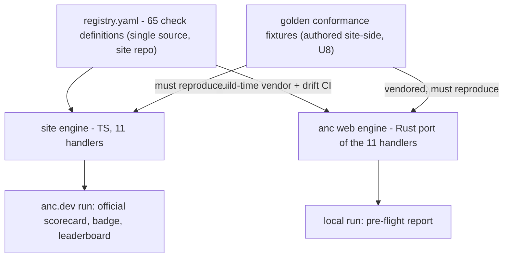
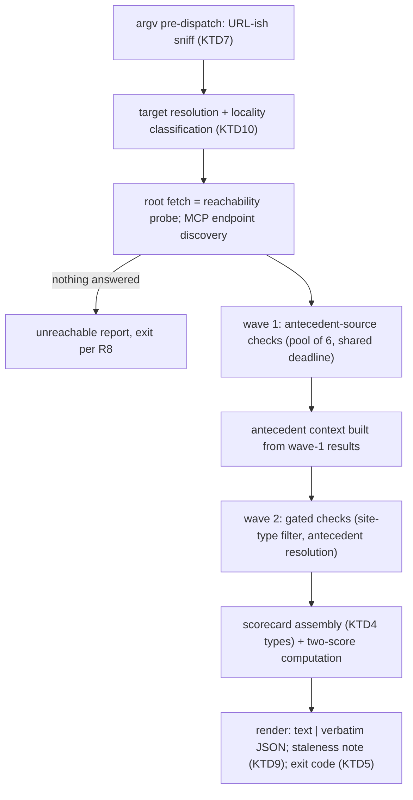

# Local Web Audit - Plan

## Goal Capsule

- **Objective:** A dev whose server anc.dev cannot reach — localhost, an internal host, a pre-deploy stack — gets the
  complete web audit locally, with results they can trust to match the public run, without exposing anything outside
  their network.
- **Means:** `anc web <target>` runs a Rust-native port of the site's registry-driven check engine on a ureq/rustls
  blocking stack (KTD1), with the check registry and conformance fixtures vendored from `agentnative-site` at build time
  (KTD3, KTD4).
- **Product authority:** This plan owns the CLI feature and the site-side companion units (U8, U9) — no separate plan
  exists in the site repo. `agentnative-site` remains canonical for check definitions, engine semantics, and the "Web
  audit" / "check" / "probe" vocabulary (`agentnative-site:CONCEPTS.md`).
- **Stop conditions:** Stop and surface to the user if U1's measured binary delta exceeds ~3MB (the size bet behind KD2
  fails), or if corpus generation in U8 reveals the TS engine is nondeterministic for fixed inputs (the parity mechanism
  fails).

---

## Product Contract

Preservation note — changed: R8 (exit codes adopt the site web-audit runner's convention, user-approved at synthesis),
R9 (fixtures are authored site-side then vendored — no corpus exists today), R10 (site hooks enumerated and pulled into
this plan's units), R6 (JSON-mode staleness note surfaces on stderr), AE6 (reworded to the deliverable DNS property).
Added: R12–R14, KD8, AE6–AE9. Dependencies updated (site-side work moved from external dependencies into U8/U9).
Outstanding Questions resolved into the Planning Contract.

### Summary

Bring the anc.dev web audit — 65 registry-defined checks across 6 categories — into the `anc` binary as `anc web
<target>`, batteries included, emitting the same JSON the site produces. Check definitions stay single-source in the
site repo and vendor in at build time; the 11 generic probe handlers are ported to Rust once and held to parity by
golden fixtures authored site-side. The site-side vendoring hooks (fixture generator, version signal) are units of this
plan.

### Problem Frame

The deployed anc.dev auditor rejects loopback, RFC1918, and internal hostnames by design
(`agentnative-site:src/worker/audit-web/ssrf.ts`; the operations runbook states localhost targets cannot be audited
through the public API). A dev auditing an internal site therefore had to publish it to an obfuscated public URL — a
security-unacceptable workaround, and one most devs in organizations lack the authority to perform at all.

The site's Bun runner (`agentnative-site:scripts/web-audit/audit.ts`) can audit arbitrary live targets, but it presumes
a bun runtime and a site checkout — neither can be assumed on a dev machine, and neither is an `anc` command. The
audience that most needs local auditing is exactly the audience that can't assemble that toolchain.

### Key Decisions

- KD1. **Local runs are dev-loop pre-flight only.** (session-settled: user-directed — chosen over first-class local
  scorecards and self-attested badge claims: local results are unverifiable.) Official scorecards, badges, and the
  leaderboard remain anc.dev-exclusive.
- KD2. **Rust-native engine port with vendored data.** (session-settled: user-approved — chosen over an embedded JS
  engine and a site-adopts-WASM inversion: smallest binary, site engine untouched, checks stay single-source data.)
  Handlers and scoring are ported once and fixture-enforced; hard parity is the aim, best-effort divergence the accepted
  floor when environments genuinely differ. Governs R5, R9.
- KD3. **`anc web` is canonical; bare URL-ish targets are sugar.** (session-settled: user-approved — chosen over a
  sugar-free subcommand and over overloading `anc audit`: explicit form for agents and CI, one-token invocation for
  humans.) Governs R1, R2.
- KD4. **All checks run, with honest labels.** (session-settled: user-approved — chosen over a curated local profile and
  over simulating the public view: the dev always sees the full parity picture.) Governs R4.
- KD5. **Staleness surfaces in web-audit reports only.** (session-settled: user-directed — chosen over
  `--help`/`--version` surfaces: those commands stay offline-pure, per anc's own audit principles.) Governs R6.
- KD6. **Output is the site's JSON shape verbatim.** (session-settled: user-approved — chosen over an anc metadata
  envelope or a new schema: a local run diffs directly against a public run.) Governs R7.
- KD7. **The agent-web-audit skill is a designed-for consumer.** (session-settled: user-directed — chosen over a
  note-only follow-up: convergence on one probe engine is verified at ship, not hoped for.) Governs R11.
- KD8. **External-DNS checks auto-gate on target locality, with an override.** (session-settled: user-directed — chosen
  over always-run-with-disclosure: the default must not leak internal hostnames off-network.) Governs R12.

### Requirements

**Command surface**

- R1. `anc web <target>` runs the full web audit against an HTTP(S) target — hostname, host:port, or URL; local,
  internal, or public.
- R2. A bare URL-ish first argument routes to the web audit; an existing path or discoverable binary of the same name
  wins the tie, and a token that fails the hostname grammar keeps today's fast offline audit-path error.
- R3. The audit needs nothing from the host system — no dig, curl, node, or bun; TLS trust roots ship in the binary.

**Audit behavior**

- R4. Every registry check appears in every report; a check that cannot run against the target reports n_a or skip with
  a stated reason, never a silent drop.
- R5. For the same target and registry version, local verdicts and scores match the site engine's, enforced in CI by the
  vendored conformance fixtures.
- R6. When the vendored registry is older than the live anc.dev registry, the report carries an upgrade note — inline in
  text mode, on stderr in JSON mode so the verbatim shape holds; when that version signal is skipped or unreachable, the
  note is omitted and the run is otherwise unaffected.
- R12. Checks that query external DNS resolvers do not fire for local or private targets (IPv4 and IPv6 alike); gated
  checks report n_a with a stated reason, and `--external-dns` forces them on.
- R13. A run against an unresponsive or tarpitting target completes within the engine's per-audit deadline, reporting
  partial results per R4 rather than hanging the shell or CI step.

**Output**

- R7. `--output json` emits the site's web-audit scorecard shape verbatim — field-for-field the JSON anc.dev produces,
  scores included.
- R8. Text output follows anc's existing text conventions; exit codes adopt the site web-audit runner's convention (pass
  = 0, any failing status = 1, n_a = 3), so CI gates agree with the site's own runner.
- R14. Agents can discover the check vocabulary and the web-scorecard JSON shape offline, via `anc emit` variants for
  both.

**Vendoring**

- R9. Check definitions vendor verbatim from the site repo at CLI build time via the established sync-script + drift-CI
  - build-codegen pattern; conformance fixtures are authored in the site repo (U8) and vendor the same way; nothing is
  fetched at runtime.
- R10. The probe engine is never published as a depend-able package (npm, crates.io, JSR); site-repo changes stay
  limited to the vendoring hooks this plan defines (fixture generator, corpus-completeness gate, version signal) — no
  engine restructuring.

**Ecosystem consumer**

- R11. The agent-web-audit skill's report is constructible from `anc web --output json` and exit codes; the coverage gap
  between the skill's 32-check registry and the site's 65-check registry is diffed and either closed or documented as
  accepted gaps before ship.

### Key Flows

- F1. **Local pre-flight loop.**
  - **Trigger:** Dev runs `anc web localhost:8787` (or a bare URL-ish target).
  - **Steps:** Target resolves; vendored registry loads; probe waves run with antecedent gating; report renders
    verdicts, n_a reasons, scores, and any staleness note; exit code gates the shell or CI step.
  - **Outcome:** An actionable fix list with zero public exposure.
  - **Covers R1–R8, R12, R13.**
- F2. **Pre-flight to official.**
  - **Trigger:** Local report is clean and the site deploys publicly.
  - **Steps:** Dev (or anyone) runs the audit on anc.dev; the official scorecard and badge mint from the public run.
  - **Outcome:** The local promise holds — what passed locally passes publicly — and official artifacts stay
    anc.dev-only.
  - **Covers R5.**
- F3. **Skill as consumer.**
  - **Trigger:** An agent invokes the agent-web-audit skill against a target.
  - **Steps:** The skill shells out to `anc web <target> --output json` and builds its report from the result.
  - **Outcome:** One probe engine serves the site, the CLI, and the skill.
  - **Covers R11.**

### Acceptance Examples

- AE1. **Covers R2.** Given a file or directory named `anc.dev` in the working directory, when the dev runs `anc
  anc.dev`, then the CLI audit of that path runs; given no such path and no binary of that name, then the web audit of
  the `anc.dev` host runs.
- AE2. **Covers R4.** Given target `http://localhost:8787`, when audited, then TLS-dependent checks report n_a with a
  stated reason rather than failing or disappearing.
- AE3. **Covers R6.** Given a machine with no route to anc.dev, when a local target is audited, then the report
  completes normally with no staleness note and no error.
- AE4. **Covers R5.** Given a public target and a current vendored registry, when audited locally and via anc.dev, then
  verdicts and scores are identical.
- AE5. **Covers R3, R4.** Given an internal HTTPS target signed by a private CA, when audited, then TLS-dependent checks
  report what the bundled trust roots observed — a failure, honestly labeled — with no trust-store override available in
  v1.
- AE6. **Covers R12.** Given target `http://intranet.corp.internal`, when audited without flags, then no query reaches a
  third-party DoH resolver — the hostname touches only the machine's own configured resolver — and DNS checks report n_a
  ("needs public DNS — verified on anc.dev"); when audited with `--external-dns`, the DoH queries fire.
- AE7. **Covers R13.** Given a target that accepts connections but never responds, when audited, then the run completes
  within the per-audit deadline with unprobed checks reported per R4 and a failing exit code per R8.
- AE8. **Covers R2.** Given `anc report.json` where no such file exists and no binary of that name is on PATH, when
  invoked, then the run fails fast and offline through today's audit error path — no DNS lookup, no connection attempt.
- AE9. **Covers R6.** Given a stale vendored registry and `--output json`, when a public target is audited, then stdout
  carries only the verbatim scorecard JSON and the upgrade note appears on stderr.

### Success Criteria

- The vendored conformance suite passing against both engines is the evidence behind the parity claim; a divergence is a
  red build, not a support ticket.
- Binary growth stays within the ceiling U1 measures and records (target: low single-digit MB over today's 3.4MB release
  binary; ~3MB delta is the stop-condition threshold).
- The incident test: a dev audits an internal-only site end to end — install anc, run one command, read the report —
  with nothing exposed publicly at any step; the target hostname reaches no third-party resolver or proxy.

### Scope Boundaries

**Deferred for later**

- Authenticated targets (custom headers, cookies, mTLS) — the v1 target must be reachable unauthenticated from the dev's
  machine.
- A trust-store flag for private-CA HTTPS targets.
- Rewiring the agent-web-audit skill to shell out to `anc web` (its own change, in its own repo; R11 only guarantees it
  can).
- Runtime registry refresh between anc releases.

**Outside this product's identity**

- Badges, official scorecards, or leaderboard entries minted from local runs.
- Uploading or submitting local results anywhere.
- Publishing the probe engine as a reusable package.
- Restructuring the site's engine beyond the U8/U9 vendoring hooks.

<!-- ce-section: work-relationships -->
### How This Work Fits Together

This plan owns the CLI feature and the site-side vendoring hooks (U8, U9 — committed in `agentnative-site`, planned
here, with no separate site plan).

- agent-web-audit skill rewiring — this work **enables** it; a later change in the skill's own repo swaps its 32-check
  Python probe script for `anc web`. U11's coverage diff is the input that change will consume.
- `agentnative-spec` — this work **can proceed independently of** it; web checks are defined by the site registry, not
  the spec's principle registry.

### Dependencies / Assumptions

- The site's probe engine remains fetch-only — standard `fetch`/`URL`/`AbortController`, no Workers-specific APIs in the
  probe path (verified; the Bun runner exists because of it).
- The site's `dev` branch is the vendoring source: `guard-main-docs.yml` blocks `scripts/scoring/` from `main`, and the
  existing `sync-skill-fixture.sh` already defaults to `dev` for the same forever-branch reason. The sync pins a
  committed SHA on that branch (KTD3); GitHub permits fetch-by-SHA, which the mechanism relies on.
- ureq/rustls/webpki-roots/aws-lc-rs/fancy-regex license clearance through `deny.toml` is unvalidated territory (zero
  network crates exist today); U1 proves it before anything builds on the stack — including adding `CDLA-Permissive-2.0`
  (webpki-roots' Mozilla-CA-bundle license) to the allow list as a recorded decision.
- Internal targets are reachable unauthenticated from the machine running `anc`.

### Sources

- `agentnative-site:src/data/web-audit/registry.yaml` — 65 checks, 6 categories, 11 handler kinds; entry schema fields:
  `id, category, tier, principle, site_types, antecedent, eval, weight, handler, with, hint, title`. `keyword` is
  build-derived from `tier` (required→must, recommended→should, optional→may) and rejected if hand-authored; the
  registry also carries required top-level blocks `version`, `mcp_discovery`, `categories`, `category_order`.
- `agentnative-site:src/build/13-web-audit-registry.mjs` — the normalizer KTD3's codegen mirrors: keyword derivation,
  `{ua:...}` token expansion (throws on literal UA strings), and structural validation.
- `agentnative-site:src/shared/user-agents.ts` (+ `src/shared/site-url.ts`) — probe UA token map and `AUDIT_USER_AGENT`;
  behavioral test inputs, vendored per KTD3/KTD8.
- `agentnative-site:src/worker/audit-web/` — `engine.ts` (wave orchestration, antecedent gating, 25s deadline, degraded
  2s timeout, concurrency 6, eval-rule dispatch, optional-absent re-tag), `scorecard.ts` (`WebScorecard` shape,
  `WEB_SCHEMA_VERSION = '0.4'`, 7-state `ScorecardStatus`), `score.ts` (two-score formula mirroring
  `scripts/scoring/score_model.py`; parity test `tests/web-audit-two-score.test.ts`), `handlers/` (shared `runX(check,
  ctx) -> ProbeOutcome` contract; `mcp.ts` is 815 lines and stateful; `http.ts` also hosts the legacy-alias-redirects
  eval function), `ssrf.ts` (`guardedFetch`: manual redirect loop, 4-hop cap, per-hop revalidation, three body-cap
  regimes — 0 skip, 64 KiB truncate-and-continue, unset full-read for the root fetch), `antecedents/site-type.ts`
  (`site_type` is caller-supplied; null applies every check; `mcp`-typed checks gate on endpoint discovery).
- `agentnative-site:scripts/web-audit/audit.ts` — local-runner precedent: arg surface (`--target`, `--check`, `--json`,
  `--site-type`) and the `STATUS_EXIT` exit-code convention R8 adopts.
- `scripts/sync-skill-fixture.sh`, `.github/workflows/skill-fixture-drift.yml`, `build.rs` (`emit_skill_hosts`) — the
  vendoring pattern U2 extends; the codegen validation mirrors the site build script, the precedent KTD3 follows.
- `src/skill_install.rs` — the git hardening surface (`GIT_HARDEN_FLAGS`, `GIT_HARDEN_ENV_*`) U2's sync script mirrors
  in shell form.
- `src/argv.rs` — `inject_default_subcommand`;
  `docs/solutions/best-practices/clap-default-subcommand-via-argv-pre-parse-20260415.md` — the seven argv pre-parse
  gotchas U7 must honor.
- `docs/solutions/architecture-patterns/xurl-subprocess-transport-layer.md` — reqwest ripped out of a sibling repo (303
  transitive crates); the Transport-trait pattern KTD1 follows.
- `docs/solutions/design-patterns/pin-a-cross-language-hand-mirror-to-the-wire-json-not-a-shared-type.md` — wire-JSON
  parity pinning with strict rejection (KTD4). Marked stale on its worked example; the pattern statement is what this
  plan uses.
- `docs/solutions/integration-issues/cdn-tarpit-ua-less-probes-web-audit-deadline-exhaustion.md` — identifying
  User-Agent requirement (KTD8) and the egress-class parity hazard.
- `docs/solutions/best-practices/rust-bounded-http-reads-with-take-2026-04-20.md` — bounded body reads (U1 pattern;
  bounds apply to decompressed bytes).
- `docs/solutions/best-practices/agentnative-version-model-2026-05-01.md` — the ecosystem version-literal table KTD9
  slots into.
- External: ureq 3.x (no HTTP/2 — acceptable; body exposes `std::io::Read` for SSE; proxy support requires explicit
  `Proxy::try_from_env()` wiring; redirects disabled at the agent per KTD1), rustls `aws-lc-rs` backend (rustls's
  default; requires a C toolchain — and CMake or nasm on some targets — which U1 must prove out on the
  `x86_64-pc-windows-gnu` cross-compile check), webpki-roots (bundled Mozilla CA set, CDLA-Permissive-2.0), fancy-regex
  (backtracking engine for the registry's lookahead patterns).

---

## Planning Contract

### Key Technical Decisions

- KTD1. **Networking stack: ureq 3.x (blocking) + rustls with the `aws-lc-rs` backend + webpki-roots, behind a
  single-hop `Transport` trait.** (session-settled: user-directed — chosen over reqwest/tokio: a sibling repo already
  removed reqwest over a 303-crate transitive tree, and probes are one-shot calls that don't need an event loop;
  attohttpc rejected for having no rustls option; the `ring` backend rejected for maintenance-mode status and to align
  the crypto stack with `xurl-rs`, accepting the aws-lc-rs C-toolchain requirement into the build and the Windows
  cross-compile check.) The trust store stays webpki-roots — bundled roots are the parity requirement (R3, AE5),
  separable from the provider choice. Contract details:
  - The Transport is **single-hop**: the ureq agent has redirects disabled; a `src/web_audit/fetch.rs` layer above it
    ports `guardedFetch` — the manual redirect loop, the 4-hop cap, per-call follow/no-follow, header lowercasing, and
    the never-throws error-result shape — so the mock seam matches the site's `fetchImpl` boundary by construction.
  - Every hop, initial target and each redirect destination alike, is locality-classified (KTD10) before connecting:
    cloud-metadata ranges (`169.254.0.0/16`, IMDS IPv6) are refused outright, and a hop whose locality class crosses
    from the resolved target's class is refused with a `blocked:` evidence string in place of the response.
  - Proxy selection is **per-request**: targets classified local/private bypass any configured proxy; public paths
    (public targets, DoH resolvers, the U9 version signal) honor `HTTP_PROXY`/`HTTPS_PROXY` via `Proxy::try_from_env()`
    and `NO_PROXY`.
  - Body caps mirror the site's three regimes: `Some(0)` skips the body, `Some(AUDIT_PROBE_MAX_BODY_BYTES)` (64 KiB, a
    named constant matching the site's) **truncates and continues** with a truncation flag — never an error — and `None`
    reads fully (the canonical root fetch's regime) under a generous absolute ceiling documented as a knowing OOM-safety
    divergence. Bounds apply to decompressed bytes.
  - Registry `*_regex` patterns compile with `fancy-regex` (the registry contains lookahead the standard `regex` crate
    rejects) under the site's documented flag set (`i`, plus `m` for body patterns).
  - gzip decoding on by default, brotli feature enabled for fetch parity. TLS failures carry evidence distinguishing
    "chain rejected by bundled roots" from other TLS errors, so a stale-root false negative is self-diagnosable. Governs
    R3.
- KTD2. **Concurrency and deadlines port as a thread pool, not async.** A pool of 6 worker threads mirrors the engine's
  `DEFAULT_CONCURRENCY`; one shared deadline instant mirrors the 25s per-audit budget; a dead root fetch drops per-check
  timeouts to the degraded 2s mode; `AbortController` semantics map to a connect-timeout + total-deadline pair. Governs
  R13.
- KTD3. **Vendor the full normalization input set pinned to a committed site SHA; `build.rs` mirrors the site build
  script, with two failure classes.** The sync set is `registry.yaml` **plus** `src/shared/user-agents.ts` and
  `src/shared/site-url.ts` — the engine consumes the *normalized* registry, so the UA token map and the normalizer's
  rules are vendored data, not Rust constants. The codegen (via the existing `serde_yaml` dependency) mirrors
  `agentnative-site:src/build/13-web-audit-registry.mjs`: it derives `keyword` from `tier` (rejecting a hand-authored
  one), expands `{ua:...}` tokens against the vendored map (failing the build, naming the check id, on an unknown token
  or a literal User-Agent value), compiles every registry regex pattern at build time (an unportable pattern fails the
  build naming the check id), and emits the required top-level blocks (`version`, `mcp_discovery`, `categories`,
  `category_order`) as compiled tables. Structurally malformed entries fail the build loudly; a well-formed entry naming
  a handler kind **or eval rule** the Rust engine has not ported compiles to an unsupported binding that reports skip at
  runtime ("handler `<kind>` not yet ported to the local engine", per R4) — and any run containing such a skip flags its
  headline score as non-comparable (see U7), so degradation never masquerades as parity. The sync pins
  `WEB_AUDIT_SITE_SHA` rather than floating HEAD; a scheduled bump workflow keeps the pin moving deliberately. Governs
  R9.
- KTD4. **Parity pins to the wire JSON.** Rust serde mirrors of `WebScorecard` and its rows reject out-of-contract
  values (unknown statuses, unknown fields fail deserialization loudly), so a canonical-side addition breaks the build
  instead of being silently misread. The golden corpus (U8) asserts byte-comparable scorecard JSON for fixed inputs;
  corpus exchanges are recorded at the single-hop `fetchImpl` boundary KTD1's Transport reproduces. Governs R5, R7.
- KTD5. **Exit codes adopt the site runner's `STATUS_EXIT` convention.** (session-settled: user-approved — chosen over
  `anc audit`'s exit scheme: CI-gate parity with the site's own runner.) The mapping is new anc-side glue pinned by its
  own unit tests. A sniffed bare target moves that invocation from the usage-error exit space (2) to this result space —
  a documented behavior delta (System-Wide Impact). Governs R8.
- KTD6. **New parallel module tree `src/web_audit/`.** The existing `src/scorecard/mod.rs` (2,621 lines, typed against
  `AuditResult`/`AuditStatus`) shares no structure with `WebScorecard`; the web path reuses only `src/output.rs` and
  `src/color.rs` at the leaves.
- KTD7. **Bare-target URL sniffing is a new pre-dispatch step with a strict hostname grammar.** Today's injector only
  decides whether to inject `audit`; the URL-vs-path decision runs alongside it. Routing to web requires: an explicit
  scheme, or an explicit `:port`, or a dot-bearing token with no path separator whose final label is alphabetic
  (TLD-shaped). Path/binary existence wins ties; anything failing the grammar falls through to today's fast offline
  audit error — a dot-bearing filename typo must never trigger a network attempt (AE8). Every rule must be checked
  against the seven documented argv pre-parse gotchas. Governs R2.
- KTD8. **Identifying User-Agent, identical to the site engine's.** The site sends an identifying UA after the
  CDN-tarpit incident; the CLI sends the same UA family so servers classify both probes alike. `AUDIT_USER_AGENT` and
  the probe UA tokens are vendored from the site's shared module (KTD3), never restated as Rust constants. Residual
  risk: egress class differs (workstation vs Cloudflare), an accepted best-effort parity gap under KD2.
- KTD9. **Staleness compares vendored `spec_version` + registry version against the U9 site signal, for public targets
  only.** No version endpoint exists today; `spec_version` is only embedded in scorecard payloads. U9 defines the served
  signal; the CLI fetches it only during `anc web` runs against targets the locality classifier labels public — a local
  or private target's run makes no anc.dev connection at all — with a bounded timeout, silently skipping on any failure
  (per KD5 and R6). The remaining public-target fetch is disclosed in `anc web --help`. The new version literals get
  rows in the ecosystem version-model table (`docs/solutions/best-practices/agentnative-version-model-2026-05-01.md`).
- KTD10. **Locality classification covers IPv4 and IPv6 and gates the whole request chain.** IP-literal targets classify
  directly; shape-classifiable hostnames (single-label, `.internal`) are gated **before any resolution occurs**;
  remaining hostnames classify by system-resolved address class — via the machine's own configured resolver, never a
  third-party one. Local classes: IPv4 loopback/RFC1918/link-local, IPv6 loopback (`::1`), ULA (`fc00::/7`), and
  link-local (`fe80::/10`) — an IPv6-only internal host must gate exactly like an IPv4 one or KD8's privacy property
  fails. The gate wraps the dns-doh handler and the KTD9 version fetch; `--external-dns` bypasses the DNS gate. Redirect
  hops are classified per KTD1: metadata ranges and class-crossing hops are refused and recorded as `blocked:` evidence
  — never a silent public egress from a run the user believes is local. Cites R12 (KD8's governed requirement).
- KTD11. **`anc web` mirrors the site runner's `--site-type` and `--check` surface.** `site_type` is caller-supplied on
  the site (never auto-detected; null applies every check per `antecedents/site-type.ts`), so `--site-type content|api`
  is an optional flag with the same semantics, and `--check <id>` gates a single check with the per-status exit codes
  that make `n_a = 3` meaningful for CI and the skill consumer. Governs R1, R8.

### High-Level Technical Design

Run pipeline (one `anc web` invocation):

Vendoring and parity pipeline (build and CI time):

### System-Wide Impact

- **Bare-invocation behavior delta.** Scripts relying on bare `anc "$X"` today get a fast offline exit 2 for any bad
  token; after KTD7, a grammar-passing token drives a network-touching run in the `STATUS_EXIT` code space (0/1/3)
  instead. U7 documents the split in `--help` and the release notes recommend explicit `anc audit` in scripts; U10
  regression-tests a corpus of previously-valid bare invocations to prove they still route to audit.
- **Emit symmetry.** `anc emit schema` self-describes the CLI scorecard; the web family gets the same treatment — `anc
  emit web-checks` (vocabulary) and `anc emit web-schema` (scorecard shape) — so agents can validate either output
  family offline (R14).
- **Two scorecard schemas, one binary.** CLI scorecard 0.8 and web scorecard 0.4 version independently and are not
  comparable; U7's docs state which command emits which, mirroring the existing "Scorecard JSON fields" documentation
  convention.
- **DoH failure semantics.** A blocked or unreachable resolver (corporate egress filtering) must not read as "record
  absent": the dns-doh handler reports transport failure as error/skip with a stated reason, and only a
  resolver-confirmed absence as a failing verdict (U5) — otherwise filtered networks produce false negatives that break
  R5's promise for public targets.
- **Redirect crossings are refused and visible.** A hop that leaves the target's locality class — or lands in a
  cloud-metadata range — is refused per KTD1/KTD10 and recorded as `blocked:` evidence, preserving the Success
  Criteria's "nothing exposed publicly" property without silently following hostile redirects.

### Risks & Mitigations

- **Registry volatility vs drift CI.** The site registry is a 973-line surface that changes at feature cadence; PR-only
  drift checking (the `skill-fixture-drift.yml` model) goes silently stale when the CLI repo is quiet. Mitigation
  (KTD3): pin a committed site SHA and add a scheduled weekly workflow that diffs site `dev` HEAD against the pin and
  opens a bump PR — staleness becomes calendar-visible, Dependabot-shaped, instead of contingent on unrelated CLI
  activity.
- **New handler kinds outpacing the port.** A well-formed registry entry with an unported handler or eval rule must not
  hold vendoring hostage to an MCP-sized porting effort. Mitigation (KTD3): the unsupported binding compiles and reports
  skip with a named reason, the run's score is flagged non-comparable, and the bump PR's description lists any unported
  kinds so the gap is a visible, scheduled decision.
- **webpki-roots staleness.** A public target on a newly issued root can pass on anc.dev and fail locally — a parity
  break masquerading as a target defect. Mitigation: bump webpki-roots on every release (release-checklist item, same
  discipline as the toolchain pin), and KTD1's evidence distinguishes bundled-root rejection so an affected user
  self-diagnoses ("try a newer anc release") without the deferred trust-store flag.
- **Corpus lagging the registry.** A site PR adding a check without regenerating the U8 corpus leaves the newest check
  conformance-untested — no build failure, just an invisible gap. Mitigation: U8 includes a site-side CI gate asserting
  every registry check id has at least one corpus scenario before a registry-touching PR merges to `dev`.

### Assumptions

- The TS engine is deterministic for fixed fetch inputs (same responses in, same scorecard out). U8's generator proves
  this; nondeterminism is a stop condition.

---

## Implementation Units

| U-ID | Title                             | Repo | Key files                                                                         | Depends on     |
| ---- | --------------------------------- | ---- | --------------------------------------------------------------------------------- | -------------- |
| U1   | Networking foundation + size gate | cli  | `Cargo.toml`, `deny.toml`, `src/web_audit/transport.rs`, `src/web_audit/fetch.rs` | —              |
| U2   | Vendoring pipeline                | cli  | `scripts/sync-web-audit.sh`, `.github/workflows/web-audit-drift.yml`, `build.rs`  | —              |
| U3   | Scorecard types + scoring         | cli  | `src/web_audit/scorecard.rs`, `src/web_audit/score.rs`                            | U2             |
| U4   | Engine orchestration              | cli  | `src/web_audit/engine.rs`                                                         | U1, U3         |
| U5   | Eleven stateless handlers         | cli  | `src/web_audit/handlers/*.rs`                                                     | U4             |
| U6   | MCP handler                       | cli  | `src/web_audit/handlers/mcp.rs`                                                   | U4             |
| U7   | CLI surface                       | cli  | `src/cli.rs`, `src/argv.rs`, `src/main.rs`, `src/web_audit/render.rs`             | U4, U9         |
| U8   | Conformance corpus generator      | site | `scripts/web-audit/gen-fixtures.ts`                                               | —              |
| U9   | Version signal                    | site | worker route + build step                                                         | —              |
| U10  | Conformance suite + dogfood       | cli  | `tests/web_audit_conformance.rs`, `tests/integration.rs`                          | U5, U6, U7, U8 |
| U11  | Skill coverage diff               | cli  | `docs/web-audit-skill-coverage.md`                                                | U7             |

### U1. Networking foundation and size gate

- **Goal:** Land the ureq/rustls/webpki-roots stack behind the single-hop `Transport` trait plus the guarded-fetch
  layer, and prove the size and license bets before anything builds on them.
- **Requirements:** R3. Implements KTD1 (session-settled; cites R3).
- **Dependencies:** None.
- **Files:** `Cargo.toml`, `deny.toml`, `src/web_audit/mod.rs`, `src/web_audit/transport.rs`, `src/web_audit/fetch.rs`,
  `tests/web_audit_transport.rs`.
- **Approach:**
  1. Add ureq (rustls/aws-lc-rs/webpki-roots feature selection per KTD1, redirects disabled at the agent, exact-pin any
     pre-1.0 crate per repo convention), gzip + brotli features, and `fancy-regex` (first used in U5; added here so the
     size and license gates measure the full v1 dependency set).
  2. Define the single-hop `Transport` trait (request in, response head + capped body out) with a ureq-backed impl and a
     test mock; UA constant sourced from the vendored user-agents module per KTD8.
  3. Build `fetch.rs` per KTD1: redirect loop with 4-hop cap and per-call follow flag, per-hop locality/metadata gating
     (KTD10), per-request proxy selection with local-target bypass and `NO_PROXY`, three-regime body caps (skip / 64 KiB
     truncate-and-continue / bounded full read) on decompressed bytes, never-throws error results, TLS evidence
     distinguishing bundled-root rejection.
  4. Measure `target/release/anc` before/after with the full dependency set; run `cargo deny check`; add
     `CDLA-Permissive-2.0` (webpki-roots) to the `deny.toml` allow list as a recorded licensing decision and validate
     the aws-lc-rs tree's licensing the same way.
- **Execution note:** Measurement first — record the release-binary delta in the PR body before porting anything onto
  the stack; ~3MB delta is the Goal Capsule stop condition.
- **Patterns to follow:** `docs/solutions/architecture-patterns/xurl-subprocess-transport-layer.md` (Transport seam);
  `docs/solutions/best-practices/rust-bounded-http-reads-with-take-2026-04-20.md`.
- **Test scenarios:**
  - Happy path: GET against the mock transport returns status, headers, and body through the trait; the fetch layer
    follows a 2-hop public redirect chain and returns the final response.
  - Edge: a body over the 64 KiB cap is truncated and returned with the truncation flag set — evaluated, never errored;
    cap `Some(0)` skips the body; `None` reads fully under the absolute ceiling.
  - Edge: with `HTTPS_PROXY` set, a public target routes through the proxy while a loopback target connects directly;
    `NO_PROXY` entries are honored.
  - Edge: a public target that 302s to `169.254.169.254` (and to an IPv6 metadata address) gets the hop refused with
    `blocked:` evidence, not followed. Same for a local target redirecting to a public host.
  - Error: connect timeout and total deadline each surface as distinct, matchable errors; a bundled-root chain rejection
    surfaces as its own evidence class.
  - Integration: HTTPS GET against a real public endpoint verifies bundled roots work with no system cert store
    (ignored-by-default network test, run in CI).
- **Verification:** `cargo deny check` green with the recorded allow-list addition; Windows cross-compile clippy green
  (pre-push hook step 7) with the aws-lc-rs toolchain requirement proven out; measured size delta recorded and within
  budget.

### U2. Vendoring pipeline

- **Goal:** The full normalization input set flows from a pinned site SHA into committed CLI copies with drift CI and a
  scheduled bump lane, and `build.rs` turns it into compiled check tables.
- **Requirements:** R9. Implements KTD3 (cites R9).
- **Dependencies:** None (fixture sync activates once U8 publishes the corpus).
- **Files:** `scripts/sync-web-audit.sh`, `.github/workflows/web-audit-drift.yml`,
  `.github/workflows/web-audit-bump.yml`, `build.rs`, `src/web_audit/registry.yaml` (vendored copy),
  `src/web_audit/user-agents.ts` (vendored copy), `src/web_audit/fixtures/` (vendored corpus),
  `tests/build_registry.rs`.
- **Approach:**
  1. Fetch by pinned SHA, not branch: `git init` into a temp dir, `git remote add origin <url>`, `git fetch --depth 1
     origin "$WEB_AUDIT_SITE_SHA"`, extract byte-exact via `git show FETCH_HEAD:<path>`; an unresolvable pin fails hard
     naming the SHA, never falling through to the branch ref. Keep `cmp`+`diff -u` `--check` mode from the skill-fixture
     script.
  2. Harden every git call with the shell equivalent of `src/skill_install.rs`'s constants —
     `GIT_CONFIG_GLOBAL=/dev/null GIT_CONFIG_SYSTEM=/dev/null GIT_TERMINAL_PROMPT=0` plus `-c credential.helper= -c
     core.askPass= -c protocol.allow=never -c protocol.https.allow=always -c http.followRedirects=false` — with a test
     pinning the hardening surface.
  3. Sync set: `src/data/web-audit/registry.yaml`, `src/shared/user-agents.ts`, `src/shared/site-url.ts`,
     `tests/fixtures/web-audit-score-parity.json`, and the U8 corpus directory. Keep the set explicit — do not widen the
     drift guard to files that shouldn't vendor.
  4. `build.rs` gains `emit_web_registry` mirroring the site normalizer per KTD3: keyword derivation (reject
     hand-authored), `{ua:...}` expansion against the vendored map (fail on unknown token or literal UA, naming the
     check id), registry regex compilation with `fancy-regex` (fail on an unportable pattern, naming the check id),
     top-level block emission, KTD3's two failure classes across both `handler` and `eval` values, sorted stable output,
     codegen to `$OUT_DIR/generated_web_registry.rs`, `cargo:rerun-if-changed` on every vendored input.
  5. Drift workflow mirrors `skill-fixture-drift.yml` (PR trigger, cmp against the pinned SHA); the scheduled bump
     workflow (weekly) diffs site `dev` HEAD against the pin and opens a bump PR listing registry changes and any
     unported handler or eval kinds.
- **Patterns to follow:** `scripts/sync-skill-fixture.sh`; `build.rs::emit_skill_hosts`; `src/skill_install.rs` (git
  hardening); `docs/solutions/architecture-patterns/cross-repo-artifact-sync-commit-over-fetch-20260420.md`;
  `docs/solutions/architecture-patterns/evict-test-only-files-from-a-drift-guarded-vendored-surface.md`.
- **Test scenarios:**
  - Happy path: codegen over the vendored inputs yields 65 checks, 6 categories, 11 handler kinds, 2 eval rules (counter
    tests, deliberate-bump semantics like the principle registry's), with every `{ua:...}` token expanded to the
    vendored literal.
  - Edge: a well-formed entry with an unknown handler kind or unknown eval rule builds successfully and binds to the
    unsupported placeholder; a hand-authored `keyword` fails the build.
  - Error: a registry entry with a missing tier, malformed `with` block, unknown UA token, literal User-Agent string, or
    lookahead pattern fancy-regex itself rejects fails the build with a message naming the entry id.
  - Integration: `scripts/sync-web-audit.sh --check` exits 0 against the pinned SHA; the hardening test asserts the
    exact env/flag surface on the git invocation.
- **Verification:** Build fails on each structural-mutation class; unknown-handler and unknown-eval entries build and
  skip at runtime; drift workflow red when the vendored copy diverges from the pin, green when current.

### U3. Scorecard types and scoring

- **Goal:** Rust mirrors of the site's result model and two-score formula, proven against the vendored scoring-parity
  fixture, plus the committed web-scorecard JSON Schema.
- **Requirements:** R5, R7, R14. Implements KTD4 (cites R5, R7).
- **Dependencies:** U2.
- **Files:** `src/web_audit/scorecard.rs`, `src/web_audit/score.rs`, `schema/web-scorecard.schema.json`,
  `tests/web_audit_score_parity.rs`.
- **Approach:**
  1. Serde types for `WebScorecard`, result rows, category rollups, coverage summary, and the 7-state status — strict:
     unknown fields and unknown status strings fail deserialization (KTD4).
  2. Scoring mirrors `score.ts` / `score_model.py`: tier weights 5/3/1, `broken_factor` 0.75, `noncompliant_credit`
     0.25, SHOULD-absent half-weight in the relative denominator, half-up rounding (never banker's).
  3. Serialization field order and null-vs-absent semantics match the site's JSON byte-comparably for fixture inputs.
  4. Author `schema/web-scorecard.schema.json` describing the shape (the artifact `anc emit web-schema` prints), with a
     round-trip test binding it to the serde types.
- **Execution note:** Port the parity test first; the fixture drives the implementation.
- **Patterns to follow:**
  `docs/solutions/design-patterns/pin-a-cross-language-hand-mirror-to-the-wire-json-not-a-shared-type.md`;
  `docs/solutions/design-patterns/web-audit-fairness-scoring-model.md`; `schema/scorecard.schema.json` (the existing
  emit-schema artifact convention).
- **Test scenarios:**
  - Happy path: every row of the vendored `web-audit-score-parity.json` reproduces its expected relative and global
    scores.
  - Edge: all-n_a input scores without dividing by zero; a lone `broken` MUST check produces the negative-credit result
    the formula defines.
  - Edge: a value exactly at .5 rounds up (half-up, catching any banker's-rounding regression).
  - Error: a scorecard JSON with an unknown status string fails to deserialize with an error naming the value.
  - Integration: a serialized scorecard validates against `schema/web-scorecard.schema.json` (round-trip drift test).
- **Verification:** Parity test green; a deliberately perturbed weight fails the fixture test (proves the fixture
  actually binds).

### U4. Engine orchestration

- **Goal:** The wave scheduler: discovery, antecedent gating, concurrency, deadlines, and scorecard assembly —
  everything except the handlers themselves.
- **Requirements:** R1, R4, R13, R12. Implements KTD2 (cites R13) and KTD10 (cites R12).
- **Dependencies:** U1, U3.
- **Files:** `src/web_audit/engine.rs`, `src/web_audit/locality.rs`, `tests/web_audit_engine.rs`.
- **Approach:**
  1. Port `engine.ts`'s sequence: canonical root fetch (doubles as reachability probe), MCP endpoint discovery,
     unreachable short-circuit, wave 1 over the antecedent-source check set, antecedent context, wave 2 with site-type
     filter and antecedent resolution, the optional-absent re-tag (an absent MAY check finalizes as n_a with the
     `optional-absent` reason, matching the site), and scorecard assembly.
  2. Thread pool of 6 with a shared deadline instant (25s default); dead root fetch flips per-check timeouts to the
     degraded 2s mode; past-deadline checks resolve as skip (KTD2).
  3. `locality.rs` classifies targets per KTD10 — shape-classifiable names before any resolution, IPv4 and IPv6 local
     classes, system-resolver-only lookups; the engine withholds external-DNS checks and the KTD9 version fetch for
     local/private targets (`--external-dns` overrides the DNS gate) and supplies the per-hop classification `fetch.rs`
     enforces.
- **Test scenarios:**
  - Happy path: mock transport with a healthy target runs both waves and produces a full 65-row scorecard.
  - Edge: an unmet antecedent yields n_a with `antecedent-unmet` reason on every downstream check (Covers AE2's shape);
    an absent MAY check re-tags to n_a with `optional-absent`.
  - Edge: loopback (v4 and `::1`), RFC1918, IPv6 ULA `fc00::/7`, link-local (v4 and `fe80::/10`), single-label hostname,
    and `.internal` targets each classify local — the shape-classifiable ones without any resolution call; a public FQDN
    and a public IPv6 address classify public. Covers AE6.
  - Error: a transport that stalls forever on wave 1 still completes within the deadline with skip-labeled remaining
    checks. Covers AE7.
  - Integration: unreachable target (connection refused on root fetch) produces the unreachable report, not a panic.
- **Verification:** Engine tests green; a wall-clock assertion proves the tarpit case exits inside the deadline plus
  grace.

### U5. Eleven stateless handlers

- **Goal:** Port http, cors-preflight, dns-doh, auth-md, webmcp, scoped-llms, markdown-frontmatter, content-without-js,
  llms-txt-quality, api-hygiene, and the legacy-alias-redirects eval function.
- **Requirements:** R4, R5, R12.
- **Dependencies:** U4.
- **Files:** `src/web_audit/handlers/` (one module per handler), `tests/web_audit_handlers.rs`.
- **Approach:**
  1. Shared handler signature mirroring the TS contract: check definition + context in, probe outcome (status, evidence,
     n_a reason) out; `{host}`/`{mcp_endpoint}` token substitution as in `handlers/shared.ts`; assertion regexes via the
     compiled `fancy-regex` patterns from U2's codegen.
  2. dns-doh queries the Cloudflare/Google JSON APIs over the fetch layer; the engine's locality gate (U4) decides
     whether it runs at all. Resolver transport failure reports error/skip with a stated reason; only a
     resolver-confirmed absence is a failing verdict (System-Wide Impact's false-negative guard).
  3. The legacy-alias-redirects eval function ports as the eleventh stateless entry point (it lives in the site's
     `http.ts` but dispatches on the `eval` key); `scoped-discovery`, the registry's other eval value, is validated but
     inert at runtime.
  4. Redirect-following (through the fetch layer's per-call flag — the canonical-redirect check needs the 301 visible,
     not erased), header normalization, and decompression behavior pinned by tests, not assumed.
- **Execution note:** Fixture-first — port each handler against its U8 corpus slice; the site's per-handler tests
  (`agentnative-site:tests/web-audit-handlers.test.ts`) enumerate the cases to mirror.
- **Test scenarios:**
  - Happy path per handler: the canonical passing response from the corpus yields pass with matching evidence.
  - Edge: expected-status mismatch, body-regex miss (including the lookahead pattern), and empty-body cases each yield
    the same status the TS engine yields for that fixture.
  - Edge: redirect chains and gzip/brotli-encoded bodies produce identical verdicts to the site engine; a truncated
    over-cap body evaluates as the site evaluates it.
  - Edge: dns-doh with an unreachable resolver reports error with a transport reason, not a failing verdict; with a
    reachable resolver and no record, it fails as the site engine does.
  - Edge: a private-CA HTTPS target yields the bundled-root TLS failure evidence on TLS-dependent checks, honestly
    labeled. Covers AE5.
  - Error: transport failure mid-check yields error status with evidence, not a panic.
- **Verification:** Per-handler corpus slices green; handler-kind (11) and eval-rule (2) counter tests still match the
  registry codegen.

### U6. MCP handler

- **Goal:** Port the one stateful handler — JSON-RPC initialize / tools-list / error-code checks, session-ID tracking,
  legacy/modern lane detection, and the post-wave initialized notification.
- **Requirements:** R4, R5.
- **Dependencies:** U4.
- **Files:** `src/web_audit/handlers/mcp.rs`, `tests/web_audit_mcp.rs`.
- **Approach:**
  1. Isolated from U5 deliberately: at 815 source lines and multi-request state, this handler is the concentrated parity
     risk under KD2's best-effort floor.
  2. SSE-framed responses read incrementally off the Transport's capped body reader (buffer to `data:` lines, parse on
     blank-line event boundary, match JSON-RPC ids) — hand-rolled, since no blocking MCP client exists upstream; the
     accumulator reads through the bounded reader so an unterminated stream cannot grow it past the cap.
  3. Session-ID and lane state live in the engine context the way `mcpSessionId`/`mcpLanes` do in `HandlerContext`.
- **Test scenarios:**
  - Happy path: a mock MCP server speaking modern streamable-HTTP passes initialize and tools-list checks.
  - Edge: legacy-lane server detected and labeled as the TS engine labels it; SSE-framed and plain-JSON responses both
    parse.
  - Edge: JSON-RPC error codes map to the same check statuses as the site engine for the corpus cases.
  - Error: a server that answers initialize but hangs on tools-list degrades within the check timeout to the
    site-matching status.
- **Verification:** MCP corpus slice green; the U10 conformance suite passes with U6 included.

### U7. CLI surface

- **Goal:** `anc web <target>` with bare-target sugar, text and JSON rendering, exit codes, staleness note,
  `--external-dns`, `--site-type`, `--check`, and the emit variants.
- **Requirements:** R1, R2, R6, R7, R8, R14. Implements KTD5 (session-settled; cites R8), KTD7 (cites R2), KTD9 (cites
  R6), KTD11 (cites R1, R8).
- **Dependencies:** U4 (rendering/exit paths exercise engine output; handler completeness not required to land the
  surface); U9 (the staleness-note logic and its tests consume U9's documented response shape).
- **Files:** `src/cli.rs`, `src/argv.rs`, `src/main.rs`, `src/web_audit/render.rs`, `tests/integration.rs`.
- **Approach:**
  1. `Commands::Web` as a flat top-level variant (the `Audit` shape, not the nested `Skill` shape), routed to a
     `run_web` helper; flags per KTD11 (`--site-type content|api`, `--check <id>`) plus `--external-dns` (KD8) and the
     standard `--output` pair.
  2. URL-ish pre-dispatch sniff per KTD7's grammar; path/binary existence wins; scheme-less targets default https,
     localhost and IP-literal locals default http; grammar misses fall through to today's behavior unchanged.
  3. Text renderer follows `anc` text conventions through `output::emit`/`color::should_color`; JSON mode prints the U3
     scorecard verbatim on stdout with the staleness note on stderr (per R6/AE9); exit codes per KTD5; staleness note
     rendered only in web reports (KD5), fetched only for public targets (KTD9).
  4. When any unported-handler or unported-eval skip is present, flag the headline score as non-comparable — inline in
     text mode, on stderr in JSON mode — naming the unported kinds and skipped check ids (KTD3's degradation-honesty
     rule).
  5. `anc emit web-checks` serializes the compiled registry tables; `anc emit web-schema` prints
     `schema/web-scorecard.schema.json` (R14, System-Wide Impact's emit symmetry).
  6. `--help` documents the two exit-code spaces, the two scorecard schema families, the public-target version fetch,
     and the `--external-dns` egress (in AE6's words); release notes carry the bare-invocation migration note
     (System-Wide Impact).
- **Patterns to follow:** `src/cli.rs` `Audit` variant; the seven gotchas in
  `docs/solutions/best-practices/clap-default-subcommand-via-argv-pre-parse-20260415.md`;
  `docs/solutions/architecture-patterns/anc-cli-output-envelope-pattern-2026-04-29.md`.
- **Test scenarios:**
  - Happy path: `anc web <mock-target> --output json` emits deserializable, site-shaped JSON on stdout; text mode
    renders every row.
  - Edge: `anc anc.dev` with and without a same-named local path. Covers AE1.
  - Edge: `anc report.json` (no such file, no such binary) fails fast through the audit error path with zero network
    activity. Covers AE8.
  - Edge: `anc localhost:8787` routes to web with http; `anc ./localhost:8787` (explicit path form) routes to audit;
    `--` separator and value-flag tokens still behave per the existing argv tests.
  - Edge: `--check <id>` runs the single check with per-status exit codes (pass 0, fail 1, n_a 3); `--site-type api`
    filters as the site's `siteTypeApplies` does; omitted site-type runs everything.
  - Edge: staleness note renders when vendored version < signal version — stderr in JSON mode (Covers AE9), inline in
    text; absent when equal, when the target is local (no fetch attempted), or when the signal fetch fails. Covers AE3.
  - Edge: a run with an unported-handler skip carries the non-comparable-score flag naming the kind.
  - Error: unresolvable bare token gets the existing audit error path plus a "did you mean anc web" hint; exit codes
    match the STATUS_EXIT table for pass/fail/n_a scorecards.
  - Integration: `--help` and `--version` make zero network calls (assert via a transport that panics on use).
- **Verification:** Integration tests green; `anc emit web-checks` output round-trips through the U3 types; `anc emit
  web-schema` output validates a real scorecard.

### U8. Conformance corpus generator (site repo)

- **Goal:** The golden corpus that makes cross-engine parity testable: recorded fetch exchanges plus the TS engine's
  scorecard for each, committed where the CLI sync can pull them, with a completeness gate.
- **Requirements:** R5, R9, R10.
- **Dependencies:** None (informs U5/U6; corpus format agreed with U3's types).
- **Files (agentnative-site):** `scripts/web-audit/gen-fixtures.ts`, `tests/fixtures/web-audit-conformance/` (committed
  corpus, `dev` branch), CI gate workflow.
- **Approach:**
  1. A Bun script that feeds the engine a stubbed `fetchImpl` (the same seam the site's handler tests already use — the
     single-hop boundary KTD1's Transport reproduces) from declarative exchange files, then writes the resulting
     scorecard JSON per scenario.
  2. Scenario set: per-handler pass/fail/absent cases mirroring `tests/web-audit-handlers.test.ts`, plus whole-run
     scenarios (healthy target, unreachable, antecedent-unmet chains, MCP legacy and modern lanes).
  3. Deterministic output (sorted keys, fixed timestamps) so `cmp`-based drift checks work; regeneration is a committed,
     reviewed change.
  4. Site-side CI gate: a PR touching `registry.yaml` fails unless every check id has at least one corpus scenario
     (Risks & Mitigations' corpus-lag guard).
- **Test scenarios:**
  - Happy path: running the generator twice yields byte-identical output (determinism — the Goal Capsule stop condition
    check).
  - Edge: a registry-touching change without a matching corpus scenario fails the completeness gate.
  - Integration: the site's existing test suite passes with the generator's stub inputs (the corpus reflects real engine
    behavior, not a parallel mock).
- **Verification:** Corpus committed on `dev`; `bun test` green; completeness gate red on a coverage gap; regeneration
  diff is empty when the engine is unchanged.

### U9. Version signal (site repo)

- **Goal:** A cheap, publicly served signal carrying `spec_version` and the registry version, for the CLI staleness
  note.
- **Requirements:** R6.
- **Dependencies:** None.
- **Files (agentnative-site):** worker route (small JSON endpoint under the existing audit-web route namespace), build
  step wiring the registry version constant.
- **Approach:**
  1. Serve `{ spec_version, registry_version, web_schema_version }` from values the build already computes
     (`spec-version.gen.ts`, `registry.version`); no new state, cacheable.
  2. Follow the site's existing route/versioning conventions; add the new literals to the ecosystem version-model table
     (`docs/solutions/best-practices/agentnative-version-model-2026-05-01.md`) as part of the change.
- **Test scenarios:**
  - Happy path: the endpoint returns the three fields matching the deployed build's constants.
  - Edge: response is cache-friendly (stable body for a given deploy).
- **Verification:** Site tests green; U7's staleness tests consume the documented shape.

### U10. Conformance suite and dogfood

- **Goal:** The CI evidence for the parity claim, plus proof the new verb doesn't regress anc's own agent-readiness or
  existing bare-invocation behavior.
- **Requirements:** R5, R13. Also guards R2 and R3 (size).
- **Dependencies:** U5, U6, U7, U8.
- **Files:** `tests/web_audit_conformance.rs`, `tests/integration.rs`, CI workflow addition for the size gate.
- **Approach:**
  1. Drive the Rust engine from each vendored corpus scenario's exchanges through the mock Transport; assert
     byte-comparable scorecard JSON against the golden output. Covers AE4.
  2. Redirect, decompression, truncation, and timeout semantics get dedicated scenarios (the fetch-parity gaps KTD1
     names).
  3. Dogfood: `anc audit .` still passes with the new verb present (envelope pattern, safe probing,
     `arg_required_else_help` untouched); a corpus of previously-valid bare invocations (`anc .`, `anc <path>`, `anc
     <flags>`) still routes to audit (System-Wide Impact's behavior-delta guard).
  4. Size gate: CI asserts the release binary stays under the ceiling U1 recorded.
- **Test scenarios:**
  - Happy path: full corpus green. Covers AE4.
  - Edge: a deliberately mutated golden file fails (the suite binds); a corpus scenario the Rust engine cannot yet
    reproduce is an explicit, named skip with an issue reference, never a silent pass.
  - Edge: every bare-invocation form in the existing argv test suite still routes as it did before the sniffing change.
  - Integration: dogfood run green; size assertion green.
- **Verification:** All CI jobs green including drift, conformance, dogfood, and size.

### U11. Skill coverage diff

- **Goal:** The R11 evidence: a check-by-check diff of the agent-web-audit skill's 32-check registry against the site's
  65, with each gap closed or accepted.
- **Requirements:** R11. Implements KD7's verification (cites R11).
- **Dependencies:** U7.
- **Files:** `docs/web-audit-skill-coverage.md`.
- **Approach:**
  1. Table mapping every skill check id to its covering registry check(s), or to "accepted gap" with a reason; note
     vocabulary translation (skill's pass/fail/na and letter grades vs the 7-state model).
  2. Demonstrate constructibility: a walkthrough showing the skill's report fields derivable from `anc web --output
     json` + exit code — and stating that retained evidence bodies (`raw_evidence[].body`) are untrusted target-supplied
     text the skill must quote or summarize, never treat as instructions.
  3. Gaps that should become registry checks get filed as site-repo issues, referenced from the doc — not silently
     absorbed into this plan.
- **Test scenarios:** Test expectation: none — analysis artifact; its verification is the completeness check below.
- **Verification:** Every one of the skill's 32 check ids appears exactly once in the table; the constructibility
  walkthrough cites only fields present in the U3 types.

---

## Verification Contract

| Gate             | Command                                                                     | Proves                                                             |
| ---------------- | --------------------------------------------------------------------------- | ------------------------------------------------------------------ |
| Format/lint      | `cargo fmt --check`, `cargo clippy -- -Dwarnings`                           | Repo conventions (pre-push hook parity)                            |
| Tests            | `cargo test`                                                                | Units U1–U7, U10, U11 scenarios                                    |
| Supply chain     | `cargo deny check`                                                          | KTD1's license clearance incl. the CDLA allow-list addition (U1)   |
| Windows          | pre-push hook step 7 (`cargo clippy --target x86_64-pc-windows-gnu`)        | New networking code and the aws-lc-rs toolchain are cross-platform |
| Vendor drift     | `scripts/sync-web-audit.sh --check` (CI: `web-audit-drift.yml`)             | R9's sync mechanism against the pinned SHA                         |
| Vendor freshness | scheduled `web-audit-bump.yml` opens bump PRs                               | KTD3's pin moves deliberately, staleness is calendar-visible       |
| Conformance      | `cargo test --test web_audit_conformance`                                   | R5 parity against the U8 corpus                                    |
| Size             | CI release-binary size assertion vs the U1 ceiling                          | R3 / KD2's size bet                                                |
| Dogfood          | `anc audit .` green + bare-invocation regression corpus                     | New verb regresses neither anc's audit nor existing routing        |
| Site side        | `bun test`, `bun run build`, corpus-completeness gate in `agentnative-site` | U8 corpus validity and coverage, U9 endpoint                       |

## Definition of Done

- All eleven units landed; every gate in the Verification Contract green in CI, both repos.
- AE1–AE9 each enforced by a named test (the `Covers` links in unit test scenarios).
- The U1 size ceiling is recorded and CI-enforced; the release binary is under it.
- `docs/web-audit-skill-coverage.md` exists with all 32 skill checks dispositioned (R11).
- The ecosystem version-model doc carries the new version literals (KTD9), and the release checklist carries the
  webpki-roots and registry-pin bump disciplines (Risks & Mitigations).
- No dead-end or experimental code from abandoned approaches remains in the diff.
