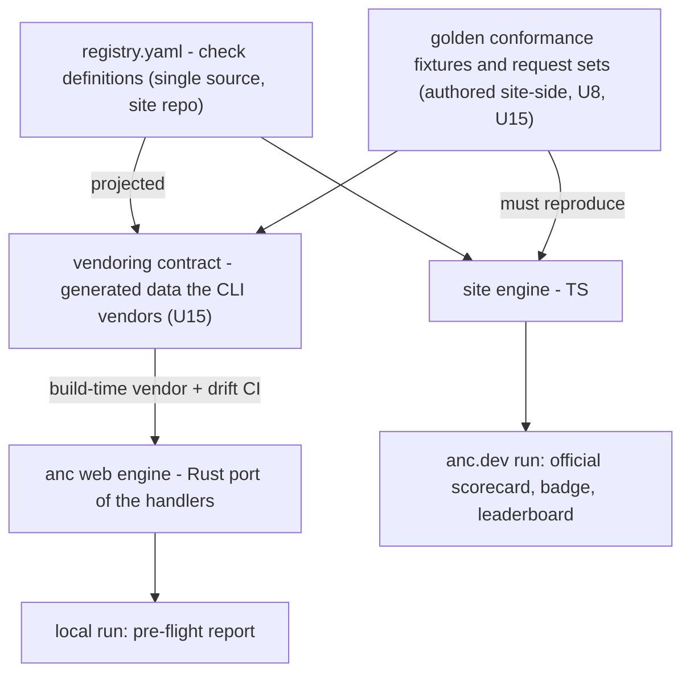
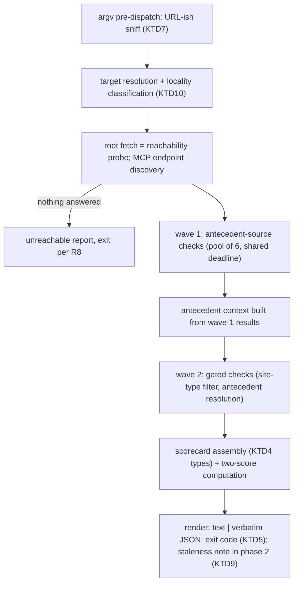
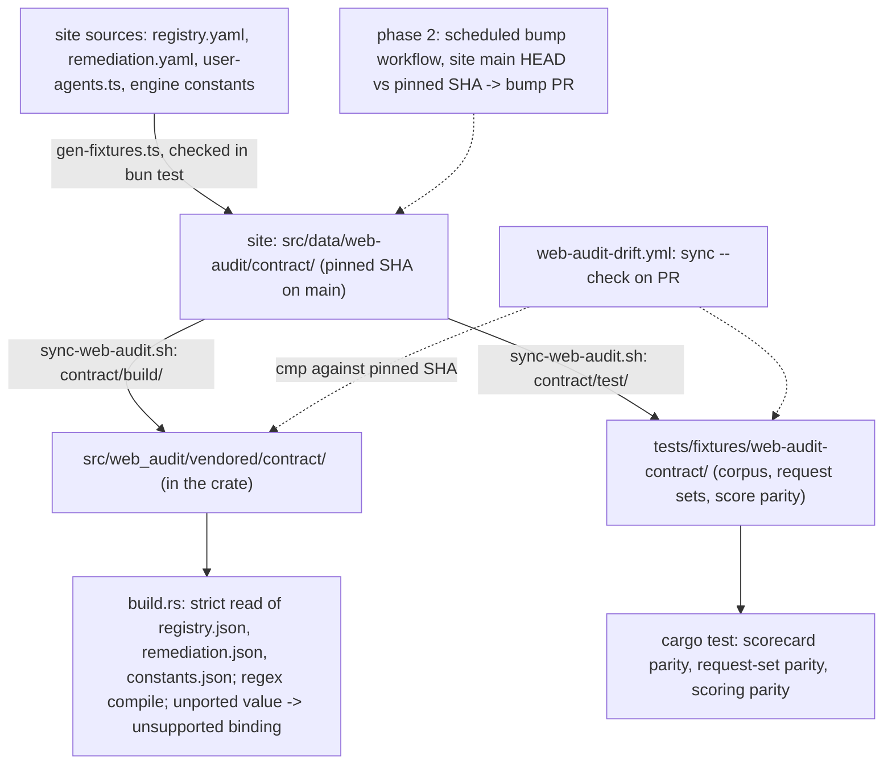
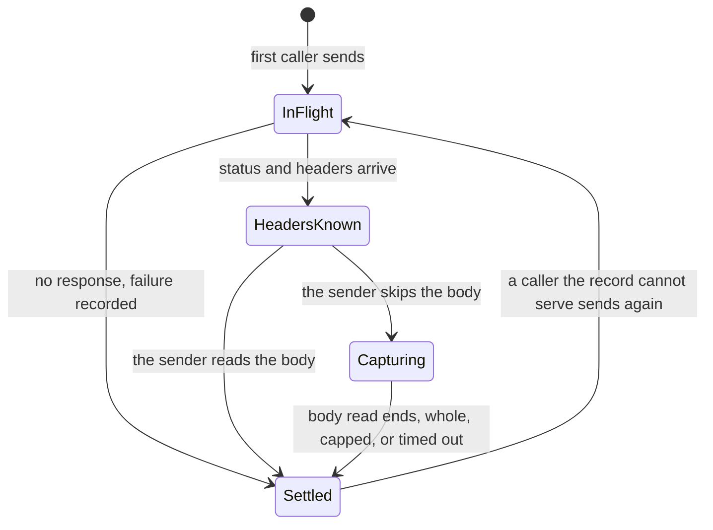

# Local Web Audit - Plan

## Goal Capsule

- **Objective:** A dev whose server anc.dev cannot reach — localhost, an internal host, a pre-deploy stack — gets the
  complete web audit locally, with results they can trust to match the public run, without exposing anything outside
  their network.
- **Means:** `anc web <target>` runs a Rust-native port of the site's registry-driven check engine on a ureq/rustls
  blocking stack (KTD1), with the site's data-only vendoring contract vendored from `agentnative-site` at build time
  (KTD3, KTD4, KTD14).
- **Product authority:** This plan owns the CLI feature and the site-side companion units (U8, U9, U15) — no separate plan
  exists in the site repo. `agentnative-site` remains canonical for check definitions, engine semantics, and the "Web
  audit" / "check" / "probe" vocabulary (`agentnative-site:CONCEPTS.md`).
- **Phases:** The phase line follows dependency, not convenience. Phase 1 ships everything that needs no anc.dev
  endpoint: U1–U8, U10, U11, U13–U17, every handler kind and eval rule the vendored registry carries, the vendoring
  contract, the conformance corpus and suite, the fix catalog and its readers, the docs, and the skill coverage diff.
  Phase 2 ships only what depends on U9's served signal: U9 and U12 (R6, KTD9, the scheduled registry-bump workflow).
- **Stop conditions:** Stop and surface to the user if U1's measured binary delta exceeds ~5MB (the size bet behind KD2
  fails), or if corpus generation in U8 reveals the TS engine is nondeterministic for fixed inputs (the parity mechanism
  fails), or if U15's generator finds a scenario whose requests differ between concurrency 1 and the default (request
  parity fails).

---

## Product Contract

Preservation note — changed: R8 (exit codes adopt the site web-audit runner's convention, user-approved at synthesis),
R9 (fixtures are authored site-side then vendored — no corpus exists today), R10 (site hooks enumerated and pulled into
this plan's units), R6 (JSON-mode staleness note surfaces on stderr), AE6 (reworded to the deliverable DNS property).
Added: R12–R14, KD8, AE6–AE9. Dependencies updated (site-side work moved from external dependencies into U8/U9).
Outstanding Questions resolved into the Planning Contract. Vendoring contract and HTTPS only: changed R1, R9, R10, R11
(count dropped), F1, AE2; added KD10, KD11, R20, R21, AE10. Local trust: changed R3 and AE5; added KD12 and R22.

### Summary

Bring the anc.dev web audit, every registry-defined check, into the `anc` binary as `anc web <target>`, batteries
included, emitting the same JSON the site produces. Check definitions stay single-source in the site repo and reach the
CLI through one data-only vendoring contract the site generates. The generic probe handlers are ported to Rust once and
held to parity by golden fixtures authored site-side, including the requests each scenario sends. The site-side
vendoring hooks (contract generator, fixture generator, version signal) are units of this plan.

### Problem Frame

The deployed anc.dev auditor rejects loopback, RFC1918, and internal hostnames by design
(`agentnative-site:src/worker/audit-web/ssrf.ts`; the operations runbook states localhost targets cannot be audited
through the public API). A dev auditing an internal site therefore had to publish it to an obfuscated public URL — a
security-unacceptable workaround, and one most devs in organizations lack the authority to perform at all.

The site's Bun runner (`agentnative-site:scripts/web-audit/audit.ts`) can audit arbitrary live targets, but it presumes
a bun runtime and a site checkout — neither can be assumed on a dev machine, and neither is an `anc` command. The
audience that most needs local auditing is exactly the audience that can't assemble that toolchain.

### Key Decisions

- KD1. **Local runs are dev-loop pre-flight only.** (session-settled: user-directed — chosen over first-class local
  scorecards and self-attested badge claims: local results are unverifiable.) Official scorecards, badges, and the
  leaderboard remain anc.dev-exclusive.
- KD2. **Rust-native engine port with vendored data.** (session-settled: user-approved — chosen over an embedded JS
  engine and a site-adopts-WASM inversion: smallest binary, site engine untouched, checks stay single-source data.)
  Handlers and scoring are ported once and fixture-enforced; hard parity is the aim, best-effort divergence the accepted
  floor when environments genuinely differ. Governs R5, R9.
- KD3. **`anc web` is canonical; bare URL-ish targets are sugar.** (session-settled: user-approved — chosen over a
  sugar-free subcommand and over overloading `anc audit`: explicit form for agents and CI, one-token invocation for
  humans.) Governs R1, R2.
- KD4. **All checks run, with honest labels.** (session-settled: user-approved — chosen over a curated local profile and
  over simulating the public view: the dev always sees the full parity picture.) Governs R4.
- KD5. **Staleness surfaces in web-audit reports only.** (session-settled: user-directed — chosen over
  `--help`/`--version` surfaces: those commands stay offline-pure, per anc's own audit principles.) Governs R6.
- KD6. **Output is the site's JSON shape verbatim.** (session-settled: user-approved — chosen over an anc metadata
  envelope or a new schema: a local run diffs directly against a public run.) Governs R7.
- KD7. **The agent-web-audit skill is a designed-for consumer.** (session-settled: user-directed — chosen over a
  note-only follow-up: convergence on one probe engine is verified at ship, not hoped for.) Governs R11.
- KD8. **External-DNS checks auto-gate on target locality, with an override.** (session-settled: user-directed — chosen
  over always-run-with-disclosure: the default must not leak internal hostnames off-network.) Governs R12.
- KD9. **A local run may present a sign-in credential for the audited MCP endpoint, and scores the full access
  picture.** (session-settled: user-directed, 2026-10-01 — chosen over deferring authenticated targets: the anc.dev
  scorecard points rows it could not evaluate behind a sign-in to a local `anc web` run, and the site's access-scoring
  definition, `agentnative-site` plan KTD25, scores a credentialed local run as the full picture.) Governs R18, R19.
- KD10. **The site publishes one vendoring contract, and the CLI reads site data, never site source.**
  (session-settled: user-approved, 2026-10-08 — chosen over packaging the site engine as a TypeScript package: the CLI
  is Rust and cannot consume TypeScript, and the site engine already imports nothing Worker-specific.) Governs R9, R10,
  R20.
- KD11. **Every run sends HTTPS only.** (session-settled: user-directed, 2026-10-08 — chosen over allowing http to a
  local target's own origin: the local engine keeps the site engine's no-plaintext rule at every vantage.) Governs R1,
  R21.
- KD12. **Local and private targets also trust the OS trust store, and `--ca-cert` adds roots for any target.**
  (session-settled: user-directed, 2026-10-08 — chosen over a `--ca-cert` flag alone and over requiring publicly
  trusted certificates: localhost and internal CAs must work with no flags, while public targets keep anc.dev parity.)
  Governs R3, R22.


```mermaid
flowchart TB
  REG["registry.yaml - check definitions (single source, site repo)"]
  FIX["golden conformance fixtures and request sets (authored site-side, U8, U15)"]
  CON["vendoring contract - generated data the CLI vendors (U15)"]
  TS["site engine - TS"]
  RS["anc web engine - Rust port of the handlers"]
  REG --> TS
  REG -->|projected| CON
  FIX --> CON
  CON -->|build-time vendor + drift CI| RS
  FIX -->|must reproduce| TS
  TS --> PUB["anc.dev run: official scorecard, badge, leaderboard"]
  RS --> LOC["local run: pre-flight report"]
```

### Requirements

**Command surface**

- R1. `anc web <target>` runs the full web audit against an HTTPS target — hostname, host:port, or URL; local,
  internal, or public.
- R2. A bare URL-ish first argument routes to the web audit; an existing path or discoverable binary of the same name
  wins the tie, and a token that fails the hostname grammar keeps today's fast offline audit-path error.
- R3. The audit needs nothing from the host system — no dig, curl, node, or bun; TLS trust roots ship in the binary. A
  target the locality classifier labels local or private also trusts the operating system's trust store; a public
  target trusts only the bundled roots.

**Audit behavior**

- R4. Every registry check appears in every report; a check that cannot run against the target reports n_a or skip with
  a stated reason, never a silent drop.
- R5. For the same target and registry version, local verdicts and scores match the site engine's, enforced in CI by the
  vendored conformance fixtures.
- R6 (phase 2). When the vendored registry is older than the live anc.dev registry, the report carries an upgrade note —
  inline in text mode, on stderr in JSON mode so the verbatim shape holds; when that version signal is skipped or
  unreachable, the note is omitted and the run is otherwise unaffected. In phase 1 the report names the vendored
  registry version and the pinned site SHA, and a run makes no anc.dev connection.
- R12. Checks that query external DNS resolvers do not fire for local or private targets (IPv4 and IPv6 alike); gated
  checks report n_a with a stated reason, and `--external-dns` forces them on.
- R13. A run against an unresponsive or tarpitting target completes within the engine's per-audit deadline, reporting
  partial results per R4 rather than hanging the shell or CI step.
- R20. For each conformance scenario the local engine sends the requests the site engine recorded, each distinct
  request once, as the site's per-audit request memo does.
- R21. A run sends no plaintext request: an `http` target ends the run unreachable before any request goes out, and a
  root or redirect hop that leads to `http` is refused as the site engine refuses it.
- R22. `--ca-cert <file>` adds the PEM roots in that file to the trust set for any target, and may be repeated;
  certificate chain and hostname verification always run, and no option skips them.

**Output**

- R7. `--output json` emits the site's web-audit scorecard shape verbatim — field-for-field the JSON anc.dev produces,
  scores included.
- R8. Text output follows anc's existing text conventions; exit codes follow the one table the binary and the site
  web-audit runner share (0 clean, 1 warnings only, 2 failures or a usage error, 3 could not check; KTD12), so CI gates
  agree with the site's own runner.
- R15. Every failing row carries actionable guidance at the point of failure: text mode prints the goal, the fix and its
  doc links under each failing check, and an offline reader serves the same catalog to agents. A run's time to first fix
  needs no second tool, no browser and no network.
- R16. A run that cannot produce a scorecard says what happened, why, and what to try next: JSON mode emits the repo's
  structured error envelope and text mode names the problem, the cause and the next action.
- R17. The binary has one exit-code contract across every verb, and a run's output names the code it is returning and
  what earned it.
- R18. A run can present a bearer token for the audited MCP endpoint, read from the `ANC_WEB_TOKEN` environment variable
  or from stdin with `--token-stdin`, never from an argv value. The token goes only to the endpoint's handshake and
  session probes: never to followed hosts, metadata documents, sign-in servers, any other check, or the enforcement
  probe that tests token-less refusal. It never appears in the scorecard, text output, logs, or errors.
- R19. Every local scorecard records its vantage as the site defines it (`vantage: { network: "local", credentialed }`,
  `credentialed` true only when a token was presented), and the sign-in server check counts a private-address
  authorization server as usable when the endpoint itself is private.
- R14. Agents can discover the check vocabulary and the web-scorecard JSON shape offline, via `anc emit` variants for
  both.

**Vendoring**

- R9. Every vendored input reaches the CLI from the site's vendoring contract at CLI build time, through the
  established sync-script, drift-CI and build-codegen pattern. The contract holds data only, including the conformance
  fixtures authored site-side (U8); the CLI parses no site source code, and nothing is fetched at runtime.
- R10. The probe engine is never published as a depend-able package (npm, crates.io, JSR); site-repo changes stay
  limited to the vendoring hooks this plan defines (fixture generator, corpus-completeness gate, version signal, the
  vendoring contract with its generator and the engine-constant exports it reads) and the one registry content change
  U8 carries, the Vary-header pattern expressed without lookaround — no engine restructuring.

**Ecosystem consumer**

- R11. The agent-web-audit skill's report is constructible from `anc web --output json` and exit codes; the coverage gap
  between the skill's 32-check registry and the site's registry is diffed and either closed or documented as
  accepted gaps before ship.

### Key Flows

- F1. **Local pre-flight loop.**
  - **Trigger:** Dev runs `anc web staging.internal:8443` (or a bare URL-ish target) against an HTTPS server.
  - **Steps:** Target resolves; vendored registry loads; probe waves run with antecedent gating; report renders
    verdicts, n_a reasons, scores, and any staleness note; exit code gates the shell or CI step.
  - **Outcome:** An actionable fix list with zero public exposure.
  - **Covers R1–R8, R12, R13, R21.**
- F2. **Pre-flight to official.**
  - **Trigger:** Local report is clean and the site deploys publicly.
  - **Steps:** Dev (or anyone) runs the audit on anc.dev; the official scorecard and badge mint from the public run.
  - **Outcome:** The local promise holds — what passed locally passes publicly — and official artifacts stay
    anc.dev-only.
  - **Covers R5.**
- F3. **Skill as consumer.**
  - **Trigger:** An agent invokes the agent-web-audit skill against a target.
  - **Steps:** The skill shells out to `anc web <target> --output json` and builds its report from the result.
  - **Outcome:** One probe engine serves the site, the CLI, and the skill.
  - **Covers R11.**

### Acceptance Examples

- AE1. **Covers R2.** Given a file or directory named `anc.dev` in the working directory, when the dev runs
  `anc anc.dev`, then the CLI audit of that path runs; given no such path and no binary of that name, then the web audit
  of the `anc.dev` host runs.
- AE2. **Covers R21.** Given target `http://localhost:8787`, or an HTTPS target whose root redirects to `http`, when
  audited, then no plaintext request goes out, the run ends unreachable naming the no-plaintext reason, and the exit
  code is 3 (could not check).
- AE3. **Covers R6.** Given a machine with no route to anc.dev, when a local target is audited, then the report
  completes normally with no staleness note and no error.
- AE4. **Covers R5.** Given a public target and a current vendored registry, when audited locally and via anc.dev, then
  verdicts and scores are identical.
- AE5. **Covers R3, R22.** Given an internal HTTPS target signed by a private CA that is in the machine's OS trust store
  or passed with `--ca-cert`, when audited, then TLS succeeds and every check runs; given the same target with its CA in
  neither, then the run ends unreachable, naming the chain rejection and the trust set that rejected it, and exits 3.
- AE6. **Covers R12.** Given target `https://intranet.corp.internal`, when audited without flags, then no query reaches
  a third-party DoH resolver — the hostname touches only the machine's own configured resolver — and DNS checks report
  n_a ("needs public DNS — verified on anc.dev"); when audited with `--external-dns`, the DoH queries fire.
- AE7. **Covers R13.** Given a target that accepts connections but never responds, when audited, then the run completes
  within the per-audit deadline with unprobed checks reported per R4 and a failing exit code per R8.
- AE8. **Covers R2.** Given `anc report.json` where no such file exists and no binary of that name is on PATH, when
  invoked, then the run fails fast and offline through today's audit error path — no DNS lookup, no connection attempt.
- AE9 (phase 2). **Covers R6.** Given a stale vendored registry and `--output json`, when a public target is audited,
  then stdout carries only the verbatim scorecard JSON and the upgrade note appears on stderr.
- AE10. **Covers R20.** Given the vendored `run-healthy` scenario and an empty unported list, when the local engine
  audits it through the mock transport, then the requests it sends equal the scenario's recorded request set, and none
  goes out twice.

### Success Criteria

- The vendored conformance suite passing against both engines is the evidence behind the parity claim; a divergence is a
  red build, not a support ticket.
- Binary growth stays within the ceiling U1 measures and records: ~5MB delta over today's 3.4MB release binary is the
  stop-condition threshold, and the plain aws-lc-rs build ships (no size-optimized crypto configuration).
- The incident test: a dev audits an internal-only site end to end — install anc, run one command, read the report —
  with nothing exposed publicly at any step; the target hostname reaches no third-party resolver or proxy.

### Scope Boundaries

**Deferred for later**

- Authenticated targets beyond a bearer token for the MCP endpoint (R18): custom headers, cookies, and mTLS, and
  credentials for any other check.
- Rewiring the agent-web-audit skill to shell out to `anc web` (its own change, in its own repo; R11 only guarantees it
  can).
- Runtime registry refresh between anc releases.
- Phase 2 of this plan: the anc.dev version signal and staleness note (R6, KTD9, U9) and the scheduled registry-bump
  workflow (U12).

**Outside this product's identity**

- Badges, official scorecards, or leaderboard entries minted from local runs.
- Uploading or submitting local results anywhere.
- Publishing the probe engine as a reusable package.
- Restructuring the site's engine beyond the U8, U9 and U15 vendoring hooks.

<!-- ce-section: work-relationships -->
### How This Work Fits Together

This plan owns the CLI feature and the site-side vendoring hooks (U8, U9, U15 — committed in `agentnative-site`,
planned here, with no separate site plan).

- agent-web-audit skill rewiring — this work **enables** it; a later change in the skill's own repo swaps its 32-check
  Python probe script for `anc web`. U11's coverage diff is the input that change will consume.
- `agentnative-spec` — this work **can proceed independently of** it; web checks are defined by the site registry, not
  the spec's principle registry.

### Dependencies / Assumptions

- The site's probe engine remains fetch-only — standard `fetch`/`URL`/`AbortController`, no Workers-specific APIs in the
  probe path (verified; the Bun runner exists because of it).
- The site's `main` branch is the vendoring source, because anc.dev serves `main` and site `dev` runs ahead of it until
  a site release; the contract lives under `src/data/web-audit/contract/`, which ships to `main`. The sync pins a
  committed SHA on that branch (KTD3); GitHub permits fetch-by-SHA, which the mechanism relies on.
- ureq/rustls/webpki-roots/aws-lc-rs/regex license clearance through `deny.toml` is unvalidated territory (zero network
  crates exist today); U1 proves it before anything builds on the stack — including adding `CDLA-Permissive-2.0`
  (webpki-roots' Mozilla-CA-bundle license) to the allow list as a recorded decision.
- Internal targets are reachable unauthenticated from the machine running `anc`.
- U16 can pin a contract only after it reaches site `main`: site PRs squash-merge to `dev`, and `dev` reaches `main`
  through a release.

### Sources

- `agentnative-site:src/data/web-audit/registry.yaml` — 68 checks, 13 handler kinds and 4 eval rules at site `dev`
  `ef3cf67`; entry schema fields:
  `id, category, tier, principle, site_types, antecedent, eval, weight, handler, with, hint, title`. `keyword` is
  build-derived from `tier` (required→must, recommended→should, optional→may) and rejected if hand-authored; the
  registry also carries required top-level blocks `version`, `mcp_discovery`, `categories`, `category_order`.
- `agentnative-site:src/build/13-web-audit-registry.mjs` — the normalizer KTD3's codegen mirrors: keyword derivation,
  `{ua:...}` token expansion (throws on literal UA strings), and structural validation.
- `agentnative-site:src/shared/user-agents.ts` (+ `src/shared/site-url.ts`) — probe UA token map and `AUDIT_USER_AGENT`;
  behavioral test inputs that reach the CLI through the contract (KTD14), never restated in Rust (KTD8).
- `agentnative-site:src/worker/audit-web/` — `engine.ts` (wave orchestration, antecedent gating, 25s deadline, degraded
  2s timeout, concurrency 6, eval-rule dispatch, optional-absent re-tag), `scorecard.ts` (`WebScorecard` shape,
  `WEB_SCHEMA_VERSION = '0.5'`, 7-state `ScorecardStatus`), `score.ts` (two-score formula mirroring
  `scripts/scoring/score_model.py`; parity test `tests/web-audit-two-score.test.ts`), `handlers/` (shared
  `runX(check, ctx) -> ProbeOutcome` contract; `mcp.ts` is 815 lines and stateful; `http.ts` also hosts the
  legacy-alias-redirects eval function), `ssrf.ts` (`guardedFetch`: manual redirect loop, 4-hop cap, per-hop
  revalidation, three body-cap regimes — 0 skip, 64 KiB truncate-and-continue, unset full-read for the root fetch),
  `antecedents/site-type.ts` (`site_type` is caller-supplied; null applies every check; `mcp`-typed checks gate on
  endpoint discovery).
- `agentnative-site:src/worker/audit-web/request-hop.ts` and `tests/web-audit-request-memo.test.ts` — the per-audit
  request memo KTD15 ports, and the cases U17 ports with it.
- `agentnative-site:src/build/13-web-audit-registry.mjs` (`emitWebAuditRegistry`, `emitWebRemediation`) — the registry
  and remediation projections the contract commits (KTD14); `scripts/web-audit/conformance-corpus.ts` (`stubFetchFor`)
  — the one seam every engine request passes, where U15 records request sets.
- `docs/solutions/architecture-patterns/evict-test-only-files-from-a-drift-guarded-vendored-surface.md`,
  `docs/solutions/best-practices/repoint-every-generator-that-writes-to-a-relocated-files-old-path.md`,
  `docs/solutions/tooling-decisions/mirror-a-subtree-exclusion-to-every-formatter-in-the-chain.md`,
  `docs/solutions/integration-issues/nondeterministic-upstream-scope-serialization-defeats-byte-drift-gate.md` — the
  contract's shape (one directory per consumer destination), the move, the formatter exclusions, and the sorted
  request sets.
- `agentnative-site:scripts/web-audit/audit.ts` — local-runner precedent: arg surface (`--target`, `--check`, `--json`,
  `--site-type`) and the per-status `STATUS_EXIT` table that KTD12's single table replaces.
- `scripts/sync-skill-fixture.sh`, `.github/workflows/skill-fixture-drift.yml`, `build.rs` (`emit_skill_hosts`) — the
  vendoring pattern U2 extends; the codegen validation mirrors the site build script, the precedent KTD3 follows.
- `src/skill_install.rs` — the git hardening surface (`GIT_HARDEN_FLAGS`, `GIT_HARDEN_ENV_*`) U2's sync script mirrors
  in shell form.
- `src/argv.rs` — `inject_default_subcommand`;
  `docs/solutions/best-practices/clap-default-subcommand-via-argv-pre-parse-20260415.md` — the seven argv pre-parse
  gotchas U7 must honor.
- `docs/solutions/architecture-patterns/xurl-subprocess-transport-layer.md` — reqwest ripped out of a sibling repo (303
  transitive crates); the Transport-trait pattern KTD1 follows.
- `docs/solutions/design-patterns/pin-a-cross-language-hand-mirror-to-the-wire-json-not-a-shared-type.md` — wire-JSON
  parity pinning with strict rejection (KTD4). Marked stale on its worked example; the pattern statement is what this
  plan uses.
- `docs/solutions/integration-issues/cdn-tarpit-ua-less-probes-web-audit-deadline-exhaustion.md` — identifying
  User-Agent requirement (KTD8) and the egress-class parity hazard.
- `docs/solutions/best-practices/rust-bounded-http-reads-with-take-2026-04-20.md` — bounded body reads (U1 pattern;
  bounds apply to decompressed bytes).
- `docs/solutions/best-practices/agentnative-version-model-2026-05-01.md` — the ecosystem version-literal table KTD9
  slots into.
- External: ureq 3.x (no HTTP/2 — acceptable; body exposes `std::io::Read` for SSE; proxy support requires explicit
  `Proxy::try_from_env()` wiring; redirects disabled at the agent per KTD1; the `platform-verifier` feature can supply
  the OS trust store for KD12), rustls `aws-lc-rs` backend (rustls's default; requires a C toolchain — and CMake or nasm
  on some targets — which U1 must prove out on the `x86_64-pc-windows-gnu` cross-compile check and the native
  `windows-latest` CI job), webpki-roots (bundled Mozilla CA set, CDLA-Permissive-2.0), regex (linear-time engine; the
  registry carries no lookaround once U8 rewrites the Vary-header pattern).

---

## Planning Contract

### Key Technical Decisions

- KTD1. **Networking stack: ureq 3.x (blocking) + rustls with the `aws-lc-rs` backend + webpki-roots, behind a
  single-hop `Transport` trait.** (session-settled: user-directed — chosen over reqwest/tokio: a sibling repo already
  removed reqwest over a 303-crate transitive tree, and probes are one-shot calls that don't need an event loop;
  attohttpc rejected for having no rustls option; the `ring` backend rejected because it is security-only maintained by
  the rustls team since 2025-02 (RUSTSEC-2025-0007, withdrawn once that arrangement was in place) and rustls recommends
  aws-lc-rs, accepting the aws-lc-sys C-toolchain requirement (cmake on every target, NASM on Windows) into CI, the
  release matrix, and the local Windows cross-compile check. The measured aws-lc-rs cost is ~4MB, so U1's size ceiling
  is ~5MB and the plain build ships.) Trust follows KD12, separable from the provider choice: a public target trusts
  only webpki-roots, the parity requirement (R3); a local or private target also trusts the OS trust store; and
  `--ca-cert` roots join the trust set for any target (R22). The fetch layer holds one agent per trust class and picks it
  from the locality class of each hop, and U1 chooses how the OS store is loaded (ureq's `platform-verifier` feature,
  or OS roots loaded beside the `--ca-cert` roots). Contract details:
  - The Transport is **single-hop**: the ureq agent has redirects disabled, and a call returns the response head with
    the body still unread, so the body caps apply above the seam, where the site's request memo reads too (KTD15). A
    `src/web_audit/fetch.rs` layer above it ports `guardedFetch` — the manual redirect loop, the 4-hop cap, per-call
    follow/no-follow, the per-call cross-origin policy (`crossOriginRedirects` return or refuse, `refuseRedirects`),
    header lowercasing, and the never-throws error-result shape — so the mock seam matches the site's `fetchImpl`
    boundary by construction.
  - An `Authorization` header never crosses origins: the fetch layer drops it from any hop whose origin differs from
    the first hop's, whatever the call's redirect policy (R18). The site engine sends no credential, so this costs no
    parity.
  - Every hop, initial target and each redirect destination alike, is locality-classified (KTD10) before connecting:
    cloud-metadata ranges (`169.254.0.0/16`, IMDS IPv6) are refused outright, and a hop whose locality class crosses
    from the resolved target's class is refused with a `blocked:` evidence string in place of the response.
  - Proxy selection is **per-request**: targets classified local/private bypass any configured proxy; public paths
    (public targets, DoH resolvers, the U9 version signal) honor `HTTP_PROXY`/`HTTPS_PROXY` via `Proxy::try_from_env()`
    and `NO_PROXY`.
  - Body caps mirror the site's: `Some(0)` skips the body, a capped read (the probe, document, metadata and OpenAPI
    caps, read from the contract's `constants.json` per KTD14) **truncates and continues** with a truncation flag —
    never an error — and `None` reads fully (the canonical root fetch's regime) up to `AUDIT_ROOT_MAX_BODY_BYTES` = 16
    MiB of decompressed bytes, past which the read truncates and continues with the flag set and an evidence note on the
    root-derived checks. The site reads the root fully within Workers memory; the local ceiling is a knowing OOM-safety
    divergence for pages over 16 MiB. Bounds apply to decompressed bytes, so a compression bomb stops at the ceiling.
  - Registry `*_regex` patterns compile with the `regex` crate, linear-time by construction, under flags chosen to match
    JavaScript's `i` and `im` semantics where the crate can (ASCII classes for `\d` and `\w`, explicit line-terminator
    classes where `.` is used). Lookaround and backreferences fail the build naming the check id; the one such pattern
    in the registry today, the Vary-header check, is rewritten without lookaround in U8. Residual JS-vs-Rust semantic
    differences are measured by the U8 regex-parity fixture through the U5 test, and any the flags cannot close are
    named here.
  - gzip decoding on by default, brotli feature enabled for fetch parity. TLS failures carry evidence distinguishing
    "chain rejected by the trust roots in use", naming that trust set, from other TLS errors, so a stale-root false
    negative is self-diagnosable: the fetch layer matches
    `ureq::Error::Rustls(rustls::Error::InvalidCertificate(CertificateError::UnknownIssuer))`, which needs `rustls` as a
    direct dependency at the exact version ureq resolves (ureq does not treat the wrapped error as API), and the U1
    self-signed-server test pins that coupling. Governs R3.
- KTD2. **Concurrency and deadlines port as a thread pool, not async, and the deadline is enforced at request issue
  time.** A pool of 6 worker threads mirrors the engine's `DEFAULT_CONCURRENCY`; one shared deadline instant mirrors the
  25s per-audit budget; a dead root fetch drops per-check timeouts to the degraded 2s mode. All three numbers come from
  the contract's `constants.json` (KTD14). Blocking I/O cannot be cancelled from outside, so `AbortController` semantics
  map to:
  - Every request's header phase is bounded when it is issued, through ureq's connect, send and response-header
    timeouts, at min(per-check timeout, remaining budget).
  - Every body read runs under its reader's deadline: the caller's own or, for a body the request memo reads on its
    own, a deadline a later caller can push back (KTD15). A read past its deadline stops and reports the timeout.
  - The collector waits on a channel with `recv_timeout` until the audit deadline and then assembles the scorecard,
    resolving unreturned checks as skip; stalled workers and readers are abandoned, never joined, and exit with the
    process.

  A trickling-body tarpit and a never-responds tarpit are both tested against the wall clock. Governs R13.
- KTD3. **Vendor the site's contract (KTD14) pinned to a committed site SHA; `build.rs` compiles the registry
  projection, with two failure classes.** The engine consumes the *normalized* registry, so the CLI vendors the
  projection the site's normalizer emits (keywords derived, `{ua:...}` tokens expanded, server-card requirements
  spliced) instead of re-running that normalizer in Rust. The codegen reads `registry.json`, `remediation.json` and
  `constants.json` through strict serde types, compiles every registry regex pattern at build time with the `regex`
  crate (lookaround, backreferences, or any pattern the crate rejects fails the build naming the check id), and emits
  the top-level blocks as compiled tables.
  - Every enumerated value outside the handler kinds and eval rules (antecedent, retained-document key, n_a reason,
    status, CORS surface, protected-resource operation) parses strictly: an unknown value, a malformed entry, or an
    unknown contract file fails the build loudly, naming it.
  - A handler kind or eval rule the Rust engine's dispatch does not implement compiles to an unsupported binding that
    reports skip at runtime ("handler `<kind>` not yet ported to the local engine", per R4), and any run containing such
    a skip flags its headline score as non-comparable (see U7), so degradation never masquerades as parity.
  - "Ported" means the dispatch implements the value: the ported list is the dispatch table, so a listed kind with no
    implementation does not compile. Every handler kind and eval rule starts unported and leaves the list as U5, U6 and
    U14 land.

  The sync pins `SITE_SHA` rather than floating HEAD, to the first site `main` commit whose contract the CLI has
  caught up to; in phase 1 the pin moves by a deliberate re-run of the sync script, and the phase 2 scheduled bump
  workflow (U12) makes staleness calendar-visible. Governs R9.
- KTD4. **Parity pins to the wire JSON.** Rust serde mirrors of `WebScorecard` and its rows reject out-of-contract
  values (unknown statuses, unknown fields fail deserialization loudly), so a canonical-side addition breaks the build
  instead of being silently misread. Every numeric field is an integer type: the site emits only half-up rounded
  integers (`score_pct`, `score.relative`, `score.global`, summary counts, coverage levels), and `JSON.stringify` prints
  an integral number as `85` where serde_json prints an `f64` as `85.0`, so an `f64` mirror can never byte-match; a
  future decimal field fails golden deserialization loudly. The golden corpus (U8) asserts byte-comparable scorecard
  JSON for fixed inputs; corpus exchanges are recorded at the single-hop `fetchImpl` boundary KTD1's Transport
  reproduces. Governs R5, R7.
- KTD12. **One exit-code table for the binary and the site runner, reached additively.** (DX review D8: KTD5 reopened
  because adoption on both sides is low enough that one reconciliation now is cheaper than two contracts forever.) The
  table is `0` clean, `1` warnings only, `2` failures present or a usage error, `3` could not check — an unreachable
  target, a probe that errored, or every selected check inapplicable. Web statuses become warnings or failures through
  the tier mapping the README already publishes (MUST miss → fail, SHOULD and MAY miss → warn), which the web registry
  supports because every check carries a tier. Nothing that exits `0`, `1` or `2` today changes meaning, so the addition
  is `3`, the case both tables lacked: a site nobody reached stops looking like a site with failures. `agentnative-site`
  `scripts/web-audit/audit.ts` adopts the same table, replacing its per-status `STATUS_EXIT`. Every run names the code
  it returns and what earned it, `--help` carries the table, and a test pins it so a later edit cannot quietly merge the
  cases. Supersedes KTD5. Governs R8, R17.
- KTD13. **Fix guidance is vendored data, delivered on its own surface.** (DX review D4.) `remediation.yaml` joins the
  sync set: 48K, exactly one entry per registry check, each with a goal, a markdown fix and doc links, already the
  site's single source for four consumers. Text mode prints the goal, the fix and its links under each failing row.
  Agents read the whole catalog offline through `anc emit web-remediation`, mirroring the site's `get_web_remediation`
  reader. The fix text never enters the scorecard object, so KD6's verbatim shape and U10's byte-parity test are
  untouched. Governs R15.
- KTD5. **(Superseded by KTD12.)** Exit codes adopt the site runner's `STATUS_EXIT` convention. (session-settled:
  user-approved — chosen over `anc audit`'s exit scheme: CI-gate parity with the site's own runner.) The mapping is new
  anc-side glue pinned by its own unit tests. A sniffed bare target moves that invocation from the usage-error exit
  space (2) to this result space — a documented behavior delta (System-Wide Impact). Governs R8.
- KTD6. **New parallel module tree `src/web_audit/`.** The existing `src/scorecard/mod.rs` (2,621 lines, typed against
  `AuditResult`/`AuditStatus`) shares no structure with `WebScorecard`; the web path reuses only `src/output.rs` and
  `src/color.rs` at the leaves.
- KTD7. **Bare-target URL sniffing is a new pre-dispatch step with a strict hostname grammar.** Today's injector only
  decides whether to inject `audit`; the URL-vs-path decision runs alongside it. Routing to web requires: an explicit
  scheme, or an explicit `:port`, or a dot-bearing token with no path separator whose final label is alphabetic
  (TLD-shaped). Path/binary existence wins ties; anything failing the grammar falls through to today's fast offline
  audit error — a dot-bearing filename typo must never trigger a network attempt (AE8). Every rule must be checked
  against the seven documented argv pre-parse gotchas. Governs R2.
- KTD8. **Identifying User-Agent, identical to the site engine's.** The site sends an identifying UA after the
  CDN-tarpit incident; the CLI sends the same UA family so servers classify both probes alike. `AUDIT_USER_AGENT` comes
  from the contract's `constants.json`, and the probe UA tokens arrive expanded in the registry projection (KTD14),
  never restated as Rust constants. Residual
  risk: egress class differs (workstation vs Cloudflare), an accepted best-effort parity gap under KD2.
- KTD9 (phase 2). **Staleness compares vendored `spec_version` + registry fingerprint against the U9 site signal, for
  public targets only.** No version endpoint exists today; `spec_version` is only embedded in scorecard payloads. U9
  defines the served signal; the CLI fetches it only during `anc web` runs against targets the locality classifier
  labels public — a local or private target's run makes no anc.dev connection at all — with a bounded timeout, silently
  skipping on any failure (per KD5 and R6). The remaining public-target fetch is disclosed in `anc web --help`. The new
  version literals get rows in the ecosystem version-model table
  (`docs/solutions/best-practices/agentnative-version-model-2026-05-01.md`).
- KTD10. **Locality classification mirrors the site's `ssrf.ts` and gates the whole request chain.** `locality.rs` ports
  the site's classifier verbatim: IPv4 literals in every inet_aton form (dotted, short-dotted, decimal, octal, hex),
  IPv6 literals bracketed or bare with zone ids stripped, IPv4-mapped (`::ffff:a.b.c.d`) and IPv4-compatible forms
  classified by their embedded IPv4 address, `[::]` and `0.0.0.0`, `localhost` and `.localhost`, and
  `metadata.google.internal` and `.internal` — all decided **before any resolution occurs**; remaining hostnames
  classify by system-resolved address class via the machine's own configured resolver, never a third-party one. Local
  classes: IPv4 loopback/RFC1918/link-local, IPv6 loopback (`::1`), ULA (`fc00::/7`), and link-local (`fe80::/10`) — an
  IPv6-only internal host must gate exactly like an IPv4 one or KD8's privacy property fails. The U4 scenario table is
  the site's `web-audit-ssrf.test.ts` table, one case per form. The gate wraps the dns-doh handler and the KTD9 version
  fetch; `--external-dns` bypasses the DNS gate. Redirect hops are classified per KTD1: metadata ranges and
  class-crossing hops are refused and recorded as `blocked:` evidence — never a silent public egress from a run the user
  believes is local. Cites R12 (KD8's governed requirement).
- KTD11. **`anc web` mirrors the site runner's `--site-type` and `--check` surface.** `site_type` is caller-supplied on
  the site (never auto-detected; null applies every check per `antecedents/site-type.ts`), so `--site-type content|api`
  is an optional flag with the same semantics, and `--check <id>` gates a single check with the per-status exit codes
  that make `n_a = 3` meaningful for CI and the skill consumer. Governs R1, R8.
- KTD14. **The vendoring contract is one site directory, generated and drift-checked on the site, and mirrored as two
  directories on the CLI.** (session-settled: user-approved, 2026-10-08 — chosen over packaging the site engine as a
  TypeScript package: the CLI reads data, not TypeScript; instantiates KD10 for R9, R10, R20.) The site keeps its
  sources where they are (`src/data/web-audit/registry.yaml`, `remediation.yaml`, `src/shared/user-agents.ts`, the
  engine modules) and commits their data projections under `src/data/web-audit/contract/`:
  - `build/registry.json` and `build/remediation.json` are the projections `src/build/13-web-audit-registry.mjs`
    already emits to `dist/_internal/`, and a site test holds the two derivations byte-equal.
  - `build/constants.json` holds `AUDIT_USER_AGENT`, the engine settings the port must match (concurrency; the
    per-check, per-audit, degraded and follow timeouts; the redirect cap; the probe, document, metadata and OpenAPI body
    caps; the request memo's caps; the follow request caps) and the registry fingerprint prefix the site's stored
    scorecards carry, which is the identity R5 and R6 mean by registry version. Each value is imported from its owning
    module, never restated. It is JSON because the site's funnel-path guard scans YAML under `src/`, and the user-agent
    string carries a site URL.
  - `test/score-parity.json` (hand-authored, moved from `tests/fixtures/web-audit-score-parity.json`) and
    `test/conformance/` (the U8 corpus, moved from `tests/fixtures/web-audit-conformance/`). Every scenario adds a
    `requests.json`: the requests the site engine sent, sorted by the request memo's identity key, each recorded once.
  - One command regenerates every generated file (`scripts/web-audit/gen-fixtures.ts`, extended), and its check runs
    in the site's `bun test` gate, so a stale projection or constant fails the site PR that caused it.

  The CLI's sync maps the two directories whole: `build/` to `src/web_audit/vendored/contract/`, inside the crate, and
  `test/` to `tests/fixtures/web-audit-contract/`, outside it. Neither repo keeps a per-file list beyond the site's
  listing test. Chosen over vendoring `registry.yaml` with its normalizer inputs: the
  projection is the engine's actual input, and vendoring it deletes the Rust copy of the site normalizer instead of
  extending it to the server-card schema and the retained-document keys. Both shapes are data, so the choice turns on
  which normalizer copies survive and needs no bake-off.
- KTD15. **The request memo ports with the site's semantics, and a memo-owned body read runs on its own thread.** The
  memo (`agentnative-site:src/worker/audit-web/request-hop.ts`) lives for one audit, is consulted once per redirect hop
  inside the fetch layer, and is keyed on what the target sees: method, URL, lowercased sorted headers, and body.
  - It keeps two stages per request, the status and headers, then the body.
  - It answers a caller from the record only when the record serves the caller's body cap and would have reached it by
    its deadline, and it reuses a recorded timeout only for a caller whose budget is no longer.
  - It keeps the better of two answers and retains at most the per-body and per-audit byte caps from `constants.json`
    (KTD14).
  - A caller that skips the body (a status-only probe, a redirect it follows) returns at the headers, and a detached
    reader thread reads the body. The header phase is bounded by that caller's deadline, the body read checks a
    deadline a later waiter can push back between chunks, a capture whose deadline passes is recorded as timed out,
    and a blocked thread is abandoned, never joined, like a stalled worker (KTD2).
  - The pool shares the memo behind a lock, and an identical request already in flight is joined, not re-sent.
  - A credentialed request's `Authorization` value enters the key as a digest, never verbatim, and the memo and
    request types redact header values wherever they print. A key still tells the credentialed handshake from the
    token-less enforcement probe, without holding the token (R18).

  Governs R20.
- KTD16. **Conformance compares the full scorecard and request set, at the public vantage.** The suite (U10) lands
  after every handler kind and eval rule is ported (U5, U6, U14), so it compares every scenario's scorecard byte for
  byte and its distinct requests with `requests.json` as parsed entries. A request sent twice fails unless the memo's
  own rules require the second send under that interleaving: a body cut at a smaller cap than a later reader's, or a
  recorded timeout reaching a caller with a longer budget (KTD15). Conformance runs at the public vantage, with an
  injected resolver and the site's guard rules, so the requests that reach the mock transport are the ones the site's
  guard let through when the corpus was recorded. A later site bump that brings an unported kind turns the suite red
  until the kind is ported or the bump is held. Until the phase 1 Definition of Done is met, a release keeps `anc web`
  out of `--help`, keeps today's audit routing for bare URL-ish tokens (KTD7), and prints no "did you mean anc web"
  hint; after that, a later unported kind runs as flagged skips (KTD3) and never hides the verb again. Governs R5,
  R20.

### High-Level Technical Design

Run pipeline (one `anc web` invocation):


```mermaid
flowchart TB
  A["argv pre-dispatch: URL-ish sniff (KTD7)"] --> B["target resolution + locality classification (KTD10)"]
  B --> C["root fetch = reachability probe; MCP endpoint discovery"]
  C -->|nothing answered| U["unreachable report, exit per R8"]
  C --> D["wave 1: antecedent-source checks (pool of 6, shared deadline)"]
  D --> E["antecedent context built from wave-1 results"]
  E --> F["wave 2: gated checks (site-type filter, antecedent resolution)"]
  F --> G["scorecard assembly (KTD4 types) + two-score computation"]
  G --> H["render: text | verbatim JSON; exit code (KTD5); staleness note in phase 2 (KTD9)"]
```

Deadline and pool (KTD2), one run:

```text
main thread                                   worker pool (6 threads)
-----------                                   -----------------------
deadline = now + 25s
root fetch ------------------------------->   timeout_global = min(per-check, deadline - now)
  | dead root: per-check = 2s
  |- wave 1: send checks ----------------->   each request issued with timeout_global = min(per-check, deadline - now)
  |    recv_timeout(deadline - now)  <-----   (status, evidence) per check
  |    past deadline: unreturned = skip("deadline")
  |- antecedent context
  |- wave 2: same loop
  \- assemble scorecard, render, exit code
       stalled workers are never joined; they exit with the process
```

Vendoring and parity pipeline (build and CI time):


```mermaid
flowchart TB
  S0["site sources: registry.yaml, remediation.yaml, user-agents.ts, engine constants"] -->|"gen-fixtures.ts, checked in bun test"| S1["site: src/data/web-audit/contract/ (pinned SHA on main)"]
  S1 -->|"sync-web-audit.sh: contract/build/"| V1["src/web_audit/vendored/contract/ (in the crate)"]
  S1 -->|"sync-web-audit.sh: contract/test/"| V2["tests/fixtures/web-audit-contract/ (corpus, request sets, score parity)"]
  V1 --> B1["build.rs: strict read of registry.json, remediation.json, constants.json; regex compile; unported value -> unsupported binding"]
  V2 --> T1["cargo test: scorecard parity, request-set parity, scoring parity"]
  D1["web-audit-drift.yml: sync --check on PR"] -.->|cmp against pinned SHA| V1
  D1 -.-> V2
  D2["phase 2: scheduled bump workflow, site main HEAD vs pinned SHA -> bump PR"] -.-> S1
```

Contract layout (KTD14):

```text
src/data/web-audit/contract/        agentnative-site
  README.md                         site-only: consumers, the regenerate command
  build/                            -> anc: src/web_audit/vendored/contract/
    registry.json                   generated: normalized registry projection
    remediation.json                generated: normalized fix catalog
    constants.json                  generated: user agent, engine settings, registry fingerprint
  test/                             -> anc: tests/fixtures/web-audit-contract/
    score-parity.json               hand-authored scoring cases
    conformance/                    generated corpus
      scenarios/<name>/             scenario.json, scorecard.json, requests.json
      regex-parity.json, scores.json, README.md
```

One request's life in the memo (KTD15):


```mermaid
stateDiagram-v2
  [*] --> InFlight: first caller sends
  InFlight --> Settled: no response, failure recorded
  InFlight --> HeadersKnown: status and headers arrive
  HeadersKnown --> Settled: the sender reads the body
  HeadersKnown --> Capturing: the sender skips the body
  Capturing --> Settled: body read ends, whole, capped, or timed out
  Settled --> InFlight: a caller the record cannot serve sends again
```

### System-Wide Impact

- **Bare-invocation behavior delta.** Scripts relying on bare `anc "$X"` today get a fast offline exit 2 for any bad
  token; after KTD7, a grammar-passing token drives a network-touching run in KTD12's result space (0 to 3)
  instead. U7 documents the split in `--help` and the release notes recommend explicit `anc audit` in scripts; U10
  regression-tests a corpus of previously-valid bare invocations to prove they still route to audit.
- **Emit symmetry.** `anc emit schema` self-describes the CLI scorecard; the web family gets the same treatment in U7
  — `anc emit web-checks` (vocabulary) and `anc emit web-schema` (scorecard shape) — so agents can validate either
  output family offline (R14).
- **Two scorecard schemas, one binary.** CLI scorecard 0.8 and web scorecard 0.5 version independently and are not
  comparable; U7's docs state which command emits which, mirroring the existing "Scorecard JSON fields" documentation
  convention.
- **DoH failure semantics.** A blocked or unreachable resolver (corporate egress filtering) must not read as "record
  absent": the dns-doh handler reports transport failure as error/skip with a stated reason, and only a
  resolver-confirmed absence as a failing verdict (U5) — otherwise filtered networks produce false negatives that break
  R5's promise for public targets.
- **The contract couples site PRs to CLI re-pins.** A site change to the registry, the engine's requests or an engine
  setting regenerates the contract in the same site PR, whose check fails otherwise, and reaches the CLI
  only through a re-pin. Between re-pins the CLI tests against the contract it holds, so a stale CLI shows as a pin
  date, not a red build.
- **Redirect crossings are refused and visible.** A hop that leaves the target's locality class — or lands in a
  cloud-metadata range — is refused per KTD1/KTD10 and recorded as `blocked:` evidence, preserving the Success
  Criteria's "nothing exposed publicly" property without silently following hostile redirects.

### Risks & Mitigations

- **Registry volatility vs drift CI.** The site registry is a 973-line surface that changes at feature cadence; PR-only
  drift checking (the `skill-fixture-drift.yml` model) goes silently stale when the CLI repo is quiet. Mitigation
  (KTD3): pin a committed site SHA now, and in phase 2 (U12) add a scheduled weekly workflow that diffs site `main` HEAD
  against the pin and opens a bump PR — staleness becomes calendar-visible, Dependabot-shaped, instead of contingent on
  unrelated CLI activity.
- **aws-lc-sys build toolchain.** cmake is required on every target and NASM on x86-64 Windows. Checked against GitHub's
  runner-image inventory: cmake is preinstalled on every hosted image this project uses, NASM on none of them. Two
  surfaces compile the C library on Windows, CI's `check-windows` job and the release matrix's `x86_64-pc-windows-msvc`
  row, and three release rows build inside `cross` containers that do not inherit the host's cmake. Mitigation (U1): one
  opt-in NASM input on the two shared workflows in `brettdavies/.github`, and a `Cross.toml` `pre-build` in this repo
  for the container rows; the matrix is proven green before U3 starts.
- **New handler kinds outpacing the port.** A well-formed registry entry with an unported handler or eval rule must not
  hold vendoring hostage to an MCP-sized porting effort. Mitigation (KTD3): the unsupported binding compiles and reports
  skip with a named reason, the run's score is flagged non-comparable, and the bump PR's description lists any unported
  kinds so the gap is a visible, scheduled decision.
- **webpki-roots staleness.** A public target on a newly issued root can pass on anc.dev and fail locally — a parity
  break masquerading as a target defect. Mitigation: bump webpki-roots on every release (release-checklist item, same
  discipline as the toolchain pin), and KTD1's evidence names the trust set that rejected the chain, so an affected
  user self-diagnoses ("try a newer anc release", or `--ca-cert` for a root they trust).
- **Corpus lagging the registry.** A site PR adding a check without regenerating the U8 corpus leaves the newest check
  conformance-untested — no build failure, just an invisible gap. Mitigation: U8 includes a site-side CI gate asserting
  every registry check id has at least one corpus scenario before a registry-touching PR merges to `dev`.
- **Request-set churn.** Every engine request change (a header, a new probe, a JSON-RPC body) regenerates the affected
  `requests.json` files, and the port must match each header value and body byte. Mitigation (KTD16): request sets
  compare as parsed entries, JSON-RPC bodies serialize in the site's key order (U6), and the comparison tightens only
  as kinds port.
- **Tooling rewrites generated contract files.** Biome reformats `JSON.stringify` output, and the CLI's markdownlint
  auto-fixes markdown. Mitigation: the site's Biome exclusion and `.gitattributes` `-text` line move with the contract
  (U15), and the CLI ignores `tests/fixtures/web-audit-contract/` in markdownlint and its prose check (U16).

### Assumptions

- The TS engine is deterministic for fixed fetch inputs (same responses in, same scorecard out). U8's generator proves
  this; nondeterminism is a stop condition.
- The site engine's distinct request set for each corpus scenario does not depend on request completion order. U15's
  concurrency-1 cross-check tests it on two JS schedules, and a difference is a stop condition; KTD16 names the re-sends
  the memo's rules allow under other interleavings.

---

## Implementation Units

| U-ID | Phase | Title                             | Repo | Key files                                                                                                                 | Depends on     |
| ---- | ----- | --------------------------------- | ---- | ------------------------------------------------------------------------------------------------------------------------- | -------------- |
| U1   | 1     | Networking foundation + size gate | cli  | `Cargo.toml`, `deny.toml`, `Cross.toml`, `src/web_audit/transport.rs`, `src/web_audit/fetch/`, `tests/fixtures/tls/`      | —              |
| U2   | 1     | Vendoring pipeline                | cli  | `scripts/sync-web-audit.sh`, `.github/workflows/web-audit-drift.yml`, `build.rs`, `tests/fixtures/web-audit-contract/`    | —              |
| U3   | 1     | Scorecard types + scoring         | cli  | `src/web_audit/scorecard.rs`, `src/web_audit/score.rs`, `schema/web-scorecard.schema.json`                                | U2             |
| U4   | 1     | Engine orchestration              | cli  | `src/web_audit/engine/`, `src/web_audit/locality.rs`                                                                      | U1, U3, U16–17 |
| U5   | 1     | Stateless handlers and eval rules | cli  | `src/web_audit/handlers/*.rs`                                                                                             | U4             |
| U6   | 1     | MCP handler                       | cli  | `src/web_audit/handlers/mcp/`                                                                                             | U4             |
| U7   | 1     | CLI surface                       | cli  | `src/cli.rs`, `src/argv.rs`, `src/main.rs`, `src/web_audit/render.rs`                                                     | U4             |
| U8   | 1     | Conformance corpus generator      | site | `scripts/web-audit/gen-fixtures.ts`, `src/data/web-audit/registry.yaml` (Vary pattern)                                    | —              |
| U10  | 1     | Conformance suite + dogfood       | cli  | `tests/web_audit_conformance.rs`, `tests/integration.rs`                                                                  | U5–8, U14, U17 |
| U11  | 1     | Skill coverage diff               | cli  | `docs/web-audit-skill-coverage.md`                                                                                        | U7             |
| U13  | 1     | Docs and discovery                | both | `README.md`, `Cargo.toml`, `src/main.rs`, site refusal message                                                            | U7             |
| U14  | 1     | Credentialed MCP probes + vantage | cli  | `src/web_audit/handlers/mcp/session.rs`, `src/web_audit/handlers/protected_resource.rs`, `src/runner/mod.rs`              | U6, U7, U16    |
| U15  | 1     | Vendoring contract                | site | `src/data/web-audit/contract/`, `scripts/web-audit/gen-fixtures.ts`, `tests/web-audit-contract.test.ts`                   | U8             |
| U16  | 1     | Re-pin to the contract            | cli  | `scripts/sync-web-audit.sh`, `build.rs`, `build_support/web_registry.rs`, `src/web_audit/scorecard.rs`                    | U2, U3, U15    |
| U17  | 1     | Request memo                      | cli  | `src/web_audit/fetch/memo.rs`, `src/web_audit/fetch/redirect.rs`, `tests/web_audit_memo.rs`                               | U1, U16        |
| U9   | 2     | Version signal                    | site | worker route + build step                                                                                                 | —              |
| U12  | 2     | Staleness note and bump workflow  | cli  | `src/web_audit/render.rs`, `src/cli.rs`, `.github/workflows/web-audit-bump.yml`                                           | U7, U9         |

U1 also touches `brettdavies/.github` (`rust-ci.yml`, `rust-release.yml`: an opt-in NASM input for the two Windows jobs;
cmake needs no provisioning, since every hosted runner image already carries it).

### U1. Networking foundation and size gate

- **Goal:** Land the ureq/rustls/webpki-roots stack behind the single-hop `Transport` trait plus the guarded-fetch
  layer, and prove the size and license bets before anything builds on them.
- **Requirements:** R3, R21, R22. Implements KTD1 (session-settled; cites R3) and KD12.
- **Dependencies:** None.
- **Files:** `Cargo.toml`, `deny.toml`, `Cross.toml`, `src/web_audit/mod.rs`, `src/web_audit/transport.rs`,
  `src/web_audit/fetch/{mod,redirect,body,proxy,trust}.rs`, `tests/web_audit_transport.rs`, `tests/fixtures/tls/` (self-signed
  cert and key), and in `brettdavies/.github`: `rust-ci.yml`, `rust-release.yml` (opt-in NASM input, Windows jobs only).
- **Approach:**
  1. Add ureq (rustls/aws-lc-rs/webpki-roots feature selection per KTD1, plus OS trust-store support per KD12, redirects
     disabled at the agent, exact-pin any pre-1.0 crate per repo convention), gzip + brotli features, `rustls` as a
     direct dependency at ureq's resolved version (for the TLS evidence match), and `regex` (first used in U5; added
     here so the size and license gates measure the full v1 dependency set).
  2. Define the single-hop `Transport` trait (request in, response head plus an unread body stream out; `fetch/body.rs`
     applies the caps above it) with a ureq-backed impl and a test mock; UA constant sourced from the vendored
     user-agents module per KTD8.
  3. Build the `fetch/` modules per KTD1, one responsibility each: `redirect.rs` (4-hop loop, per-call follow flag,
     per-hop locality/metadata gating via KTD10, and the site guard's refusal of any `http` hop per R21), `proxy.rs`
     (per-request selection with local-target bypass and `NO_PROXY`), `body.rs` (the skip, capped truncate-and-continue
     and 16 MiB root-ceiling regimes, on decompressed bytes, with the truncation flag), `trust.rs` (the KD12 trust set
     per locality class, and `--ca-cert` loading that fails before any request on a missing or non-PEM file), and
     never-throws error results with TLS evidence naming the trust set that rejected a chain.
  4. Measure `target/release/anc` before/after with the full dependency set; run `cargo deny check`; add
     `CDLA-Permissive-2.0` (webpki-roots) to the `deny.toml` allow list as a recorded licensing decision and validate
     the aws-lc-rs tree's licensing the same way.
  5. Prove the build matrix. Measured against GitHub's runner-image inventory, cmake already ships on `ubuntu-22.04`,
     both Windows images and `macos-14`, so no cmake provisioning is needed on any hosted runner. NASM ships on neither
     Windows image and `aws-lc-sys` requires it for x86-64 Windows, so two jobs need it: `rust-ci.yml`'s `check-windows`
     (its `cargo check` still executes build scripts, so the C library is built) and `rust-release.yml`'s
     `x86_64-pc-windows-msvc` row. Add one opt-in boolean input to both reusable workflows in `brettdavies/.github`,
     with a Windows-gated step that installs NASM through `choco` and puts it on `PATH` before the cargo step; `choco`
     rather than a third-party action so a shared workflow gains no new pinned dependency. The three `cross` rows build
     in containers that do not inherit the host's cmake, and that is fixed by a `Cross.toml` `pre-build` in this repo,
     needing no change to the shared workflows. The pre-push hook's step-7 comment lists mingw-w64 and nasm. The matrix
     is green before U3 starts.
- **Execution note:** Measurement first — record the release-binary delta in the PR body before porting anything onto
  the stack; ~5MB delta is the Goal Capsule stop condition.
- **Patterns to follow:** `docs/solutions/architecture-patterns/xurl-subprocess-transport-layer.md` (Transport seam);
  `docs/solutions/best-practices/rust-bounded-http-reads-with-take-2026-04-20.md`.
- **Test scenarios:**
  - Happy path: GET against the mock transport returns status, headers, and body through the trait; the fetch layer
    follows a 2-hop public redirect chain and returns the final response.
  - Edge: a body over the 64 KiB cap is truncated and returned with the truncation flag set — evaluated, never errored;
    cap `Some(0)` skips the body; `None` reads fully under the absolute ceiling.
  - Edge: with `HTTPS_PROXY` set, a public target routes through the proxy while a loopback target connects directly;
    `NO_PROXY` entries are honored.
  - Edge: a public target that 302s to `169.254.169.254` (and to an IPv6 metadata address) gets the hop refused with
    `blocked:` evidence, not followed. Same for a local target redirecting to a public host.
  - Edge: an `http` URL, or an HTTPS response that redirects to `http`, sends no plaintext request; the hop is refused
    with the site guard's insecure-scheme result. Covers AE2.
  - Error: connect timeout and total deadline each surface as distinct, matchable errors.
  - Error: an in-test rustls server presenting the checked-in self-signed certificate (`tests/fixtures/tls/`, expiry far
    out, regeneration command documented) yields the trust-root rejection evidence class, not a generic TLS error; the
    test pins the ureq-to-rustls error coupling. Covers AE5.
  - Edge: the same in-test server, signed by a test CA passed with `--ca-cert`, completes TLS and answers. Covers AE5.
  - Edge: a public target never consults the OS trust store, asserted through an injected trust provider that fails the
    test if called; a local target consults it.
  - Error: `--ca-cert` naming a missing or non-PEM file fails before any request with the structured error envelope.
  - Edge: a body over the 16 MiB root ceiling, and a gzip body that inflates past it, truncate with the flag set and no
    allocation beyond the cap.
  - Integration: HTTPS GET against a real public endpoint verifies bundled roots work with no system cert store
    (ignored-by-default network test, run in CI).
- **Verification:** `cargo deny check` green with the recorded allow-list addition; the CI Windows check and every
  release-matrix row green with the aws-lc-sys toolchain in place (NASM on the two Windows jobs, `cross` rows via
  `Cross.toml`, cmake already on every hosted image); pre-push hook step 7 green locally with the listed tools; measured
  size delta recorded and within the ~5MB ceiling.

### U2. Vendoring pipeline

- **Goal:** The full normalization input set flows from a pinned site SHA into committed CLI copies with drift CI and a
  scheduled bump lane, and `build.rs` turns it into compiled check tables.
- **Requirements:** R9. Implements KTD3 (cites R9).
- **Dependencies:** None (fixture sync activates once U8 publishes the corpus).
- **Files:** `scripts/sync-web-audit.sh`, `.github/workflows/web-audit-drift.yml`, `build.rs`,
  `src/web_audit/vendored/contract/` (vendored build inputs), `tests/fixtures/web-audit-contract/` (vendored corpus,
  request sets, score-parity and regex-parity fixtures), `tests/build_registry.rs`. The scheduled `web-audit-bump.yml`
  is U12 (phase 2).
- **Approach:**
  1. Fetch by pinned SHA, not branch: `git init` into a temp dir, `git remote add origin <url>`,
     `git fetch --depth 1 origin "$WEB_AUDIT_SITE_SHA"`, extract byte-exact via `git show FETCH_HEAD:<path>`; an
     unresolvable pin fails hard naming the SHA, never falling through to the branch ref. Keep `cmp`+`diff -u` `--check`
     mode from the skill-fixture script.
  2. Harden every git call with the shell equivalent of `src/skill_install.rs`'s constants —
     `GIT_CONFIG_GLOBAL=/dev/null GIT_CONFIG_SYSTEM=/dev/null GIT_TERMINAL_PROMPT=0` plus `-c credential.helper= -c
     core.askPass= -c protocol.allow=never -c protocol.https.allow=always -c http.followRedirects=false` — with a test
     pinning the hardening surface.
  3. Sync set, split by consumer: the contract's `build/` directory vendors under `src/web_audit/vendored/contract/`
     because `build.rs` needs it in the crates.io package, and its `test/` directory vendors under
     `tests/fixtures/web-audit-contract/`, which `Cargo.toml` excludes from the package (KTD14). Both map whole, and the
     drift check compares both listings and bytes.
  4. `build.rs` gains `emit_web_registry` per KTD3: strict reads of the three contract files against a pinned list of
     the files it reads, strict enum parsing, registry regex compilation with the `regex` crate under JS-matching flags
     (fail on lookaround, backreferences, or any rejected pattern, naming the check id), top-level block emission,
     KTD3's two failure classes, sorted stable output, codegen to `$OUT_DIR/generated_web_registry.rs`, and
     `cargo:rerun-if-changed` on every vendored input.
  5. Drift workflow mirrors `skill-fixture-drift.yml` (PR trigger, cmp against the pinned SHA across both vendored
     roots).
- **Patterns to follow:** `scripts/sync-skill-fixture.sh`; `build.rs::emit_skill_hosts`; `src/skill_install.rs` (git
  hardening); `docs/solutions/architecture-patterns/cross-repo-artifact-sync-commit-over-fetch-20260420.md`;
  `docs/solutions/architecture-patterns/evict-test-only-files-from-a-drift-guarded-vendored-surface.md`.
- **Test scenarios:**
  - Happy path: codegen over the vendored contract yields the pin's check, category, handler-kind and eval-rule counts
    (counter tests, deliberate-bump semantics like the principle registry's), and the emitted tables equal
    `registry.json` row for row.
  - Edge: a handler kind or eval rule the dispatch does not implement builds and binds to the unsupported placeholder,
    and an unknown value of any other enumerated field fails the build naming it.
  - Error: a projection entry with a missing field, an unknown field, a malformed `with` block, lookaround, or a
    backreference fails the build with a message naming the entry id; an extra or missing contract file fails the
    build naming the file.
  - Integration: `scripts/sync-web-audit.sh --check` exits 0 against the pinned SHA; the hardening test asserts the
    exact env/flag surface on the git invocation.
- **Verification:** Build fails on each structural-mutation class; unported values build and skip at runtime; drift
  workflow red when the vendored copy diverges from the pin, green when current.

### U3. Scorecard types and scoring

- **Goal:** Rust mirrors of the site's result model and two-score formula, proven against the vendored scoring-parity
  fixture, plus the committed web-scorecard JSON Schema.
- **Requirements:** R5, R7, R14. Implements KTD4 (cites R5, R7).
- **Dependencies:** U2.
- **Files:** `src/web_audit/scorecard.rs`, `src/web_audit/score.rs`, `schema/web-scorecard.schema.json`,
  `tests/web_audit_score_parity.rs`.
- **Approach:**
  1. Serde types for `WebScorecard`, result rows, category rollups, coverage summary, and the 7-state status — strict:
     unknown fields and unknown status strings fail deserialization, and every numeric field is an integer type (KTD4).
  2. Scoring mirrors `score.ts` / `score_model.py`: tier weights 5/3/1, `broken_factor` 0.75, `noncompliant_credit`
     0.25, SHOULD-absent half-weight in the relative denominator, half-up rounding (never banker's).
  3. Serialization field order and null-vs-absent semantics match the site's JSON byte-comparably for fixture inputs.
  4. Author `schema/web-scorecard.schema.json` describing the shape (the artifact `anc emit web-schema` prints), with a
     round-trip test binding it to the serde types.
- **Execution note:** Port the parity test first; the fixture drives the implementation.
- **Patterns to follow:**
  `docs/solutions/design-patterns/pin-a-cross-language-hand-mirror-to-the-wire-json-not-a-shared-type.md`;
  `docs/solutions/design-patterns/web-audit-fairness-scoring-model.md`; `schema/scorecard.schema.json` (the existing
  emit-schema artifact convention).
- **Test scenarios:**
  - Happy path: every case of the vendored `score-parity.json` reproduces its expected relative and global scores.
  - Edge: all-n_a input scores without dividing by zero; a lone `broken` MUST check produces the negative-credit result
    the formula defines.
  - Edge: a value exactly at .5 rounds up (half-up, catching any banker's-rounding regression).
  - Error: a scorecard JSON with an unknown status string fails to deserialize with an error naming the value.
  - Integration: a serialized scorecard validates against `schema/web-scorecard.schema.json` (round-trip drift test).
  - Integration: a serialized scorecard contains no `.0` and byte-matches a JS-emitted golden from the corpus (the
    integral-number rule in KTD4).
- **Verification:** Parity test green; a deliberately perturbed weight fails the fixture test (proves the fixture
  actually binds).

### U4. Engine orchestration

- **Goal:** The wave scheduler: discovery, antecedent gating, concurrency, deadlines, and scorecard assembly —
  everything except the handlers themselves.
- **Requirements:** R1, R4, R13, R12, R20, R21. Implements KTD2 (cites R13), KTD10 (cites R12) and KTD15 (cites R20).
- **Dependencies:** U1, U3, U16, U17.
- **Files:** `src/web_audit/engine/{mod,waves,antecedents,pool}.rs`, `src/web_audit/locality.rs`,
  `tests/web_audit_engine.rs`.
- **Approach:**
  1. Port `engine.ts`'s sequence: canonical root fetch (doubles as reachability probe), MCP endpoint discovery,
     unreachable short-circuit, wave 1 over the antecedent-source check set, antecedent context, wave 2 with site-type
     filter and antecedent resolution, the optional-absent re-tag (an absent MAY check finalizes as n_a with the
     `optional-absent` reason, matching the site), and scorecard assembly.
  2. Thread pool of 6 with a shared deadline instant (25s default) in `pool.rs`: each request's header phase is bounded
     at issue by min(per-check timeout, remaining budget) and each body read by its reader's deadline, the collector
     uses `recv_timeout` to the deadline and abandons stalled workers, past-deadline checks resolve as skip; dead root
     fetch flips per-check timeouts to the degraded 2s mode (KTD2).
  3. `locality.rs` classifies targets per KTD10 as a verbatim port of the site's `ssrf.ts`: inet_aton IPv4 forms,
     IPv4-mapped and compatible IPv6, zone ids, `[::]`, `localhost`/`.localhost`, `.internal`, all before any
     resolution, then system-resolver-only lookups; the engine withholds external-DNS checks (and, in phase 2, the KTD9
     version fetch) for local/private targets (`--external-dns` overrides the DNS gate) and supplies the per-hop
     classification the `fetch/` modules enforce.
  4. One request memo per audit (KTD15) rides on every fetch. Following declared hosts with reciprocity and the follow
     opt-out, API anchor hosts, the SEP-2127 discovery order and the MCP lanes port with the engine sequence at the U16
     pin; the domain budget is an always-admit budget, since a local run is one user's single audit.
  5. An `http` target ends unreachable before any request (R21), and the locality resolver and the audit clock are
     injectable, so conformance runs at the public vantage with no DNS resolution and the corpus's fixed clock (KTD16).
- **Test scenarios:**
  - Happy path: mock transport with a healthy target runs both waves and produces a scorecard with every registry row.
  - Edge: an unmet antecedent yields n_a with `antecedent-unmet` reason on every downstream check; an absent MAY check
    re-tags to n_a with `optional-absent`.
  - Error: an `http` target ends unreachable with the no-plaintext reason and the transport sees no request. Covers
    AE2.
  - Integration: identical requests from two checks in one audit reach the mock transport once.
  - Edge: the site's `web-audit-ssrf.test.ts` table, one case per form: loopback (v4 and `::1`), RFC1918, IPv6 ULA
    `fc00::/7`, link-local (v4 and `fe80::/10`), `[::]`, decimal/octal/hex/short-dotted IPv4 literals (`0x7f.0.0.1`,
    `0x0a.1.2.3`, `2130706433`, `127.1`), IPv4-mapped IPv6 (`[::ffff:127.0.0.1]`), zone ids (`fe80::1%eth0`),
    single-label hostname, `localhost`/`.localhost`, `metadata.google.internal`, and `.internal` each classify local —
    the literal and shape-classifiable ones without any resolution call; a public FQDN and a public IPv6 address
    classify public. Covers AE6.
  - Error: a transport that stalls forever on wave 1 still completes within the deadline with skip-labeled remaining
    checks. Covers AE7.
  - Error: a transport that trickles one byte per second on wave 1 (slow-loris body) still completes within the deadline
    with skip-labeled remaining checks; requests issued near the deadline carry the shortened header timeout, and their
    body reads stop at the reader's deadline. Covers AE7.
  - Integration: unreachable target (connection refused on root fetch) produces the unreachable report, not a panic.
- **Verification:** Engine tests green; a wall-clock assertion proves the tarpit case exits inside the deadline plus
  grace.

### U5. Stateless handlers and eval rules

- **Goal:** Port http, cors-preflight, dns-doh, auth-md, webmcp, scoped-llms, markdown-frontmatter, content-without-js,
  llms-txt-quality, api-hygiene, server-card, and the legacy-alias-redirects, retained-document and api-description eval
  rules.
- **Requirements:** R4, R5, R12.
- **Dependencies:** U4.
- **Files:** `src/web_audit/handlers/` (one module per handler), `tests/web_audit_handlers.rs`.
- **Approach:**
  1. Shared handler signature mirroring the TS contract: check definition + context in, probe outcome (status, evidence,
     n_a reason) out; `{host}`/`{mcp_endpoint}` token substitution as in `handlers/shared.ts`; assertion regexes via the
     compiled `regex` patterns from U2's codegen.
  2. dns-doh queries the Cloudflare/Google JSON APIs over the fetch layer; the engine's locality gate (U4) decides
     whether it runs at all. Resolver transport failure reports error/skip with a stated reason; only a
     resolver-confirmed absence is a failing verdict (System-Wide Impact's false-negative guard).
  3. The legacy-alias-redirects, retained-document and api-description eval rules port as stateless entry points that
     dispatch on the `eval` key; `scoped-discovery` is validated but inert at runtime.
  4. Redirect-following (through the fetch layer's per-call flag — the canonical-redirect check needs the 301 visible,
     not erased), header normalization, and decompression behavior pinned by tests, not assumed.
- **Execution note:** Fixture-first — port each handler against its U8 corpus slice; the site's per-handler tests
  (`agentnative-site:tests/web-audit-handlers.test.ts`) enumerate the cases to mirror.
- **Test scenarios:**
  - Happy path per handler: the canonical passing response from the corpus yields pass with matching evidence.
  - Edge: expected-status mismatch, body-regex miss, and empty-body cases each yield the same status the TS engine
    yields for that fixture.
  - Integration: every pattern in the vendored `regex-parity.json` produces the same boolean the site's `RegExp`
    produced for every probe string (ASCII and Unicode digits and letters, case-fold pairs, `\r\n` and Unicode
    line-separator bodies, empty string, trailing newline); a residual divergence is named in KTD1, never silently
    skipped.
  - Edge: redirect chains and gzip/brotli-encoded bodies produce identical verdicts to the site engine; a truncated
    over-cap body evaluates as the site evaluates it.
  - Edge: dns-doh with an unreachable resolver reports error with a transport reason, not a failing verdict; with a
    reachable resolver and no record, it fails as the site engine does.
  - Edge: a private-CA HTTPS target whose CA is in neither trust set ends unreachable with the trust-root rejection
    evidence, honestly labeled. Covers AE5.
  - Error: transport failure mid-check yields error status with evidence, not a panic.
- **Verification:** Per-handler corpus slices green; KTD3's unported list no longer names any kind or rule this unit
  ports.

### U6. MCP handler

- **Goal:** Port the one stateful handler — JSON-RPC initialize / tools-list / error-code checks, session-ID tracking,
  legacy/modern lane detection, and the post-wave initialized notification.
- **Requirements:** R4, R5.
- **Dependencies:** U4.
- **Files:** `src/web_audit/handlers/mcp/{mod,jsonrpc,sse,session,checks}.rs`, `tests/web_audit_mcp.rs`.
- **Approach:**
  1. Isolated from U5 deliberately: at 815 source lines and multi-request state, this handler is the concentrated parity
     risk under KD2's best-effort floor. One responsibility per file: `jsonrpc.rs` (frames and ids), `sse.rs` (event
     splitting over buffered text), `session.rs` (session-ID and lane state), `checks.rs` (per-check evaluation).
  2. Responses are read as the site reads them (`mcp.ts:639`, `ssrf.ts:342-371`): through the capped body reader to the
     64 KiB cap, the server closing, or the per-check timeout, and only then parsed — `sse.rs` splits the buffered text
     into events and `jsonrpc.rs` matches ids, both pure functions tested without a transport. There is no early return
     on id match: a server that keeps its stream open times out here exactly as it does on anc.dev.
  3. Session-ID and lane state live in the engine context the way `mcpSessionId`/`mcpLanes` do in `HandlerContext`.
  4. JSON-RPC request bodies serialize in the site's key order (`agentnative-site:src/worker/audit-web/handlers/mcp.ts`),
     since request sets compare bodies byte for byte (KTD16).
- **Test scenarios:**
  - Happy path: a mock MCP server speaking modern streamable-HTTP passes initialize and tools-list checks.
  - Edge: legacy-lane server detected and labeled as the TS engine labels it; SSE-framed and plain-JSON responses both
    parse.
  - Edge: JSON-RPC error codes map to the same check statuses as the site engine for the corpus cases.
  - Edge: a server that answers initialize and keeps the SSE stream open resolves to the site's timeout status, not an
    early pass (corpus scenario from U8).
  - Error: a server that answers initialize but hangs on tools-list degrades within the check timeout to the
    site-matching status.
- **Verification:** MCP corpus slice green; the U10 conformance suite passes with U6 included.

### U7. CLI surface

- **Goal:** `anc web <target>` with bare-target sugar, text and JSON rendering, exit codes, `--external-dns`,
  `--site-type`, and `--check`, plus the three offline readers and the fix rendering. The staleness note is U12 (phase
  2).
- **Requirements:** R1, R2, R7, R8, R14, R15, R16, R17. Implements KTD7 (cites R2), KTD11 (cites R1, R8), KTD12 (cites
  R8, R17), KTD13 (cites R15).
- **Dependencies:** U4 (rendering/exit paths exercise engine output; handler completeness not required to land the
  surface).
- **Files:** `src/cli.rs`, `src/argv.rs`, `src/main.rs`, `src/web_audit/render.rs`, `tests/integration.rs`.
- **Approach:**
  1. `Commands::Web` as a flat top-level variant (the `Audit` shape, not the nested `Skill` shape), routed to a
     `run_web` helper; flags per KTD11 (`--site-type content|api`, `--check <id>`) plus `--external-dns` (KD8), the
     repeatable `--ca-cert <file>` (R22), and the standard `--output` pair.
  2. URL-ish pre-dispatch sniff per KTD7's grammar; path/binary existence wins; scheme-less targets default https for
     every target (R21); grammar misses fall through to today's behavior unchanged. 3a. Render
     contract (DX review D6). Progress goes to stderr, emitted only when stdout is a terminal and silenced by `--quiet`,
     its env binding, `NO_COLOR` or a pipe, so a twenty-five second run never reads as a hang. The report opens with a
     verdict line, then failing rows each carrying KTD13's goal, fix and doc links, then passing checks as a count that
     `--verbose` expands. `--quiet`, `AGENTNATIVE_QUIET` and `NO_COLOR` behave exactly as they do on the audit path,
     which is also what `p7-quiet` and `p6-no-color-behavioral` audit in other tools. JSON mode puts nothing but the
     scorecard on stdout. 3b. Failure contract (DX review D10). Every path that ends without a scorecard — connection
     refused, name not resolved, handshake failed, proxy failure, invalid target, every selected check inapplicable —
     emits the repo's existing envelope (`src/json_error.rs`) in JSON mode with its coarse `kind`, precise `reason`,
     `message` and `next_step`, and in text mode names the problem, the cause and the next thing to try, such as whether
     the server is running or whether the scheme defaulted to https on a dot-bearing name. Exit code is KTD12's
     could-not-check code. One test per path. 3c. Exit codes per KTD12: the closing line names the code and what earned
     it; `--help` carries the single table.
  3. Text renderer follows `anc` text conventions through `output::emit`/`color::should_color`; JSON mode prints the U3
     scorecard verbatim on stdout; exit codes per KTD12; the report header names the vendored registry fingerprint and
     the pinned site SHA so a reader can compare against anc.dev by hand until U12 automates it.
  4. When any unported-handler or unported-eval skip is present, flag the headline score as non-comparable — inline in
     text mode, on stderr in JSON mode — naming the unported kinds and skipped check ids (KTD3's degradation-honesty
     rule). 4a. Offline readers (DX review D9, phase 1): `anc emit web-remediation` serves KTD13's whole fix catalog,
     mirroring the site's `get_web_remediation`; `anc emit web-checks` serializes the compiled registry tables so
     `--check <id>` has a discoverable argument; `anc emit web-schema` prints `schema/web-scorecard.schema.json`. All
     three are serializers over data compiled in phase 1 and need no network.
  5. `--help` documents the single exit-code table, the two scorecard schema families, and the `--external-dns` egress
     (in AE6's words); release notes carry the bare-invocation migration note (System-Wide Impact).
  6. Until the phase 1 Definition of Done is met, `anc web` stays out of `--help`, bare URL-ish tokens keep today's audit
     routing, and the "did you mean anc web" hint is not printed (KTD16).
- **Patterns to follow:** `src/cli.rs` `Audit` variant; the seven gotchas in
  `docs/solutions/best-practices/clap-default-subcommand-via-argv-pre-parse-20260415.md`;
  `docs/solutions/architecture-patterns/anc-cli-output-envelope-pattern-2026-04-29.md`.
- **Test scenarios:**
  - Happy path: `anc web <mock-target> --output json` emits deserializable, site-shaped JSON on stdout; text mode
    renders every row.
  - Edge: `anc anc.dev` with and without a same-named local path. Covers AE1.
  - Edge: `anc report.json` (no such file, no such binary) fails fast through the audit error path with zero network
    activity. Covers AE8.
  - Edge: `anc localhost:8787` routes to web with https; `anc ./localhost:8787` (explicit path form) routes to audit;
    `--` separator and value-flag tokens still behave per the existing argv tests.
  - Edge: `--check <id>` runs the single check with KTD12's exit codes (clean 0, warnings 1, failures 2, could not check
    3); `--site-type api` filters as the site's `siteTypeApplies` does; omitted site-type runs everything.
  - Integration: a run against a local target makes no connection to anc.dev (transport panics on any non-target host).
    Covers AE3.
  - Edge: a run with an unported-handler skip carries the non-comparable-score flag naming the kind.
  - Edge: `anc web http://localhost:8787` exits 3 naming the no-plaintext reason, with no connection attempted. Covers
    AE2.
  - Error: unresolvable bare token gets the existing audit error path plus a "did you mean anc web" hint once the verb
    is enabled (KTD16); exit codes match KTD12's table for clean, warning, failure and could-not-check scorecards.
  - Integration: `--help` and `--version` make zero network calls (assert via a transport that panics on use).
- **Verification:** Integration tests green; text and JSON renderers exercised against a full mock-target scorecard.

### U8. Conformance corpus generator (site repo)

- **Goal:** The golden corpus that makes cross-engine parity testable: recorded fetch exchanges plus the TS engine's
  scorecard for each, committed where the CLI sync can pull them, with a completeness gate.
- **Requirements:** R5, R9, R10.
- **Dependencies:** None (informs U5/U6; corpus format agreed with U3's types).
- **Files (agentnative-site):** `scripts/web-audit/gen-fixtures.ts`, `src/data/web-audit/contract/test/conformance/`
  (committed corpus and `regex-parity.json`, `dev` branch, at the location U15 gives it),
  `src/data/web-audit/registry.yaml` (the Vary-header pattern), CI gate workflow.
- **Approach:**
  1. A Bun script that feeds the engine a stubbed `fetchImpl` (the same seam the site's handler tests already use — the
     single-hop boundary KTD1's Transport reproduces) from declarative exchange files, then writes the resulting
     scorecard JSON per scenario.
  2. Scenario set: per-handler pass/fail/absent cases mirroring `tests/web-audit-handlers.test.ts`, plus whole-run
     scenarios (healthy target, unreachable, antecedent-unmet chains, MCP legacy and modern lanes, an MCP server that
     answers initialize and keeps its SSE stream open).
  3. Deterministic output (sorted keys, fixed timestamps) so `cmp`-based drift checks work; regeneration is a committed,
     reviewed change.
  4. Site-side CI gate: a PR touching `registry.yaml` fails unless every check id has at least one corpus scenario
     (Risks & Mitigations' corpus-lag guard).
  5. Emit `regex-parity.json`: every registry pattern crossed with a fixed probe-string table, with the boolean the
     site's own `RegExp` evaluation returns for each pair (the ground truth for U5's regex-parity test).
  6. Rewrite the Vary-header `header_regex` (`(?=.*accept(?!-))(?=.*user-agent)`) without lookaround, semantics
     preserved, with a site test asserting the old and new patterns agree on a header-value table; after this the
     registry carries no lookaround, so the CLI compiles every pattern with the `regex` crate.
- **Test scenarios:**
  - Happy path: running the generator twice yields byte-identical output (determinism — the Goal Capsule stop condition
    check).
  - Edge: a registry-touching change without a matching corpus scenario fails the completeness gate.
  - Edge: the rewritten Vary pattern matches exactly the header values the lookaround form matched.
  - Integration: the site's existing test suite passes with the generator's stub inputs (the corpus reflects real engine
    behavior, not a parallel mock).
- **Verification:** Corpus committed on `dev`; `bun test` green; completeness gate red on a coverage gap; regeneration
  diff is empty when the engine is unchanged.

### U9. Version signal (site repo, phase 2)

- **Goal:** A cheap, publicly served signal carrying `spec_version` and the registry fingerprint, for the CLI staleness
  note.
- **Requirements:** R6.
- **Dependencies:** None.
- **Files (agentnative-site):** worker route (small JSON endpoint under the existing audit-web route namespace), build
  step wiring the registry version constant.
- **Approach:**
  1. Serve `{ spec_version, registry_fingerprint, web_schema_version }` from values the build already computes
     (`spec-version.gen.ts`, the registry fingerprint KTD14 also writes to `constants.json`); no new state, cacheable.
  2. Follow the site's existing route/versioning conventions; add the new literals to the ecosystem version-model table
     (`docs/solutions/best-practices/agentnative-version-model-2026-05-01.md`) as part of the change.
- **Test scenarios:**
  - Happy path: the endpoint returns the three fields matching the deployed build's constants.
  - Edge: response is cache-friendly (stable body for a given deploy).
- **Verification:** Site tests green; U7's staleness tests consume the documented shape.

### U10. Conformance suite and dogfood

- **Goal:** The CI evidence for the parity claim, plus proof the new verb doesn't regress anc's own agent-readiness or
  existing bare-invocation behavior.
- **Requirements:** R5, R13, R20. Also guards R2 and R3 (size). Implements KTD16 (cites R5, R20).
- **Dependencies:** U5, U6, U7, U8, U14, U17.
- **Files:** `tests/web_audit_conformance.rs`, `tests/integration.rs`, CI workflow addition for the size gate.
- **Approach:**
  1. Drive the Rust engine from each vendored corpus scenario's exchanges through the mock Transport, and compare its
     scorecard and its sent requests with the scenario's goldens under KTD16's rule. Covers AE4.
  2. Redirect, decompression, truncation, and timeout semantics get dedicated scenarios (the fetch-parity gaps KTD1
     names).
  3. Dogfood: `anc audit .` still passes with the new verb present (envelope pattern, safe probing,
     `arg_required_else_help` untouched); a corpus of previously-valid bare invocations (`anc .`, `anc <path>`,
     `anc <flags>`) still routes to audit (System-Wide Impact's behavior-delta guard).
  4. Size gate: CI asserts the release binary stays under the ceiling U1 recorded (~5MB over the pre-U1 binary).
- **Test scenarios:**
  - Happy path: full corpus green. Covers AE4.
  - Edge: a deliberately mutated golden file fails (the suite binds).
  - Happy path: every scenario's distinct sent requests equal its `requests.json`, and a repeat appears only where KTD16
    allows one. Covers AE10.
  - Edge: every bare-invocation form in the existing argv test suite still routes as it did before the sniffing change.
  - Integration: dogfood run green; size assertion green.
- **Verification:** All CI jobs green including drift, conformance, dogfood, and size.

### U11. Skill coverage diff

- **Goal:** The R11 evidence: a check-by-check diff of the agent-web-audit skill's 32-check registry against the site's
  registry at the pin, with each gap closed or accepted.
- **Requirements:** R11. Implements KD7's verification (cites R11).
- **Dependencies:** U7.
- **Files:** `docs/web-audit-skill-coverage.md`.
- **Approach:**
  1. Table mapping every skill check id to its covering registry check(s), or to "accepted gap" with a reason; note
     vocabulary translation (skill's pass/fail/na and letter grades vs the 7-state model).
  2. Demonstrate constructibility: a walkthrough showing the skill's report fields derivable from
     `anc web --output json` + exit code — and stating that retained evidence bodies (`raw_evidence[].body`) are
     untrusted target-supplied text the skill must quote or summarize, never treat as instructions.
  3. Gaps that should become registry checks get filed as site-repo issues, referenced from the doc — not silently
     absorbed into this plan.
- **Test scenarios:** Test expectation: none — analysis artifact; its verification is the completeness check below.
- **Verification:** Every one of the skill's 32 check ids appears exactly once in the table; the constructibility
  walkthrough cites only fields present in the U3 types.

### U13. Docs and discovery (phase 1, both repos)

- **Goal:** A developer who needs this finds it, and the published docs are correct the day the verb ships.
- **Requirements:** R1, R17. Implements DX review D11 and D12.
- **Dependencies:** U7.
- **Files:** `README.md`, `Cargo.toml`, `src/main.rs`, and in `agentnative-site`, the guard's refusal message.
- **Approach:**
  1. README gains a web section: what `anc web` audits, the single command, the two scorecard schema families and which
     verb emits which, and the fix-guidance surfaces. The exit-code table is rewritten for KTD12's single table,
     including the new could-not-check code.
  2. The anc.dev refusal for a local, private or internal target points at the local command. This is the highest-intent
     moment in the funnel: the visitor has just proved they want exactly this.
  3. Bring this crate onto the `xurl-rs` docs standard: `#![deny(missing_docs)]`, the README wired in as the rustdoc
     landing page through `#![doc = include_str!("../README.md")]`, `#![warn(missing_debug_implementations)]`, a
     `[package.metadata.docs.rs]` block, and the pre-push gate running `cargo doc --no-deps` under
     `RUSTDOCFLAGS="-D warnings"`. The `documentation` field currently advertises a docs.rs page the crate cannot
     populate, because it has no library target; resolve that as part of adopting the standard.
- **Patterns to follow:** `xurl-rs` `crates/xdk/src/lib.rs` (the `include_str!` landing page and the lint set),
  `crates/xdk/Cargo.toml` (`[package.metadata.docs.rs]`), and `xurl-rs` `scripts/hooks/pre-push` (the rustdoc gate).
- **Test scenarios:**
  - Integration: `cargo doc --no-deps` is clean under `RUSTDOCFLAGS="-D warnings"`, so a broken intra-doc link fails the
    push.
  - Integration: the README's exit-code table matches the codes the binary actually returns, asserted against KTD12's
    pinning test rather than by eye.
  - Edge: a local target submitted to the site's guard produces a refusal naming the local command.
- **Verification:** Docs land in the same release as the verb; the Definition of Done blocks shipping without them.

### U12. Staleness note and bump workflow (phase 2)

- **Goal:** The report tells a dev when the vendored registry is behind anc.dev, and the registry pin moves on a
  calendar.
- **Requirements:** R6. Implements KTD9 (cites R6) and KTD3's scheduled-bump lane.
- **Dependencies:** U7, U9.
- **Files:** `src/web_audit/render.rs`, `src/cli.rs`, `src/main.rs`, `.github/workflows/web-audit-bump.yml`,
  `tests/integration.rs`.
- **Approach:**
  1. Staleness note per KTD9: fetched only for targets the locality classifier labels public, bounded timeout, silent
     skip on any failure; inline in text mode, on stderr in JSON mode (AE9); `--help` discloses the public-target
     version fetch.
  2. Scheduled weekly `web-audit-bump.yml` diffs site `main` HEAD against `WEB_AUDIT_SITE_SHA` and opens a bump PR
     listing registry changes and any unported handler or eval kinds.
  3. Add the new version literals to the ecosystem version-model table
     (`docs/solutions/best-practices/agentnative-version-model-2026-05-01.md`).
- **Test scenarios:**
  - Edge: staleness note renders when the vendored fingerprint differs from the signal's — stderr in JSON mode (Covers
    AE9), inline in text; absent when equal, when the target is local (no fetch attempted), or when the signal fetch
    fails.
  - Integration: `--help` and `--version` still make zero network calls.
- **Verification:** Integration tests green; the bump workflow opens a PR against a deliberately stale pin in a dry run.

### U14. Credentialed MCP probes and the local vantage

- **Goal:** A dev whose MCP endpoint requires sign-in gets the rows anc.dev reports as not evaluated, by presenting a
  token, and every local scorecard says where it was run from.
- **Requirements:** R18, R19, R4, R5, R7. Implements KD9.
- **Dependencies:** U6, U7, and U16 (the re-pin that carries the site's sign-in checks, `vantage` field, and
  access-scoring rules, `agentnative-site` plan U3, KTD24, KTD25).
- **Files:** `src/web_audit/handlers/mcp/session.rs`, `src/web_audit/handlers/protected_resource.rs`,
  `src/web_audit/scorecard.rs`, `src/cli.rs`, `src/runner/mod.rs`, `tests/web_audit_mcp.rs`, `tests/integration.rs`.
- **Approach:**
  1. Read the token from `ANC_WEB_TOKEN` or `--token-stdin` (R18); reject an empty value with the structured error
     contract; never echo it, and redact it from every error and debug path.
  2. Attach `Authorization: Bearer` only to the audited endpoint's handshake and session requests. The enforcement
     probe, metadata reads, followed hosts, and every non-MCP check stay token-less, so a credentialed run still scores
     token-less refusal.
  3. Write `vantage` from the run: `network` from the locality classifier (KTD10), `credentialed` from R18. A
     credentialed run's session and handshake rows are evaluated rather than read auth-required, so a correctly
     protected server can reach 100 global locally while its anc.dev score keeps those rows in the global maximum.
  4. Port the site's vantage-relative sign-in server rule (R19) and its outcome pricing exactly as the vendored corpus
     pins it.
  5. Remove `ANC_WEB_TOKEN` from the environment of every process anc spawns (each audited binary in
     `src/runner/mod.rs`, the skill-install git calls), so an exported token never reaches a third-party binary;
     `--help` recommends scoping the variable to one invocation or using `--token-stdin`.
- **Test scenarios:**
  - Happy path: a mock protected MCP server with a valid token yields evaluated session rows, passing sign-in checks,
    and `vantage.credentialed` true.
  - Security: the token never reaches a followed host, a metadata URL, a sign-in server, or the enforcement probe
    (asserted on the mock's request log), and never appears in JSON, text, or error output.
  - Security: a credentialed handshake answered by a 307 or a 308 to another public origin sends no request carrying
    the token to that origin (KTD1).
  - Security: an audited fixture binary that prints its environment shows no `ANC_WEB_TOKEN`.
  - Edge: without a token the same server reads auth-required rows matching the site corpus; an intranet endpoint naming
    an intranet sign-in server passes the sign-in server check.
- **Verification:** the U10 conformance suite stays green; the credentialed and private-endpoint tests pass.

### U15. Vendoring contract (site repo)

- **Goal:** One site directory holds every input the CLI vendors, as data the site generates and checks, with each
  conformance scenario's request set recorded.
- **Requirements:** R9, R10, R20. Implements KTD14 (session-settled via KD10; cites R9, R10, R20).
- **Dependencies:** U8 (the corpus generator it extends).
- **Files (agentnative-site):** `src/data/web-audit/contract/` (`README.md`, `build/`, `test/`),
  `scripts/web-audit/gen-fixtures.ts`, `scripts/web-audit/conformance-corpus.ts`,
  `scripts/web-audit/conformance-scenarios.ts`, `src/build/build.mjs`, `src/worker/audit-web/request-hop.ts` and the
  engine modules whose settings and vocabularies the contract reads (exports only), `scripts/scoring/score_model.py`
  (fixture path), `biome.json`, `.gitattributes`, `scripts/SYNCS.md`, the tests that read the moved paths,
  `tests/web-audit-contract.test.ts`.
- **Approach:**
  1. Export the request memo's identity key from `request-hop.ts` and use it in the memo, the generator and
     `tests/web-audit-request-memo.test.ts`, so one function decides what counts as the same request.
  2. Export each engine setting `constants.json` carries from its owning module (KTD14), and add one module that owns
     every contract path, so no test re-derives a path by hand.
  3. Move the corpus and the score-parity fixture under `contract/test/` as renames, and repoint every reader and
     writer: `CORPUS_DIR`, the corpus README template's path prose, the scoring script's fixture argument, and the
     docs that name the old paths.
  4. Extend `gen-fixtures.ts` to write `contract/build/` and each scenario's `requests.json`. It records requests at
     `stubFetchFor` before matching, sorts them by the identity key, and throws when a scenario sends one twice. It
     also runs each scenario at concurrency 1 and fails when the scorecard or the request set differs from the default
     run.
  5. Move the Biome exclusion to the contract directory and add a `-text` line for it in `.gitattributes`, so tooling
     never rewrites generated bytes.
  6. Add the contract test. The committed `build/` files equal a fresh generation, `build/registry.json` and
     `build/remediation.json` equal the build's `dist/_internal/` projections, and the listings of the contract root,
     `build/` and `test/` match one pinned list; the corpus subtree stays under the corpus test's set equality.
  7. Write the contract README (its consumers, the one regenerate command, and the rule that a registry, request or
     setting change regenerates the contract in the same PR), and add the contract row to `scripts/SYNCS.md`.
- **Execution note:** Land the move first as pure renames and prove it: `git diff -M` shows only renames for the
  existing corpus files, every site test passes, and the registry fingerprint is unchanged, so the web board does not
  reflow. Add the generated files after.
- **Patterns to follow:** `src/build/00-spec-version-gen.mjs` with `tests/spec-version-gen.test.ts` (a committed derived
  file checked against a fresh render); `VENDORED_CARD_SCHEMA_PATH` in `src/build/web-audit-card-schema.mjs` (one owner
  for a path); `docs/solutions/architecture-patterns/evict-test-only-files-from-a-drift-guarded-vendored-surface.md`;
  `docs/solutions/best-practices/repoint-every-generator-that-writes-to-a-relocated-files-old-path.md`;
  `docs/solutions/tooling-decisions/mirror-a-subtree-exclusion-to-every-formatter-in-the-chain.md`.
- **Test scenarios:**
  - Happy path: a fresh generation equals the committed contract byte for byte, and two generations produce identical
    bytes.
  - Happy path: `run-healthy`'s `requests.json` lists every request its audit sent, sorted, each once.
  - Edge: a constant edited at its owning module without regenerating fails the contract test, naming the stale file.
  - Edge: a file added to `build/` or `test/` without updating the pinned listing fails the listing test.
  - Error: a scenario whose audit sends a request twice fails generation, naming the scenario and the request.
  - Error: a scenario whose scorecard or request set differs between concurrency 1 and the default fails generation
    (the Goal Capsule stop condition).
  - Integration: after the move, the generator in write mode recreates nothing under `tests/fixtures/`.
- **Verification:** The contract PR merges to site `dev` with `bun test`, `bun run lint` and the generator's check
  green, the registry fingerprint unchanged, and the corpus files moved as renames; `bun run lint` leaves every
  generated contract file unchanged.

### U16. Re-pin to the contract and catch up

- **Goal:** The CLI vendors the contract at a site `main` commit that carries it, reads only data, and its vendoring,
  scorecard and scoring code (U2, U3) passes against that pin.
- **Requirements:** R5, R7, R9, R14. Implements KTD3, KTD4 and KTD14 on the CLI side (cites R5, R7, R9).
- **Dependencies:** U2, U3, and U15 released to site `main`.
- **Files:** `src/web_audit/vendored/SITE_SHA`, `src/web_audit/vendored/contract/`, `scripts/sync-web-audit.sh`,
  `.github/workflows/web-audit-drift.yml`, `build.rs`, `build_support/web_registry.rs`, `build_support/ts_consts.rs`
  (deleted), `src/web_audit/registry.rs`, `src/web_audit/scorecard.rs`, `src/web_audit/score.rs`,
  `schema/web-scorecard.schema.json`, `tests/build_registry.rs`, `tests/sync_web_audit.rs`,
  `tests/web_audit_score_parity.rs`, `tests/fixtures/web-audit-contract/`, `.markdownlint-cli2.yaml`,
  `scripts/prose-check.sh`, `scripts/SYNCS.md`.
- **Approach:**
  1. Pin `SITE_SHA` to the first site `main` commit whose contract this unit catches up to (KTD3), and map the
     contract's two directories whole in `sync-web-audit.sh`; `--check` compares both listings as well as the bytes.
  2. Delete the legacy vendored copies (`registry.yaml`, `remediation.yaml`, the three TypeScript modules, the old
     corpus and parity-fixture paths) and `build_support/ts_consts.rs`, and drop the normalizer mirror from
     `build_support/web_registry.rs`, keeping the regex translation and the table emission (KTD3).
  3. Catch the mirrors up to the pin: the web scorecard mirror moves to the site's current schema version (row
     `hosts`, top-level `declared_hosts` and `vantage`, the `mcp_discovery` shape), the score-parity reader takes the
     fixture's `cases[]`, and the counter tests take the pin's counts.
  4. Start KTD3's unported list at every handler kind and eval rule, replacing the tests that assert every vendored
     binding is ported.
  5. Ignore `tests/fixtures/web-audit-contract/` in markdownlint and the prose check, so a vendored README is never
     rewritten.
  6. List in the PR body, by feature rather than by commit, the site engine changes since the old pin and the unit that
     ports each (U1, U4, U5, U6, U14 or U17), so no engine change lands without an owner.
- **Execution note:** The pin moves about seventy site commits in the same step, so a before-and-after fingerprint of
  the generated registry cannot prove the format switch neutral. The proof is the corpus round-trip and the scoring
  parity suite green at the new pin, plus the test that the emitted tables equal `registry.json` row for row.
- **Patterns to follow:** the current `scripts/sync-web-audit.sh` (hardened fetch by SHA, `--check`);
  `build.rs::emit_skill_hosts` (loud, path-naming reads of committed JSON);
  `docs/solutions/architecture-patterns/cross-repo-artifact-sync-commit-over-fetch-20260420.md`.
- **Test scenarios:**
  - Happy path: `sync-web-audit.sh --check` exits 0 at the new pin, and every corpus golden round-trips through the
    strict scorecard mirror byte for byte.
  - Happy path: every case in the vendored `score-parity.json` reproduces its expected scores.
  - Edge: a file present in the site contract but absent locally, or the reverse, fails `--check` naming the path.
  - Error: a `constants.json` missing a key the codegen reads fails the build naming the key and the sync script.
  - Integration: `cargo package --list` includes the `build/` copies and excludes the corpus.
- **Verification:** CI green with the drift, build-registry, scoring-parity and corpus round-trip tests at the new pin,
  and nothing under `src/web_audit/vendored/` besides `SITE_SHA` and `contract/`.

### U17. Request memo

- **Goal:** One local audit sends each distinct request once, reusing an answer it already has whenever that answer
  serves the caller, as the site engine does.
- **Requirements:** R20. Implements KTD15 (cites R20).
- **Dependencies:** U1 (the fetch layer it sits in), U16 (the memo caps in `constants.json`).
- **Files:** `src/web_audit/fetch/memo.rs`, `src/web_audit/fetch/redirect.rs`, `tests/web_audit_memo.rs`.
- **Approach:**
  1. Key, stages, reuse rule, better-of retention and the two byte caps per KTD15, consulted once per redirect hop
     inside the redirect loop, so a memo-held redirect is still checked by the guard before a caller follows it.
  2. The memo-owned body read runs on a detached reader thread per KTD15, with the movable deadline checked between
     chunks; without a memo, a status-only read cancels the body.
  3. The memo lives for one audit and never reaches the scorecard or the report.
- **Execution note:** Port `agentnative-site:tests/web-audit-request-memo.test.ts` case by case first, against the mock
  transport, so the memo is proven before U4 exists; the corpus request sets gate it later through U10.
- **Patterns to follow:** `agentnative-site:src/worker/audit-web/request-hop.ts` (the semantics) and its test file (the
  cases).
- **Test scenarios:**
  - Happy path: an identical request reads the recorded answer as its own copy, and requests that differ in method, a
    header or the body each reach the target.
  - Happy path: concurrent identical requests share one request.
  - Edge: a status-only probe and a body reader share one request in either order, and the probe returns at the headers
    while the body is still arriving.
  - Edge: a body cut at a smaller cap than the next caller reads is asked for again.
  - Edge: a body past the per-body cap reaches its reader and is not kept, and once an audit holds the total cap, later
    bodies are not kept.
  - Edge: a recorded timeout answers only a caller whose budget is no longer, and an answer that took longer than the
    next caller allows is asked for again.
  - Edge: a later waiter pushes the memo's body read back to its own deadline, and a status-only caller never waits on
    another caller's stalled body.
  - Error: a body read that fails after the headers still answers a status-only caller.
  - Integration: a memo-held redirect to a metadata address is refused for the caller that would follow it, and a
    cross-origin redirect one caller kept is refused for a caller that refuses cross-origin hops.
- **Verification:** The ported memo cases pass against the mock transport, and a stalled capture never holds a caller
  past its own deadline.

---

## Verification Contract

| Gate             | Command                                                                                 | Proves                                                              |
| ---------------- | --------------------------------------------------------------------------------------- | ------------------------------------------------------------------- |
| Format/lint      | `cargo fmt --check`, `cargo clippy -- -Dwarnings`                                       | Repo conventions (pre-push hook parity)                             |
| Tests            | `cargo test`                                                                            | Units U1–U7, U10, U11, U14, U16, U17 scenarios                      |
| Supply chain     | `cargo deny check`                                                                      | KTD1's license clearance incl. the CDLA allow-list addition (U1)    |
| Windows          | CI `check-windows` (native runner) + pre-push hook step 7 (`x86_64-pc-windows-gnu`)     | New networking code and the aws-lc-sys toolchain are cross-platform |
| Vendor drift     | `scripts/sync-web-audit.sh --check` (CI: `web-audit-drift.yml`)                         | R9's sync against the pinned SHA, both contract directories         |
| Vendor freshness | phase 2: scheduled `web-audit-bump.yml` opens bump PRs                                  | KTD3's pin moves deliberately, staleness is calendar-visible        |
| Conformance      | `cargo test --test web_audit_conformance`                                               | R5 and R20 parity against the vendored corpus (KTD16)               |
| Size             | CI release-binary size assertion vs the U1 ceiling (~5MB delta)                         | R3 / KD2's size bet                                                 |
| Dogfood          | `anc audit .` green + bare-invocation regression corpus                                 | New verb regresses neither anc's audit nor existing routing         |
| Exit codes       | `cargo test --test integration exit_code`                                               | KTD12's single table across both verbs, including could-not-check   |
| First fix        | `cargo test --test web_audit_render`                                                    | Every failing row carries goal, fix and links (R15)                 |
| Failure paths    | `cargo test --test web_audit_failures`                                                  | Each scorecard-less path emits the envelope and a next action (R16) |
| Rustdoc          | `RUSTDOCFLAGS="-D warnings" cargo doc --no-deps`                                        | The `xurl-rs` docs standard holds; no broken intra-doc links (U13)  |
| TTHW             | CI smoke: install the release artifact, audit a local fixture server, assert wall clock | The under-2-minute first-run promise (DX review D3)                 |
| Site side        | `bun test`, `bun run build`, corpus-completeness gate in `agentnative-site`             | U8 corpus, U9 endpoint, U15 contract regeneration and listings      |

## Definition of Done

- Phase 1: U1–U8, U10, U11, U13–U17 landed; every phase-1 gate in the Verification Contract green in CI, both repos.
  Phase 2: U9 and U12 landed with the vendor-freshness gate green.
- AE1–AE10 each enforced by a named test (the `Covers` links in unit test scenarios).
- **Docs ship with the feature.** The README carries the web section and the corrected exit-code table, the site's
  refusal points a local target at the local command, and this crate meets the `xurl-rs` docs standard: every public
  item documented under `#![deny(missing_docs)]`, the README wired in as the rustdoc landing page, the docs.rs metadata
  block present, and `cargo doc --no-deps` clean under `RUSTDOCFLAGS="-D warnings"`. The feature does not land without
  them (U13).
- Every failing row carries its goal, fix and doc links in text mode, and `anc emit web-remediation` serves the same
  catalog offline (R15).
- Every path that ends without a scorecard emits the structured envelope in JSON mode and a problem-cause-next-action
  message in text mode (R16).
- One exit-code table across both verbs and the site runner, named in each run's output and pinned by a test (R17).
- The first release that lists `anc web` in `--help` and routes bare URL-ish tokens to it meets this Definition of Done
  (KTD16).
- The site contract is regenerated by the site PR that changes its inputs, and its check is green on site `dev` (U15).
- The U1 size ceiling is recorded and CI-enforced; the release binary is under it.
- `docs/web-audit-skill-coverage.md` exists with all 32 skill checks dispositioned (R11).
- The release checklist carries the webpki-roots and registry-pin bump disciplines (Risks & Mitigations); in phase 2 the
  ecosystem version-model doc carries the new version literals (KTD9).
- No dead-end or experimental code from abandoned approaches remains in the diff.

## NOT in scope

Considered during engineering review and explicitly deferred or rejected, one line each:

- Phase 2 (U9, U12): the anc.dev staleness note (R6, KTD9) and the scheduled registry-bump workflow. Deferred because
  both need the site endpoint that does not exist yet. The emit readers moved to phase 1 (DX review D9): they are
  serializers over compiled data and need no network.
- Inline fix text on the JSON scorecard rows: rejected in favour of a separate reader, so KD6's verbatim shape and U10's
  byte-parity test survive (DX review D4).
- Collapsing the warning-versus-failure distinction into the site runner's per-status table, and moving usage errors off
  exit 2: both rejected while reconciling the exit tables (DX review D8).
- An interactive playground or hosted sandbox as the magical moment: the product is a single binary a developer already
  has, so the terminal is the delivery vehicle.
- CI-specific affordances beyond the exit table, such as a threshold flag, a report-path flag or a `CI` env sniff: the
  reviewed persona runs this by hand before deploying, and a pipeline can already gate on the exit code.
- The `ring` crypto provider: security-only maintained by the rustls team since 2025-02; disqualified by policy.
- The size-optimized aws-lc-rs build (`AWS_LC_SYS_SMALL=1` / `opt-level=z`): not used; the size ceiling moved to ~5MB
  and the plain build ships.
- `fancy-regex` and a backtrack limit: not needed once U8 rewrites the registry's one lookaround pattern; the build
  rejects lookaround and backreferences instead.
- An async runtime for true request cancellation: rejected by KTD1; the deadline is enforced at request issue time.
- A native-Windows CI runner change: CI's `check-windows` already runs on `windows-latest`; only the toolchain input is
  needed.
- A JS-compatible custom number serializer: not needed; every scorecard number is integral and typed as an integer.
- A TypeScript package for the site engine: rejected (KD10); the CLI cannot consume TypeScript, and the contract
  carries the data it needs.
- Vendoring `registry.yaml` with its normalizer inputs (the server-card schema, the retained-document keys): rejected
  for the registry projection (KTD14), which deletes the Rust normalizer copy instead of growing it.
- Plaintext http for local targets: rejected (KD11).
- A domain budget for local runs: not built; a local run is one user's single audit, so the engine runs with an
  always-admit budget (U4). Local runs driven in bulk against third-party hosts would change the call.
- Authenticated targets, rewiring the agent-web-audit skill, and runtime registry refresh: deferred in Scope Boundaries
  above.

## What already exists

Existing code that partially solves a sub-problem, and whether the plan reuses it:

- `scripts/sync-skill-fixture.sh`, `.github/workflows/skill-fixture-drift.yml`, `build.rs::emit_skill_hosts`: the
  pinned-vendor, drift-CI, build-codegen pattern. Reused; U2 extends it with a second vendored root.
- `src/skill_install.rs` (`GIT_HARDEN_FLAGS`, `GIT_HARDEN_ENV_*`): the git hardening surface. Reused in shell form by
  U2's sync script.
- `src/argv.rs` (`inject_default_subcommand`) and the seven argv pre-parse gotchas doc: U7's URL sniff sits beside the
  injector. Reused; U10's bare-invocation corpus guards it.
- `src/output.rs`, `src/color.rs`: the render leaves. Reused.
- `schema/scorecard.schema.json` and `anc emit schema`: the self-describing-schema convention. Reused for
  `web-scorecard.schema.json` (U3); the emit command is U7.
- `serde_yaml` (pinned build-dependency, deprecated upstream): the web codegen stops needing it once it reads the
  contract's JSON (KTD3); re-evaluate it if cargo-deny flags it.
- Shared reusable workflows `rust-ci.yml` (native `windows-latest` check) and `rust-release.yml` (seven targets, three
  via `cross`) in `brettdavies/.github`: extended with an opt-in NASM input in U1, not duplicated. Their runner images
  already carry cmake, so only NASM and the `cross` containers need anything.
- `src/scorecard/mod.rs` (2,621 lines, typed against `AuditResult`): shares no structure with `WebScorecard`. Not reused
  (KTD6), correctly.
- Site-side, mirrored rather than rebuilt: `ssrf.ts` and `tests/web-audit-ssrf.test.ts` (locality classifier and its
  table, U4), `score.ts` and `tests/fixtures/web-audit-score-parity.json` (U3), `assert.ts` regex flags (U2/U5),
  `engine.ts` constants (U4), `handlers/*` and their tests (U5/U6), `scripts/web-audit/audit.ts` (the exit table KTD12
  replaces, U7).
- `agentnative-site` `src/build/13-web-audit-registry.mjs` (`emitWebAuditRegistry`, `emitWebRemediation`): the
  projections the contract commits (KTD14), already the Worker's runtime input.
- `agentnative-site` `scripts/web-audit/conformance-corpus.ts` (`stubFetchFor`) and
  `tests/web-audit-request-memo.test.ts`: the seam U15 records request sets at, and the memo cases U17 ports.
- No HTTP client exists in the CLI today (zero network crates), so U1 is greenfield by necessity.

Developer-facing surfaces the DX review found already built, which U7 and U13 reuse rather than invent:

- `src/json_error.rs`: the structured error envelope, with its shape settled September 2026 (`error` true, a coarse
  `kind`, the precise `reason` beneath it, `message`, `next_step`). R16 reuses it verbatim.
- `src/color.rs` and `src/output.rs`: terminal detection and the `NO_COLOR` contract that D6's render rules inherit.
- `--quiet` and its `AGENTNATIVE_QUIET` binding on the audit path: the behavior the web verb matches.
- The README's tier mapping table (MUST miss → fail, SHOULD and MAY miss → warn): the mapping KTD12 uses to turn web
  statuses into one exit table, and it is already published.
- `anc emit schema` and `schema/scorecard.schema.json`: the reader convention the three web readers copy.
- `agentnative-site` `src/data/web-audit/remediation.yaml`: 48K, one entry per check, already the single source for the
  site's result pages, its fix pages, its MCP reader and its skill pages. KTD13 makes the CLI the fifth consumer rather
  than authoring new text.
- `agentnative-site` `src/worker/mcp/tools/web-remediation.ts` (`get_web_remediation`): the reader shape
  `anc emit web-remediation` mirrors.
- `xurl-rs` `crates/xdk/src/lib.rs` and its pre-push rustdoc gate: the docs standard U13 adopts rather than defines.

## Test coverage map

Planned code paths and user flows against the tests the plan now names. Every path has a planned test; gaps found in
review are closed by the decisions cited.

```text
CODE PATHS (planned)                                          USER FLOWS
[+] src/web_audit/fetch/                                      [+] Local pre-flight (F1)
  |- redirect.rs  [***] 2-hop chain, 4-hop cap, metadata       |- [***] anc web localhost:8787 -> report, exit code
  |               refusal, class-crossing refusal (U1)         |- [***] no route to anc.dev, no note, no error (AE3)
  |- body.rs      [***] skip / 64 KiB truncate / 16 MiB root   |- [***] private-CA target: OS store or --ca-cert (AE5)
  |               ceiling + gzip bomb (U1, D13)                |- [***] intranet host, no DoH, --external-dns fires (AE6)
  |- proxy.rs     [***] HTTPS_PROXY public, loopback direct,   |- [***] tarpit completes inside deadline (AE7, D3)
  |               NO_PROXY (U1)                                |- [***] anc report.json fails fast offline (AE8)
  \- TLS evidence [***] self-signed server -> trust-root       [+] Pre-flight to official (F2)
                  class, pins ureq->rustls (U1, D11)           |- [***] corpus byte-parity, both engines (AE4, U10)
[+] src/web_audit/locality.rs                                  [+] Skill as consumer (F3)
  \- classify()   [***] site ssrf test table verbatim (D8)     |- [**]  coverage doc constructibility walkthrough (U11)
[+] src/web_audit/engine/                                      [+] Error states
  |- pool.rs      [***] never-responds + slow-trickle tarpit,   |- [***] unreachable root -> unreachable report, exit 3
  |               timeout_global from remaining budget (D3)    |- [***] unported handler -> skip + non-comparable flag
  |- waves.rs     [***] antecedent-unmet, optional-absent      |- [***] DoH resolver unreachable -> error, not absent
  \- antecedents  [***] site-type filter, --check single id    |- [***] bad bare token -> audit error + did-you-mean
[+] src/web_audit/scorecard.rs / score.rs                      [+] Boundary states
  |- serde mirror [***] unknown field/status rejected,          |- [***] all-n_a input, lone broken MUST, .5 rounds up
  |               integer types, no ".0" golden (D7)           |- [***] body over cap truncates, evaluated not errored
  \- score        [***] parity fixture, perturbed weight fails [+] Regression (IRON RULE, already in plan)
[+] src/web_audit/handlers/*.rs                                |- [***] bare-invocation corpus still routes to audit (U10)
  |- kinds + evals [***] corpus slices, JS-vs-Rust regex        |- [***] anc audit . unchanged with the new verb (U10)
  |               parity fixture (D10)
  \- mcp/         [***] modern/legacy lanes, error codes,
                  open-stream server -> timeout status (D5)
[+] src/cli.rs, src/argv.rs, src/main.rs, render.rs
  |- sniff        [***] AE1, AE8, localhost:8787 vs ./path, -- and value flags
  |- render       [***] JSON verbatim, text every row, exit-code table
  \- --help       [***] zero network calls (transport panics on use)
[+] build.rs::emit_web_registry
  \- codegen      [***] counters at the pin; unknown enum value, lookaround, backreference, unknown contract
                  file each fail naming it; unported value binds to unsupported placeholder
[+] site: gen-fixtures.ts (U8)
  \- generator    [***] determinism (run twice byte-identical), completeness gate, Vary rewrite equivalence
[+] site: contract generator (U15)
  \- contract     [***] fresh generation equals committed bytes, listing pin, repeat request fails,
                  concurrency 1 vs default
[+] src/web_audit/fetch/memo.rs (U17)
  \- memo         [***] site memo cases ported: reuse, caps, timeouts, capture deadline, guard on held redirects

COVERAGE: 42/42 planned paths have a named test (100%)  |  Code paths: 30/30  |  User flows: 12/12
QUALITY: ***:41  **:1  *:0  |  GAPS: 0 after review (7 closed by D3, D5, D7, D8, D10, D11, D13)
```

Legend: `***` behavior + edge + error, `**` happy path, `*` smoke. No E2E beyond the corpus suite is warranted: the
product is a CLI whose only integration surface is the target it probes, which the mock transport and the in-test
servers cover. No LLM evals apply.

Files that should carry inline ASCII diagrams in code comments: `engine/pool.rs` (the deadline-and-pool diagram above),
`fetch/redirect.rs` (hop loop with the two refusal exits), `handlers/mcp/session.rs` (lane detection state machine),
`locality.rs` (classification order: literal forms, shape rules, resolver).

## Failure modes

One realistic production failure per new codepath, with whether a test covers it, whether handling exists, and what the
user sees. No critical gaps remain (a critical gap is no test, no handling, and silent).

| Codepath            | Failure                                                | Test | Handling | User sees                                            |
| ------------------- | ------------------------------------------------------ | ---- | -------- | ---------------------------------------------------- |
| `fetch/redirect.rs` | Target 302s to `169.254.169.254` or crosses locality   | yes  | refuse   | `blocked:` evidence on the affected check            |
| `fetch/body.rs`     | gzip bomb inflating past 16 MiB                        | yes  | truncate | truncation note on root-derived checks               |
| `fetch/proxy.rs`    | `HTTPS_PROXY` set, proxy down, public target           | yes  | error    | error status with transport reason                   |
| TLS evidence        | private CA / self-signed target                        | yes  | classify | "chain rejected" naming the trust set (AE5)          |
| `locality.rs`       | IPv4-mapped IPv6 intranet literal                      | yes  | local    | DNS checks n_a "needs public DNS", no egress         |
| `engine/pool.rs`    | tarpit or slow-loris on wave 1                         | yes  | deadline | partial report inside 25s, skip("deadline") rows     |
| `engine/waves.rs`   | root fetch dead                                        | yes  | degrade  | unreachable report, exit 3                           |
| `handlers/dns-doh`  | corporate egress blocks the DoH resolver               | yes  | error    | error with transport reason, never a false "absent"  |
| `handlers/mcp/`     | server answers initialize, never closes the SSE stream | yes  | timeout  | the same timeout status anc.dev records              |
| `handlers/*` regex  | body with `\r\n` endings or non-ASCII digits           | yes  | parity   | same verdict as anc.dev (regex-parity fixture)       |
| `scorecard.rs`      | site adds a field or a decimal score                   | yes  | loud     | golden deserialization fails in CI, not at runtime   |
| `build.rs` codegen  | site adds a handler kind before the port               | yes  | skip     | "handler not yet ported" + non-comparable score flag |
| `argv.rs` sniff     | dot-bearing filename typo (`anc report.json`)          | yes  | offline  | today's audit error plus a did-you-mean hint (AE8)   |
| Sync script         | pinned SHA unreachable                                 | yes  | fail     | script exits naming the SHA; nothing vendored        |
| Release matrix      | `cross` row lacks cmake                                | yes  | CI       | red release build before any engine code (U1 step 5) |
| `fetch/memo.rs`     | a skipped body stalls after the headers                | yes  | capture  | probe answers at headers; readers keep own deadlines |
| `fetch/redirect.rs` | target or redirect hop leads to `http`                 | yes  | refuse   | unreachable, no-plaintext reason, exit 3             |
| site contract gen   | engine setting changed, contract not regenerated       | yes  | fail     | the site PR fails `bun test`, naming the stale file  |

## Worktree parallelization strategy

| Step | Modules touched                                                                                                           | Depends on     |
| ---- | ------------------------------------------------------------------------------------------------------------------------- | -------------- |
| U1   | `src/web_audit/{transport,fetch}/`, `Cargo.toml`, `deny.toml`, `Cross.toml`, `tests/fixtures/tls/`, shared workflows      | —              |
| U2   | `scripts/`, `.github/workflows/`, `build.rs`, `src/web_audit/` (vendored inputs), `tests/fixtures/web-audit-contract/`    | —              |
| U3   | `src/web_audit/{scorecard,score}.rs`, `schema/`                                                                           | U2             |
| U4   | `src/web_audit/engine/`, `src/web_audit/locality.rs`                                                                      | U1, U3, U16–17 |
| U5   | `src/web_audit/handlers/` (stateless files)                                                                               | U4             |
| U6   | `src/web_audit/handlers/mcp/`                                                                                             | U4             |
| U7   | `src/cli.rs`, `src/argv.rs`, `src/main.rs`, `src/web_audit/render.rs`                                                     | U4             |
| U8   | site: `scripts/web-audit/`, `tests/fixtures/`, `src/data/web-audit/`                                                      | —              |
| U10  | `tests/`                                                                                                                  | U5–8, U14, U17 |
| U11  | `docs/`                                                                                                                   | U7             |
| U15  | site: `src/data/web-audit/contract/`, `scripts/web-audit/`, engine-module exports, tests                                  | U8             |
| U16  | `scripts/`, `.github/workflows/`, `build.rs`, `build_support/`, `src/web_audit/`, `tests/`                                | U2, U3, U15    |
| U17  | `src/web_audit/fetch/memo.rs`, `src/web_audit/fetch/redirect.rs`, `tests/web_audit_memo.rs`                               | U1, U16        |
| U14  | `src/web_audit/handlers/mcp/`, `src/web_audit/handlers/protected_resource.rs`, `src/runner/mod.rs`, `src/cli.rs`          | U6, U7, U16    |
| U9   | site: worker route, build step (phase 2)                                                                                  | —              |
| U12  | `src/web_audit/render.rs`, `src/cli.rs`, `.github/workflows/` (phase 2)                                                   | U7, U9         |

Lanes:

- Lane A: U1 → U17 → U4 → U5 (sequential, shared `src/web_audit/`; U17 also waits for U16).
- Lane B: U2 → U3 → U16 (sequential, shared vendored inputs and `build.rs`; U16 waits for U15 on site `main`).
- Lane C: U8 → U15 (site repo).
- Lane D: U6 (after U4; parallel to U5, separate `handlers/mcp/` directory).
- Lane E: U7 (after U4; parallel to U5 and U6, touches `src/cli.rs`, `src/argv.rs`, `src/main.rs`, `render.rs`).
- Lane G: U14 (after U6, U7 and U16; touches `handlers/mcp/session.rs`, `handlers/protected_resource.rs`,
  `src/runner/mod.rs`).
- Lane F: U10 then U11 (after lanes A through E and G).
- Phase 2: U9 (site) then U12.

Execution order: launch A (U1, with the shared-workflow PR first), B (U2, then U3), and C (U8, then U15) in parallel
worktrees. U16 follows U3 and U15's release to site `main`; U17 follows U1 and U16; U4 follows U16 and U17. Then U5, U6,
U7 in parallel, then U14. Then U10, then U11.

Conflict flags: U1 and U2 both touch `Cargo.toml` (runtime vs build dependencies) and `src/web_audit/mod.rs`; land U1
first and rebase U2. U5 and U6 both register in `src/web_audit/handlers/mod.rs`; separate files otherwise, so a one-line
merge. U7 and U12 both touch `render.rs` and `src/cli.rs`; U12 waits for U7 by dependency. U16 and U17 both touch
`src/web_audit/`; U17 waits for U16 by dependency.

## Implementation Tasks

Synthesized from this review's findings. Each task derives from a specific finding above. Run with Claude Code or Codex;
checkbox as you ship.

- [x] **T1 (P1, human: ~1 day / CC: ~30 min)** — U1 toolchain — Provision NASM on the two Windows jobs and cmake in the
  `cross` containers.
  - Surfaced by: Architecture review — Issue 2 (D4, option 2A), narrowed against GitHub's runner-image inventory: cmake
    is preinstalled on every hosted image, NASM on neither Windows image.
  - Files: `Cross.toml` (container cmake, this repo), `brettdavies/.github` `rust-ci.yml` and `rust-release.yml` (opt-in
    NASM input), `scripts/hooks/pre-push` (step-7 comment), this repo's workflow callers.
  - Verify: every release-matrix row and the CI Windows check green with ureq in the tree.
- [x] **T2 (P1, human: ~1 day / CC: ~30 min)** — `locality.rs` — Port `ssrf.ts` classification verbatim with its test
  table.
  - Surfaced by: Code Quality review — Issue 6 (D8, option 6A).
  - Files: `src/web_audit/locality.rs`, `tests/web_audit_engine.rs`.
  - Verify: one passing case per form in the site's `web-audit-ssrf.test.ts` table.
- [ ] **T3 (P1, human: ~2 h / CC: ~10 min)** — U1 size gate — Set the ceiling at ~5MB delta and ship the plain aws-lc-rs
  build.
  - Surfaced by: Step 0 search check (D2, option B).
  - Files: U1 PR body (measured delta), U10 CI size assertion.
  - Verify: recorded delta under ~5MB; CI size gate green.
- [x] **T4 (P2, human: ~1 day / CC: ~30 min)** — `engine/pool.rs` — Enforce the deadline at request issue time.
  - Surfaced by: Architecture review — Issue 1 (D3, option 1A).
  - Files: `src/web_audit/engine/pool.rs`, `tests/web_audit_engine.rs`.
  - Verify: never-responds and slow-trickle tarpit tests complete inside deadline plus grace.
- [x] **T5 (P2, human: ~2 h / CC: ~20 min)** — `handlers/mcp/` — Read MCP responses through the capped reader, then
  parse; add the open-stream corpus scenario.
  - Surfaced by: Architecture review — Issue 3 (D5, option 3A).
  - Files: `src/web_audit/handlers/mcp/{sse,jsonrpc,checks}.rs`, site `scripts/web-audit/gen-fixtures.ts`.
  - Verify: open-stream scenario resolves to the site's timeout status.
- [x] **T6 (P2, human: ~1 h / CC: ~10 min)** — U2 vendoring — Split vendored inputs: build inputs under `src/`, test
  inputs under `tests/fixtures/web-audit-conformance/`.
  - Surfaced by: Code Quality review — Issue 4 (D6, option 4A).
  - Files: `scripts/sync-web-audit.sh`, `.github/workflows/web-audit-drift.yml`, `tests/web_audit_conformance.rs`.
  - Verify: `cargo package --list` excludes the corpus; drift check covers both roots.
- [x] **T7 (P2, human: ~1 h / CC: ~10 min)** — U3 mirror — Integer types for every scorecard number plus the no-`.0`
  byte-parity test.
  - Surfaced by: Code Quality review — Issue 5 (D7, option 5A).
  - Files: `src/web_audit/scorecard.rs`, `tests/web_audit_score_parity.rs`.
  - Verify: serialized scorecard byte-matches a JS-emitted golden.
- [x] **T8 (P2, human: ~1 day / CC: ~40 min)** — Regex parity — Generate `regex-parity.json` site-side, choose
  JS-matching Rust flags in the codegen, assert equality in U5.
  - Surfaced by: Test review — Gap G1 (D10, option A).
  - Files: site `scripts/web-audit/gen-fixtures.ts`, `build.rs`, `tests/web_audit_handlers.rs`.
  - Verify: every pattern × probe pair agrees; residual divergences named in KTD1.
- [x] **T9 (P2, human: ~3 h / CC: ~30 min)** — TLS evidence — Self-signed fixture, in-test rustls server, direct
  `rustls` dependency at ureq's version.
  - Surfaced by: Test review — Gap G10 (D11, option A).
  - Files: `tests/fixtures/tls/`, `tests/web_audit_transport.rs`, `Cargo.toml`.
  - Verify: trust-root rejection evidence class asserted offline in every CI job.
- [x] **T10 (P2, human: ~3 h / CC: ~20 min)** — Regex engine — Rewrite the Vary-header pattern site-side, compile with
  the `regex` crate only, reject lookaround at build time.
  - Surfaced by: TODO step (D14, option C), superseding Performance Issue 8 (D12).
  - Files: site `src/data/web-audit/registry.yaml`, `build.rs`, `Cargo.toml`.
  - Verify: site test proves old and new patterns agree; a lookaround pattern fails the build naming its id.
- [x] **T11 (P3, human: ~2 h / CC: ~15 min)** — `fetch/body.rs` — `AUDIT_ROOT_MAX_BODY_BYTES` = 16 MiB with truncation
  flag, evidence note, over-ceiling and gzip-bomb tests.
  - Surfaced by: Performance review — Issue 9 (D13, option 9A).
  - Files: `src/web_audit/fetch/body.rs`, `tests/web_audit_transport.rs`.
  - Verify: truncation flag set, no allocation beyond the cap.
- [x] **T12 (P3, human: ~2 h / CC: ~10 min)** — Module layout — `fetch/`, `engine/`, `handlers/mcp/` as directories with
  one responsibility per file.
  - Surfaced by: Code Quality review — Issue 7 (D9, option 7A).
  - Files: `src/web_audit/fetch/`, `src/web_audit/engine/`, `src/web_audit/handlers/mcp/`.
  - Verify: pure parsers (`sse`, `jsonrpc`, `locality`) have unit tests with no transport.

*No new tasks from the phase split itself: D1 is reflected in the unit table, U7, U12, and the Scope Boundaries.*

### From the DX review

- [x] **T13 (P1, human: ~2 days / CC: ~45 min)** — U2, U7 — Vendor the fix catalog and deliver it on both surfaces.
  - Surfaced by: DX review D4 — the site's `remediation.yaml` is 1:1 with the registry and the plan vendored only the
    registry, so a local run named every failure and no fix.
  - Files: `scripts/sync-web-audit.sh`, `build.rs`, `src/web_audit/render.rs`, `src/cli.rs`.
  - Verify: a failing row prints goal, fix and links; `anc emit web-remediation` round-trips every entry offline; the
    scorecard object is unchanged byte for byte.
- [x] **T14 (P1, human: ~1 day / CC: ~40 min)** — exit codes, both repos — One additive table, named in every run.
  - Surfaced by: DX review D8 — the same binary returned 1 for "warnings, proceed" and for "checks failed".
  - Files: `src/main.rs`, `src/cli.rs`, `README.md`, `agentnative-site` `scripts/web-audit/audit.ts`.
  - Verify: the pinning test covers 0, 1, 2 and 3 on both verbs; the site runner returns the same codes.
- [x] **T15 (P1, human: ~1 day / CC: ~30 min)** — U7 render — Pin the run-output contract.
  - Surfaced by: DX review D6 — a 25-second run showed nothing, and 12 failures landed among 53 passes.
  - Files: `src/web_audit/render.rs`, `tests/integration.rs`.
  - Verify: progress appears on a terminal and vanishes when piped or quieted; the report leads with the verdict and the
    failing rows; `NO_COLOR` and the quiet env binding behave as on the audit path.
- [x] **T16 (P1, human: ~1 day / CC: ~30 min)** — U7 failures — Structured envelope and a next action on every dead end.
  - Surfaced by: DX review D10 — only one failure path was specified.
  - Files: `src/web_audit/render.rs`, `src/json_error.rs`, `tests/web_audit_failures.rs`.
  - Verify: one test per path asserts the envelope fields and a text message naming problem, cause and next action.
- [x] **T17 (P1, human: ~1 day / CC: ~30 min)** — U13 docs — Ship docs with the feature, on the `xurl-rs` standard.
  - Surfaced by: DX review D11 and D12 — no unit listed `README.md`, and the crate advertises a docs.rs page it cannot
    populate.
  - Files: `README.md`, `Cargo.toml`, `src/main.rs`, `agentnative-site` refusal message.
  - Verify: `cargo doc --no-deps` clean under `RUSTDOCFLAGS="-D warnings"`; the README exit table matches T14's test.
- [x] **T18 (P2, human: ~4 h / CC: ~20 min)** — U7 readers — Move the emit family into phase 1.
  - Surfaced by: DX review D9 — `--check <id>` shipped in phase 1 with no way to discover the check ids.
  - Files: `src/cli.rs`, `src/main.rs`, `tests/integration.rs`.
  - Verify: `anc emit web-checks` lists every id and round-trips; `anc emit web-schema` validates a real scorecard.
- [x] **T19 (P2, human: ~4 h / CC: ~20 min)** — CI — Add the first-run smoke gate.
  - Surfaced by: DX review D3 — the under-2-minute promise was unmeasured.
  - Files: `.github/workflows/ci.yml`, `tests/`.
  - Verify: the job installs the release artifact, audits a local fixture server whose certificate comes from a CA the
    job generates and passes with `--ca-cert`, and asserts the wall clock.

## Developer Experience

From `/plan-devex-review`, 2026-09-17, mode DX POLISH. Product type: CLI tool with a machine contract.

### Developer persona

Co-primary, both chosen deliberately:

```text
Who:       (A) A developer auditing their own localhost or internal site before it ships
           (C) An AI coding agent running `anc web` on that developer's behalf
Context:   The site is unreachable from anc.dev by design, so the public auditor refuses it.
           The local run is the only run they get.
Tolerance: A: minutes, and one command.  C: one invocation, then it acts on fields.
Expects:   A: to be told what is broken and what to change.
           C: every fact it needs inside the payload, with a schema to validate it.
```

The agent as co-primary is what forces KTD13's reader: an agent cannot read a rendered web page, so any guidance that
exists only on anc.dev does not exist for it.

### Developer empathy narrative

The developer, before this plan's fixes: *"Our staging site is behind the VPN. I paste the URL into anc.dev and it
refuses; localhost and internal hosts are not auditable. Someone says the CLI can do it locally. The README says 'the
agent-native CLI linter, audits whether your CLI follows the 8 agent-readiness principles'. That is not what I want, I
have a website, and the quick start shows auditing a project, a binary and a command on my path. I scroll twice more
looking for the word web and find nothing. I install anyway and guess at `anc web staging.internal:8080`. It works.
Sixty-five rows scroll past. Twelve are red. The first says `llms-txt-absent` with an evidence string under it. I want
to know what to do about it. On anc.dev each failing row has a Fix line and a copy-paste prompt, but this site has no
anc.dev page, which is the whole reason I am here. I end up searching the spec repo in a browser tab, which is the
context switch I installed this tool to avoid."*

The agent, same run: *"I get a scorecard: ids, labels, categories, statuses, evidence, scores. I can say twelve checks
failed and name them. I cannot say what to change, because no fix text is in the payload, and I have no schema to
validate against. The registry's hint field is compiled into the binary and I have no way to reach it."*

Both were confirmed accurate before scoring. R15, R16 and U13 exist to end them.

### Competitive benchmark

| Tool                        | TTHW         | Prerequisites       | Notable DX choice                                                    |
| --------------------------- | ------------ | ------------------- | -------------------------------------------------------------------- |
| MDN HTTP Observatory        | ~1 min       | Node                | One npx command, JSON out, no install                                |
| Lighthouse CLI              | 2–5 min      | Node LTS and Chrome | 30–60 s per audit, throttling on by default                          |
| site-audit-cli              | ~1 min       | Node                | Exit 0 met, 1 budget missed, 2 could not run                         |
| seo-audit-skill             | ~1 min       | Node                | A specific fix suggestion per rule; unmeasurable reported, not faked |
| **`anc web`** (post-review) | **~1–2 min** | **none**            | Single static binary, bundled TLS roots, and the fix in the terminal |

Two facts shape the plan. The install story already leads the category, because every peer needs Node or Chrome and this
needs neither, so D3 makes it a stated promise with a smoke test rather than an accident of the build. And the closest
functional peer ships a fix per rule, which is what KTD13 matches and then beats by working offline.

### Magical moment

`anc web localhost:8787` against a site nothing else can reach, and every failure arrives with its fix, in the same
screen, with no network and no second tool. Delivery vehicle: the terminal itself, since the developer already has the
binary. Implementation is KTD13 plus D6's report ordering: verdict first, failing rows with their fixes next, passing
checks as a count. The agent gets the same catalog through `anc emit web-remediation`.

### Developer journey

| Stage       | Developer does                                | Friction found                                   | Status            |
| ----------- | --------------------------------------------- | ------------------------------------------------ | ----------------- |
| Discover    | Hits the anc.dev refusal, or reads the README | Neither mentions the verb                        | Fixed (U13)       |
| Install     | One command, no runtime                       | None; leads the category                         | Already good      |
| Hello world | `anc web <target>`                            | Up to 25 s of silence reads as a hang            | Fixed (D6)        |
| Real usage  | Reads 65 rows                                 | 12 failures buried among 53 passes, no fix text  | Fixed (D6, KTD13) |
| Debug       | Hits a wrong port or an unreachable host      | Only one failure path specified                  | Fixed (R16)       |
| Automate    | Gates a script on the exit code               | Exit 1 meant two opposite things in one binary   | Fixed (KTD12)     |
| Upgrade     | Takes a new release                           | Registry pin and version now named in the report | Already handled   |

### First-time confusion report

Traced against the README and the plan as written, before the fixes. Every item is now addressed.

```text
T+0:00  Reads the README. It describes a CLI linter. Nothing about sites.        -> U13
T+0:30  Installs anyway. Guesses `anc web`. It exists.                           -> U13 documents it
T+1:00  Terminal silent. Wonders whether it hung. Considers control-C.           -> D6 progress
T+1:30  65 rows land at once. Scrolls up hunting for red.                        -> D6 ordering
T+2:00  Finds `llms-txt-absent`. No fix text anywhere.                           -> KTD13
T+3:00  Opens a browser tab to search the spec. The context switch the tool      -> KTD13 + U13
        was installed to avoid.
```

### DX scorecard

```text
+====================================================================+
|              DX PLAN REVIEW — SCORECARD                            |
+====================================================================+
| Dimension            | Before | After  | Prior  |
|----------------------|--------|--------|--------|
| Getting Started      |  7/10  |  9/10  |   —    |
| API/CLI/SDK          |  6/10  |  9/10  |   —    |
| Error Messages       |  5/10  |  9/10  |   —    |
| Documentation        |  3/10  |  9/10  |   —    |
| Upgrade Path         |  7/10  |  8/10  |   —    |
| Dev Environment      |  7/10  |  8/10  |   —    |
| Community            |  8/10  |  8/10  |   —    |
| DX Measurement       |  6/10  |  8/10  |   —    |
+--------------------------------------------------------------------+
| TTHW                 | ~1-2 min, now promised and smoke-tested      |
| Competitive Rank     | Champion (install); Champion (time to fix)   |
| Magical Moment       | designed, via the terminal itself            |
| Product Type         | CLI tool with a machine contract            |
| Mode                 | POLISH                                      |
| Overall DX           |  6/10  |  8.5/10 |   —   |
+====================================================================+
| DX PRINCIPLE COVERAGE                                              |
| Zero Friction                | covered (no runtime, one command)    |
| Learn by Doing               | covered (fix text at the failure)    |
| Fight Uncertainty            | covered (R16 + progress + verdict)   |
| Opinionated + Escape Hatches | covered (defaults, --check, --verbose)|
| Code in Context              | covered (real fixes, not hello world)|
| Magical Moments              | covered (offline fix in the terminal)|
+====================================================================+
```

Documentation was the lowest score in the review at 3/10: no unit listed `README.md` and the Definition of Done had no
docs item, on a plan that also changes the README's published exit-code table.

### DX implementation checklist

```text
[x] Time to hello world under 2 minutes, promised and smoke-tested   (D3, T19)
[x] Installation is one command with no prerequisites                (already true)
[x] First run produces meaningful output, and says it is working     (D6, T15)
[x] Magical moment delivered via the terminal                        (KTD13, T13)
[x] Every failure path has problem + cause + fix + envelope          (R16, T16)
[x] CLI naming guessable; one exit table across verbs                (KTD12, T14)
[x] Every flag's argument is discoverable offline                    (D9, T18)
[x] Docs ship with the feature, on the xurl-rs standard              (U13, T17)
[x] Examples show real use, not hello world                          (README web section)
[x] Works in CI without special configuration                        (exit table + JSON)
[x] Changelog exists and is generated                                (already true)
[ ] Editor integration / language server                             (n/a for this product)
```

## GSTACK REVIEW REPORT

| Review         | Trigger                    | Why                             | Runs | Status                                        | Findings                                     |
| -------------- | -------------------------- | ------------------------------- | ---- | --------------------------------------------- | -------------------------------------------- |
| CEO Review     | `/plan-ceo-review`         | Scope & strategy                | 0    | —                                             | —                                            |
| Outside Review | codex via the plan reviews | Independent 2nd opinion         | 3    | disabled (2026-09-17); prior native run stale | none this run (`codex_reviews=disabled`)     |
| Eng Review     | `/plan-eng-review`         | Architecture & tests (required) | 3    | CLEAR (PLAN) 2026-09-17, mode SCOPE_REDUCED   | 11 issues, 0 critical gaps, 14 decisions     |
| Design Review  | `/plan-design-review`      | UI/UX gaps                      | 0    | —                                             | —                                            |
| DX Review      | `/plan-devex-review`       | Developer experience gaps       | 1    | CLEAR 2026-09-17, mode POLISH                 | score 6/10 → 8.5/10, TTHW ~1–2 min, 5 issues |

- **OUTSIDE COVERAGE:** provider codex, phase plan-review, status disabled by `codex_reviews=disabled`, recorded for
  both the engineering and DX runs; no outside findings and no native fallback dispatched, since a disabled review is a
  terminal opt-out. The 2026-04-30 record is a native Claude subagent run, older than the 7-day window.
- **VERDICT:** ENG + DX CLEARED — ready to implement. CEO review not run (optional for a feature this size).

NO UNRESOLVED DECISIONS
