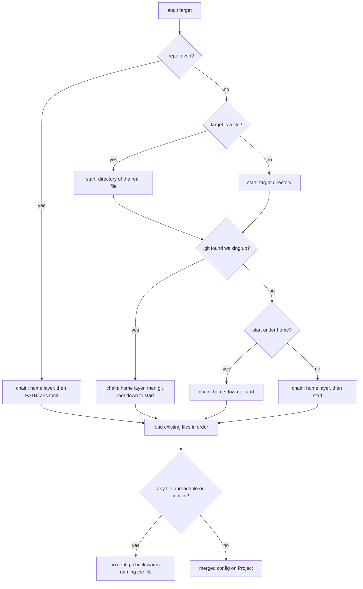

# Config Follows the Repo - Plan

## Goal Capsule

- **Objective:** A CLI author who declares vocabulary in `.anc.toml` gets it applied whenever anc audits their project:
  from the checkout, a subdirectory, a built binary, a PATH command that resolves into the checkout, or a scoring
  pipeline that fetched the repo. When no config applied and a flagged finding is one config could clear, the operator
  sees the exact line to add.
- **Means:** One resolver builds an ordered config chain from the target's location and an optional explicit root (KTD1,
  KTD2, KTD5), and the existing `.anc.toml` consumer reads the merged result (KTD4, KTD6).
- **Authority:** Requirements win on behavior. Key Technical Decisions win on mechanism within them. Units override
  neither. The diagram illustrates; prose governs.
- **Execution profile:** Audits of a binary, or of a directory below a repo root, start applying the repo's `.anc.toml`,
  and `~/.anc.toml` applies to every audit. One new flag (`--repo`) and one new environment variable (KTD3). Scorecard
  schema 0.9 adds one optional row field.
- **Stop conditions:** Stop and ask if repo-root detection needs a `git` subprocess (KTD1), if the home-layer tests
  cannot be made hermetic without resetting `HOME` (KTD3), or if agentnative-site's scorecard parser rejects a 0.9
  scorecard.
- **Finishing:** The implementing session lands the units on `dev` as PRs. The release, the sandbox image's anc pin, and
  the site's fetch step sit outside this plan (Scope Boundaries).

---

## Product Contract

### Summary

anc finds `.anc.toml` by location for every kind of audit target and merges what it finds over a user-level
`~/.anc.toml`. A new `--repo <path>` lets a caller that fetched a repo point anc at it. When no config applied and the
standard-names check warns, anc prints the config line that would clear the warning.

### Problem Frame

`.anc.toml` declares a CLI's domain vocabulary so `p6-may-standard-names` does not penalize native verbs. Today anc
reads it from one place: the audit target, when the target is a directory (`src/anc_toml.rs`). Every other way of
pointing anc at a tool misses it:

- A binary target, by path or `--command`, is a file, so the loader returns absent. `anc audit target/release/xr` inside
  the xurl-rs checkout ignores the `.anc.toml` at the checkout's root.
- A subdirectory target reads only that directory, so a monorepo's root config never reaches `anc audit
  crates/xurl-cli`.
- anc.dev's batch scorer and live sandbox audit tools a package manager installed (`docker/score/score-anc100.sh` and
  `src/worker/score/sandbox-exec.ts` in agentnative-site). The installed binary never sits inside its repo, and the
  sandbox blocks the network before `anc audit` runs, so neither the binary's location nor a fetch from inside anc can
  reach the config.

The cost lands downstream. xurl-rs carries an open task, T30, to make its `.anc.toml` work or delete it, because no anc
invocation applies it. Every scorecard anc.dev publishes for a tool with a domain vocabulary understates that tool.

A Cargo workspace root has a related, separate gap: `anc audit .` there finds no binary, so no behavioral audit runs.
`docs/plans/2026-10-01-0015-feat-workspace-and-mixed-language-discovery-plan.md` owns it.

### Key Decisions

- **Config is a repo concept, found by location.** Walk up from the target to the nearest git root; a worktree or
  submodule is its own repo. (session-settled: user-directed — chosen over a nearest-file-only lookup and a
  git-root-only lookup: the combination allows per-package files without letting a parent directory's file leak into a
  repo.) Governs R1, R2.
- **Nested files merge, and the nearer file wins.** (session-settled: user-approved — chosen over nearest-file-only and
  an `extends` key: `domain_verbs` only ever adds to the built-in verbs.) Governs R7.
- **`~/.anc.toml` is a base layer for every audit.** It applies inside repos too; outside git the walk extends to the
  home directory; outside both, the target's own directory plus the home file apply. (session-settled: user-directed —
  chosen over a home layer that applies only outside git, and over no home config: one place holds a user's personal
  vocabulary.) Governs R3, R4, R5.
- **No provenance field and no opt-out switch.** Results may differ between machines with different home files.
  (session-settled: user-directed — chosen over a scorecard provenance field and an opt-out flag: CI runners have no
  home file, so CI scorecards stay reproducible.) Governs R10.
- **A binary is located by its real file.** (session-settled: user-approved — chosen over the PATH entry's own location:
  a dev build linked onto PATH keeps its repo's config.) Governs R2.
- **A broken file voids the whole chain.** (session-settled: user-approved — chosen over skipping the bad file and over
  failing the run: a typo cannot quietly change which verbs apply.) Governs R8.
- **The caller supplies a fetched repo; anc never fetches.** (session-settled: user-approved — chosen over anc resolving
  a package manager's metadata and fetching the file itself: the sandbox forbids network during audits, and the site
  already knows each tool's repo.) Governs R6.
- **Say when config would have helped.** An author who has never heard of `.anc.toml` learns the fix from the finding
  itself. Governs R9.

### Requirements

**Where config comes from**

- R1. A target inside a git repo applies every `.anc.toml` from the repo root down to the target's directory.
- R2. A binary target, by path or by `--command`, starts from the directory holding the binary's real file, with
  symlinks resolved; R1, R3, and R4 then apply as they do to a directory.
- R3. A target outside any git repo but under the home directory applies every `.anc.toml` from the home directory down
  to the target's directory.
- R4. A target outside any git repo and outside the home directory applies the `.anc.toml` in the target's own
  directory.
- R5. `~/.anc.toml` is the lowest-precedence layer under every audit, applied once even when a walk also reaches it.
- R6. `--repo <path>` replaces the location walk: the chain is the home layer plus `<path>/.anc.toml`. The path must be
  an existing directory and need not be a git checkout.

**How files combine**

- R7. A nearer file's scalar settings win, and list settings such as `domain_verbs` combine in root-first order without
  duplicates.
- R8. When any file in the chain cannot be read or parsed, no config applies, and the consuming check warns with
  evidence naming the failing file.

**Telling the operator**

- R9. When no `domain_verbs` applied and `p6-may-standard-names` warns, the text output shows a hint with a
  ready-to-paste `[p6] domain_verbs` line listing the flagged verbs, and the JSON row carries the same hint.
- R10. No scorecard field records which files applied, and no switch skips the home layer for a run.

**Flag surface**

- R11. `--repo` is settable through an environment variable, as P1 requires of every flag.

### Acceptance Examples

- AE1. Built binary in its checkout. Covers R1, R2.
  - **Given:** the xurl-rs checkout, whose root `.anc.toml` declares `post`, `like`, and the rest of the X verbs, and a
    built `target/release/xr`.
  - **When:** `anc audit target/release/xr --principle 6` runs from any directory.
  - **Then:** `p6-may-standard-names` passes with `using_domain_verbs: true`.
- AE2. Nested package file. Covers R1, R7.
  - **Given:** a root `.anc.toml` declaring `post` and `crates/cli/.anc.toml` declaring `like`.
  - **When:** `anc audit crates/cli` runs.
  - **Then:** `post` and `like` both count as domain verbs.
- AE3. Broken nested file. Covers R8.
  - **Given:** AE2's layout, with `crates/cli/.anc.toml` holding `domain_verbs = "like"`, a string rather than a list.
  - **When:** `anc audit crates/cli` runs.
  - **Then:** the check warns, its evidence names `crates/cli/.anc.toml`, and no domain verbs apply, the root's `post`
    included.
- AE4. Sandbox with a fetched repo. Covers R6.
  - **Given:** `xr` installed under Homebrew's Cellar, and xurl-rs's `.anc.toml` fetched into `/tmp/anc-repo/`.
  - **When:** `anc audit --command xr --repo /tmp/anc-repo --output json` runs.
  - **Then:** the fetched file applies, as in AE1.
- AE5. Installed binary with no config anywhere. Covers R4, R9.
  - **Given:** a Homebrew-installed `xr` and no `~/.anc.toml`.
  - **When:** `anc audit --command xr` runs.
  - **Then:** the check warns, and the output shows a `[p6] domain_verbs` line listing `post`, `like`, and the other
    flagged verbs.

### Success Criteria

- xurl-rs's T30 verify condition holds against an anc built from this work: the `p6` evidence reflects the `.anc.toml`
  allowlist under AE1's invocation.

### Scope Boundaries

- Reading config from the current working directory. Config follows the target, never where the command runs.
- Binary discovery from a workspace root, and the rest of the discovery plan.

#### Deferred to Follow-Up Work

- agentnative-site: during the sandbox's install phase and during batch scoring, fetch the root `.anc.toml` at the
  installed version's tag and pass `--repo`; bump the anc pin in `docker/sandbox/Dockerfile` (v0.5.0) after the release
  that carries this plan.
- Resolving a binary's repo from package-manager metadata inside anc (Homebrew's formula JSON, `package.json`,
  `METADATA`, Go build info, crates.io), worth revisiting once `.anc.toml` adoption makes a lookup likely to find a
  file.
- The release. `docs/plans/2026-09-18-1756-fix-release-the-code-unwrap-exemption-plan.md` cuts the earlier release; this
  plan ships in a later one.

### Sources

- `src/anc_toml.rs`: the loader and its directory-only contract.
- `src/audits/behavioral/standard_names.rs`: the only consumer; `MitigationInfo` and `audit_standard_names`.
- `src/main.rs`: `TargetInfo`'s rule against printing absolute home paths, and `resolve_command_on_path`.
- `CLAUDE.md`: the scorecard schema version history and the mitigation-carrier contract.
- agentnative-site `src/worker/score/sandbox-exec.ts`: the `noHttp` lockdown before `anc audit`.
- `docs/solutions/conventions/never-override-core-env-vars-in-tests-stub-collaborators.md` and
  `docs/solutions/conventions/home-anchored-constructors-never-write-on-load-and-tests-inject-the-path-2026-09-03.md`:
  the home seam in KTD3.
- `docs/solutions/workflow-issues/nested-git-worktree-breaks-root-biome-check.md`: why a worktree is its own root
  (KTD1).

---

## Planning Contract

### Key Technical Decisions

- KTD1. **Find the repo root by walking up for a `.git` entry, directory or file.** Each ancestor of the start directory
  is checked for `.git`, and the first hit is the root; a `.git` file marks a worktree or submodule. No `git` subprocess
  runs, so audits stay process-light and behave the same in the sandbox. A worktree left inside a checkout is the case
  where walking past it to the outer repo reads the wrong root
  (`docs/solutions/workflow-issues/nested-git-worktree-breaks-root-biome-check.md`).
- KTD2. **Chain resolution is a pure function of the start directory, the home-layer file, and the explicit root.** It
  returns candidate file paths, home layer first and then root-first; loading and merging consume that list. The CLI
  resolves the three inputs once per run, and unit tests call the function on temp directories.
- KTD3. **The home-layer file path comes from `AGENTNATIVE_HOME_CONFIG`, defaulting to `.anc.toml` in
  `std::env::home_dir()`.** Integration tests point it at a file in their own temp directory, so no test reads the
  developer's real home file and none resets `HOME`
  (`docs/solutions/conventions/never-override-core-env-vars-in-tests-stub-collaborators.md`). With no home directory and
  no variable, the home layer is empty. `std::env::home_dir()` is correct on every platform at the crate's 1.88 MSRV;
  `src/skill_install.rs` reads `HOME` directly, and aligning it is out of scope. Conflict with a session-settled
  decision: R10 says no switch skips the home layer, and pointing this variable at a missing file does exactly that. The
  variable exists for test isolation; its help text describes it as relocating the user-level file.
- KTD4. **Merge yields one `AncConfig`; a failure carries its file.** The invalid outcome names the failing file by a
  display path: repo-relative inside the chain's repo, `~/`-prefixed under the home directory, absolute otherwise, so
  evidence never prints a home-anchored absolute path, the rule `TargetInfo` already follows. List entries combine per
  R7 with exact-match dedupe and stay verbatim, as `audit_standard_names` already matches them.
- KTD5. **`--repo <PATH>` on `audit`, bound to `AGENTNATIVE_REPO`.** It combines with every target form: a path,
  `--command`, and `--binary`. A missing or non-directory path is a usage error at exit 2, rendered through anc's
  existing usage-error envelope. Help text says the caller fetches the repo and anc reads only `<PATH>/.anc.toml`.
- KTD6. **The resolved config lives on `Project`, computed once per run.** `src/main.rs` resolves the chain after
  `Project::discover`, whose canonical path already gives R2's real location, and stores the merged result.
  `standard_names` reads the stored value instead of calling the loader with `project.path`.
- KTD7. **The hint rides on the result row, like the mitigation fields.** `standard_names` already holds the flagged
  verbs, so it attaches the hint to its own result: an optional `config_hint` on `AuditResult`, surfaced on the row view
  and absent rather than null on every other row, in scorecard schema 0.9. Text mode prints one `hint:` line under that
  row.

### High-Level Technical Design

### Sequencing

U1 through U5 land in order; U1 and U2 change no surface. The open `anc web` stack (#97, #101 through #106) adds
`src/lib.rs` and edits `src/cli.rs` and `src/main.rs`. Whichever lands second rebases, and module declarations move to
`src/lib.rs` if the stack lands first.

### Risks & Dependencies

- **A consumer validates scorecards against schema 0.8**, whose root denies unknown properties. The new field appears
  only when a hint fires, and agentnative-site's parser is checked against a 0.9 sample before release (a stop
  condition).
- **A developer's own `~/.anc.toml` changes local test results.** KTD3's seam; every integration test sets it.
- **Scorecards vary by machine.** Accepted (R10); CI runners have no home file.
- **Merge conflicts with the `anc web` stack.** Sequencing above.

---

## Implementation Units

### U1. Repo root and chain resolution

- **Goal:** Given a start directory, the home-layer file, and an optional explicit root, produce the ordered `.anc.toml`
  candidate list.
- **Requirements:** R1, R3, R4, R5, R6
- **Dependencies:** none
- **Files:** `src/anc_toml.rs` (moved to `src/anc_toml/mod.rs`), `src/anc_toml/chain.rs` (new)
- **Approach:**
  1. Move the loader into a module directory so resolution sits beside it without pushing one file past the 200-line
     review threshold.
  2. Find the root per KTD1, and decide "under home" by path prefix after canonicalizing both paths.
  3. Return candidates per KTD2 with the home file deduplicated (R5). Missing files are filtered at load time in U2, so
     this stays a function of paths alone.
- **Patterns to follow:** the unique temp-dir helper in `src/anc_toml.rs`'s tests.
- **Test scenarios:**
  - Start three levels inside a temp repo with a `.git` directory: candidates are the home file, the root, each
    intermediate directory, then the start, in that order.
  - Start inside a worktree (`.git` file) nested in an outer repo: the walk stops at the worktree root.
  - Start outside any repo under a temp home: candidates run from home down to the start, with the home file once.
  - Start outside both repo and home: the home file, then the start.
  - Explicit root given: the home file, then that root's file, whatever the start.
  - No home file configured: no home entry.
  - The home directory is itself the repo root: its file appears once.
- **Verification:** each chain branch in the High-Level Technical Design has a passing unit test.

### U2. Load and merge the chain

- **Goal:** Read the candidates into one merged config, or an invalid outcome naming the failing file.
- **Requirements:** R7, R8
- **Dependencies:** U1
- **Files:** `src/anc_toml/mod.rs`
- **Approach:**
  1. Skip candidates that do not exist; any other read error or a parse error makes the whole result invalid (R8).
  2. Merge per KTD4, carrying the display path on the invalid outcome.
  3. Remove the single-directory `load` once U3 leaves it without callers.
- **Patterns to follow:** the `AncConfigLoad` variants and their tests.
- **Test scenarios:**
  - Covers AE2. Root `["post"]` and nested `["like"]` merge to `["post", "like"]`.
  - A verb in two files appears once, at its root-most position.
  - A file with no `[p6]` section contributes nothing and does not fail.
  - Covers AE3. A nested file with `domain_verbs = "like"` is invalid, names `crates/cli/.anc.toml`, and yields no
    verbs.
  - A directory named `.anc.toml` in the chain is invalid and named.
  - A home-layer failure's display path starts with `~/`; a failing file outside home and repo is shown absolute.
  - All candidates missing: absent, as today.
- **Verification:** loader tests pass, and none reads a path outside its temp directory.

### U3. Resolve once per run and wire the consumer

- **Goal:** Every audit target form reaches its chain, and `--repo` and the home seam work end to end.
- **Requirements:** R1, R2, R3, R4, R5, R6, R11
- **Dependencies:** U2
- **Files:** `src/cli.rs`, `src/main.rs`, `src/project.rs`, `src/audits/behavioral/standard_names.rs`,
  `tests/standard_names_integration.rs`
- **Approach:**
  1. Add `--repo` per KTD5, with an `after_help` example for the fetched-repo case.
  2. Derive the start directory from `Project::discover`'s canonical path: its parent for a file, itself for a directory
     (R2).
  3. Resolve the home-layer path per KTD3 and the chain per U1 and U2, then store the result on `Project` (KTD6).
  4. Point `standard_names` at the stored result; it keeps warning on an invalid chain, now naming the file.
  5. Have the integration file's `cmd()` helper set `AGENTNATIVE_HOME_CONFIG` to a temp path, so no test reads the real
     home file.
- **Execution note:** Start with a failing integration test for AE1's shape: a staged repo with a root `.anc.toml` and
  the fixture binary in a nested `target/release/`, audited by binary path.
- **Patterns to follow:** `stage_project`, `run_audit_and_extract`, and the shell fixture in
  `tests/standard_names_integration.rs`; `resolve_command_on_path` in `src/main.rs`.
- **Test scenarios:**
  - Covers AE1. Binary path inside a staged repo with a root config: passes with `using_domain_verbs`.
  - Binary reached through a symlink placed outside the repo: the repo's config still applies.
  - `--command` resolving into a staged repo, with the fixture directory prepended to the child's `PATH`: the config
    applies.
  - Covers AE2. Subdirectory target with nested files: both files' verbs apply.
  - Covers AE4. Binary outside any repo plus `--repo <dir>` holding a config: the config applies.
  - `--repo` naming a missing path: exit 2, with the usage envelope under `--output json`.
  - `--repo` naming a regular file: exit 2, the same envelope.
  - `AGENTNATIVE_REPO` set in place of the flag: same result as the flag.
  - `AGENTNATIVE_HOME_CONFIG` naming a temp file and a target outside any repo: the home file's verbs apply.
  - The three existing tests in the file still pass unchanged.
- **Verification:** AE1 holds against the real xurl-rs checkout with a locally built anc.

### U4. The config hint

- **Goal:** A warning that config could clear shows the line that clears it.
- **Requirements:** R9
- **Dependencies:** U3
- **Files:** `src/types.rs`, `src/audits/behavioral/standard_names.rs`, `src/scorecard/mod.rs`,
  `schema/scorecard.schema.json`, `tests/scorecard_schema_v05.rs`, `tests/standard_names_integration.rs`
- **Approach:**
  1. In `audit_standard_names`, attach the hint per KTD7 when the verdict is a warning and no domain verbs applied.
  2. Surface it on the row view, skipped when absent, mirroring `using_domain_verbs` and the mitigation-carrier contract
     in `CLAUDE.md`.
  3. Print the `hint:` line under the row in text mode, following the evidence line's visibility rules.
  4. Bump `SCHEMA_VERSION` to 0.9 and regenerate the committed schema from `anc emit schema`.
- **Test scenarios:**
  - Covers AE5. A warning with no config: the JSON row's `config_hint` lists each flagged verb, and text output has one
    `hint:` line.
  - A warning with config applied that still misses the threshold: no hint.
  - A pass: no hint.
  - A warning caused by an invalid chain: no hint, and the evidence names the file.
  - Rows from every other audit never carry the field.
  - The committed schema matches `anc emit schema`, and a 0.9 scorecard carrying the field validates against it.
- **Verification:** the schema drift test passes, and a JSON scorecard captured from AE5 validates against the committed
  schema.

### U5. Document discovery and the flag

- **Goal:** A user or agent can learn where anc looks for `.anc.toml` without reading code.
- **Requirements:** R1, R2, R3, R4, R5, R6, R7, R8, R9, R11
- **Dependencies:** U4
- **Files:** `README.md`, `CLAUDE.md`, `src/cli.rs`
- **Approach:**
  1. Add a README section that states the location rules once, as a table by target kind, followed by merge behavior,
     the home layer, `--repo`, and the hint.
  2. Add the schema 0.9 entry and the hint field to `CLAUDE.md`'s schema history and carrier notes, citing the README
     section for the rules.
  3. Point the `audit` help text at the README section.
- **Test scenarios:** Test expectation: none -- documentation and help text; any `insta` snapshot of `anc audit --help`
  is updated in the same unit.
- **Verification:** each README example runs as written against a local build.

---

## Verification Contract

| Gate            | Command                                                    | Applies to       | Done signal                                                    |
| --------------- | ---------------------------------------------------------- | ---------------- | -------------------------------------------------------------- |
| Format          | `cargo fmt --check`                                        | every unit       | clean                                                          |
| Lint            | `cargo clippy --all-targets -- -D warnings`                | every unit       | clean                                                          |
| Tests           | `cargo test`                                               | every unit       | green                                                          |
| Fixture tests   | `cargo test -- --ignored`                                  | U3, U4           | green                                                          |
| Schema drift    | the scorecard schema test against `anc emit schema`        | U4               | committed schema matches                                       |
| Local CI mirror | `scripts/hooks/pre-push`                                   | before each push | green                                                          |
| Consumer check  | a local anc build running AE1 against the xurl-rs checkout | U3               | `p6-may-standard-names` passes with `using_domain_verbs: true` |

---

## Definition of Done

**Global**

- Each of R1 through R11 traces to a passing test or the consumer check.
- No test reads the real home file or resets `HOME`.
- No evidence string or scorecard field prints an absolute path under the home directory.
- `README.md` documents where anc looks, and `CLAUDE.md` records schema 0.9.
- Each PR body's changelog names the behavior change (config now reaches binary and subdirectory targets, and
  `~/.anc.toml` applies everywhere), `--repo`, and the hint.
- Abandoned approaches and experimental code are removed before each PR is marked ready.

**Per unit**

- U1: every chain branch is unit-tested on temp directories.
- U2: merge and failure behavior match R7 and R8, with the failing file named.
- U3: AE1, AE2, and AE4 pass end to end; the integration tests never read the real home file.
- U4: AE5 passes in both output modes; schema 0.9 is committed and drift-free.
- U5: the README section exists and its examples run.
