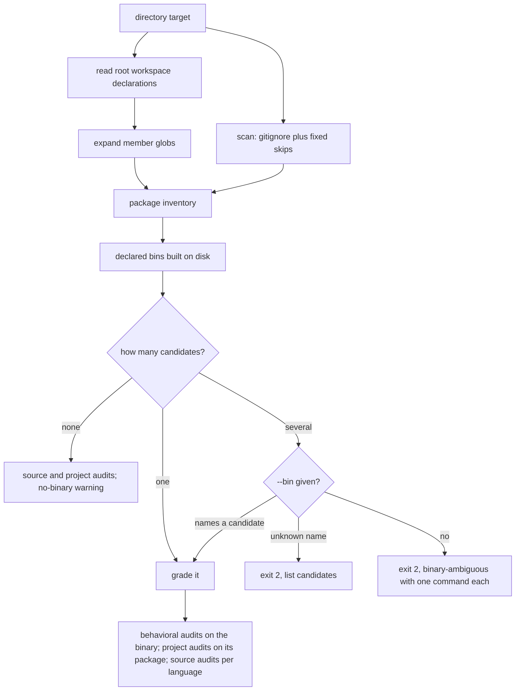

# Workspace and Mixed-Language Discovery - Plan

## Goal Capsule

- **Objective:** Running `anc audit` on a repo root grades the repo's own CLI with every audit family, whether the repo
  is a Cargo, npm, yarn, pnpm, go.work, or uv workspace, or mixes languages. When the repo has built more than one CLI,
  anc stops before scoring and prints the exact command that grades each one.
- **Means:** A package inventory from workspace declarations and a gitignore-aware scan (KTD1, KTD2), candidates from
  the bins those packages declare and have built (KTD3), one selection rule (KTD4, KTD5), and audits anchored on the
  graded package (KTD6, KTD7).
- **Authority:** Requirements win on behavior. Key Technical Decisions win on mechanism within them. Units override
  neither. The diagram and table illustrate; prose governs.
- **Execution profile:** Workspace roots gain behavioral audits and correct project audits. Node and Python projects
  stop grading arbitrary files from `node_modules/.bin`, `dist/`, and `build/`. A repo with several built binaries exits
  2 until `--bin` picks one. The source walk starts honoring `.gitignore` (KTD6). New flag `--bin`; no scorecard schema
  change.
- **Stop conditions:** Stop and ask if a workspace format cannot be read without a new dependency (KTD2), if anc's own
  dogfood audit (`tests/dogfood.rs`) changes verdicts, or if the scan pushes a real repo past the existing depth or file
  caps.
- **Finishing:** The implementing session lands the units on `dev` as PRs, after
  `docs/plans/2026-10-01-0015-feat-config-follows-the-repo-plan.md`. The release is outside this plan.

---

## Product Contract

### Summary

A directory audit inventories every package in the repo from workspace declarations and a scan that honors `.gitignore`.
It picks the binary to grade from the bins those packages declare and have built. Source audits run for each language
present; project audits read the graded binary's own manifest. Several built binaries stop the run with one
`anc audit DIR --bin NAME` command per candidate.

### Problem Frame

anc's project model assumes one package with one manifest at the audit root (`src/project.rs`). `detect_language` stops
at the first of `Cargo.toml`, `pyproject.toml`, `go.mod`, and `package.json`, and binary discovery reads only that
manifest. Three layouts break:

- **A Cargo workspace root.** Its virtual manifest has no `[package]` or `[[bin]]`, so no binary is found and no
  behavioral audit runs. Against xurl-rs, `anc audit .` runs source and project audits only, and `p6-dependencies` reads
  the virtual manifest's absent `[dependencies]` and warns, while the CLI's dependencies live in
  `crates/xurl-cli/Cargo.toml`.
- **Node and Python projects.** Node discovery takes every file in `node_modules/.bin`, which holds dependencies' tools
  such as `tsc`, and grades whichever entry `read_dir` returns first. Python discovery takes every file under `dist/`
  and `build/`, where wheels and archives live.
- **A repo that mixes languages.** A Rust CLI beside a Python package is detected as whichever manifest sits at the
  root, so the other language gets no source audits.

`docs/plans/2026-10-01-0015-feat-config-follows-the-repo-plan.md` makes `.anc.toml` reach any target. This plan makes a
directory target find the right binary and the right manifests.

### Key Decisions

- **Workspace declarations plus a tree scan.** (session-settled: user-approved — chosen over declarations only and a
  scan only: a mixed-language repo with no root workspace file is still fully detected, and declarations supply the
  shared build location.) Governs R1, R2.
- **All four workspace families.** (session-settled: user-directed — chosen over a subset: Cargo, npm and yarn, pnpm,
  go.work, and uv all ship.) Governs R1.
- **The scan honors `.gitignore` plus a fixed skip list.** (session-settled: user-approved — chosen over the fixed list
  alone: the `ignore` crate is already compiled into anc.) Governs R3.
- **Only binaries on disk count.** (session-settled: user-approved — chosen over counting declared but unbuilt bins: anc
  can grade only what runs.) Governs R4.
- **Several binaries stop the run, with no picker.** (session-settled: user-directed — chosen over a partial scorecard
  with a candidate list, an arrow-key picker, and binary-path commands: an agent can never mistake a partial run for a
  score, and a binary-path command would drop the source and project audits.) Governs R6, R7.
- **Project audits read the graded binary's package.** (session-settled: user-approved — chosen over auditing every
  package and over the root's workspace tables: library crates are not graded on CLI rules.) Governs R9.
- **Source audits cover the whole repo for each language.** (session-settled: user-approved — chosen over package-scoped
  audits such as `anc audit <package-dir>`: the graded CLI is built from the whole repo's code.) Governs R8.

### Requirements

**Package inventory**

- R1. A directory audit inventories every package that a workspace declaration at the audit root names: Cargo
  `[workspace] members` and `exclude`, npm or yarn `workspaces`, `pnpm-workspace.yaml` `packages`, `go.work` `use`, and
  uv `[tool.uv.workspace] members` and `exclude`, with globs expanded.
- R2. It also inventories every manifest a tree scan finds outside the declared packages, so a repo without a root
  workspace file is fully detected.
- R3. The scan skips what the repo's `.gitignore` files exclude, hidden directories, `target`, `node_modules`, `vendor`,
  `venv`, `dist`, `build`, and `tests` unless `--include-tests` is set. It does not follow directory symlinks and stays
  within the existing depth and file caps.

**Binary selection**

- R4. A candidate is a bin that an inventoried package declares and that exists on disk at its language's build location
  (KTD3).
- R5. With one candidate, anc grades it. With none, anc runs source and project audits and warns; when packages declare
  bins that are not built, the warning lists those bin names and the ways forward: build one, audit it by path, or name
  it with `--command`.
- R6. With several candidates and no `--bin`, anc exits 2 before running any audit. Text output lists one
  `anc audit DIR --bin NAME` per candidate. JSON output is anc's usage-error envelope with `error: binary-ambiguous` and
  a `candidates` list giving each candidate's bin name, package, relative path, and verbatim command.
- R7. `--bin <name>`, also settable as `AGENTNATIVE_BIN`, grades the named candidate. An unknown name exits 2 listing
  the candidates, and `--bin` beside a binary-path or `--command` target is a usage error.

**What gets audited**

- R8. Source audits run for every detected language that has them, today Rust and Python, over that language's files
  under the audit root.
- R9. Manifest-reading project audits read the manifest of the package that builds the graded binary. With no graded
  binary they read the one package declaring a bin; with several such packages they skip, and the evidence names the
  packages.
- R10. The scorecard's tool name and version come from the graded binary's package: its manifest version, else the
  binary's own `--version`.

### Acceptance Examples

- AE1. xurl-rs workspace root. Covers R1, R4, R5, R9.
  - **Given:** the xurl-rs checkout with only `target/release/xr` built.
  - **When:** `anc audit .` runs at its root.
  - **Then:** `xr` is graded, behavioral audits run, and `p6-dependencies` reads `crates/xurl-cli/Cargo.toml`.
- AE2. Two built binaries. Covers R6.
  - **Given:** AE1's checkout after a workspace build also produced `target/debug/xdk-consumer-check`.
  - **When:** `anc audit . --output json` runs.
  - **Then:** anc exits 2 with `error: binary-ambiguous`, listing `xr` and `xdk-consumer-check`, each with its
    `anc audit . --bin <name>` command.
- AE3. Picking one. Covers R7.
  - **When:** `anc audit . --bin xr` runs on AE2's checkout.
  - **Then:** the result matches AE1.
- AE4. Node project with dependency tools. Covers R4.
  - **Given:** a `package.json` with `"bin": {"mytool": "bin/cli.js"}`, an executable `bin/cli.js`, and
    `node_modules/.bin/tsc`.
  - **When:** `anc audit .` runs.
  - **Then:** `mytool` is graded, and `tsc` is never a candidate.
- AE5. Mixed repo without a root workspace file. Covers R2, R8.
  - **Given:** `cli/Cargo.toml` declaring a built bin `tool`, and `py/pyproject.toml`.
  - **When:** `anc audit .` runs at the repo root.
  - **Then:** `tool` is graded, and both the Rust and the Python source audits run.

### Scope Boundaries

- An interactive picker. A person and an agent get the same printed commands.
- New Go or Node source audits.

#### Deferred to Follow-Up Work

- A member-directory audit (`anc audit crates/xurl-cli`) locating its enclosing workspace's shared build output.
- One scorecard per binary for repos that ship several CLIs.
- Build-directory overrides: `CARGO_TARGET_DIR`, `build.target-dir` in `.cargo/config.toml`, custom npm or pnpm bin
  directories, and `GOBIN`.

### Sources

- `src/project.rs`: `detect_language`, `discover_binaries`, `discover_rust_binaries`, `discover_simple_binaries`,
  `walk_source_files`, `parsed_files`.
- `src/main.rs`: audit collection by binary and language, and tool name and version resolution.
- `src/audits/project/`: each project audit's applicability and manifest reads.
- `src/json_error.rs`: the usage-error envelope; `AGENTS.md`: the exit-code table.
- `PRODUCT.md`: the three-part error shape (what failed, why, what to do next).
- Workspace formats: Cargo (`https://doc.rust-lang.org/cargo/reference/workspaces.html`, and target auto-discovery at
  `https://doc.rust-lang.org/cargo/reference/cargo-targets.html`), npm
  (`https://docs.npmjs.com/cli/using-npm/workspaces`), yarn (`https://classic.yarnpkg.com/lang/en/docs/workspaces/`),
  pnpm (`https://pnpm.io/pnpm-workspace_yaml`), go.work (`go help work`), uv
  (`https://docs.astral.sh/uv/concepts/projects/workspaces/`). The go.work `use` forms and uv's
  `[tool.uv.workspace] members` and `[project.scripts]` were confirmed against local toolchains.
- `docs/solutions/test-failures/stale-release-binary-dogfood-fail-2026-05-07.md`: why Rust picks the newer of `release`
  and `debug`.

---

## Planning Contract

### Key Technical Decisions

- KTD1. **`Project` gains a package inventory, and its single-valued fields derive from the graded package.** Each
  package records its root directory, language, manifest path, and declared bins. `language`, `manifest_path`, and
  `binary_paths` keep their meaning for the one graded package, so audits that read them need no change. Discovery
  returns the inventory and candidates without building a runner; selection (R5 through R7) picks the graded binary, and
  only then is its runner built, so `--bin` decides which binary every behavioral audit probes.
- KTD2. **Declarations are read with code already in the binary.** `toml` reads Cargo and uv, `serde_json` reads npm and
  yarn, a line reader handles `go.work`, and `globset` expands member globs. `serde_yaml` is test-only, so
  `pnpm-workspace.yaml` gets a narrow reader for the top-level `packages` sequence in block and flow form, including `!`
  exclusions. A declaration anc cannot read produces a stderr warning, and the tree scan still finds those packages.
- KTD3. **Candidates come from what packages declare, never from listing a directory.** Each language checks its
  declared bins at fixed build locations, below. Rust keeps the newer-of-`release`-and-`debug` rule. On Windows, Rust
  and Go names gain `.exe`, and Python's venv bin directory is `Scripts`.

| Language | Declared bins                                                                                                                                                         | Built location checked                                                                                                           |
| -------- | --------------------------------------------------------------------------------------------------------------------------------------------------------------------- | -------------------------------------------------------------------------------------------------------------------------------- |
| Rust     | `[[bin]]` names; `src/main.rs` gives the package name; `src/bin/<name>.rs` and `src/bin/<name>/main.rs` give `<name>`; `autobins = false` turns the implicit ones off | `target/release/<name>` and `target/debug/<name>` under the workspace root, the newer by mtime                                   |
| Node     | a `bin` string gives the package name without its scope; a `bin` object gives its keys                                                                                | the declared file inside the package when executable, else `node_modules/.bin/<name>` in the package, then at the workspace root |
| Python   | `[project.scripts]` keys                                                                                                                                              | `.venv/bin/<name>` in the package, then at the workspace root                                                                    |
| Go       | each directory holding `package main` gives its directory name                                                                                                        | `<name>` in that directory, then at the module root                                                                              |

- KTD4. **Candidates have a fixed order, and ambiguity is a usage error.** The order is the root package, then
  declaration order, then scan order. `binary-ambiguous` reuses `json_error::render_error`'s `kind: usage` envelope plus
  an additive `candidates` array, at exit 2, the class `AGENTS.md` assigns to "command not found on PATH". The text
  follows `PRODUCT.md`'s three-part shape: several binaries were found, anc grades one per run, and here is the command
  for each.
- KTD5. **`--bin <NAME>`, bound to `AGENTNATIVE_BIN`, follows Cargo's `--bin`.** Help text separates it from the
  existing `--binary` switch, which limits a run to behavioral audits, and each flag's help names the other. When two
  candidates share a name, the error shows their relative paths, and `--bin` also accepts a candidate's relative path.
- KTD6. **One skip list serves the scan and the source walk, and source caches are per language.** `parsed_files` is
  keyed by language, and `all_source_audits` runs once for each detected language that has audits. The source walk moves
  onto the same `ignore`-based walker as the scan, so source audits stop reading files the repo ignores; that changes
  results for repos with ignored source, which the changelog states.
- KTD7. **The graded package anchors every manifest read and the tool identity.** Project audits reading `manifest_path`
  get the graded package's manifest through KTD1, `error_module` reads the graded package's `src/` instead of the audit
  root's, and the manifest name and version readers in `src/main.rs` read the same manifest.
- KTD8. **The legacy directory-listing discovery is removed.** Listing every file in `node_modules/.bin`, `dist/`, or
  `build/` is replaced by KTD3, and the changelog files it under `### Fixed`. Go's binary-named-after-its-directory rule
  survives as one case of KTD3's Go row.

### High-Level Technical Design



### Sequencing

This plan lands after the config plan, since both change `Project` and `src/main.rs`. Units land U1 through U6 in order.
U3 swaps discovery in one step, so the Node and Python behavior change lands with it. The `anc web` stack note in the
config plan applies here too.

### Risks & Dependencies

- **Projects that relied on the legacy Node or Python discovery may now grade nothing**, where before they graded an
  arbitrary file. The changelog says so, and the no-binary warning names how to point anc at a binary.
- **Ignored source drops out of source audits** (KTD6). Stated in the changelog.
- **A Node CLI whose declared bin file is not committed executable gets no candidate** until it is linked into
  `node_modules/.bin` or marked executable. The no-binary warning names both fixes, and `--command` still works.
- **Batch scoring and the live sandbox use `--command`**, so selection never touches them.
- **anc's own repo** has one package with one bin, and its fixture manifests sit under `tests/`, so its dogfood audit
  should not change (a stop condition).
- **`ignore` and `globset` become direct dependencies.** Pinning them to the versions `ast-grep-language` already pulls
  in keeps the binary-size gate in the `anc web` stack unchanged.

---

## Implementation Units

### U1. Workspace declaration readers

- **Goal:** Read each family's workspace declaration at the audit root into a list of member directories.
- **Requirements:** R1
- **Dependencies:** none
- **Files:** `src/project.rs` (moved to `src/project/mod.rs`), `src/project/workspace.rs` (new), `Cargo.toml`,
  `tests/fixtures/workspaces/` (new: `cargo-virtual`, `cargo-root-package`, `npm`, `yarn`, `pnpm`, `go-work`, `uv`)
- **Approach:**
  1. Move `src/project.rs` into a module directory so the new readers sit beside it.
  2. Add `ignore` and `globset` as direct dependencies at the versions in `Cargo.lock` (KTD2).
  3. Implement one reader per family per KTD2; each returns member directories, excluding `exclude` and `!` entries.
- **Execution note:** Generate the npm, yarn, pnpm, and uv fixtures with the real tools where they are installed, so the
  fixtures match what the tools write.
- **Test scenarios:**
  - Cargo virtual workspace with `members = ["crates/*"]` and one `exclude`: the excluded member is absent.
  - Cargo root with both `[package]` and `[workspace]`: the root package and the members are all listed.
  - npm `workspaces` as an array, and yarn's `{ "packages": [...] }` object: same members.
  - pnpm block list and flow list, with a `!` exclusion: same members.
  - A pnpm file using YAML beyond the `packages` sequence: a stderr warning and an empty member list.
  - go.work single-line `use` and block `use ( ... )`: same members.
  - uv `members` with a glob and an `exclude`: the excluded member is absent.
  - A declared member directory that does not exist: skipped with a stderr warning.
- **Verification:** each fixture yields its expected member list.

### U2. Tree scan and package inventory

- **Goal:** Combine declared members with manifests the scan finds into one package inventory.
- **Requirements:** R2, R3
- **Dependencies:** U1
- **Files:** `src/project/scan.rs` (new), `src/project/mod.rs`, `tests/fixtures/mixed-no-root/` (new)
- **Approach:**
  1. Walk with `ignore` per R3, collecting the four manifest names. Configure the walker to read the repo's `.gitignore`
     files and `.git/info/exclude` but not the operator's global excludes file (`core.excludesFile`), so the same repo
     yields the same packages on every machine. Each manifest is its own package, so a directory holding both
     `Cargo.toml` and `pyproject.toml`, the maturin layout, yields a Rust package and a Python package.
  2. Merge with U1's members, deduplicating by package root and language.
  3. Store the inventory on `Project` (KTD1), leaving the single-valued fields to U3 and U5.
- **Test scenarios:**
  - Covers AE5. `cli/Cargo.toml` and `py/pyproject.toml` with no root manifest: two packages, Rust and Python.
  - A manifest under a directory that only a global excludes file lists: still a package.
  - One directory holding `Cargo.toml` and `pyproject.toml`: two packages at the same root, Rust and Python.
  - A `package.json` inside `node_modules/`: not a package.
  - A manifest in a directory the repo's `.gitignore` lists: not a package.
  - A manifest under `tests/fixtures/`: not a package, and is one under `--include-tests`.
  - A symlinked directory pointing outside the repo: not followed.
  - A declared member the scan also finds: listed once.
  - anc's own repo root: one package, `agentnative`.
- **Verification:** the inventory for each fixture matches its expected packages.

### U3. Declared bins and candidates

- **Goal:** Turn the inventory into the list of candidate binaries per KTD3, replacing directory-listing discovery.
- **Requirements:** R4
- **Dependencies:** U2
- **Files:** `src/project/bins.rs` (new), `src/project/mod.rs`, `tests/fixtures/bins/` (new: `node-bin-object`,
  `node-bin-scoped`, `python-scripts`, `go-main`)
- **Approach:**
  1. Read each package's declared bins per its language's row in KTD3.
  2. Check each declared bin at its build locations and keep the ones that exist.
  3. Remove `discover_simple_binaries` and the Go directory-name rule (KTD8).
- **Test scenarios:**
  - Rust `[[bin]]`, `src/main.rs`, and `src/bin/<name>.rs` each yield the expected name; `autobins = false` drops the
    implicit ones.
  - Covers AE1. A member crate's bin found in the workspace root's `target/release/`.
  - Both `release` and `debug` present: the newer by mtime wins.
  - Covers AE4. Node `bin` object with an executable declared file: `mytool` is a candidate, `node_modules/.bin/tsc` is
    not.
  - Node `bin` string on a scoped package `@scope/tool`: the candidate is `tool`.
  - Python `[project.scripts]` with `.venv/bin/<name>` present: a candidate; absent: none.
  - Go `cmd/tool/main.go` with `package main` and a built `cmd/tool/tool`: a candidate.
  - A library-only package declares nothing and yields no candidate.
  - A declared but unbuilt bin: no candidate.
- **Verification:** each fixture yields exactly its expected candidates.

### U4. Selection and `--bin`

- **Goal:** Choose the graded binary, or stop with the commands that choose it.
- **Requirements:** R5, R6, R7
- **Dependencies:** U3
- **Files:** `src/cli.rs`, `src/main.rs`, `src/json_error.rs`, `tests/discovery_integration.rs` (new)
- **Approach:**
  1. Add `--bin` per KTD5.
  2. After inventory, apply R5 through R7 in the order of KTD4, before any audit is collected.
  3. Render `binary-ambiguous` through the existing envelope helper plus the `candidates` array (KTD4).
  4. Give the new test file's spawn helper the home-config override, which the config plan's isolation guard requires of
     every file that spawns `anc audit`.
- **Patterns to follow:** `render_error` and its tests in `src/json_error.rs`; the spawn helpers in
  `tests/integration.rs`.
- **Test scenarios:**
  - Covers AE2. Two candidates, text mode: exit 2, one `anc audit . --bin <name>` line each, no scorecard on stdout.
  - Covers AE2. Two candidates, `--output json`: exit 2, `error: binary-ambiguous`, both candidates with name, package,
    relative path, and command.
  - Covers AE3. `--bin xr`: grades `xr`.
  - `--bin nope`: exit 2 listing the candidates.
  - `--bin` beside `--command` or a binary path: exit 2 usage error.
  - `AGENTNATIVE_BIN=xr`: same as the flag.
  - Two candidates sharing a name in different languages: the error shows relative paths, and `--bin <relative path>`
    grades the one named.
  - Zero candidates: source and project audits run, and the warning lists the declared but unbuilt bins with the ways
    forward from R5.
- **Verification:** each scenario's exit code and output match, and no audit runs in an ambiguous case.

### U5. Audits per language and per graded package

- **Goal:** Source audits run for every language present, and manifest reads follow the graded package.
- **Requirements:** R8, R9, R10
- **Dependencies:** U4
- **Files:** `src/project/mod.rs`, `src/audits/source/mod.rs`, `src/audits/source/rust/`, `src/audits/source/python/`,
  `src/audits/project/dry_run.rs`, `src/audits/project/error_module.rs`, `src/main.rs`, `tests/discovery_integration.rs`
- **Approach:**
  1. Key `parsed_files` by language and move the source walk onto the shared walker (KTD6). Its 24 call sites in the
     Rust and Python source audits and `dry_run.rs` each ask for their own language's files.
  2. Collect source audits once per detected language that has them.
  3. Derive `language`, `manifest_path`, and `binary_paths` from the graded package, or from the one bin-declaring
     package when nothing is graded (KTD1, R9).
  4. Point `error_module` and the manifest name and version readers at the graded package (KTD7).
- **Test scenarios:**
  - Covers AE1. `p6-dependencies` reads `crates/xurl-cli/Cargo.toml` in a virtual-workspace fixture.
  - Covers AE5. Rust and Python source audit rows both appear in one scorecard.
  - The scorecard's tool version is the graded package's manifest version.
  - No graded binary and one bin-declaring package: project audits read that package's manifest.
  - No graded binary and two bin-declaring packages: those audits skip with evidence naming both packages.
  - A Rust source file in a gitignored directory: absent from source audit evidence.
  - `tests/dogfood.rs` verdicts for anc's own repo are unchanged.
- **Verification:** the consumer check below passes against the real xurl-rs checkout.

### U6. Document discovery and `--bin`

- **Goal:** A user or agent can predict what `anc audit .` grades before running it.
- **Requirements:** R1 through R10
- **Dependencies:** U5
- **Files:** `README.md`, `AGENTS.md`, `CLAUDE.md`, `src/cli.rs`
- **Approach:**
  1. Add a README section on how anc finds what to audit: the inventory, KTD3's table, `--bin`, and the ambiguity error.
  2. Add `binary-ambiguous` to `AGENTS.md`'s exit-code table, and the package model to `CLAUDE.md`'s architecture notes.
  3. Add `anc audit . --bin xr` to the `audit` examples, and show `--bin` beside `--binary` in the README section.
- **Test scenarios:** Test expectation: none -- documentation and help text; any `insta` snapshot of `anc audit --help`
  is updated in the same unit.
- **Verification:** each README example runs as written against a local build.

---

## Verification Contract

| Gate            | Command                                                     | Applies to       | Done signal                                                                                    |
| --------------- | ----------------------------------------------------------- | ---------------- | ---------------------------------------------------------------------------------------------- |
| Format          | `cargo fmt --check`                                         | every unit       | clean                                                                                          |
| Lint            | `cargo clippy --all-targets -- -D warnings`                 | every unit       | clean                                                                                          |
| Tests           | `cargo test`                                                | every unit       | green                                                                                          |
| Fixture tests   | `cargo test -- --ignored`                                   | U2, U3, U5       | green                                                                                          |
| Dogfood         | `tests/dogfood.rs` within `cargo test`                      | U2, U5           | verdicts unchanged                                                                             |
| Local CI mirror | `scripts/hooks/pre-push`                                    | before each push | green                                                                                          |
| Consumer check  | a local anc build running `anc audit .` at the xurl-rs root | U5               | `xr` graded, behavioral audits present, `p6-dependencies` reading `crates/xurl-cli/Cargo.toml` |

---

## Definition of Done

**Global**

- Each of R1 through R10 traces to a passing test or the consumer check.
- No candidate ever comes from listing a directory's contents.
- Every fixture manifest lives under `tests/fixtures/` and is not a workspace member, per `AGENTS.md`.
- `README.md`, `AGENTS.md`, and `CLAUDE.md` describe the shipped behavior.
- Each PR body's changelog names the visible changes: workspace roots graded, legacy Node and Python discovery removed,
  ignored source excluded, `binary-ambiguous`, and `--bin`. Under `### Changed`, it says that a repo or crate that
  builds several binaries, which anc used to grade on the first one it found, now exits 2 until `--bin` names one, and
  the README's discovery section says the same.
- Abandoned approaches and experimental code are removed before each PR is marked ready.

**Per unit**

- U1: every family's fixture yields its member list.
- U2: the inventory honors R3 on every fixture, and anc's own repo yields one package.
- U3: candidates come only from declared bins found on disk.
- U4: AE2 and AE3 pass in both output modes.
- U5: AE1 and AE5 pass, and dogfood verdicts are unchanged.
- U6: the README section exists and its examples run.

---

## Decision ledger

Review target: this plan (`/plan-eng-review`). Brett authorized best-judgement decisions while unavailable; each record
below names the option taken and why, and every one is open to reversal.

### S0: Scope record (complexity gate)

- Prerequisite offer: no design doc exists; skipped, because the Product Contract carries the design and every Key
  Decision was settled in the planning session.
- Complexity: about 22 files plus fixtures and 3 new modules (`workspace.rs`, `scan.rs`, `bins.rs`). The gate tripped.
- Feature cuts proposed: none. Each workspace family, the scan, and the selection rule trace to session-settled Key
  Decisions.
- Structure: original arrangement. Folding the three modules into one `discovery.rs` would put a 600-line file behind
  one name and mix parsing, walking, and bin resolution.
- Result: scope accepted as-is. Pending remedies resolved below: R1, R2, R3.

### R1: When the runner is built

Finding: 1, P2, confidence 8/10, KTD1 against `src/project.rs` `Project::discover`; Architecture. Runtime evidence:
`Project::discover` builds the runner from `binary_paths[0]` as soon as binaries are found
(`BinaryRunner::new(binary_paths[0].clone(), ...)`), before anything could apply `--bin`.

| Choice              | Current                        | A                                  | B           |
| ------------------- | ------------------------------ | ---------------------------------- | ----------- |
| Runner construction | inside discovery, first binary | after selection, the graded binary | unspecified |

Options: A) Discovery returns inventory and candidates; the runner is built after selection (recommended). B) Leave it
to the implementer. State: approved. Actual answer: A, best-judgement decision. Accepted scope: KTD1 extended.

### R2: Multi-binary crates change behavior on upgrade

Finding: 2, P2, confidence 9/10, R6 against `src/project.rs` `discover_rust_binaries`; Architecture (upgrade). Runtime
evidence: `discover_rust_binaries` collects every `[[bin]]` name and the runner takes the first that exists, so a single
crate with two built bins is graded on the first today; under R6 it exits 2. A CI job running `anc audit .` on such a
crate starts failing after upgrade.

| Choice         | Current                      | A                                                   | B          |
| -------------- | ---------------------------- | --------------------------------------------------- | ---------- |
| Upgrade notice | DoD lists `binary-ambiguous` | `### Changed` entry plus README note naming `--bin` | as written |

Options: A) Name the behavior change and its fix in the changelog and README (recommended). B) Keep the DoD wording.
State: approved. Actual answer: A, best-judgement decision. Accepted scope: DoD changelog bullet extended. The
stop-and-ask behavior itself is a session-settled Key Decision and is not reopened.

### R3: Windows paths for bins

Finding: 3, P3, confidence 6/10, KTD3's `.exe` and `Scripts` rules; Test review. Runtime evidence: the shared Rust CI
only compile-checks Windows, so a Windows-only test would never run. Options: A) Compile-only Windows tests. B) Record
the gap under NOT in scope (recommended). State: approved. Actual answer: B, best-judgement decision. Accepted scope:
NOT in scope entry below.

Approval readiness: PASS (S0, R1 A, R2 A, R3 B; all best-judgement decisions under Brett's authorization).

---

## Engineering review notes

### NOT in scope

- Executed Windows coverage for `.exe` names and the venv `Scripts` directory (R3).
- Sharing one `--version` probe across audits, which would cut the hang fixture's audit from about 14 s to about 4 s.

### What already exists

- `discover_rust_binaries` and `pick_newer_artifact`: the Rust row of KTD3 keeps both.
- `walk_source_files` and its skip rules: replaced by the shared `ignore` walker (KTD6), with the same depth and file
  caps.
- `json_error::render_error`: the `binary-ambiguous` envelope extends it additively.
- `ignore` and `globset`: already compiled into anc through `ast-grep-language`.

### Data flow

```text
directory target
  |-- workspace declarations --> member dirs --.
  '-- ignore walk (repo .gitignore + skips) ---+--> package inventory
                                                      |
                                    declared bins found on disk
                                                      |
                     none --> source + project audits | one --> grade it
                     several --> --bin? yes --> grade it; no --> exit 2 binary-ambiguous
                                                      |
                            runner built for the graded binary (R1)
```

### Test coverage

```text
CODE PATHS                                   USER FLOWS
[+] workspace readers (U1)                   [+] Audit a Cargo workspace root
  '-- [*** PLANNED] 7 fixtures                  '-- [*** PLANNED] AE1 (U3, U5)
[+] scan and inventory (U2)                  [+] Several binaries built
  |-- [*** PLANNED] ignore rules                '-- [*** PLANNED] AE2, AE3 (U4)
  '-- [*** PLANNED] maturin two-package dir  [+] Node CLI with dependency tools
[+] declared bins (U3)                          '-- [*** PLANNED] AE4 (U3)
  |-- [*** PLANNED] each language row        [+] Mixed repo, no root workspace
  '-- [GAP]         Windows names               '-- [*** PLANNED] AE5 (U2, U5)
[+] selection and --bin (U4)
[+] per-language audits (U5)
COVERAGE: 9/10 paths planned | GAPS: 1 (Windows, recorded under NOT in scope)
```

### Failure modes

| Path                                  | Realistic failure         | Covered by             | User sees                                 |
| ------------------------------------- | ------------------------- | ---------------------- | ----------------------------------------- |
| pnpm file with anchors or nested maps | reader cannot parse       | U1 warning test        | stderr warning; scan still finds packages |
| Multi-bin crate in CI after upgrade   | exit 2 instead of a score | U4 tests; R2 changelog | `binary-ambiguous` with `--bin` commands  |
| Symlinked dir out of the repo         | scan escapes the repo     | U2 symlink test        | nothing; not followed                     |
| Fixture manifests under `tests/`      | false packages            | U2 test                | nothing; skipped                          |

Critical gaps: 0.

### Worktree parallelization strategy

Sequential implementation, no parallelization opportunity.

---

## Implementation Tasks

- [ ] **T1 (P2, human: ~1h / CC: ~10min)** — project — Build the runner after selection
  - Surfaced by: R1 — `Project::discover` builds the runner from the first binary
  - Files: `src/project/mod.rs`, `src/main.rs`
  - Verify: AE3 grades the `--bin` choice in every behavioral audit
- [ ] **T2 (P2, human: ~20min / CC: ~3min)** — docs — State the multi-binary behavior change
  - Surfaced by: R2 — a two-bin crate exits 2 after upgrade
  - Files: PR body changelog, `README.md`
  - Verify: the `### Changed` bullet and the README note both name `--bin`

_No new tasks from Performance._

---

## Review completion summary

- Step 0: Scope Challenge — scope accepted as-is
- Architecture Review: 2 issues found
- Code Quality Review: 0 issues found
- Test Review: diagram produced, 1 gap identified
- Performance Review: 0 issues found
- NOT in scope: written
- What already exists: written
- TODOS.md updates: 0 items proposed (the repo has no TODOS.md)
- Failure modes: 0 critical gaps flagged
- Unresolved decisions: 0 in this review
- Outside voice: codex, disabled by config
- Parallelization: 1 lane, 0 parallel / 1 sequential
- Lake Score: N/A (no coverage-scored choices)

---

## Developer experience review

Brett authorized best-judgement decisions while unavailable. Each decision below names the option taken; all are open to
reversal.

### Developer persona

```text
TARGET DEVELOPER PERSONA
========================
Who:       a maintainer of a workspace or mixed-language repo auditing its CLI, or an AI agent doing it for them
Context:   `anc audit .` at the repo root, locally or in CI
Tolerance: one re-run; a score that silently skips audits is worse than an error, because nobody notices it
Expects:   anc to find the CLI the repo builds, or to say exactly which one to name
```

Decisions: product type CLI tool; persona as above, the PRODUCT.md audiences narrowed to multi-package repos; mode DX
POLISH.

### Developer perspective

I maintain xurl-rs, a Cargo workspace, and run `anc audit .` at its root. The scorecard comes back with source and
project audits only, plus `warning: no binary found, running source audits only` on stderr, though `target/release/xr`
is right there. `p6-dependencies` warns about missing dependencies that `crates/xurl-cli/Cargo.toml` declares. I do not
know whether anc wants a path, a flag, or a different directory. In a Node repo, anc grades `node_modules/.bin/tsc`, a
dependency's tool, and I find out only by reading the scorecard's `tool.name`.

Observed: the warning text and the workspace-root behavior (captured from an anc build of `dev` against xurl-rs).
Predicted: the Node outcome, from `discover_simple_binaries` listing `node_modules/.bin`.

### Competitive benchmark

| Tool               | Start to result                      | Time and evidence type                  | DX choice                                            |
| ------------------ | ------------------------------------ | --------------------------------------- | ---------------------------------------------------- |
| cargo run          | workspace root to running one binary | seconds; documented                     | errors on several bins and lists `--bin` choices     |
| anc today          | workspace root to a full scorecard   | never; observed against xurl-rs         | silently runs source audits only                     |
| anc with this plan | workspace root to a full scorecard   | one run, or two with `--bin`; estimated | grades the one built bin or prints a command per bin |

Target chosen: Champion. Cargo's own `could not determine which binary to run` error is the model the plan already
follows.

### Magical moment

`anc audit .` at a workspace root grades the CLI the repo builds with no flags. When there are several, the error is a
menu of exact commands, and pasting one gives a full scorecard.

### Developer journey

```text
STAGE           | DEVELOPER DOES                          | FRICTION POINTS                         | STATUS
----------------|-----------------------------------------|-----------------------------------------|--------
1. Discover     | runs anc audit . at the repo root       | none                                    | ok
2. Install      | unchanged                               | none                                    | ok
3. Hello World  | gets a scorecard for the built CLI      | silent source-only run (DX-R1)          | fixed
4. Real Usage   | several bins: pastes an --bin command   | --bin vs --binary look alike (DX-R2)    | fixed
5. Debug        | nothing built yet                       | warning names no next step (DX-R1)      | fixed
6. Upgrade      | multi-bin crate now exits 2 in CI       | changelog and README (eng R2)           | ok
```

### First-time developer confusion report

```text
Persona: workspace maintainer
Attempting: score the repo's CLI from the root

T+0:00  anc audit . ; scorecard without behavioral rows.                    [addressed: inventory, KTD3]
T+0:30  stderr: "no binary found"; which binary did it look for?            [addressed: DX-R1]
T+1:00  tries anc audit . --binary xr; usage error.                         [addressed: DX-R2]
```

### DX decision ledger

#### DX-R1: The no-binary warning names no next step

Finding: P2, confidence 9/10, R5 ("prints today's no-binary warning") against this plan's own Risks section, which
relies on that warning to name the fix; today's text is `warning: no binary found, running source audits only`
(`src/main.rs`). Options: A) When packages declare bins but none is built, the warning lists the declared bin names and
the three ways forward: build it, audit it by path, or use `--command` (recommended). B) Keep today's text. State:
approved. Actual answer: A, best-judgement decision. Accepted scope: R5 updated, U4 test added.

#### DX-R2: `--bin` and `--binary` side by side

Finding: P3, confidence 7/10, KTD5; `--binary` is an existing switch meaning "behavioral audits only", and `--bin` takes
a name, so `anc audit . --binary xr` is a likely first guess that clap rejects. Options: A) Each flag's help names the
other, and the README section shows both (recommended). B) Help text as planned. State: approved. Actual answer: A,
best-judgement decision. Accepted scope: KTD5 and U6 updated.

TODOS.md updates: 0 proposed (the repo has no TODOS.md).

### NOT in scope (developer experience)

- Renaming `--binary`; it predates this plan and its users would break.
- An interactive picker; settled against in planning.

### What already exists (developer experience)

- `cargo run`'s several-bins error: the shape `binary-ambiguous` follows.
- The `--command` and binary-path targets: the escape hatches the warning and error point to.

### DX scorecard

```text
+====================================================================+
|              DX PLAN REVIEW: SCORECARD                              |
+====================================================================+
| Dimension            | Score  | Prior  | Trend  |
|----------------------|--------|--------|--------|
| Getting Started      |  8/10  |  3/10  | +5     |
| API/CLI/SDK          |  7/10  |  6/10  | +1     |
| Error Messages       |  8/10  |  4/10  | +4     |
| Documentation        |  7/10  |  3/10  | +4     |
| Upgrade Path         |  8/10  |  6/10  | +2     |
| Dev Environment      |  8/10  |  8/10  |  0     |
| Community            |  6/10  |  6/10  |  0     |
| DX Measurement       |  4/10  |  4/10  |  0     |
+--------------------------------------------------------------------+
| TTHW                 | 1 run  | never  | workspace roots         |
| Competitive Rank     | Champion (estimated)                         |
| Magical Moment       | designed via zero-flag grading at the root   |
| Product Type         | CLI tool                                     |
| Mode                 | POLISH                                       |
| Overall DX           |  7/10  |  5/10  | +2     |
+====================================================================+
```

### DX implementation checklist

```text
[ ] anc audit . at a one-CLI workspace root grades it with no flags
[ ] binary-ambiguous lists one runnable command per candidate, in text and JSON
[ ] The no-binary warning names the declared bins and the three ways forward
[ ] --bin and --binary each name the other in --help
[ ] The changelog's ### Changed names the multi-binary behavior change
```

## GSTACK REVIEW REPORT

| Review         | Trigger                             | Why                             | Runs | Status             | Findings                                                          |
| -------------- | ----------------------------------- | ------------------------------- | ---- | ------------------ | ----------------------------------------------------------------- |
| CEO Review     | `/plan-ceo-review`                  | Scope & strategy                | 0    | —                  | —                                                                 |
| Outside Review | codex via plan-review outside voice | Independent 2nd opinion         | 7    | disabled           | none (codex_reviews disabled)                                     |
| Eng Review     | `/plan-eng-review`                  | Architecture & tests (required) | 5    | ISSUES OPEN (PLAN) | 3 issues, 0 critical gaps; all resolved by R1-R3                  |
| Design Review  | `/plan-design-review`               | UI/UX gaps                      | 0    | —                  | —                                                                 |
| DX Review      | `/plan-devex-review`                | Developer experience gaps       | 3    | ISSUES OPEN (PLAN) | score: 5/10 → 7/10, TTHW: never → 1 run; DX-R1 and DX-R2 resolved |

- **OUTSIDE COVERAGE:** codex, plan-review phase for the engineering and DX reviews, disabled by config
  (`codex_reviews disabled`); no outside findings.
- **VERDICT:** no review CLEAR. Both reviews found and resolved their issues, so each logs `issues_open`; a pass over
  the amended plan that finds nothing is what logs clean. eng review required.

NO UNRESOLVED DECISIONS
