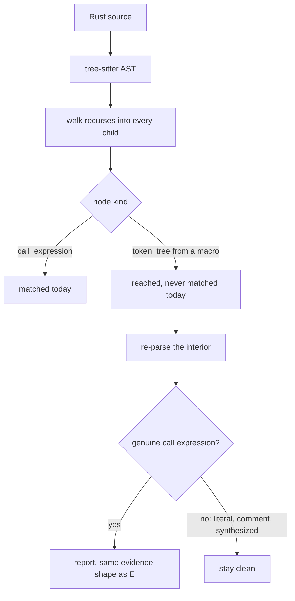
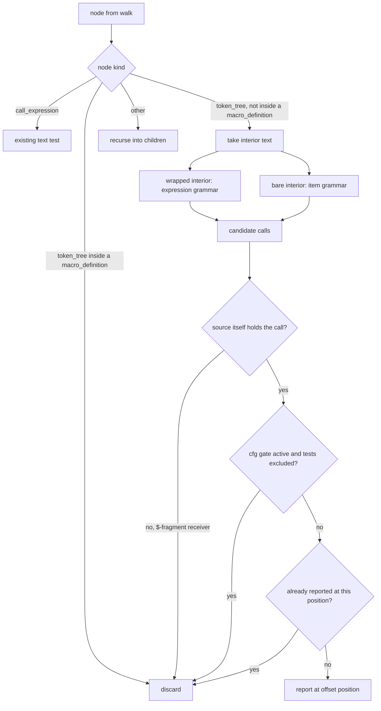

# Code-Unwrap Inside Macro Arguments - Plan

## Goal Capsule

- **Objective:** A Rust CLI audited by `anc` gets the same `.unwrap()` verdict whether the call sits inside a macro or
  outside one, so a passing `code-unwrap` row means the source is actually free of production unwraps.
- **Means:** Re-parse each macro interior and match genuine call expressions in the recovered tree (KTD1), trying both
  the expression and item grammars (KTD2).
- **Product authority:** This plan owns the `code-unwrap` matcher's treatment of macro interiors. It does not own which
  panic-shaped calls the audit covers, the audit's registry wiring, or the other Rust source audits.
- **Execution profile:** Single-crate Rust change inside one audit module and its tests. No migration, no external
  contract, no deployment step.
- **Stop conditions:** Stop and raise if the pinned `ast-grep-core` cannot recover call expressions from a re-parsed
  interior, or if the fabrication guard cannot distinguish a recovered call from a synthesized one. Either invalidates
  the Means rather than the Objective.
- **Who finishes:** `ce-work` implements and verifies; the audit's own negative controls under `cargo test` carry the
  regression forward. The release smoke gate grades binaries in command mode, where source audits never appear, so it
  does not cover this change.
- **Open blockers:** None.

---

## Product Contract

### Summary

`code-unwrap` learns to see inside macro interiors. The existing tree walk already reaches those nodes, so the change is
to what counts as a finding: a macro's interior is re-parsed and genuine call expressions in it are reported, while
string literals, comments, and synthesized matches stay clean.

### Problem Frame

`code-unwrap` is the audit a Rust CLI author reads first, and today it reports a passing row on code that will panic.
Any `.unwrap()` written inside a macro argument is invisible to it, which covers most of the places real CLIs put one:
`write!`, `format!`, `log::info!`, `tracing::error!`. A logging-heavy binary can carry dozens of production unwraps and
still show the row clean.

The cost shape is worse than a wrong answer. A false negative produces no evidence line, so nothing in the output
signals that the audit looked and found nothing versus never looked at all. The gap surfaced only because a release
verification check reported `pass` on a fixture built to fail, and a neighbouring `p7-naked-println` hit on the same
line proved the scan had run at all.

Precision is the constraint that makes this delicate rather than routine. This audit has already shipped the opposite
failure: released 0.5.0 reported 32 `.unwrap()` findings against `xurl-rs`, every one of them a false positive
(`docs/plans/2026-09-18-1756-fix-release-the-code-unwrap-exemption-plan.md:31-34`). Reach bought at the price of noise
would repeat that, and a test in the audit's own suite already pins `.unwrap()` inside a macro's string literal to
`Pass`.

### Key Decisions

- KD1. **Close the coverage gap rather than document it as a boundary.** A `.unwrap()` inside `write!` or `log::info!`
  panics exactly as a bare one does, so a passing row was understating risk. (session-settled: user-directed — chosen
  over declaring macro interiors out of scope, and over measuring the scored corpus before deciding: the gap is
  structurally certain and the common macros are the common case.) Governs R1.
- KD2. **Macro interiors get the same precision guarantee as plain code, not a best-effort approximation.**
  (session-settled: user-directed — chosen over a lexical token scan with a literal filter, a bounded allowlist of
  expression-taking macros, and flagging at reduced confidence: this audit's 32-false-positive release makes noise the
  more expensive failure.) Governs R2, R5.
- KD3. **Item-position macro interiors count, not only expression arguments.** (session-settled: user-directed — chosen
  over covering expression interiors only and deferring item-position macros, and over parsing items only when the
  expression parse recovers nothing: a `Regex::new(..).unwrap()` initializer inside `lazy_static!` is the likeliest real
  miss after `println!`, and leaving it out would mean a passing row still did not carry the Objective's meaning.)
  Governs R6.

### Requirements

**Detection parity**

- R1. A `.unwrap()` call appearing as a genuine call expression inside a macro invocation's arguments is reported
  exactly as one outside a macro is, with the same file, line, column, and snippet evidence.
- R2. An occurrence of the text `.unwrap()` that is not a call expression in the source is not reported, whether or not
  it sits inside a macro. String literals, comments, and matches that exist only in a re-parsed tree are the cases that
  matter.
- R6. A `.unwrap()` call inside an item-position macro interior, such as a `lazy_static!` or `thread_local!` body, is
  reported on the same terms as R1.

**Test-code exemption**

- R3. The `#[cfg(test)]` exemption applies to macro interiors: a call inside a macro inside a `cfg(test)`-gated item is
  exempt by default, on the same terms as a bare call there. This holds for item-position macro invocations as well as
  expression arguments.
- R4. `--include-tests` lifts that exemption for macro interiors on the same terms as it lifts it elsewhere.

**Reporting**

- R5. A finding inside a macro interior carries the same confidence the audit reports for one outside it. Macro position
  does not lower confidence.
- R7. Each call is reported at most once, at the position of the call expression's own start, even when it sits inside
  nested macros.

### Acceptance Examples

- AE1. Macro argument in production code
  - **Covers R1.**
  - **Given:** production source containing `write!(f, "{}", v.unwrap())?;`
  - **When:** the source audit runs with no flags
  - **Then:** `code-unwrap` fails and the evidence names that line and column.
- AE2. The text inside a string literal
  - **Covers R2.**
  - **Given:** source containing `eprintln!("do not call .unwrap() in production");`
  - **When:** the source audit runs
  - **Then:** `code-unwrap` passes, as it does today.
- AE3. Macro argument under the test exemption
  - **Covers R3.**
  - **Given:** a `#[cfg(test)] mod tests` whose test body contains `assert_eq!(v.unwrap(), 1);`
  - **When:** the source audit runs without `--include-tests`
  - **Then:** `code-unwrap` passes.
- AE4. The same source with the exemption lifted
  - **Covers R4.**
  - **Given:** the AE3 source
  - **When:** the source audit runs with `--include-tests`
  - **Then:** `code-unwrap` fails and names that line.
- AE5. A string literal nested in a macro argument, exemption lifted
  - **Covers R2, R4.**
  - **Given:** a `cfg(test)` item containing `assert!(evidence.contains("foo().unwrap()"));`
  - **When:** the source audit runs with `--include-tests`
  - **Then:** that line is not reported, because the occurrence is inside a string literal rather than a call
    expression.
- AE6. Item-position macro initializer
  - **Covers R6.**
  - **Given:** production source containing a `lazy_static!` body whose static is initialized with
    `Regex::new("x").unwrap()`
  - **When:** the source audit runs with no flags
  - **Then:** `code-unwrap` fails and names the initializer's line.
- AE7. A macro interior that only resembles a call
  - **Covers R2.**
  - **Given:** a `macro_rules!` definition whose body contains `$x.unwrap()` as a fragment, and a `match`-style macro
    arm using `=>`
  - **When:** the source audit runs
  - **Then:** neither is reported, because no call expression with that text exists in the source.
- AE8. Multi-line macro invocation
  - **Covers R1, R7.**
  - **Given:** a `write!` invocation spanning four lines whose third line holds `v.unwrap()`
  - **When:** the source audit runs
  - **Then:** one finding is reported, positioned at the call's own line rather than the macro's opening line.
- AE9. Sibling method names
  - **Covers R2.**
  - **Given:** source containing `v.unwrap_or(0)`, `v.unwrap_or_else(f)`, `r.unwrap_err()`, `v.expect("m")`, and a field
    named `unwrap`, each inside a macro argument
  - **When:** the source audit runs
  - **Then:** none of them is reported.

AE5 and AE7 are the examples that separate this change from a lexical one. A token scan that skipped only top-level
string literals would still report AE5, and no token scan distinguishes AE7 at all.

No Key Flows section: the audit is a single-pass verdict over a file with no multi-step or multi-actor behavior, and the
requirements with their acceptance examples fix the paths a planner would otherwise have to invent.

### Success Criteria

- Per R2, auditing this repository's own `src/` tree with `--include-tests` reports none of the `.unwrap()` occurrences
  that sit inside string literals, including those passed as macro arguments. The tree already contains several, such as
  `src/audits/source/rust/unwrap.rs:414` and the ast-grep pattern strings in `src/source.rs`, so it exercises the
  false-positive guard without new fixtures.
- A fixture holding a real `.unwrap()` inside a macro argument is observed failing before the fix and passing the new
  expectation after it, rather than only asserted to.
- A deliberately degraded matcher, one that scans interior text lexically instead of re-parsing, is observed failing the
  string-literal and comment controls. This is what demonstrates that KD2's precision choice is load-bearing rather than
  asserted.

### Scope Boundaries

- `.expect()`, `unwrap_or_else(|_| panic!())`, and other panic-shaped calls stay out.
  `docs/plans/2026-06-03-004-fix-pr77-code-unwrap-cfg-not-test-polarity-plan.md:59-64` scoped those to a separate
  redesign and that holds.
- No shared macro-aware walk for the other Rust source audits. `code-unwrap` is the only one that walks by node kind;
  whether the pattern-based audits carry a comparable blind spot is unmeasured, so building a shared primitive now would
  be speculative.
- The audit's registry wiring stays as it is. `code-unwrap` declares no `covers()` and the vendored spec's P4 text names
  an audit ID `p4-unwrap` that exists nowhere else in the repository. That drift is real and separately plannable.
- No re-scoring of the published corpus. The published scorecards are generated in command mode, which runs behavioral
  audits only, so they carry no `code-unwrap` row at all and nothing in them goes stale.

**Considered and not built**

- Splitting `src/audits/source/rust/unwrap.rs`, which is already past the repository's size-review threshold and grows
  here. Roughly 480 of its 836 lines are its own test module, and splitting it in the same change would obscure the
  matcher diff that needs review. Evidence that would change the call: the production half crossing the threshold on its
  own.
- Matching a spaced `.unwrap ()`. The current text test already excludes it outside macros, so including it inside them
  would make macro interiors stricter than plain code and break the parity the Objective states.
- Reading `.unwrap()` inside attribute arguments and closures passed to attributes, such as a clap `value_parser`. These
  are not macro invocations, so they fall outside this plan's authority; a real call there is already reachable by the
  existing plain-code path.
- A source-mode `code-unwrap` control in the release smoke gate, which today grades binaries in command mode only and
  would need a directory target to see a source audit at all. A regression here is caught by the audit's own controls
  under `cargo test`, which both CI and the pre-push hook run on every change, so the release gate would be a second
  observer of a failure the first one already stops. Evidence that would change the call: a matcher regression reaching
  a release tag past a green test suite.

### Dependencies / Assumptions

- The node shape is verified, not inferred. A scratch crate built against the pinned `=0.42.3` crates confirmed that a
  macro's arguments parse as a `token_tree` of flat tokens with no `call_expression` inside, that a call appears as
  `identifier "." identifier token_tree("()")`, and that string literals and comments are already distinct node kinds.
- `Rust.ast_grep(<interior text>)` is error-tolerant and does recover real `call_expression` nodes from a bare interior.
  A bare interior parses with an ERROR root, so the recovered calls sit under it.
- Positions in a re-parsed tree are relative to the interior, so they need offsetting back to file coordinates.
- Unverified, and load-bearing for R6: that the item grammar recovers the initializer call from a `lazy_static!` or
  `thread_local!` interior. The scratch-crate verification above covered expression arguments only, and the
  item-position case rests on reading the grammar rather than observing a parse. U1 confirms it before the matcher is
  built on it, and the Goal Capsule's stop conditions cover the case where it does not hold.

### Outstanding Questions

**Deferred to Implementation**

- Whether the item-grammar parse needs a fabrication guard distinct from the expression one, or whether the
  real-source-range check in KTD3 covers both.
- Whether de-duplication is cheapest as a position set on the match accumulator or as a guard at the recursion boundary.

### Sources / Research

- `src/audits/source/rust/unwrap.rs:159-161` — the matcher returns early unless `node.kind()` is `call_expression`.
- `src/audits/source/rust/unwrap.rs:99-153` — the walk recurses into every child with no kind filter, so macro token
  trees are already reached, and it threads the `cfg(test)` gate as a parameter.
- `src/audits/source/rust/unwrap.rs:411-420` — `ignores_unwrap_in_strings` asserts `Pass` for `.unwrap()` inside a
  macro's string literal.
- `src/audits/source/rust/naked_println.rs:16` — `p7-naked-println` matches `println!($$$ARGS)`, the invocation rather
  than its arguments, so it does not cover this case.
- `src/cli.rs:201` and `src/main.rs:218` — `--include-tests` wiring, which both lets the walker enter `tests/`
  directories and lifts the `cfg(test)` exemption.
- `src/principles/spec/principles/scoring.md:20-25` — source-layer and project-layer audits are excluded from the public
  score formula.
- `docs/plans/2026-09-18-1756-fix-release-the-code-unwrap-exemption-plan.md:31-34` — the released 0.5.0 run reporting 32
  unwrap findings on `xurl-rs`, all false positives.
- `docs/solutions/best-practices/a-zero-result-is-a-claim-about-the-filter-not-evidence-of-absence.md` — a guard whose
  pattern excludes its own motivating case actively reports success, which is why every macro shape here needs a
  positive control.
- `docs/solutions/best-practices/prove-a-freshly-authored-guards-tests-are-non-vacuous-by-temporarily-degrading-the-guard.md`
  — the degradation method behind the third success criterion.
- `docs/solutions/logic-errors/http-header-token-regex-prefix-sibling-false-match.md` — a load-bearing matcher needs its
  own sibling-shape tests, which is where AE9's method list comes from.
- `docs/solutions/test-failures/stale-release-binary-dogfood-fail-2026-05-07.md` — a stale binary once hid a regression,
  so each red and green observation needs a fresh build.
- `docs/solutions/workflow-issues/anc-pager-substring-false-positive-2026-06-02.md` — a prior anc matcher over-match. It
  records no verified fix, so treat it as precedent for the failure mode rather than as a resolved case.

---

## Planning Contract

**Product Contract preservation:** changed — R6 and R7 added, KD3 added, R2 and R3 widened in wording, AE6 through AE9
added. R6 and KD3 carry the item-position decision made during planning; R7 and AE8 state the single-report and position
convention the Product Contract left open; R2's widening names synthesized matches, and R3's names item-position macros,
both to close gaps the edge-case pass found. No requirement was weakened and nothing was reclassified from product
constraint to implementation preference.

### Key Technical Decisions

- KTD1. **Re-parse the macro interior and match in the recovered tree, rather than widening the text test.** The walk
  already reaches `token_tree` nodes, so the change is local to the matcher. (session-settled: user-directed — chosen
  over a lexical token scan with a literal filter, a bounded allowlist of expression-taking macros, and flagging at
  reduced confidence: the audit's 32-false-positive release makes noise the more expensive failure.) Instantiates KD2;
  governs R2, R5.
- KTD2. **Try the expression grammar and the item grammar, taking whichever recovers calls that map to real source.**
  (session-settled: user-directed — chosen over expression interiors only and over parsing items only as a fallback:
  always attempting both keeps one rule instead of a precedence question, at the cost of a second parse attempt per
  interior.) The two grammars are two inputs to one entry point, not two calls: the pinned crate exposes only
  `LanguageExt::ast_grep`, which always starts at the grammar root, so the item grammar is the bare interior and the
  expression grammar is the interior wrapped in a synthetic function body. `Pattern::contextual` reaches a non-root
  context the same way. The wrapper's byte prefix comes back off every recovered position before KTD3 or KTD5 reads it.
  Instantiates KD3; governs R6.
- KTD3. **A recovered call is a finding only when the source itself holds the call, which takes a structural test rather
  than a range comparison.** This is the fabrication guard. A re-parsed interior is a verbatim slice of the file, so
  every recovered node maps back to a real range by construction, and a range comparison alone admits the cases the
  guard exists to reject; it stays as the offset-sanity assertion it actually is. The discriminator is structural: a
  `token_tree` whose nearest enclosing item is a `macro_definition` is not re-parsed at all, which covers both the
  `$x:expr` fragment and the `=>` arm, and a candidate whose receiver is a `$`-prefixed fragment reference is discarded.
  Calls recovered under an ERROR root, which the motivating case produces, are still admitted. Governs R2.
- KTD4. **Thread the existing `cfg(test)` gate into every re-parse, and treat a gated item-position macro invocation as
  gated.** `macro_invocation` is absent from the audit's item-kind list, so without this a `#[cfg(test)] m! { x.unwrap()
  }` would flip from silent to reported. Governs R3.
- KTD5. **Offset re-parsed positions back to file coordinates and report each call once at its own start.** Governs R7.

A bake-off was considered for KTD3 and did not qualify: the candidate policies were already concrete enough to compare
from the research evidence, which calls for judgment rather than development, and reversing the choice touches one guard
with no data shape or persisted interface behind it.

### High-Level Technical Design

The matcher gains a second path. Directional guidance, not implementation specification.

### Implementation Constraints

- `tests/fixtures/cfg-test-edge-cases/` is pinned by line number in `tests/integration.rs`, so new cases append below
  the existing items or go in a new fixture directory.
- The audit's own `#[cfg(test)]` module is the unit-test home; integration coverage drives a fixture directory.
- Evidence strings follow the existing `SourceLocation` shape, and any user-visible wording follows the register rules
  in `PRODUCT.md`.
- `run()` stays the sole constructor of `AuditResult`, and the `audit_unwrap_with(source, file, include_cfg_test)`
  helper stays the unit-testable core returning `AuditStatus`.

### Sequencing

U1 establishes the matcher and its guard. U2 depends on U1 because the gate has to thread through a re-parse that
exists. U3 depends on both, since it proves their precision. U4 depends on U3 for the fixture shapes it reuses.

---

## Implementation Units

### U1. Re-parse macro interiors and match genuine calls

- **Goal:** `.unwrap()` inside a macro interior is reported with the same evidence shape as one outside, and synthesized
  matches are discarded.
- **Requirements:** R1, R2, R6, R7. Instantiates KD2 and KD3 through KTD1, KTD2, KTD3, KTD5.
- **Dependencies:** None.
- **Files:** `src/audits/source/rust/unwrap.rs`
- **Approach:**
  1. In the matcher, add a `token_tree` branch alongside the existing `call_expression` branch.
  2. Take the interior text, excluding the delimiters, and parse it twice through the one entry point (KTD2): the bare
     interior for the item grammar, and the interior wrapped in a synthetic function body for the expression grammar.
  3. Collect candidate call expressions from both trees, applying the same `.unwrap()` text test the plain path uses.
  4. Keep a candidate only when KTD3's structural test holds: interiors inside a `macro_definition` are never re-parsed,
     a candidate whose receiver is a `$`-prefixed fragment is discarded, and the range comparison serves as the
     offset-sanity assertion rather than the discriminator.
  5. Offset each kept candidate's line and column from interior-relative to file coordinates, subtracting the expression
     wrapper's prefix for candidates recovered from that pass, and record at most one finding per position (KTD5).
- **Execution note:** Begin by confirming three things against scratch interiors, because the rest of the unit rests on
  them: that the pinned parser recovers calls under an ERROR root, that the bare interior recovers the initializer call
  from a `lazy_static!` body, and that the `macro_definition` skip plus the `$`-receiver test reject a `$x:expr`
  fragment where a range comparison does not. The `lazy_static!` case is the one still unobserved, and with a single
  parse entry point there is no alternate grammar to fall back on; if it does not hold, raise it rather than narrowing
  R6 silently.
- **Patterns to follow:** the existing `unwrap_call_snippet` text test and `SourceLocation` construction in the same
  file.
- **Test scenarios:**
  - Covers AE1. `write!(f, "{}", v.unwrap())?;` in production code reports one finding at the call's line and column.
  - Covers AE2. `eprintln!("do not call .unwrap() in production");` reports nothing.
  - Covers AE6. A `lazy_static!` body initializing a static with `Regex::new("x").unwrap()` reports one finding at the
    initializer's line.
  - Covers AE7. A `macro_rules!` body containing `$x.unwrap()` reports nothing, and a macro arm using `=>` reports
    nothing.
  - Covers AE8. A four-line `write!` whose third line holds `v.unwrap()` reports one finding positioned on that third
    line.
  - A nested macro, `write!(f, "{}", format!("{}", v.unwrap()))`, reports exactly one finding.
  - An interior with no call, `println!("plain text")`, reports nothing.
- **Verification:** the new unit tests pass, and the pre-existing `ignores_unwrap_in_strings` and
  `ignores_unwrap_in_comments` still pass unchanged.

### U2. Thread the test-code exemption through re-parsed interiors

- **Goal:** test code stays exempt by default inside macro interiors, including item-position macro invocations, and
  `--include-tests` lifts that exemption on the same terms as elsewhere.
- **Requirements:** R3, R4. Instantiates KTD4.
- **Dependencies:** U1.
- **Files:** `src/audits/source/rust/unwrap.rs`
- **Approach:**
  1. Pass the walk's ambient `inside_cfg_test` and `include_cfg_test` state into the interior match path so a re-parse
     never restarts with the gate cleared.
  2. Treat a `#[cfg(test)]`-preceded macro invocation as gating its interior, which the audit's item-kind list does not
     currently cover.
- **Patterns to follow:** the existing sibling-attribute propagation in `walk`, including its handling of `#[cfg(test)]
  use foo;`.
- **Test scenarios:**
  - Covers AE3. `assert_eq!(v.unwrap(), 1);` inside a `#[cfg(test)] mod tests` reports nothing without the flag.
  - Covers AE4. The same source with `--include-tests` reports one finding.
  - A `#[cfg(test)]`-gated item-position macro invocation containing a call reports nothing without the flag, and one
    finding with it.
  - A `cfg(not(test))`-gated macro interior reports its call without the flag, matching the existing polarity behavior.
- **Verification:** the existing cfg-gate unit tests pass unchanged, and a gated item-position macro no longer reports
  by default.

### U3. Prove the precision choice rather than assert it

- **Goal:** the suite demonstrates both that the fix catches what it was built for and that the cheaper matcher would
  have failed the controls.
- **Requirements:** R2, R5, R7, and the third success criterion.
- **Dependencies:** U1, U2.
- **Files:** `src/audits/source/rust/unwrap.rs`
- **Approach:**
  1. Add the sibling-shape cases as explicit negative tests so the method-name boundary is pinned rather than
     incidental.
  2. Record the degradation observation: with the interior match replaced by a lexical scan of interior text, the
     string-literal and comment controls fail. Capture it as an observation in the unit's verification, not as committed
     code.
- **Execution note:** observe the red first. Revert the matcher to the call-expression-only form and confirm the AE1
  fixture goes unreported before the fix is in place; a green suite against an unexercised matcher is the failure mode
  this unit exists to rule out.
- **Patterns to follow:** the negative-control shape in `scripts/release/smoke.sh`, which pins a no-version fixture that
  must fail `p3-must-version`. The shape is the pattern, not the target: all four of that script's gates run in command
  mode, where source audits never appear, so it carries no `code-unwrap` control and this change does not add one.
- **Test scenarios:**
  - Covers AE9. Each of `v.unwrap_or(0)`, `v.unwrap_or_else(f)`, `r.unwrap_err()`, `v.expect("m")`, and a field named
    `unwrap` inside a macro argument reports nothing.
  - A raw string `r#"call .unwrap() here"#` inside a macro argument reports nothing.
  - A comment inside a macro interior mentioning `.unwrap()` reports nothing.
  - Covers AE5. `assert!(evidence.contains("foo().unwrap()"));` under `--include-tests` reports nothing.
  - R5 holds structurally rather than behaviorally: confidence is a per-`AuditResult` constant set once in `run()`, and
    `SourceLocation` carries no confidence, so no per-finding dimension exists for macro position to lower. Pin that
    with a test asserting the single result's confidence, and treat it as a guard against a second construction site
    rather than as evidence the matcher works.
- **Verification:** every negative control passes, and the degradation observation is recorded in the PR description
  with the failing control named.

### U4. Fixture and integration coverage, and the self-audit check

- **Goal:** the behavior holds end to end through the real CLI, and this repository's own audit result is known rather
  than assumed.
- **Requirements:** R1 through R7, and the first two success criteria.
- **Dependencies:** U3.
- **Files:** `tests/integration.rs`, `tests/fixtures/` (a new fixture directory for macro interiors)
- **Approach:**
  1. Add a fixture directory holding the macro shapes, keeping `cfg-test-edge-cases` untouched because
     `tests/integration.rs` pins it by line number.
  2. Drive the fixture through the real audit with and without `--include-tests`.
  3. Run `anc audit . --source --include-tests` against this repository on a fresh build and record the result as a
     property: no evidence line whose matched text sits inside a string literal or a comment, and nothing from `src/`.
     `anc audit src --source` is not that invocation — a bare `src` directory carries no manifest, so `--source` reports
     no language detected and emits no `code-unwrap` row at all.
- **Execution note:** build fresh before each observation. A stale binary has hidden a regression in this repo before.
- **Patterns to follow:** the existing cfg-gate integration test that drives `tests/fixtures/cfg-test-edge-cases/`.
- **Test scenarios:**
  - The new fixture reports the expected finding count with no flags, and the expected larger count with
    `--include-tests`.
  - The project-mode run with `--include-tests` reports no evidence line from `src/`, where every `.unwrap()` occurrence
    sits inside a string literal or a `cfg(test)` module. The `"$RECV.unwrap()"` pattern strings in `src/source.rs` are
    macro arguments, so they are the case a lexical interior scan would report.
  - Without the flag, the project-mode run stays `pass`, which those `src/` string-literal cases make non-vacuous.
  - The `--include-tests` run reports the real calls in the repository's own test files, which is the flag working
    rather than a regression. No committed assertion pins their count: the run reports 54 across six files today,
    `tests/fixtures/` trees included, and U4's own new fixture moves the number again.
- **Verification:** `cargo test --quiet` passes, and the recorded self-audit matches the stated property rather than a
  finding count.

---

## Verification Contract

| Gate                       | Command                                                 | Applies to     |
| -------------------------- | ------------------------------------------------------- | -------------- |
| Unit and integration tests | `cargo test --quiet`                                    | U1, U2, U3, U4 |
| Lint                       | `cargo clippy --all-targets -- -Dwarnings`              | all units      |
| Format                     | `cargo fmt --check`                                     | all units      |
| Self-audit                 | `anc audit . --source --include-tests` on a fresh build | U4             |

The negative controls matter more than the test count here, and they run under `cargo test` rather than at release time.
`scripts/release/smoke.sh` asserts that a no-version fixture must fail `p3-must-version`, but all four of its gates
grade in command mode, where source audits never appear, so it neither covers this change nor changes with it. This
change's equivalent assertions are that the string-literal and comment controls stay clean and that the macro-interior
fixture fails.

---

## Definition of Done

- Every requirement R1 through R7 is exercised by at least one passing test, and every acceptance example AE1 through
  AE9 is covered by a named scenario.
- The red was observed before the green: the AE1 fixture went unreported against the call-expression-only matcher, on a
  fresh build.
- The degradation observation is recorded: a lexical interior scan fails the string-literal and comment controls.
- `cargo test --quiet`, `cargo clippy --all-targets -- -Dwarnings`, and `cargo fmt --check` all pass.
- The self-audit result for this repository is recorded as a property rather than a count: under `--include-tests` no
  evidence line sits inside a string literal or a comment and none comes from `src/`, and without the flag the run still
  passes.
- No scratch probe, degraded matcher, or abandoned parse attempt remains in the diff. The degradation is an observation
  in the PR description, not committed code.
