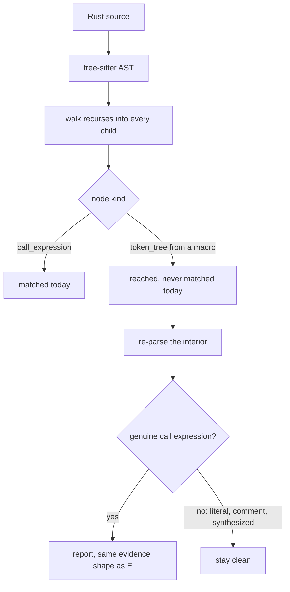
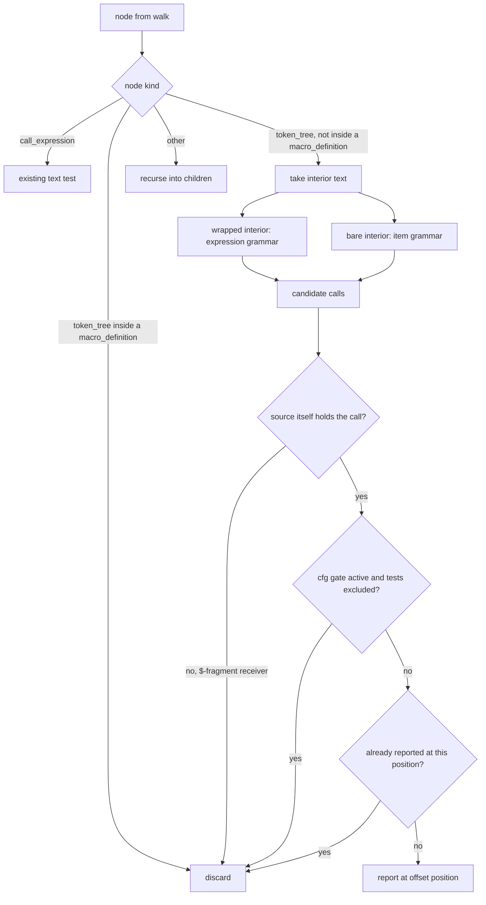

# Code-Unwrap Inside Macro Arguments - Plan

## Goal Capsule

- **Objective:** A Rust CLI audited by `anc` gets the same `.unwrap()` verdict whether the call sits inside a macro or
  outside one, so a passing `code-unwrap` row means the source is actually free of production unwraps.
- **Means:** Re-parse each macro interior and match genuine call expressions in the recovered tree (KTD1), trying both
  the expression and item grammars (KTD2).
- **Product authority:** This plan owns the `code-unwrap` matcher's treatment of macro interiors. It does not own which
  panic-shaped calls the audit covers, the audit's registry wiring, or the other Rust source audits.
- **Execution profile:** Single-crate Rust change across one audit module, one new sibling module for the interior
  re-parse, and their tests. No migration, no external contract, no deployment step.
- **Stop conditions:** Stop and raise if the pinned `ast-grep-core` cannot recover call expressions from a re-parsed
  interior, or if the fabrication guard cannot distinguish a recovered call from a synthesized one. Either invalidates
  the Means rather than the Objective.
- **Who finishes:** `ce-work` implements and verifies; the audit's own negative controls under `cargo test` carry the
  regression forward. The release smoke gate grades binaries in command mode, where source audits never appear, so it
  does not cover this change.
- **Open blockers:** None.

---

## Product Contract

### Summary

`code-unwrap` learns to see inside macro interiors. The existing tree walk already reaches those nodes, so the change is
to what counts as a finding: a macro's interior is re-parsed and genuine call expressions in it are reported, while
string literals, comments, and synthesized matches stay clean.

### Problem Frame

`code-unwrap` is the audit a Rust CLI author reads first, and today it reports a passing row on code that will panic.
Any `.unwrap()` written inside a macro argument is invisible to it, which covers most of the places real CLIs put one:
`write!`, `format!`, `log::info!`, `tracing::error!`. A logging-heavy binary can carry dozens of production unwraps and
still show the row clean.

The cost shape is worse than a wrong answer. A false negative produces no evidence line, so nothing in the output
signals that the audit looked and found nothing versus never looked at all. The gap surfaced only because a release
verification check reported `pass` on a fixture built to fail, and a neighbouring `p7-naked-println` hit on the same
line proved the scan had run at all.

Precision is the constraint that makes this delicate rather than routine. This audit has already shipped the opposite
failure: released 0.5.0 reported 32 `.unwrap()` findings against `xurl-rs`, every one of them a false positive
(`docs/plans/2026-09-18-1756-fix-release-the-code-unwrap-exemption-plan.md:31-34`). Reach bought at the price of noise
would repeat that, and a test in the audit's own suite already pins `.unwrap()` inside a macro's string literal to
`Pass`.



### Key Decisions

- KD1. **Close the coverage gap rather than document it as a boundary.** A `.unwrap()` inside `write!` or `log::info!`
  panics exactly as a bare one does, so a passing row was understating risk. (session-settled: user-directed — chosen
  over declaring macro interiors out of scope, and over measuring the scored corpus before deciding: the gap is
  structurally certain and the common macros are the common case.) Governs R1.
- KD2. **Macro interiors get the same precision guarantee as plain code, not a best-effort approximation.**
  (session-settled: user-directed — chosen over a lexical token scan with a literal filter, a bounded allowlist of
  expression-taking macros, and flagging at reduced confidence: this audit's 32-false-positive release makes noise the
  more expensive failure.) Governs R2, R5.
- KD3. **Item-position macro interiors count, not only expression arguments.** (session-settled: user-directed — chosen
  over covering expression interiors only and deferring item-position macros, and over parsing items only when the
  expression parse recovers nothing: a `Regex::new(..).unwrap()` initializer inside `lazy_static!` is the likeliest real
  miss after `println!`, and leaving it out would mean a passing row still did not carry the Objective's meaning.)
  Governs R6.

### Requirements

**Detection parity**

- R1. A `.unwrap()` call appearing as a genuine call expression inside a macro invocation's arguments is reported
  exactly as one outside a macro is, with the same file, line, column, and snippet evidence.
- R2. An occurrence of the text `.unwrap()` that is not a call expression in the source is not reported, whether or not
  it sits inside a macro. String literals, comments, and matches that exist only in a re-parsed tree are the cases that
  matter.
- R6. A `.unwrap()` call inside an item-position macro interior, such as a `lazy_static!` or `thread_local!` body, is
  reported on the same terms as R1.

**Test-code exemption**

- R3. The `#[cfg(test)]` exemption applies to macro interiors: a call inside a macro inside a `cfg(test)`-gated item is
  exempt by default, on the same terms as a bare call there. This holds for item-position macro invocations as well as
  expression arguments.
- R4. `--include-tests` lifts that exemption for macro interiors on the same terms as it lifts it elsewhere.

**Reporting**

- R5. A finding inside a macro interior carries the same confidence the audit reports for one outside it. Macro position
  does not lower confidence.
- R7. Each call is reported at most once, at the position of the call expression's own start, even when it sits inside
  nested macros.

### Acceptance Examples

- AE1. Macro argument in production code
  - **Covers R1.**
  - **Given:** production source containing `write!(f, "{}", v.unwrap())?;`
  - **When:** the source audit runs with no flags
  - **Then:** `code-unwrap` fails and the evidence names that line and column.
- AE2. The text inside a string literal
  - **Covers R2.**
  - **Given:** source containing `eprintln!("do not call .unwrap() in production");`
  - **When:** the source audit runs
  - **Then:** `code-unwrap` passes, as it does today.
- AE3. Macro argument under the test exemption
  - **Covers R3.**
  - **Given:** a `#[cfg(test)] mod tests` whose test body contains `assert_eq!(v.unwrap(), 1);`
  - **When:** the source audit runs without `--include-tests`
  - **Then:** `code-unwrap` passes.
- AE4. The same source with the exemption lifted
  - **Covers R4.**
  - **Given:** the AE3 source
  - **When:** the source audit runs with `--include-tests`
  - **Then:** `code-unwrap` fails and names that line.
- AE5. A string literal nested in a macro argument, exemption lifted
  - **Covers R2, R4.**
  - **Given:** a `cfg(test)` item containing `assert!(evidence.contains("foo().unwrap()"));`
  - **When:** the source audit runs with `--include-tests`
  - **Then:** that line is not reported, because the occurrence is inside a string literal rather than a call
    expression.
- AE6. Item-position macro initializer
  - **Covers R6.**
  - **Given:** production source containing a `lazy_static!` body whose static is initialized with
    `Regex::new("x").unwrap()`
  - **When:** the source audit runs with no flags
  - **Then:** `code-unwrap` fails and names the initializer's line.
- AE7. A macro interior that only resembles a call
  - **Covers R2.**
  - **Given:** a `macro_rules!` definition whose body contains `$x.unwrap()` as a fragment, and a `match`-style macro
    arm using `=>`
  - **When:** the source audit runs
  - **Then:** neither is reported, because no call expression with that text exists in the source.
- AE8. Multi-line macro invocation
  - **Covers R1, R7.**
  - **Given:** a `write!` invocation spanning four lines whose third line holds `v.unwrap()`
  - **When:** the source audit runs
  - **Then:** one finding is reported, positioned at the call's own line rather than the macro's opening line.
- AE9. Sibling method names
  - **Covers R2.**
  - **Given:** source containing `v.unwrap_or(0)`, `v.unwrap_or_else(f)`, `r.unwrap_err()`, `v.expect("m")`, and a field
    named `unwrap`, each inside a macro argument
  - **When:** the source audit runs
  - **Then:** none of them is reported.

AE5 and AE7 are the examples that separate this change from a lexical one. A token scan that skipped only top-level
string literals would still report AE5, and no token scan distinguishes AE7 at all.

No Key Flows section: the audit is a single-pass verdict over a file with no multi-step or multi-actor behavior, and the
requirements with their acceptance examples fix the paths a planner would otherwise have to invent.

### Success Criteria

- Per R2, auditing this repository's own `src/` tree with `--include-tests` reports none of the `.unwrap()` occurrences
  that sit inside string literals, including those passed as macro arguments. The tree already contains several, such as
  `src/audits/source/rust/unwrap.rs:414` and the ast-grep pattern strings in `src/source.rs`, so it exercises the
  false-positive guard without new fixtures.
- A fixture holding a real `.unwrap()` inside a macro argument is observed failing before the fix and passing the new
  expectation after it, rather than only asserted to.
- A deliberately degraded matcher, one that scans interior text lexically instead of re-parsing, is observed failing the
  string-literal and comment controls. This is what demonstrates that KD2's precision choice is load-bearing rather than
  asserted.

### Scope Boundaries

- `.expect()`, `unwrap_or_else(|_| panic!())`, and other panic-shaped calls stay out.
  `docs/plans/2026-06-03-004-fix-pr77-code-unwrap-cfg-not-test-polarity-plan.md:59-64` scoped those to a separate
  redesign and that holds.
- No shared macro-aware walk for the other Rust source audits. `code-unwrap` is the only one that walks by node kind,
  and the pattern-based audits carry the same blind spot for the same reason: `src/source.rs` matches a `Pattern`
  against AST nodes, and a macro interior is a token tree. Measured rather than assumed — `p4-try-parse` warns on a bare
  `s.parse().unwrap()` and passes on the identical call inside `println!`. One measured case does not justify a shared
  primitive for eighteen audits, so closing that gap is a follow-up TODO, not scope here. The consequence to accept:
  after this change, a macro-wrapped parse call reports the unwrap finding without the checked-parse warning the same
  bare call earns.
- The audit's registry wiring stays as it is. `code-unwrap` declares no `covers()` and the vendored spec's P4 text names
  an audit ID `p4-unwrap` that exists nowhere else in the repository. That drift is real and separately plannable.
- No re-scoring of the published corpus. The published scorecards are generated in command mode, which runs behavioral
  audits only, so they carry no `code-unwrap` row at all and nothing in them goes stale.

**Considered and not built**

- Splitting the existing contents of `src/audits/source/rust/unwrap.rs`. Measured: its production half holds 252
  non-comment lines against 144 for the next largest audit in the directory, so it is the only one past the repository's
  200-line trigger. Moving the walker, the cfg gate and the text test in this change would obscure the matcher diff that
  needs review. The trigger is instead addressed by the new concern landing in its own module (D2), so the file does not
  grow. Evidence that would change the call: the existing contents gaining a second responsibility of their own.
- Matching a spaced `.unwrap ()`. The current text test already excludes it outside macros, so including it inside them
  would make macro interiors stricter than plain code and break the parity the Objective states.
- Reading `.unwrap()` inside attribute arguments and closures passed to attributes, such as a clap `value_parser`. These
  are not macro invocations, so they fall outside this plan's authority; a real call there is already reachable by the
  existing plain-code path.
- A source-mode `code-unwrap` control in the release smoke gate, which today grades binaries in command mode only and
  would need a directory target to see a source audit at all. A regression here is caught by the audit's own controls
  under `cargo test`, which both CI and the pre-push hook run on every change, so the release gate would be a second
  observer of a failure the first one already stops. Evidence that would change the call: a matcher regression reaching
  a release tag past a green test suite.

### Dependencies / Assumptions

- The node shape is verified, not inferred. A scratch crate built against the pinned `=0.42.3` crates confirmed that a
  macro's arguments parse as a `token_tree` of flat tokens with no `call_expression` inside, that a call appears as
  `identifier "." identifier token_tree("()")`, and that string literals and comments are already distinct node kinds.
- `Rust.ast_grep(<interior text>)` is error-tolerant and does recover real `call_expression` nodes from a bare interior.
  A bare interior parses with an ERROR root, so the recovered calls sit under it.
- Positions in a re-parsed tree are relative to the interior, so they need offsetting back to file coordinates.
- Unverified, and load-bearing for R6: that the item grammar recovers the initializer call from a `lazy_static!` or
  `thread_local!` interior. The scratch-crate verification above covered expression arguments only, and the
  item-position case rests on reading the grammar rather than observing a parse. U1 confirms it before the matcher is
  built on it, and the Goal Capsule's stop conditions cover the case where it does not hold.

### Outstanding Questions

**Deferred to Implementation**

- Whether the item-grammar parse needs a fabrication guard distinct from the expression one, or whether the
  real-source-range check in KTD3 covers both.
- Whether de-duplication is cheapest as a position set on the match accumulator or as a guard at the recursion boundary.

### Sources / Research

- `src/audits/source/rust/unwrap.rs:159-161` — the matcher returns early unless `node.kind()` is `call_expression`.
- `src/audits/source/rust/unwrap.rs:99-153` — the walk recurses into every child with no kind filter, so macro token
  trees are already reached, and it threads the `cfg(test)` gate as a parameter.
- `src/audits/source/rust/unwrap.rs:411-420` — `ignores_unwrap_in_strings` asserts `Pass` for `.unwrap()` inside a
  macro's string literal.
- `src/audits/source/rust/naked_println.rs:16` — `p7-naked-println` matches `println!($$$ARGS)`, the invocation rather
  than its arguments, so it does not cover this case.
- `src/cli.rs:201` and `src/main.rs:218` — `--include-tests` wiring, which both lets the walker enter `tests/`
  directories and lifts the `cfg(test)` exemption.
- `src/principles/spec/principles/scoring.md:20-25` — source-layer and project-layer audits are excluded from the public
  score formula.
- `docs/plans/2026-09-18-1756-fix-release-the-code-unwrap-exemption-plan.md:31-34` — the released 0.5.0 run reporting 32
  unwrap findings on `xurl-rs`, all false positives.
- `docs/solutions/best-practices/a-zero-result-is-a-claim-about-the-filter-not-evidence-of-absence.md` — a guard whose
  pattern excludes its own motivating case actively reports success, which is why every macro shape here needs a
  positive control.
- `docs/solutions/best-practices/prove-a-freshly-authored-guards-tests-are-non-vacuous-by-temporarily-degrading-the-guard.md`
  — the degradation method behind the third success criterion.
- `docs/solutions/logic-errors/http-header-token-regex-prefix-sibling-false-match.md` — a load-bearing matcher needs its
  own sibling-shape tests, which is where AE9's method list comes from.
- `docs/solutions/test-failures/stale-release-binary-dogfood-fail-2026-05-07.md` — a stale binary once hid a regression,
  so each red and green observation needs a fresh build.
- `docs/solutions/workflow-issues/anc-pager-substring-false-positive-2026-06-02.md` — a prior anc matcher over-match. It
  records no verified fix, so treat it as precedent for the failure mode rather than as a resolved case.

---

## Planning Contract

**Product Contract preservation:** changed — R6 and R7 added, KD3 added, R2 and R3 widened in wording, AE6 through AE9
added. R6 and KD3 carry the item-position decision made during planning; R7 and AE8 state the single-report and position
convention the Product Contract left open; R2's widening names synthesized matches, and R3's names item-position macros,
both to close gaps the edge-case pass found. No requirement was weakened and nothing was reclassified from product
constraint to implementation preference.

### Key Technical Decisions

- KTD1. **Re-parse the macro interior and match in the recovered tree, rather than widening the text test.** The walk
  already reaches `token_tree` nodes, so the change is local to the matcher. (session-settled: user-directed — chosen
  over a lexical token scan with a literal filter, a bounded allowlist of expression-taking macros, and flagging at
  reduced confidence: the audit's 32-false-positive release makes noise the more expensive failure.) Instantiates KD2;
  governs R2, R5.
- KTD2. **Try the expression grammar and the item grammar, taking whichever recovers calls that map to real source.**
  (session-settled: user-directed — chosen over expression interiors only and over parsing items only as a fallback:
  always attempting both keeps one rule instead of a precedence question, at the cost of a second parse attempt per
  interior.) The two grammars are two inputs to one entry point, not two calls: the pinned crate exposes only
  `LanguageExt::ast_grep`, which always starts at the grammar root, so the item grammar is the bare interior and the
  expression grammar is the interior wrapped in a synthetic function body. `Pattern::contextual` reaches a non-root
  context the same way. The wrapper's prefix comes back off before KTD3 or KTD5 reads a position, and it shifts only the
  first line: a single-line prefix changes the column of nodes on the interior's first line and nothing else.
  Instantiates KD3; governs R6.
- KTD3. **A recovered call is a finding only when the source itself holds the call, which takes a structural test rather
  than a range comparison.** This is the fabrication guard. A re-parsed interior is a verbatim slice of the file, so
  every recovered node maps back to a real range by construction, and a range comparison alone admits the cases the
  guard exists to reject; it stays as the offset-sanity assertion it actually is. The discriminator is structural: a
  `token_tree` whose nearest enclosing item is a `macro_definition` is not re-parsed at all, which covers both the
  `$x:expr` fragment and the `=>` arm, and a candidate whose receiver is a `$`-prefixed fragment reference is discarded.
  Calls recovered under an ERROR root, which the motivating case produces, are still admitted. Governs R2.
- KTD4. **Thread the existing `cfg(test)` gate into every re-parse, and treat a gated item-position macro invocation as
  gated.** `macro_invocation` is absent from the audit's item-kind list, so without this a `#[cfg(test)] m! { x.unwrap()
  }` would flip from silent to reported. Governs R3.
- KTD5. **Offset re-parsed positions back to file coordinates and report each call once at its own start.** Lines and
  columns offset by different rules, which is where this goes wrong quietly: the interior's start line adds to every
  recovered line, while the interior's start column adds only to nodes on the interior's first line and nothing after
  the first newline. R1 demands column parity with a plain call, so a multi-line interior needs both rules exercised,
  not just the line one. Governs R7.

A bake-off was considered for KTD3 and did not qualify: the candidate policies were already concrete enough to compare
from the research evidence, which calls for judgment rather than development, and reversing the choice touches one guard
with no data shape or persisted interface behind it.

### High-Level Technical Design

The matcher gains a second path. Directional guidance, not implementation specification.



### Implementation Constraints

- `tests/fixtures/cfg-test-edge-cases/` is pinned by line number in `tests/integration.rs`, so new cases append below
  the existing items or go in a new fixture directory.
- The audit's own `#[cfg(test)]` module is the unit-test home; integration coverage drives a fixture directory.
- Evidence strings follow the existing `SourceLocation` shape, and any user-visible wording follows the register rules
  in `PRODUCT.md`.
- `run()` stays the sole constructor of `AuditResult`, and the `audit_unwrap_with(source, file, include_cfg_test)`
  helper stays the unit-testable core returning `AuditStatus`.
- The interior re-parse lives in its own module beside the audit (D2), declared in `src/audits/source/rust/mod.rs`
  alongside the audit modules but absent from `all_rust_audits()`, since it is a helper rather than an audit. It returns
  recovered locations, never an `AuditResult` or an `AuditStatus`, so the sole-constructor rule above is unaffected. The
  walker passes its ambient `inside_cfg_test` and `include_cfg_test` state across that boundary, which is what KTD4
  requires.

### Sequencing

U1 establishes the matcher and its guard. U2 depends on U1 because the gate has to thread through a re-parse that
exists. U3 depends on both, since it proves their precision. U4 depends on U3 for the fixture shapes it reuses.

---

## Implementation Units

### U1. Re-parse macro interiors and match genuine calls

- **Goal:** `.unwrap()` inside a macro interior is reported with the same evidence shape as one outside, and synthesized
  matches are discarded.
- **Requirements:** R1, R2, R6, R7. Instantiates KD2 and KD3 through KTD1, KTD2, KTD3, KTD5.
- **Dependencies:** None.
- **Files:** a new interior-re-parse module under `src/audits/source/rust/` (D2), its declaration in
  `src/audits/source/rust/mod.rs`, and `src/audits/source/rust/unwrap.rs`
- **Approach:**
  1. In the matcher, add a `token_tree` branch alongside the existing `call_expression` branch. The branch hands the
     interior and the ambient cfg-gate state to the new module and takes back recovered locations.
  2. In that module, take the interior text, excluding the delimiters, and return immediately unless it contains
     `.unwrap()` (D3). The gate is verdict-preserving rather than a heuristic: the matcher only reports a call whose
     text ends with that substring, and a reported call's text is always a substring of the interior. It mirrors the
     suffix test the plain path already runs first, and keeps the cost proportional to real unwraps instead of to how
     many macros the audited project contains.
  3. Parse the surviving text twice through the one entry point (KTD2): the bare interior for the item grammar, and the
     interior wrapped in a synthetic function body for the expression grammar.
  4. Collect candidate call expressions from both trees, applying the same `.unwrap()` text test the plain path uses.
  5. Keep a candidate only when KTD3's structural test holds: interiors inside a `macro_definition` are never re-parsed,
     a candidate whose receiver is a `$`-prefixed fragment is discarded, and the range comparison serves as the
     offset-sanity assertion rather than the discriminator.
  6. Offset each kept candidate's line and column from interior-relative to file coordinates, subtracting the expression
     wrapper's prefix for candidates recovered from that pass, and record at most one finding per position (KTD5).
- **Execution note:** Begin by confirming three things against scratch interiors, because the rest of the unit rests on
  them: that the pinned parser recovers calls under an ERROR root, that the bare interior recovers the initializer call
  from a `lazy_static!` body, and that the `macro_definition` skip plus the `$`-receiver test reject a `$x:expr`
  fragment where a range comparison does not. The `lazy_static!` case is the one still unobserved, and with a single
  parse entry point there is no alternate grammar to fall back on; if it does not hold, raise it rather than narrowing
  R6 silently.
- **Patterns to follow:** the existing `unwrap_call_snippet` text test and `SourceLocation` construction in the same
  file.
- **Test scenarios:**
  - Covers AE1. `write!(f, "{}", v.unwrap())?;` in production code reports one finding at the call's line and column.
  - Covers AE2. `eprintln!("do not call .unwrap() in production");` reports nothing.
  - Covers AE6. A `lazy_static!` body initializing a static with `Regex::new("x").unwrap()` reports one finding at the
    initializer's line.
  - Covers AE7. A `macro_rules!` body containing `$x.unwrap()` reports nothing, and a macro arm using `=>` reports
    nothing.
  - Covers AE8, and R1's column half. A four-line `write!` whose third line holds `v.unwrap()` reports one finding at
    that line **and** at the call's own column, matching what the same call reports outside a macro. A second case puts
    the call on the interior's first line, where the wrapper prefix does shift the column. Asserting the line alone
    would pass with the column rule inverted.
  - A nested macro, `write!(f, "{}", format!("{}", v.unwrap()))`, reports exactly one finding.
  - An interior with no call, `println!("plain text")`, reports nothing.
  - The D3 gate is not doing the filtering the matcher owes: an interior whose only `.unwrap()` sits in a string literal
    passes the gate, reaches the matcher, and is rejected there. Pin it so a later change to the gate cannot silently
    become the thing that makes AE2 pass.
- **Verification:** the new unit tests pass, and the pre-existing `ignores_unwrap_in_strings` and
  `ignores_unwrap_in_comments` still pass unchanged.

### U2. Thread the test-code exemption through re-parsed interiors

- **Goal:** test code stays exempt by default inside macro interiors, including item-position macro invocations, and
  `--include-tests` lifts that exemption on the same terms as elsewhere.
- **Requirements:** R3, R4. Instantiates KTD4.
- **Dependencies:** U1.
- **Files:** `src/audits/source/rust/unwrap.rs`
- **Approach:**
  1. Pass the walk's ambient `inside_cfg_test` and `include_cfg_test` state into the interior match path so a re-parse
     never restarts with the gate cleared.
  2. Treat a `#[cfg(test)]`-preceded macro invocation as gating its interior, which the audit's item-kind list does not
     currently cover.
- **Patterns to follow:** the existing sibling-attribute propagation in `walk`, including its handling of `#[cfg(test)]
  use foo;`.
- **Test scenarios:**
  - Covers AE3. `assert_eq!(v.unwrap(), 1);` inside a `#[cfg(test)] mod tests` reports nothing without the flag.
  - Covers AE4. The same source with `--include-tests` reports one finding.
  - A `#[cfg(test)]`-gated item-position macro invocation containing a call reports nothing without the flag, and one
    finding with it.
  - A `cfg(not(test))`-gated macro interior reports its call without the flag, matching the existing polarity behavior.
- **Verification:** the existing cfg-gate unit tests pass unchanged, and a gated item-position macro no longer reports
  by default.

### U3. Prove the precision choice rather than assert it

- **Goal:** the suite demonstrates both that the fix catches what it was built for and that the cheaper matcher would
  have failed the controls.
- **Requirements:** R2, R5, R7, and the third success criterion.
- **Dependencies:** U1, U2.
- **Files:** `src/audits/source/rust/unwrap.rs`
- **Approach:**
  1. Add the sibling-shape cases as explicit negative tests so the method-name boundary is pinned rather than
     incidental.
  2. Record the degradation observation: with the interior match replaced by a lexical scan of interior text, the
     string-literal and comment controls fail. Capture it as an observation in the unit's verification, not as committed
     code.
- **Execution note:** observe the red first. Revert the matcher to the call-expression-only form and confirm the AE1
  fixture goes unreported before the fix is in place; a green suite against an unexercised matcher is the failure mode
  this unit exists to rule out.
- **Patterns to follow:** the negative-control shape in `scripts/release/smoke.sh`, which pins a no-version fixture that
  must fail `p3-must-version`. The shape is the pattern, not the target: all four of that script's gates run in command
  mode, where source audits never appear, so it carries no `code-unwrap` control and this change does not add one.
- **Test scenarios:**
  - Covers AE9. Each of `v.unwrap_or(0)`, `v.unwrap_or_else(f)`, `r.unwrap_err()`, `v.expect("m")`, and a field named
    `unwrap` inside a macro argument reports nothing.
  - A raw string `r#"call .unwrap() here"#` inside a macro argument reports nothing.
  - A comment inside a macro interior mentioning `.unwrap()` reports nothing.
  - Covers AE5. `assert!(evidence.contains("foo().unwrap()"));` under `--include-tests` reports nothing.
  - R5 holds structurally rather than behaviorally: confidence is a per-`AuditResult` constant set once in `run()`, and
    `SourceLocation` carries no confidence, so no per-finding dimension exists for macro position to lower. Pin that
    with a test asserting the single result's confidence, and treat it as a guard against a second construction site
    rather than as evidence the matcher works.
- **Verification:** every negative control passes, and the degradation observation is recorded in the PR description
  with the failing control named.

### U4. Fixture and integration coverage, and the self-audit check

- **Goal:** the behavior holds end to end through the real CLI, and this repository's own audit result is known rather
  than assumed.
- **Requirements:** R1 through R7, and the first two success criteria.
- **Dependencies:** U3.
- **Files:** `tests/integration.rs`, `tests/fixtures/` (a new fixture directory for macro interiors)
- **Approach:**
  1. Add a fixture directory holding the macro shapes, keeping `cfg-test-edge-cases` untouched because
     `tests/integration.rs` pins it by line number.
  2. Drive the fixture through the real audit with and without `--include-tests`.
  3. Run `anc audit . --source --include-tests` against this repository on a fresh build and record the result as a
     property: no evidence line whose matched text sits inside a string literal or a comment, and nothing from `src/`.
     `anc audit src --source` is not that invocation — a bare `src` directory carries no manifest, so `--source` reports
     no language detected and emits no `code-unwrap` row at all.
- **Execution note:** build fresh before each observation. A stale binary has hidden a regression in this repo before.
- **Patterns to follow:** the existing cfg-gate integration test that drives `tests/fixtures/cfg-test-edge-cases/`.
- **Test scenarios:**
  - The new fixture reports the expected finding count with no flags, and the expected larger count with
    `--include-tests`.
  - The project-mode run with `--include-tests` reports no evidence line from `src/`, where every `.unwrap()` occurrence
    sits inside a string literal or a `cfg(test)` module. The `"$RECV.unwrap()"` pattern strings in `src/source.rs` are
    macro arguments, so they are the case a lexical interior scan would report.
  - Without the flag, the project-mode run stays `pass`, which those `src/` string-literal cases make non-vacuous.
  - The `--include-tests` run reports the real calls in the repository's own test files, which is the flag working
    rather than a regression. No committed assertion pins their count: the run reports 54 across six files today,
    `tests/fixtures/` trees included, and U4's own new fixture moves the number again.
- **Verification:** `cargo test --quiet` passes, and the recorded self-audit matches the stated property rather than a
  finding count.

---

## Verification Contract

| Gate                       | Command                                                 | Applies to     |
| -------------------------- | ------------------------------------------------------- | -------------- |
| Unit and integration tests | `cargo test --quiet`                                    | U1, U2, U3, U4 |
| Lint                       | `cargo clippy --all-targets -- -Dwarnings`              | all units      |
| Format                     | `cargo fmt --check`                                     | all units      |
| Self-audit                 | `anc audit . --source --include-tests` on a fresh build | U4             |

The negative controls matter more than the test count here, and they run under `cargo test` rather than at release time.
`scripts/release/smoke.sh` asserts that a no-version fixture must fail `p3-must-version`, but all four of its gates
grade in command mode, where source audits never appear, so it neither covers this change nor changes with it. This
change's equivalent assertions are that the string-literal and comment controls stay clean and that the macro-interior
fixture fails.

One caveat on the self-audit gate, inherited rather than introduced here: `main.rs` resolves a target binary before it
checks whether the run is source-only, so `anc audit . --source` depends on binary selection succeeding even though no
source audit spawns a binary. It resolves today because this repository declares one bin. If a second bin ever lands,
the gate stops with `binary-ambiguous` and exit 2, and the fix is to pass `--bin anc` rather than to doubt the audit.

---

## Definition of Done

- Every requirement R1 through R7 is exercised by at least one passing test, and every acceptance example AE1 through
  AE9 is covered by a named scenario.
- The red was observed before the green: the AE1 fixture went unreported against the call-expression-only matcher, on a
  fresh build.
- The degradation observation is recorded: a lexical interior scan fails the string-literal and comment controls.
- `cargo test --quiet`, `cargo clippy --all-targets -- -Dwarnings`, and `cargo fmt --check` all pass.
- The self-audit result for this repository is recorded as a property rather than a count: under `--include-tests` no
  evidence line sits inside a string literal or a comment and none comes from `src/`, and without the flag the run still
  passes.
- No scratch probe, degraded matcher, or abandoned parse attempt remains in the diff. The degradation is an observation
  in the PR description, not committed code.

---

## Engineering review

Target: this plan file, `docs/plans/2026-10-05-1657-fix-code-unwrap-macro-arguments-plan.md`. Reviewed on 2026-10-05
against commit `3e4f665`. The plan itself was committed mid-review as `ab580e4`, and another session landed `3e4f665` on
`dev` while this review ran; its re-vendor of the release scripts left `smoke.sh` and `preflight.sh`'s delegation to it
intact, which the Verification Contract note below depends on.

### Scope Challenge

Complexity count: 2 existing files proposed for change (`src/audits/source/rust/unwrap.rs`, `tests/integration.rs`) plus
one new fixture directory; zero new classes or services. Under the 8-file and 2-class gate, so the complexity selectors
did not run.

Bounded probe of current behavior, through the committed `anc` binary against two scratch fixtures holding the same two
calls, bare and wrapped in `println!`:

| Fixture                              | `code-unwrap`          | `p4-try-parse`    |
| ------------------------------------ | ---------------------- | ----------------- |
| `s.parse().unwrap()` bare            | fail, 2 evidence lines | warn, 1 line      |
| the same calls inside `println!(..)` | pass, no evidence      | pass, no evidence |

Findings:

1. [P2] (confidence: 10/10) Scope Boundaries, "No shared macro-aware walk for the other Rust source audits" — the
   deferral rests on "whether the pattern-based audits carry a comparable blind spot is unmeasured". The probe above
   measures it: `p4-try-parse` matches `$RECV.parse().unwrap()` through `src/source.rs`'s `Pattern` path and is blind to
   the macro-wrapped call for the same reason the walker is. The deferral may still be right; its stated justification
   is false.
2. [P1] (confidence: 10/10) "Considered and not built", splitting `src/audits/source/rust/unwrap.rs` — the entry defers
   the split and names "the production half crossing the threshold on its own" as the evidence that would change the
   call. Measured now: lines 1-347 hold 251 non-comment, non-blank lines, already past the repository's 200-line
   refactor trigger, before this change adds a second matcher path. The deferral's own trigger is met.

## Decision ledger

### R1: whether the fix extends to the shared pattern-matcher path

Finding: Scope Challenge finding 1, P2, confidence 10/10, `src/source.rs:84` and
`src/audits/source/rust/try_parse.rs:14`, reviewer plan-eng-review. Plan baseline: original proposal — Scope Boundaries
defers a shared macro-aware walk, justified by the blind spot in the other audits being unmeasured. Runtime evidence:
bounded probe through the committed binary; `p4-try-parse` warns on a bare `s.parse().unwrap()` and passes on the
identical call inside `println!`. The shared helper builds a `Pattern` and matches AST nodes, so a `token_tree` interior
never matches.

Comparison grid:

| Choice                              | Current                                              | A                                                                      | B                                                            | C                                                          |
| ----------------------------------- | ---------------------------------------------------- | ---------------------------------------------------------------------- | ------------------------------------------------------------ | ---------------------------------------------------------- |
| R1 matcher reach                    | walker only, pattern path deferred as unmeasured     | walker plus the shared pattern path                                    | walker only, deferral kept with the measured reason recorded | walker only, deferral kept with the unmeasured claim as-is |
| Files in scope                      | `unwrap.rs`, `tests/integration.rs`, new fixture dir | adds `src/source.rs` and every pattern-based Rust audit's expectations | unchanged                                                    | unchanged                                                  |
| R2 file split (finding 2)           | pending                                              | pending                                                                | pending                                                      | pending                                                    |
| R3 interior prefilter (Performance) | pending                                              | pending                                                                | pending                                                      | pending                                                    |

Question D1:

D1 — Does the fix reach the shared pattern matcher, or stay on the walker? Project/branch/task: agentnative-cli on
`dev`, planning the `code-unwrap` macro-interior fix. ELI10: anc has two kinds of Rust source audit. `code-unwrap` walks
the syntax tree node by node; the other eighteen match a pattern against that tree through one shared helper. I ran both
against the same code and both are blind to macro arguments, for the same reason. This plan fixes only the walker, so
after it ships `println!("{}", s.parse().unwrap())` will report "you called unwrap" but stay silent on "use a checked
parse", while the identical line outside a macro reports both. Stakes if we pick wrong: Fixing only the walker leaves a
user who follows anc's own advice with half the guidance on one line. Fixing the shared path now means designing a
macro-aware primitive for eighteen audits on a single measured case, in the file every language's audits route through.
Recommendation: B because one measured case does not justify a shared primitive, and the real defect in the plan is a
scope boundary justified by a claim that is false. Completeness: A=10/10, B=7/10, C=3/10 Pros / cons: A) Extend to the
shared matcher (human: ~2 days / CC: ~45 min) ✅ Every pattern-based Rust audit becomes macro-aware at once, so no two
audits ever disagree about the same source line ✅ Removes the whole blind-spot class in one change rather than leaving a
second instance to be rediscovered later ❌ Designs a shared primitive for eighteen audits from one measured case, and
pulls `src/source.rs` into a diff whose precision is the thing that needs review B) Keep scope, record the measured
asymmetry (recommended) (human: ~15 min / CC: ~2 min) ✅ Keeps the change in one audit and one file, which is the diff
that actually needs careful review here ✅ Replaces a false "unmeasured" line with the probe result, so the next person
starts from evidence instead of re-deriving it ❌ Leaves `p4-try-parse` silent on macro-wrapped parse calls until
somebody picks the follow-up up C) Keep scope, leave the plan's wording alone (human: none / CC: none) ✅ No further edit
to a plan that is already committed and pushed ✅ Keeps the committed plan byte-identical, so this review needs no second
commit ❌ Leaves a scope boundary resting on a claim I measured to be false, which is exactly the stale rationale that
gets trusted a year later Net: fix one audit well and write down what the probe taught us, versus building a shared
abstraction on one data point.

Header: Matcher reach Options: A) Extend to shared matcher Add interior re-parsing behind `src/source.rs`'s pattern
helpers so every pattern-based Rust audit sees macro interiors. Grows scope from one audit to the shared path and every
pattern audit's expectations. B) Keep scope, record measurement Leave the deferral in place and replace "is unmeasured"
in Scope Boundaries with the probe result naming `p4-try-parse`, plus a TODO for the follow-up. No change to the
implementation units. C) Keep scope, no plan edit Leave the deferral and its current wording untouched. Nothing in the
plan changes.

State: approved

Actual answer: B) Keep scope, record measurement — answered at D1, 2026-10-05.

Accepted scope: Scope Boundaries' shared-walk entry replaced — the blind spot is recorded as measured, naming
`p4-try-parse` and the `Pattern`-against-AST mechanism, with the cross-audit asymmetry named as an accepted consequence
and the shared fix left as a follow-up TODO. No change to R1-R7, to the implementation units, or to the Verification
Contract.

History: —

### R2: where the interior re-parse concern lives

Finding: Scope Challenge finding 2, P1, confidence 10/10, `src/audits/source/rust/unwrap.rs:1-347`, reviewer
plan-eng-review. Plan baseline: original proposal — "Considered and not built" defers splitting the file, naming "the
production half crossing the threshold on its own" as the evidence that would change the call. Runtime evidence:
measured per audit in `src/audits/source/rust/`, non-comment non-blank lines before the test module: `unwrap.rs` 252,
`env_flags.rs` 144, `headless_auth.rs` 138, `global_flags.rs` 115. `unwrap.rs` is the only file in the directory past
the repository's 200-line trigger and is 1.75x the next largest. This change adds a second matcher path to it.

Comparison grid:

| Choice                                      | Current                                 | A                                                              | B                              | C                                             |
| ------------------------------------------- | --------------------------------------- | -------------------------------------------------------------- | ------------------------------ | --------------------------------------------- |
| R2 home of the interior re-parse            | unspecified, assumed inside `unwrap.rs` | sibling module; `unwrap.rs` keeps the walker and calls into it | inside `unwrap.rs`             | inside `unwrap.rs`, after a separate split PR |
| `unwrap.rs` production LOC after the change | 252 today                               | ~260                                                           | ~330                           | ~180 plus a new module                        |
| Refactor trigger                            | met and unaddressed                     | addressed by the new concern landing outside the file          | unaddressed, wording corrected | addressed before this change starts           |
| R1 matcher reach                            | approved at D1, walker only             | unchanged                                                      | unchanged                      | unchanged                                     |
| R3 interior prefilter                       | pending                                 | pending                                                        | pending                        | pending                                       |

Question D2:

D2 — Where does the interior re-parse live? Project/branch/task: agentnative-cli on `dev`, planning the code-unwrap
macro-interior fix. ELI10: The file this change edits is already the biggest audit in its directory, 252 lines of real
code against 144 for the runner-up, and it is the only one past the repository's own 200-line refactor trigger. This
change adds a second way of matching: re-parse a macro's interior, try two grammars, prove the recovered call is really
in the source, then translate positions back. That is a different job from walking the file's own tree, and it needs
somewhere to live. Stakes if we pick wrong: Put it in the same file and the directory's outlier grows by another third,
with two matching strategies interleaved in one place. Split the whole file first and this change waits on a separate
refactor PR and its CI cycle. Recommendation: A because the new concern is a real seam rather than an arbitrary cut, it
satisfies the refactor trigger without a separate PR, and a new file is the most reviewable shape for the
precision-critical code. Completeness: A=10/10, B=5/10, C=8/10 Pros / cons: A) New concern in its own module
(recommended) (human: ~1h / CC: ~10 min) ✅ The precision-critical code lands as a new file, which is the easiest
possible diff to review line by line ✅ Satisfies the repository's refactor trigger without a separate PR, and leaves the
existing walker and cfg-gate code untouched ❌ Introduces a module boundary mid-change, so the walker has to pass its
cfg-gate state across it B) Keep it all in `unwrap.rs` (human: none / CC: ~2 min) ✅ Zero structural change, so the diff
is purely the new behavior and nothing moves ✅ Keeps the walker, its cfg-gate state and the new matcher adjacent, with
no new seam to design ❌ Grows the directory's only over-threshold file by about a third, interleaving two matching
strategies in one place C) Split the whole file in a separate PR first (human: ~3h / CC: ~20 min) ✅ Refactor and
behavior change stay in separate commits, which is the cleanest possible history ✅ This change then lands on a file
already under the threshold, with the split reviewed on its own merits ❌ Costs a full PR and CI cycle before any of this
work starts, to move code no user-visible behavior depends on Net: give the new matching strategy its own file now, keep
everything in the outlier, or pay a PR cycle to tidy first.

Header: Re-parse home Options: A) Own module The interior re-parse, both grammars, the fabrication guard and the
position offsetting go in a sibling module under `src/audits/source/rust/`. `unwrap.rs` keeps the walker, the cfg gate
and the text test, and calls into the new module at the `token_tree` branch. B) Keep in unwrap.rs Everything lands in
`src/audits/source/rust/unwrap.rs` as the plan assumes today. Correct the stale "Considered and not built" trigger
wording so it states the measured 252 lines and rests on SRP rather than on a threshold already crossed. C) Split first,
separate PR Land a mechanical split of `unwrap.rs` as its own PR with no behavior change, then build this change on the
smaller file.

State: approved

Actual answer: A) Own module — answered at D2, 2026-10-05.

Accepted scope: the interior re-parse, both grammars, the fabrication guard and the position offsetting land in a new
module beside the audit, declared in `src/audits/source/rust/mod.rs` and absent from `all_rust_audits()`. `unwrap.rs`
keeps the walker, the cfg gate and the text test, and passes its ambient cfg-gate state across the boundary. U1's Files,
the Goal Capsule execution profile, Implementation Constraints and the "Considered and not built" splitting entry are
amended to match. No change to R1-R7, the KTDs, or the Verification Contract.

History: —

### R3: whether the interior re-parse is gated by a cheap text test

Finding: Performance review finding 1, P2, confidence 9/10, `ast-grep-core-0.42.3/src/tree_sitter/mod.rs:31-42` and this
plan's U1 step 2, reviewer plan-eng-review. Plan baseline: original proposal — U1 parses every `token_tree` interior
twice, once per grammar, with no gate in front of it. Runtime evidence: `src/` holds 2194 macro invocations across 112
files; 16 of them carry `.unwrap()` on the same line. `parse_lang` in the pinned crate constructs a fresh `Parser` and
installs the Rust grammar on every call, so each interior costs two parser constructions, not two incremental parses.
Measured baseline for the gate this plan adds: `anc audit . --source --include-tests` takes 15.02 s wall and 20.7 MB
peak RSS on this repository today.

Comparison grid:

| Choice                           | Current                           | A                                                       | B                                               | C         |
| -------------------------------- | --------------------------------- | ------------------------------------------------------- | ----------------------------------------------- | --------- |
| R3 re-parse gate                 | none; every interior parsed twice | re-parse only interiors whose text contains `.unwrap()` | none, with a measurement committed before merge | none      |
| Parser constructions over `src/` | 4388                              | 32                                                      | 4388                                            | 4388      |
| Verification Contract            | 4 gates                           | unchanged                                               | gains a timing comparison                       | unchanged |
| R1 matcher reach                 | approved at D1, walker only       | unchanged                                               | unchanged                                       | unchanged |
| R2 re-parse home                 | approved at D2, own module        | unchanged                                               | unchanged                                       | unchanged |

Question D3:

D3 — Does a cheap text test gate the re-parse? Project/branch/task: agentnative-cli on `dev`, planning the code-unwrap
macro-interior fix. ELI10: The fix re-parses the inside of every macro call, twice, once per grammar. The library it
uses builds a brand-new parser and reinstalls the Rust grammar on every one of those calls, so this is not a cheap
incremental re-parse. In this repository's own `src/` that is 2194 macro calls and about 4400 parser constructions, to
find the 16 lines that could possibly contain an unwrap. The audit already takes 15 seconds here. Stakes if we pick
wrong: Skip the gate and every audited project pays parser construction proportional to how many macros it contains, for
a matcher that can only ever fire on interiors containing one specific substring. Add the gate and there is one more
condition in front of the matcher to get right. Recommendation: A because the gate is exact rather than a heuristic: the
matcher only reports calls whose text ends in `.unwrap()`, and that text is necessarily a substring of the interior, so
gating on the substring cannot change a single verdict. It also mirrors the cheap suffix test the existing matcher
already runs first. Completeness: A=10/10, B=8/10, C=5/10 Pros / cons: A) Gate on the interior text (recommended)
(human: ~10 min / CC: ~2 min) ✅ Collapses about 4400 parser constructions to 32 on this repository, and scales with real
unwraps rather than with macro density ✅ Cannot change a verdict, because the matcher's own test is a suffix test on
text the interior must already contain ❌ One more condition in front of the matcher, which has to be kept in step with
the text test it mirrors B) No gate, commit to measuring before merge (human: ~1h / CC: ~10 min) ✅ Keeps the matcher as
simple as the plan currently describes, with one path and no precondition ✅ Produces a real number for the cost instead
of a predicted one, on a repository where the baseline is known ❌ Spends a measurement cycle to answer a question the
grammar already answers, and ships the cost if the number looks tolerable on one repo C) No gate, no measurement (human:
none / CC: none) ✅ Smallest possible diff, with nothing added in front of the matcher ✅ Leaves the plan's U1 approach
exactly as written and already reviewed ❌ Makes audit time scale with macro density on every project anc grades, with no
number to say what that costs Net: one exact precondition that removes 99 percent of the work, versus keeping the
matcher simple and paying or measuring the cost.

Header: Re-parse gate Options: A) Gate on interior text Re-parse an interior only when its raw text contains
`.unwrap()`. Mirrors the existing `unwrap_call_snippet` suffix test, and is verdict-preserving because a reported call's
text is always a substring of the interior. B) No gate, measure first Leave U1 as written and add a timing comparison to
the Verification Contract: the self-audit's wall time before and after, on this repository, recorded in the PR. C) No
gate Leave U1's approach exactly as written. No prefilter, no timing gate.

State: approved

Actual answer: A) Gate on interior text — answered at D3, 2026-10-05.

Accepted scope: U1's approach gains a verdict-preserving precondition — an interior is re-parsed only when its raw text
contains `.unwrap()` — plus a scenario pinning that the gate is not what rejects string-literal matches. No change to
R1-R7, the KTDs, the Verification Contract, or the Definition of Done.

History: —

Approval readiness: PASS. R1 cites D1, R2 cites D2, R3 cites D3, each with its own answer. The folded corrections carry
no separate approval because each is required proof of behavior R1 already contracts (column parity with a plain call)
or a factual annotation that changes no behavior (the self-audit binary-selection caveat).

### 1. Architecture review

1. [P3] (confidence: 9/10) Verification Contract, self-audit row — `main.rs` resolves a target binary before it checks
   `source_only`, so `anc audit . --source` depends on binary selection succeeding even though no source audit spawns a
   binary. It resolves today because this repository declares one bin. Prior learning applied:
   `anc-source-only-still-selects-binary` (confidence 9/10, from 2026-10-01). Pre-existing, but this plan newly depends
   on it for U4's gate.

Boundaries and data flow: the change adds one inward edge, walker to interior module, and no new outward dependency.
`Project::parsed_files` and the `AuditResult` construction site are untouched, so the scorecard shape and the
`run()`-is-sole-constructor rule hold. No new failure point reaches the CLI surface beyond the audit's own verdict.

Dispositions: finding 1 accepted, folded as a factual annotation under the Verification Contract.

### 2. Code quality review

1. [P2] (confidence: 8/10) KTD5 and U1's offsetting step — lines and columns offset by different rules, and the plan
   stated one. The interior's start line adds to every recovered line, while its start column adds only to nodes on the
   interior's first line; the expression wrapper's prefix shifts the first line only as well. R1 demands column parity
   with a plain call, so the inverted rule produces evidence pointing at the wrong character on exactly the multi-line
   macros this change exists to catch.

Shared-code rubric: no extraction qualifies. The interior re-parse has one caller after D2 (`unwrap.rs`), and the rubric
requires two verified first-party callers. `src/source.rs` remains the home for cross-language pattern helpers per the
repository's own convention, and D1 settled that it does not gain interior awareness here.

Dispositions: finding 1 accepted, folded into KTD5, KTD2 and U1's AE8 scenario as required proof of R1.

### 3. Test review

Framework: Rust, `cargo test` (`CLAUDE.md` names it; `Cargo.toml` present, no separate runner config). Unit home is the
audit's own `#[cfg(test)]` module; integration coverage runs through `tests/integration.rs` against `tests/fixtures/`.

Regression surface, checked rather than assumed. Two existing assertions could have flipped and do not:
`tests/integration.rs:483` pins the `cfg-test-edge-cases` fixture to exactly two evidence lines, and `:438` pins
`perfect-rust` to zero errors. No fixture under `tests/fixtures/` and no unit-test source string in `unwrap.rs` contains
a `.unwrap()` inside a macro interior, so neither count moves. The eleven `assert!(evidence.contains("foo().unwrap()"))`
lines in the audit's own test module are harness assertions, not source under audit; they are string literals and must
stay unreported, which is Success Criterion 1.

```text
CODE PATHS                                               USER FLOWS
[+] new interior module (U1)                             [+] Auditing a macro-heavy Rust CLI
  ├── text gate (D3)                                       ├── [GAP] --source reports the macro line
  │   ├── [GAP] contains .unwrap() -> re-parse             ├── [GAP] --include-tests adds test-code calls
  │   ├── [GAP] absent -> return early                     └── [GAP] [->E2E] unwrap reported, parse guidance
  │   └── [GAP] literal-only interior still reaches                      silent (D1-accepted asymmetry)
  │             the matcher and is rejected there        [+] Auditing this repository
  ├── item grammar (bare interior)                         ├── [GAP] property assertion, no count (U4)
  │   ├── [GAP] recovers lazy_static initializer           └── [★★ TESTED] cfg fixture end to end
  │   └── [GAP] recovers nothing                                           integration.rs:442
  ├── expression grammar (wrapped interior)              [+] Error states the user sees
  │   └── [GAP] recovers call under ERROR root             ├── [GAP] false positive on a line with no
  ├── fabrication guard (KTD3)                             │          unwrap -> AE7 controls
  │   ├── [GAP] macro_definition skip                      └── [GAP] evidence names the wrong column on
  │   ├── [GAP] $-receiver reject                                     a multi-line macro -> AE8 column half
  │   └── [GAP] admits ERROR-root call
  ├── offsetting (KTD5)
  │   ├── [GAP] line, multi-line interior
  │   ├── [GAP] column, interior first line
  │   ├── [GAP] column, after a newline
  │   └── [GAP] de-dup, nested macro -> one finding
  └── cfg state across the module boundary (U2)
      ├── [GAP] gated interior stays exempt
      ├── [GAP] gated macro_invocation treated as gated
      └── [GAP] --include-tests lifts it
[+] existing walker (unchanged)
  ├── [★★★ TESTED] string literal -> Pass — unwrap.rs:411
  ├── [★★★ TESTED] comment -> Pass
  └── [★★★ TESTED] cfg polarity incl. cfg(not(test))

COVERAGE: 4/27 paths tested today (15%)  |  Code paths: 3/20 (15%)  |  User flows: 1/5 (20%)
QUALITY: ★★★:3 ★★:1 ★:0  |  GAPS: 23 (1 E2E), 22 of them carrying a named scenario in U1-U4
Legend: ★★★ behavior + edge + error | ★★ happy path | [->E2E] needs integration coverage
```

1. [P2] (confidence: 9/10) U1's AE8 scenario asserted the line and not the column, while R1 contracts both. A column
   rule inverted per the Code Quality finding would have passed that scenario.

The one gap left uncovered by design is the D1-accepted asymmetry: no test asserts that a macro-wrapped parse call
reports `code-unwrap` without `p4-try-parse`, because the asymmetry is the accepted consequence rather than the intended
behavior.

Tests made obsolete by this plan: none. No existing expectation changes.

Dispositions: finding 1 accepted, folded into U1's scenarios alongside the Code Quality correction (one fix resolves
both).

### 4. Performance review

1. [P2] (confidence: 9/10) U1's re-parse step — `parse_lang` in `ast-grep-core` `=0.42.3` constructs a fresh `Parser`
   and installs the Rust grammar on every call, so two grammars per interior cost two parser constructions, not two
   incremental parses. `src/` alone holds 2194 macro invocations across 112 files, of which 16 carry `.unwrap()` on the
   line; the ungated shape is roughly 4388 parser constructions to find those 16. Measured baseline for the gate U4
   adds: `anc audit . --source --include-tests` at 15.02 s wall, 20.7 MB peak RSS.

No other scale concern applies: there is no database, no network call and no cache on this path, and peak memory is
bounded by the largest single interior rather than by the file count.

Dispositions: finding 1 accepted at D3, folded into U1 step 2 with its non-vacuity scenario.

### NOT in scope

- Macro awareness for the eighteen pattern-based Rust source audits. Measured as a real shared blind spot, deferred at
  D1 because one case does not size a shared primitive.
- Splitting the existing contents of `unwrap.rs`. D2 addressed the refactor trigger by placing the new concern outside
  the file instead.
- `.expect()` and the other panic-shaped calls, the audit's registry wiring, a spaced `.unwrap ()`, attribute arguments,
  and re-scoring the published corpus. All four were already scoped out by the plan and this review found no reason to
  reopen them.
- A `code-unwrap` control in the release smoke gate. Fails the mechanism-sizing test: `cargo test` already catches a
  regression before merge, and adding the gate later costs the same as adding it now.

### What already exists

- `walk` in `src/audits/source/rust/unwrap.rs` already recurses into every child with no kind filter, so `token_tree`
  nodes are reached today; the change is to what counts as a match, not to the traversal.
- `unwrap_call_snippet` already runs a cheap suffix test before anything else, which is the pattern D3's gate mirrors.
- `ITEM_KINDS` already lists `macro_definition`, so KTD3's structural skip names a kind the audit already knows.
- `Pattern::contextual` in the pinned crate already reaches a non-root parse context by wrapping the snippet, which is
  the technique KTD2 adopts rather than inventing.
- `tests/fixtures/cfg-test-edge-cases/` plus `tests/integration.rs:442` already drive the cfg gate end to end and are
  the shape U4's fixture test follows.

### Diagrams

The plan carries two mermaid diagrams, both updated by this review to match the corrected decisions: the problem-frame
flow in the Product Contract and the matcher pipeline under High-Level Technical Design. The test coverage diagram above
is the ASCII one this review adds. No touched file needs an inline diagram: the new module is a single linear pipeline
already drawn above.

### Failure modes

| New path                             | Realistic production failure                            | Covered by                                       | User sees                                                   |
| ------------------------------------ | ------------------------------------------------------- | ------------------------------------------------ | ----------------------------------------------------------- |
| interior re-parse                    | parser recovers a call the source does not hold         | AE7 controls, KTD3 structural test               | a finding on a real line, or none                           |
| position offsetting                  | column rule inverted on a multi-line interior           | AE8 column half (added here)                     | correct line, wrong character, silent without the assertion |
| item grammar                         | `lazy_static!` interior yields no call                  | U1 execution note confirms first; stop condition | the work stops and raises, not a silent miss                |
| cfg state across the module boundary | gate cleared on re-entry, test code reported by default | U2 scenarios                                     | noisy findings in test code                                 |
| D3 text gate                         | gate becomes the thing that filters literals            | U1 non-vacuity scenario                          | nothing, which is why it is pinned                          |
| cross-audit asymmetry (D1)           | macro-wrapped parse call earns no checked-parse warning | nothing, by design                               | silent; documented in Scope Boundaries                      |

One accepted critical gap: the last row has no test, no error handling and is silent. It is the consequence the user
accepted at D1, recorded in Scope Boundaries, not an unhandled failure.

### Worktree parallelization strategy

Sequential implementation, no parallelization opportunity. U1 through U4 form a strict chain on one module plus its
tests, and the plan's own Sequencing states why each step depends on the one before it.

## Implementation Tasks

Synthesized from this review's findings. Each task derives from a specific finding above. Run with Claude Code or Codex;
checkbox as you ship.

- [ ] **T1 (P2, human: ~1h / CC: ~10min)** — interior module — Place the re-parse, both grammars, the guard and the
  offsetting in a new module beside the audit
  - Surfaced by: Scope Challenge finding 2, resolved at D2 — `unwrap.rs` is the directory's only file past the 200-line
    trigger at 252 production lines against 144 for the next largest
  - Files: new module under `src/audits/source/rust/`, `src/audits/source/rust/mod.rs`,
    `src/audits/source/rust/unwrap.rs`
  - Verify: `cargo test --quiet`; the new module is declared but absent from `all_rust_audits()`
- [ ] **T2 (P2, human: ~10min / CC: ~2min)** — interior module — Gate the re-parse on the interior text containing
  `.unwrap()`
  - Surfaced by: Performance finding 1, resolved at D3 — 4388 parser constructions over `src/` to find 16 candidate
    lines, on a 15.02 s baseline
  - Files: the new interior module
  - Verify: the literal-only interior scenario still reaches the matcher and is rejected there
- [ ] **T3 (P2, human: ~45min / CC: ~10min)** — interior module — Implement and assert the split offsetting rule
  - Surfaced by: Code Quality finding 1 and Test finding 1 — the line rule and the column rule differ, and AE8 asserted
    only the line
  - Files: the new interior module, `src/audits/source/rust/unwrap.rs`
  - Verify: a multi-line macro reports the call's own line and column; a first-line case exercises the wrapper prefix
- [ ] **T4 (P3, follow-up, human: ~2 days / CC: ~45min)** — `src/source.rs` — Close the same blind spot for the
  pattern-based Rust audits
  - Surfaced by: Scope Challenge finding 1, deferred at D1 — `p4-try-parse` warns on a bare `s.parse().unwrap()` and
    passes on the identical call inside `println!`
  - Files: `src/source.rs` and every pattern-based Rust audit's expectations
  - Verify: not this branch; a follow-up with its own plan

### Unresolved decisions

None. D1, D2 and D3 are answered and recorded; the folded corrections required no separate approval.

### Suppressed findings

- Nested re-parse recursion is unspecified (whether the walker re-enters recovered trees). Suppressed at confidence
  4/10: the plan's de-dup requirement makes either choice correct, and its Outstanding Questions already defers where
  de-duplication lives.
- `CLAUDE.md` pins `ast-grep-core` at `=0.42.0` while `Cargo.toml` pins `=0.42.3`. Pre-existing documentation drift in a
  file this plan does not touch, so out of scope here rather than a finding against the plan.

### Completion summary

- Step 0: Scope Challenge — scope accepted as-is
- Architecture Review: 1 issue found
- Code Quality Review: 1 issue found
- Test Review: diagram produced, 1 gap identified
- Performance Review: 1 issue found
- NOT in scope: written
- What already exists: written
- TODOS.md updates: 1 item considered, disposition reused from D1's accepted scope (recorded in Scope Boundaries; this
  repository keeps no TODOS.md, so a new file would duplicate the record)
- Failure modes: 1 critical gap flagged, accepted at D1
- Unresolved decisions: 0 in this review
- Outside voice: codex, disabled by `codex_reviews=disabled`; no outside coverage and no native replacement
- Parallelization: 1 lane, 0 parallel / 4 sequential
- Lake Score: 2/3 = answers picking a 10/10 option / answers scored for Completeness

---

## Live DX audit

Ran `/devex-review` against the shipped product rather than this plan, on 2026-10-05 at commit `3e4f665`, driving
gstack's headless browser (Aside is macOS-only and this host is Linux) plus the brew-installed `anc 0.6.0`. Two defects
and one false alarm, all outside this plan's scope and recorded here so they are not rediscovered.

1. [P1] The embed snippet the CLI prints is broken for any tool whose command name differs from its package name. `anc
   audit --command rg` scores 82% and prints
   `[](https://anc.dev/score/rg)`. Measured: `/score/rg` returns 200 and
   redirects to `/score/ripgrep`, while `/badge/rg.svg` returns 404 and `/badge/ripgrep.svg` returns 200. The site
   aliases the score route and not the badge route, so a developer who follows the tool's own instruction gets a working
   link wrapped around a broken image. Measured further with a manual-redirect fetch: `/score/rg` answers
   `opaqueredirect`, so the score route is a redirect rather than an alias, while `/badge/rg.svg` is a plain 404.
   Resolution: extend the redirect the score route already uses to the badge route, with a 301 or 308 so proxies cache
   the mapping, driven by the same explicit slug table and never a fuzzy fallback, so an unknown slug keeps 404ing
   instead of serving another tool's badge. GitHub's camo proxy follows redirects, so a README badge renders. No CLI
   change: `tool.name` stays the invoked name. Deriving a canonical name from the `--version` banner was measured and
   rejected, since the first token gives `ripgrep` for `rg` but `jq-1.8.2`, `v26.10.0` and `Python` for `jq`, `node` and
   `python3`.
2. [P2] The example the CLI itself advertises fails. `anc --examples` and bare `anc` both print `anc audit --command
   ripgrep`, which exits 2 with `command 'ripgrep' not found on PATH` on a machine where ripgrep is installed, because
   the binary is `rg`. It is the first third-party example a new user copies. Fixed in PR #146, which also adds
   `gate_examples_resolve` to the release smoke gate: every `--command` target the help advertises must resolve on PATH.
   Observed failing against the released `anc 0.6.0` binary before the fix.
3. Retracted, not a defect. This was reported as "one requirement id carries several contradictory rows", on the
   observation that `anc audit . --output json` emits 70 rows for 61 distinct requirement ids, with
   `p1-must-no-interactive` appearing three times as `pass`, `skip`, `pass` under three different `audit_id`s. The
   schema documents exactly that shape: `schema/scorecard.schema.json:30` reads "One entry per requirement row covered
   by an audit that ran in this invocation; a single probe whose `Audit::covers()` lists multiple rows produces multiple
   entries (each entry's `audit_id` carries the probe's id for provenance)." `audit_id` is the discriminator, and
   `coverage_summary` counting 60 distinct requirements against `summary.total` 70 rows is the same design, since
   `src/scorecard/mod.rs:946` reduces audit ids to a set of covered requirement ids. The claim rested on reading
   `CLAUDE.md:166`'s compressed phrase "one result per requirement row instead of per-`audit_id`" as a uniqueness
   guarantee, which describes the `id` field's meaning rather than row cardinality. The schema should have been checked
   before the finding was raised.

Not defects, verified while looking: both `next_step.docs` anchors in the error envelopes resolve (`README.md:377` and
`:208`); the `binary-ambiguous` error prints one annotated copy-paste command per candidate bin; `anc.dev` is live at
v0.6.0 with per-principle remediation prompts, `llms.txt` and an MCP endpoint.

## GSTACK REVIEW REPORT

| Review         | Trigger                      | Why                             | Runs | Status      | Findings                                                    |
| -------------- | ---------------------------- | ------------------------------- | ---- | ----------- | ----------------------------------------------------------- |
| CEO Review     | `/plan-ceo-review`           | Scope & strategy                | 0    | —           | —                                                           |
| Outside Review | codex via `/plan-eng-review` | Independent 2nd opinion         | 6    | DISABLED    | no coverage, `codex_reviews` off                            |
| Eng Review     | `/plan-eng-review`           | Architecture & tests (required) | 5    | ISSUES OPEN | 4 issues, 1 critical gap                                    |
| Design Review  | `/plan-design-review`        | UI/UX gaps                      | 0    | —           | —                                                           |
| DX Review      | `/devex-review` (live)       | Developer experience gaps       | 3    | ISSUES OPEN | score: 8/10, TTHW 0.07s binary / 2.64s dir, 4 tested/4 inf. |

**OUTSIDE COVERAGE:** provider codex, phase plan-review, disabled by `codex_reviews=disabled`. No outside process
started, no findings, and no native replacement, which the disabled branch forbids. Outside coverage for this plan is
missing by configuration, not by failure.

**VERDICT:** no review is CLEAR. Eng Review is ISSUES OPEN — its 4 findings were all resolved into the plan at D1, D2
and D3, and the one critical gap is the cross-audit asymmetry the user accepted at D1 — so the status reflects findings
having been found, not work left undone. The DX Review row is the live audit above, whose 3 defects are product-level
and outside this plan. CEO and Design reviews have never run on this plan and are not required for it.

NO UNRESOLVED DECISIONS
