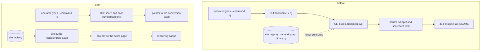
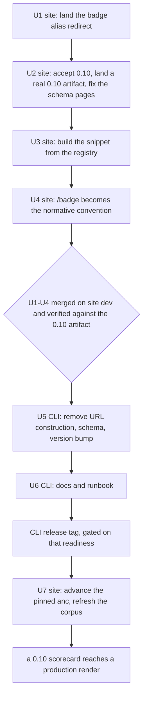

# Badge URL Authority Moves to the Site - Plan

**Target repos:** `agentnative-cli` (this repo) and `agentnative-site`. Paths are relative to whichever repo the
surrounding text names.

## Goal Capsule

- **Objective:** Anyone who follows what `anc` prints after an audit ends up with a badge that renders, and nobody is
  told a badge exists when it does not.
- **Means:** The CLI stops building per-tool URLs and points at the convention page; the site builds the embed snippet
  from the registry slug it owns (KTD1, KTD2).
- **Product authority:** This plan owns what the CLI asserts about badges and which component builds badge URLs. It does
  not own the scoring formula, the floor's value, badge SVG rendering, or registry curation.
- **Execution profile:** Two repos, one CLI release boundary. Site work in U1 through U4 and U7, CLI work in U5 and U6,
  each unit its own PR except U5, whose schema and emitter halves must land together. A removal from a published JSON
  contract that another repo reads, against both repos' stated additive-only convention.
- **Stop conditions:** Stop and raise if dropping the fields would leave the site unable to render the existing 0.9
  corpus. That invalidates the ordering, not the Objective.
- **Who finishes:** `ce-work` implements per repo. The CLI's `scripts/release/smoke.sh` and the cross-repo blast-radius
  gate in `RELEASES-PREFLIGHT.md:110-120` hold the release boundary.
- **Open blockers:** None.

---

## Product Contract

### Summary

The CLI stops asserting anything about a specific tool's badge. It keeps the score and whether that score clears the
floor, and points at the convention page. The site takes over building the embed snippet from its own registry, where it
owns the slug and can be right by construction.

### Problem Frame

A tool's badge URL belongs to the site. The site's registry assigns each tool a URL-safe name, serves
`/badge/<name>.svg`, and reaps any badge file that is not keyed by a canonical name. The CLI assigns nothing: it takes
whatever the operator typed after `--command`, builds `https://anc.dev/badge/<that>.svg`, and prints it as the thing to
paste into a README. It carries no HTTP client, so it never learns whether that URL resolves.

For 86 of the 98 curated tools the two names coincide and the output is accidentally correct. For the other 12,
including `ripgrep`, `aws-cli`, `claude-code`, `nushell`, `gemini-cli` and `flyctl`, the binary differs from the slug
and the printed snippet is a working link wrapped around a 404 image. Measured: `/badge/rg.svg` returns 404 while
`/badge/ripgrep.svg` returns 200.

The reach is wider than the bug. `BADGE_BASE_URL` compiles a domain and two path shapes into a binary distributed
through Homebrew and crates.io, so the site can no longer reorganize `/badge/` or `/score/` without carrying redirects
indefinitely: released `anc` builds will emit those paths forever. A third surface compounds it. The spec repo's
`docs/badge.md` is the normative embed convention and publishes `anc.dev/scorecards/<tool>`, which 404s for every tool,
while the CLI mints `/score/<tool>` and the site serves `/score/<tool>`. Three surfaces, two wrong answers, and the
normative one is the dead one.

An earlier decision record in this repo resolved the same defect as site-redirect-only with "No CLI change"
(`docs/plans/2026-10-05-1657-fix-code-unwrap-macro-arguments-plan.md:978-990`). This plan supersedes that line; U6
corrects it so the repo does not carry two directions.

### Key Decisions

- KD1. **The CLI does not assert that a specific tool's badge exists.** (session-settled: user-directed — chosen over
  keeping per-tool URL construction and relying on a site-side redirect alone: only the site can add a tool to the badge
  list, so only the site can state its URL.) Governs R1, R2, R5.
- KD2. **The CLI points at the badge convention page rather than printing a per-tool embed snippet.** (session-settled:
  user-directed — chosen over keeping the copy-paste markdown in terminal output: a pointer is true without knowing the
  slug.) Governs R3.
- KD3. **The site becomes the normative home for the badge convention.** (session-settled: user-directed — chosen over
  correcting the spec repo's `docs/badge.md` in lockstep, and over filing it as a separate defect: the spec's published
  shape 404s, the site's `/badge` page is live and is already the CLI's convention target, and the spec repo is flagged
  for deprecation.) Governs R7.

### Requirements

**What the CLI asserts**

- R1. The scorecard carries no per-tool badge URL, no per-tool scorecard URL, and no embed snippet.
- R2. The scorecard still carries the score and whether it clears the badge floor.
- R3. Text output on a run that clears the floor names the score and points at the badge convention page, and prints no
  per-tool URL.
- R4. `--quiet` suppresses the convention pointer.
- R5. Eligibility is the floor comparison alone and does not depend on deriving a tool slug.

**What the site owns**

- R6. The site builds the embed snippet from its registry entry's name for every scorecard it renders, without reading
  any URL the CLI supplied.
- R7. The site's `/badge` page carries the authoritative embed shape.
- R8. A badge URL built from a curated tool's binary name reaches that tool's canonical badge, and an unknown slug still
  returns 404.

**Migration across the two repos**

- R9. The site renders the committed 0.9 corpus and a 0.10 scorecard identically with respect to the badge snippet.
- R10. The scorecard schema version records the removal, and the schema and the code that emits it change together.
- R11. The CLI release does not tag until the site serves the new shape.

### Acceptance Examples

- AE1. A curated tool whose binary differs from its slug
  - **Covers R6, R8.**
  - **Given:** the site renders ripgrep's score page, whose registry entry is `name: ripgrep, binary: rg`
  - **When:** a reader copies the embed snippet from that page
  - **Then:** the snippet names `/badge/ripgrep.svg`, and a request for `/badge/rg.svg` reaches the same SVG.
- AE2. An eligible run in text mode
  - **Covers R3.**
  - **Given:** a run scoring at or above the floor
  - **When:** the audit finishes in the default text mode
  - **Then:** the output names the score and the convention page, and contains no `/badge/` or `/score/` path for the
    audited tool.
- AE3. The same run under `--quiet`
  - **Covers R4.**
  - **Given:** the AE2 run
  - **When:** `--quiet` is passed
  - **Then:** no convention pointer is printed.
- AE4. An eligible run with no derivable slug
  - **Covers R5.**
  - **Given:** a target whose tool name resolves to the empty string
  - **When:** the run scores at or above the floor
  - **Then:** the scorecard reports it eligible.
- AE5. A mixed-vintage corpus
  - **Covers R9.**
  - **Given:** the committed corpus at schema 0.9 and one scorecard at 0.10
  - **When:** the site builds and renders both score pages
  - **Then:** both carry the same registry-derived snippet, and neither renders the literal `undefined`.

### Success Criteria

- Every embed snippet the site renders resolves to a 200 SVG across all 98 curated tools, including the 12 whose binary
  differs from the slug.
- `score_pct` is byte-identical before and after the change for a fixed input, since nothing here touches scoring.
- No surface prints or renders the literal `undefined`, which is what an absent field yields today through `escHtml`.

### Scope Boundaries

- The scoring formula, the floor's value, badge SVG rendering and colors, and registry curation stay as they are.
- `BADGE_ELIGIBILITY_FLOOR_PCT` duplicating the floor that `src/principles/spec/principles/scoring.md:95` defines is not
  reconciled here. Evidence that would change the call: a second consumer of the floor inside the CLI.
- The CLI gains no network access. Verifying a badge URL at audit time stays out; a linter that reaches the network to
  check its own output claim is a different product.

**Considered and not built**

- Vendoring the site's name-to-binary map into the CLI so it could emit the canonical slug. A redirect fixes every `anc`
  already installed, while a vendored map only affects releases made after the vendor and goes stale between them, where
  a wrong canonical slug is worse than a 404.
- A compatibility window that emits both the old and new fields. The removal's whole point is that the old fields were
  never the CLI's to state; emitting a known-wrong URL alongside a pointer keeps the defect and doubles the surface.

**Deferred to Follow-Up Work**

- The spec repo's `docs/badge.md` publishing `anc.dev/scorecards/<tool>`, measured 404 for every tool. KD3 makes the
  site normative; retiring or correcting the spec's copy waits on that repo's deprecation decision.

### Dependencies / Assumptions

- The site can produce a real 0.10 scorecard before any CLI release. `scripts/SYNCS.md:53` documents inject mode, `bash
  docker/score/build.sh --from-source <cli-repo> --run`, as "the way to score against an unreleased anc (feature branch
  in agentnative-cli before tag + bottle)". The `MIN_ANC_VERSION` gate lives in `scripts/regen-scorecards.sh`, which the
  same runbook marks deprecated at `:149` and `:197` in favor of the container path. So U2 lands its version widening
  together with a real artifact at that version, and the set's "adding a version without a corpus able to satisfy it"
  warning never applies.
- The consumer still leads, for a different reason than release mechanics: the site must not render a shape the CLI is
  about to emit as the literal `undefined`, and inject mode is what lets it prove that on a branch.
- The site deploys from `main`, and `origin/dev` is 578 commits ahead of `origin/main`. Merging to the site's `dev` is
  not a deploy. A 0.10 scorecard reaches a production render only after the site's own `src/data/anc/VERSION` and
  sandbox pin advance, which U7 owns, so neither the CLI's merge nor its tag waits on a site release cut.

### Outstanding Questions

**Deferred to Implementation**

- Whether snippet generation lives inside `src/shared/scorecard-format.mjs` or moves up to the caller that already holds
  the registry entry. The function currently receives a scorecard and a tool, so the registry name may already be in
  reach.

### Sources / Research

- `src/scorecard/mod.rs:47,54,141-196` — the floor constant, `BADGE_BASE_URL`, the `BadgeInfo` struct, and
  `compute_badge`, which is the single source for both the text and JSON surfaces.
- `src/scorecard/mod.rs:156-166,684` — `text_hint` gates the entire hint on `embed_markdown`, and `format_text` appends
  it with no `quiet` guard.
- `src/main.rs:47,1016-1019` — `anc emit schema` is `include_str!` passthrough, so a schema change is one file.
- `schema/scorecard.schema.json:254-267` — `$defs.BadgeInfo` carries `additionalProperties: false` and lists the three
  fields in `required`, so an emitter that drops them fails validation against the unedited schema.
- `schema/scorecard.schema.json:256` and `tests/scorecard_schema_v05.rs:320` — both describe the floor as 80 and the
  formula as `pass / (pass + warn + fail)`. Both are wrong; the floor is 70 and the formula is credit-weighted and
  behavioral-only. The test passes only vacuously, because the `perfect-rust` fixture scores 0 and never reaches the
  comparison.
- `agentnative-site/src/shared/scorecard-format.mjs:411,701` — the two reads of `scorecard.badge.embed_markdown`,
  feeding the HTML score page and the markdown twin.
- `agentnative-site/src/build/scorecards.mjs:35` — `SUPPORTED_SCHEMA_VERSIONS`, a plural set whose comment documents the
  migration window it exists for.
- `agentnative-site/src/shared/audit-envelope.ts:106,132-144` — the site already builds its own `scorecard_url` from the
  request origin, and `curatedEntryForBinary` is the binary-to-canonical resolver the `/score/<binary>` alias uses.
- `scripts/SYNCS.md:59` and `RELEASES-PREFLIGHT.md:110-120` — the corpus regeneration path and the committed cross-repo
  gate: "If the site is not ready, hold the tag."
- `docs/solutions/conventions/schema-version-set-during-staged-rollout.md` — the same two repos at 0.5 to 0.6: widen the
  consumer's version set rather than flipping it, because the corpus cannot regenerate in the same commit. Names the
  trap that an in-repo "bump and regen together" instruction reads as correct here and is wrong.
- `docs/solutions/architecture-patterns/stale-derivations-across-tier-migrations.md` — a Worker derivation that kept
  reading raw input after resolution moved, returning `null` for one input class while compiling, type-checking and
  passing review. Every site-side slug derivation needs auditing, not only the one reading the removed fields.
- `docs/solutions/best-practices/sot-contract-for-spec-repos-with-downstream-consumers-2026-04-22.md` — the
  trust-and-verify decision that a published scorecard must link to the live checker. KTD5 resolves the conflict this
  removal would otherwise create.
- `docs/solutions/conventions/renaming-an-overloaded-domain-noun.md` — an externally pinned contract owes a version
  bump, and a downstream copy may lead it.

---

## Planning Contract

### Key Technical Decisions

- KTD1. **`compute_badge` returns score, eligibility and the fixed convention URL, and nothing else.** (session-settled:
  user-directed — chosen over keeping URL construction behind a site-side redirect: the CLI cannot verify the slug and
  has no authority to assign it.) The three URL fields and `BADGE_BASE_URL`'s per-tool use go; the convention URL,
  currently a bare literal beside the constant, is built from the constant so one definition remains. Instantiates KD1;
  governs R1, R2, R5.
- KTD2. **The site builds the snippet from the registry name unconditionally, never preferring a CLI-supplied field.** A
  prefer-if-present branch would make the rendered snippet depend on which corpus vintage was read, and the corpus
  cannot regenerate until after the CLI release. Unconditional generation makes the site indifferent to schema vintage
  and removes the migration window entirely. Instantiates KD1; governs R6, R9.
- KTD3. **The site adds 0.10 to `SUPPORTED_SCHEMA_VERSIONS` rather than flipping it.** The 0.5-to-0.6 precedent in
  `docs/solutions/conventions/schema-version-set-during-staged-rollout.md` establishes the set-widening mechanism for
  exactly this repo pair, because the committed corpus lags the producer by a release. Governs R9, R10.
- KTD4. **The schema edit and the emitter change land in one CLI commit.** `$defs.BadgeInfo.required` lists the three
  fields, so either half alone fails `check-jsonschema` in `scripts/release/smoke.sh`. This is the one place in the plan
  where two files must move together rather than in sequence. Governs R10.
- KTD5. **The live-checker link lives on what the site serves, not inside a committed scorecard.** The trust-and-verify
  contract in `docs/solutions/best-practices/sot-contract-for-spec-repos-with-downstream-consumers-2026-04-22.md`
  requires a published scorecard to link to the live checker. The site already satisfies it:
  `src/build/08-scorecards-emit.mjs:67` sets `scorecard_url: scorePath(tool.name)` on the curated registry entry, and
  `src/shared/audit-envelope.ts:106` builds the same link from the request origin. Writing the field back into a
  committed scorecard is not available and not needed: `$defs.BadgeInfo` sets `additionalProperties: false`, so a
  site-added `badge.scorecard_url` is invalid at 0.10, and a later rescore regenerates the file from raw `anc` output
  and erases it. The accepted narrowing is that someone handed a bare scorecard file out of band, outside both served
  surfaces, no longer finds a link inside it. Governs R1.
- KTD6. **`--quiet` suppresses the convention pointer.** `PRODUCT.md`'s register reserves `--quiet` for stripping prose,
  and the pointer is prose; today's hint prints under `--quiet` only because nothing guards it. Governs R4.
- KTD7. **The consumer leads: U1 through U4 are merged and proven against a real 0.10 scorecard before the CLI tag.**
  `RELEASES-PREFLIGHT.md:110-120` sets the standard as readiness, not deployment: the site "reads the new JSON shape
  correctly... If the site is not ready, hold the tag." Inject mode proves that on a branch, so the gate is a branch
  verification rather than a wait on the site's release cut. Governs R11.

A bake-off was considered and did not qualify: research converged on one mechanism per side, and no two structurally
distinct candidates survived to compare.

This removal is a deliberate exception to both repos' additive-only convention, which `CLAUDE.md` states as "add keys
rather than renaming or retyping existing ones." Additive is not available here, because the additive form is to ship a
second, correct URL beside a known-wrong one and keep asserting both.

### High-Level Technical Design

Who may state a badge URL, before and after. Directional, not implementation specification.



Cross-repo ordering. Each stage is releasable on its own, and no stage leaves a surface rendering a missing field.



### Implementation Constraints

- Site gate order is `bun run build` before `bun test`, never the reverse: `tests/regression.test.ts` reads `dist/`
  rather than rebuilding it, so a stale `dist/` from another branch reads exactly like a content regression.
- Site code changes go on a `fix/*` branch and reach production only through a `release/*` cut from `main`; a merge to
  `dev` is not a deploy.
- CLI changes here touch `src/`, `schema/`, `tests/`, `README.md`, `AGENTS.md` and `RELEASES-POSTFLIGHT.md`, all of
  which are PR-gated. The dev-direct exception covers planning docs, so this plan file and the earlier plan record U6
  corrects are the artifacts that may be pushed straight to `dev`.
- `CHANGELOG.md` is generated and must never be hand-edited. The PR body's `## Changelog` is the source of truth, a
  field removal belongs under `### Changed`, and `RELEASES-PREFLIGHT.md:111-114` additionally requires a `### Breaking
  changes` row naming each removed field.
- `scripts/release/smoke.sh` is not in the pre-push hook. It is the gate that catches a schema-and-emitter mismatch, so
  run it by hand for U5.
- `run()` stays the sole constructor of `AuditResult`, and `compute_badge` stays the single derivation feeding both the
  text and JSON surfaces.

### Sequencing

U1 is independent and repairs embeds already published, so it goes first. U2 precedes U3 because the snippet change
should land on a build that already accepts the version, and because U2's inject-mode artifact is what U3 tests the
0.9-and-0.10 parity against. U4 follows U3 so the normative page describes the shape the site actually generates. U5 is
the one commit where schema and emitter move together, and it needs U1 through U4 merged and verified on the site's
`dev`, not deployed. U6 trails U5 because the docs describe the shape U5 establishes. U7 waits on the CLI release, since
advancing the pin and refreshing the corpus both need the released binary.

---

## Implementation Units

### U1. Site: land the badge alias redirect

- **Goal:** A badge URL built from a curated tool's binary name reaches that tool's canonical badge, repairing embeds
  already published by released `anc` versions.
- **Requirements:** R8.
- **Dependencies:** None.
- **Files:** `agentnative-site/src/shared/audit-routes.ts`, `agentnative-site/src/worker/audit/result.ts`,
  `agentnative-site/src/worker/index.ts`, `agentnative-site/tests/audit-result-route.test.ts`
- **Approach:** The work is already implemented on the pushed branch `fix/badge-alias-redirect` at commit `0d5f12c`,
  which adds `BADGE_PREFIX`, `badgePath` and `badgeSlugOf` beside the existing score-path helpers, an exported
  `badgeAliasRedirect` reusing `curatedEntryForBinary` and `registryOrNull`, and a dispatch ahead of the asset fetch.
  Open the PR against the site's `dev`; the branch exists on `origin` with no PR.
- **Execution note:** This unit stands on its own merits regardless of the rest of the plan. Released `anc` builds will
  keep printing binary-name badge URLs indefinitely, and no CLI change reaches them.
- **Patterns to follow:** the `/score/<binary>` alias at `src/worker/audit/result.ts:355-356`.
- **Test scenarios:**
  - Covers AE1's second half. `/badge/rg.svg` returns 301 to `/badge/ripgrep.svg`; following it yields a 200
    `image/svg+xml`.
  - A canonical slug falls through to the asset binding and still serves.
  - An unknown slug still returns 404 rather than resolving to another tool's badge.
  - Paths this route does not own, including a nested path and a non-SVG extension, fall through untouched.
- **Verification:** `bun run build && bun test` in that order; the redirect confirmed against `bun run dev` rather than
  from the unit test alone.

### U2. Site: accept schema 0.10

- **Goal:** The site accepts and renders a real 0.10 scorecard, and no site surface still declares 0.9 current or
  documents a removed field.
- **Requirements:** R9, R10.
- **Dependencies:** U1.
- **Files:** `agentnative-site/src/build/scorecards.mjs`, `agentnative-site/tests/build.test.ts`,
  `agentnative-site/tests/scorecard-schema-version.test.ts`, `agentnative-site/content/scorecard-schema.md`,
  `agentnative-site/content/web-scorecard-schema.md`
- **Approach:**
  1. Add `'0.10'` to `SUPPORTED_SCHEMA_VERSIONS` (KTD3), leaving the older entries in place, and extend the set's
     comment to name this migration window alongside the existing 0.5 through 0.7 note.
  2. Produce one real 0.10 scorecard from the U5 branch with inject mode, `bash docker/score/build.sh --from-source
     <cli-repo> --run -- --only ripgrep`, and land it with the set change so the version is never listed without an
     artifact behind it.
  3. Move the current-version surfaces the drift guard pins to 0.10: the "Current: X." sentence and the example
     `schema_version` in `content/scorecard-schema.md`, and the "(currently X)" pointer in
     `content/web-scorecard-schema.md`. `tests/scorecard-schema-version.test.ts` pins all three to
     `max(SUPPORTED_SCHEMA_VERSIONS)`, and its `compareVersions` sorts numerically, so 0.10 becomes the new maximum and
     those tests go red the moment step 1 lands.
  4. Strike `embed_markdown`, `scorecard_url` and `badge_url` from the `badge` example JSON and field table in
     `content/scorecard-schema.md`, leaving `eligible`, `score_pct` and `convention_url`. That page is a live surface
     publishing all three today, with an example embed built from `rg`, the exact wrong slug this plan exists to remove.
  5. Update `tests/build.test.ts`, which pins the unsupported-version error message and uses 0.10 as its sentinel for an
     unsupported version. Its `ScorecardBadge` fixture type at `tests/build.test.ts:103-110` declares `embed_markdown`,
     `scorecard_url` and `badge_url` required, under a comment asserting every 0.5-and-later scorecard carries them, so
     no 0.10 fixture literal can satisfy it. Make the three optional and correct the comment to name the window. The 13
     existing literals that set all three stay valid, which is what AE5's 0.9 vintage needs.
- **Patterns to follow:** the set's existing plural shape and its documented reason for being plural.
- **Test scenarios:**
  - The real 0.10 scorecard from step 2 loads, validates, and renders.
  - `tests/scorecard-schema-version.test.ts` passes with every pinned surface reading 0.10.
  - A scorecard at an unlisted version still fails the build, with the sentinel moved off 0.10.
  - `content/scorecard-schema.md` names none of the three removed fields.
- **Verification:** `bun run build && bun test`.

### U3. Site: build the snippet from the registry

- **Goal:** Every rendered embed snippet comes from the registry entry's name, so it is correct for all 98 curated tools
  and indifferent to the scorecard's schema vintage.
- **Requirements:** R6, R9.
- **Dependencies:** U2.
- **Files:** `agentnative-site/src/shared/scorecard-format.mjs`, `agentnative-site/src/worker/audit/result.ts`,
  `agentnative-site/src/build/scorecards.mjs` (its comment at `:21` names `embed_markdown` among the fields the build
  reads off `scorecard.badge`, which stops being true here), plus the badge-and-score URL derivations the audit below
  surfaces, and their tests
- **Approach:**
  1. Replace both reads of `scorecard.badge.embed_markdown` with generation from the registry name, using the site's own
     `scorePath` and `badgePath` (KTD2). Keep the above-floor gate that decides whether a snippet appears at all; that
     do-not-nag rule currently has no home outside the CLI's `CLAUDE.md`, so state it where the site now enforces it.
  2. Suppress the embed block when no curated registry entry resolves for the target. `respondCli` in
     `src/worker/audit/result.ts` synthesizes its tool from `scorecard.tool.name` with no registry index in scope and
     leaves `hideBadgeEmbed` unset, so the live-scoring lane would otherwise hand a reader an embed for a badge that
     does not exist, which is what the Objective rules out. Pass `hideBadgeEmbed: true` there for an uncurated target,
     as the web path already does.
  3. Audit the site's badge-and-score URL derivations for the same class of defect: a derivation that keeps reading a
     value whose authority moved. The stopping rule is reads, not derivations. Building a path from a registry name is
     the correct pattern and 51 files under `src/` do it, so a surface-shaped bound never terminates; the defect is a
     URL-shaped value read off a scorecard object. Only `scorecard-format.mjs:411` and `:701` do that today, both
     replaced by step 1, so the audit's expected result is an empty remainder. Record it as such rather than leaving the
     step open.
- **Execution note:** The failure mode here is silent. An absent field reaches `escHtml(undefined)` and renders the
  literal word `undefined` inside a copy-paste box on both the HTML page and the markdown twin, with build, typecheck
  and tests all green. Assert on rendered output, not on the absence of an exception.
- **Patterns to follow:** `src/shared/audit-envelope.ts:106`, which already builds `scorecard_url` from the origin
  rather than reading it from a scorecard.
- **Test scenarios:**
  - Covers AE1. A registry entry whose `binary` differs from its `name` renders a snippet naming the canonical slug.
  - Covers AE5. A 0.9 scorecard that still carries `embed_markdown` and a 0.10 scorecard that does not render the same
    snippet.
  - Neither the HTML page nor the markdown twin contains the string `undefined` for either vintage.
  - A below-floor scorecard renders no snippet, on both vintages.
  - Covers the all-98 success criterion. Iterating every registry entry, the badge path the snippet generator produces
    has a corresponding SVG in the built output, so no curated tool renders a snippet pointing at a missing badge.
  - A live-scored target with no curated registry entry renders no embed block at all.
  - The JSON projection agents read carries the same verdict. The MCP tools hand a scorecard through whole, which
    `tests/web-audit-mcp-tools.test.ts:277,389` show by asserting on `body.scorecard.badge.score_pct`, so a 0.10
    scorecard reaching an MCP client must carry `eligible`, `score_pct` and `convention_url` and none of the three
    removed keys. Assert it on that projection, not only on the HTML page and the markdown twin.
- **Verification:** `bun run build && bun test`; both representations checked with an explicit `Accept` header, since a
  bare `curl` resolves to the markdown twin.

### U4. Site: `/badge` becomes the normative convention

- **Goal:** One page states the authoritative embed shape, and it is the page the CLI points at.
- **Requirements:** R7.
- **Dependencies:** U3.
- **Files:** `agentnative-site/content/badge.md`
- **Approach:** State the embed shape the site actually serves, keyed on the registry name, and say that a tool's slug
  is the registry's to assign. Keep the eligibility floor's description pointing at scoring policy rather than restating
  a number.
- **Patterns to follow:** the existing `content/badge.md` structure and the site's voice rules in `AGENTS.md`.
- **Test scenarios:**
  - The page names the same path shape `badgePath` produces, so the convention and the generator cannot drift.
- **Verification:** `bun run build && bun test`; the page read in a browser per the site's browser-verify rule, since
  this unit changes rendered content.

### U5. CLI: remove per-tool URL construction

- **Goal:** The scorecard and the terminal carry the score and a convention pointer, and no per-tool URL.
- **Requirements:** R1, R2, R3, R4, R5, R10.
- **Dependencies:** U1 through U4 merged on the site's `dev` and verified against the real 0.10 scorecard U2 produced.
  The site's release cut is not a prerequisite: merging U5 to the CLI's `dev` ships nothing, and `RELEASES-PREFLIGHT.md`
  gates readiness rather than deployment (KTD7).
- **Files:** `src/scorecard/mod.rs`, `src/main.rs`, `schema/scorecard.schema.json`, `scripts/release/smoke.sh`,
  `tests/scorecard_schema_v05.rs`, `tests/integration.rs`, `tests/scorecard_metadata_security.rs`
- **Approach:**
  1. Drop `embed_markdown`, `scorecard_url` and `badge_url` from `BadgeInfo` and from `compute_badge`; build the
     surviving convention URL from `BADGE_BASE_URL` instead of the adjacent bare literal (KTD1).
  2. Drop the slug precondition on `eligible`, which simplifies the signature to `compute_badge(results)` and stops the
     text path calling `derive_tool_name` (R5).
  3. Re-gate `text_hint` on `eligible` rather than on `embed_markdown`, and replace the four-line block with this one
     line, settled at D3:

     ```rust
     Some(format!(
         "\n🏆 Score: {}% — your tool qualifies for the agent-native badge. Claim one at {}/badge\n",
         self.score_pct, BADGE_BASE_URL,
     ))
     ```

     The verb is the authority statement in miniature: the website issues badges, the CLI does not. `Claim` rather than
     `Get`, settled at D4, because claiming is gated. `content/badge.md:113-120` requires a registry entry filed by
     pull request, a committed scorecard, and a site build before a `/score` page renders a snippet, and
     `/score/some-random-cli` measures 404 today, so an uncurated tool has no page until that PR merges. `Get` promises
     self-service that holds for the 98 curated tools and for nobody else. `Claim` also lands the reader on that page's
     own `## Claiming the badge` heading, so the verb that sent them is the verb they arrive on. The line satisfies
     `PRODUCT.md`'s second-person imperative register, carries no RFC 2119 keyword, and keeps the verdict in the first
     clause where a reader at terminal speed finds it.
  4. Guard the hint behind the quiet check (KTD6).
  5. Edit the schema in the same commit (KTD4): remove the three fields from `$defs.BadgeInfo` properties and
     `required`, bump `$id` and the `schema_version` property to 0.10, update the worked example, and correct the
     block's description, which today states the floor as 80 and the formula as `pass / (pass + warn + fail)`.
  6. Relax `convention_url` in `$defs.BadgeInfo` from `"const": "https://anc.dev/badge"` to `"format": "uri"`. The const
     pins the one URL the CLI still compiles in a second time, so `BADGE_BASE_URL` is not the single definition KTD1
     calls for, and a future rename of the `/badge` page KD3 is reshaping would make `check-jsonschema` reject every
     released `anc`'s output.
  7. Bump `SCHEMA_VERSION` to `"0.10"`, extend its cumulative history comment, and update the four version assertions in
     the test suite.
  8. Add a hard `gate_convention_url` to `scripts/release/smoke.sh`, settled at D5. The CLI now compiles one URL it can
     never check, since it carries no HTTP client, and a site rename would break every installed binary with nothing
     failing anywhere. The gate follows the `gate_examples_resolve` shape at `smoke.sh:217`: read the convention URL out
     of the emitted scorecard's `badge.convention_url` rather than hard-coding it a third time, request it, and
     `gate_fail` on any status other than 200. Wire it into `main` beside the other gates so a failure exits non-zero.
     Accepted tradeoff, stated at D5: this is the script's first network dependency, so an anc.dev outage or a CI egress
     block fails a release that is otherwise sound. Name that in the gate's own failure message so an operator can tell
     an outage from a real rename.
- **Execution note:** Observe the red before the green on the schema half. The removal's hard failure is
  `check-jsonschema` inside `scripts/release/smoke.sh`, which is not in the pre-push hook, so run that script by hand.
  Note also that no test currently covers the eligible path through the real binary: `tests/scorecard_schema_v05.rs:320`
  compares against a floor of 80 while the real floor is 70, and it passes only because the `perfect-rust` fixture
  scores 0 and never reaches the comparison. Fix that assertion while rewriting the block, and say in the PR that the
  eligible path still has no integration fixture rather than implying it is covered.
- **Patterns to follow:** `compute_badge` as the single derivation for both surfaces; the existing unit tests in
  `src/scorecard/mod.rs`'s own `mod tests`.
- **Test scenarios:**
  - Covers AE2. An eligible run in text mode names the score and the convention page and contains no `/badge/` or
    `/score/` path for the audited tool.
  - Covers AE3. The same run under `--quiet` prints no pointer.
  - Covers AE4. An eligible run whose tool name is empty still reports eligible.
  - A below-floor run prints no pointer and reports `eligible: false`.
  - The emitted JSON carries `score_pct`, `eligible` and `convention_url`, and none of the three removed keys.
  - `anc emit schema` still matches the committed schema byte for byte.
  - `--raw` output is unchanged.
  - Covers D5. `gate_convention_url` passes against the live page and fails on a non-200. Observe the red by pointing
    the gate at a known-404 path, measured today as `https://anc.dev/scorecard-v0.9.schema.json`, before wiring it to
    the scorecard's real `badge.convention_url`.
- **Verification:** `cargo test --quiet`, `cargo clippy --all-targets -- -Dwarnings`, `cargo fmt --check`, and
  `scripts/release/smoke.sh` run manually, whose schema-parity and `check-jsonschema` gates are what prove the schema
  and emitter agree.

### U6. CLI: documentation and runbook

- **Goal:** No document describes fields the scorecard no longer carries.
- **Requirements:** R1, R10.
- **Dependencies:** U5.
- **Files:** `README.md`, `AGENTS.md`, `RELEASES-POSTFLIGHT.md`, `CLAUDE.md`,
  `docs/plans/2026-10-05-1657-fix-code-unwrap-macro-arguments-plan.md`
- **Approach:**
  1. Update the worked scorecard example and the `badge` field prose in `README.md`, and correct its claim that the
     CLI's tool-name derivation "matches the site registry's slug convention" — the 12-tool divergence is exactly where
     that is false.
  2. Update the `badge` bullet in `AGENTS.md` and its stale `schema_version` reference, which still says 0.5.
  3. Rewrite the `RELEASES-POSTFLIGHT.md` checkbox that asks the operator to click the emitted `badge_url` and
     `scorecard_url`, so the postflight stops referencing removed fields.
  4. Append the 0.10 entry to the cumulative schema history in `CLAUDE.md`, and rewrite its `0.5` section at
     `CLAUDE.md:209-223`. Appending alone does not meet this unit's goal: that section states the six-field `BadgeInfo {
     eligible, score_pct, embed_markdown, scorecard_url, badge_url, convention_url }` signature, the rule that
     `embed_markdown` is `Some` only when eligible, that `scorecard_url` / `badge_url` are populated whenever a slug
     exists, and that the JSON `embed_markdown` and the printed hint can never disagree. All four statements describe
     fields the scorecard no longer carries. The surviving facts in that section, the `score_pct` formula, the floor,
     and `convention_url`, stay.
  5. Correct the superseded line in the earlier plan record, which resolves this defect as site-redirect-only with "No
     CLI change". That file is a planning doc and commits directly to `dev`, separately from this unit's PR.
- **Test scenarios:** none; this unit is documentation. The schema-history entry is covered indirectly by U5's version
  assertions.
- **Verification:** `markdownlint-cli2` on the touched files; the release runbook read end to end to confirm no step
  references a removed field.

### U7. Site: advance the pinned `anc` and refresh the corpus

- **Goal:** The site's live-scoring lane emits the new shape, and the committed corpus stops carrying 0.9 artifacts for
  tools that have been re-audited.
- **Requirements:** R9.
- **Dependencies:** U5, U6, and a published CLI release.
- **Files:** `agentnative-site/src/data/anc/VERSION`, `agentnative-site/docker/sandbox/Dockerfile`,
  `agentnative-site/wrangler.jsonc`, `agentnative-site/scorecards/`
- **Approach:**
  1. Advance the pinned `anc` version, the sandbox image's `anc` tarball, and the `wrangler.jsonc` pin per
     `scripts/SYNCS.md`. This is the only path by which a 0.10 scorecard reaches a production render, and
     `tests/sandbox-anc-version.test.ts` fails CI on the drift, so it is required work rather than hygiene.
  2. Refresh the committed corpus with the released binary.
- **Execution note:** This unit cannot start before the CLI release ships. Step 1 is required; step 2 is hygiene that
  rides along, because R9 is already satisfied by U2 and U3, which make the site render both vintages identically.
- **Test scenarios:**
  - `tests/sandbox-anc-version.test.ts` passes against the advanced pin.
  - A live-scored page for a curated tool renders from a 0.10 scorecard with no `undefined` on either representation.
  - Every refreshed scorecard reports `schema_version` 0.10 and carries none of the removed fields.
- **Verification:** `bun run build && bun test`; a spot check that a refreshed tool's score page is unchanged apart from
  the schema version.

---

## Verification Contract

| Gate                                 | Command                                                           | Applies to         |
| ------------------------------------ | ----------------------------------------------------------------- | ------------------ |
| Site build then tests, in that order | `bun run build && bun test`                                       | U1, U2, U3, U4, U7 |
| Site lint and typecheck              | `bun run lint`                                                    | U1, U2, U3, U4     |
| Site live check                      | `bun run dev`, then request the surface with an explicit `Accept` | U1, U3, U4         |
| CLI tests                            | `cargo test --quiet`                                              | U5                 |
| CLI lint and format                  | `cargo clippy --all-targets -- -Dwarnings`, `cargo fmt --check`   | U5                 |
| CLI schema parity and validation     | `scripts/release/smoke.sh`, run manually                          | U5                 |
| Real 0.10 artifact                   | `bash docker/score/build.sh --from-source <cli-repo> --run`       | U2                 |
| Markdown lint                        | `markdownlint-cli2` on touched files                              | U2, U4, U6         |
| Cross-repo release gate              | the blast-radius check in `RELEASES-PREFLIGHT.md:110-120`         | the CLI tag        |

The schema gates matter more than the test count here. `scripts/release/smoke.sh` holds two invariants no unit test
covers: that `anc emit schema` matches the committed file byte for byte, and that every emitted scorecard validates
against it. Because `$defs.BadgeInfo.required` lists the three fields, those gates are what catch a half-done removal,
and neither runs in the pre-push hook.

---

## Definition of Done

- Every requirement R1 through R11 is exercised by at least one passing test or a named gate, and every acceptance
  example AE1 through AE5 is covered by a scenario.
- The site renders the committed 0.9 corpus and a 0.10 scorecard with the same registry-derived snippet, and neither
  surface contains the literal `undefined`.
- An embed snippet taken from a score page resolves to a 200 SVG for a tool whose binary differs from its slug, and a
  test asserts that property across every registry entry rather than one example.
- A live-scored page for a target with no curated registry entry renders no embed block at all.
- `score_pct` is byte-identical before and after for a fixed input, stated in the CLI PR so a reviewer does not read
  this as a scoring change.
- The CLI PR body carries a `### Breaking changes` row naming each removed field, and `CHANGELOG.md` is left untouched.
- `scripts/release/smoke.sh` passes against the built binary, including its schema-parity and validation gates.
- U1 through U4 are merged on the site's `dev` and verified against a real 0.10 scorecard before the CLI release is
  tagged, which is the readiness the cross-repo gate asks for. The in-production requirement belongs to U7's pin
  advance, the only path by which a 0.10 scorecard reaches a production render.
- No document in either repo describes a removed field, and the superseded "No CLI change" line in the earlier plan
  record is corrected.
- No placeholder 0.10 artifact, abandoned compatibility branch, or dead field remains in either diff.

---

## Engineering review

Target: this plan file, `docs/plans/2026-10-05-2310-fix-badge-url-authority-moves-to-the-site-plan.md`. Reviewed on
2026-10-05 against commit `e2170ca`.

### Scope Challenge

Complexity count: about 26 proposed changed files, 11 in `agentnative-cli` and 15 in `agentnative-site`, and zero new
classes or services. That trips the 8-file gate, so the arrangement went to a decision rather than being assumed.

Scope record: feature answers: none asked, no cuts proposed; structure: B, Original arrangement, answered at D1,
2026-10-05; accepted scope: the seven units stay as written, with the same feature list, contracts and the nine fixes
the document review applied; pending remedies: none at the time of the answer.

What already exists, and the plan reuses rather than rebuilds: `curatedEntryForBinary` and the `/score/<binary>` alias
it feeds, `scorePath` plus the `badgePath` helper U1 adds, the plural `SUPPORTED_SCHEMA_VERSIONS` set and its documented
migration window, inject mode for scoring against an unreleased binary, the `scorecard_url` the served registry entry
already carries, and `compute_badge` as the single derivation behind both CLI surfaces. No new abstraction is proposed
and nothing is reimplemented.

Search check: no new architectural pattern, infrastructure component, or concurrency approach. The work removes three
fields and moves one string construction across an existing boundary, so external research adds nothing here.

Findings:

1. [P3] (confidence: 10/10) Distribution check, the schema `$id`. Measured: `https://anc.dev/scorecard-v0.9.schema.json`
   and the v0.8 equivalent both return 404, and the site keeps no copy of the CLI schema. The `$id` is an identifier
   rather than a fetchable document, so bumping it to v0.10 cannot break a consumer pinning the URL, because none can
   dereference it. Recorded so the cross-repo blast-radius check is not read as requiring the site to start serving a
   new schema URL. Folded as a factual note; it changes no behavior and asks for no work.
2. No other issues found. The minimum change set was already settled by the document review, this repository keeps no
   `TODOS.md` to cross-reference, and the change introduces no new build, publish, or install artifact.

Scope Challenge result: scope accepted as-is.

### Architecture

Boundaries hold. The change moves one derived value from producer to consumer, and the consumer already owns the inputs:
`src/shared/audit-envelope.ts:106` derives `scorecard_url` from the request origin rather than reading it, so U3 extends
an established pattern instead of inventing one. The dependency chain U1 to U2 to U3 supplies `badgePath` before U3
consumes it, verified: `badgePath` is absent from site `dev` and present only on `fix/badge-alias-redirect`, which U1
lands.

1. **The MCP projection is a third rendering of the same scorecard, and U3 only asserted on two.** Confidence 90%. The
   MCP tools pass a scorecard through whole, which `tests/web-audit-mcp-tools.test.ts:277,389` show by asserting
   `body.scorecard.badge.score_pct`. An agent is exactly the reader KD1 protects, so the vintage parity U3 checks on the
   HTML page and the markdown twin has to hold on the JSON an agent reads. The surviving fields make this additive
   rather than breaking: `score_pct`, `eligible` and `convention_url` all stay, so no MCP consumer loses a field it
   reads today. Added as a U3 test scenario.
2. **One comment asserts a read that stops happening.** Confidence 95%. `src/build/scorecards.mjs:21` names
   `embed_markdown` among the fields the build reads off `scorecard.badge`. After U3 it reads two of the three. Added to
   U3's file list.
3. No single point of failure is introduced. A registry read already gates every curated surface, and U1's resolver
   degrades through `registryOrNull`, so a registry failure leaves badge serving where it is today rather than breaking
   it.

Dispositions: finding 1 added to U3's test scenarios; finding 2 added to U3's file list; no diagram needed, since the
plan's two mermaid diagrams already carry the authority move and the request path.

### Code quality

1. **U3 step 3 had no stopping rule.** Confidence 100%. It asked for an audit bound "by surface rather than by field
   name"; that surface is 51 files under `src/` that construct a `/badge/` or `/score/` path, and constructing one is
   the correct pattern, so the instruction could not terminate. The defect class is narrower: a URL-shaped value read
   off a scorecard object, which only `scorecard-format.mjs:411` and `:701` do. Rewritten with that bound and the
   expected empty remainder.
2. No shared helper wants extracting. `badgePath` and `badgeSlugOf` land in `src/shared/audit-routes.ts` beside
   `scorePath`, with two first-party callers (U1's redirect, U3's generation), which is the right threshold.
3. `derive_tool_name` survives U5 correctly. The text path stops calling it, but `build_tool_info` still needs it for
   the scorecard's `tool` block, so U5's wording ("stops the text path calling it") is accurate rather than a deletion.

Dispositions: finding 1 rewritten in U3; findings 2 and 3 are confirmations, no action.

### Tests

Coverage of the change surface:

```text
  surface                              asserted by                                   state
  ------------------------------------ --------------------------------------------- -----------
  badge alias redirect (U1)            tests/audit-result-route.test.ts, +1 case      written, red observed
  0.10 accepted, older kept (U2)       tests/scorecard-schema-version.test.ts         pinned to max(set)
  real 0.10 artifact loads (U2)        inject-mode scorecard + build                  planned
  snippet from registry name (U3)      AE1, all-98 iteration                          planned
  0.9 and 0.10 parity (U3)             AE5, both vintages                             planned
  no literal `undefined` rendered      HTML page + markdown twin                      planned
  JSON/MCP projection parity (U3)      web-audit-mcp-tools.test.ts shape              planned (added here)
  below-floor renders no snippet       both vintages                                  planned
  uncurated live target, no embed      respondCli path                                planned
  CLI emits none of the three (U5)     scorecard schema test + emitted JSON           planned
```

1. **The 0.10 fixture literal is blocked by a required-field type.** Confidence 100%. `tests/build.test.ts:103-110`
   declares `embed_markdown`, `scorecard_url` and `badge_url` required on `ScorecardBadge`, under a comment asserting
   every 0.5-and-later scorecard carries the block. AE5 needs a 0.10 literal beside a 0.9 one, and that type refuses it.
   Thirteen existing literals set all three and stay valid, so the fix is making the three optional, not rewriting the
   fixtures. Added to U2 step 5, which already touches that file.
2. The non-vacuity discipline is already explicit where it matters. U3's execution note names the real failure mode: an
   absent field reaches `escHtml(undefined)` and renders the literal word `undefined` with build, typecheck and tests
   green, so the scenario asserts on rendered output rather than on the absence of an exception.
3. U1's case is the only one whose red has been observed, by stubbing the resolver to return `null`. Every U2 through U7
   scenario is still a claim about a test not yet written.

Dispositions: finding 1 added to U2 step 5; finding 3 recorded as the standing gate on the units, not a plan defect.

### Performance

No issues found. Snippet generation replaces a string read with a string build at render time, the all-98 iteration is
98 path existence checks inside a build test, and nothing here touches scoring: `score_pct` is byte-identical before and
after for a fixed input, which the plan already states at line 137. The one scale note: the all-98 check grows with the
registry, linearly, from 98 entries.

Dispositions: none.

### Outside voice

A consumer of the published scorecard contract would ask why a field is being removed rather than deprecated, since
removal is the breaking option and `additionalProperties: false` means a consumer cannot ignore what it does not expect.
The plan's answer holds: the site is the only consumer that reads the three keys, it is first-party, and the version set
widens rather than flips, so a 0.9 artifact keeps validating. The one thing the removal buys that a deprecation would
not is the end of a wrong value in a published file, which is the defect.

A release engineer would ask what happens to scorecards already committed at 0.9 carrying the wrong `rg` embed. U1
answers it for the published badge URLs by redirect, and the corpus refresh in U7 replaces the files themselves. Nothing
in the plan rewrites history, which is correct.

### Approval readiness

Ready to implement. Four findings, all plan-text corrections applied within this review's authority; no finding reopened
a settled decision, and KD1 through KD3 plus KTD1 keep their `session-settled: user-directed` annotations and their
`Governs R...` links verbatim. No question is pending.

The one standing gap is status rather than specification: U1's branch `fix/badge-alias-redirect` is pushed at `0d5f12c`
with no pull request open, and U2 through U7 all sit behind it.

## Developer experience review

Mode: DX POLISH. Product type: CLI Tool (D1). Reviewed against the badge moment this plan reshapes, not against all of
`anc`.

### Developer persona card

```text
TARGET DEVELOPER PERSONA
========================
Who:       A CLI maintainer running `anc` during a refactor or pre-release pass, plus an AI agent
           reading `anc audit --output json` in a pipeline. Both are in scope (D2).
Context:   Mid-flow on the command line, reading at terminal speed, not desk speed.
Tolerance: The high-leverage moment is the first line. An actionable lede in paragraph three is not read.
Expects:   A verdict plus an action, and for every JSON field to stand alone in a reasoning trace.
Source:    Declared in `PRODUCT.md:33-43`, not inferred. The third declared audience, CI integrators,
           is out of scope here: this plan's CI surface is one suppressed line.
```

### Developer empathy narrative

Accepted at D3 as the baseline.

I maintain a small Rust CLI. Someone links me anc.dev and I install with `brew install brettdavies/tap/agentnative`. I
run `anc audit .` and watch rows scroll by. At the bottom, something I did not expect: a trophy. "Score: 78% — your tool
qualifies for the agent-native badge." Then an indented markdown snippet and a convention URL. This is the good part. I
did not ask for a badge and now I have earned one, and the thing I need is already formatted for pasting. I copy it into
my README, push, and open the file on GitHub. The link works. The image does not: a broken-image icon where my score
should be. I click the link, which lands on a real page with a real score, so the badge exists, which makes the broken
image more confusing, not less. I check for a typo, re-copy the snippet, maybe re-run the audit. Nothing changes,
because the snippet names my binary and the badge is filed under my package name. I have no way to know that from here,
and `anc` has no way to tell me, since it never makes a network request. I either give up and delete the line or I open
an issue.

### Competitive DX benchmark

The clock: from a qualifying `anc` run to a badge rendering in the maintainer's README. Boundaries differ per cohort, so
the rows are not comparable to each other as single numbers.

| Tool                                 | Start → result                                                  | Time + evidence type            | DX choice                                   | Source                         |
| ------------------------------------ | --------------------------------------------------------------- | ------------------------------- | ------------------------------------------- | ------------------------------ |
| `anc` today, curated, name matches   | run → paste → renders                                           | seconds, observed printed block | CLI prints the snippet                      | `src/scorecard/mod.rs:158`     |
| `anc` today, curated, binary differs | run → paste → broken image                                      | never completes, measured       | CLI prints a snippet it cannot verify       | `/badge/rg.svg` → 404          |
| `anc` today, uncurated               | run → paste → image and link both 404                           | never completes, measured       | same snippet, no page behind it             | `/score/some-random-cli` → 404 |
| `anc` after this plan, curated       | run → `/badge` → `/score/<tool>` → paste                        | seconds plus one context switch | site issues, CLI points                     | `content/badge.md:34`          |
| `anc` after this plan, uncurated     | run → `/badge` → registry PR → scorecard commit → build → paste | gated on PR review              | listing is a reviewed gate                  | `content/badge.md:113-120`     |
| Codecov, Coveralls                   | push a token-authenticated report → badge                       | minutes, reported               | no human in the loop; the token is the gate | in-distribution knowledge      |
| OpenSSF Scorecard                    | listing-gated, closest peer model                               | not measured                    | gated listing, like this one                | in-distribution knowledge      |

Research ran on in-distribution knowledge: the outside-voice provider is disabled in this checkout, and the peer rows
are labeled reported or not-measured accordingly. The first-party rows were measured live.

### Magical moment specification

The moment is the unexpected trophy at the end of an audit: a maintainer who ran a linter discovers they earned
something. The plan preserves the moment and removes the false payload. Delivery vehicle, settled at D3 and D4: one
terminal line carrying the score, the qualification, and a claim pointer, specified verbatim in U5 step 3.

The word `Claim` is the whole design. `Get` promised self-service that holds for 98 tools and for nobody else; `Claim`
tells the truth and lands the reader on that page's own `## Claiming the badge` heading.

### Developer journey map

```text
STAGE           | DEVELOPER DOES                        | FRICTION POINTS                  | STATUS
----------------|---------------------------------------|----------------------------------|----------
1. Discover     | follows a link to anc.dev             | none in scope                    | ok
2. Install      | brew / cargo / binstall, one command  | none; measured Champion today    | ok
3. Hello World  | `anc audit .`, rows plus a verdict    | none; 0.07s binary, 2.64s dir    | ok
4. Real Usage   | reads the trophy line, claims a badge | the payload was wrong; now a      | fixed (U5)
                |                                       | pointer with an honest verb       |
5. Debug        | a badge does not render               | no error path existed at all;     | fixed by removal
                |                                       | the failure is now prevented      | (residual below)
6. Upgrade      | consumes schema 0.10                  | breaking removal under            | fixed (U2, U5)
                |                                       | additionalProperties:false        |
```

### First-time developer confusion report

```text
FIRST-TIME DEVELOPER REPORT
============================
Persona: CLI maintainer, mid-refactor
Attempting: claim an agent-native badge after this plan ships

CONFUSION LOG:
T+0:00  Runs `anc audit .`. Rows scroll. Last line: trophy, 78%, "Claim one at https://anc.dev/badge".
T+0:20  Opens the page. Reads "How to embed it" with a `<tool>` placeholder template.
T+0:40  Scrolls to "Claiming the badge". Step 1 is "file a registry entry" via a PR to another repo.
T+1:30  Decides whether that is worth it. Curated already: goes to /score/<tool>, copies, done.
        Not curated: opens the registry README, files a PR, and waits. The trophy becomes a task.
T+3:00  Final state: succeeded if curated; queued on someone else's review if not.
```

Addressed: the line no longer promises self-service (D4), so the T+0:40 discovery is a confirmation rather than a
reversal. Not addressed, by choice: the gate itself. Residual at T+0:20, the `<tool>` template is now the only remaining
way to hand-build a 404 badge URL.

### Pass findings

Scores are before and after this plan plus this review's corrections, scoped to the badge moment.

1. **Getting Started, 5 → 8.** The reward moment handed over a payload that was wrong for 12 of 98 curated tools and for
   every uncurated tool. It is now a true pointer. Not higher because claiming is PR-gated, which is the trust model
   rather than friction to remove.
2. **API/CLI/SDK design, 7 → 9.** `badge` drops from six fields to three, and the three that go were the ones asserting
   facts the CLI cannot know. The survivors each stand alone in a reasoning trace, which is `PRODUCT.md`'s agent test.
   Residual: `eligible` is a bare boolean, so an agent reading `eligible: false, score_pct: 62` cannot tell how far off
   the floor is without the schema document. Out-of-scope opportunity, below.
3. **Error messages, 6 → 8.** Three paths traced. The original failure had no error path anywhere: a broken image in a
   README with no message in any system, which the plan fixes by prevention rather than by messaging, the Pit of Success
   choice. `/badge/<unknown>.svg` still 404s, which is correct, since resolving it to another tool's badge would render
   a confidently wrong score. `--quiet` suppression is specified (KTD6) and covered (AE3). Residual: a 404 badge renders
   as a broken image with no diagnostic.
4. **Documentation, 6 → 9.** Four live surfaces published the removed fields or wrong facts: `README.md`'s claim that
   the CLI's derivation matches the registry slug convention, false for exactly the 12 tools at issue;
   `content/scorecard-schema.md`, whose worked example used `rg`, the wrong slug this plan exists to remove; the
   schema's own `badge` description, stating the floor as 80 and the formula as `pass / (pass + warn + fail)`; and
   `CLAUDE.md:209-223`. U6 step 4 covered only the history append, leaving that last one describing a six-field struct
   and a text-hint agreement that stops existing. Corrected in this review.
5. **Upgrade path, 7 → 8.** A breaking removal under `additionalProperties: false` is the hard case, and the plan
   handles it properly: the version set widens rather than flips, the consumer leads, and inject mode verifies against a
   real 0.10 artifact before the CLI side merges. Residual: `$id` bumps to a v0.10 URL while
   `https://anc.dev/scorecard-v0.9.schema.json` 404s today, so the identifier does not resolve for any version.
6. **Developer environment, 7 → 8.** Quiet-gated, so CI and `--output json` paths stay clean. Residual: the 🏆 in that
   line is the only emoji in all of `anc`'s shipped output, and neither `PRODUCT.md` nor `BRAND.md` mentions emoji. It
   is kept here because the line ships with it today and no breakage was measured; it is a taste call the author can
   overturn in one word.
7. **Community and ecosystem, 8 → 8.** The plan changes no community mechanic. It protects one: a badge that renders is
   a badge the registry can back, so the signal keeps meaning what it claims. `content/badge.md:110` already states that
   contract, that the badge is an outbound link rather than a stamp.
8. **DX measurement, 5 → 8.** The feedback loop already works: today's live `devex-review` at 00:05 is what found this
   defect, which is the boomerang landing. The plan adds a permanent structural guard in U3's all-98 badge-path check.
   D5 adds the missing half, a hard release gate on the one URL the CLI compiles and cannot verify. Residual, accepted
   at D5: that gate is the release script's first network dependency.

### NOT in scope

- **Shortening the claiming flow.** Declined at D4 option C. The registry PR gate is the trust model
  (`content/badge.md:79`), not incidental friction.
- **A diagnostic SVG for unresolvable badge slugs.** Serving a readable "unknown tool" image instead of a 404 would
  catch the one remaining way to build a wrong URL, the `<tool>` template at `content/badge.md:28`. New site behavior,
  deferred under POLISH.
- **Publishing the schema at its `$id`.** Would make the version identifier resolve. Site scope.
- **A `floor_pct` field on the badge block.** Would let an agent compute distance to eligibility without reading the
  schema document. A field addition, deferred under POLISH.
- **Expectation-setting on the `/badge` page itself.** D4 placed the fix on the CLI line instead.

### What already exists

- `compute_badge` is already the single derivation feeding both the JSON and the terminal, so the two surfaces cannot
  disagree. The plan keeps that property rather than rebuilding it.
- `src/shared/audit-envelope.ts:106` already derives `scorecard_url` from the request origin, which is the pattern U3
  adopts for snippet generation.
- `gate_examples_resolve` at `scripts/release/smoke.sh:217` is the shape D5's new gate follows.
- `content/badge.md` already carries the complete claiming flow, the floor, the below-floor color policy, and the
  outbound-link contract. U4 makes it normative rather than writing it.
- `scripts/release/smoke.sh:104` reads `.badge.score_pct`, which survives this change. Verified, not assumed.

### TODOS.md

No TODO file is written. This repository keeps none, and the user's standing instruction forbids creating or committing
any `TODO*.md`. The deferred items live in **NOT in scope** above and in the task list below.

### DX scorecard

```text
+====================================================================+
|              DX PLAN REVIEW — SCORECARD                            |
+====================================================================+
| Dimension            | Score  | Prior  | Trend                     |
|----------------------|--------|--------|---------------------------|
| Getting Started      |  8/10  |  5/10  | +3 up                     |
| API/CLI/SDK          |  9/10  |  7/10  | +2 up                     |
| Error Messages       |  8/10  |  6/10  | +2 up                     |
| Documentation        |  9/10  |  6/10  | +3 up                     |
| Upgrade Path         |  8/10  |  7/10  | +1 up                     |
| Dev Environment      |  8/10  |  7/10  | +1 up                     |
| Community            |  8/10  |  8/10  | flat                      |
| DX Measurement       |  8/10  |  5/10  | +3 up                     |
+--------------------------------------------------------------------+
| TTHW                 | curated: seconds. uncurated: PR-gated.      |
| Competitive Rank     | Gated by design, not by friction            |
| Magical Moment       | designed, via the one-line terminal hint     |
| Product Type         | CLI Tool                                    |
| Mode                 | POLISH                                      |
| Overall DX           |  8/10  |  6/10  | +2 up                     |
+====================================================================+
| DX PRINCIPLE COVERAGE                                              |
| Zero Friction                | covered                              |
| Learn by Doing               | covered                              |
| Fight Uncertainty            | covered, one residual (404 badge)    |
| Opinionated + Escape Hatches | covered                              |
| Code in Context              | covered                              |
| Magical Moments              | covered                              |
+====================================================================+
```

### Implementation tasks

Synthesized from this review's findings. Each derives from a specific finding above.

- [ ] **T1 (P1, human: ~30min / CC: ~5min)** — CLI docs — Rewrite `CLAUDE.md:209-223` for the three-field `BadgeInfo`
  - Surfaced by: Pass 4 — U6 step 4 covered only the history append, leaving four statements describing removed fields
  - Files: `CLAUDE.md`
  - Verify: `rg 'embed_markdown|badge_url' CLAUDE.md` returns only the 0.10 history entry
- [ ] **T2 (P1, human: ~1h / CC: ~10min)** — CLI release — Add a hard `gate_convention_url` to the release smoke script
  - Surfaced by: Pass 8 and D5 — the CLI compiles one URL it can never check
  - Files: `scripts/release/smoke.sh`
  - Verify: the gate fails against a known-404 URL, then passes against the scorecard's `badge.convention_url`
- [ ] **T3 (P2, human: ~5min / CC: ~2min)** — CLI output — Settle the 🏆 on the rewritten hint line
  - Surfaced by: Pass 6 — the only emoji in all of `anc`'s shipped output, with no voice-contract basis
  - Files: `src/scorecard/mod.rs`
  - Verify: the author's call; no test change either way
- [ ] **T4 (P3, human: ~2h / CC: ~20min)** — site worker — Serve a diagnostic SVG for unresolvable badge slugs
  - Surfaced by: Pass 3 — a 404 badge renders as a broken image with no diagnostic
  - Files: `src/worker/audit/result.ts`, `src/worker/index.ts`
  - Verify: an unknown slug returns a readable image; a canonical slug is untouched
- [ ] **T5 (P3, human: ~1h / CC: ~10min)** — site — Publish the scorecard schema at its `$id`
  - Surfaced by: Pass 5 — `scorecard-v0.9.schema.json` 404s, so the identifier resolves for no version
  - Files: site build and routing
  - Verify: the `$id` URL returns the schema document

## GSTACK REVIEW REPORT

| Review         | Trigger                 | Why                             | Runs | Status   | Findings                                                      |
| -------------- | ----------------------- | ------------------------------- | ---- | -------- | ------------------------------------------------------------- |
| CEO Review     | `/plan-ceo-review`      | Scope & strategy                | 0    | —        | —                                                             |
| Outside Review | codex, `/plan-*-review` | Independent 2nd opinion         | 8    | disabled | none; provider off in this checkout                           |
| Eng Review     | `/plan-eng-review`      | Architecture & tests (required) | 7    | clean    | 4 issues, 0 critical gaps, 4 applied                          |
| Design Review  | `/plan-design-review`   | UI/UX gaps                      | 0    | —        | —                                                             |
| DX Review      | `/plan-devex-review`    | Developer experience gaps       | 3    | clean    | score: 6/10 → 8/10, TTHW: curated seconds, uncurated PR-gated |

- **OUTSIDE COVERAGE:** codex, plan-review phase, `outside_status: disabled` (`codex_reviews=disabled`). No outside
  provider ran and no native fallback was dispatched, per the disabled terminal branch. Outside coverage is therefore
  missing for both reviews of this plan, not clean. Re-enable with `gstack-config set codex_reviews enabled`.
- **VERDICT:** ENG CLEARED, DX CLEARED — ready to implement. Five decisions settled (D1 through D5), nine corrections
  applied across both reviews, no remedy pending. CEO and Design reviews were not run and are not required for this
  change: the scope question was settled by the user before planning, and the plan has no end-user UI surface.

NO UNRESOLVED DECISIONS
