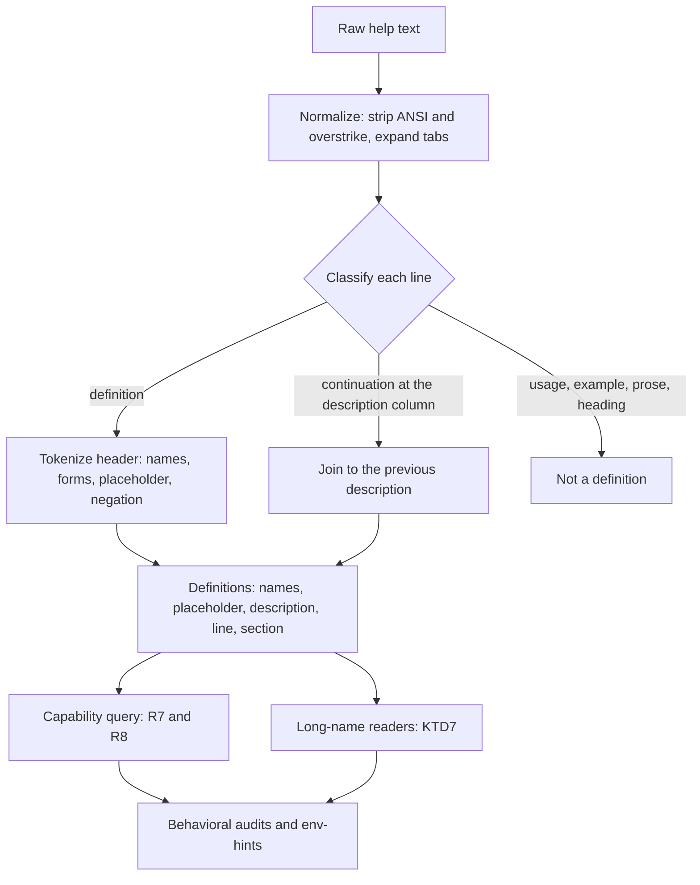
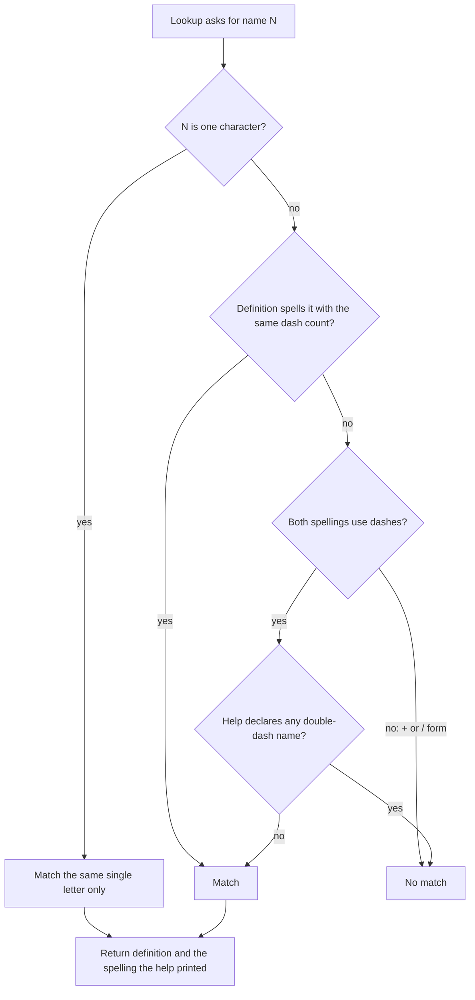
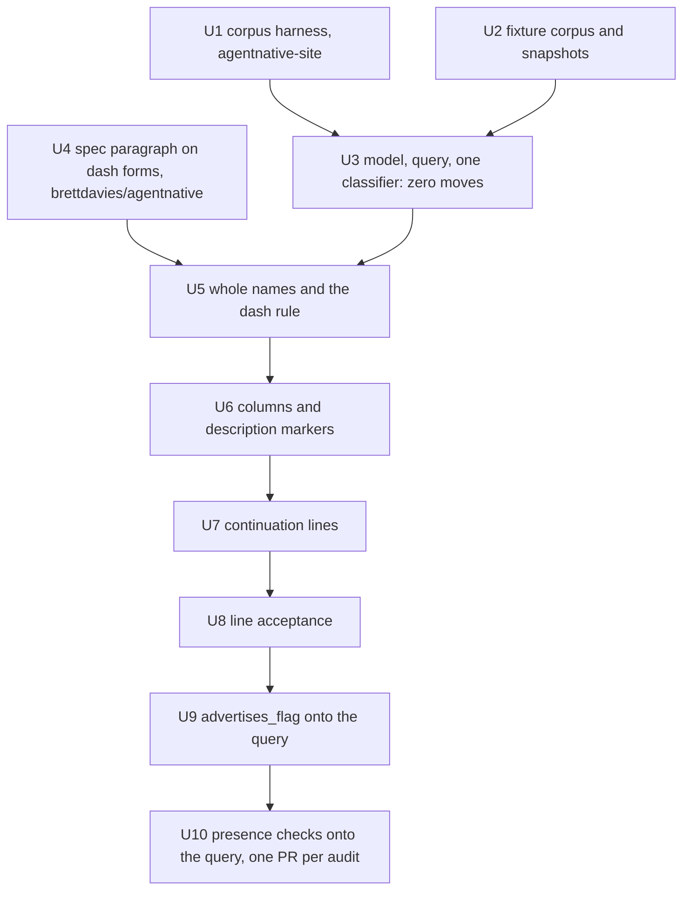

# Help-Flag Names Across Frameworks - Plan

## Goal Capsule

- **Objective:** Every row `anc` publishes that credits or denies a flag names a flag the audited CLI's help actually
  declares, whichever argument framework or hand-written layout printed that help, so a CLI author can find every flag a
  verdict names in their own `--help`, spelled as printed.
- **Means:** One shape-based definition grammar in the help probe that keeps every declared name whole (KTD1, KTD2,
  KTD3), and one capability query that every flag-presence lookup goes through (KTD5, KTD6), landed one rule per PR with
  a full-corpus before/after for each (KTD9, KTD10).
- **Product authority:** This plan owns how help text becomes flag definitions and how audits look a flag up by name. It
  does not own which flags an audit asks for, what a short letter means to an audit, the spec's requirement tiers, the
  scorecard schema, the registry, or the site's rescore and publish.
- **Execution profile:** Rust changes in `src/runner/help_probe/` and the behavioral audits that read flags, a
  checked-in corpus of help captures with parse snapshots, one before/after harness in agentnative-site's
  `docker/score/`, and one paragraph in the spec repo (brettdavies/agentnative). No schema change, no data migration.
- **Stop conditions:**
  - A capture shows a definition line that declares a bundle (`-Alh` meaning `-A -l -h`). That invalidates KTD1.
  - A row-moving PR's corpus diff, after U1's rerun rule, contains a move outside its predeclared expected moves that
    its own rule cannot explain.
  - U3's corpus diff moves any row, or any U2 snapshot changes in U3.
- **Who finishes:** `ce-work` lands one PR per unit, except U10, which lands one PR per audit; the CLI PRs stack on
  `dev`, U1 lands in agentnative-site and U4 in brettdavies/agentnative. Each row-moving PR carries its expected-moves
  table and corpus diff. Brett approves every merge. U1 to U4 merge on their own. The row-moving PRs (U5 to U10) land in
  one atomic stack merge once each has a matched corpus diff and Brett's approval, so `dev` never holds part of the
  series and no other anc release waits on it (R14). The site picks the change up through its anc bump and rescore after
  the next anc release, outside this plan.
- **Open blockers:** None.

---

## Product Contract

### Summary

Replace the help probe's flag reader with a grammar that records every name a definition line declares, whole and as
spelled, across the layouts clap, cobra and pflag, Go `flag`, urfave/cli, kingpin, kong, flaggy, argparse, click, typer,
commander, yargs, oclif, Thor, docopt, picocli, System.CommandLine and hand-written help print. Route every audit's
flag-presence lookup, including the ones that search raw help text today, through one query on that model. Land it in
steps that each move rows for one reason, proven on the full corpus.

### Problem Frame

`anc` audits a CLI by reading its `--help`. The shared parser in `src/runner/help_probe/mod.rs` keeps one short and one
long name per line, and `parse_short_flag` keeps only the first character after a single dash. So Go `flag`'s
`-force-copy` counts as `-f`, `-no-color` as `-n`, java- and cmake-style `-version` as `-v`, and lazygit's `-cd` as
`-c`. Published anc 0.6.0 scorecards carry the result: terraform and cmake pass `p7-should-verbose` through `-version`,
and terraform `force-unlock` is credited for `-force` only because it reads as `-f`.

The first-letter rule is the smallest of several readings that make published rows untrue:

- Column layouts lose their second column. lazygit loses 13 long names, and pandoc and shellcheck are told they
  advertise no `--format` flag although both list one.
- Later aliases overwrite earlier ones, so cmake's `-h,-H,--help,-help,-usage,/?` keeps no `-h`.
- Definitions at column 0 or inside box tables are skipped (rsync, ffmpeg, mlr, broot, typer). broot's `p1` env-var row
  skips because the tool "exposes no flags".
- Wrapped description lines that start with a dash are read as definitions: 112 of them across 20 captured helps. pixi's
  `-vvvv for trace)` becomes a `-v` flag.
- Audits that bypass the parser match substrings. `p7-quiet`, a MUST, passes eza, helm, scc and yq on `--no-quotes`,
  `--qps`, `-queue-size` and `-quotes`.

The repo's answers so far are per audit. `limit_flag.rs` reads a `-n` flag's description before crediting it, and its
doc comment names terraform's `-no-color` among the traps. #147 added `advertises_flag`, a second tokenizer that only
`p5-force-yes` uses, for declared single-dash names. Each new collision would need another guard.

### Key Decisions

- **The score is the score.** Rows move to whatever the corrected reading says, no rule is tuned toward or away from a
  tool's outcome, and attribution is the only acceptance question for a move. (session-settled: user-directed — chosen
  over judging moves by how a tool comes out: "The score is the score. We don't make decisions based on how an
  individual's site performs." Stated for web scores; this plan applies it to CLI rows.) Governs R12, R13, R14.
- **The help text is the record.** A flag the binary accepts but its help does not declare is not credited; terraform
  accepts `-h` and `-v` but declares only `-help` and `-version`. Governs R1, R6.
- **The help's own convention decides whether one dash and two are the same name.** Governs R8.
- **This plan covers flag names, not flag meanings.** Every presence lookup moves onto the model; what a short letter
  means to an audit (`-v, --version` counted as verbose) is a separate plan. Governs R9.

### Requirements

**Reading definitions**

- R1. Every name a definition line declares is kept whole, with its spelling as printed. No name is cut to its first
  character, and no token on a definition line is split into a bundle of letters.
- R2. Every alias on a definition line is kept, whatever separator (`,`, a space, `|`, ` / `, a column gap) or order the
  layout uses.
- R3. Placeholders, defaults and value annotations are never names, and `--[no-]x` declares both `--x` and `--no-x`. A
  name may contain `.`, `_`, digits and capitals, and a short may be a digit or punctuation (`-0`, `-?`, `-#`, `-.`,
  `-@`).
- R4. A definition is found wherever a supported layout prints one: column 0, a box-table row, a Thor `[--x]` row, an
  fzf `+x` row, a tab-indented line, and text carrying ANSI escapes or groff overstrike.
- R5. A wrapped description line is never a definition, even when it starts with a dash.
- R6. Usage synopses, examples and description prose yield no definitions.

**Looking flags up**

- R7. A single-letter name matches only the same single-letter name, so `-f` never matches `-force-copy`, `-format` or
  `-ffoo`.
- R8. In a help that declares no double-dash name on any definition line, a single-dash multi-character name is the same
  flag as its double-dash spelling, so terraform's `-force` satisfies a lookup for `--force`. In a help that declares
  any double-dash name, single-dash words are names of their own, so find's `-print` does not satisfy `--print`. Single
  letters, `+x` names and `/x` names never take part.
- R9. Every audit that asks whether a help declares a flag answers from the parsed definitions, apart from the prose and
  example matchers named under Scope Boundaries. None of the others decides flag presence by substring over raw help
  text.
- R10. Evidence that names a flag quotes a name the help declared, spelled as printed.
- R11. An audit that runs a flag it found runs the spelling the help declared.

**Shipping**

- R12. Every row the work moves across the corpus traces to exactly one rule, shown by a before/after over the full
  registry corpus, run in one scorer image with tool versions frozen and compared against an expected-moves list written
  before the run.
- R13. The scorecard schema and JSON shape do not change. Moves surface only as row `status`, `evidence` and
  `confidence`, and as the scorecard's `audience` and badge fields.
- R14. No anc release ships part of the series; intermediate states never reach published scorecards.

### Acceptance Examples

- AE1. Covers R1, R7.
  - **Given:** terraform `init -help` lists `-force-copy  Suppress prompts about copying state data...`.
  - **Then:** the definition's only name is `-force-copy`, and no lookup for `-f` matches it.
- AE2. Covers R1, R2.
  - **Given:** lazygit lists `-cd   --print-config-dir   Print the config directory`.
  - **Then:** the names are `-cd` and `--print-config-dir`, and a lookup for `-c` does not match.
- AE3. Covers R2.
  - **Given:** cmake lists `-h,-H,--help,-help,-usage,/? = Print usage information and exit.`
  - **Then:** the names are `-h`, `-H`, `--help`, `-help`, `-usage` and `/?`.
- AE4. Covers R8.
  - **Given:** terraform `force-unlock -help` lists only `-force`, and the help declares no `--` name.
  - **Then:** `p5-force-yes` credits the subcommand against `--force`.
- AE5. Covers R8.
  - **Given:** a find-style help that declares `--help` and `--version` beside `-print` and `-depth`.
  - **Then:** a lookup for `--print` does not match `-print`.
- AE6. Covers R5.
  - **Given:** pixi prints `-vvvv for trace)` on a wrapped line indented to its description column (column 23).
  - **Then:** the line joins the previous flag's description and declares nothing.
- AE7. Covers R9.
  - **Given:** eza lists `--no-quotes` and no quiet flag.
  - **Then:** `p7-quiet` does not pass.
- AE8. Covers R6.
  - **Given:** `ls -Alh` in an example line, or tmux's `usage: tmux [-2CDhlNuVv] ...` as its only flag text.
  - **Then:** neither yields a definition.
- AE9. Covers R3.
  - **Given:** git commit `-h` lists `-q, --[no-]quiet`, and curl lists `--http1.0` and `--http1.1`.
  - **Then:** git's names are `-q`, `--quiet` and `--no-quiet`, and curl's two names stay distinct.
- AE10. Covers R11.
  - **Given:** a help that declares `-format` and no `--` name.
  - **Then:** `p2-json-output` finds the format flag and probes with `-format json`, not `--format json`.

### Success Criteria

- Each row-moving PR's corpus diff, after U1's rerun rule, equals its predeclared expected moves, with no unexplained
  move across the series.
- One line classifier and one header tokenizer remain: `env_hints_bash::is_flag_line` and `flag_line_names` are gone.
- Every checked-in fixture's snapshot lists exactly the names its help declares, reviewed fixture by fixture.

### Scope Boundaries

Considered and not built:

- **Framework detection.** Shape rules separate every layout sampled, and terraform's hand-written help carries no
  framework fingerprint. Would change if a layout appears that shape rules cannot tell apart from prose.
- **A bundle backstop on definition lines.** No definition line in 177 captures and 21 framework probes declares a
  bundle, and the "every letter is a declared short" test misreads lazygit's `-cd` and mlr's `-nr`. Would change on a
  capture with a definition-line bundle (a stop condition).
- **Reading usage synopses.** Synopses are the one place bundles appear (`[-2CDhlNuVv]`), and they are ambiguous next to
  multi-letter names (picocli's `[-version-json]`). tmux and `git --help` keep reporting no definitions, and the
  presence checks in U10 lose matches they found in those synopses. Would change if a corpus row is wrong only because
  its tool declares flags solely in a synopsis.
- **Probing the binary for spelling.** Confirming that `--word` works for a `-word` tool costs a run per flag, and a run
  can act. Would change if an audit's question becomes the literal spelling an agent types.
- **A structured matched-flag field in scorecard JSON, or pass evidence for audits that write none.** Status moves, plus
  evidence where an audit already writes it, cover attribution; `p5-force-yes` passes keep writing no evidence. The site
  does not parse evidence. Would change if the site needs to render matched flags.
- **`error_probe.rs`'s `--output` plus `json` co-occurrence gate.** It is documented as deliberately lenient, and a
  false positive only triggers a probe that then reports what it observes.
- **Prose and example matchers.** `no_pager_behavioral.rs`'s pager words, `paired_examples.rs`'s JSON markers and the
  `HELP_ON_BARE_MARKERS` lists read prose and example lines on purpose; a definitions model would delete their signal.

### Deferred to Follow-Up Work

- **Short-letter meaning.** `-v, --version` passes `p7-should-verbose` in about ten tools (lazygit, make, bun, wrangler,
  opencode, trivy, gum, eza, vhs, dust), and `-f`, `-y`, `-q` and `-p` carry the same class. Deciding that a short
  letter means what its own definition says is an audit-semantics change: the spec gives `-v` to verbose (P7) and to
  version (P3), and `verbose_flag.rs::pass_with_short_form` pins `-v, --debug` as verbose. It is planned separately,
  after U6 makes column-layout pairs visible, with `limit_flag.rs`'s `-n` guard as its seed. The guard stays until then.
- **Value semantics behind a name.** A boolean `--[no-]color` satisfies `p6-may-color-flag` the same way any declared
  `--color` does today; whether the row should require `auto|always|never` belongs with the spec.
- clap's `[aliases: -y, --yes]` description annotations as declared names.
- Section awareness for example lines that begin with a flag at definition indent (sqlite-utils `insert`'s
  `--text --convert '...'`, gitleaks `detect`'s `--pipe ...`), which stay readable as definitions.
- `BinaryRunner` sets only `NO_COLOR=1` and inherits `TERM`, `COLUMNS` and `PAGER` from its caller, so help wraps
  differently in a terminal than in the scorer.
- Probing subcommands with the tool's own help spelling; terraform's subcommands answer `-help`.
- kubectl's grouped command headings (`Basic Commands (Beginner):`), a subcommand-parsing gap.
- `tests/dogfood.rs`'s `PENDING_FAILS` compares audit IDs against requirement-ID-prefixed strings and can never match.
- agentnative-site registry: `goose` resolves to pressly/goose in the scorer image while the registry names block/goose,
  and `sgpt` crashes in the image (missing `click`).

### Assumptions

Inferred without confirmation from the requester:

- "Sustainable" means no flag-presence lookup outside the shared model, so the raw-text presence checks (U10) are in
  scope; short-letter meaning is not.
- R8's help-level gate was chosen here over always-equivalent and always-strict matching; KTD6 records why.
- The corpus harness lands in agentnative-site, where the scorer image and registry live.

### Dependencies

- The site's `anc-scorer` image is built locally (`agentnative-site:docker/score/build.sh`), and every corpus run in the
  series pins one image ID.
- U5 merges only after U4's spec paragraph has merged, because R8 interprets requirement text the spec otherwise leaves
  silent.

### Sources / Research

- Framework layouts: clap_builder 4.6.7 `src/output/help_template.rs`; Go `flag` (<https://pkg.go.dev/flag>: "One or two
  dashes may be used; they are equivalent"); pflag (<https://github.com/spf13/pflag>); urfave/cli
  (<https://cli.urfave.org/v3/examples/flags/short-options/>); argparse
  (<https://docs.python.org/3/library/argparse.html>); click (<https://click.palletsprojects.com/en/stable/options/>);
  commander (<https://github.com/tj/commander.js>); yargs-parser `short-option-groups`
  (<https://github.com/yargs/yargs-parser>); oclif (<https://oclif.io/docs/flags>); Thor
  (<https://github.com/rails/thor/wiki/Method-Options>); docopt (<http://docopt.org/>); picocli §14.4.5
  (<https://picocli.info/>); System.CommandLine
  (<https://learn.microsoft.com/en-us/dotnet/standard/commandline/syntax>); POSIX Utility Syntax Guidelines 3 and 5
  (<https://pubs.opengroup.org/onlinepubs/9799919799/basedefs/V1_chap12.html>); GCC on grouping
  (<https://gcc.gnu.org/onlinedocs/gcc/Invoking-GCC.html>).
- `docs/plans/2026-09-16-1542-fix-hand-written-help-subcommand-parsing-plan.md`: generalize by shape, not framework.
- `docs/plans/2026-06-03-001-refactor-audit-philosophy-structure-over-vocabulary-plan.md`: the spec is canonical;
  structure over vocabulary.
- `docs/solutions/logic-errors/http-header-token-regex-prefix-sibling-false-match.md`: a whole-token matcher needs a
  negative test per collision shape.
- `docs/solutions/best-practices/cli-env-var-shape-heuristic-2026-04-21.md`: env-hints depends on the definition-line
  classifier.
- `docs/solutions/best-practices/calibrate-thresholds-against-real-corpus-2026-05-06.md` and
  `docs/solutions/best-practices/a-zero-result-is-a-claim-about-the-filter-not-evidence-of-absence.md`: write expected
  results before the run.
- `docs/solutions/tooling-decisions/docker-anc-binary-override-and-runtime-refresh-2026-05-24.md`: `--no-update` and the
  inject-binary PATH check.

---

## Planning Contract

### Key Technical Decisions

- KTD1. **Read definition-line names whole and infer no bundles.** Every framework renders a definition row from one
  declared option's names: clap writes `-{c}` from a `char`, pflag rejects multi-character shorthands, picocli moves any
  two-character name to the long column, and docopt's spec reads every line starting with `-` as an option description.
  Bundles appear only in synopses, examples and description prose, which R6 excludes. lazygit and mlr declare `-cd` and
  `-nr` beside `-c`, `-d`, `-n` and `-r` and parse them whole, so a letter-based backstop would misread real tools.
- KTD2. **Recognize layouts by shape, not by framework.** The help probe already generalizes by shape
  (`parse_command_blocks`, and the hand-written-help plan's `commands:` header rule). Published scorecards run in
  command mode, so source-based framework detection is unavailable, and terraform's help carries no Go `flag`
  fingerprint. Each rule is stated over columns, separators and markers and tested against fixtures from every framework
  that prints that shape.
- KTD3. **A definition holds an ordered list of names, each with its spelling and form.** The forms are single letter
  `-x`, single-dash word `-word`, double-dash `--word`, plus `+x` and slash `/x`. A definition also records its
  placeholder, its description (joined across continuation lines), and its line index and section heading. `Flag`'s
  `short` and `long` fields go. `Flag` has crate-internal consumers only (`src/runner/mod.rs` re-exports only
  `CommandBlock` and `HelpOutput`), so the fields change in place rather than gaining a side accessor; the
  hand-written-help plan's side accessor protected a consumer-facing type, which this is not. Keeping `short`/`long`
  beside a name list was the close alternative. It does not qualify for a bake-off because the shape is crate-internal
  and cheap to reverse, and keeping the two slots keeps the overwrite bug.
- KTD4. **One line classifier and one header tokenizer serve every caller.** `parse_flags`,
  `env_hints_bash::is_flag_line` and #147's `flag_line_names` each decide what a definition line is today. env-hints'
  ±4-line proximity window moves onto the shared classifier in U3, where both apply the same rule. `advertises_flag`
  collapses onto the query in U9, after U8 accepts tab-indented lines, because `flag_line_names` accepts any leading
  whitespace and an earlier collapse would drop a declared flag on a tab-indented line for one PR.
- KTD5. **Audits look flags up through a capability query on `HelpOutput`, never through field access.** An audit states
  the names it accepts. The query applies R7 and R8 and returns the matching definition and the spelling that matched.
  The audit quotes that spelling (R10), and an audit that then runs the flag runs that spelling (R11).
- KTD6. **One and two dashes are the same name only in a help that declares no double-dash name (R8).** Go `flag`
  documents one and two dashes as equivalent and prints every name with one dash, and terraform, actionlint and goose
  declare no `--` name. find, java, gcc and cmake print `--help` or `--version` beside their single-dash words and treat
  the forms as distinct. Always-equivalent was rejected because it credits find's `-print` as the `--print`
  non-interactive marker. Strict spelling was rejected because it denies terraform `force-unlock`'s `-force` and
  actionlint's `-verbose`, or forces both spellings into every audit's list. Built-in and `.anc.toml`-declared names
  follow the same rule, so a user who declares `--auto-approve` for a help that prints `-auto-approve` gets the match.
  `force_yes.rs::a_declared_flag_confirms_where_the_builtins_do_not` asserts that the built-in `--auto-approve` does not
  accept a listed `-auto-approve`; U5 rewrites it around a confirmation flag outside the built-ins. The help-level test
  is evaluated per probed help text, so terraform's subcommand helps each carry their own answer.
- KTD7. **A definition's long names are its double-dash names, plus its single-dash words in a help that declares no
  double-dash name (R8).** Every consumer that reads a definition's long name uses this one meaning:
  `secret_non_leaky_path.rs`'s secret-word scan, `subcommand_operations.rs`'s verb flags, `subcommand_arguments.rs`'s
  `is_help_flag` and `is_global`, and `subcommand_help.rs::first_flag`. U3 ports them with long names meaning
  double-dash names only, which is today's behavior, and U5 widens the meaning to R8's, with their moves in U5's
  expected moves. A java-style `-password` in a help that also declares `--help` stays outside the secret scan, as it is
  today.
- KTD8. **A checked-in fixture corpus with parse snapshots is the parser-level record.** Captures for every layout class
  live under `tests/fixtures/help/` with a provenance index, taken inside the scorer image with the environment `anc`
  itself runs targets in. An `insta` snapshot per fixture lists each definition's names and description. Every parser
  PR's snapshot diff shows what it changed at the parse level, and its corpus diff shows what that did to rows. The
  binary crate has no `lib.rs`, so the snapshot tests are in-crate unit tests that read the fixture files.
- KTD9. **Ship one rule per PR, each proven by a corpus before/after.** The order is a zero-move refactor (U3), whole
  names (U5), columns and description markers (U6), continuation lines (U7), line acceptance (U8), the `advertises_flag`
  collapse (U9), and the presence checks (U10, one PR per audit, per `CONTRIBUTING.md`). U6 precedes U7 because a GetOpt
  long-only row sits at the long column, deep enough to read as a continuation until the column grammar exists. U7
  precedes U8 so that admitting column-0 and box-table lines does not first admit their wrapped lines. Each PR's
  baseline is the previous PR's head built from source, never the published scorecards, which are anc 0.6.0 and behind
  `dev`. When `dev` moves under the stack, each PR whose base changed reruns its before/after before merge.
- KTD10. **The before/after harness runs both anc builds in one container from a pinned image.** `score-anc100.sh`
  writes into the site's committed `scorecards/` through the compose bind mount, `build.sh --from-source` rebuilds and
  retags `anc-scorer:latest`, and the registry's `anc` entry audits whatever `anc` is on `PATH` with itself. The harness
  runs `docker run` on one pinned image ID with both binaries and a scratch output directory under the gitignored
  `docker/score/out/`, holds the `anc` entry's target binary fixed while the auditor varies, and starts from an A/A run
  that records which rows flip between identical runs. Rows key on `(tool, id, audit_id)`, because one requirement can
  carry rows from two audits (`fan_out_per_row` in `src/scorecard/mod.rs`).

### High-Level Technical Design

Parse pipeline:



Header grammar, as directional guidance for U5 and U6:

```text
definition  := lead? group (sep group)* gap description?
lead        := box-edge | "["                 Thor long rows, typer and broot cells
group       := name placeholder?
name        := "--[no-]" word | "--" word | "-" word | "-" char | "+" char | "/" word
word        := alnum (alnum | "." | "_" | "-")*
placeholder := "<" .. ">" | "[" .. "]" | "=" value | "{" .. "}" | UPPER | go-type-word | "..."
sep         := "," | ", " | " " | "|" | " / " | column-gap
gap         := 2+ spaces | TAB | " # " | " = " | " -- " | " - "
```

A column gap differs from a description gap by what follows it: another name means a column, and prose means a
description.

Name match (R7, R8):



Unit sequence:



### Implementation Constraints

- Production code passes the crate's own audits, checked by `cargo test --test dogfood`.
- Fixture captures of proprietary tools are trimmed to the lines that pin a behavior, matching the existing
  `// Excerpts of <tool> <version>'s ...` convention.
- `limit_flag.rs` (lines 13-17) and `verbose_flag.rs` (lines 62-65) describe first-letter parsing as present behavior;
  U5 rewrites both comments.
- The grammar splits by concern under `src/runner/help_probe/flags/`: model and query, text normalization, line
  classification, header tokenization. Each file stays under the 200-line refactor trigger, tests excluded.
- Column positions are counted in characters after normalization, and every slice falls on a character boundary, so
  multibyte help text cannot panic the tokenizer.
- U5 to U10 land together in one atomic stack merge (R14).

### System-Wide Impact

- **Published scorecards.** Rows, `audience` and badge eligibility move on anc.dev only after the release and the site's
  rescore (R14). CLI authors read evidence that quotes their own help's spelling (R10).
- **`.anc.toml` users.** Declared `confirm_flags` follow R8. A declaration a no-`--` help needed (terraform's
  `-auto-approve` on `apply`) becomes redundant and keeps working.
- **Live scoring and MCP.** `/api/score` and `score_cli` run the anc baked into the site's sandbox image, so live scores
  follow the corpus only once that pin moves (Documentation / Operational Notes). `get_scorecard` serves the same JSON
  shape (R13).
- **Spec.** U4 adds a reading rule and no requirement; the spec's next release carries it, and the CLI picks it up
  through its normal spec sync.

---

## Implementation Units

| U-ID | Title                                                  | Files touched                                                                             | Depends on |
| ---- | ------------------------------------------------------ | ----------------------------------------------------------------------------------------- | ---------- |
| U1   | Corpus before/after harness                            | `agentnative-site:docker/score/`                                                          | none       |
| U2   | Help fixture corpus and characterization snapshots     | `tests/fixtures/help/`, `src/runner/help_probe/`                                          | none       |
| U3   | Definition model, query and one classifier, zero moves | `src/runner/help_probe/`, `src/audits/behavioral/`                                        | U1, U2     |
| U4   | Spec paragraph on dash forms                           | `brettdavies/agentnative:README.md`                                                       | none       |
| U5   | Read every declared name whole                         | `src/runner/help_probe/flags/header.rs`, `force_yes.rs`, `README.md`                      | U3, U4     |
| U6   | Column layouts and description markers                 | `src/runner/help_probe/flags/header.rs`                                                   | U5         |
| U7   | Wrapped description lines are not definitions          | `src/runner/help_probe/flags/classify.rs`                                                 | U6         |
| U8   | Column 0, box tables, brackets, plus rows              | `src/runner/help_probe/`                                                                  | U7         |
| U9   | `advertises_flag` onto the query                       | `src/runner/help_probe/mod.rs`, `force_yes.rs`                                            | U8         |
| U10  | Presence checks onto the query                         | `quiet.rs`, `flag_existence.rs`, `non_interactive.rs`, `json_output.rs`, `install_all.rs` | U9         |

### U1. Corpus before/after harness

- **Goal:** One command scores the full registry with two anc builds in one container and prints a row diff, writing
  nothing under the site's `scorecards/`.
- **Requirements:** R12, R13.
- **Dependencies:** None.
- **Files:** `agentnative-site:docker/score/compare.sh` (new), `agentnative-site:docker/score/README.md`.
- **Approach:**
  1. Build each anc from a detached worktree at the requested commit, without rebuilding or retagging the scorer image,
     and write the commit and the binary's sha256 to a manifest beside it. `anc --version` prints only the crate
     version, so it cannot identify a build.
  2. `docker run` one pinned image ID, not compose: registry read-only, both binaries read-only, output under
     `docker/score/out/compare/<label>/`, `AGENTNATIVE_HOME_CONFIG` pointed at an empty file as `tests/dogfood.rs` does,
     network mode held constant, and the terminal environment the publishing run gives targets (TTY allocation, `TERM`,
     `COLUMNS`) set and recorded.
  3. For each registry entry, run `anc audit --command <bin> --output json` with each build and the entry's
     `--audit-profile`, with the per-tool update step off. For the `anc` entry, keep the base build as the audited
     target for both runs.
  4. Diff rows keyed by `(tool, id, audit_id)` on `status`, `evidence` and `confidence`, and each scorecard's
     `audience`, `audience_reason`, `badge.score_pct`, `badge.eligible`, band and summary. Label a row "propagated from
     `<audit_id>`" when its antecedent moved in the same run, and flag a derived-field move with no row move as a
     harness bug.
  5. Report tools that did not run (cursor, grok and nvidia-smi are absent from the image; sgpt crashes; yazi needs a
     TTY) apart from moved rows.
  6. Refuse to run when a mounted binary's sha256 does not match its manifest, naming the binary, both hashes and the
     build command that refreshes it.
  7. Provide an A/A mode that runs one build twice and writes the rows that differ to a noise list. In a before/after,
     every moved tool and every noise-listed tool reruns three times per build, and a row counts as moved when its
     majority result differs between builds; a noise-listed row is never dropped unexamined.
  8. Provide a capture mode that saves, inside the pinned image, each registry tool's top-level `--help` and the
     `--help` of every subcommand anc's help probe lists, under `docker/score/out/captures/`. Row-moving PRs predict
     their moves from it (Verification Contract).
- **Patterns to follow:** `agentnative-site:docker/score/score-anc100.sh` (registry iteration, profiles, failure
  recording); `agentnative-site:docker/score/build.sh` (how the inject binary is built).
- **Test scenarios:**
  - The same commit as base and head over `--only ripgrep,terraform` reports zero moved rows.
  - Two commits that differ in one audit's verdict report exactly that row, plus any propagated row labeled as such.
  - A tool that fails to score under one build is reported as a scoring failure, not a moved row.
  - After a run, `git status` in the site checkout shows `scorecards/` unchanged.
  - A mounted binary whose sha256 differs from its manifest is refused before any tool runs.
  - A noise-listed row that flips in one rerun and holds in the other two is reported by its majority result.
- **Verification:** A full-registry A/A run of `dev` records the noise list and wall time and leaves the site tree
  clean.

### U2. Help fixture corpus and characterization snapshots

- **Goal:** Pin what the current parser reads from a capture of every layout class, so each later PR's parse change is a
  reviewed snapshot diff.
- **Requirements:** R12; the fixtures are the test surface for R1 to R6.
- **Dependencies:** None.
- **Files:** `tests/fixtures/help/` (captures plus a provenance index), `src/runner/help_probe/fixture_snapshots.rs`
  (new test module), `src/runner/help_probe/snapshots/`.
- **Approach:**
  1. Capture registry tools inside the pinned scorer image with the environment `BinaryRunner` gives a target
     (`NO_COLOR=1`, everything else as the scorer's container has it), stdout followed by stderr, as `HelpOutput::probe`
     combines them. Capture synthetic framework probes and non-registry references whose runtime that image lacks (Ruby
     for Thor, a JRE for picocli and `java -help`, a Go toolchain, Python 3.12 and 3.13) in a separate pinned runtime
     image with the same environment.
  2. Cover Go `flag` (actionlint and a stdlib probe), terraform top level plus `init`, `plan`, `apply` and
     `force-unlock`, flaggy (lazygit), mlr `sort`, cmake, GetOpt (pandoc, shellcheck), rsync, ffmpeg, Thor, typer and
     rich-click, broot, git `commit -h`, kingpin, kong, sed, yargs, curl, pixi, docker `run`, claude, picocli, click,
     argparse 3.12 and 3.13, java `-help`, a find-style help, aws `s3 ls help`, jq, files-to-prompt, tar, tmux, clap
     (anc itself), cobra (gh, kubectl), commander, oclif, docopt, and urfave/cli v2 and v3. Include the subcommand helps
     that audits probe for these tools.
  3. Record provenance per file: tool, version, the ID of the image it came from, argv, exit code and environment.
     Synthetic probes also record the framework version and the declared option set.
  4. Snapshot one line per definition: line index, names as spelled, and the description's first characters. The
     spelling carries the form (`-x`, `-word`, `--word`, `+x`, `/x`), so U3 renders the same snapshot from its new
     model.
  5. Make the snapshot renderer runnable over any directory of captures, as an ignored test driven by an environment
     variable, so a PR can render U1's full capture set at its base and at its head and diff the two.
- **Execution note:** Characterization only. The snapshots record today's output, wrong readings included.
- **Test scenarios:**
  - Every fixture in the index has a snapshot, and every fixture file is indexed; an orphan on either side fails the
    test.
  - The terraform `init` snapshot shows `-f` for `-force-copy` and `-n` for `-no-color`, the reading U5 removes.
- **Verification:** `cargo test` passes with the snapshot set committed, and the snapshots of the tools named in the
  Problem Frame have been read against their captures.

### U3. Definition model, query and one classifier, zero moves

- **Goal:** Every flag-reading call site goes through the new model and query, while every parse result and every row
  stays exactly as it is.
- **Requirements:** R7, R8 (inert until U5), R13; KTD3, KTD4, KTD5.
- **Dependencies:** U1, U2.
- **Files:** `src/runner/help_probe/mod.rs`, `src/runner/help_probe/flags/` (new module, moved out of the current
  `mod.rs`: the model and query in `flags/mod.rs`, the line classifier in `flags/classify.rs`, the header tokenizer in
  `flags/header.rs`), `src/runner/help_probe/env_hints_bash.rs`, `src/runner/help_probe/fixture_snapshots.rs`,
  `CONTRIBUTING.md`, and under `src/audits/behavioral/`: `color_flag.rs`, `cursor_pagination.rs`, `env_hints.rs`,
  `examples_subcommand.rs`, `force_yes.rs`, `json_aliases.rs`, `limit_flag.rs`, `more_formats.rs`,
  `no_pager_behavioral.rs`, `raw_flag.rs`, `rich_tui.rs`, `schema_print.rs`, `secret_non_leaky_path.rs`,
  `subcommand_arguments.rs`, `subcommand_examples.rs`, `subcommand_help.rs`, `subcommand_operations.rs`,
  `timeout_behavioral.rs`, `verbose_flag.rs`.
- **Approach:**
  1. Introduce the definition model (KTD3), filled by the current tokenizer, which still yields at most one short and
     one long per line, first letter included.
  2. Add the capability query (KTD5) with R7 and R8. R8 has no effect yet, because the tokenizer produces no single-dash
     words.
  3. Port each call site faithfully. `secret_non_leaky_path.rs`, `subcommand_operations.rs`, `subcommand_arguments.rs`,
     `subcommand_help.rs` and `limit_flag.rs` read fields directly today. `first_flag`, `is_help_flag` and `is_global`
     keep their long-first rules, with a long name meaning a double-dash name (KTD7).
  4. Replace `env_hints_bash::is_flag_line` with the shared classifier, defined as the line rule both apply today
     (space-led, dash-led, not `---`) rather than "the line yields a definition", so env-hints' proximity windows keep
     their size.
  5. Keep `CONTRIBUTING.md`'s three-tool before/after for contributors, and add that a maintainer runs the U1
     full-corpus harness before a scoring-engine change merges, naming the harness command and linking
     agentnative-site's `docker/score/README.md`.
- **Execution note:** The proof is the absence of change: U2's snapshots stay byte-identical, and the U1 harness reports
  zero moved rows, after its rerun rule, between `dev` and this branch.
- **Patterns to follow:** `HelpOutput`'s lazy `OnceLock` accessors; `subcommand_help.rs::coverage` for lookups across
  subcommand and top-level help.
- **Test scenarios:**
  - The existing audit tests pass unchanged; they characterize today's verdicts.
  - A lookup for `-f` against `-f, --force` returns `-f`, and a lookup for `--force` returns `--force`.
  - A lookup for `--force` against a hand-built definition holding `-force`, in a help with no `--` name, returns
    `-force`; the same definition in a help that also declares `--help` does not match. Both are built directly, because
    the tokenizer cannot produce `-force` yet.
  - A lookup for `--print` never matches a `+print` or `/print` name.
  - env-hints proximity tests in `env_hints_bash.rs` give the same results through the shared classifier.
- **Verification:** U2 snapshots unchanged, zero moved rows on the corpus, and `cargo test --test dogfood` unchanged.

### U4. Spec paragraph on dash forms

- **Goal:** The spec states how requirement text that names a flag applies to single-dash help, so R8 applies a written
  rule.
- **Requirements:** R8.
- **Dependencies:** None.
- **Files:** `brettdavies/agentnative:README.md` (the "Reading the spec" section),
  `brettdavies/agentnative:CHANGELOG.md` through the repo's release flow.
- **Approach:** One paragraph: a requirement names a flag by its double-dash spelling; a tool whose help declares no
  double-dash name, the Go `flag` convention where one and two dashes are the same flag, meets it with the single-dash
  spelling; a single letter is a different name and meets only a requirement that names that letter.
- **Test expectation:** none -- prose only; the spec repo's markdownlint, Vale and prose checks gate it.
- **Verification:** Merged to the spec repo's `dev`, and U5's PR links it.

### U5. Read every declared name whole

- **Goal:** The tokenizer records every name a definition line declares, whole and as spelled (KTD1), and the query's
  dash rule takes effect.
- **Requirements:** R1, R2 (separators within a header), R3, R7, R8, R10; KTD6, KTD7.
- **Dependencies:** U3, U4.
- **Files:** `src/runner/help_probe/flags/header.rs`, `src/runner/help_probe/flags/mod.rs` (query),
  `src/runner/help_probe/snapshots/`, `src/audits/behavioral/force_yes.rs`,
  `src/audits/behavioral/secret_non_leaky_path.rs`, `src/audits/behavioral/limit_flag.rs` and
  `src/audits/behavioral/verbose_flag.rs` (doc comments), `src/anc_toml/mod.rs` (doc example), `README.md`,
  `tests/fixtures/go-flag-help/` (new end-to-end fixture), `tests/integration.rs`.
- **Approach:**
  1. Split the header, the text before the description gap, into names on `,`, a single space, `|` and ` / `, keeping
     every name in order.
  2. End a name where a placeholder starts and record the placeholder; expand `--[no-]x`; keep `.`, `_`, digits and
     capitals in names, and digit and punctuation shorts.
  3. Widen the long-name readers to R8's long names (KTD7).
  4. Rewrite `force_yes.rs::a_declared_flag_confirms_where_the_builtins_do_not` around a confirmation flag outside the
     built-ins (KTD6).
  5. Update README's `confirm_flags` paragraph and the `src/anc_toml/mod.rs` example: names match whole, a single-dash
     name matches its double-dash spelling in a help with no double-dash names, and the example uses a real tool's
     confirmation flag that is not built in.
  6. Rewrite the doc comments in `limit_flag.rs` and `verbose_flag.rs` to present behavior; the `-n` guard itself stays
     (Deferred to Follow-Up Work).
  7. When a lookup misses only because R8 keeps a single-dash word distinct in a help that declares double-dash names,
     the row's deny evidence says so and names the declared word, for example
     `-verbose is declared, but this help also declares double-dash names, so it does not count as --verbose`.
  8. Add a README section on how behavioral audits read `--help`: definition lines count and usage lines, examples and
     prose do not; names are read whole; the dash rule; and how to report a misread through the false-positive issue
     template with the tool's `--help` output. U6 to U8 extend it as each rule lands.
- **Patterns to follow:** the per-line truth table in
  `limit_flag.rs::n_counts_as_a_limit_flag_only_when_it_bounds_a_count`, one `(line, expected names)` row per framework
  shape, each tagged with its tool and version; real-tool excerpts as `const <TOOL>_HELP` strings, as in
  `limit_flag.rs`'s test module.
- **Execution note:** Write the negative tests first and observe each fail at U3's head: `-force-copy` must not satisfy
  `-f`, `-version` must not satisfy `-v`, `-cd` must not satisfy `-c`, `-LR[A][H]` must not satisfy `-L`,
  `-Werror=<category>` must not satisfy `-W`, and `-no-color` must not satisfy `-n`.
- **Test scenarios:**
  - Covers AE1. In the terraform `init` fixture, `-force-copy`, `-no-color` and `-var` are whole names, and no `-f` or
    `-n` exists.
  - Covers AE3. The cmake line yields six names, including `-h` and `/?`.
  - Covers AE4. terraform `force-unlock`, which lists only `-force`, is credited by `p5-force-yes`.
  - Covers AE5. A find-style help with `--help` does not credit `-print` for `--print`.
  - A help that declares `--help` beside `-verbose` warns on `p7-verbose`, and the evidence names `-verbose` and why it
    does not count.
  - Covers AE9. git's `-q, --[no-]quiet` yields three names, and curl's `--http1.0` and `--http1.1` stay distinct.
  - cmake's `-W<category>` is `-W` with placeholder `<category>`, `-Werror=<category>` is `-Werror`, and grep's `-NUM`
    stays `-NUM`.
  - java's `-cp <class search path of directories and zip/jar files>` yields `-cp` with its spaced placeholder.
  - argparse 3.12's `-n N, --limit N` and 3.13's `-n, --limit N` yield the same names.
  - sed's `-n, --quiet, --silent` and yargs' `-o, --output, --out` keep all three names.
  - Space- and pipe-separated aliases: docopt's `-h --help`, commander's `-y --yes`, java's `-? -h -help`.
  - Punctuation shorts: rg's `-.`, curl's `-#`, eza's `-@`.
  - A synthetic definition line `-Alh  list all, long, human` yields one name, `-Alh`.
  - No fixture, and no help whose header or description carries multibyte text (box-drawing cells, CJK descriptions),
    makes the tokenizer panic, and `NON_ENGLISH_HELP` parses as it does today.
  - A Go-style help that declares `-token` with no file or env alternative is scanned by `secret_non_leaky_path.rs`; a
    help that declares `--help` beside `-password` leaves `-password` out of the scan.
  - In terraform's help, a subcommand's `-compact-warnings` no longer counts as global through the top level's `-chdir`,
    and `-help` counts as a help flag.
  - A `.anc.toml` that declares `--auto-approve` for a help printing `-auto-approve` with no `--` name gets the match,
    and the evidence names the declaration as it does today.
  - Integration: a `tests/fixtures/go-flag-help/` sh script printing Go `flag`-style help (single-dash words, no `--`
    name, a `destroy` subcommand that lists `-force`, a top level that lists `-version` and no verbose flag), audited
    with `anc audit <path> --output json` as `test_handwritten_help_fixture_reports_real_subcommands` does, yields a
    `p5-force-yes` pass and a `p7-verbose` warn.
- **Verification:** The snapshot diff is read line by line, and the corpus diff equals the expected moves. Seed rows:
  terraform and cmake `p7-should-verbose` pass to warn (`-version` no longer reads as `-v`); actionlint
  `p7-should-verbose` stays pass through `-verbose`; actionlint `p6-may-color-flag` warn to pass and
  `p2-may-more-formats` skip to evaluated; terraform `p5-must-force-yes` unchanged, still a fail on `destroy`, whose
  help lists no confirmation flag, with `force-unlock` still credited, now through `-force`; terraform
  `p3-must-subcommand-examples` exemptions recomputed from whole names; new `secret_non_leaky_path` rows from
  single-dash secret names in helps with no `--` name; deny rows on helps that declare double-dash names whose evidence
  gains step 7's near-miss note; the rest computed from the full-corpus parse diff before the run. lazygit's long names
  stay hidden until U6, so its help reads as having no `--` name in this PR; no lookup asks for a name lazygit spells
  with one dash, so no lazygit row moves for that reason.

### U6. Column layouts and description markers

- **Goal:** The header's end is found in comma-less column layouts and after non-space description markers, so
  second-column names and marker-separated descriptions are read.
- **Requirements:** R2 (column gaps), R10.
- **Dependencies:** U5.
- **Files:** `src/runner/help_probe/flags/header.rs`, `src/runner/help_probe/snapshots/`, `README.md` (the help-reading
  section).
- **Approach:**
  1. After a gap, a token that parses as a name continues the header as another column, and prose ends it (KTD2's "what
     follows" rule). GetOpt long-only rows indented to the long column are definitions aligned with the rows around
     them.
  2. Recognize ` # ` (Thor), ` = ` and a touching `=` (cmake), ` -- ` (ffmpeg long help), ` - ` (qmd) and TAB (Go `flag`
     bool rows, kubectl) as description markers.
- **Patterns to follow:** the truth-table shape U5 uses, extended with column-layout rows.
- **Test scenarios:**
  - Covers AE2. lazygit's `-cd   --print-config-dir   Print the config directory` yields `-cd` and `--print-config-dir`,
    and a lookup for `-c` does not match; its `-v    --version` yields `-v` and `--version`; all 13 long names are
    present.
  - pandoc's `-f FORMAT, -r FORMAT  --from=FORMAT, --read=FORMAT` yields four names, and shellcheck's
    `-f FORMAT      --format=FORMAT` yields `-f` and `--format`.
  - files-to-prompt's `--ignore-files-only   --ignore option...` and tar's `--null   -T reads...` keep the flag-led text
    as description.
  - Go `flag`'s `-f\tforce` yields description `force`.
  - cmake's `-S <path-to-source>  = Explicitly specify a source directory.` yields `-S` with its description.
- **Verification:** Snapshot diff reviewed; the corpus diff equals the expected moves. Seed rows: shellcheck and pandoc
  `p2-may-more-formats` skip to evaluated, shellcheck `p6-may-color-flag` warn to pass, lazygit rows that depend on its
  long names, and `p7-limit` rows where the `-n` guard reads a newly filled description.

### U7. Wrapped description lines are not definitions

- **Goal:** A dash-led line indented to the previous definition's description column joins that description instead of
  declaring a flag.
- **Requirements:** R5.
- **Dependencies:** U6, which supplies the description column.
- **Files:** `src/runner/help_probe/flags/classify.rs`, `src/runner/help_probe/snapshots/`, `README.md` (the
  help-reading section).
- **Approach:**
  1. Track the description column each definition sets, including next-line descriptions (Go `flag`'s `4 spaces + TAB`,
     clap's long help at indent 10, kubectl's TAB), where the first description line sets it.
  2. Treat a dash-led line indented at or past that column as continuation, including picocli's continuation two columns
     past it. A blank line, a heading or a new section resets the column.
  3. For rows with no description (pandoc), use U6's column positions instead.
  4. Join continuation text into the description.
- **Execution note:** Pin each case as a row in a per-line truth table, the shape of
  `limit_flag.rs::n_counts_as_a_limit_flag_only_when_it_bounds_a_count`.
- **Test scenarios:**
  - Covers AE6. pixi's `-vvvv for trace)` joins the previous description.
  - docker `run`'s `-1 for unlimited)`, claude's `--append-system-prompt[-file], --add-dir` continuation, terraform
    `init`'s `-enable-pluggable-state-storage-experiment flag present.` and delta's prose naming git's `--color-moved`
    declare nothing.
  - clap's long-only row at indent 6 after a short row at indent 2 stays a definition; deeper indent alone is not
    continuation.
  - lazygit's `--profile` at indent 10 against 4 stays a definition.
  - actionlint's `-format string` followed by a line that starts with four spaces and a TAB gets that text as its
    description.
  - A dash-led line after a blank line and a new heading is classified fresh, not as continuation.
  - pandoc's long-only row at its long column, after a row with no description, stays a definition (step 3).
- **Verification:** The snapshots drop the wrapped-line definitions U2 recorded, fixture by fixture, and the corpus diff
  equals the expected moves, which list the rows that relied on a phantom name. Real flags declared only in prose (rg's
  `--no-context-separator`, fd's hidden `--newer` and `--older`) stop counting, as "the help text is the record" says.

### U8. Column 0, box tables, brackets, plus rows

- **Goal:** Definitions are found in the layouts the classifier skips today.
- **Requirements:** R4, R6.
- **Dependencies:** U7.
- **Files:** `src/runner/help_probe/flags/normalize.rs` (new: cleanup before classification),
  `src/runner/help_probe/flags/classify.rs`, `src/runner/help_probe/flags/header.rs` (box-table rows),
  `src/runner/help_probe/snapshots/`, `README.md` (the help-reading section).
- **Approach:**
  1. Normalize before classifying: strip ANSI (broot ignores `NO_COLOR`), groff overstrike `X\bX` and box-drawing cell
     edges, and expand TABs.
  2. Accept a definition at any indent, tab indents and column 0 included, when it has a description gap, and reject
     column-0 dash text without one.
  3. Accept rows that begin with `[--` (Thor) and `+x` (fzf).
  4. Read box-table rows whose long name comes first and whose short sits in its own cell (typer, rich-click, broot).
- **Patterns to follow:** the truth-table shape U5 uses; `parse_command_blocks` for reading a layout by column position.
- **Test scenarios:**
  - rsync's column-0 `--verbose, -v            increase verbosity` yields both names.
  - ffmpeg's `-y                  overwrite output files`, `-n                  never overwrite output files` and
    `-loglevel loglevel  set logging level` become definitions.
  - mlr `sort`'s `-nr` and `-tr|-rt` become definitions.
  - Thor's `-f,        [--force]   # desc` and `[--dry-run], [--no-dry-run], [--skip-dry-run]  # desc` yield their
    names.
  - typer's `│ --limit  -n  <int>  desc │` and broot's `│  -d    │--dates   │Show the last modified date│` yield their
    names.
  - aws `s3 ls help`'s overstruck options yield clean names.
  - A Go `flag` help indented with a TAB yields its definitions.
  - biome's `--watch] [PATH]...`, helm's `--hide-secret flag. Please...` and tar's `--format=gnu -f- -b20 ...` at column
    0 are rejected.
  - Covers AE8. tmux's synopsis-only help yields no definitions.
- **Verification:** Snapshot diff reviewed; the corpus diff equals the expected moves. Seed rows: broot's and rsync's
  `p1-must-env-var` leave skip and are evaluated, rsync `p7-should-verbose` warn to pass, broot's color row, ffmpeg's
  and mlr's rows that read newly visible definitions, and `p1-must-env-var` rows whose env-hints proximity window sees
  newly accepted lines.

### U9. `advertises_flag` onto the query

- **Goal:** Declared `.anc.toml` flags are matched by the same query as built-ins, and `flag_line_names` is deleted
  (KTD4).
- **Requirements:** R7, R8, R10.
- **Dependencies:** U8.
- **Files:** `src/runner/help_probe/mod.rs`, `src/audits/behavioral/force_yes.rs`.
- **Approach:** Replace `advertises_flag`'s single-dash branch with the query, and delete `flag_line_names`.
- **Patterns to follow:** `force_yes.rs`'s existing precedence, where built-ins match first and a declared flag's pass
  carries its `.anc.toml` source in evidence.
- **Test scenarios:**
  - A declared `-auto-approve` on a terraform `apply` fixture still confirms.
  - A declared flag that appears only on a continuation line no longer confirms.
  - A declared flag on a tab-indented definition line still confirms.
- **Verification:** The corpus diff equals the expected moves: declared-flag passes that came from lines the model now
  rejects, if any.

### U10. Presence checks onto the query

- **Goal:** `p7-quiet`, `p1-flag-existence`, `p1-non-interactive`, `p2-json-output`'s flag detection and
  `install_all.rs` decide flag presence from definitions, not substrings.
- **Requirements:** R9, R10, R11.
- **Dependencies:** U9.
- **Files:** `src/audits/behavioral/quiet.rs`, `src/audits/behavioral/flag_existence.rs`,
  `src/audits/behavioral/non_interactive.rs`, `src/audits/behavioral/json_output.rs`,
  `src/audits/behavioral/install_all.rs`, `tests/fixtures/handwritten-help/`, `tests/integration.rs`.
- **Patterns to follow:** `flag_existence.rs::contains_flag`'s tests, kept as negative cases against the query.
- **Approach:**
  1. Keep each audit's vocabulary as it is (`--quiet` and `-q`; `GATE_FLAGS`; the flag entries of
     `AGENTIC_FLAG_MARKERS`; `--output` and `--format`; `--all`) and change only how it is matched.
  2. Remove `flag_existence.rs::contains_flag` and `non_interactive.rs`'s spacing-based markers (`"-y,"`, `" -p "`);
     `-p` and `-y` match only as declared single letters.
  3. `json_output.rs` probes with the spelling the query returns (R11), and a prefix sibling such as `--output-format`
     no longer triggers the probe.
  4. `HELP_ON_BARE_MARKERS` and other prose markers stay raw.
  5. Each audit's deny evidence names what it searched, for example
     `no option definition in --help declares --quiet or -q; usage lines are not read`, so a flag shown only in a usage
     line does not make the evidence false. The reworded evidence on every existing deny row is in that PR's expected
     moves.
- **Execution note:** Land one PR per audit, as `CONTRIBUTING.md` asks of false-positive fixes, each with its own
  before/after. `p7-quiet`, `p1-non-interactive` and `p2-json-output` are three of the four audits behind the
  scorecard's `audience` (`SIGNAL_AUDIT_IDS` in `src/scorecard/audience.rs`), and `p2-json-output` is the antecedent of
  `p2-must-schema-print` and `p2-should-schema-file`, so each of those PRs lists `audience`, badge and propagated-row
  moves beside its own rows.
- **Test scenarios:**
  - Covers AE7. eza (`--no-quotes`), helm (`--qps`), scc (`-queue-size`) and yq (`-quotes`) warn on `p7-quiet`.
  - `-q, --quiet` passes `p7-quiet`, and a help that mentions `-q` only in a usage line does not.
  - `--print-json` does not satisfy `--print`, carried over from `contains_flag`'s tests.
  - `-p, --print` satisfies the non-interactive gate.
  - Covers AE10. A help declaring `-format` with no `--` name is probed with `-format json`.
  - `--output-format` alone does not trigger `json_output.rs`'s probe.
  - `--allow` alone does not pass `install_all.rs`.
  - A find-style help that declares `--help` beside `-print` does not satisfy `p1-non-interactive`'s `--print` marker
    (R8).
  - Each audit's deny evidence names its search scope (step 5), and a flag shown only in a usage line leaves that
    evidence true.
  - Integration: a hand-written help fixture that mentions `-q` only in its usage line, audited with
    `anc audit <path> --output json`, yields a `p7-quiet` row that does not pass, and the scorecard's `audience` counts
    it.
- **Verification:** Each PR's corpus diff equals its expected moves. Seed rows for `quiet.rs`: eza, helm, scc and yq
  `p7-must-quiet` pass to warn, with helm, scc and yq moving from agent-optimized to mixed `audience`. The other four
  PRs compute theirs from the full-corpus parse diff before the run; tools that declare flags only in a synopsis lose
  matches and are named in that PR.

---

## Verification Contract

| Gate                       | Command or procedure                                                                                                                                                                                                                                                                   | Applies to                |
| -------------------------- | -------------------------------------------------------------------------------------------------------------------------------------------------------------------------------------------------------------------------------------------------------------------------------------- | ------------------------- |
| Pre-push battery           | `scripts/hooks/pre-push`: `cargo fmt --check`, `cargo clippy -- -D warnings`, `cargo test`, `cargo deny check`, Windows scan                                                                                                                                                           | U2, U3, U5 to U10         |
| Self-audit                 | `cargo test --test dogfood` (fails on any `p2-*` or `p5-*` fail); other self-audit moves show in the corpus `anc` row, whose target U1 holds fixed                                                                                                                                     | U3, U5 to U10             |
| Snapshots                  | `cargo insta test`, then review: every changed snapshot line follows from the unit's rule                                                                                                                                                                                              | U2, U3, U5 to U10         |
| Negatives observed failing | Stash the unit's source change, run its new negative tests, and quote the failure output in the PR                                                                                                                                                                                     | U5 to U10                 |
| Expected moves             | A table of tool, row `id`, `audit_id`, before, after and rule, plus derived `audience` and badge moves, written into the PR description before the corpus run from the base-versus-head parse diff over U1's full capture set                                                          | U5 to U10 (U3's is empty) |
| Corpus before/after        | U1 harness on one pinned image, base = the previous unit's head, head = this unit's head, full registry, update step off; the diff, with noise-listed rows decided by U1's rerun rule, must equal the expected moves, and an extra move blocks merge until traced or the rule is fixed | U3, U5 to U10             |
| Harness smoke              | `dev` against itself on the full registry: noise list recorded, site tree clean                                                                                                                                                                                                        | U1                        |
| Spec prose                 | The spec repo's own CI (markdownlint, Vale, prose checks)                                                                                                                                                                                                                              | U4                        |

---

## Definition of Done

- Every flag-presence lookup in `src/audits/behavioral/` goes through the capability query, apart from the matchers
  named under Scope Boundaries.
- `parse_short_flag`'s first-letter reading, `flag_line_names` and `env_hints_bash::is_flag_line` are gone.
- Every row-moving PR carries an expected-moves table and a corpus diff that match, after U1's rerun rule.
- README's `.anc.toml` section, the `src/anc_toml/mod.rs` example, `CONTRIBUTING.md`'s before/after rule, and the doc
  comments in `limit_flag.rs` and `verbose_flag.rs` describe present behavior.
- README's section on how behavioral audits read `--help` states every rule U5 to U8 land, with real help lines, and
  points misread reports at the false-positive issue template.
- The spec paragraph on dash forms is merged and linked from U5's PR.
- U5 to U10 landed in one atomic stack merge.
- Code from abandoned approaches is removed from the diff.
- Per unit: that unit's Verification holds.

---

## Risks & Dependencies

| Risk                                                                                                                                | Mitigation                                                                                       |
| ----------------------------------------------------------------------------------------------------------------------------------- | ------------------------------------------------------------------------------------------------ |
| A Go `flag` tool whose help happens to declare one `--` name loses dash equivalence                                                 | Accepted in KTD6; evidence quotes the declared spelling, so the row is checkable                 |
| Timing-sensitive rows (`p1-non-interactive` warns on a timeout, and it feeds `audience`) flip between runs and get blamed on a rule | U1's noise list and its majority-of-three rerun rule                                             |
| Continuation and column-0 rules misread prose as definitions, or the reverse                                                        | Rejection cases pinned per fixture in U7 and U8; every snapshot change is reviewed               |
| A real flag declared only in prose stops counting                                                                                   | Follows "the help text is the record"; listed in U7's expected moves                             |
| Fixture captures drift from current framework output                                                                                | Provenance index per capture; argparse 3.12 and 3.13 both pinned for the one known layout change |
| The harness runs a stale or wrong anc binary                                                                                        | U1 checks each binary's sha256 against the manifest written when it was built                    |
| The harness gives targets a different terminal environment than the publishing run                                                  | U1 sets and records the publishing run's TTY allocation, `TERM` and `COLUMNS`                    |
| `dev` moves under the stack and changes what a rung moves                                                                           | KTD9: rerun the before/after for each PR whose base changed                                      |

---

## Documentation / Operational Notes

- Each row-moving PR's `## Changelog` names the user-visible change, for example "anc reads single-dash flags such as
  `-force-copy` whole", because the generated CHANGELOG is built from PR bodies.
- The series ships in the next minor anc release after its atomic merge (R14). Handed to agentnative-site, outside this
  plan: its rescore after that release runs frozen in one image and splits its diff into "dev since 0.6.0" and "this
  series"; cursor and nvidia-smi, scored outside the image, get the same treatment; and its live-scoring sandbox pin
  moves to the same anc release so live scores and the corpus share one rule set.
- After the series, record the cross-framework flag grammar as a `docs/solutions/` learning, linked from the
  env-var-shape and pager-matcher learnings.

---

## Engineering review

Target: this plan, reviewed with `/plan-eng-review` on 2026-10-06 at `f74f497`. Every decision below was taken at its
recommended option under Brett's standing instruction for this session: "don't ask me any questions, don't ask me to
approve any commands. do not block yourself."

### Scope Challenge

- **What already exists:** `HelpOutput`'s lazy `OnceLock` accessors (`src/runner/help_probe/mod.rs:152-155`),
  `parse_command_blocks` for column reading, `insta` as a dev-dependency (`Cargo.toml:91`), `.gitattributes` keeping
  `**/fixtures/**` and `*.snap` byte-exact, the `tests/fixtures/handwritten-help/tally` end-to-end pattern driven by
  `tests/integration.rs`, `limit_flag.rs`'s per-line truth table, and the site's `score-anc100.sh` and `build.sh`. The
  plan reuses each.
- **Minimum change:** every unit maps to a requirement; no unit is deferrable without dropping one. Short-letter
  meaning, synopsis reading and clap alias annotations are already deferred.
- **Complexity:** about 40 files touched (the 19 flag-reading audit files in U3, five presence audits in U10, the
  help-probe module, fixtures, `README.md`, `CONTRIBUTING.md`, `src/anc_toml/mod.rs`, `tests/integration.rs`, two site
  files, one spec file) and three new components (the `flags/` module, the snapshot test module, the site harness). The
  gate trips; D1 resolves it.
- **Search check:** no new architectural pattern; the plan reuses `insta` snapshots and the site's scorer image.
  External search not run.
- **TODOS cross-reference:** the repo has no `TODOS.md`; deferred work lives in this plan's Deferred to Follow-Up Work.
- **Distribution:** no new shipped artifact; the harness is a maintainer tool in agentnative-site.

Scope record: feature answers: none proposed; structure: A (D1, auto-decided); accepted scope: the plan's ten units as
written; pending remedies: none. Result: scope accepted as-is.

### 1. Architecture review

- [P2] (confidence: 7/10) Implementation Units index, U5 to U7 rows — every grammar rule lands in one new
  `src/runner/help_probe/flags.rs`, beside a `mod.rs` that is already 1,038 lines. Normalization, line classification,
  header tokenization and the query would share one file past the 200-line refactor trigger.

Dispositions: A1 accepted (D2): the grammar splits into `src/runner/help_probe/flags/` by concern.

### 2. Code quality review

- [P3] (confidence: 6/10) U6 step 1 and U7 step 1 — the new rules compute description columns and column gaps and cut
  lines at them. Today's `parse_short_flag` (`src/runner/help_probe/mod.rs:375-387`) reads `bytes[1] as char` and is
  panic-free only because it accepts ASCII alone; a column counted in characters and used as a byte offset panics on
  multibyte text such as `NON_ENGLISH_HELP` (`mod.rs:667`) or box-drawing cells.

KTD4's consolidation passes the shared-code rubric with three verified callers: `parse_flags` (`mod.rs:289`),
`flag_line_names` (`mod.rs:333`) and `env_hints_bash::is_flag_line` (`env_hints_bash.rs:122`). It removes two duplicate
classifiers and #147's second tokenizer; the plan already approves it.

Dispositions: C1 accepted (D3): character-counted columns, boundary-safe slicing, and a no-panic test in U5.

### 3. Test review

Framework: `cargo test` with `insta` snapshots; integration tests drive the built binary.

```text
CODE PATHS                                         USER FLOWS
[+] help_probe/flags (U3-U8)                       [+] CLI author reads a moved row
  |-- normalize (U8)                                 |-- [GAP->ADDED] evidence names a declared spelling (U10 step 5)
  |   |-- [PLANNED] ANSI, overstrike, TAB            |-- [PLANNED] Go flag fixture end to end (U5) [->E2E]
  |   `-- [GAP->ADDED] multibyte, no panic (D3)      `-- [PLANNED] usage-only -q does not pass (U10)
  |-- classify (U3, U7, U8)                        [+] Maintainer runs a before/after
  |   |-- [PLANNED] continuation at desc column      |-- [PLANNED] dev vs dev: zero moves (U1)
  |   |-- [GAP->ADDED] pandoc no-desc row (U7.3)     |-- [PLANNED] stale binary refused (U1)
  |   `-- [PLANNED] col-0 accept and reject          `-- [PLANNED] scorecards/ untouched (U1)
  |-- header (U3, U5, U6)
  |   |-- [PLANNED] whole names, aliases, placeholders
  |   `-- [PLANNED] column gaps vs description gaps
  `-- query (U3, U5)
      |-- [PLANNED] single letters exact (R7)
      |-- [PLANNED] dash rule, no-`--` help (R8)
      `-- [GAP->ADDED] mixed help, -print vs --print (U10)
COVERAGE: 17/17 planned paths carry a test after this review | GAPS added: 4
```

Gaps found and added to the plan:

- G1. U7 step 3 (pandoc's rows with no description fall back to column positions) had no test; U7 now pins pandoc's
  long-only row as a definition. Required proof of approved behavior; no question.
- G2. R8's mixed-help branch had no test in the presence audits; U10 now checks that find-style `-print` does not
  satisfy `--print`. Required proof; no question.
- G3. U10 step 5 (deny evidence names its search scope) had no test; U10 now asserts it. Required proof; no question.
- G4. Multibyte safety (D3), added to U5.

Regression rule: the plan already carries the regression contract (U3 snapshots byte-identical and zero moved rows;
every later snapshot line explained by its unit's rule; the existing audit tests unchanged). Carried forward.

Test Plan Artifact: `~/.gstack/projects/brettdavies-agentnative-cli/brett-dev-eng-review-test-plan-20261006-123433.md`.

Dispositions: G1-G3 accepted as required proof; G4 accepted (D3).

### 4. Performance review

No issues found. Parsing runs once per `HelpOutput` behind `OnceLock` (`mod.rs:152`) and every rule is a single pass
over lines; the largest captured help (gcc's `--help=warnings`, about 460 options) is small. Corpus cost is the real
expense: each before/after runs the full registry under two builds, plus three reruns for moved and noise-listed tools,
across about 14 runs in the series (U10 is five PRs). U1's A/A run records the wall time.

### Outside voice

Disabled by config (`codex_reviews=disabled`); no outside or native replacement reviewer ran. Re-enable with
`gstack-config set codex_reviews enabled`.

### NOT in scope

The plan's Scope Boundaries and Deferred to Follow-Up Work hold the full list: framework detection, a bundle backstop,
synopsis reading, spelling probes, a matched-flag JSON field, the `error_probe.rs` gate, prose and example matchers,
short-letter meaning, value semantics behind a name, clap alias annotations, section awareness for example lines,
`BinaryRunner`'s inherited terminal environment, subcommand `-help` probing, kubectl's grouped headings, the dead
dogfood allowlist, and the site's goose and sgpt corpus problems.

### Diagrams

```text
raw help --> normalize --> classify --+--> definition --> header --> definitions --> query --> audits
 (U8)        (ANSI,       (U3,U7,U8)  |                  (U5,U6)    (names, forms,    (R7,R8)
             overstrike,              +--> continuation --> joins the previous description
             TAB)                     `--> usage, example, prose --> dropped

U1 harness --+
U2 fixtures -+--> U3 (zero moves) --> U5 --> U6 --> U7 --> U8 --> U9 --> U10 (5 PRs)
U4 spec -----------------------------^      `----------- one atomic stack merge -----------'
```

Files that warrant an inline diagram when built: `src/runner/help_probe/flags/classify.rs` (the line-state machine
across definition, continuation and section reset).

### Failure modes

| Path              | Realistic failure                                                          | Covered by                                     | What users see                                          |
| ----------------- | -------------------------------------------------------------------------- | ---------------------------------------------- | ------------------------------------------------------- |
| Header tokenizer  | An unlisted placeholder style ends a name late and mints a phantom name    | Snapshots per fixture, corpus diff             | Caught before merge; a missed case shows as a wrong row |
| Continuation rule | A real definition indented past the previous description column is dropped | lazygit and clap cases in U7; corpus diff      | Caught before merge                                     |
| Line acceptance   | Column-0 prose is accepted as a definition                                 | Rejection cases in U8                          | Caught before merge                                     |
| Dash rule         | A Go tool's help prints one `--` name and loses equivalence                | Accepted in KTD6; evidence quotes the spelling | A checkable warn                                        |
| Column math       | Multibyte text panics the tokenizer                                        | D3 test in U5                                  | Caught before merge                                     |
| Harness           | A stale binary or a compose run clobbers results                           | sha256 manifest and `docker run` in U1         | Run refused                                             |

Critical gaps: 0.

### Worktree parallelization strategy

| Step               | Modules touched                                          | Depends on                     |
| ------------------ | -------------------------------------------------------- | ------------------------------ |
| U1 harness         | agentnative-site `docker/score/`                         | —                              |
| U2 fixtures        | `tests/fixtures/help/`, `src/runner/help_probe/` tests   | —                              |
| U4 spec paragraph  | spec repo `README.md`                                    | —                              |
| U3 model and query | `src/runner/help_probe/`, `src/audits/behavioral/`       | U1, U2                         |
| U5 to U10          | `src/runner/help_probe/flags/`, `src/audits/behavioral/` | U3, U4, then each the previous |

Parallel lanes: Lane A: U1 (site). Lane B: U2 → U3 → U5 … U10 (CLI, sequential: shared modules, and each corpus diff
needs the previous head as its base). Lane C: U4 (spec). Execution order: launch A, B's U2 and C together; U3 waits for
A and U2; U5 waits for U3 and C. Conflict flags: none across lanes.

## Implementation Tasks

Synthesized from this review's findings. Each task derives from a specific finding above.

- [ ] **T1 (P2, human: ~4h / CC: ~20min)** — help_probe — Split the flag grammar into `flags/` submodules by concern
  - Surfaced by: Architecture A1 — all grammar work planned for one `flags.rs` beside a 1,038-line `mod.rs`
  - Files: `src/runner/help_probe/flags/mod.rs`, `flags/classify.rs`, `flags/header.rs`, `flags/normalize.rs`
  - Verify: `cargo test`; each file under 200 lines excluding tests
- [ ] **T2 (P2, human: ~2h / CC: ~10min)** — help_probe — Count columns in characters, slice on boundaries, add the
  multibyte no-panic test
  - Surfaced by: Code quality C1 — column math over multibyte help text can panic
  - Files: `src/runner/help_probe/flags/header.rs`, `flags/classify.rs`
  - Verify: the U5 no-panic test passes over every fixture and the multibyte cases
- [ ] **T3 (P2, human: ~1h / CC: ~5min)** — help_probe — Pin pandoc's no-description long-only row as a definition
  - Surfaced by: Test review G1 — U7 step 3 had no test
  - Files: `src/runner/help_probe/flags/classify.rs`
  - Verify: U7's truth table includes the pandoc row
- [ ] **T4 (P3, human: ~1h / CC: ~5min)** — audits — Add the find-style `--print` marker and deny-scope evidence tests
  - Surfaced by: Test review G2 and G3 — R8's mixed branch and U10 step 5 had no test
  - Files: `src/audits/behavioral/non_interactive.rs`, `src/audits/behavioral/quiet.rs`
  - Verify: both tests fail at U9's head and pass at U10's

_No new tasks from Performance review._

### Unresolved decisions

None.

### Completion summary

- Step 0: Scope Challenge — scope accepted as-is
- Architecture Review: 1 issue found
- Code Quality Review: 1 issue found
- Test Review: diagram produced, 4 gaps identified
- Performance Review: 0 issues found
- NOT in scope: written
- What already exists: written
- TODOS.md updates: 0 items proposed to user (no `TODOS.md`; deferred work stays in the plan)
- Failure modes: 0 critical gaps flagged
- Unresolved decisions: 0 in this review
- Outside voice: codex, disabled (`codex_reviews=disabled`)
- Parallelization: 3 lanes, 3 parallel / 1 sequential chain
- Lake Score: 1/2

## Decision ledger

### R1: file arrangement under the complexity gate

- **Finding:** Scope Challenge complexity gate (about 40 files, three new components), reviewer plan-eng-review
- **Plan baseline:** the plan's ten units and their file lists as written at `f74f497`
- **Runtime evidence:** n/a (plan arrangement)
- **Comparison grid:**

| Choice              | Current                    | A               | B                                       |
| ------------------- | -------------------------- | --------------- | --------------------------------------- |
| R1 arrangement      | ten units, one rule per PR | keep as written | pause to look for a smaller arrangement |
| R2 module layout    | pending                    | pending         | pending                                 |
| R3 multibyte safety | pending                    | pending         | pending                                 |

- **Question D1:**

```text
D1 — Keep the plan's file arrangement?
Project/branch/task: agentnative-cli `dev`, the help-flag names plan.
ELI10: The plan touches about 40 files and adds three new components, which trips the review's complexity gate. The only question here is whether a smaller file arrangement delivers the same approved work. Every unit maps to a requirement, and the touched files are the ones that read flags today.
Stakes if we pick wrong: merging units to save files puts several row-moving rules in one corpus diff, and moved rows lose their single cause.
Recommendation: A because no smaller arrangement keeps the one-rule-per-PR attribution contract.
Note: options differ in kind, not coverage — no completeness score.
Pending remedies not decided here: R2, R3.
Net: the file count follows the number of flag readers; cutting it cuts attribution.
Header: Arrangement
Options:
A) Original arrangement (recommended)
Keep the ten units and their files: the `flags/` module, 19 audit ports in U3, five presence audits in U10, fixtures, docs, the site harness and the spec paragraph. ✅ One rule per PR, so every moved row has one cause. ✅ Touches only files that read flags plus new fixtures. ❌ About 14 full-corpus runs across the series.
B) Pause to investigate
Look for unit merges that cut corpus runs while keeping attribution, then return to this choice. ✅ Could save corpus time. ✅ Costs only investigation. ❌ No candidate found keeps per-rule attribution, so it likely returns to A.
```

- **State:** approved
- **Actual answer:** A, auto-decided at the recommended option under Brett's standing instruction (this session,
  2026-10-06)
- **Accepted scope:** the plan's ten units as written
- **History:** none

### R2: flag grammar module layout

- **Finding:** Architecture A1, [P2] (confidence: 7/10), Implementation Units index U5 to U7, reviewer plan-eng-review
- **Plan baseline:** all grammar work in one new `src/runner/help_probe/flags.rs`
- **Runtime evidence:** `src/runner/help_probe/mod.rs` is 1,038 lines today, `env_hints_bash.rs` 478
- **Comparison grid:**

| Choice              | Current         | A                                                            | B                                              |
| ------------------- | --------------- | ------------------------------------------------------------ | ---------------------------------------------- |
| R1 arrangement      | approved A (D1) | approved A (D1)                                              | approved A (D1)                                |
| R2 module layout    | one `flags.rs`  | `flags/` split: model and query, normalize, classify, header | one `flags.rs`, split when it passes 200 lines |
| R3 multibyte safety | pending         | pending                                                      | pending                                        |

- **Question D2:**

```text
D2 — Split the flag grammar by concern before U5?
Project/branch/task: agentnative-cli `dev`, the help-flag names plan.
ELI10: Every new parsing rule (cleanup, deciding what a line is, reading names, the lookup) is planned for one new file next to a module that is already over a thousand lines. That file would grow past the repo's 200-line review trigger and mix four jobs. Splitting it by job now means each later PR edits the one file that owns its rule.
Stakes if we pick wrong: the split lands mid-series as its own refactor PR, which needs a zero-move corpus run of its own.
Recommendation: A because each rule's PR then touches the one file that owns that rule.
Completeness: A=9/10, B=6/10
Net: settle the shape before U5 so the series needs no refactor step.
Header: Module layout
Options:
A) Split by concern (recommended)
`flags/mod.rs` holds the model and query, `flags/classify.rs` the line classifier, `flags/header.rs` the tokenizer, and U8 adds `flags/normalize.rs` (human: ~4h / CC: ~20min). ✅ U5 and U6 edit `header.rs`, U7 `classify.rs`, U8 `normalize.rs`. ✅ Every file stays under the 200-line trigger with no later refactor. ❌ Four small files to navigate instead of one.
B) One file, split later
Keep `flags.rs` and split when it crosses 200 lines. ✅ Fewer files at the start. ✅ No up-front structure call. ❌ The split becomes a mid-series refactor PR with its own corpus run.
```

- **State:** approved
- **Actual answer:** A, auto-decided at the recommended option under Brett's standing instruction (this session,
  2026-10-06)
- **Accepted scope:** U3, U5, U6, U7 and U8 file lists and the unit index name the `flags/` submodules; Implementation
  Constraints state the split and the 200-line bound
- **History:** none

### R3: multibyte safety in column math

- **Finding:** Code quality C1, [P3] (confidence: 6/10), U6 step 1 and U7 step 1, reviewer plan-eng-review
- **Plan baseline:** no statement on characters versus bytes
- **Runtime evidence:** `parse_short_flag` (`src/runner/help_probe/mod.rs:375-387`) reads `bytes[1] as char` and accepts
  ASCII only, so it cannot panic today; `NON_ENGLISH_HELP` (`mod.rs:667`) exists as a fixture
- **Comparison grid:**

| Choice              | Current         | A                                                                    | B                       |
| ------------------- | --------------- | -------------------------------------------------------------------- | ----------------------- |
| R1 arrangement      | approved A (D1) | approved A (D1)                                                      | approved A (D1)         |
| R2 module layout    | approved A (D2) | approved A (D2)                                                      | approved A (D2)         |
| R3 multibyte safety | unspecified     | character-counted columns, boundary-safe slices, no-panic test in U5 | left to the implementer |

- **Question D3:**

```text
D3 — Require character-safe column math and a no-panic test?
Project/branch/task: agentnative-cli `dev`, the help-flag names plan.
ELI10: The new rules measure columns and cut lines at them. If a column is counted in characters but used as a byte position, any help with non-English text or table borders crashes anc. Stating the rule once and testing multibyte input makes that crash impossible to ship unnoticed.
Stakes if we pick wrong: a panic aborts the audit for that tool, and its published scorecard has no rows at all.
Recommendation: A because the test costs minutes and the failure is a crash.
Completeness: A=10/10, B=5/10
Net: a cheap guard against a crash class the plan's own column math creates.
Header: Multibyte safety
Options:
A) Constrain and test (recommended)
Implementation Constraints state character-counted columns and boundary-safe slices; U5 adds a test over every fixture plus multibyte headers and descriptions (human: ~2h / CC: ~10min). ✅ Every unit inherits the rule from one place. ✅ The parser-level test catches the panic before the corpus does. ❌ One more test and one constraint line.
B) Leave it to the implementer
No plan change. ✅ Nothing to add. ✅ Rust's slicing panics loudly when a test happens to hit it. ❌ No fixture exercises multibyte headers today, so the first panic could come from the corpus or a user's audit.
```

- **State:** approved
- **Actual answer:** A, auto-decided at the recommended option under Brett's standing instruction (this session,
  2026-10-06)
- **Accepted scope:** the Implementation Constraints line on character-counted columns and the U5 no-panic test scenario
- **History:** none

Approval readiness: PASS (R1: D1, R2: D2, R3: D3, each auto-decided under Brett's standing instruction; G1-G3 carried as
required proof of approved behavior)

### Suppressed findings

- (confidence: 3/10) Windows CRLF checkouts could change fixture bytes and snapshots. Withdrawn: `.gitattributes` marks
  `**/fixtures/**` and `*.snap` as `-text`, so both keep their committed bytes, and `str::lines()` strips a trailing
  `\r` from real CRLF help.
- (confidence: 3/10) The R8 gate rescanned per lookup. Withdrawn: it is computed once per parse behind `OnceLock`, and
  definitions per help are few.

## DX review

Target: this plan, reviewed with `/plan-devex-review` on 2026-10-06 at `79ac1b7`, mode DX POLISH. Every decision below
was taken at its recommended option under Brett's standing instruction for this session: "don't ask me any questions,
don't ask me to approve any commands. do not block yourself."

The developer-facing surfaces this plan changes are the scorecard rows and evidence a CLI author reads, the `.anc.toml`
`confirm_flags` override, deny messages, the README, and the contributor and maintainer before/after flow. Install and
first run are untouched.

### Developer persona

```text
TARGET DEVELOPER PERSONA
========================
Who:       A CLI author running anc on their own tool during a refactor or pre-release pass
           (PRODUCT.md, "Humans running anc"), with AI agents reading --output json as co-primary
Context:   Their tool uses Go flag, a hand-written help, argparse, click or another framework; they read
           a row that passed or warned and want to know which of their flags counted
Tolerance: The first line of a finding; they stop reading if the lede sits in paragraph three
Expects:   The row names a flag their own --help prints, spelled as printed, plus an action
```

### Developer empathy narrative

I maintain a Go CLI built on the standard `flag` package. I run `anc audit --command mytool` before a release. My
`p5-must-force-yes` row passes, and I can't tell why: my `destroy` help lists `-force-copy`, not `-f`. My verbose row
passes too, but I have no verbose flag. anc read my `-version` as `-v`. A colleague's tool, which really does have
`-verbose`, gets "no `--verbose` / `-v` flag advertised". I open my own help, find no line that matches the verdict, and
stop trusting the rows. Today's behavior is observed in the published anc 0.6.0 scorecards for terraform, cmake and
actionlint. After this plan, the row either credits a flag my help declares, quoted the way I wrote it, or says what it
searched and why my word did not count.

### Competitive DX benchmark

The clock: a CLI author reads one flag row and finds the flag it names in their own `--help`. Both ends are inside the
terminal.

| Tool                | Start → result                    | Time + evidence type                      | DX choice                                                                   | Source                                    |
| ------------------- | --------------------------------- | ----------------------------------------- | --------------------------------------------------------------------------- | ----------------------------------------- |
| ShellCheck          | finding → understood cause        | seconds; reported                         | stable `SC` code plus a wiki page per code                                  | in-distribution knowledge, not re-checked |
| Clippy              | lint → understood fix             | seconds; reported                         | lint name, `help:` line, link to the lint's docs                            | in-distribution knowledge, not re-checked |
| anc today           | flag row → flag found in own help | never for first-letter misreads; observed | evidence cites a derived name such as `-f` for `-force-copy`                | published anc 0.6.0 scorecards            |
| anc after this plan | flag row → flag found in own help | under 2 min; estimated                    | evidence quotes the declared spelling; deny evidence names its search scope | this plan, R10 and U10                    |

Target: Champion, under two minutes from reading the row to finding the flag. Auto-decided (D4).

### Magical moment specification

The moment: a CLI author reads a credited row and sees their own flag, spelled as their help prints it (`-force`,
`-auto-approve`, `--http1.1`). The vehicle is the existing evidence text (R10), not a new command. A `--explain` dump of
parsed definitions would also deliver it but is a new CLI surface, out of scope in DX POLISH (NOT in scope below).
Auto-decided (D5).

### Developer journey map

```text
STAGE           | DEVELOPER DOES                               | FRICTION POINTS                                 | STATUS
----------------|----------------------------------------------|-------------------------------------------------|---------
1. Discover     | reads README Quick Start                     | none from this plan                             | ok
2. Install      | brew / cargo install                         | none from this plan                             | ok
3. Hello World  | anc audit --command <tool>                   | none from this plan                             | ok
4. Real Usage   | reads a flag row and checks it in own help   | row cites a derived name; deny contradicts help | fixed (R10, U10, D7)
5. Debug        | wonders why -verbose does not count          | no statement of the reading rules               | fixed (D8 README section)
6. Upgrade      | sees rows move after the anc release         | moves with no explanation                       | fixed (per-PR Changelog, D8 section)
```

### First-time developer confusion report

```text
FIRST-TIME DEVELOPER REPORT
============================
Persona: CLI author with a Go flag tool
Attempting: understand one flag row after anc audit

CONFUSION LOG:
T+0:00  Runs anc audit --command mytool. Sees p7-should-verbose pass.          [observed today: terraform, cmake]
T+0:30  Greps own --help for "verbose". Finds only -version.                   [addressed: U5, -version no longer reads as -v]
T+1:00  A teammate's java-style tool declares -verbose and still warns.        [addressed: D7 near-miss evidence]
T+2:00  Looks for how anc reads help. README covers confirm_flags only.        [addressed: D8 README section]
T+3:00  Wants to report a misread. Finds the false-positive issue template.    [exists; D8 section points at it]
```

### Review passes

Prior DX reviews on this branch belong to other plans; no trend applies to this plan.

| #   | Dimension       | Before | After | Evidence and disposition                                                                                                                                                                                                                  |
| --- | --------------- | ------ | ----- | ----------------------------------------------------------------------------------------------------------------------------------------------------------------------------------------------------------------------------------------- |
| 1   | Getting started | 8/10   | 8/10  | Install and first run are untouched by this plan. No issues found.                                                                                                                                                                        |
| 2   | CLI design      | 6/10   | 8/10  | `.anc.toml` `confirm_flags` follows the same dash rule as built-ins (KTD6), so a declaration need not match the dash count. A general override for a misread flag is a new API (NOT in scope).                                            |
| 3   | Error messages  | 4/10   | 8/10  | Today a deny can contradict the help (`no --verbose / -v flag advertised` beside a declared `-verbose`). R10, U10 step 5 and D7 make every flag-naming row quote a declared spelling or say what it searched.                             |
| 4   | Documentation   | 5/10   | 8/10  | README documents `confirm_flags` only. D8 adds the help-reading section, extended by U6 to U8.                                                                                                                                            |
| 5   | Upgrade path    | 7/10   | 8/10  | Rows move once, in one minor release after the atomic merge (R14); each PR's Changelog names the rule with an example; the site's rescore splits its diff.                                                                                |
| 6   | Dev environment | 6/10   | 8/10  | The harness lives in another repo; CONTRIBUTING now names its command and README (routine, U3 step 5), and its refusal names both hashes and the rebuild command (routine, U1 step 6).                                                    |
| 7   | Community       | 7/10   | 8/10  | `false-positive.yml` already takes misread reports; the D8 section points at it and asks for the tool's `--help` output, which becomes a fixture.                                                                                         |
| 8   | DX measurement  | 6/10   | 8/10  | Each PR's expected-moves table against its corpus diff is the measurement. A post-release `/devex-review` on terraform, actionlint and lazygit checks that evidence names their spelling; scheduling it is navigation, not a plan change. |

Findings and dispositions:

1. Pass 3: a deny can name nothing the author declared when R8 keeps a single-dash word distinct. Accepted (D7): U5 step
   7 and its test.
2. Pass 4: the reading rules exist only in the plan. Accepted (D8): U5 step 8, extended in U6 to U8.
3. Pass 6: CONTRIBUTING pointed at the harness without naming it. Routine follow-through on U3 step 5's approved rule;
   applied.
4. Pass 6: the harness refusal did not say how to recover. Routine follow-through on U1 step 6's approved refusal;
   applied.

### NOT in scope

- A `--explain` (or similar) command that prints anc's parsed definitions for a help text: a new CLI surface; DX POLISH
  keeps the existing surface.
- A general `.anc.toml` override that declares a flag anc misread: a new configuration API; the false-positive report
  path plus fixtures fixes misreads at the source.
- The site's `/audit` page copy on how help is read: agentnative-site content, a follow-up after the README section
  lands.

### What already exists

- `.github/ISSUE_TEMPLATE/false-positive.yml`: the report path for a wrong audit result, with Audit ID and Reproduction
  fields.
- README "Three Audit Layers" and "Configuration (`.anc.toml`)" sections: the homes for the help-reading section and the
  dash-rule note.
- Evidence text on rows (R10's channel) and `Mitigation::Config` notes for declared flags in `force_yes.rs`.

### DX scorecard

```text
+====================================================================+
|              DX PLAN REVIEW — SCORECARD                             |
+====================================================================+
| Dimension            | Score  | Prior  | Trend  |
|----------------------|--------|--------|--------|
| Getting Started      |  8/10  |  8/10  |   =    |
| API/CLI/SDK          |  8/10  |  6/10  |   ↑    |
| Error Messages       |  8/10  |  4/10  |   ↑    |
| Documentation        |  8/10  |  5/10  |   ↑    |
| Upgrade Path         |  8/10  |  7/10  |   ↑    |
| Dev Environment      |  8/10  |  6/10  |   ↑    |
| Community            |  8/10  |  7/10  |   ↑    |
| DX Measurement       |  8/10  |  6/10  |   ↑    |
+--------------------------------------------------------------------+
| TTHW (row → flag)    | <2 min | never  |   ↑    |
| Competitive Rank     | Champion (estimated)                         |
| Magical Moment       | designed via evidence quoting the spelling   |
| Product Type         | CLI Tool                                     |
| Mode                 | POLISH                                       |
| Overall DX           |  8/10  |  6/10  |   ↑    |
+====================================================================+
| DX PRINCIPLE COVERAGE                                               |
| Zero Friction      | covered (unchanged)                            |
| Learn by Doing     | covered (README section examples)              |
| Fight Uncertainty  | covered (R10, U10 step 5, D7)                  |
| Opinionated + Escape Hatches | covered (dash rule, confirm_flags)   |
| Code in Context    | covered (real tool lines in the README section) |
| Magical Moments    | covered (declared spelling in evidence)        |
+====================================================================+
```

DX plan is solid. Developers will have a good experience.

### DX implementation checklist

```text
DX IMPLEMENTATION CHECKLIST
============================
[ ] A flag row's evidence names a flag the author's --help prints, as printed
[ ] Every deny row of a presence audit names its search scope (U10 step 5)
[ ] A dash-rule near-miss says which declared word did not count and why (D7)
[ ] README states how behavioral audits read --help, with real lines (D8)
[ ] README points misread reports at the false-positive template with the --help output
[ ] CONTRIBUTING names the harness command and links its README
[ ] The harness refusal names the binary, both hashes and the rebuild command
[ ] Each row-moving PR's Changelog names its rule with one example
```

### DX implementation tasks

- [ ] **T5 (P2, human: ~2h / CC: ~10min)** — query and audits — Near-miss deny evidence for the dash rule
  - Surfaced by: Pass 3 — a deny names nothing the author declared when R8 keeps a single-dash word distinct
  - Files: `src/runner/help_probe/flags/mod.rs`, `src/audits/behavioral/verbose_flag.rs`
  - Verify: U5's mixed-help `-verbose` test asserts the evidence text
- [ ] **T6 (P2, human: ~2h / CC: ~10min)** — docs — README help-reading section
  - Surfaced by: Pass 4 — the reading rules exist only in the plan
  - Files: `README.md`
  - Verify: the section exists after U5 and gains each rule in U6 to U8; prose checks pass

### DX decision ledger

| ID  | Decision                    | Answer                                                                   | Accepted scope                           |
| --- | --------------------------- | ------------------------------------------------------------------------ | ---------------------------------------- |
| D1  | Product type                | CLI Tool, auto-decided                                                   | review framing only                      |
| D2  | Persona                     | CLI author mid-refactor, AI agents co-primary (PRODUCT.md), auto-decided | review framing only                      |
| D3  | Empathy narrative           | accurate as written, auto-decided                                        | review framing only                      |
| D4  | TTHW target for row → flag  | Champion, under 2 min, auto-decided                                      | review target only                       |
| D5  | Magical moment vehicle      | existing evidence text (R10), auto-decided; `--explain` out of scope     | no plan change                           |
| D6  | Mode                        | DX POLISH, auto-decided                                                  | review mode                              |
| D7  | Near-miss deny evidence     | Apply, auto-decided at the recommended option                            | U5 step 7 and its test                   |
| D8  | README help-reading section | Apply, auto-decided at the recommended option                            | U5 step 8; README in U6, U7 and U8 files |

Outside voice: disabled by config (`codex_reviews=disabled`).

### DX unresolved decisions

None.

## Engineering review (verification pass)

Target: this plan, re-reviewed with `/plan-eng-review` on 2026-10-06 at `679c596`, after the first engineering review
(`79ac1b7`) and the DX review. Decisions follow Brett's standing instruction for this session: "don't ask me any
questions, don't ask me to approve any commands. do not block yourself."

### Scope Challenge

The complexity gate still trips (about 40 files, four new components including the `flags/` submodules). D1's answer
(original arrangement) covers it exactly; no feature cut is proposed. Scope record: feature answers: none proposed;
structure: A (D1, reused); accepted scope: the plan as amended; pending remedies: none. Result: scope accepted as-is.

### 1. Architecture review

No issues found. U5 step 7's near-miss note can only come from the query, the one place R8 is evaluated (KTD5), and U5
already lists the query's file. The `flags/` split (D2) and the README section (D8) add no new coupling.

### 2. Code quality review

No issues found. Deny evidence has one shape across the series: U5 step 7 names a declared word R8 kept distinct, and
U10 step 5 names the search scope. Neither duplicates the other.

### 3. Test review

No new gaps. The first pass's diagram holds, plus U5's mixed-help `-verbose` test for the near-miss note: 18/18 planned
paths carry a test. The regression contract is unchanged.

### 4. Performance review

No issues found. The near-miss check runs only on a miss, over the same parsed definitions.

### Outside voice

Disabled by config (`codex_reviews=disabled`).

### Follow-through corrections

These record work already approved, with no new behavior:

- The Definition of Done gains the README help-reading section, the deliverable of DX decision D8, so a done check
  covers it.
- U5's Verification seeds include the deny rows whose evidence gains step 7's near-miss note (DX decision D7), so the
  expected-moves table predicts them.

### Completion summary

- Step 0: Scope Challenge — scope accepted as-is
- Architecture Review: 0 issues found
- Code Quality Review: 0 issues found
- Test Review: diagram unchanged, 0 gaps identified
- Performance Review: 0 issues found
- NOT in scope: unchanged
- What already exists: unchanged
- TODOS.md updates: 0 items proposed (no `TODOS.md`)
- Failure modes: 0 critical gaps flagged
- Unresolved decisions: 0 in this review
- Outside voice: codex, disabled (`codex_reviews=disabled`)
- Parallelization: unchanged, 3 lanes
- Lake Score: N/A (no scored answers this pass)

Approval readiness: PASS (R1: D1, R2: D2, R3: D3 from the first pass; DX D7 and D8 from the DX ledger; no new choices)

## GSTACK REVIEW REPORT

| Review         | Trigger                                               | Why                             | Runs | Status       | Findings                                                                         |
| -------------- | ----------------------------------------------------- | ------------------------------- | ---- | ------------ | -------------------------------------------------------------------------------- |
| CEO Review     | `/plan-ceo-review`                                    | Scope & strategy                | 0    | —            | —                                                                                |
| Outside Review | codex via `/plan-eng-review` and `/plan-devex-review` | Independent 2nd opinion         | 3    | disabled     | —                                                                                |
| Eng Review     | `/plan-eng-review`                                    | Architecture & tests (required) | 2    | CLEAR (PLAN) | 0 issues, 0 critical gaps (verification; the first run's 6 issues are folded in) |
| Design Review  | `/plan-design-review`                                 | UI/UX gaps                      | 0    | —            | —                                                                                |
| DX Review      | `/plan-devex-review`                                  | Developer experience gaps       | 1    | CLEAR        | score: 6/10 → 8/10, TTHW: never → under 2 min (row to flag)                      |

- **OUTSIDE COVERAGE:** codex, plan-review phase, disabled by `codex_reviews=disabled` for all three reviews; no
  findings.
- **VERDICT:** ENG + DX CLEARED — ready to implement. Prior `dev` rows in the review log belong to other plans.

NO UNRESOLVED DECISIONS
