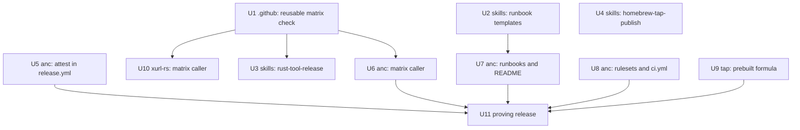
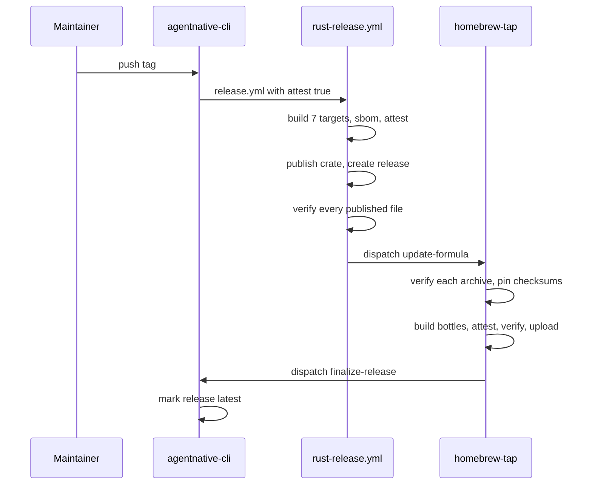

# Attested Release Pipeline - Plan

## Goal Capsule

- **Objective:** Someone who installs `anc`, from the GitHub release or from Homebrew, can verify where the binary came
  from, and the next `anc` release publishes that proof with no manual step and no failed run.
- **Means:** Adopt the release shape `xr` 4.3.0 shipped with, and move that shape into the upstream skills and templates
  (KTD1, KTD2, KTD3).
- **Authority:** The Product Contract outranks the Planning Contract, which outranks a unit. The maintainer merges every
  PR, applies every live ruleset change, cuts the release, and pushes every tag.
- **Execution profile:** All work happens in scratch clones (KTD8). Each repo's changes land as PRs under that repo's
  own flow, and a repo with several units takes them as one stack in unit order, merged in one atomic stack merge. Long
  jobs run in the background.
- **Stop conditions:** Stop and ask before a merge, a tag push, or a live ruleset change. Stop if `rust-release.yml` in
  `brettdavies/.github` would need a change. Stop at the first red run on the proving release and do not hand-edit the
  formula to get past it.
- **Who finishes:** The maintainer cuts and tags the proving release (U11). The agent prepares it and verifies the
  result.

---

## Product Contract

### Summary

`agentnative-cli` adopts the attested release pipeline: its release signs every archive and publishes an SBOM, its
Homebrew formula installs those archives instead of compiling, and the tap signs the bottles. A pre-tag build of every
release target and tighter branch protection catch failures before a tag exists. The upstream skills and templates take
the same standard, and a pipeline-only release proves the whole chain.

### Problem Frame

An `anc` release gives a user nothing to verify. Checked on 2026-10-07: `gh attestation verify` finds no attestation for
a v0.6.0 archive, `brew verify` reports "attestation not found" for all four bottles, and `gh release verify v0.6.0`
reports none. The Homebrew formula compiles the source tarball with a Rust toolchain.

`xurl-rs` closed the same gap with v4.3.0. Its release caller passes `attest: true`, its formula installs the release's
prebuilt archives, and the tap verifies each archive before pinning it and signs the bottles it builds.
`agentnative-cli` calls the same reusable release workflow without the input, so the mechanism exists and is unused.

Two more gaps would let a release fail after its tag is pushed. Nothing builds the seven release targets before a tag
exists, and `dev` requires no status checks, so a change that breaks the Windows target or trips `cargo deny` can reach
`main` and fail only in `release.yml`.

The upstream skills that set up a new repo predate all of this. `rust-tool-release` carries stale copies of the reusable
workflows (its release copy is 282 lines against 659 live), and its release caller template has no `attest` input. A
repo scaffolded today starts behind the standard.

### Key Decisions

- **Bottles stay for `anc` and are signed.** (session-settled: user-directed; chosen over dropping bottle builds now:
  the maintainer will remove bottle builds from both repos as one follow-up once `anc` is on this standard.) Governs R3.
- **The formula converts ahead of the proving release, pinned to v0.6.0's archives.** (session-settled: user-approved;
  chosen over converting in the same motion as the release: `xr` did the same with 4.2.1, and it leaves the release
  itself with one new thing to prove.) Governs R2.
- **v0.6.0's archives and bottles are not signed after the fact.** (session-settled: user-approved; chosen over
  rebuilding the 0.6.0 bottles and over attesting the existing files in place: an attestation made later would vouch for
  a build that run did not do, and the proving release makes it moot.) Governs R1, R3.
- **A pipeline-only release is the proving run.** (session-settled: user-approved; chosen over proving the pipeline on
  the next feature release: a release with no product change isolates a pipeline failure.) Governs R9.
- **Branch protection adopts the standard's optional hardening.** (session-settled: user-approved; chosen over leaving
  the baseline: two of the unrequired checks guard failures that otherwise surface only at tag time.) Governs R5.
- **The upstream skills and templates are in scope.** (session-settled: user-directed; chosen over fixing
  `agentnative-cli` alone: the next repo should start at this standard.) Governs R7, R8.

### Requirements

**Release signing**

- R1. An `anc` release publishes a build-provenance attestation for every archive and for `sha256sum.txt`, and an SBOM
  attestation against the archives, signed by the shared release workflow. The Homebrew dispatch is withheld when a
  published file fails verification.
- R2. The Homebrew formula for `anc` installs the release's prebuilt archive for the user's platform and compiles
  nothing. `--HEAD` still builds from source.
- R3. The tap verifies each archive's attestation before pinning its checksum, and signs and verifies the bottles it
  builds from those archives.

**Failures surface before a tag**

- R4. Every release target builds on each `release/**` branch, and whenever the dependency graph or the toolchain pin
  changes.
- R5. `dev` requires the CI checks that run on every PR. `main` additionally requires the Windows, advisories, and
  shellcheck checks.

**Documentation**

- R6. The runbooks say what the signing input is load-bearing for, name the archives the formula depends on, and carry
  the postflight verification commands. The README tells a user how to verify a download.

**Upstream standard**

- R7. The upstream skills and templates describe and scaffold this pipeline, so a repo set up or re-vendored from them
  gets it without hand edits.
- R8. The pre-tag build check has one definition that every repo using it calls.

**Proof**

- R9. On the proving release, `release.yml` finishes green with its attestation and verification jobs, the tap bumps the
  formula and signs the bottles with no manual step,
  `gh attestation verify --signer-workflow brettdavies/.github/.github/workflows/rust-release.yml` passes on a
  downloaded archive, and `brew verify --os=all --arch=all brettdavies/tap/agentnative` reports a valid attestation for
  every bottle.

### Scope Boundaries

- The plan prepares and verifies the proving release. Cutting it, merging it, and pushing its tags stay with the
  maintainer.
- `rust-release.yml` in `brettdavies/.github` is not changed. It already carries the `attest` input and its jobs.
- No product change to `anc`, and no change to the open feature stacks in `agentnative-cli`.

**Considered and not built**

- A build-only mode on `rust-release.yml` for the pre-tag check. It would remove any chance of drift between the check
  and the release build, but it changes the job graph of the workflow every release depends on. Evidence that would
  change the call: the two matrices drifting despite the parity check in U1.
- A drift check between `rust-tool-release` and the live reusable workflows. KTD3 removes the copies instead, which
  leaves nothing to drift.

#### Deferred to Follow-Up Work

- Remove bottle builds from both `xurl-rs` and `agentnative-cli`, as one change to the tap applied to both formulae.
- `bird`: its formula is source-built and its release unattested. It takes this standard on its next re-vendor from the
  updated templates.
- GitHub's own release attestations (`gh release verify`), which need immutable releases turned on. Neither repo uses
  them.
- Pin `dtolnay/rust-toolchain` to a commit in `rust-ci.yml`, `rust-release.yml`, and `rust-lib-release.yml`. All three
  reference the mutable `@stable` ref, so the attested build installs its toolchain through an action that can change
  under it. It is deferred because the scope above leaves `rust-release.yml` untouched until the proving release has
  run.

### Open Questions

- **Version of the proving release.** The maintainer picks it. Blocks U11; nothing else waits on it.
- **Whether the open product stacks merge before the proving release.** If they do, the release is no longer
  pipeline-only. Blocks U11 only.

---

## Planning Contract

### Key Technical Decisions

- KTD1. **Templates first, repos derive.** The attestation and prebuilt-formula text enters `github-repo-setup`'s
  `RELEASES*.md` templates in generic form, lifted from `xurl-rs`'s runbooks, and `agentnative-cli`'s runbooks derive
  from the templates. The fleet rule is that a repo's copy derives from the template; writing `anc`'s text by hand would
  leave two hand-written variants and a template that matches neither.
- KTD2. **The pre-tag build check is a reusable workflow in `brettdavies/.github` with thin callers.** `xurl-rs` carries
  it today as a standalone 117-line workflow with its own copy of the target matrix. Copying it into `agentnative-cli`
  would make three matrices to keep equal: two checks and the release build. One reusable beside `rust-release.yml` puts
  both matrices in one repo, where a parity check can hold them equal. Triggers stay in each caller, because path
  filters are per repo. This did not need a bake-off: both alternatives are fully specified already, and the choice is
  reversible by replacing a caller.
- KTD3. **`brettdavies/.github` is the only home of the reusable workflows.** `rust-tool-release` stops carrying copies
  of `rust-ci.yml`, `rust-release.yml`, and `rust-finalize-release.yml` and points at the live files. The copies are
  128, 282, and 51 lines against 267, 659, and 81 live, and nothing deploys from them: every repo calls the reusables by
  reference. Refreshing them would keep a second record that goes stale again.
- KTD4. **The formula mirrors `Formula/xurl-rs.rb`.** Per-platform `url` and `sha256` pairs under `on_macos` and
  `on_linux`, the musl archives on Linux, a `head` block that builds with cargo, completions generated from the
  installed binary, and the existing `test do` block. The v0.6.0 `bottle do` block stays until the next bump rewrites
  it, so current installs keep pouring the existing bottles.
- KTD5. **`dev` requires only the contexts that report on every PR.** That is fmt/clippy/test, the Windows check, the
  package check, both security audits, and shellcheck. `ci / Changelog`, the three guards, and any path-filtered job
  stay out, because a required check that never reports leaves a PR pending forever
  (`github-repo-setup/references/branch-protection.md`). `ci.yml` passes `advisories_blocking: true` so a run's summary
  agrees with the gate, as `xurl-rs` does. The standard treats the advisories check as a per-repo choice because an
  advisory published overnight blocks unrelated merges; that cost is accepted here under the branch-protection decision
  above (R5). `dev` does not require a branch to be up to date before merging, and keeps its admin bypass, both as in
  `xurl-rs`: an up-to-date rule would re-run every open stack after each merge beneath it, and the bypass is what lets
  planning documents push to `dev` directly.
- KTD6. **Rulesets change as committed JSON, then live on the maintainer's instruction.** Live rulesets gate other
  sessions' open stacks (#97–#106, #149–#152), so the apply is timed by the maintainer after the JSON merges, and the
  read-back must equal the committed file.
- KTD7. **Order across repos.** The reusable and the templates land first, then the `agentnative-cli` PRs, then the tap
  formula, then the live rulesets, then the proving release. Two orderings are hard constraints: the formula conversion
  is on tap `main` before the proving tag, or the bump takes the source path; and the release after the conversion
  carries `attest: true`, or the tap refuses the bump.
- KTD8. **Scratch clones only.** The `agentnative-cli` checkout under the maintainer's dev directory is on another
  session's feature branch, and the `agent-skills` checkout is the live skills directory: the skills path is a symlink
  to that working tree, so switching its branch changes the skills every running session loads. Every repo in this plan
  is worked from a fresh clone, and nothing is committed or checked out in a shared checkout.

### High-Level Technical Design

Dependency order across the five repos:

The proving release, end to end:

### Sources & Research

- `xurl-rs` is the reference: `.github/workflows/release.yml`, `.github/workflows/release-matrix-check.yml`,
  `RELEASES.md` § Tagging and publishing, `RELEASES-POSTFLIGHT.md`, and the install section of
  `crates/xurl-cli/README.md`.
- `brettdavies/.github`: `rust-release.yml` runs `sbom`, `attest`, and `verify-attestations` only when `inputs.attest`
  is true. `attest` and `verify-attestations` declare no permissions of their own, so a caller that does not opt in
  still starts. The README's `rust-release.yml` section names the caller permissions.
- `brettdavies/homebrew-tap`: `update-formula.yml` detects a prebuilt formula by its `releases/download/` URLs and
  verifies each archive before pinning it. It takes the repo from the dispatch payload and the archive names from the
  formula's URLs, and it fails when the formula file does not exist. `publish.yml` attests and verifies bottles for
  every formula.
- `brettdavies/.github` takes PRs on `main` only, and every caller pins `@main`. `rust-ci.yml` runs on every PR in
  `agentnative-cli` with no path filter, so each of its jobs reports on a documentation-only PR.
- `agent-skills`: `github-repo-setup/references/branch-protection.md` documents required checks on `dev` as optional and
  the advisories check as two independent levers. `github-repo-setup/templates/required-checks.json` is the standard for
  `main`.
- GitHub checks every permission a called workflow's jobs name against the caller's grant before any job starts
  (`docs/solutions/workflow-issues/reusable-workflow-permissions-are-validated-before-any-job-starts.md`). For that
  reason `rust-release.yml`'s `attest` job names none and takes the caller's token, so a caller that sets `attest: true`
  without granting `attestations: write` starts normally and fails in that job, after the tag is pushed and before
  anything is published.
- The tap's bottle pipeline and its `brew pr-pull` pitfalls:
  `docs/solutions/architecture-patterns/homebrew-all-bottle-publishing-pipeline-architecture-2026-04-20.md` and
  `docs/solutions/best-practices/no-flags-are-pipeline-circuit-breakers-read-source-2026-04-20.md`.
- Thin callers over one parameterized reusable:
  `docs/solutions/architecture-patterns/shared-parameterized-reusable-workflows.md`.
- External research was not run. The reference implementation shipped the same week on the same infrastructure.

---

## Implementation Units

| Unit | Title                                               | Repo                  | Depends on         |
| ---- | --------------------------------------------------- | --------------------- | ------------------ |
| U1   | Reusable pre-tag build check                        | `brettdavies/.github` | none               |
| U2   | Runbook templates carry the attested pipeline       | `agent-skills`        | none               |
| U3   | `rust-tool-release` matches the live pipeline       | `agent-skills`        | U1                 |
| U4   | `homebrew-tap-publish` teaches the prebuilt formula | `agent-skills`        | none               |
| U5   | Release caller signs its archives                   | `agentnative-cli`     | none               |
| U6   | Pre-tag build check caller                          | `agentnative-cli`     | U1                 |
| U7   | Runbooks and README describe the pipeline           | `agentnative-cli`     | U2                 |
| U8   | Branch protection and blocking advisories           | `agentnative-cli`     | none               |
| U9   | Formula installs the prebuilt archive               | `homebrew-tap`        | none               |
| U10  | `xurl-rs` calls the shared build check              | `xurl-rs`             | U1                 |
| U11  | Proving release                                     | `agentnative-cli`     | U5, U6, U7, U8, U9 |

### U1. Reusable pre-tag build check

- **Goal:** One workflow in `brettdavies/.github` builds every release target without releasing, callable from any Rust
  CLI repo.
- **Requirements:** R4, R8
- **Dependencies:** none
- **Repo:** `brettdavies/.github`
- **Files:** `.github/workflows/rust-release-matrix-check.yml` (create), `scripts/check-release-matrix-parity.sh`
  (create), `.github/workflows/lint.yml` (modify), `README.md` (modify)
- **Approach:**
  1. Lift the build steps from `xurl-rs`'s standalone workflow into a `workflow_call` workflow that takes no inputs. The
     release build compiles with no caller input (`crate` and `bin` only name the archive), and no repo passes
     `windows_nasm` today.
  2. Pin every action to a commit, as the standalone workflow already does.
  3. Leave triggers and concurrency to the caller (KTD2).
  4. Add a parity check, run as a job in `lint.yml` beside the concurrency check, that fails when this workflow's target
     list differs from the build matrix in `rust-release.yml`.
  5. Document the workflow in the README beside `rust-release.yml`, with a caller example.
  6. Land it on `main`, the only branch this repo takes PRs on and the ref every caller pins, before U6 or U10 opens: a
     caller's own PR run resolves the workflow at `@main`.
- **Patterns to follow:** `rust-release.yml`'s build job for the matrix and the cross rows; the README's existing
  per-workflow sections.
- **Test scenarios:**
  - A caller on a scratch branch of a consuming repo runs all seven targets green.
  - The parity check passes on the repo as committed.
  - The parity check fails when a target is removed from either list.
- **Verification:** Both callers in U6 and U10 build seven targets from this workflow, and the lint workflow runs the
  parity check on every PR.

### U2. Runbook templates carry the attested pipeline

- **Goal:** A repo seeded from `github-repo-setup` gets runbooks that describe signing, the prebuilt formula, and the
  postflight verification.
- **Requirements:** R6, R7
- **Dependencies:** none
- **Repo:** `agent-skills`
- **Files:** `github-repo-setup/templates/RELEASES.md`, `github-repo-setup/templates/RELEASES-PREFLIGHT.md`,
  `github-repo-setup/templates/RELEASES-POSTFLIGHT.md`, `github-repo-setup/templates/RELEASES-RATIONALE.md`,
  `github-repo-setup/references/release-pipeline.md`, `github-repo-setup/references/reusable-workflows.md`,
  `github-repo-setup/references/template-catalog.md`, `github-repo-setup/scripts/seed-repo-files.sh`
- **Approach:**
  1. Move the attestation rows of the pipeline table, the paragraph on the archives the formula depends on, the two
     postflight checks, and the rationale paragraph on the pre-tag build check from `xurl-rs`'s runbooks into the
     templates, using the placeholders the templates already use for the crate, the binary, and the repo slug.
  2. Say in the new text that it applies to a repo whose release caller passes `attest: true`, so a repo that does not
     sign knows to drop it.
  3. Add the `attest` input, its caller permission, and the pre-tag build check to the references.
  4. Name any placeholder the new text adds in the seed script's closing list of what still needs a human pass.
- **Patterns to follow:** `xurl-rs` `RELEASES.md` § Tagging and publishing and `RELEASES-POSTFLIGHT.md`; the tap's
  `RELEASES-RATIONALE.md` § "Why a prebuilt formula's archives are verified before they are pinned".
- **Test scenarios:**
  - Seeding into a temporary repo copies the four runbooks byte for byte from the templates, as it does today.
  - Every placeholder in the new sections is one the templates already used, or is named in the seed script's closing
    list.
  - The existing template and drift tests still pass.
- **Verification:** `agentnative-cli`'s runbooks in U7 derive from these templates with no hand-written attestation
  text.

### U3. `rust-tool-release` matches the live pipeline

- **Goal:** The release standard skill describes the pipeline that runs today and scaffolds a caller that signs.
- **Requirements:** R7, R8
- **Dependencies:** U1
- **Repo:** `agent-skills`
- **Files:** `rust-tool-release/SKILL.md`, `rust-tool-release/templates/release.yml`,
  `rust-tool-release/templates/release-matrix-check.yml` (create), `rust-tool-release/templates/rust-ci.yml` (delete),
  `rust-tool-release/templates/rust-release.yml` (delete), `rust-tool-release/templates/rust-finalize-release.yml`
  (delete), `rust-new-repo/scripts/scaffold.sh`, `rust-new-repo/SKILL.md`
- **Approach:**
  1. Replace the three reusable copies with a pointer table to `brettdavies/.github` (KTD3), and correct the sentence
     that says the templates deploy there.
  2. Give the release caller template `attest: true`, the `attestations: write` permission, and the musl inputs.
  3. Add the thin caller for U1's workflow and have the scaffold copy it.
  4. Rewrite the release sections of `SKILL.md` against the live workflow: seven targets, a non-draft release that
     `finalize-release` later marks latest, the SBOM, attest, and verify jobs, and the prebuilt formula as the Homebrew
     standard.
- **Patterns to follow:** `xurl-rs`'s `release.yml` caller; `github-repo-setup/references/reusable-workflows.md` for how
  the fleet describes a reusable by pointer.
- **Test scenarios:**
  - Scaffolding a new repo into a temporary directory yields a `release.yml` that passes `attest: true` and grants
    `attestations: write`.
  - The scaffolded repo carries `release-matrix-check.yml`, and `actionlint` passes on every scaffolded workflow.
  - No file in the skills repo names a deleted template except the pointer table.
- **Verification:** A reader of `SKILL.md` finds no statement the live `rust-release.yml` contradicts.

### U4. `homebrew-tap-publish` teaches the prebuilt formula

- **Goal:** Setting up Homebrew distribution for a new tool starts from a formula that installs attested archives.
- **Requirements:** R7
- **Dependencies:** none
- **Repo:** `agent-skills`
- **Files:** `homebrew-tap-publish/SKILL.md`, `homebrew-tap-publish/templates/formula-prebuilt.rb` (create),
  `homebrew-tap-publish/templates/homebrew-dispatch-job.yml`, `homebrew-tap-publish/references/conventions.md`
- **Approach:**
  1. Make the prebuilt formula the standard, and keep the source-build formula as the form a new tool is pre-seeded with
     and the form for a release that is not attested.
  2. Say that a caller of `rust-release.yml` gets the dispatch from the reusable, and keep the hand-added dispatch job
     only as the path for a release workflow that does not call it.
  3. State the ordering constraint from KTD7, and the order for a tool with no release yet. The tap cannot pre-seed a
     prebuilt formula: its formula update fails when the formula file does not exist, and its bottle job skips only the
     source-form `v0.0.0` placeholder. So a new tool pre-seeds a source-build formula, releases once with
     `attest: true`, and then converts, pinned to that release.
  4. Describe what the tap's CI does now: verify archives on a bump, attest and verify bottles on publish.
- **Patterns to follow:** `Formula/xurl-rs.rb` on the tap; the tap's `RELEASES.md` table that distinguishes the two
  formula forms.
- **Test scenarios:**
  - The formula template, filled for a sample crate, passes `brew style`.
  - The filled template names four archives: two `apple-darwin` and two `linux-musl`.
- **Verification:** U9's formula can be produced from the template with only names and checksums changed.

### U5. Release caller signs its archives

- **Goal:** `agentnative-cli`'s release attests what it builds.
- **Requirements:** R1
- **Dependencies:** none
- **Repo:** `agentnative-cli`
- **Files:** `.github/workflows/release.yml`
- **Approach:** Add `attestations: write` to the caller's permissions and `attest: true` to its inputs in one change,
  keeping `linux_musl_required` and `linux_musl_verify_alpine`. The PR's changelog entry tells users the archives are
  attested and how to verify one, and the PR is typed `feat`: the changelog generator drops a `ci` commit, which would
  leave the proving release with no entry.
- **Patterns to follow:** `xurl-rs`'s `release.yml`.
- **Test scenarios:** Test expectation: none -- two lines of caller configuration; `actionlint` checks the syntax and
  U11 proves the behavior.
- **Verification:** The caller differs from `xurl-rs`'s only by crate, binary, changelog path, and the Alpine check.

### U6. Pre-tag build check caller

- **Goal:** Every `anc` release target builds before a tag exists.
- **Requirements:** R4
- **Dependencies:** U1
- **Repo:** `agentnative-cli`
- **Files:** `.github/workflows/release-matrix-check.yml` (create)
- **Approach:** A thin caller of U1's workflow that runs on `release/**` pushes, on PRs that touch `Cargo.toml`,
  `Cargo.lock`, `rust-toolchain.toml`, or the workflow itself, and on manual dispatch.
- **Patterns to follow:** U3's caller template; `xurl-rs`'s trigger block.
- **Test scenarios:**
  - The PR that adds the caller triggers it through its own path filter, and all seven targets build.
  - A PR that touches only documentation does not trigger it.
- **Verification:** The proving release branch in U11 shows seven green rows before the tag.

### U7. Runbooks and README describe the pipeline

- **Goal:** `agentnative-cli`'s documents match the pipeline it now runs.
- **Requirements:** R6
- **Dependencies:** U2
- **Repo:** `agentnative-cli`
- **Files:** `RELEASES.md`, `RELEASES-PREFLIGHT.md`, `RELEASES-POSTFLIGHT.md`, `RELEASES-RATIONALE.md`, `README.md`
- **Approach:**
  1. Derive the release sections from U2's templates (KTD1).
  2. Give the README's install section the prebuilt Homebrew install and the two verification commands.
  3. Have the README name 0.6.0 as the last release without attestations, which holds whatever version the proving
     release takes.
- **Patterns to follow:** The install and verify section of `xurl-rs`'s `crates/xurl-cli/README.md`.
- **Test scenarios:**
  - Markdown lint and the repo's prose check pass.
  - Every command the new text shows is run once in U11 and behaves as written.
- **Verification:** A diff of the release sections against U2's templates shows only project names and project-specific
  rows.

### U8. Branch protection and blocking advisories

- **Goal:** A red check blocks a merge to `dev`, and `main` requires the checks that guard release-time failures.
- **Requirements:** R5
- **Dependencies:** none
- **Repo:** `agentnative-cli`
- **Files:** `.github/rulesets/protect-dev.json`, `.github/rulesets/protect-main.json`, `.github/workflows/ci.yml`,
  `RELEASES.md` (§ Branch protection)
- **Approach:**
  1. Add the required contexts to both ruleset files per KTD5, after confirming each one reports on a documentation-only
     PR.
  2. Pass `advisories_blocking: true` in `ci.yml`.
  3. Update the lists in the runbook's branch-protection section.
  4. After the PR merges, apply both rulesets live on the maintainer's instruction and read them back (KTD6).
- **Execution note:** The live apply is a separate, maintainer-gated step. Do not apply from an unmerged branch.
- **Patterns to follow:** `xurl-rs`'s `.github/rulesets/`; `github-repo-setup/references/branch-protection.md` for the
  exclusions.
- **Test scenarios:**
  - Each context string in the committed files equals a check name that reported on a recent PR, character for
    character.
  - After the live apply, each ruleset read back from the API equals its committed file.
  - An open PR with a failing required check shows as blocked for `dev`.
  - A documentation-only PR is not left pending on a context that never reports.
- **Verification:** The live rulesets and the committed JSON agree, and no open PR is stuck on a missing context.

### U9. Formula installs the prebuilt archive

- **Goal:** `brew install brettdavies/tap/agentnative` installs the release's archive and compiles nothing.
- **Requirements:** R2, R3
- **Dependencies:** none
- **Repo:** `homebrew-tap`
- **Files:** `Formula/agentnative.rb`
- **Approach:**
  1. Rewrite the formula in the shape KTD4 names, pinned to v0.6.0's four archives with their checksums from that
     release's `sha256sum.txt`.
  2. Land it on tap `main` under the tap's main-first rule for formula files, with the exempt commit type that rule
     requires.
  3. Backport to tap `dev` with the tap's sync script, and confirm the tap's drift gate passes.
- **Patterns to follow:** `Formula/xurl-rs.rb`; tap PR #142, which did the same for `xurl-rs`.
- **Test scenarios:**
  - The tap's CI builds and tests the formula on all four runners.
  - Installing without a bottle on Linux x86_64 puts the musl `anc` on the path, and `anc --version` prints 0.6.0.
  - `brew test agentnative` passes.
  - `brew install --HEAD` builds from source with cargo.
- **Verification:** The formula's four checksums equal v0.6.0's `sha256sum.txt`, and the tap's `update-formula.yml`
  detects the formula as prebuilt.

### U10. `xurl-rs` calls the shared build check

- **Goal:** `xurl-rs` drops its own copy of the build matrix.
- **Requirements:** R8
- **Dependencies:** U1
- **Repo:** `xurl-rs`
- **Files:** `.github/workflows/release-matrix-check.yml`, `RELEASES-RATIONALE.md` (the paragraph that describes the
  check)
- **Approach:** Replace the workflow's body with the thin caller, keeping its triggers and concurrency group, and name
  the shared workflow where the rationale describes the check.
- **Patterns to follow:** U3's caller template.
- **Test scenarios:**
  - The PR triggers the check through the workflow-file path filter, and all seven targets build.
  - No required check on `dev` or `main` names a job this change renames.
- **Verification:** The repo carries no target matrix of its own.

### U11. Proving release

- **Goal:** The first attested `anc` release ships and every claim in R9 is observed.
- **Requirements:** R1, R2, R3, R9
- **Dependencies:** U5, U6, U7, U8, U9
- **Repo:** `agentnative-cli`
- **Files:** `Cargo.toml`, `Cargo.lock`, `CHANGELOG.md` (through the cut script)
- **Approach:**
  1. Confirm U9 is on tap `main` and U5 is on `dev` (KTD7).
  2. Cut the release branch with the repo's cut script at the version the maintainer picks, and run the full preflight.
  3. Read the documents that ship against the release build before the PR to `main` opens.
  4. The maintainer merges and pushes the tag. Follow `release.yml`, the tap's bump and bottle runs, and
     `finalize-release` to the end.
  5. Run postflight, then the two verification commands in R9, then the sync back to `dev`.
- **Execution note:** Every merge and the tag push are the maintainer's. Stop at the first red run and diagnose; do not
  re-run a publish step or edit the formula by hand.
- **Patterns to follow:** The `xurl-rs` v4.3.0 release, which ran this chain on 2026-10-07.
- **Test scenarios:**
  - `release.yml` finishes with `attest` and `verify-attestations` green.
  - The tap's formula update verifies four archives and opens its bump PR with checksums equal to the release's
    `sha256sum.txt`.
  - The tap publishes four bottles, each with a valid attestation.
  - `gh attestation verify` without `--signer-workflow` fails on an archive, which confirms the documented command is
    the one that works.
  - Postflight passes for the tag once the sync PR merges.
- **Verification:** R9 holds, observed on the published release and not inferred from green runs.

---

## Verification Contract

| Gate                | Command or check                                                                                                                              | Applies to                                           |
| ------------------- | --------------------------------------------------------------------------------------------------------------------------------------------- | ---------------------------------------------------- |
| Workflow lint       | `actionlint`                                                                                                                                  | U1, U3, U5, U6, U8, U10                              |
| Matrix parity       | the parity check from U1, in `brettdavies/.github`'s lint workflow                                                                            | U1                                                   |
| Skill tests         | `bats github-repo-setup/tests` and the skills repo's markdown lint                                                                            | U2, U3, U4                                           |
| Local CI mirror     | `scripts/hooks/pre-push`                                                                                                                      | every `agentnative-cli` and `xurl-rs` PR before push |
| Prose               | `scripts/prose-check.sh` and markdown lint                                                                                                    | U7                                                   |
| Tap CI              | `brew test-bot` on the formula PR, then the tap's drift gate                                                                                  | U9                                                   |
| Ruleset read-back   | `gh api repos/brettdavies/agentnative-cli/rulesets/<id>` equals the committed file                                                            | U8                                                   |
| Release preflight   | `scripts/release/preflight.sh all`                                                                                                            | U11                                                  |
| Release postflight  | `scripts/release/postflight.sh --tag <tag> all`                                                                                               | U11                                                  |
| Archive attestation | `gh attestation verify <archive> --repo brettdavies/agentnative-cli --signer-workflow brettdavies/.github/.github/workflows/rust-release.yml` | U11                                                  |
| Bottle attestation  | `brew verify --os=all --arch=all brettdavies/tap/agentnative`                                                                                 | U11                                                  |

A CI run counts as green only when every check's conclusion is read from the rollup, not from a watcher's exit code.

---

## Definition of Done

- R9 holds on the published proving release.
- Every PR in U1 through U10 is merged by the maintainer, and each repo's CI is green on the merge.
- The live rulesets on `agentnative-cli` equal the committed JSON.
- `agentnative-cli`'s `dev` is synced with the release, and its postflight passes.
- The skills changes are on `agent-skills` `main`, and the live skills checkout is fast-forwarded to that commit on the
  maintainer's go-ahead, since that working tree is what every session loads.
- No scratch branch, scratch caller, or probe workflow from this work remains on any remote.

---

## Risks & Dependencies

| Risk                                                                                                                                                                          | Mitigation                                                                                                                                                                                                |
| ----------------------------------------------------------------------------------------------------------------------------------------------------------------------------- | --------------------------------------------------------------------------------------------------------------------------------------------------------------------------------------------------------- |
| The caller sets `attest: true` without `attestations: write`, and the `attest` job fails with the tag already pushed.                                                         | U5 adds both in one change and compares the caller with `xurl-rs`'s.                                                                                                                                      |
| The proving tag is pushed before the formula conversion is on tap `main`, so the bump takes the source path.                                                                  | KTD7 orders it, and U11's first step checks it.                                                                                                                                                           |
| `anc`'s release differs from `xr`'s in ways the first attested run has not seen: the Alpine check, a single-crate layout, and a formula name that differs from the repo slug. | All three ran green for v0.6.0 without signing. The signing jobs take no input that differs, and the tap takes the repo slug from the dispatch payload and the archive names from the formula's own URLs. |
| The live ruleset apply blocks other sessions' open stacks.                                                                                                                    | The maintainer times the apply (KTD6), and U8 lists which open PRs are red beforehand.                                                                                                                    |
| A RustSec advisory published overnight blocks unrelated merges.                                                                                                               | Accepted under the branch-protection decision. The admin bypass remains for an urgent merge.                                                                                                              |
| The shared build check's matrix drifts from the release build's.                                                                                                              | U1's parity check fails the `.github` lint run.                                                                                                                                                           |
| The new template sections confuse repo types that never sign a release.                                                                                                       | U2's text states the condition it applies under, so such a repo drops it during the human pass.                                                                                                           |

The plan depends on `brettdavies/.github`'s `rust-release.yml` staying as it is, on the tap's `update-formula.yml` and
`publish.yml` as they ran for `xurl-rs` v4.3.0, and on the maintainer for every merge, tag, and live ruleset change.

---

## Documentation / Operational Notes

- `brew verify` needs the real `gh` binary first on the path on a machine where a `gh` wrapper shadows it; Homebrew runs
  `gh` under a filtered environment the wrapper cannot resolve.
- The postflight `tap` gate can report a skip when its run-list query returns nothing. Re-run that gate before reading
  it as a miss.
- Rollback for a bad proving release follows the runbook: yank the crate, re-point the latest release, revert the
  formula bump on the tap, then land the fix through the normal flow.
