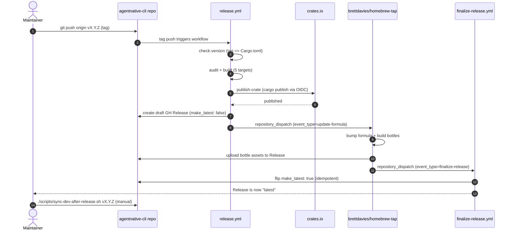

# Cross-repo sync map

How spec / skill / coverage data flows in and out of this repo. Source of truth for sync mechanisms. Update when scripts
or workflows change.

This file complements the per-script header comments (which document mechanism + env vars) and the prose in
`RELEASES.md` / `CLAUDE.md` / `AGENTS.md` (which document a single sync point in context). The job here is to lay every
sync edge out in one table so the system is legible at a glance.

## Cross-repo data map

```mermaid
flowchart LR
    subgraph Inbound["Inbound — data INTO this repo"]
        SPEC["agentnative-spec<br/>(principles + VERSION + CHANGELOG)"]
        SITE_IN["agentnative-site<br/>src/data/skill.json"]
        MAIN["self: main branch<br/>(Cargo.toml, Cargo.lock, CHANGELOG)"]
    end

    CLI(["agentnative-cli<br/>(this repo)"])

    subgraph Outbound["Outbound — data OUT of this repo"]
        SITE_COV["agentnative-site<br/>coverage-matrix.json"]
        SITE_SCORE["agentnative-site<br/>per-tool scorecards"]
        TAP["brettdavies/homebrew-tap<br/>(formula + bottles)"]
        CRATES["crates.io<br/>(agentnative crate)"]
    end

    SPEC -->|sync-spec.sh| CLI
    SPEC -->|sync-prose-tooling.sh| CLI
    SITE_IN -->|sync-skill-fixture.sh| CLI
    MAIN -->|sync-dev-after-release.sh<br/>main → dev| CLI

    CLI -->|site's sync-coverage-matrix.sh<br/>(cli is authoritative)| SITE_COV
    CLI -->|site's regen-scorecards.sh<br/>(anc audit ... --output json)| SITE_SCORE
    CLI -->|release.yml<br/>repository_dispatch:update-formula| TAP
    CLI -->|release.yml<br/>cargo publish via OIDC| CRATES

    TAP -.->|repository_dispatch:finalize-release<br/>(inverse — flips make_latest)| CLI

    classDef repo fill:#1f2937,stroke:#60a5fa,color:#f9fafb
    classDef self fill:#0f766e,stroke:#5eead4,color:#f0fdfa
    class SPEC,SITE_IN,MAIN,SITE_COV,SITE_SCORE,TAP,CRATES repo
    class CLI self
```

## Upstream — data flowing INTO this repo

| Source                                                       | Mechanism                                                                 | What's synced                                                                                                                                                                                                                                                                                                                                                                            | Trigger / cadence                                                                                                                                                                                                                                 | Drift check                                                                                                                                                                                                                                                                                          |
| ------------------------------------------------------------ | ------------------------------------------------------------------------- | ---------------------------------------------------------------------------------------------------------------------------------------------------------------------------------------------------------------------------------------------------------------------------------------------------------------------------------------------------------------------------------------- | ------------------------------------------------------------------------------------------------------------------------------------------------------------------------------------------------------------------------------------------------- | ---------------------------------------------------------------------------------------------------------------------------------------------------------------------------------------------------------------------------------------------------------------------------------------------------- |
| `brettdavies/agentnative` (spec) @ latest `v*` tag           | `scripts/sync-spec.sh` (manual; remote-first, falls back to `$SPEC_ROOT`) | `principles/p*-*.md` + top-level `VERSION` + `CHANGELOG.md` → `src/principles/spec/`                                                                                                                                                                                                                                                                                                     | Rerun after every new `agentnative-spec` `v*` tag. The intended trigger is a `repository_dispatch` from the spec's publish workflow; until that exists, manual.                                                                                   | `build.rs` is *intentionally loud* — fails on missing `VERSION`, missing `principles/` dir, parse errors, duplicate IDs, or missing fields. `cargo test` (`integration::*` + `dangling_cover_ids`) catches `covers()` IDs that drift from the vendored registry.                                     |
| `brettdavies/agentnative` (spec) @ `main` HEAD               | `scripts/sync-prose-tooling.sh` (manual; `--check` mode for drift)        | `BRAND.md` + `styles/brand/` (rule pack) + `styles/config/vocabularies/brand/` (vocab) + `scripts/test-prose-check.mjs` + `scripts/generate-pack-readme.mjs`. Per-consumer config (`.vale.ini`, `styles/config/vocabularies/cli/`) authored locally; not vendored. `scripts/prose-check.sh` is consumer-owned (un-vendored 2026-05-13); see the CONSUMER-OWNED header inside the script. | Rerun after any spec `main` push touching any path in the manifest. Faster cadence than spec tags by design — this is shared tooling, not contract; tag-pinning is for the principle contract via `sync-spec.sh`. Idempotent at a fixed spec SHA. | `--check` mode compares each vendored file byte-for-byte against upstream `main` HEAD. `scripts/prose-check.sh` is consumer-owned and not part of the manifest; universal pipeline changes need coordinated PRs across spec + site + cli + skill until the spec-side sidecar-config migration lands. |
| `brettdavies/agentnative-site` `src/data/skill.json` @ `dev` | `scripts/sync-skill-fixture.sh` (manual; `--check` in CI)                 | Skill bundle manifest (install map / hosts) → `src/skill_install/skill.json`                                                                                                                                                                                                                                                                                                             | Rerun whenever the site changes `src/data/skill.json`. Pre-release checklist in `RELEASES.md` step 7 captures this for every release.                                                                                                             | `.github/workflows/skill-fixture-drift.yml` runs `sync-skill-fixture.sh --check` on every PR + push to main/dev. Companion cargo test `host_map_matches_site_skill_json` catches drift between the Rust-codegen map and this fixture.                                                                |
| this repo's own `main` branch (release artifacts)            | `scripts/sync-dev-after-release.sh vX.Y.Z` (manual; idempotent)           | `Cargo.toml` `[package].version` (surgical, single-line awk) + regenerated `Cargo.lock` (`cargo build --release`) + `CHANGELOG.md` (verbatim from `origin/main`) → `dev`                                                                                                                                                                                                                 | Run AFTER (1) `release/v*` → `main` PR merges, (2) `git tag vX.Y.Z` pushed, (3) `finalize-release.yml` flips the GitHub Release to `published`.                                                                                                   | n/a — single signed commit, surgical edits, idempotent re-run is a no-op. Pre-flight checks: working tree clean, tag exists locally, tag is reachable from `origin/main`.                                                                                                                            |

## Downstream — data flowing OUT of this repo

| Consumer                                                               | Mechanism                                                                                                                                                                                                                                  | What's synced                                                                                                                                                        | Trigger / cadence                                                                                                                                                                                                          | Drift check                                                                                                                                                                                                                                                                                                                                            |
| ---------------------------------------------------------------------- | ------------------------------------------------------------------------------------------------------------------------------------------------------------------------------------------------------------------------------------------ | -------------------------------------------------------------------------------------------------------------------------------------------------------------------- | -------------------------------------------------------------------------------------------------------------------------------------------------------------------------------------------------------------------------- | ------------------------------------------------------------------------------------------------------------------------------------------------------------------------------------------------------------------------------------------------------------------------------------------------------------------------------------------------------ |
| `brettdavies/agentnative-site` (`/coverage` page)                      | site's `scripts/sync-coverage-matrix.sh` `cp`s from `$ANC_ROOT/coverage/matrix.json` (default `$HOME/dev/agentnative-cli`) → `src/data/coverage-matrix.json`                                                                               | `coverage/matrix.json` (`schema_version: "1.0"`), generated here by `anc emit coverage-matrix`, committed as a tracked artifact (not gitignored)                 | Run on the site after this repo bumps the matrix (new check, registry change, or `Check::covers()` change).                                                                                                                | This repo's CI (via `cargo test`) runs `test_generate_coverage_matrix_drift_check_passes_on_committed_artifacts`, which invokes `anc emit coverage-matrix --check` and exits non-zero when `docs/coverage-matrix.md` or `coverage/matrix.json` disagree with the registry. Site has no automated drift check — the cli-side gate is authoritative. |
| `brettdavies/agentnative-site` (per-tool scorecards)                   | site's `scripts/regen-scorecards.sh` runs `anc audit --command <bin> [--audit-profile <profile>] --output json` against each registry entry; writes `scorecards/<name>-v<version>.json` in the site repo                                   | Per-tool scorecard JSONs (`schema_version: "0.5"`); the `anc` binary embeds `spec_version` at compile time (sourced from the vendored `src/principles/spec/VERSION`) | Run on the site after `anc` is upgraded on the box (`brew upgrade brettdavies/tap/agentnative`); also run on registry changes. Script enforces `MIN_ANC_VERSION` (currently `0.1.3`) unless `--allow-dev-build` is passed. | Site validates schema 0.5 invariants at build time (`bun test` + `bun run build`). Filename owns the canonical version anchor — the actually-installed `anc --version` determines the output filename, so a filename can never lie about which release was scored.                                                                                     |
| `brettdavies/homebrew-tap` (formula bump)                              | `.github/workflows/release.yml` → reusable `brettdavies/.github/.github/workflows/rust-release.yml@main` → `homebrew` job fires `repository_dispatch` (`event_type=update-formula`, payload: formula=`agentnative`, version=`X.Y.Z`, repo) | Triggers homebrew-tap to bump the `agentnative` formula and build bottles                                                                                            | On every `git tag v*.*.*` push to this repo. Authenticated via `CI_RELEASE_TOKEN` (fine-grained PAT with Contents R+W).                                                                                                    | n/a at this boundary. Bottle-build success is observable via the homebrew-tap workflow run; bottle-upload back to this repo's Release assets is what triggers the inverse `finalize-release` dispatch (next row).                                                                                                                                      |
| `brettdavies/agentnative-cli` (this repo's own `finalize-release.yml`) | Inverse `repository_dispatch` from homebrew-tap's publish workflow — `event_type=finalize-release`                                                                                                                                         | Bottle SHAs uploaded to this Release's assets; `make_latest` flips from `false` → `true` on the GitHub Release                                                       | Fired by homebrew-tap after bottles upload. Idempotent — re-dispatch is safe.                                                                                                                                              | n/a — the flip is observable on the Release page.                                                                                                                                                                                                                                                                                                      |
| `crates.io` (`agentnative` crate)                                      | Same `release.yml` → `publish-crate` job, `cargo publish` via OIDC Trusted Publishing (no static token after first publish)                                                                                                                | The compiled crate at the tag's version                                                                                                                              | On every `git tag v*.*.*` push. First publish requires `CARGO_REGISTRY_TOKEN` one-time; subsequent publishes are token-less.                                                                                               | `check-version` job gates the pipeline: tag must match `Cargo.toml` `[package].version` exactly, else release aborts before any publish.                                                                                                                                                                                                               |

## Release / sync orchestration

The full sync graph clusters around two events: **"new spec tag upstream"** and **"new `anc` release downstream"**.

### When `agentnative-spec` cuts a new `v*` tag

1. **Manual** — rerun `scripts/sync-spec.sh` here. Diff `src/principles/spec/`. Commit on a feature branch.
2. **Manual** — propagate any new/changed requirement IDs into `src/checks/*` `Check::covers()` declarations. The
   build's `dangling_cover_ids` drift detector forces this — typos surface at `cargo test`, not at render time.
3. **Manual** — if the registry shape or covers map changed, run `anc emit coverage-matrix` and commit
   `docs/coverage-matrix.md` + `coverage/matrix.json`. The cargo-level `--check` test fails CI otherwise.
4. **Manual on the site** — once a new `anc` version ships (see next section), rerun
   `agentnative-site/scripts/sync-coverage-matrix.sh` to pick up the new `coverage/matrix.json`.

### When `agentnative-cli` cuts a new `v*` tag

1. **Manual pre-release** (`RELEASES.md` step 7) — `bash scripts/sync-skill-fixture.sh` and review the diff. Catches any
   site-side `skill.json` changes since `dev` was branched. The Rust host map regenerates from the JSON on the next
   `cargo build` — no manual src edits.
2. **Automatic on tag push** — `release.yml` runs `check-version` → `audit` → `build` (5 targets) → `publish-crate`
   (crates.io OIDC) → `release` (draft GH Release, `make_latest: false`) → `homebrew` (`repository_dispatch` to
   homebrew-tap).
3. **Automatic, inverse** — homebrew-tap builds bottles, uploads them as assets on this repo's Release, then dispatches
   `finalize-release` back to this repo. `finalize-release.yml` flips `make_latest: true` idempotently.
4. **Manual post-release** — `./scripts/sync-dev-after-release.sh vX.Y.Z` then `git push origin dev`. Backports the
   release-bookkeeping single-commit (Cargo.toml version, regenerated Cargo.lock, CHANGELOG.md from main) to `dev` so
   future builds from `dev` report the released version and the embedded badge URL points at the right slug.
5. **Manual on the site** — `scripts/regen-scorecards.sh` against the upgraded `anc` (gated by `MIN_ANC_VERSION` =
   `0.1.3`) refreshes per-tool scorecards. Then `scripts/sync-coverage-matrix.sh` if the matrix changed.

#### Release pipeline sequence



### Cadence summary — what's automatic vs manual

| Step                                             | Automation                                                    |
| ------------------------------------------------ | ------------------------------------------------------------- |
| spec → cli (`sync-spec.sh`)                      | manual (intended: spec `repository_dispatch`, not yet wired)  |
| site → cli (`sync-skill-fixture.sh`) update      | manual; CI enforces no-drift via `--check`                    |
| cli → site (coverage matrix)                     | manual on the site side; CI enforces no-drift on the cli side |
| cli → site (scorecards)                          | manual on the site side                                       |
| cli → crates.io                                  | automatic on `v*` tag push                                    |
| cli → homebrew-tap (formula)                     | automatic on `v*` tag push                                    |
| homebrew-tap → cli (`finalize-release`)          | automatic on bottle upload                                    |
| cli main → cli dev (`sync-dev-after-release.sh`) | manual after `finalize-release` publishes                     |

## Reference

- [`scripts/sync-spec.sh`](sync-spec.sh) — header comment has detailed usage, env vars, and resync cadence.
- [`scripts/sync-prose-tooling.sh`](sync-prose-tooling.sh) — header comment covers `--check` drift mode and the
  manifest. `scripts/prose-check.sh` is consumer-owned (un-vendored 2026-05-13); its CONSUMER-OWNED header explains why
  and what coordination universal pipeline changes now require.
- [`scripts/sync-skill-fixture.sh`](sync-skill-fixture.sh) — header comment covers `--check` mode and CI integration.
- [`scripts/sync-dev-after-release.sh`](sync-dev-after-release.sh) — header comment lists pre-flight conditions.
- [`../RELEASES.md`](../RELEASES.md) — full release pipeline (branch flow, tag/publish, post-release sync).
- [`../docs/plans/2026-04-23-001-feat-spec-vendor-plan.md`](../docs/plans/2026-04-23-001-feat-spec-vendor-plan.md) —
  status: completed. The plan that originated the vendored-spec mechanism.
- agentnative-spec roadmap (parent of the spec-vendor plan):
  `agentnative-spec/docs/plans/2026-04-22-002-post-frontmatter-roadmap.md`.
-

[`../docs/solutions/architecture-patterns/cross-repo-artifact-sync-commit-over-fetch-20260420.md`](../docs/solutions/architecture-patterns/cross-repo-artifact-sync-commit-over-fetch-20260420.md)
— the "commit-over-fetch" decision that anchors why `coverage/matrix.json` is a tracked artifact rather than a
build-time fetch. -
[`../docs/solutions/best-practices/cross-repo-artifact-consumption-static-sites-2026-04-21.md`](../docs/solutions/best-practices/cross-repo-artifact-consumption-static-sites-2026-04-21.md)
— the consumer-side pattern for the site.
